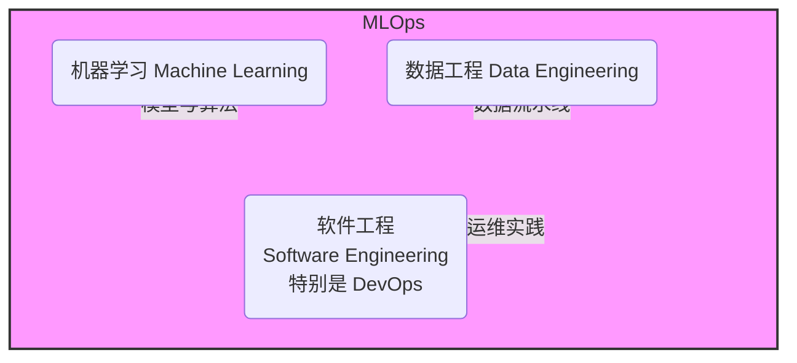
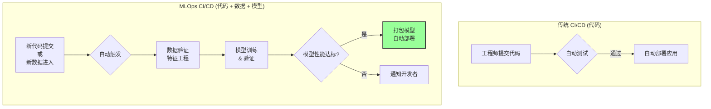
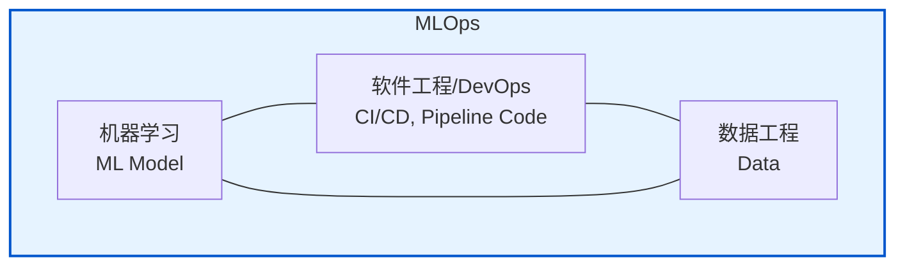
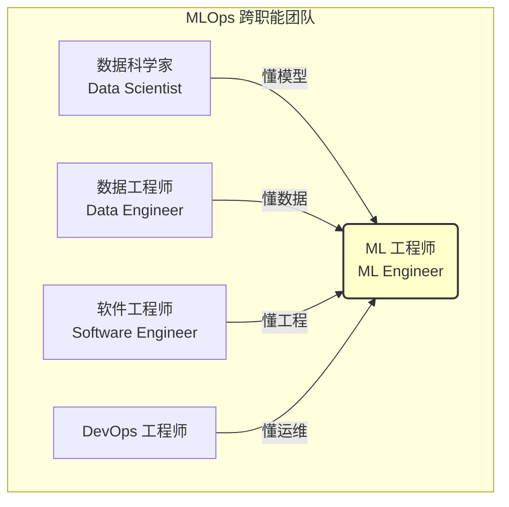
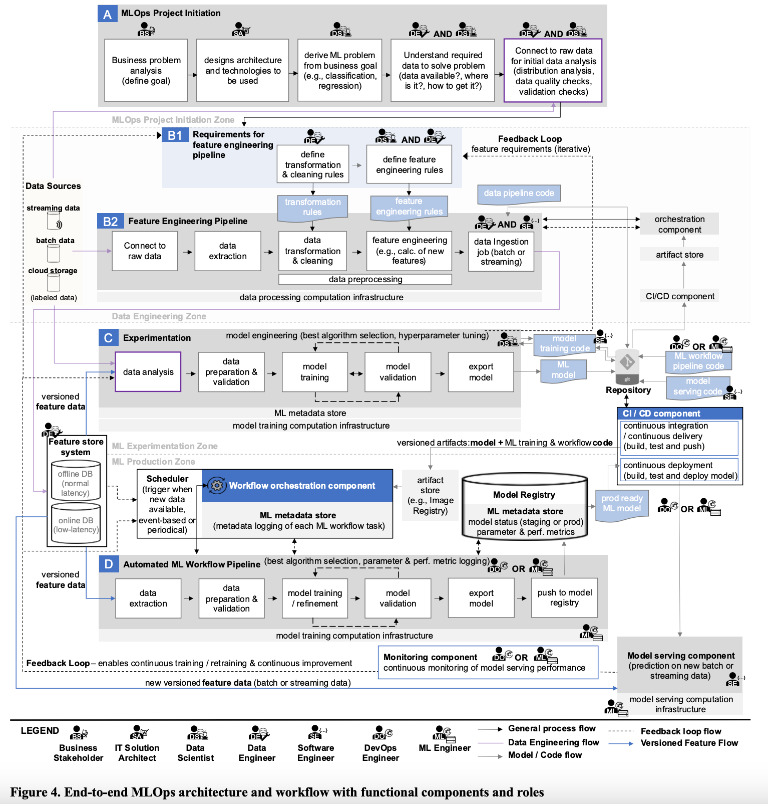
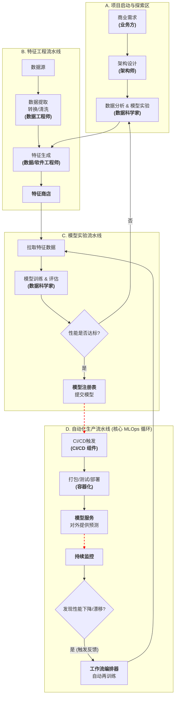

## AI论文解读 | Machine Learning Operations (MLOps): Overview, Definition, and Architecture
        
### 作者        
digoal        
        
### 日期        
2025-06-15        
        
### 标签        
PostgreSQL , PolarDB , DuckDB , AI , 论文解读        
        
----        
        
## 背景       
      
https://arxiv.org/pdf/2205.02302        
        
提示:        
```        
读懂《Machine Learning Operations (MLOps): Overview, Definition, and Architecture》这篇论文需要提前掌握哪些基础知识, 请使用中文给我讲一下这些基础知识, 尽量通熟易懂, 可以使用markdown支持的图形增加解释性.        
        
使用中文通熟易懂的解读《Machine Learning Operations (MLOps): Overview, Definition, and Architecture》这篇论文, 关键内容请深入讲解, 可以使用markdown支持的图形增加解释性.        
        
使用中文提取《Machine Learning Operations (MLOps): Overview, Definition, and Architecture》论文中一些重要的术语并详细解释, 可以使用markdown支持的图形示增加解释性.        
```        
        
## 1 前置知识 
  
好的，没问题！为了透彻地理解《Machine Learning Operations (MLOps): Overview, Definition, and Architecture》这篇论文，你需要先掌握一些基础概念。我会用通俗易懂的方式，结合图表来为你讲解。

---

## 核心概念：MLOps 的三大支柱

MLOps 并非凭空出现，它建立在机器学习、DevOps 和数据工程这三大领域交叉融合的基础之上  。你可以把它想象成一张三条腿的凳子，缺了任何一条腿都不稳。



### 1. 机器学习 (Machine Learning - ML) 🤖

这是你需要理解的第一个核心领域。

* **是什么？** 简单说，机器学习就是让计算机从**数据**中自动学习规律和模式，并利用这些规律来做预测或决策，而不需要人为编写所有规则  。
* **好比什么？** 想象一下教一个孩子识别动物。你不会告诉他“猫有四条腿、毛茸茸、有胡须”，而是会给他看很多猫的图片。他看得多了，大脑自己就学会了识别猫的“模型”。下次再看到一张新的猫的图片，他就能认出来。机器学习就是这个过程的计算机版本。
* **关键产出：模型 (Model)**。整个学习过程的产物就是一个“模型”  。你可以把它看作一个训练好的、包含了特定知识的黑盒子。给它输入新数据（比如一张新图片），它能输出一个预测结果（比如“这是猫”）。论文中反复提到的模型训练、评估、版本管理，都是围绕这个核心产出展开的。

### 2. DevOps ⚙️

这是 MLOps 名字的后半部分，也是其思想的源头。

* **是什么？** DevOps 是一种**文化**和一套**实践**，旨在打破“开发团队 (Development)”和“运维团队 (Operations)”之间的壁垒  。它的目标是**自动化**软件从开发、测试到发布的全过程，从而实现快速、频繁且可靠的软件交付  。
* **好比什么？** 想象一个高效率的披萨店。厨师（开发）和配送员（运维）紧密合作。厨师每研发出一款新口味的披萨（开发新功能），就能立刻通过一条自动化流水线进行烘焙、打包（测试、集成），并马上交给配送员送到顾客手中（部署）。如果顾客反馈不好吃（系统出 Bug），这个信息能迅速传回给厨师进行调整。DevOps 就是要建立这样一套顺畅的软件“产销”流水线。
* **核心实践：CI/CD**。这是 DevOps 中最广为人知的技术实践，代表**持续集成 (Continuous Integration)** 和 **持续交付/部署 (Continuous Delivery/Deployment)**  。这套机制是实现自动化的关键，也是 MLOps 架构中的核心组件  。

### 3. MLOps (机器学习运维) 🚀

理解了以上两者，MLOps 的概念就水到渠成了。

* **是什么？** MLOps 就是**将 DevOps 的原则和实践应用到机器学习项目的全生命周期中**  。它不仅关心代码的自动化，更关心**模型**和**数据**的自动化管理。
* **为什么需要它？** 因为机器学习项目远比传统软件复杂。传统软件发布后，功能是固定的。但机器学习模型部署后，性能会因为现实世界数据的变化而**衰退**（比如，一个为夏天训练的服装推荐模型，到了冬天效果就会变差）。这种现象叫做“模型漂移”或“概念漂移”  。MLOps 的目标就是解决这个问题，通过**持续监控、自动再训练、自动部署**，让模型能够“活到老，学到老”，持续保持高性能  。

---

## 关键技术与流程解析

论文中描述的架构和组件，都是为了实现 MLOps 的目标。以下是你需要了解的关键技术和流程，它们是构成 MLOps 流水线的“积木”。

### 1. CI/CD 流水线 (Pipeline)

这是整个自动化流程的骨架。在 MLOps 中，它被赋予了更丰富的内涵：


如上图所示，MLOps 的流水线不仅由代码触发，也可能由新数据的到来而触发  。它包含了数据处理、模型训练等特有的步骤。

### 2. 工作流编排 (Workflow Orchestration)

一个完整的机器学习流程包含很多步骤（数据提取、预处理、训练、评估等）  。工作流编排工具就是这个流程的“总导演”，它确保所有步骤按照预先设定的顺序和依赖关系（技术上称为**有向无环图 - DAG**）准确无误地执行  。

* **好比什么？** 就像菜谱，精确定义了“先洗菜、再切菜、然后下锅炒”的顺序。编排工具就是严格执行菜谱的机器人厨师。
* **论文中提到的工具：** Kubeflow Pipelines, Apache Airflow  。

### 3. 容器化 (Containerization - 如 Docker)

* **是什么？** 将一个应用（比如一个训练好的模型）和它运行所需的所有环境（代码、库、配置）一起打包到一个标准化的、隔离的“容器”中  。
* **为什么重要？** 它解决了“在我的电脑上明明能跑”的经典难题。通过容器化，可以保证模型在开发、测试、生产等任何环境中的行为都完全一致。

### 4. 容器编排 (Container Orchestration - 如 Kubernetes)

* **是什么？** 当你的应用由大量容器组成时，Kubernetes (K8s) 这样的工具可以自动化地管理它们的部署、扩缩容和运维  。
* **好比什么？** 如果说 Docker 是标准化的“集装箱”，那 Kubernetes 就是高效运转的“自动化港口”。它负责调度集装箱（容器）的装卸，确保港口（服务器集群）平稳运行。在 MLOps 中，它为模型的训练和推理服务提供了弹性、可靠的底层基础设施  。

---

## 总结：如何串联所有知识来读论文

带着以上知识，你可以这样来理解这篇论文的结构和内容：

1.  **引言 (Introduction) & 背景 (Foundations):** 作者首先会告诉你，很多机器学习项目都死在了从“实验室”到“生产环境”的路上  ，而 MLOps 就是解决这个“最后一公里”问题的良药  。
2.  **原则 (Principles):** 接着，论文会提炼出 MLOps 的核心指导思想，比如**自动化 (Automation)**、**可复现性 (Reproducibility)**、**持续监控 (Continuous Monitoring)** 等  。这些原则是你理解后续技术组件设计意图的“纲领”。
3.  **组件 (Components):** 论文会像拆解机器一样，为你展示一个典型的 MLOps 系统由哪些部件构成，例如：
    * **特征商店 (Feature Store):** 统一管理、共享和复用数据特征的地方  。
    * **模型注册表 (Model Registry):** 像图书馆一样，给所有训练好的模型版本进行编目和管理  。
    * **监控组件 (Monitoring Component):** 部署后持续盯着模型表现的“哨兵”  。
4.  **角色 (Roles) & 架构 (Architecture):** 最后，论文会说明实现 MLOps 需要哪些不同的人才（如数据工程师、ML 工程师）协同工作  ，并给出一张将所有原则、组件和角色整合在一起的**端到端架构图**  ，这通常是论文的核心精华。

当你读到这张架构图时，你之前掌握的所有基础知识就能派上用场了。你会明白，图中的每一个框、每一条线，都是为了实现某个 MLOps 原则，并由某个具体的技术组件来承载的。

希望这份导读能帮助你扫清阅读障碍，顺利地掌握这篇优秀论文的精髓！
  
## 2 解读论文  
  
好的，这篇《Machine Learning Operations (MLOps): Overview, Definition, and Architecture》是 MLOps 领域的经典论文之一。它系统性地回答了“到底什么是 MLOps？”这个问题，并提供了一套完整的蓝图。

下面我将为你通俗易懂地深入解读这篇论文的核心内容。

---

### 核心问题：为什么需要 MLOps？

 论文开篇就指出了一个行业的痛点：许多机器学习（ML）项目都取得了概念验证（Proof of Concept）的成功，但最终却未能成功上线并投入生产  。它们就像在实验室里造出的精美原型，却无法变成可以大规模生产和销售的可靠商品。

 **MLOps 的诞生正是为了解决这个从“原型”到“产品”的鸿沟**  。它旨在通过一套系统化的工程实践，将机器学习模型可靠、高效、且可扩展地应用到生产环境中。

### 论文定义：MLOps 究竟是什么？

论文通过广泛的研究，给出了一个清晰的定义：

>  MLOps (Machine Learning Operations) 是一个**综合性范式**，它包含了**最佳实践、概念集合以及一种开发文化**，旨在对机器学习产品进行端到端的构思、实施、监控、部署和扩展   。它是一门融合了**机器学习、软件工程（特别是 DevOps）和数据工程**三大领域的工程实践   。其本质目标是**弥合开发（Dev）与运维（Ops）之间的差距**，从而高效地将机器学习系统产品化  。

我们可以用一个简单的图来理解这三大领域的交集：


* **机器学习**：提供核心的算法和模型。
* **数据工程**：提供高质量、可靠的数据流水线。
* **软件工程/DevOps**：提供自动化、持续集成和部署的工程能力。

MLOps 正是这三者的粘合剂，确保模型、数据和代码能够协同、自动化地运转。

---

### 深入讲解：MLOps 的四大支柱

 论文通过系统的研究，将 MLOps 解构成四个相辅相成的核心方面：**原则、组件、角色和架构**  。理解了这四点，就掌握了 MLOps 的精髓。

#### 1. MLOps 的九大指导原则 (The "Why")

 这些原则是 MLOps 的灵魂，是构建 MLOps 系统的指导方针  。

* **P1.  CI/CD 自动化 (CI/CD Automation)**：不仅仅是代码的自动化，更包括数据验证、模型训练和部署的自动化流程  。
* **P2.  工作流编排 (Workflow Orchestration)**：将从数据处理到模型部署的每一步，通过有向无环图（DAGs）清晰地定义和调度，确保任务按序执行  。
* **P3.  可复现性 (Reproducibility)**：能够完全复现任何一次模型的训练过程和结果  。这对于调试和审计至关重要。
* **P4.  版本控制 (Versioning)**：不仅对**代码**做版本控制，更要对**数据**和**模型**做版本控制，以确保完全的可追溯性  。
* **P5.  协作 (Collaboration)**：强调跨职能团队（数据、模型、工程）的紧密合作和沟通，打破部门墙  。
* **P6.  持续训练与评估 (Continuous ML Training & Evaluation)**：基于新数据定期或自动地重新训练模型，并评估其性能，以应对数据变化  。
* **P7.  元数据追踪 (ML Metadata Tracking)**：记录和追踪每一次实验的所有相关信息，如使用的参数、性能指标、数据版本等  。
* **P8.  持续监控 (Continuous Monitoring)**：在模型部署后，持续监控其预测性能、数据分布、系统资源等，以及时发现问题  。
* **P9.  反馈循环 (Feedback Loops)**：将监控中发现的问题（如性能下降）作为信号，自动反馈给上游环节（如触发重新训练），形成一个闭环优化系统  。

#### 2. MLOps 的核心技术组件 (The "What")

 这些组件是实现上述原则的“工具箱”，是 MLOps 架构的实体构成  。

| 组件 | 功能描述 | 好比是... |
| :--- | :--- | :--- |
| **代码仓库** (Source Code Repository) |  存储和版本化所有代码，如模型训练脚本、流水线定义等  。 | 项目的“档案室” |
| **CI/CD 组件** (CI/CD Component) |  自动化执行构建、测试、部署等步骤，是自动化流程的引擎  。 | “自动化生产线” |
| **工作流编排器** (Workflow Orchestration) |  负责调度和执行整个 ML 工作流  。 | “总调度指挥官” |
| **特征商店** (Feature Store) |  集中存储、管理和提供用于模型训练和推理的特征，确保线上线下一致性  。 | “标准化的中央厨房” |
| **模型训练设施** (Model Training Infrastructure) |  提供模型训练所需的计算资源（CPU/GPU）  。 | “高性能计算中心” |
| **模型注册表** (Model Registry) |  集中存储和版本化所有训练好的模型及其元数据  。 | “模型成果展览馆” |
| **元数据存储** (ML Metadata Stores) |  记录所有实验、流水线运行的详细元数据，以实现追踪和复现  。 | “实验的航行日志” |
| **模型服务组件** (Model Serving Component) |  将模型部署为可供调用的服务（如 API），提供实时或批量预测  。 | “产品的服务窗口” |
| **监控组件** (Monitoring Component) |  持续监控已部署模型的性能和健康状况  。 | “7x24 小时巡逻哨兵” |

#### 3. MLOps 的关键参与角色 (The "Who")

 MLOps 不是一个人的战斗，它需要一个跨学科的团队来共同完成  。


 上图展示了 **ML 工程师 (或 MLOps 工程师)** 的核心地位   。这个角色是典型的“多面手”，需要融合数据科学、数据工程和软件工程的技能，负责搭建和维护整个 MLOps 基础设施和流水线  。

#### 4. MLOps 的端到端架构与工作流 (The "How")

这是论文的精华所在，它将原则、组件和角色融合成一张可执行的蓝图。下图是对论文中 Figure 4 的简化和解读，展示了从项目启动到模型在生产环境中持续运行的全过程。
  
  
  

这个工作流可以分为四个主要阶段：
1.   **项目启动 (A)**：从业务问题出发，进行技术选型和初步的模型探索  。
2.   **特征工程 (B)**：构建自动化的数据流水线，将原始数据转化为高质量的特征，并存入特征商店  。
3.   **模型实验 (C)**：数据科学家基于特征商店的数据进行模型训练和评估，并将最好的模型版本注册到模型注册表中  。
4.   **自动化生产 (D)**：这是 MLOps 的核心闭环   。新模型一旦被注册，CI/CD 系统会自动将其部署到生产环境   。部署后，监控系统持续观察其表现   。一旦发现问题（如性能下降），反馈循环会被激活，自动触发整个流水线进行再训练，从而实现模型的持续迭代和自我优化  。

---

### 结论与启示

这篇论文系统地定义了 MLOps，并提供了一个全面的、可操作的框架。其核心启示是：
*  **文化先行**：成功的 MLOps 需要从“模型驱动”转向“产品驱动”的文化变革，强调协作和工程卓越  。
*  **自动化是关键**：通过端到端的自动化，减少人工干预，提高效率和可靠性  。
* **整体性思维**：必须将模型、数据、代码和基础设施视为一个统一的、动态的系统来设计和管理。

总而言之，这篇论文为任何希望将机器学习能力转化为实际生产力的组织和个人，提供了一份宝贵的“导航地图”。
  
## 3 术语  
  
好的，这篇论文系统性地梳理了 MLOps 的关键概念和技术。以下是一些核心术语的提取和详细解释，并配有图示以帮助理解。

---

### 1. MLOps (机器学习运维)

这是整篇论文的核心概念。

*  **解释**：MLOps 是一个综合性的范式，它不仅是一套工具，更是一种**文化和实践**   。它融合了**机器学习 (Machine Learning)**、**软件工程 (特别是 DevOps)** 和**数据工程 (Data Engineering)** 这三个领域   。其核心目标是自动化和简化机器学习从模型开发到生产部署和监控的全过程   ，旨在弥合开发 (Dev) 与运维 (Ops) 之间的鸿沟，从而高效、可靠地将机器学习系统产品化  。

* **图示：MLOps 的三大支柱**
    ```mermaid
    graph TD
         subgraph "MLOps  "
            ML[机器学习<br>产出: 模型]
            SE[软件工程/DevOps<br>产出: 自动化流水线]
            DE[数据工程<br>产出: 可靠数据]
        end

        ML -- 协同 --> SE
        SE -- 协同 --> DE
        DE -- 协同 --> ML

        style MLOps fill:#f2f2f2,stroke:#333
    ```

### 2. CI/CD (持续集成/持续交付/持续部署)

这是从 DevOps 借鉴而来并被 MLOps 扩展的核心实践。

* **解释**：在 MLOps 中，CI/CD 不仅仅是针对**代码**的自动化。
    *  **CI (持续集成)**：除了代码合并和测试外，还包括**数据的验证**和**模型的持续训练与验证**  。
    *  **CD (持续交付/部署)**：指当一个新的模型（或代码）通过所有自动化测试后，能够被自动地打包、交付，甚至直接部署到生产环境中，以替代旧模型  。
     这个过程为开发者提供了关于每一步成功或失败的快速反馈，从而提升整体效率  。

* **图示：MLOps 中的 CI/CD 流程**
    ```mermaid
    graph LR
        A[新数据或新代码] --> B(CI: 自动触发);
         subgraph "持续集成 (CI)  "
            B --> C[数据验证] --> D[模型训练] --> E[模型评估];
        end
         subgraph "持续部署 (CD)  "
            E -- 性能达标 --> F[打包模型] --> G[自动部署到生产环境];
        end
    ```

### 3. 工作流编排 (Workflow Orchestration)

这是实现端到端自动化的“总指挥”。

*  **解释**：机器学习流程由一系列复杂的、有依赖关系的任务组成（如数据提取、训练、评估、部署）   。工作流编排就是使用工具来**定义、调度和管理**这些任务的执行顺序   。这些任务和它们的依赖关系通常被定义为一个**有向无环图 (DAGs - Directed Acyclic Graphs)**，清晰地描述了哪一步应该在另一部完成后执行  。
*  **常用工具**：论文中提到了 Kubeflow Pipelines 和 Apache Airflow 等  。

### 4. 版本控制 (Versioning)

在 MLOps 中，版本控制的对象远不止代码。

*  **解释**：为了实现真正的**可复现性 (Reproducibility)** 和**可追溯性 (Traceability)**，MLOps 强调必须对三个关键元素进行版本控制  ：
    1.  **代码 (Code)**：训练脚本、API 代码等。
    2.  **数据 (Data)**：用于训练和评估模型的具体数据集版本。
    3.  **模型 (Model)**：每一次训练产生的、具有特定版本号的模型文件。
     只有将这三者绑定，才能精确复现任何一次历史实验的结果  。

### 5. 特征商店 (Feature Store)

这是解决数据管理混乱、确保线上线下一致性的关键组件。

*  **解释**：特征商店是一个集中存储和管理常用特征的系统   。它通常包含两个部分  ：
    * **离线商店 (Offline Store)**：用于存储海量历史数据，供模型探索和批量训练使用，对延迟不敏感。
    * **在线商店 (Online Store)**：用于存储最新的特征值，为生产环境中的实时预测提供低延迟的特征查询服务。
     它的核心价值在于，确保模型在**训练时**使用的特征计算逻辑和**推理时**使用的特征完全一致，避免因此导致的性能下降  。

### 6. 模型注册表 (Model Registry)

这是管理模型生命周期的“档案库”。

*  **解释**：模型注册表是一个中央存储库，用于存放所有经过训练的机器学习模型及其相关的元数据   。它的核心功能有两个  ：
    1.  **存储模型文件 (Artifact)**：保存模型本身。
    2.   **存储模型元数据 (Metadata)**：记录模型的版本、训练参数、性能指标、模型谱系（用了哪个版本的数据和代码）以及当前状态（如“实验中”、“待上线”、“生产中”）  。

### 7. 反馈循环 (Feedback Loops)

这是使 MLOps 系统具备“自我进化”能力的关键机制。

*  **解释**：反馈循环是一个闭环系统，它将生产环境中**监控组件 (Monitoring Component)** 发现的洞察，反馈给上游的开发或工程流程   。例如，当监控系统检测到模型的预测准确率低于某个阈值时，它会通过反馈循环自动触发一次模型的**再训练 (Retraining)** 任务   。这使得整个系统能够适应数据的变化，实现持续的训练和改进  。

* **图示：简化的反馈循环**
    ```mermaid
    graph TD
        A[模型在生产环境提供服务] --> B(持续监控模型性能);
        B --> C{性能是否下降?};
        C -- 是 --> D(<b>反馈循环激活</b>);
        D --> E[自动触发再训练流水线];
        E --> A;
        C -- 否 --> B;

        style D stroke:red,stroke-width:2px
    ```

### 8. ML 工程师 / MLOps 工程师

这是成功实施 MLOps 的关键角色。

*  **解释**：这是一个跨领域的复合型角色，其技能集是多个传统角色的交集   。ML 工程师需要整合来自**数据科学家、数据工程师、软件工程师和 DevOps 工程师**的技能   。他们负责构建和运维整个 ML 基础设施，管理自动化的工作流管道，并负责模型的部署和监控，是连接模型开发与生产运维的桥梁  。
  
## 参考        
        
https://github.com/Pooja-AI/MLOPS        
         
https://arxiv.org/abs/2205.02302  
  
https://arxiv.org/pdf/2303.10158  
  
https://cires.org.au/wp-content/uploads/2024/08/Xin-Zheng.pdf  
  
<b> 以上内容基于DeepSeek、Qwen、Gemini及诸多AI生成, 轻微人工调整, 感谢杭州深度求索人工智能、阿里云、Google等公司. </b>        
        
<b> AI 生成的内容请自行辨别正确性, 当然也多了些许踩坑的乐趣, 毕竟冒险是每个男人的天性.  </b>        
  
  
#### [期望 PostgreSQL|开源PolarDB 增加什么功能?](https://github.com/digoal/blog/issues/76 "269ac3d1c492e938c0191101c7238216")
  
  
#### [PolarDB 开源数据库](https://openpolardb.com/home "57258f76c37864c6e6d23383d05714ea")
  
  
#### [PolarDB 学习图谱](https://www.aliyun.com/database/openpolardb/activity "8642f60e04ed0c814bf9cb9677976bd4")
  
  
#### [PostgreSQL 解决方案集合](../201706/20170601_02.md "40cff096e9ed7122c512b35d8561d9c8")
  
  
#### [德哥 / digoal's Github - 公益是一辈子的事.](https://github.com/digoal/blog/blob/master/README.md "22709685feb7cab07d30f30387f0a9ae")
  
  
#### [About 德哥](https://github.com/digoal/blog/blob/master/me/readme.md "a37735981e7704886ffd590565582dd0")
  
  

  
