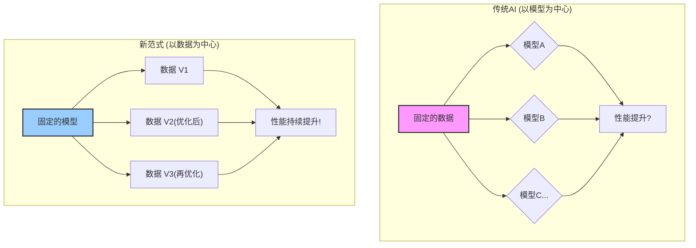
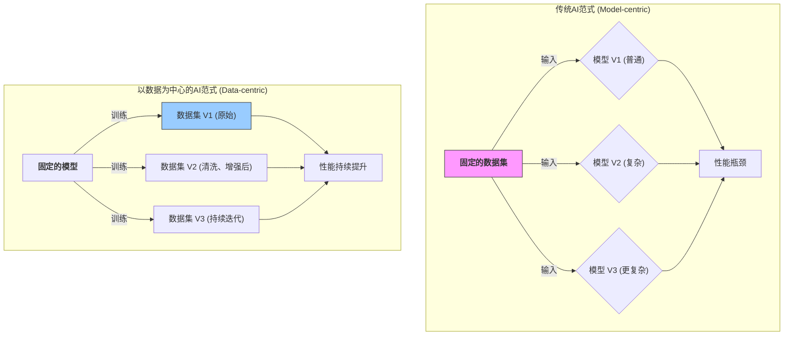
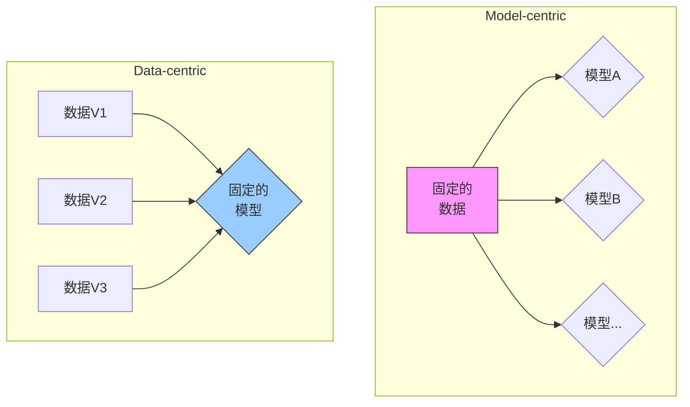

## AI论文解读 | Data-centric Artificial Intelligence: A Survey
        
### 作者        
digoal        
        
### 日期        
2025-06-16        
        
### 标签        
PostgreSQL , PolarDB , DuckDB , AI , 论文解读        
        
----        
        
## 背景       
      
https://arxiv.org/pdf/2303.10158        
        
提示:        
```        
读懂《Data-centric Artificial Intelligence: A Survey》这篇论文需要提前掌握哪些基础知识, 请使用中文给我讲一下这些基础知识, 尽量通熟易懂, 可以使用markdown支持的图形增加解释性.        
        
使用中文通熟易懂的解读《Data-centric Artificial Intelligence: A Survey》这篇论文, 关键内容请深入讲解, 可以使用markdown支持的图形增加解释性.        
        
使用中文提取《Data-centric Artificial Intelligence: A Survey》论文中一些重要的术语并详细解释, 可以使用markdown支持的图形示增加解释性.        
```        
        
## 1 前置知识  
  
当然可以！要读懂《以数据为中心的人工智能：综述》这篇论文，你需要了解一些机器学习和数据处理的基础知识。我会用通俗易懂的方式，结合一些图示来为你讲解。

-----

### 核心思想：从“卷模型”到“卷数据”

在深入了解具体技术之前，最重要的是理解一个核心观念的转变：**从“以模型为中心”到“以数据为中心”**。

过去，研究人员大部分精力都花在设计更复杂的算法和模型上，希望能提升性能。这就像我们不停地给学生换更聪明的“大脑”（模型），但用的教材（数据）却一成不变。

**“以数据为中心” (Data-centric AI)** 的思想则是：一个足够好的“大脑”（模型）已经有了，我们更应该花心思去优化“教材”（数据）的质量。因为**数据的质量决定了模型能力的上限**。



  

要理解这篇论文，你需要掌握以下几个方面的基础知识：

-----

### 1. 机器学习的基本流程

机器学习就像教一个孩子学习。整个过程可以分为三个主要阶段：**训练 (Training)**、**推理 (Inference)** 和 **评估 (Evaluation)**。

  * **训练 (Training):** 给他看很多带答案的练习册（比如，图片上画着猫，标签是“猫”），让他学习规律。

      * **模型 (Model):** 就是指这个“孩子的大脑”，它通过学习来调整内部的参数。
      * **特征 (Features):** 指的是我们提供给模型的信息，比如图片中猫的轮廓、颜色、纹理。
      * **标签 (Labels):** 就是我们提供的“标准答案”，比如图片对应的“猫”这个词。

  * **推理 (Inference):** 学成之后，给他一张新的、没见过的图片（没有答案），让他判断这是什么。这个过程就是推理。

  * **评估 (Evaluation):** 我们将他的答案和标准答案对比，看看他答对了多少，以此来评估他学得好不好。

-----

### 2. 数据的生命周期 (Data Lifecycle)

这篇论文的结构就是围绕数据的整个生命周期来组织的。你可以把它想象成准备一本高质量“练习册”的全过程。

#### **第一阶段：训练数据的开发 (Training Data Development)**

这是为模型准备“学习材料”的阶段。

  * **数据收集 (Data Collection):** 📚 从各种地方搜集原始素材，比如从网上爬取图片、从公司数据库里导出数据。

  * **数据标注 (Data Labeling):** ✍️ 给这些素材打上“标签”，告诉模型正确答案是什么。这是监督学习（下面会讲）中最关键也最耗时的一步。

  * **数据准备 (Data Preparation):** 🧹 清洗和整理数据。比如，填补缺失的值（数据清洗）、提取有用的信息（特征提取）。

  * **数据增强 (Data Augmentation):** ✨ 通过对现有数据做一些小改动（如旋转、翻转图片）来增加数据量和多样性，防止模型只学会“死记硬背”。

    *图示：对一张猫的图片进行旋转、裁剪、变色等操作，生成更多样的训练数据。*

  * **数据缩减 (Data Reduction):** ✂️ 有时数据太多太大，训练起来又慢又耗资源。这时就需要去掉一些不重要或重复的数据，提炼出精华部分。

#### **第二阶段：推理数据的开发 (Inference Data Development)**

这是准备“考卷”的阶段，用来测试模型在各种情况下的表现。

  * **分布内评估 (In-distribution Evaluation):** 📝 考卷的题目类型和练习册里的差不多，用来评估模型的基本功。
  * **分布外评估 (Out-of-distribution Evaluation):** 🤯 出一些“超纲题”或“陷阱题”，比如把图片加上一些干扰（对抗性样本），看看模型是否足够“聪明”和“稳健”（鲁棒）。
  * **提示工程 (Prompt Engineering):** 🗣️ 尤其针对大型语言模型（如GPT系列），通过设计不同的提问方式（Prompt）来引导模型给出更好的回答。

#### **第三阶段：数据维护 (Data Maintenance)**

这就像一个图书馆需要长期管理和维护。

  * **数据理解 (Data Understanding):** 📊 通过可视化等方式，让人能直观地看懂数据里有什么内容和规律。
  * **数据质量保障 (Data Quality Assurance):** 🧐 持续监控数据质量，防止数据“变质”。
  * **数据存储与检索 (Data Storage & Retrieval):** 🗄️ 如何高效、安全地存取海量数据。

-----

### 3. 核心的AI概念

  * **监督学习 vs. 无监督学习 (Supervised vs. Unsupervised Learning):**

      * **监督学习:** 提供的数据既有“问题”（特征）也有“答案”（标签），模型需要学习从问题到答案的映射。这是最常见的学习方式。
      * **无监督学习:** 提供的数据只有“问题”，没有“答案”。模型需要自己去发现数据中的结构和模式，比如自动将相似的数据聚在一起（聚类）。

  * **强化学习 (Reinforcement Learning):** 🎛️ 模型像在玩游戏，通过不断“尝试”并根据获得的“奖励”或“惩罚”来学习最佳策略。比如，AlphaGo下棋就是典型的强化学习。

  * **生成模型 (Generative Models) - 如GAN:**

      * 想象一个“伪造者”（生成器）和一个“侦探”（判别器）。
      * “伪造者”努力制作以假乱真的数据（比如假画）。
      * “侦探”努力分辨出真假。
      * 两者在互相博弈中共同进步，最终“伪造者”能造出非常逼真的数据。这个技术常用于数据增强。

  * **大型语言模型 (Large Language Models - LLMs):** 🧠 像GPT-3、GPT-4这样，在海量文本数据上训练出来的超大型模型。它们知识渊博，能理解和生成人类语言，是当前AI领域的热点。

### **总结：你需要的基础知识地图**

| 基础知识类别     | 关键概念                                                               | 对应论文中的内容                                                                                                                                              |
| :--------------- | :--------------------------------------------------------------------- | :------------------------------------------------------------------------------------------------------------------------------------------------------------ |
| **机器学习入门** | 训练、推理、模型、特征、标签、监督/无监督/强化学习                   | 整篇论文的理论基础，理解数据为何重要以及如何作用于模型。                                                                                                    |
| **数据处理** | 数据清洗、数据增强、数据标注、特征工程                               | **训练数据开发 (Training Data Development)** 章节深入探讨了这些技术。                                                                                          |
| **模型评估** | 鲁棒性、泛化能力、对抗性攻击                                         | **推理数据开发 (Inference Data Development)** 章节讨论了如何通过构建特殊的测试数据来评估模型的这些高级能力。                                           |
| **前沿AI技术** | 大型语言模型 (LLMs)、生成对抗网络 (GANs)                               | 论文中多次以这些技术为例，说明数据在驱动SOTA（当前最佳）模型进步中的核心作用，例如GPT系列模型的发展和数据量的关系、GAN在数据合成中的应用。 |

掌握了这些基础知识后，你就能更好地理解论文中提到的各种任务、挑战以及它们在整个数据驱动的AI系统中所扮演的角色了。祝你阅读顺利！
  
## 2 解读论文  
  
 这篇名为《以数据为中心的人工智能：综述》的论文，核心在于阐述并系统性地梳理了人工智能领域一个重要的思想转变：**将重心从优化模型（Model-centric）转移到系统性地工程化数据（Data-centric）**   。过去，大家普遍认为更好的AI性能来自于更先进的模型架构，而现在，越来越多的证据表明，**高质量的数据是驱动AI系统成功的关键**  。

---

### 核心观点：从“卷模型”到“卷数据”

 传统AI开发流程通常是拿到一个数据集后，就固定住它，然后反复迭代和优化模型算法   。然而，这种方法忽视了数据本身可能存在的各种问题，如标签错误、数据不均衡或信息冗余  。

 **以数据为中心 (Data-centric AI)** 的理念则反其道而行之。它主张在模型相对固定的情况下，将主要精力投入到对数据的持续改进和系统化工程上   。这篇论文系统地将数据工程划分为三大目标：**训练数据开发、推理数据开发和数据维护**  。



---

### 目标一：训练数据的开发 (Training Data Development)

 这是构建AI系统的基础，目标是产出数量充足且质量高超的“学习材料”   。整个过程如同一个精细的生产流水线  。

#### **1. 数据收集 (Data Collection)**
 这是起点，决定了数据的原始质量和广度   。除了从零开始收集，更高效的方式是利用现有数据  。
*  **数据集发现 (Dataset Discovery):** 像在数据海洋（Data Lake）中寻宝，根据需求（如特定属性名）从海量数据集中找到最相关的几个  。
*  **数据集成 (Data Integration):** 将来自不同源头的多个数据集整合成一个统一、干净的数据集  。
*  **原始数据合成 (Raw Data Synthesis):** 在某些场景下（如异常检测），直接合成包含特定模式的数据比从现实世界中收集更高效  。

#### **2. 数据标注 (Data Labeling)**
 这是为数据打上“正确答案”（标签）的过程，用以指导模型学习  。由于人工标注昂贵且耗时，论文介绍了几种高效策略：
*  **众包标注 (Crowdsourced Labeling):** 将任务分发给大量非专家进行标注，并通过交叉验证等方式保证质量  。
*  **主动学习 (Active Learning):** 模型主动挑选出它“最不确定”的数据，交由人类专家标注，从而用最少的标注量达到最好的学习效果  。
*  **数据编程 (Data Programming):** 专家不直接标注数据，而是编写一些启发式的“标注函数”（Labeling Functions）来自动生成标签，极大地提升了效率   。Snorkel系统是这一领域的代表作  。

#### **3. 数据准备 (Data Preparation)**
 此步骤旨在清洗和转换原始数据，使其变得适合模型“消化”  。
*  **数据清洗 (Data Cleaning):** 识别并修正数据中的错误、不一致和缺失值  。
*  **特征提取/转换 (Feature Extraction/Transformation):** 从原始数据中提取有意义的特征，或对特征进行标准化、归一化等变换，以提升模型性能  。

#### **4. 数据缩减 (Data Reduction)**
 目标是在保留核心信息的前提下，降低数据复杂性，提升训练效率和模型性能  。
*  **特征选择 (Feature Selection):** 从众多特征中挑选出与任务最相关的一部分，以避免过拟合并提升模型可解释性  。
*  **实例选择 (Instance Selection):** 从海量样本中挑选出有代表性的一部分，可以减轻存储和计算压力，或通过对多数类进行“欠采样”来缓解数据不平衡问题  。

#### **5. 数据增强 (Data Augmentation)**
 通过人工创造现有数据的变体来增加数据量和多样性，是提升模型泛化能力和鲁棒性的有效手段  。
*  **基础操作 (Basic Manipulation):** 对图像进行旋转、缩放、裁剪等   。Mixup是一种代表性方法，它通过将两个样本线性插值来创造新样本  。
*  **数据合成 (Augmentation Data Synthesis):** 利用GAN、Diffusion Model等生成模型学习数据分布，并合成全新的数据样本  。

---

### 目标二：推理数据的开发 (Inference Data Development)

 这一目标的核心是构建高质量的“考卷”，从而更精细化地评估模型或激发其特定能力  。

*  **分布内评估 (In-distribution Evaluation):** 旨在评估模型在和训练数据分布一致的数据上的表现  。
    *  **数据切片 (Data Slicing):** 将数据集切分成有意义的子集（如不同年龄、性别的用户群体），然后分别评估模型在每个子集上的性能，以发现模型可能存在的偏见或在特定场景下的短板  。
*  **分布外评估 (Out-of-distribution Evaluation):** 旨在评估模型面对未知或非典型数据时的泛化能力和安全性  。
    *  **生成对抗样本:** 通过对输入数据进行微小但有针对性的修改，使其能够“欺骗”模型做出错误判断，以此来测试模型的鲁棒性  。
    *  **生成分布漂移样本:** 人工构造或收集与训练数据分布不同的数据集，模拟真实世界中可能发生的数据变化，检验模型的适应能力  。
*  **提示工程 (Prompt Engineering):** 这是大语言模型时代的新兴任务。通过精心设计输入模型的指令（Prompt），在不改变模型的情况下，引导其完成特定任务或产出更优的回答  。

---

### 目标三：数据维护 (Data Maintenance)

 在生产环境中，数据是动态变化的，需要持续维护以保证其质量和可靠性  。

* **数据理解 (Data Understanding):**
    *  **可视化 (Visualization):** 将复杂数据以图表等直观形式呈现，帮助人类理解数据  。
    *  **数据估值 (Data Valuation):** 评估每个数据点对模型性能的贡献度，例如使用“沙普利值”(Shapley value)来量化，这对于数据交易等场景很有价值  。
*  **数据质量保障 (Data Quality Assurance):** 建立数据质量的量化评估指标（如准确性、完整性），并持续监控和改进数据质量  。
*  **数据存储与检索 (Data Storage & Retrieval):** 设计高效的系统来管理海量数据，通过资源分配优化、查询加速等技术，确保AI系统能快速获取所需数据  。

---

### 核心方法论：自动化与人机协作

 论文还从另一个维度对所有方法进行了划分：**自动化 (Automation)** 和 **人机协作 (Collaboration)**  。

*  **自动化:** 旨在用算法代替人力，提升效率和一致性。论文将其分为三个层次  ：
    1.   **程序化自动化 (Programmatic Automation):** 基于预设规则或统计信息自动处理数据  。
    2.   **基于学习的自动化 (Learning-based Automation):** 通过优化算法（如强化学习）来学习最佳的数据处理策略  。
    3.   **流水线自动化 (Pipeline Automation):** 自动搜索和组合多个数据处理步骤，寻找全局最优的数据处理流水线  。
*  **人机协作:** 强调人类在环路中的重要性，以确保数据和模型能更好地对齐人类的意图   。人类的参与程度也分为不同等级，从完全主导到仅在必要时提供反馈   。ChatGPT的成功就极大地归功于“基于人类反馈的强化学习”(RLHF)这一典型的人机协作模式  。

### 总结与未来方向

 这篇综述为“以数据为中心的人工智能”构建了一个清晰、全面的框架。通过分析现有的大量工作，论文指出，尽管这一领域已取得长足进步，但仍面临诸多挑战  。未来的研究方向可能包括：

*  **数据与模型的协同设计 (Data-model Co-design):** 打破数据和模型独立优化的局限，探索两者协同进化的可能性  。
*  **跨任务自动化 (Cross-task Automation):** 构建一个统一的框架，联合自动化从数据开发到维护的多个环节  。
*  **数据去偏 (Debiasing Data):** 研究更系统性的方法来消除训练数据中的偏见，并构建专门的评估数据来检测和衡量公平性问题  。
*  **统一数据基准的开发 (Data Benchmarks Development):** 目前的基准测试大多针对特定任务，未来需要更统一、更全面的数据基准来推动整个领域的发展  。

 总而言之，这篇论文强调，在AI的新时代，**数据将扮演越来越核心的角色**  。系统性地理解和应用数据工程技术，是构建更强大、更可靠、更公平的AI系统的必经之路。
  
## 3 术语  
  
好的，我们来从《以数据为中心的人工智能：综述》这篇论文中提取并详细解读一些关键术语。

---

### 1. 以数据为中心 (Data-centric AI) vs. 以模型为中心 (Model-centric AI)

这是理解整篇论文的基石，代表了AI开发的两种不同哲学思想。

* **以模型为中心 (Model-centric AI):**
     这是传统的AI开发模式   。在这种模式下，数据集通常是固定不变的，研究人员和工程师的主要工作是不断地设计和迭代更先进、更复杂的模型架构，以期提升性能  。
    * **通俗理解:** 好比我们有一套固定的教科书和练习题，为了提高学生的考试成绩，我们不断地尝试给他换更聪明的“大脑”（模型）。

* **以数据为中心 (Data-centric AI):**
     这是一个新兴的范式，它主张将系统性地工程化数据作为核心任务   。在这种模式下，模型架构相对固定，而主要精力则投入到持续地改进数据质量、增加数据量和提升数据多样性上  。
    * **通俗理解:** 我们认为学生已经足够聪明（模型足够好），成绩上不去的原因是教科书和练习题（数据）质量不高。因此，我们把精力花在优化教材上，比如修正错误、补充新题型、增加多样性等。



---

### 2. 训练数据 (Training Data) vs. 推理数据 (Inference Data)

这是数据在AI生命周期中扮演的两种不同角色。

* **训练数据 (Training Data):**
     用于机器学习模型“学习”阶段的数据   。模型通过分析训练数据来调整其内部参数，从而掌握从输入到输出的规律  。
    * **通俗理解:** 学生学习时用的**教科书和练习册**。

* **推理数据 (Inference Data):**
     用于模型完成训练后进行“应用”或“评估”阶段的数据   。一方面，它可以用来评估训练好的模型的性能   ；另一方面，通过调整推理数据（如Prompt），可以直接获得想要的输出结果  。
    * **通俗理解:** 学生学成后参加的**考试卷**，或在实际工作中遇到的**新问题**。

---

### 3. 数据编程 (Data Programming)

 这是一种高效的、弱监督的数据标注方法，旨在快速、大规模地创建训练标签  。

*  **核心思想:** 与其让人类专家逐一手动为数据打标签，不如让他们编写一些“**标注函数**”（Labeling Functions）  。这些函数是一些启发式的规则，可以自动地为大量数据生成标签。例如，在判断一封邮件是否为垃圾邮件时，可以编写一个函数：“如果邮件标题包含‘免费赢大奖’，则标签为‘垃圾邮件’”。
*  **重要性:** 它将繁琐的手动标注任务转化为了更高层次的编程任务，极大地提升了数据标注的效率和规模，是数据中心AI理念的重要实践  。

---

### 4. 数据切片 (Data Slicing)

 这是一种精细化的模型评估技术，通过将数据集划分为有意义的子集（即“切片”）来分别评估模型在这些子集上的表现  。

*  **核心思想:** 一个模型在总体准确率上可能很高，但在某些特定的数据子集上表现可能很差   。数据切片的目的就是为了自动发现这些模型表现不佳的“短板”子集  。
* **通俗理解:** 一位老师不能只看全班的平均分，还需要分析不同小组（如“靠窗的同学”、“前三排的同学”）的平均分，来发现是不是某个特定群体没有学好。

---

### 5. 算法追索 (Algorithmic Recourse)

 也称为“反事实解释”（Counterfactuals），旨在为模型的某个决策提供一个“可操作的改进方案”  。

*  **核心思想:** 它回答了这样一个问题：“为了得到一个期望的（更好的）结果，我最少需要做出哪些改变？”  。
*  **通俗理解:** 如果你的贷款申请被银行的AI系统拒绝了，算法追索会告诉你：“如果你的存款再增加5万元，或者月收入提高2千元，申请就会被批准。” 这不仅让模型的决策更透明，也为用户提供了具体的改进路径  。

---

### 6. 提示工程 (Prompt Engineering)

 这是一个在大语言模型（LLM）时代兴起的新兴领域，核心是设计和构建高质量的“提示”（Prompts），以在不改变模型本身的情况下，引导模型高效地完成下游任务  。

*  **核心思想:** 强大的LLM就像一个知识渊博但需要引导的“万事通”。你提问的方式（Prompt）直接决定了它回答的质量。提示工程就是研究如何更好地“提问”或“下达指令”的艺术  。
* **通俗理解:** 对一个搜索引擎，输入“北京天气”和输入“请用五言绝句描述今日北京秋日的天气”会得到完全不同的结果。后者就是一个经过“工程设计”的提示。

---

### 7. 数据估值 (Data Valuation)

 这是一类旨在量化**每个数据点对模型最终性能贡献度**的技术  。

*  **核心思想:** 并非所有数据都是平等的，有些数据点可能对模型的学习至关重要，而另一些可能无关紧要甚至有害。数据估值就是为了识别出这些“高价值”数据  。
*  **关键技术:** 论文中提到了**沙普利值 (Shapley Value)**，这是一个源于博弈论的概念，被用来公平地将模型的总收益（如性能提升）分配给每一个参与的数据点，从而衡量其贡献  。
*  **应用场景:** 可用于指导数据采集、数据清洗（剔除低价值或负价值数据），甚至在数据市场中为数据定价  。
  
## 参考        
         
https://github.com/Pooja-AI/MLOPS  
  
https://arxiv.org/abs/2205.02302  
  
https://arxiv.org/pdf/2303.10158  
  
https://cires.org.au/wp-content/uploads/2024/08/Xin-Zheng.pdf       
        
        
<b> 以上内容基于DeepSeek、Qwen、Gemini及诸多AI生成, 轻微人工调整, 感谢杭州深度求索人工智能、阿里云、Google等公司. </b>        
        
<b> AI 生成的内容请自行辨别正确性, 当然也多了些许踩坑的乐趣, 毕竟冒险是每个男人的天性.  </b>        
  
  
  
#### [期望 PostgreSQL|开源PolarDB 增加什么功能?](https://github.com/digoal/blog/issues/76 "269ac3d1c492e938c0191101c7238216")
  
  
#### [PolarDB 开源数据库](https://openpolardb.com/home "57258f76c37864c6e6d23383d05714ea")
  
  
#### [PolarDB 学习图谱](https://www.aliyun.com/database/openpolardb/activity "8642f60e04ed0c814bf9cb9677976bd4")
  
  
#### [PostgreSQL 解决方案集合](../201706/20170601_02.md "40cff096e9ed7122c512b35d8561d9c8")
  
  
#### [德哥 / digoal's Github - 公益是一辈子的事.](https://github.com/digoal/blog/blob/master/README.md "22709685feb7cab07d30f30387f0a9ae")
  
  
#### [About 德哥](https://github.com/digoal/blog/blob/master/me/readme.md "a37735981e7704886ffd590565582dd0")
  
  

  
