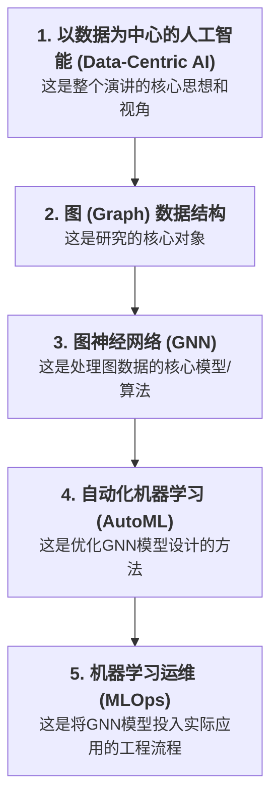

## AI论文解读 | Automated Graph Machine Learning Operations (MLOps) Workflow: A Data-Centric Perspective
        
### 作者        
digoal        
        
### 日期        
2025-06-16        
        
### 标签        
PostgreSQL , PolarDB , DuckDB , AI , 论文解读        
        
----        
        
## 背景       
      
https://cires.org.au/wp-content/uploads/2024/08/Xin-Zheng.pdf        
        
提示:        
```        
读懂《Automated Graph Machine Learning Operations (MLOps) Workflow: A Data-Centric Perspective》这篇论文需要提前掌握哪些基础知识, 请使用中文给我讲一下这些基础知识, 尽量通熟易懂, 可以使用markdown支持的图形增加解释性.        
        
使用中文通熟易懂的解读《Automated Graph Machine Learning Operations (MLOps) Workflow: A Data-Centric Perspective》这篇论文, 关键内容请深入讲解, 可以使用markdown支持的图形增加解释性.        
        
使用中文提取《Automated Graph Machine Learning Operations (MLOps) Workflow: A Data-Centric Perspective》论文中一些重要的术语并详细解释, 可以使用markdown支持的图形示增加解释性.        
```        
        
## 1 前置知识  
  
好的，为了完全理解Dr. Xin Zheng的这份关于《自动化图机器学习运维 (MLOps) 工作流：以数据为中心的视角》的精彩演讲，你需要掌握一些基础知识。我会用尽量通俗易懂的中文为你讲解，并配合一些Markdown图表来帮助你理解。

---

### 核心知识框架

要理解这篇演讲，你需要建立一个如下图所示的知识体系。这几个概念是层层递进、相互关联的：



下面我们来逐一分解这些基础知识。

---

### 基础一：以数据为中心的人工智能 (Data-Centric AI)

这是理解整个演讲的**出发点**。传统的人工智能研究更像是“以模型为中心”，即数据基本固定，研究者花费大量精力去设计和优化更复杂的模型来提升性能。

 而“以数据为中心”的理念则认为，当模型发展到一定成熟度后，**系统地、有策略地提升数据的质量和数量**，往往比单纯优化模型能带来更大的性能提升  。

你可以这样简单理解：

* **模型为中心 (Model-Centric)**:
    * 食材（数据）基本不变。
    * 目标：研发更高级的锅、更花哨的烹饪技巧（改进算法/模型）。
    *  公式： $AI系统 = \text{优化的代码} + \text{固定的数据}$  。

* **数据为中心 (Data-Centric)**:
    * 厨具（模型）相对固定。
    *  目标：精心挑选、清洗、搭配更高质量的食材（改进数据）  。
    *  公式： $AI系统 = \text{固定的代码} + \text{优化的数据}$  。

这份演讲的所有内容，都是围绕着 **如何更好地利用、处理和评估“图数据”** 来展开的，是典型的“以数据为中心”的思维模式。

---

### 基础二：什么是“图” (Graph)

 在计算机科学中，“图”不是指图片，而是一种用来表示“实体”及其之间“关系”的数据结构  。它由两部分组成：

*  **节点 (Nodes/Vertices)**：代表实体。例如，社交网络里的“用户”、论文引用网络里的“论文”   、蛋白质交互网络里的“蛋白质”  。
*  **边 (Edges)**：代表节点之间的连接或关系。例如，用户A“关注”了用户B、论文A“引用”了论文B  、蛋白质A与蛋白质B会“相互作用”。

这篇演讲重点提到了两种**特殊类型**的图，这对于理解后续的GNN模型至关重要：

1.  **同质图 (Homophilic Graph)**
    *  **特点**: “物以类聚，人以群分”。相互连接的节点通常具有相似的特征或属于同一类别  。
    *  **例子**: 在论文引用网络中，一篇计算机科学的论文，它引用的参考文献大概率也是计算机科学领域的  。

2.  **异质图 (Heterophilic Graph)**
    *  **特点**: “异性相吸”。相互连接的节点倾向于拥有不同的特征或属于不同类别  。
    *  **例子**: 在交易网络中，欺诈用户为了不被发现，往往会与普通用户进行交易，而不是和其他欺诈用户扎堆  。

 理解这两种图的区别至关重要，因为适用于同质图的GNN模型在异质图上可能会“水土不服”，这也是演讲中《Auto-HeG》工作的研究动机  。

---

### 基础三：什么是“图神经网络” (GNN)

GNN是专门为学习“图”结构数据而设计的深度学习模型。传统神经网络（如CNN, RNN）主要处理图像、文本等欧几里得空间的数据，而GNN则能直接在复杂的图结构上进行学习。

 GNN的核心思想可以概括为 **“消息传递” (Message Passing)** 或 **“邻居聚合” (Neighbor Aggregation)**  。

你可以想象一下，GNN如何更新一个节点（比如你自己）的信息：

1.  **收集信息**: 你先看看你的朋友们（邻居节点）都在聊什么（他们的特征信息）。
2.  **聚合信息**: 你把从朋友们那里听来的各种信息进行总结、提炼（聚合操作，如取平均、求和等）。
3.  **更新自己**: 结合总结来的信息和你自己原有的想法（节点自身特征），形成一个新的、更丰富的认识（更新节点表示）。

 这个过程会重复多轮（GNN的层数），这样每个节点不仅包含了自身的信息，还逐层聚合了来自更远邻居的信息。这份演讲中提到的GNN类型，如Convolutional (卷积), Attentional (注意力), 和Message-passing (消息传递)  ，都是实现这一核心思想的不同方式。

---

### 基础四：什么是“自动化机器学习”与“神经架构搜索” (AutoML & NAS)

设计一个表现优异的GNN模型是件复杂的事，需要专家进行大量的人工尝试，比如：
* 用几层GNN？
* 每一层用哪种聚合方式（SAGE, GAT, GIN等）？
* 层与层之间如何连接？

 **自动化机器学习 (AutoML)**，特别是**神经架构搜索 (NAS)**，就是为了解决这个问题  。

它的核心思想是：**让机器自动地去寻找最优的神经网络结构**。

* **人类专家**: 手动设计 GNN 架构 A, B, C... 然后逐一测试，选最好的。
*  **GraphNAS**: 定义一个包含所有可能组件的巨大“搜索空间”（比如所有可选的聚合函数、激活函数等）   ，然后用一个智能的“搜索策略”（如强化学习、演化算法）去自动探索这个空间，找到在特定数据集上表现最好的GNN架构  。

 演讲中的《Auto-HeG》工作就是一个典型的GraphNAS应用，它能自动为异质图设计出专属的、高性能的GNN架构  。

---

### 基础五：什么是“机器学习运维” (MLOps)

MLOps (Machine Learning Operations) 是将机器学习开发的**原则**与IT运维的**实践**相结合，旨在系统化、自动化地管理机器学习模型的整个生命周期。

一个模型训练好了只是第一步，MLOps更关心后续的问题：

* **部署 (Deployment)**: 如何将训练好的GNN模型上线到生产环境，让用户真正使用？
* **监控 (Monitoring)**: 模型上线后性能如何？是否随着时间推移，因为数据分布的变化而性能下降？
*  **评估 (Evaluation)**: 对于没有标签的新数据（unseen graphs without labels），我们如何评估模型的表现好坏？ 
* **再训练 (Retraining)**: 何时以及如何用新数据来更新模型？

 这篇演讲的后半部分，特别是《GNNEvaluator》    和对未来工作的展望  ，都聚焦于MLOps中的关键环节，即在充满不确定性的真实世界中，如何可靠地**评估**和**部署**GNN模型。

### 总结：如何串联所有知识

现在，你可以将以上所有基础知识串联起来，理解这份演讲的完整逻辑了：

>  Dr. Xin Zheng的演讲从 **“以数据为中心”**    的视角出发，探讨了如何处理现实世界中大规模   、类型复杂（如同质/异质   ）的 **“图数据”**。他介绍了使用 **“GNN”**    作为核心分析工具，并展示了如何通过 **“自动化机器学习 (GraphNAS)”**    技术来自动设计适应特定图数据（尤其是异质图）的高性能GNN模型（如Auto-HeG   ）。最后，他将视角提升到工业应用的 **“MLOps”**    层面，讨论了在模型部署后，如何在没有真实标签的情况下，对GNN模型进行有效评估（如GNNEvaluator  ），从而形成一个完整的、自动化的图机器学习工作流。

 掌握了这些基础概念后，你再回头去看这份演讲的PPT，就会发现其中提到的每一个具体工作（如Graph Condensation   , Auto-HeG   , GNNEvaluator  ）都是在为这个宏大框架添砖加瓦，解决其中某个环节的关键挑战。
  
## 2 解读论文  
  

  
## 3 术语  
  

  
## 参考        
         
https://github.com/Pooja-AI/MLOPS  
  
https://arxiv.org/abs/2205.02302  
  
https://arxiv.org/pdf/2303.10158  
  
https://cires.org.au/wp-content/uploads/2024/08/Xin-Zheng.pdf       
        
        
<b> 以上内容基于DeepSeek、Qwen、Gemini及诸多AI生成, 轻微人工调整, 感谢杭州深度求索人工智能、阿里云、Google等公司. </b>        
        
<b> AI 生成的内容请自行辨别正确性, 当然也多了些许踩坑的乐趣, 毕竟冒险是每个男人的天性.  </b>        
  
  
