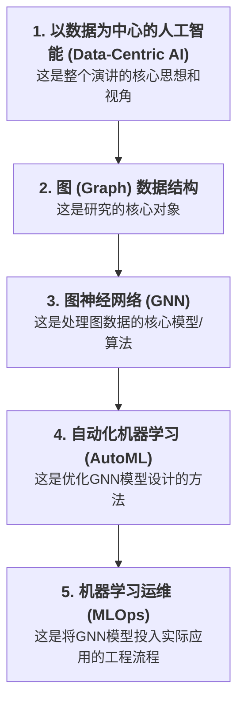
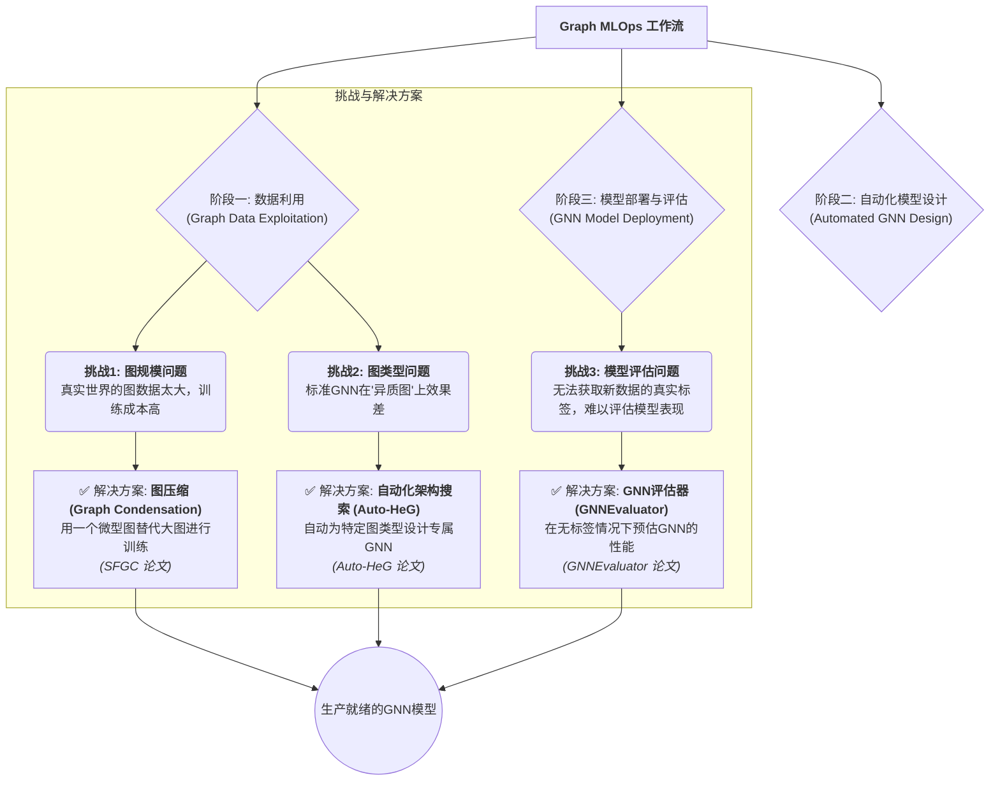
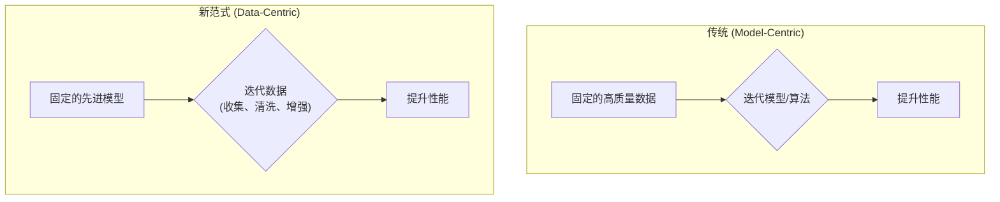

## AI论文解读 | Automated Graph Machine Learning Operations (MLOps) Workflow: A Data-Centric Perspective
        
### 作者        
digoal        
        
### 日期        
2025-06-16        
        
### 标签        
PostgreSQL , PolarDB , DuckDB , AI , 论文解读        
        
----        
        
## 背景       
      
https://cires.org.au/wp-content/uploads/2024/08/Xin-Zheng.pdf        
        
提示:        
```        
读懂《Automated Graph Machine Learning Operations (MLOps) Workflow: A Data-Centric Perspective》这篇论文需要提前掌握哪些基础知识, 请使用中文给我讲一下这些基础知识, 尽量通熟易懂, 可以使用markdown支持的图形增加解释性.        
        
使用中文通熟易懂的解读《Automated Graph Machine Learning Operations (MLOps) Workflow: A Data-Centric Perspective》这篇论文, 关键内容请深入讲解, 可以使用markdown支持的图形增加解释性.        
        
使用中文提取《Automated Graph Machine Learning Operations (MLOps) Workflow: A Data-Centric Perspective》论文中一些重要的术语并详细解释, 可以使用markdown支持的图形示增加解释性.        
```        
        
## 1 前置知识  
  
好的，为了完全理解Dr. Xin Zheng的这份关于《自动化图机器学习运维 (MLOps) 工作流：以数据为中心的视角》的精彩演讲，你需要掌握一些基础知识。我会用尽量通俗易懂的中文为你讲解，并配合一些Markdown图表来帮助你理解。

---

### 核心知识框架

要理解这篇演讲，你需要建立一个如下图所示的知识体系。这几个概念是层层递进、相互关联的：



下面我们来逐一分解这些基础知识。

---

### 基础一：以数据为中心的人工智能 (Data-Centric AI)

这是理解整个演讲的**出发点**。传统的人工智能研究更像是“以模型为中心”，即数据基本固定，研究者花费大量精力去设计和优化更复杂的模型来提升性能。

 而“以数据为中心”的理念则认为，当模型发展到一定成熟度后，**系统地、有策略地提升数据的质量和数量**，往往比单纯优化模型能带来更大的性能提升  。

你可以这样简单理解：

* **模型为中心 (Model-Centric)**:
    * 食材（数据）基本不变。
    * 目标：研发更高级的锅、更花哨的烹饪技巧（改进算法/模型）。
    *  公式： $AI系统 = \text{优化的代码} + \text{固定的数据}$  。

* **数据为中心 (Data-Centric)**:
    * 厨具（模型）相对固定。
    *  目标：精心挑选、清洗、搭配更高质量的食材（改进数据）  。
    *  公式： $AI系统 = \text{固定的代码} + \text{优化的数据}$  。

这份演讲的所有内容，都是围绕着 **如何更好地利用、处理和评估“图数据”** 来展开的，是典型的“以数据为中心”的思维模式。

---

### 基础二：什么是“图” (Graph)

 在计算机科学中，“图”不是指图片，而是一种用来表示“实体”及其之间“关系”的数据结构  。它由两部分组成：

*  **节点 (Nodes/Vertices)**：代表实体。例如，社交网络里的“用户”、论文引用网络里的“论文”   、蛋白质交互网络里的“蛋白质”  。
*  **边 (Edges)**：代表节点之间的连接或关系。例如，用户A“关注”了用户B、论文A“引用”了论文B  、蛋白质A与蛋白质B会“相互作用”。

这篇演讲重点提到了两种**特殊类型**的图，这对于理解后续的GNN模型至关重要：

1.  **同质图 (Homophilic Graph)**
    *  **特点**: “物以类聚，人以群分”。相互连接的节点通常具有相似的特征或属于同一类别  。
    *  **例子**: 在论文引用网络中，一篇计算机科学的论文，它引用的参考文献大概率也是计算机科学领域的  。

2.  **异质图 (Heterophilic Graph)**
    *  **特点**: “异性相吸”。相互连接的节点倾向于拥有不同的特征或属于不同类别  。
    *  **例子**: 在交易网络中，欺诈用户为了不被发现，往往会与普通用户进行交易，而不是和其他欺诈用户扎堆  。

 理解这两种图的区别至关重要，因为适用于同质图的GNN模型在异质图上可能会“水土不服”，这也是演讲中《Auto-HeG》工作的研究动机  。

---

### 基础三：什么是“图神经网络” (GNN)

GNN是专门为学习“图”结构数据而设计的深度学习模型。传统神经网络（如CNN, RNN）主要处理图像、文本等欧几里得空间的数据，而GNN则能直接在复杂的图结构上进行学习。

 GNN的核心思想可以概括为 **“消息传递” (Message Passing)** 或 **“邻居聚合” (Neighbor Aggregation)**  。

你可以想象一下，GNN如何更新一个节点（比如你自己）的信息：

1.  **收集信息**: 你先看看你的朋友们（邻居节点）都在聊什么（他们的特征信息）。
2.  **聚合信息**: 你把从朋友们那里听来的各种信息进行总结、提炼（聚合操作，如取平均、求和等）。
3.  **更新自己**: 结合总结来的信息和你自己原有的想法（节点自身特征），形成一个新的、更丰富的认识（更新节点表示）。

 这个过程会重复多轮（GNN的层数），这样每个节点不仅包含了自身的信息，还逐层聚合了来自更远邻居的信息。这份演讲中提到的GNN类型，如Convolutional (卷积), Attentional (注意力), 和Message-passing (消息传递)  ，都是实现这一核心思想的不同方式。

---

### 基础四：什么是“自动化机器学习”与“神经架构搜索” (AutoML & NAS)

设计一个表现优异的GNN模型是件复杂的事，需要专家进行大量的人工尝试，比如：
* 用几层GNN？
* 每一层用哪种聚合方式（SAGE, GAT, GIN等）？
* 层与层之间如何连接？

 **自动化机器学习 (AutoML)**，特别是**神经架构搜索 (NAS)**，就是为了解决这个问题  。

它的核心思想是：**让机器自动地去寻找最优的神经网络结构**。

* **人类专家**: 手动设计 GNN 架构 A, B, C... 然后逐一测试，选最好的。
*  **GraphNAS**: 定义一个包含所有可能组件的巨大“搜索空间”（比如所有可选的聚合函数、激活函数等）   ，然后用一个智能的“搜索策略”（如强化学习、演化算法）去自动探索这个空间，找到在特定数据集上表现最好的GNN架构  。

 演讲中的《Auto-HeG》工作就是一个典型的GraphNAS应用，它能自动为异质图设计出专属的、高性能的GNN架构  。

---

### 基础五：什么是“机器学习运维” (MLOps)

MLOps (Machine Learning Operations) 是将机器学习开发的**原则**与IT运维的**实践**相结合，旨在系统化、自动化地管理机器学习模型的整个生命周期。

一个模型训练好了只是第一步，MLOps更关心后续的问题：

* **部署 (Deployment)**: 如何将训练好的GNN模型上线到生产环境，让用户真正使用？
* **监控 (Monitoring)**: 模型上线后性能如何？是否随着时间推移，因为数据分布的变化而性能下降？
*  **评估 (Evaluation)**: 对于没有标签的新数据（unseen graphs without labels），我们如何评估模型的表现好坏？ 
* **再训练 (Retraining)**: 何时以及如何用新数据来更新模型？

 这篇演讲的后半部分，特别是《GNNEvaluator》    和对未来工作的展望  ，都聚焦于MLOps中的关键环节，即在充满不确定性的真实世界中，如何可靠地**评估**和**部署**GNN模型。

### 总结：如何串联所有知识

现在，你可以将以上所有基础知识串联起来，理解这份演讲的完整逻辑了：

>  Dr. Xin Zheng的演讲从 **“以数据为中心”**    的视角出发，探讨了如何处理现实世界中大规模   、类型复杂（如同质/异质   ）的 **“图数据”**。他介绍了使用 **“GNN”**    作为核心分析工具，并展示了如何通过 **“自动化机器学习 (GraphNAS)”**    技术来自动设计适应特定图数据（尤其是异质图）的高性能GNN模型（如Auto-HeG   ）。最后，他将视角提升到工业应用的 **“MLOps”**    层面，讨论了在模型部署后，如何在没有真实标签的情况下，对GNN模型进行有效评估（如GNNEvaluator  ），从而形成一个完整的、自动化的图机器学习工作流。

 掌握了这些基础概念后，你再回头去看这份演讲的PPT，就会发现其中提到的每一个具体工作（如Graph Condensation   , Auto-HeG   , GNNEvaluator  ）都是在为这个宏大框架添砖加瓦，解决其中某个环节的关键挑战。
  
## 2 解读论文  
  
好的，这份Dr. Xin Zheng的演讲《自动化图机器学习运维(MLOps)工作流：以数据为中心的视角》核心在于解决一个关键问题：如何系统性、自动化地将强大的图神经网络（GNN）从实验室研究推向真实世界的工业级应用。

 其**核心思想**是：放弃过去那种“数据不动，拼命优化模型”的思路，转向 **“以数据为中心” (Data-Centric)** 的理念   。这意味着整个工作流程的重心都放在对图数据的深入理解、高效处理和持续评估上，从而构建一个健壮、自动化的图机器学习运维（Graph MLOps）管道  。

下面，我们沿着这个自动化工作流的三个关键阶段，来深入解读其面临的挑战和演讲中提出的创新解决方案。



---

### 挑战一：图数据太大怎么办？— 解决方案：图压缩 (Graph Condensation)

**1. 问题所在 (Graph Data Scale Issue)**

 在真实世界中，图数据的规模可能非常庞大，例如社交网络或电商推荐系统，节点数可达数十亿。在这样的大图上反复训练和调试GNN模型，会消耗巨大的存储、计算和内存资源，成本极高   。如表中所示，训练数据的大小远超模型本身  。

**2. 核心解法：结构自由的图压缩 (Structure-free Graph Condensation, SFGC)**

 传统的思路是把大图变小，即**图压缩 (Graph Condensation)**：通过算法合成一个规模极小的“浓缩图”，使得GNN在这个小图上训练达到的效果，与在原始大图上训练的效果相当  。

然而，过去的压缩方法仍然需要费力地去设计和学习这个浓缩图的“结构”（即节点间的连接关系）。Dr.  Zheng团队提出的**SFGC**更进一步，它开创了一个“结构自由”的范式  ：

*  **它做什么**：SFGC完全抛弃了学习新图结构的包袱，只合成一个极小的、不含任何连接关系的“节点特征集”  。
*  **如何实现**：它通过一个精巧的“元学习”过程，让这个浓缩节点集能够模拟出在完整大图上训练GNN时的参数更新轨迹。简而言之，它将复杂的图结构信息隐式地“编码”进了这些合成的节点特征里  。
*  **效果**：这意味着，你可以用一个简单的多层感知机（MLP）或者GNN（此时GNN因没有结构而退化为MLP）在这个浓缩的、无结构的节点集上进行训练，速度极快，但依然能达到在原始大图上训练的效果   。实验证明，SFGC在多个数据集上的性能优于其他压缩方法  。

> 深入理解：这就像我们不需要拿到一部完整的《红楼梦》原著（大图），而是通过一位顶级的红学家（SFGC算法）给你提炼出的几页核心人物关系笔记（浓缩的节点集），你学习这份笔记就能理解整个故事的核心，并且这份笔记还特别好懂（无需关心复杂的结构）。

---

### 挑战二：图类型不匹配怎么办？— 解决方案：自动化异质图网络 (Auto-HeG)

**1. 问题所在 (Homophilic vs. Heterophilic Graphs)**

 标准GNN的核心“消息传递”机制是基于一个“同质性”假设，即相互连接的节点是相似的（物以类聚）  。但在很多场景下，图是“异质”的，即相互连接的节点反而不相似（如电商欺诈检测中，欺诈账号会连接正常用户）  。在异质图上，标准GNN的聚合操作反而会引入噪声，导致性能急剧下降  。

**2. 核心解法：自动化异质图架构搜索 (Auto-HeG)**

 面对异质图，与其人工设计复杂的GNN，不如让机器自己来。 **Auto-HeG** 利用 **图神经架构搜索 (GraphNAS)** 技术，自动为异质图定制最优的GNN模型  。

*  **它做什么**：Auto-HeG能够自动地从一个包含多种异质图友好操作的“搜索空间”中，为给定的异质图数据“量身定制”一个专属的GNN架构  。
* **如何实现**：
    *  **异质化搜索空间 (Heterophilic Search Space)**：它内置了大量被证明对异质图有效的组件，比如可以聚合多跳邻居、分离自我与邻居信息等操作  。
    *  **异质化搜索策略 (Heterophilic Search Strategy)**：它通过一种渐进式的剪枝策略，高效地在庞大的搜索空间中寻找最优架构组合  。
*  **效果**：Auto-HeG设计的GNN模型，在多个高异质性和低异质性图数据集上的表现，均显著优于由人类专家设计的GNN模型和其他自动化模型  。

> 深入理解：Auto-HeG就像一个全自动的GNN“装机大师”。你把你的特殊需求（异质图数据）告诉它，它会从满仓库的顶级硬件（搜索空间）中，自动帮你搭配和组装出一台性能最强的定制电脑（专属GNN），而无需你了解任何硬件知识。

---

### 挑战三：模型部署后如何评估？— 解决方案：GNN评估器 (GNNEvaluator)

**1. 问题所在 (Real-world Model Evaluation)**

 当一个GNN模型训练好并部署到真实世界后，我们会面临一个严峻的挑战：它接收到的新图数据（测试图）通常是**没有真实标签**的   。此外，新数据的分布可能已经发生了变化（Distribution Shift）  。在这种情况下，我们无法计算准确率等指标，也就不知道这个模型在新数据上表现得到底好不好  。

**2. 核心解法：GNN评估器 (GNNEvaluator)**

 为了解决这个“无标签评估”的难题，**GNNEvaluator**被提了出来。它是一个两阶段的框架，旨在**预测**一个已部署的GNN模型在无标签测试图上的性能  。

*  **它做什么**：在不接触测试图真实标签的前提下，直接输出一个预估的准确率（ACC）值  。
* **如何实现**：
    *  **阶段一：构建“差异图”数据集**：首先，通过对训练图进行各种变换（如扰动特征、结构），模拟出可能遇到的各种“训练-测试”数据分布差异，并为每种差异情况计算出GNN的真实性能。这些信息被用来构建一个全新的数据集，称为**DiscGraph Set**  。
    *  **阶段二：训练和使用评估器**：然后，训练一个评估器模型（它本身也是一个GNN）来学习“图的差异性”与“GNN性能”之间的关系。当一个真实的、无标签的测试图到来时，该评估器会分析它与原始训练图的差异，并据此预测出已部署GNN在该测试图上的性能  。
*  **效果**：实验证明，GNNEvaluator在多种数据集和分布变化场景下，都能准确地预估出GNN模型的性能，其预测结果与真实性能高度相关  。

> 深入理解：GNNEvaluator就像一位经验丰富的医生。病人（无标签的测试图）来了之后，医生不直接看化验单的最终结果（真实标签），而是通过观察病人的各种体征（图的统计特征）与健康人（训练图）的差异，就能准确判断出病人的健康状况（GNN的性能）。

### 总结

这份演讲描绘了一幅清晰的蓝图：通过**以数据为中心**，并利用**图压缩**、**自动化架构搜索**和**无标签评估**等一系列创新技术，我们可以构建一个端到端的自动化Graph MLOps工作流。这使得GNN不再仅仅是学术界的“屠龙之技”，而是能够被系统性地开发、部署和维护，真正在工业界发挥其巨大潜力的“实用工具”。
  
## 3 术语  
  
好的，这份《Automated Graph Machine Learning Operations (MLOps) Workflow: A Data-Centric Perspective》演讲中包含了图机器学习领域的一些前沿且重要的术语。以下是对其中关键术语的提取和详细解释。

---
### 1. 以数据为中心的人工智能 (Data-Centric AI)
 Data-Centric AI 是一种相对于传统“以模型为中心 (Model-Centric)”的理念   。它的核心思想是，在机器学习项目中，保持模型架构相对固定，将主要精力投入到系统性地改进用于训练模型的数据上  。

*  **模型为中心 (Model-Centric)**: 假设数据是固定的，通过不断迭代和优化算法/模型来提升系统性能  。
*  **数据为中心 (Data-Centric)**: 假设模型是相对成熟和固定的，通过提升数据的质量和规模来驱动性能的提升  。

 演讲中举例说明，从GPT-1到GPT-4，模型架构相似，但性能的巨大飞跃主要来源于数据规模和质量的提升，这凸显了Data-Centric AI的重要性  。



---
### 2. 图 (Graph)
 在本次演讲的语境下，图是一种由**节点 (Nodes)** 和 **边 (Edges)** 组成的数据结构，用于表示现实世界中实体间的复杂关系  。
*  **节点 (Nodes/Vertices)**: 代表实体，例如一篇论文、一个社交网络用户或一个分子  。
*  **边 (Edges)**: 代表实体间的连接，例如论文间的引用关系  。

演讲中特别强调了图的两种重要类型：
*  **同质图 (Homophilic Graph)**: 特点是“物以类聚”，相互连接的节点通常属于同一类别或具有相似特征   。例如，在引用网络中，一篇论文通常会引用同一领域的其他论文  。
*  **异质图 (Heterophilic Graph)**: 特点是连接的节点倾向于属于不同类别   。例如，在金融欺诈网络中，欺诈者更可能与普通客户建立联系，而非其他欺诈者  。

---
### 3. 图神经网络 (Graph Neural Networks, GNN)
 GNN 是一类专门用于处理图结构数据的深度学习模型   。其核心机制是**消息传递 (Message-passing)**，通过聚合邻居节点的信息来更新中心节点的表示（或称嵌入） 。这个过程通常包含三个步骤：
1.   **邻居采样 (Sample neighborhood)**: 确定需要从中聚合信息的目标邻居节点  。
2.   **信息聚合 (Aggregate feature information)**: 将邻居节点的信息通过一个聚合函数（如求和、平均、最大化）整合起来  。
3.   **预测 (Predict)**: 使用聚合后的信息来执行下游任务，如节点分类、链接预测等  。

 GNN 的设计通常很复杂，需要找到合适的图结构、指定图的类型和规模，并设计损失函数  。

---
### 4. 图压缩 (Graph Condensation)
 图压缩是一种旨在通过合成一个规模小得多的“浓缩图”来替代原始大图进行训练的技术   。其目标是让GNN模型在浓缩图上训练后，达到的测试性能与在原始大图上训练相当  。

*  **动机**: 解决真实世界中图数据规模过大，导致GNN训练成本高昂的问题  。
*  **演讲中的创新点 (SFGC)**: 提出**结构自由的图压缩 (Structure-free Graph Condensation)**，该方法只合成一个浓缩的节点集，而无需学习其复杂的内部结构，从而将拓扑信息隐式编码到节点属性中  。

---
### 5. 图神经架构搜索 (Graph Neural Architecture Search, GraphNAS)
 GraphNAS 是一种自动化机器学习 (AutoML) 技术，用于自动设计和发现最优的GNN模型架构，以减轻人工设计的负担并提升模型性能  。

*  **动机**: 人工设计的GNN模型需要大量的专业知识，且难以适应多样的图数据和任务  。
*  **演讲中的应用 (Auto-HeG)**: 针对异质图设计了一个名为 **Auto-HeG** 的GraphNAS框架   。它通过定义一个包含多种异质图友好操作的**搜索空间 (Search Space)**，并采用高效的**搜索策略 (Search Strategy)**，来自动构建针对特定异质图的最优GNN模型  。

---
### 6. 机器学习运维 (MLOps)
MLOps 是一套实践和原则，旨在将机器学习开发 (ML) 与信息技术运维 (Ops) 相结合，以实现对机器学习模型整个生命周期的系统化管理，包括部署、监控、评估和再训练。

*  **演讲中的挑战**: 在真实世界的部署场景中，往往无法获取新测试图的真实标签，这使得评估已部署GNN模型的性能变得极其困难  。
*  **演讲中的解决方案 (GNNEvaluator)**: 提出了一个名为 **GNNEvaluator** 的框架   。它可以在**没有测试标签**的情况下，通过分析训练图与测试图之间的差异，来**预估**一个GNN模型在未见过的测试图上的性能表现   。这个过程分为两个阶段：构建包含各种差异情况的**差异图集 (DiscGraph set)**，然后训练GNNEvaluator来学习“图的差异”与“模型性能”之间的关系  。
  
## 参考        
         
https://github.com/Pooja-AI/MLOPS  
  
https://arxiv.org/abs/2205.02302  
  
https://arxiv.org/pdf/2303.10158  
  
https://cires.org.au/wp-content/uploads/2024/08/Xin-Zheng.pdf       
        
        
<b> 以上内容基于DeepSeek、Qwen、Gemini及诸多AI生成, 轻微人工调整, 感谢杭州深度求索人工智能、阿里云、Google等公司. </b>        
        
<b> AI 生成的内容请自行辨别正确性, 当然也多了些许踩坑的乐趣, 毕竟冒险是每个男人的天性.  </b>        
  
  
  
#### [期望 PostgreSQL|开源PolarDB 增加什么功能?](https://github.com/digoal/blog/issues/76 "269ac3d1c492e938c0191101c7238216")
  
  
#### [PolarDB 开源数据库](https://openpolardb.com/home "57258f76c37864c6e6d23383d05714ea")
  
  
#### [PolarDB 学习图谱](https://www.aliyun.com/database/openpolardb/activity "8642f60e04ed0c814bf9cb9677976bd4")
  
  
#### [PostgreSQL 解决方案集合](../201706/20170601_02.md "40cff096e9ed7122c512b35d8561d9c8")
  
  
#### [德哥 / digoal's Github - 公益是一辈子的事.](https://github.com/digoal/blog/blob/master/README.md "22709685feb7cab07d30f30387f0a9ae")
  
  
#### [About 德哥](https://github.com/digoal/blog/blob/master/me/readme.md "a37735981e7704886ffd590565582dd0")
  
  

  
