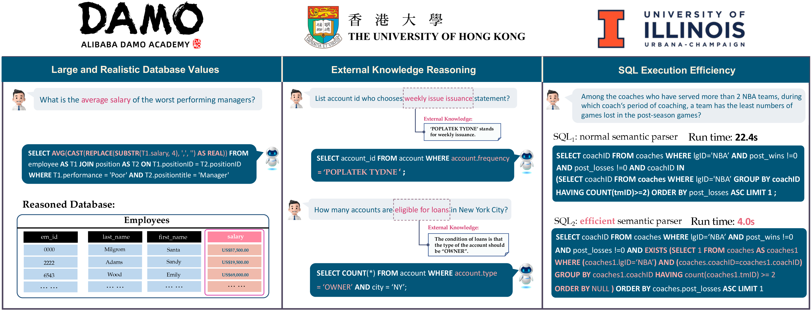
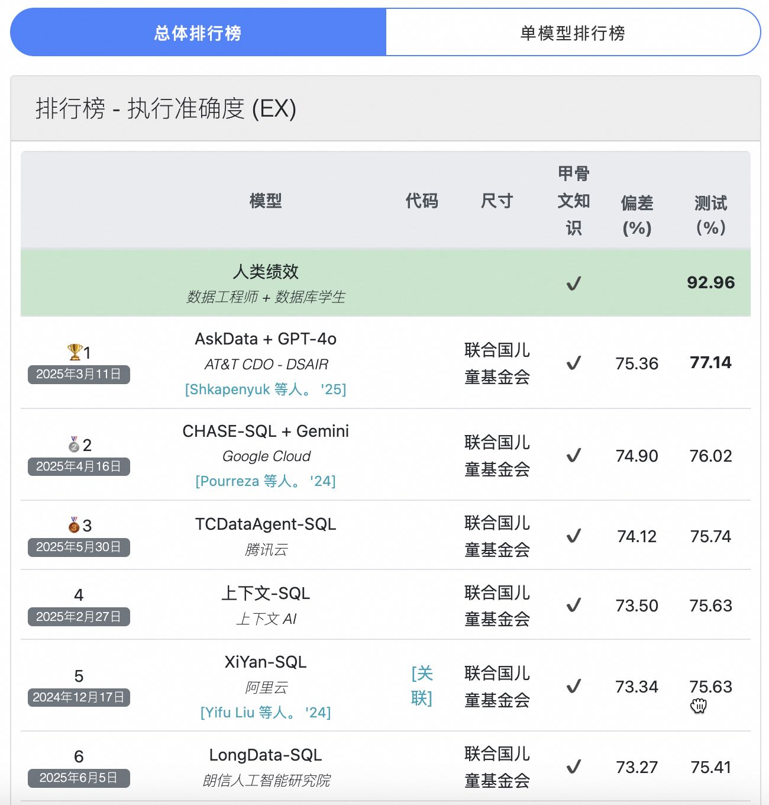

## 如何评测 Text-to-SQL 产品是否靠谱? | BIRD-SQL    
          
### 作者          
digoal          
          
### 日期          
2025-06-16         
          
### 标签          
PostgreSQL , PolarDB , DuckDB , AI , Text-to-SQL , benchmark , schema , data      
          
----          
          
## 背景   
近年来，像GPT-4这样的大语言模型在许多任务上表现惊人，尤其是在一些学术性的Text-to-SQL（文本到SQL）基准（如Spider）上取得了很高的分数  。这让人们产生了一个疑问：我们是不是很快就可以用自然语言和数据库自由对话，不再需要专业的数据库分析师了？  
  
现实并非如此。之前流行的学术基准存在一个巨大缺陷：**它们过于“干净”和“理想化”，与真实世界的数据库应用场景脱节**  。
  
  *  **数据库规模小**：大部分基准的数据库只有几千行数据，而真实世界的数据库动辄上千万甚至上亿行  。
  *  **数据质量高**：学术数据非常规整，而现实中的数据充满了格式不一、有特殊符号的“脏数据”  。
  *  **不关心效率**：只要SQL查询结果正确就行，不考虑查询速度。但在大型数据库上，一个低效的查询可能要运行数小时，这是无法接受的  。
  
为了弥补这一差距，**BIRD (BIg bench for large-scale Database grounded text-to-SQL)** 诞生，一个专为模拟真实世界挑战而生的新“考场”  。  
  
提前揭晓, AI目前还无法替代DBA, 因为在这个榜单上`人类得分93`远超`最强AI得分77`.    
   
作为资深DBA, 如何评测基于LLM的 text-to-SQL 产品是否靠谱? 你能想到什么评测点？  
- 支持哪些数据库产品、版本? 如果是PG, 可能还涉及插件及插件的版本等.     
- 识别数据内的采样数据、元数据、描述等结合用户问题生成SQL的正确性?  
- SQL运行结果正确性?  
- SQL运行效率?  
- 覆盖哪些SQL语法?
- 是否能过滤问题中的噪音, 例如错误的数字(`us 5,000`), 中英文混搭、LLM幻觉问题等等.  
  
我大概会想到以上几点.    
  
紧接着就会问, 有没有这样的评测产品呢?  
  
前面已介绍了, 就是 BIRD-SQL (A Big Bench for Large-Scale Database Grounded Text-to-SQLs) , 也许现在还不是非常完美, 但是它是开源的, 它可以继续迭代.    
- https://github.com/AlibabaResearch/DAMO-ConvAI/tree/main/bird  
- https://bird-bench.github.io/  
  
BIRD-SQL 是一系列数据样本和评测标准, 试图回答这个问题 “Can LLM Already Serve as A Database Interface? A BIg Bench for Large-Scale Database Grounded Text-to-SQLs” (<b>LLM目前是否具备作为数据库服务接口的能力?</b>) .  
  
  
  
BIRD（BIG Bench for Large-Scale Database Grounded Text-to-SQL Evaluation）是一个开创性的跨领域数据集，用于检验海量数据库内容对 Text-to-SQL 解析的影响。BIRD-SQL 包含超过12,751 个独特的问题对， 95 个大型数据库，总大小达33.4 GB。它还涵盖了37 个专业领域，例如区块链、曲棍球、医疗保健和教育等。  
  
相关论文  
- https://arxiv.org/pdf/2305.03111  (`Can LLM Already Serve as A Database Interface? A BIg Bench for Large-Scale Database Grounded Text-to-SQLs`)  
- https://arxiv.org/pdf/2405.15307  (`Before Generation, Align it! A Novel and Effective Strategy for Mitigating Hallucinations in Text-to-SQL Generation`)  
- https://arxiv.org/pdf/1809.08887  (`Spider: A Large-Scale Human-Labeled Dataset for Complex and Cross-Domain Semantic Parsing and Text-to-SQL Task`)  
    
[《BIRD-SQL 论文解读》](../202506/20250618_01.md)  
   
已经有很多模型参与了测试, 这个榜单也在不断更新, 有望成为Text-to-SQL领域的标准榜单.  
- 目前榜单上最强的开源NL2SQL项目是: https://github.com/XGenerationLab/XiYan-SQL  
  
  
  
更多请参考该项目介绍: https://github.com/AlibabaResearch/DAMO-ConvAI/tree/main/bird  
  
BIRD-SQL 是首个跨领域的大规模基准测试，旨在弥合 Text-to-SQL 解析领域学术研究与实际应用之间的差距。尽管 Codex 和 ChatGPT 等模型已展现出卓越的性能，但 Spider 和 WikiSQL 等现有基准测试主要侧重于数据库 schema，而数据库内容(<b>data: 数据记录等</b>)则在很大程度上未被探索。意识到这一局限性，BIRD着手创建一个全面的基准测试，深入探究数据库的价值，最终揭示 Text-to-SQL 领域发展的新挑战和机遇。  
  
BIRD-SQL 以其庞大的数据集而闻名，该数据集包含12,751 个文本到 SQL 对，涵盖37 个专业领域的95 个数据库，总大小达33.4 GB。通过突出数据库值，BIRD-SQL 关注新的挑战，例如外部知识、脏数据以及海量数据库中的 SQL 效率。为了生成准确的 SQL 查询，模型不仅要进行语义解析，还要理解数据库值。  
  
如果你正在设计text-to-SQL产品, 不妨关注一下BIRD-SQL项目.    
  
#### [期望 PostgreSQL|开源PolarDB 增加什么功能?](https://github.com/digoal/blog/issues/76 "269ac3d1c492e938c0191101c7238216")
  
  
#### [PolarDB 开源数据库](https://openpolardb.com/home "57258f76c37864c6e6d23383d05714ea")
  
  
#### [PolarDB 学习图谱](https://www.aliyun.com/database/openpolardb/activity "8642f60e04ed0c814bf9cb9677976bd4")
  
  
#### [PostgreSQL 解决方案集合](../201706/20170601_02.md "40cff096e9ed7122c512b35d8561d9c8")
  
  
#### [德哥 / digoal's Github - 公益是一辈子的事.](https://github.com/digoal/blog/blob/master/README.md "22709685feb7cab07d30f30387f0a9ae")
  
  
#### [About 德哥](https://github.com/digoal/blog/blob/master/me/readme.md "a37735981e7704886ffd590565582dd0")
  
  

  
