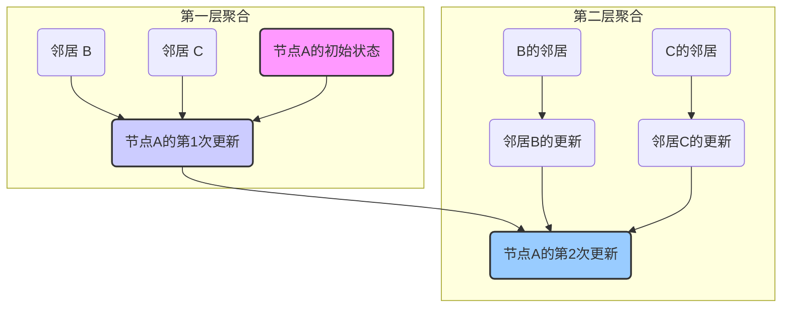
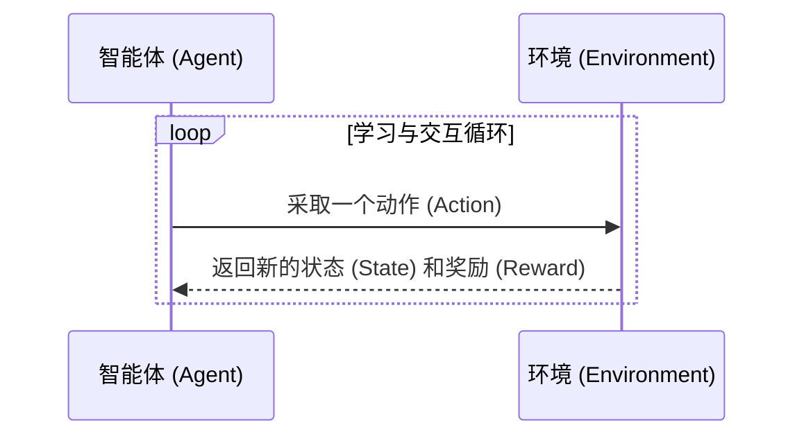
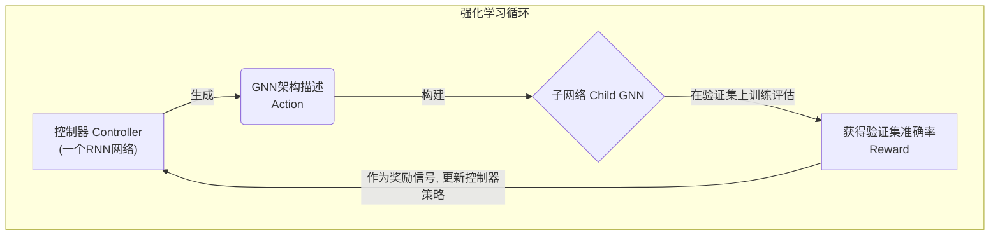
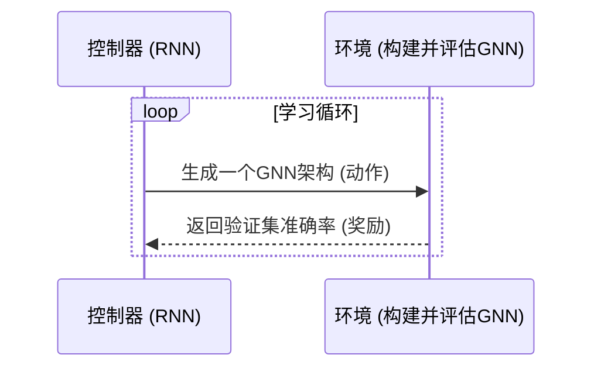

## AI论文解读 | GraphNAS: Graph Neural Architecture Search with Reinforcement Learning
        
### 作者        
digoal        
        
### 日期        
2025-06-17        
        
### 标签        
PostgreSQL , PolarDB , DuckDB , AI , 论文解读        
        
----        
        
## 背景       
      
https://arxiv.org/pdf/1904.09981        
        
提示:        
```        
读懂《GraphNAS: Graph Neural Architecture Search with Reinforcement Learning》这篇论文需要提前掌握哪些基础知识, 请使用中文给我讲一下这些基础知识, 尽量通熟易懂, 可以使用markdown支持的图形增加解释性.        
        
使用中文通熟易懂的解读《GraphNAS: Graph Neural Architecture Search with Reinforcement Learning》这篇论文, 关键内容请深入讲解, 可以使用markdown支持的图形增加解释性.        
        
使用中文提取《GraphNAS: Graph Neural Architecture Search with Reinforcement Learning》论文中一些重要的术语并详细解释, 可以使用markdown支持的图形示增加解释性.        
```        
        
## 1 前置知识  
  
好的，为了完全理解《GraphNAS: Graph Neural Architecture Search with Reinforcement Learning》这篇论文，你需要掌握以下几个核心领域的知识。我会用通俗易懂的方式，结合图示为你讲解。

这篇论文的核心思想可以概括为：**训练一个“智能代理（Agent）”，让它自动学习如何“搭建”一个性能最好的图神经网络（GNN）**。

为了理解这个过程，你需要了解以下三大块基石和一些相关概念：

***

## 1. 图神经网络 (Graph Neural Networks - GNN)

这是这篇论文研究的**对象**。

#### 核心概念
 传统的神经网络（如CNN处理图片、RNN处理文本）擅长处理结构规则的数据，比如图像的像素格、文本的序列。但现实世界中很多数据是 **图（Graph）** 结构，由 **节点（Node）** 和 **边（Edge）** 组成，比如社交网络、分子结构等。GNN就是专门用来处理这类“不规则”图数据的神经网络。  

 GNN最核心的思想是 **“邻居信息聚合”** 或 **“消息传递”** 。   简单来说，每个节点都会根据它自己以及它邻居节点的信息来更新自己的状态（特征表示）。这个过程会重复多轮（多层），这样节点就能捕捉到从近到远的邻居信息。

你可以把这个过程想象成“朋友圈”里的观点演变：
* **第1轮**：你听取了你直接好友（1度邻居）的观点，并结合自己的想法，形成了新观点。
* **第2轮**：你的好友们也同样听取了他们好友（你的2度邻居）的观点。当你再次和好友交流时，你就间接获取了“好友的好友”的信息，你的观点会进一步演变。



#### 关键组件
在GraphNAS这篇论文中，GNN的每一层都由几个可选择的操作组成，这些操作构成了搜索的目标。你需要理解这些组件是什么：
*  **注意力机制 (Attention)**：不是所有邻居都同等重要。注意力机制允许模型在聚合信息时，为不同的邻居分配不同的权重。    比如GAT模型就是用了这个机制。  
*  **聚合函数 (Aggregation)**：如何将邻居们的信息“合并”起来？是简单求和（Sum）、取平均（Mean），还是取最大值（Max-pooling）？  
*  **激活函数 (Activation)**：在神经网络中增加非线性，使得网络可以学习更复杂的模式，例如`ReLU`, `tanh`等。  

***

## 2. 强化学习 (Reinforcement Learning - RL)

这是这篇论文采用的**方法**。

#### 核心概念
 强化学习是机器学习的一个分支，它关注一个**智能体 (Agent)** 如何在一个**环境 (Environment)** 中采取**行动 (Action)**，以最大化它能获得的**奖励 (Reward)**。  

这是一个经典的循环过程：
1.  **Agent** 在当前**状态 (State)** 下，根据它的**策略 (Policy)**，选择一个**Action**。
2.  **Environment** 接收到这个**Action**后，会进入一个新的**State**，并反馈给**Agent**一个**Reward**。
3.  **Agent** 根据这个**Reward**来调整自己的**Policy**，争取下次能做出更好的选择，获得更高的奖励。



#### 在GraphNAS中的应用
*  **智能体 (Agent)**：一个循环神经网络（RNN）充当“控制器”（Controller）。  
*  **动作 (Action)**：控制器生成一个描述GNN架构的字符串。比如，它决定第一层用什么注意力机制、什么聚合函数、多少个隐藏单元等。  
* **环境 (Environment)**：根据控制器生成的架构描述，搭建出一个具体的GNN模型，并在验证数据集上进行训练。
*  **奖励 (Reward)**：这个搭建好的GNN在验证集上达到的准确率。  

整个过程就是：控制器“设计”一个GNN架构（动作），然后这个GNN被训练和评估，得到的准确率（奖励）会反过来告诉控制器这次的设计是好是坏，从而帮助它在下一次做出更好的设计。

***

## 3. 神经架构搜索 (Neural Architecture Search - NAS)

这是这篇论文要解决的**问题**。

#### 核心概念
 设计一个好的神经网络（无论是CNN, RNN还是GNN）通常需要大量的专家知识和反复试验，非常耗时耗力。    NAS的目标就是**将这个设计过程自动化**。  

NAS主要包含三个部分：
1.   **搜索空间 (Search Space)**：定义了所有可能被设计出来的网络架构的范围。    在GraphNAS中，搜索空间就是由前面提到的各种GNN组件（如注意力、聚合函数等）的所有可能组合构成的。  
2.   **搜索策略 (Search Strategy)**：用什么方法来探索这个巨大的搜索空间，以找到最优的架构。GraphNAS使用的策略就是强化学习。  
3.   **性能评估 (Performance Estimation)**：如何快速评估一个被搜索到的架构的性能。如果每个架构都从头训练到收敛，会非常耗时。    GraphNAS借鉴了**参数共享 (Parameter Sharing)** 的思想来加速这个过程，即不同的子网络架构可以共享一部分权重，不用每次都从零开始训练。  

***

## 4. 其他相关知识

*  **循环神经网络 (RNN)**：一种擅长处理序列数据的神经网络。在GraphNAS中，它被用作控制器，因为GNN的架构可以被看作是一个决策**序列**（先决定第一层，再决定第二层……）。  
* **直推式学习 (Transductive) vs. 归纳式学习 (Inductive)**：
    *  **直推式**：在训练时能看到所有的数据节点（包括训练、验证和测试节点），但只有训练节点的标签是已知的。模型的目标是预测图中那些未知标签的节点。   这就像给你一张全班福，告诉你一部分同学的名字，让你认出剩下的人。
    *  **归纳式**：训练时只用一部分图，测试时模型需要对**从未见过**的新图进行预测。   这就像教机器认识了很多猫的图片后，给它一张全新的猫的图片，让它识别。

## 总结

将以上知识点串联起来，你就可以理解GraphNAS的整个工作流程了：

1.  **定义问题**：手动设计GNN太麻烦（**GNN背景**），我们想让机器自动完成（**NAS问题**）。
2.  **确定方法**：使用**强化学习**作为搜索策略。
3.  **具体实施**：
    * 一个**RNN控制器（Agent）** 生成一系列决策（**Action**），这些决策定义了一个GNN的架构（例如：注意力用`gat`，聚合用`sum`...）。
    * 这个GNN架构在数据集上被评估，得到一个准确率（**Reward**）。
    * 这个奖励被用来更新RNN控制器，让它学会生成能获得更高准确率的架构。
    * 为了提高效率，评估过程中使用了**参数共享**技术。

理解了这些，你就能轻松读懂这篇论文的动机、方法和贡献了。
  
## 2 解读论文  
  
好的，我们来深入解读《GraphNAS》这篇论文。

 这篇论文开创性地将**神经架构搜索（NAS）** 的思想应用到了**图神经网络（GNN）** 领域，并提出了一套基于**强化学习（RL）** 的自动化GNN架构设计框架。简而言之，它的核心目标是**让机器自动学习如何设计出一个性能顶尖的图神经网络**，从而替代繁重的人工设计和调试工作  。

-----

### 论文解决了什么问题？

 设计一个高性能的图神经网络（GNN）非常困难   。研究人员需要像搭积木一样，从众多可选的操作（如聚合方式、注意力机制、激活函数等）中进行选择和组合，这个过程不仅需要深厚的专业知识，还非常耗时  。GraphNAS的目标就是将这个“搭积木”的过程自动化。

**核心痛点**:

  *  **设计耗时**: 人工设计和调优GNN架构需要大量实验和经验  。
  *  **选择多样**: GNN的每一层都包含多种组件，如邻居采样、信息聚合、注意力计算等，组合空间巨大  。

-----

### GraphNAS 是如何工作的？

 GraphNAS巧妙地将GNN的架构设计问题转化为了一个强化学习问题  。它构建了一个由“控制器”和“子网络”组成的框架。



#### 1\. 核心框架：强化学习

 整个系统遵循一个标准的强化学习“智能体-环境”循环  ：

  *  **智能体 (Agent)**: 一个**循环神经网络 (RNN)** 充当**控制器 (Controller)**  。之所以用RNN，是因为GNN的架构设计可以看作是一个连续的决策序列（先决定第一层用什么，再决定第二层用什么等等）。
  *  **动作 (Action)**: 控制器会生成一个可变长度的字符串，这个字符串就是对一个GNN架构的完整描述  。例如，“第一层：GAT注意力、Sum聚合、128隐藏单元、ReLU激活...”。
  *  **奖励 (Reward)**: 根据控制器给出的架构描述，系统会构建一个“子网络”（即一个具体的GNN模型），在验证数据集上进行训练和评估，最终得到的**验证集准确率**就作为奖励信号  。
  *  **学习过程**: 控制器的目标是最大化这个奖励的期望值   。它通过策略梯度（Policy Gradient）算法进行学习，当一个架构获得了高奖励（高准确率）时，控制器就会调整其内部参数，使得未来更有可能生成类似的高性能架构  。

#### 2\. 搜索空间：GNN的“积木池”

 为了让控制器能够“设计”GNN，论文首先定义了一个全面的搜索空间，也就是所有可选操作的集合  。对于GNN的每一层，控制器需要从以下几个维度中做出选择：

| 动作类别 (Action) | 可选项 (Operators) | 引用 |
| :--- | :--- | :--- |
|  **注意力机制** | gcn, gat, cos, linear, const 等8种 |   |
|  **聚合函数** | sum, mean-pooling, max-pooling, mlp |   |
|  **激活函数** | sigmoid, tanh, relu, linear 等8种 |   |
| **隐藏单元数** |  4, 8, 16, 32, 64, 128, 256 |   |
| **注意力头数** |  1, 2, 4, 6, 8, 16 |   |
| **跳跃连接** |  连接到之前任意一层的输出 |   |

 控制器通过对这些选项进行组合，就能生成各式各样的GNN架构  。

#### 3\. 效率提升：巧妙的参数共享

 神经架构搜索的一个主要瓶颈是评估每个架构的性能都非常耗时，因为需要从头开始训练   。为了解决这个问题，GraphNAS引入并改进了**参数共享 (Parameter Sharing)** 策略  。

  * **传统NAS**: 每个新架构都从头训练，非常慢。
  *  **ENAS (一种高效NAS方法)**: 所有子网络无条件共享权重，以提升效率  。
  * **GraphNAS的改进**:
      *  **有条件的共享**: 论文发现，在GNN中，无脑共享参数效果不佳   。因此，GraphNAS的参数共享是**基于操作组合**的。例如，所有采用“gat注意力+sum聚合”组合的层共享一套权重，而采用“cos注意力+mean聚合”的层则共享另一套权重  。
      *  **有条件的更新**: 只有当一个子网络取得了**正向的奖励**（即性能不错）时，它训练过的权重才会被合并回共享的参数池中  。这避免了差的架构污染共享的权重。
      *  **更精确的奖励**: 与ENAS直接使用共享参数评估不同，GraphNAS会对每个子网络进行短暂的独立训练（比如5个epoch），以获得更准确的奖励信号，从而更好地指导控制器学习  。

-----

### 实验与结论

 论文在多个标准数据集上（包括用于**直推式学习**的Cora, Citeseer, Pubmed和用于**归纳式学习**的PPI数据集）验证了GraphNAS的有效性  。

  *  **性能卓越**: GraphNAS自动搜索出的架构，其性能可以媲美甚至超越由人类专家设计的、最顶尖的GNN模型（如GCN, GAT, LGCN）  。例如，在Cora数据集上，GraphNAS达到了84.2%的准确率，超过了GAT的83.0%和LGCN的83.3%   。在Citeseer和Pubmed上也取得了SOTA（State-of-the-art）的结果  。

  *  **搜索效率高**: 通过与随机搜索（Random Search）和其它搜索策略的对比，结果表明GraphNAS的强化学习策略能更有效地找到高性能架构   。下图显示，随着搜索的进行，GraphNAS发现的优秀模型数量（验证集准确率\>0.81）远超随机搜索  。

  *  **参数共享有效**: 实验证明，GraphNAS提出的参数共享和搜索策略是高效且成功的  。

-----

### 总结

 《GraphNAS》是一篇里程碑式的工作，它成功地将强化学习和神经架构搜索引入图神经网络领域，提出了一套行之有效的自动化GNN设计框架  。它不仅解决了GNN设计中的核心痛点，其设计的搜索空间和改进的参数共享策略也为后续研究提供了坚实的基础。
  
## 3 术语  
  
好的，以下是《GraphNAS》论文中一些重要术语的中文提取和详细解释。

### 1. 神经架构搜索 (Neural Architecture Search - NAS)

 **NAS** 是一种将设计神经网络架构的过程自动化的技术   。传统上，设计一个高性能的神经网络需要大量的专家知识、直觉和反复试验，是一个非常耗时耗力的过程   。NAS的目标就是利用算法（如强化学习、进化算法等）来自动探索庞大的架构组合空间，从而找到针对特定任务的最优或次优网络结构   。这篇论文的核心就是将NAS的思想应用于图神经网络（GNN）的设计中  。

---

### 2. 强化学习 (Reinforcement Learning - RL)

 **强化学习**是这篇论文用于实现神经架构搜索的核心方法  。它构建了一个“智能体-环境”交互学习的框架。在GraphNAS中，这个框架的具体对应如下：

*  **智能体 (Agent)**: 一个**控制器 (Controller)**，由一个循环神经网络（RNN）实现  。
*  **动作 (Action)**: 控制器生成一个字符串，该字符串详细描述了一个GNN的架构  。
* **环境 (Environment)**: 系统根据控制器生成的描述，构建一个GNN子网络，并在验证集上进行训练和评估。
*  **奖励 (Reward)**: GNN子网络在验证集上取得的准确率  。

整个过程是一个不断优化的循环：控制器尝试一个架构（动作），环境反馈其性能（奖励），控制器根据奖励的好坏来调整自己的策略，以便下次能做出更好的“设计”。



---

### 3. 控制器 (Controller)

 在GraphNAS中，**控制器**特指一个用于生成GNN架构描述的循环神经网络（RNN）  。它的主要职责是：
1.   **生成决策序列**: 它按顺序输出一系列决策，这些决策共同定义了GNN的每一层，例如选择哪种注意力函数、聚合函数、激活函数等  。
2.   **学习策略**: 它通过一种名为**策略梯度 (Policy Gradient)** 的强化学习算法进行训练   。当一个生成的架构获得高奖励（即高准确率）时，控制器会更新其参数，使其未来更有可能生成类似的优秀架构  。

---

### 4. 搜索空间 (Search Space)

 **搜索空间**定义了所有可能被构建的GNN架构的集合，相当于控制器进行设计时的“选项菜单”  。GraphNAS为GNN的每一层定义了一个包含多个维度的搜索空间，控制器需要在这些维度上做选择：

*  **注意力机制 (Attention Type)**: 计算一个节点与其邻居之间相关性的方式，例如`gat`（图注意力网络）、`gcn`（图卷积网络）、`cos`（余弦相似度）等  。
*  **聚合函数 (Aggregation Type)**: 如何将来自邻居节点的信息整合起来，例如`sum`（求和）、`mean-pooling`（平均池化）、`max-pooling`（最大池化）等  。
*  **激活函数 (Activation Type)**: 在神经网络层之间引入非线性，例如`relu`, `tanh`, `sigmoid`等  。
*  **隐藏单元数 (Hidden Units)**: 每一层输出特征的维度  。
*  **注意力头数 (Number of Heads)**: 在类似GAT的注意力机制中，使用多组独立的注意力权重来稳定学习过程  。
*  **跳跃连接 (Skip Connection / Residual Function)**: 将前面某一层（不一定是上一层）的输出直接连接到当前层的输出上，以缓解梯度消失问题并融合多层信息  。

---

### 5. 参数共享 (Parameter Sharing)

 **参数共享**是一种用于大幅提升NAS效率的关键技术   。如果每个被搜索到的架构都从头训练，将会消耗巨大的计算资源  。GraphNAS采用了一种创新的参数共享策略：
*  **有条件的共享**: 它并非让所有架构共享同一套参数。相反，参数是为特定的**操作组合**共享的   。例如，所有采用“`gat`注意力 + `sum`聚合”的层共享一套权重，而采用“`cos`注意力 + `mean`聚合”的层则共享另一套权重  。
*  **有条件的更新**: 只有当一个子网络（即一个被评估的GNN架构）获得了正向的奖励时，它在训练中更新过的权重才会被合并回共享参数池中  。这个机制可以防止性能差的架构“污染”共享权重。

---

### 6. 直推式学习 (Transductive Learning) vs. 归纳式学习 (Inductive Learning)

 这是评估GNN性能的两种不同场景，这篇论文在两种场景下都验证了算法的有效性  。

*  **直推式学习 (Transductive Learning)**: 在训练阶段，模型可以访问到**整个图**的所有节点特征，包括训练集、验证集和测试集的节点   。但是，只有训练集节点的标签是已知的   。模型的目标是预测图中那些未知标签的节点。这好比在一张完整的社交网络图中，已知一部分用户的属性，去预测其他用户的属性。论文中的Cora、Citeseer和Pubmed数据集就用于此任务  。

*  **归纳式学习 (Inductive Learning)**: 这种设置更具挑战性。模型在训练时只学习一部分图，而在测试时需要对**全新的、从未见过的图**进行预测   。这要求模型学习到可泛化的、通用的图模式，而不是仅仅记住特定图的结构。论文中的蛋白质-蛋白质相互作用（PPI）数据集就用于此任务  。
  
## 参考        
         
https://arxiv.org/pdf/1904.09981  
        
        
<b> 以上内容基于DeepSeek、Qwen、Gemini及诸多AI生成, 轻微人工调整, 感谢杭州深度求索人工智能、阿里云、Google等公司. </b>        
        
<b> AI 生成的内容请自行辨别正确性, 当然也多了些许踩坑的乐趣, 毕竟冒险是每个男人的天性.  </b>        
  
  
  
#### [期望 PostgreSQL|开源PolarDB 增加什么功能?](https://github.com/digoal/blog/issues/76 "269ac3d1c492e938c0191101c7238216")
  
  
#### [PolarDB 开源数据库](https://openpolardb.com/home "57258f76c37864c6e6d23383d05714ea")
  
  
#### [PolarDB 学习图谱](https://www.aliyun.com/database/openpolardb/activity "8642f60e04ed0c814bf9cb9677976bd4")
  
  
#### [PostgreSQL 解决方案集合](../201706/20170601_02.md "40cff096e9ed7122c512b35d8561d9c8")
  
  
#### [德哥 / digoal's Github - 公益是一辈子的事.](https://github.com/digoal/blog/blob/master/README.md "22709685feb7cab07d30f30387f0a9ae")
  
  
#### [About 德哥](https://github.com/digoal/blog/blob/master/me/readme.md "a37735981e7704886ffd590565582dd0")
  
  

  
