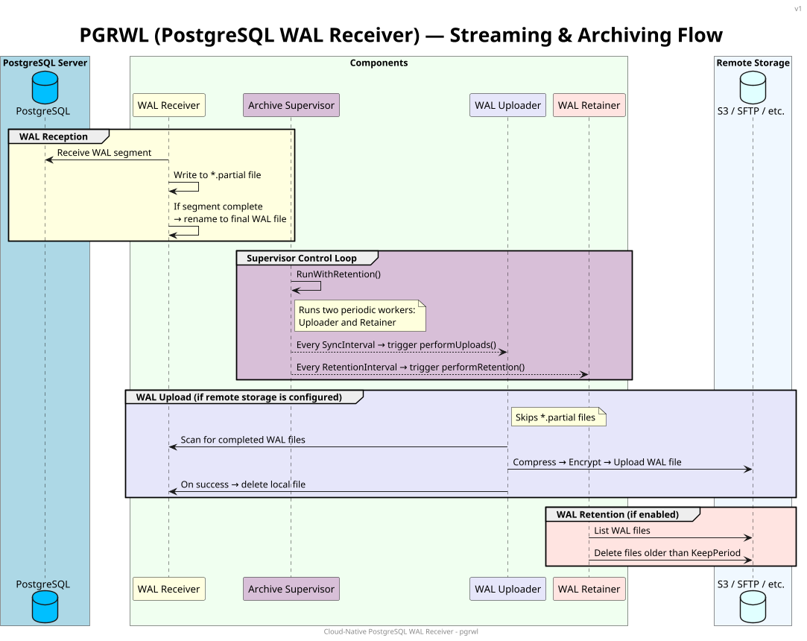
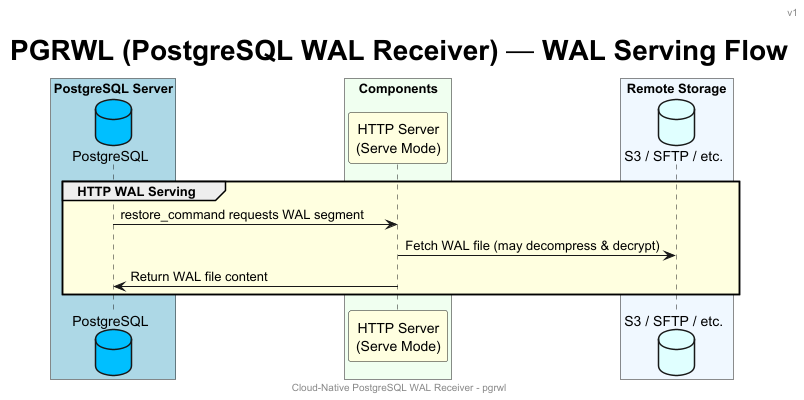
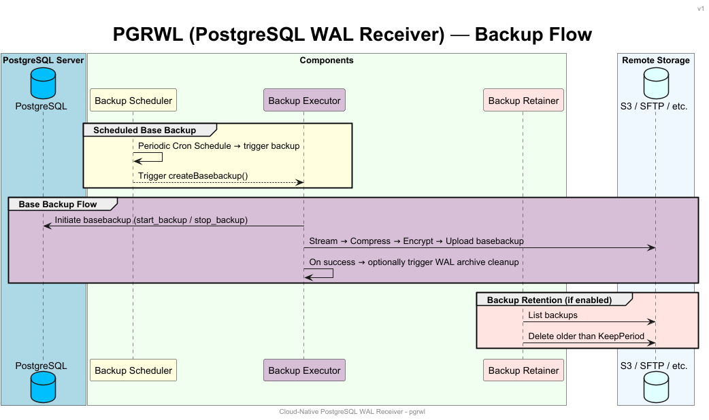

## 云原生PG持续归档/备份工具: pgrwl    
            
### 作者            
digoal            
            
### 日期            
2025-06-17            
            
### 标签            
PostgreSQL , PolarDB , DuckDB , 归档 , pg_receivewal , pgrwl , 对象存储 , WAL , 压缩 , 编码 , 备份 , 恢复 , 接收模式 , 服务模式 , 备份模式      
            
----            
            
## 背景      
如果你在云端使用PostgreSQL, 特别是在容器服务中使用PostgreSQL, 持续备份数据库和归档, 确保你的数据库在任何情况下(被攻击丢了数据、误操作、文件损坏、云服务故障等等)需要恢复时, 可以恢复出来!   
  
你就需要一套完整的备份和恢复工具, 本文介绍一个云原生PG持续归档工具: pgrwl    
  
Cloud-Native PostgreSQL WAL receiver. Stream, compress, encrypt, upload, retain and monitor your WAL archive.  
  
pgrwl工具有几个功能:  
- 按定时任务备份PostgreSQL全量数据到对象存储  
- 连续备份PostgreSQL WAL到对象存储, 采用与pg_receivewal相同的流复制协议机制, 实时接收PG生成的WAL record, 做到近乎WAL 0丢失保护  
- 在恢复时, 可作为服务端. 配合`restore_command`实现从对象存储提取所需WAL文件进行PITR恢复  
- 支持retention策略, 根据保留时长自动清理对象存储中的WAL和数据备份文件.   
- 与容器管理服务例如k8s完美整合  
  
按功能区分pgrwl的集中工作模式:  
  
接收模式, 持续备份wal  
  
  
  
服务模式, 恢复时使用, 充当服务对接`restore_command`  
  
  
  
备份模式, 根据配置任务, 定时备份全量数据  
  
  
  
更多详情请参考项目地址： https://github.com/hashmap-kz/pgrwl  
    
  
#### [期望 PostgreSQL|开源PolarDB 增加什么功能?](https://github.com/digoal/blog/issues/76 "269ac3d1c492e938c0191101c7238216")
  
  
#### [PolarDB 开源数据库](https://openpolardb.com/home "57258f76c37864c6e6d23383d05714ea")
  
  
#### [PolarDB 学习图谱](https://www.aliyun.com/database/openpolardb/activity "8642f60e04ed0c814bf9cb9677976bd4")
  
  
#### [PostgreSQL 解决方案集合](../201706/20170601_02.md "40cff096e9ed7122c512b35d8561d9c8")
  
  
#### [德哥 / digoal's Github - 公益是一辈子的事.](https://github.com/digoal/blog/blob/master/README.md "22709685feb7cab07d30f30387f0a9ae")
  
  
#### [About 德哥](https://github.com/digoal/blog/blob/master/me/readme.md "a37735981e7704886ffd590565582dd0")
  
  

  
