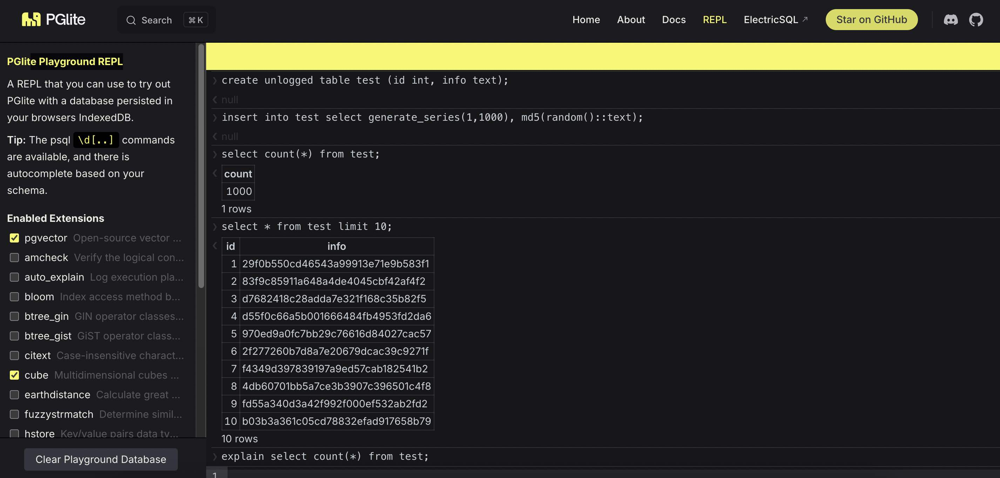

## PGLite: 把PG塞进浏览器中运行 , PG教学演示又方便了!   
              
### 作者              
digoal              
              
### 日期              
2025-06-17              
              
### 标签              
PostgreSQL , PolarDB , DuckDB , WASM , web , REPL , 浏览器 , PGLite     
              
----              
              
## 背景        
以前教学生们使用PostgreSQL, 第一步就是让学生们安装PostgreSQL, 因为学生的机器环境千奇百怪, 那个难啊.  
  
然后有了docker容器, 终于简单一点点了, 但是问题变成了:   
- 如何安装docker desktop  
- 如何科学上网下载docker image  
  
好了现在终于可以在浏览器中体验PostgreSQL了, 就像之前我们说的体验DuckDB/glaredb那么简单  
- https://shell.duckdb.org/  
- https://glaredb.com/  
  
感谢PGLite, 把PostgreSQL进行了WASM封装, PGlite can be used in both Node/Bun/Deno or the browser, and with any JavaScript framework.  
- https://pglite.dev/repl/  
  
  
  
但是请注意, 虽然是在浏览器中运行, 其实用的就是你本地的资源, 注意别运行太猛了, 把内存、磁盘打爆就不好了.  
  
再也不用学生们安装PostgreSQL了. 不过如果学习要用到PG的管理工具、命令行、参数配置等, 则还是需要安装. 祭出我的万能docker镜像  
- [《2023-PostgreSQL Docker镜像学习环境 ARM64版, 已集成热门插件和工具》](../202308/20230814_02.md)       
- [《2023-PostgreSQL Docker镜像学习环境 AMD64版, 已集成热门插件和工具》](../202307/20230710_03.md)       
  
或者你也可以使用pigsty( https://pigsty.cc/  ,  https://pigsty.io/ )直接拉起pg进行学习.    
  
更多PGLite REPL的用法请参考: https://pglite.dev/docs/  
    
  
#### [期望 PostgreSQL|开源PolarDB 增加什么功能?](https://github.com/digoal/blog/issues/76 "269ac3d1c492e938c0191101c7238216")
  
  
#### [PolarDB 开源数据库](https://openpolardb.com/home "57258f76c37864c6e6d23383d05714ea")
  
  
#### [PolarDB 学习图谱](https://www.aliyun.com/database/openpolardb/activity "8642f60e04ed0c814bf9cb9677976bd4")
  
  
#### [PostgreSQL 解决方案集合](../201706/20170601_02.md "40cff096e9ed7122c512b35d8561d9c8")
  
  
#### [德哥 / digoal's Github - 公益是一辈子的事.](https://github.com/digoal/blog/blob/master/README.md "22709685feb7cab07d30f30387f0a9ae")
  
  
#### [About 德哥](https://github.com/digoal/blog/blob/master/me/readme.md "a37735981e7704886ffd590565582dd0")
  
  

  
