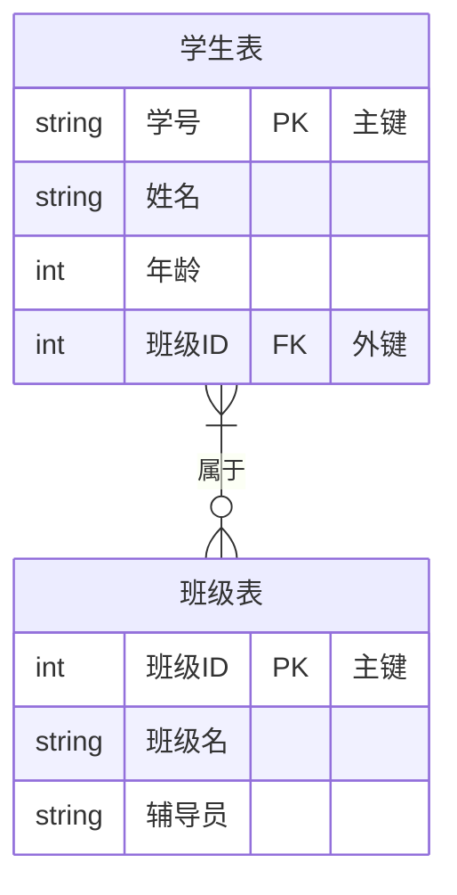
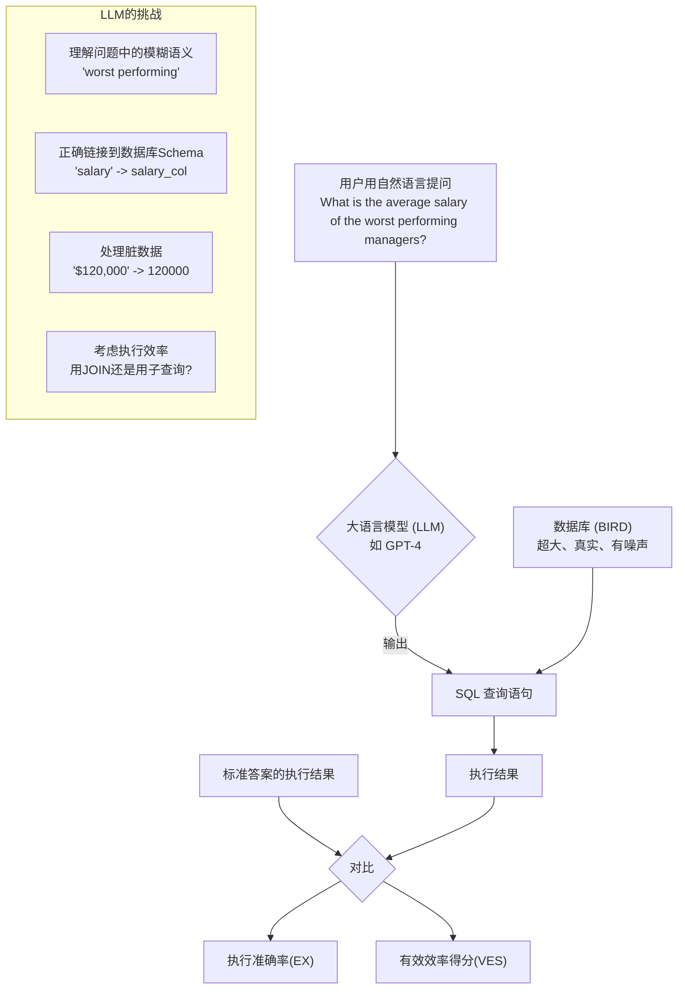
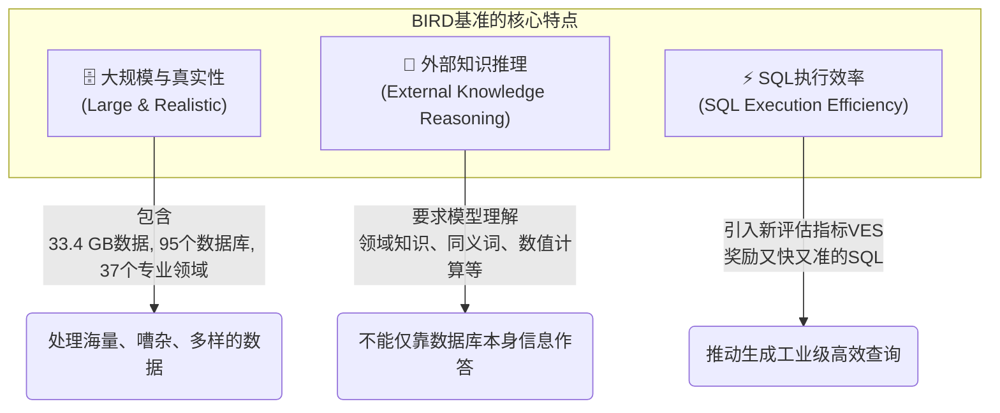
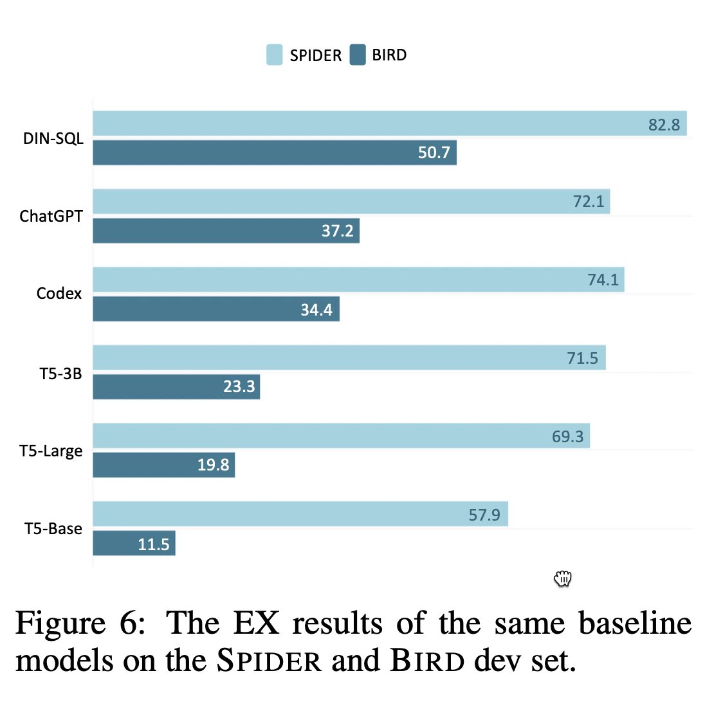
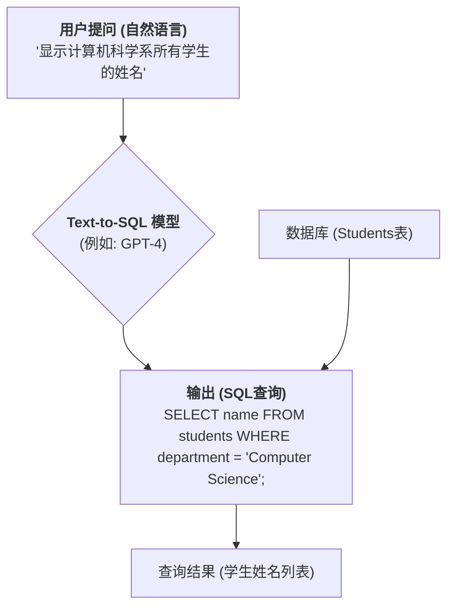
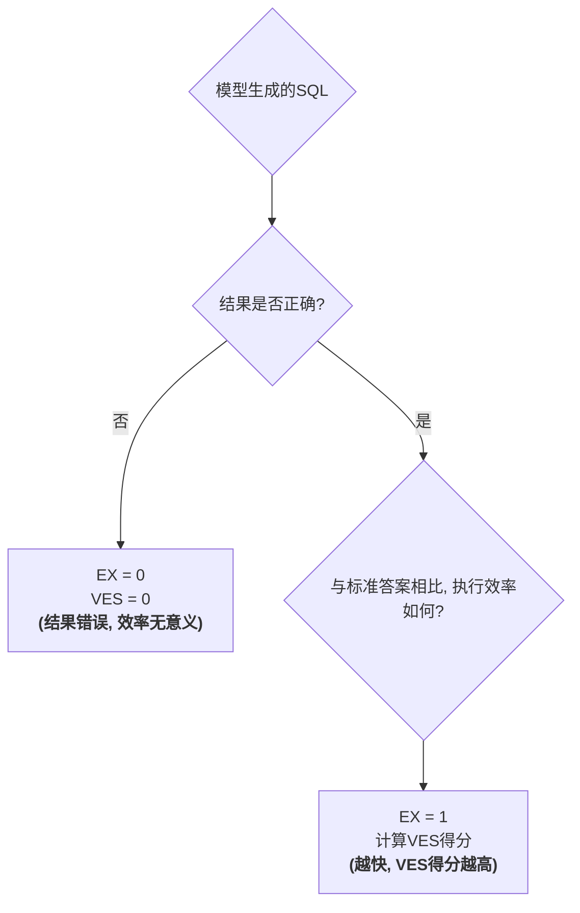

## AI论文解读 | Can LLM Already Serve as A Database Interface? A BIg Bench for Large-Scale Database Grounded Text-to-SQLs
        
### 作者        
digoal        
        
### 日期        
2025-06-18        
        
### 标签        
PostgreSQL , PolarDB , DuckDB , AI , 论文解读        
        
----        
        
## 背景       
      
https://arxiv.org/pdf/2305.03111        
  
[《如何评测 Text-to-SQL 产品是否靠谱? | BIRD-SQL》](../202506/20250616_03.md)  
        
提示:        
```        
读懂《Can LLM Already Serve as A Database Interface? A BIg Bench for Large-Scale Database Grounded Text-to-SQLs》这篇论文需要提前掌握哪些基础知识, 请使用中文给我讲一下这些基础知识, 尽量通熟易懂, 可以使用markdown支持的图形增加解释性.        
        
使用中文通熟易懂的解读《Can LLM Already Serve as A Database Interface? A BIg Bench for Large-Scale Database Grounded Text-to-SQLs》这篇论文, 关键内容请深入讲解, 可以使用markdown支持的图形增加解释性.        
        
使用中文提取《Can LLM Already Serve as A Database Interface? A BIg Bench for Large-Scale Database Grounded Text-to-SQLs》论文中一些重要的术语并详细解释, 可以使用markdown支持的图形示增加解释性.        
```        
        
## 1 前置知识  
  
好的，没问题。要完全理解《Can LLM Already Serve as A Database Interface?》这篇关于BIRD基准的论文，你需要一些跨领域的基础知识。这篇论文的核心是**测试现有的大语言模型（LLM）在真实、复杂、大规模的数据库上，将自然语言（我们说的话）转换成数据库查询语言（SQL）的能力究竟如何**。

简单来说，这篇论文就像是为现在最聪明的AI学生（如GPT-4）设计了一场超高难度的“数据库对话”期末考试（BIRD），并分析了它们的成绩单。

你需要掌握的基础知识主要分为以下三大块：

### 1. 数据库基础知识 (Database Fundamentals)

这是整个任务的“游乐场”。模型需要在这个场地上理解规则并进行操作。

#### 1.1 关系型数据库 (Relational Database)

你可以把它想象成一个由多个相互关联的Excel表格组成的集合。

* **表 (Table)**: 就像一个Excel工作表，用于存储特定类型的数据，比如“学生表”、“课程表”。
* **列 (Column/Field)**: 表中的一列，定义了数据的属性，比如“学生表”中的“姓名”、“学号”、“年龄”列。
* **行 (Row/Record)**: 表中的一行，代表一个具体的数据实体，比如学生“张三”的所有信息。

#### 1.2 SQL (Structured Query Language)

这是与数据库“对话”的语言。你想从数据库里查找、添加、修改或删除数据，都得用SQL。

* **基本查询**: `SELECT ... FROM ... WHERE ...` 是最核心的语法。
    * `SELECT 姓名, 专业 FROM 学生表 WHERE 年龄 > 20;`
    * **中文解释**: 从“学生表”里，把所有“年龄”大于20的学生的“姓名”和“专业”找出来。

#### 1.3 数据库模式 (Database Schema)

这是数据库的“设计图纸”或“地图”。它描述了数据库里有哪些表，每个表有哪些列，列的数据类型是什么（数字、文本、日期等），以及表与表之间是如何关联的（比如学生表的“班级ID”关联到班级表的“ID”）。模型必须先看懂这张图纸，才能正确生成SQL。


*上图就是一个简单的Schema，表示一个学生属于一个班级。*

#### 1.4 脏数据/噪声数据 (Dirty/Noisy Data)

 这是BIRD基准着重强调的一点。真实世界的数据库往往不完美。比如，“薪水”列里可能存着`'US$ 50,000'`这样的文本，而不是纯数字`50000`。模型需要足够智能，能够先“清洗”这些数据（去掉`US$`和逗号），再进行计算，这是传统学术基准很少覆盖的挑战  。

---

### 2. 自然语言处理 (NLP) 与大语言模型 (LLM) 基础

这是执行任务的“大脑”。

#### 2.1 自然语言处理 (NLP)

一个让计算机能够理解、解释和生成人类语言（如中文、英文）的AI领域。Text-to-SQL就是NLP的一个具体应用。

#### 2.2 大语言模型 (Large Language Models, LLMs)

 它们是当今最强大的NLP模型，比如论文中提到的 **GPT-4, ChatGPT, Claude-2** 等  。它们通过在海量的文本和代码数据上进行训练，获得了强大的语言理解、推理和生成能力。

#### 2.3 关键训练/使用方式

*  **微调 (Fine-tuning, FT)**: 就像让一个知识渊博的通才（预训练好的LLM），针对“Text-to-SQL”这个特定任务进行专项强化训练。论文中对T5模型就采用了这种方法  。
*  **上下文学习 (In-Context Learning, ICL)**: 不需要重新训练模型。而是在提问时，直接在输入中给模型一些例子（few-shot）或者不给例子（zero-shot），让它“照猫画虎”地回答新问题。论文中对GPT-4等模型主要采用零样本（zero-shot）的方式进行测试  。
*  **思维链 (Chain-of-Thought, CoT)**: 引导LLM在回答前先“思考一步，写一步”，把推理过程展现出来。这能显著提升模型在复杂推理任务上的表现  。

---

### 3. 核心任务与评估 (The Core Task & Evaluation)

这是连接上述两大知识领域的桥梁，也是论文的核心内容。

#### 3.1 文本到SQL (Text-to-SQL)

 核心任务就是将用户的自然语言问题，自动翻译成可在数据库上执行的SQL查询  。

* **用户问题**: "统计一下计算机系有多少个男同学？"
* **模型输出 (SQL)**: `SELECT COUNT(*) FROM student_table WHERE department = '计算机系' AND gender = '男';`

#### 3.2 任务难点 (Challenges)

这篇论文提出的BIRD基准，特意放大了真实世界中的几个难点：

1.   **模式链接 (Schema Linking)**: 正确地将问题中的词（如“薪水”）对应到数据库Schema中正确的列（如 `salary_amount`） 。
2.   **知识推理 (Knowledge Reasoning)**: 有时需要数据库之外的常识或领域知识。比如问题提到“纽约”，但数据库里存的是“NYC”，模型需要知道它们是同一个东西  。
3.   **SQL执行效率 (SQL Execution Efficiency)**: 生成正确的SQL只是第一步，生成运行速度快的SQL同样重要。尤其是在动辄几十GB的大型数据库上，一个低效的SQL可能要跑几十分钟甚至几小时  。

#### 3.3 评估指标 (Evaluation Metrics)

如何评价模型做得好不好？论文用了两个关键指标：

1.   **执行准确率 (Execution Accuracy, EX)**: 模型生成的SQL，其查询结果是否和标准答案的SQL查询结果**完全一致**  。这是“对不对”的问题。
2.   **有效效率得分 (Valid Efficiency Score, VES)**: 这是BIRD提出的新指标   。它首先要求SQL必须正确（EX=1），然后在此基础上，**衡量其执行速度相对于标准答案SQL的速度**。一个又对又快的SQL会得到高分  。这是“好不好”的问题。

### 总结：知识如何串联起来

当你阅读这篇论文时，你可以把整个故事想象成下图：



 这篇论文的**核心贡献**在于，它通过构建BIRD这个极其困难且真实的基准测试，得出了一个明确的结论：尽管LLM在很多任务上表现惊人，但在充当真实世界数据库接口这一角色上，它们离经验丰富的人类专家还有非常大的差距（GPT-4准确率约55%，人类约93%） ，尤其是在处理脏数据、复杂推理和保证查询效率方面。

掌握了以上这些基础知识，你就能轻松地理解论文的研究动机、技术挑战、实验方法和结论了。
  
## 2 解读论文 
  
好的，我们来深入解读一下这篇名为《Can LLM Already Serve as A Database Interface? A BIg Bench for Large-Scale Database Grounded Text-to-SQLs》的论文。

 简单来说，这篇论文的核心是**通过创建一个极其困难且贴近真实的全新基准测试（BIRD），来回答“现在的大语言模型（LLMs）能否胜任真实世界中数据库查询接口”这一问题**。剧透一下：论文给出的答案是——还不能  。

下面我们将从研究动机、BIRD基准的特点、评估方法、实验结果和结论几个方面，为您深入浅出地剖析这篇论文。

-----

### 1\. 研究背景与动机：为什么需要一个新的“考场”？

 近年来，像GPT-4这样的大语言模型在许多任务上表现惊人，尤其是在一些学术性的Text-to-SQL（文本到SQL）基准（如Spider）上取得了很高的分数  。这让人们产生了一个疑问：我们是不是很快就可以用自然语言和数据库自由对话，不再需要专业的数据库分析师了？

 作者团队认为，现实并非如此。他们指出，之前流行的学术基准存在一个巨大缺陷：**它们过于“干净”和“理想化”，与真实世界的数据库应用场景脱节**  。

  *  **数据库规模小**：大部分基准的数据库只有几千行数据，而真实世界的数据库动辄上千万甚至上亿行  。
  *  **数据质量高**：学术数据非常规整，而现实中的数据充满了格式不一、有特殊符号的“脏数据”  。
  *  **不关心效率**：只要SQL查询结果正确就行，不考虑查询速度。但在大型数据库上，一个低效的查询可能要运行数小时，这是无法接受的  。

 为了弥补这一差距，作者们创建了**BIRD (BIg bench for large-scale Database grounded text-to-SQL)**，一个专为模拟真实世界挑战而生的新“考场”  。

### 2\. BIRD：一个前所未有的高难度“考场”

BIRD基准的设计充满了对真实世界复杂性的考量，它在三个核心方面树立了新的标杆：



#### 深入讲解BIRD的挑战：

1.  **大规模与“脏数据” (Large Scale & Dirty Data)**

      *  **规模**：BIRD包含95个数据库，总大小达33.4GB，平均每个数据库有约55万行记录，这远超以往的基准   。数据库涵盖了体育、医疗、金融等37个专业领域  。
      *  **脏数据**：BIRD特意保留了真实数据中的噪声。例如，在处理“平均薪水”问题时，模型需要从`'US$ 50,000'`这样的文本中提取出数字`50000`才能计算，这极大地考验了模型的理解和数据处理能力  。

2.  **外部知识推理 (External Knowledge Reasoning)**

      *  模型需要结合外部知识才能正确理解问题。例如，当问题提到“给可以贷款的账户计数”时，模型需要知道“只有‘OWNER’类型的账户才有资格贷款”这一外部业务规则   。BIRD为此专门标注了四类知识证据：数值推理、领域知识、同义词和数值说明  。

3.  **SQL执行效率 (SQL Execution Efficiency)**

      *  这是BIRD开创性的贡献。在BIRD中，一个仅仅结果正确的SQL是不够的，它还必须高效。例如，对于同一个问题，一个使用低效子查询的SQL可能运行22秒，而一个优化后使用`EXISTS`的SQL仅需4秒  。BIRD鼓励模型向后者看齐。

### 3\. 如何“考试”：全新的评估方法

为了全面评估模型在真实场景下的能力，BIRD引入了新的评估指标，尤其是一个全新的效率指标：

  *  **执行准确率 (Execution Accuracy, EX)**：这是传统的指标，衡量模型生成的SQL查询结果是否与标准答案**完全一致**  。这是对“正确性”的考核。

  *  **有效效率得分 (Valid Efficiency Score, VES)**：这是BIRD独创的指标，衡量“**既对又快**”的能力  。

      *  **前提**：SQL必须首先是正确的（即EX=1），否则效率再高也毫无意义，得分为0  。
      *  **计算**：如果SQL正确，VES会计算其运行时间与标准答案运行时间的比率，并用公式 $VES = \\sqrt{\\frac{E(Y\_n)}{E(\\hat{Y}\_n)}}$ 进行评估，其中 $E(Y\_n)$ 是标准答案SQL的执行时间， $E(\\hat{Y}\_n)$ 是模型生成SQL的执行时间  。这个得分奖励那些比标准答案更快或同样快的正确查询。

### 4\. “考生”表现分析：发人深省的实验结果

 作者团队在BIRD上测试了当时最先进的一系列模型，包括T5家族（微调模型）和GPT-4、Claude-2、ChatGPT等（上下文学习模型），并与人类专家的表现进行了对比  。

#### 关键发现：

1.   **顶尖模型也惨败**：即便是最强的GPT-4，在提供了外部知识的情况下，执行准确率（EX）也仅为**54.89%**。这与人类专家的 **92.96%** 相去甚远  。这有力地证明了LLM目前还无法替代人类处理复杂的真实世界Text-to-SQL任务。

2.   **BIRD的难度远超以往**：从下图可以看出，所有模型在BIRD上的表现都比在Spider上出现了断崖式下跌，这凸显了BIRD所引入的真实世界挑战是现有模型难以应对的  。
     
       
     
     *(数据来源：论文图6)*  

4.   **外部知识是关键**：实验表明，当向模型提供相关的外部知识证据时，所有模型的性能都有了显著提升   。例如，GPT-4在有知识辅助时，准确率从34.88%跃升至54.89%  。这说明让模型学会如何利用外部知识是未来研究的重要方向。

5.  **错误类型分析**：通过对ChatGPT的错误案例进行分析，发现主要问题出在：

      *  **错误的模式链接 (41.6%)**：模型理解了问题，但将它关联到了数据库中错误的表或列  。
      *  **误解数据库内容 (40.8%)**：模型“幻想”出不存在的列，或者记错了数据库的结构，尤其是在数据库很大时  。
      *  **误解知识证据 (17.6%)**：模型无法正确理解或使用提供给它的外部知识，有时甚至会直接复制提示中的公式，而没有将其转换为正确的SQL语法  。

### 5\. 结论与启示

这篇论文通过BIRD这个里程碑式的基准，给出了一个清晰而响亮的回答：

>  **目前的大语言模型（LLMs）还不能完全胜任真实、复杂的数据库接口任务。**  

 它们在处理大规模、嘈杂的数据，利用外部知识进行深度推理，以及保证查询效率方面，与人类专家存在巨大差距  。

 BIRD的发布不仅揭示了当前技术的局限，更重要的是，它为未来的研究指明了方向，并提供了一个宝贵的平台，推动整个社区共同解决从学术研究到工业应用的“最后一公里”问题  。
  
## 3 术语  
  
好的，我们来从《Can LLM Already Serve as A Database Interface?》这篇论文中提取并解释一些核心的关键术语。

---

### 1. Text-to-SQL (文本到SQL)

这是整篇论文所研究的核心任务。

*  **定义**: 指的是将人类的自然语言问题（例如：“哪些员工的薪水超过了5万美元？”）自动转换成可以在关系型数据库上执行的结构化查询语言（SQL）代码的过程  。
*  **目的**: 其最终目标是让不具备专业SQL知识的普通用户也能通过说话或打字的方式，轻松地从数据库中获取所需信息  。
* **挑战**: 这项任务的难点在于，模型需要准确理解人类语言的模糊性和多样性，并将其精确地映射到数据库的严格结构（即模式）上。



### 2. BIRD (BIg bench for large-scale Database grounded text-to-SQL)

 这是本篇论文最核心的贡献——一个全新的、高难度的基准测试数据集  。

*  **定义**: BIRD是一个用于评估Text-to-SQL任务的大规模基准，其特点是包含了大规模（总计33.4GB）、真实且带有噪声的数据库  。
*  **目的**: 旨在弥合学术研究与真实世界应用之间的差距   。之前的基准（如Spider、WikiSQL）大多侧重于数据库模式（schema），而忽略了真实数据值的复杂性  。
* **新挑战**: BIRD引入了几个之前基准未充分考虑的挑战：
    *  处理“脏”和“噪声”的数据库值（例如，薪水列中包含`US$`和逗号）  。
    *  需要外部知识才能正确作答  。
    *  关注并评估生成SQL的执行效率  。

### 3. Execution Accuracy (EX) (执行准确率)

这是评估Text-to-SQL模型性能的传统核心指标之一。

*  **定义**: 指在评估集中，模型预测生成的SQL执行后得到的结果，与标准答案SQL执行后得到的结果完全相同的样本所占的比例  。
* **计算方法**:
    *  $EX = \frac{\text{预测结果与标准答案结果完全一致的样本数}}{\text{总样本数}}$  
* **局限性**: EX只关心结果“对不对”，不关心获取结果的过程是否高效。一个运行很慢但结果正确的SQL和一个运行很快且结果正确的SQL，在EX指标上得分是完全一样的。

### 4. Valid Efficiency Score (VES) (有效效率得分)

这是BIRD基准独创的一个全新评估指标，旨在同时衡量查询的准确性与效率。

*  **定义**: VES是为评估模型生成的**有效SQL**的效率而设计的   。这里的“有效SQL”指的是那些查询结果与标准答案一致的SQL  。
*  **核心思想**: 一个SQL如果结果是错的，那么它运行得再快也没有任何价值，其效率分将被视为无效（或为0）  。只有在结果正确的前提下，我们才去衡量它的效率。
* **计算公式**:
    *  公式:   `$VES = \frac{\sum_{n=1}^{N}\mathbb{I}(V_{n},\hat{V}_{n})\cdot R(Y_{n},\hat{Y}_{n})}{N}$`  
    *  其中， $\mathbb{I}(V_{n},\hat{V}_{n})$ 是一个指示函数，只有当预测结果与标准答案一致时才为1，否则为0（即结果错误则VES为0）  。
    *  $R(Y_{n},\hat{Y}_{n})$ 代表了预测SQL相对于标准答案SQL的效率比率   。在论文中，主要通过执行时间来衡量，一个更快、更高效的SQL会得到更高的R值  。



### 5. In-Context Learning (ICL) (上下文学习)

这是一种与微调（Fine-tuning）相对的大语言模型使用方式，论文中用于测试GPT-4等模型。

*  **定义**: ICL是一种让大语言模型在不进行额外训练或参数调整的情况下执行新任务的方法  。
*  **实现方式**: 通过在输入提示（prompt）中提供任务描述和少量示例（few-shot）或不提供示例（zero-shot），模型就能理解任务意图并“照猫画虎”地生成答案  。
*  **论文中的应用**: 论文对Codex、ChatGPT、GPT-4等模型采用了零样本（zero-shot）的ICL方式进行评估，因为在真实场景中，模型面对的往往是全新的、从未见过的数据库  。

### 6. External Knowledge Evidence (外部知识证据)

这是BIRD为了模拟真实分析场景而引入的一个重要概念。

*  **定义**: 指的是为了将自然语言问题映射到数据库中的值而需要的、数据库本身不包含的额外知识  。
* **分类**: BIRD将这类知识分为四种：
    1.   **数值推理知识 (Numeric Reasoning Knowledge)**: 涉及数学计算，如百分比、公式等  。
    2.   **领域知识 (Domain Knowledge)**: 特定行业或领域的专有知识，如金融指标的含义  。
    3.   **同义词知识 (Synonym Knowledge)**: 具有相同或相似含义的词或短语  。
    4.   **数值说明 (Value Illustration)**: 对数据库中特定值的详细解释，例如`'pos = c'`在数据库中代表篮球运动员的位置是“中锋”  。
  
## 参考        
         
https://arxiv.org/pdf/2305.03111  
        
        
<b> 以上内容基于DeepSeek、Qwen、Gemini及诸多AI生成, 轻微人工调整, 感谢杭州深度求索人工智能、阿里云、Google等公司. </b>        
        
<b> AI 生成的内容请自行辨别正确性, 当然也多了些许踩坑的乐趣, 毕竟冒险是每个男人的天性.  </b>        
  
  
  
#### [期望 PostgreSQL|开源PolarDB 增加什么功能?](https://github.com/digoal/blog/issues/76 "269ac3d1c492e938c0191101c7238216")
  
  
#### [PolarDB 开源数据库](https://openpolardb.com/home "57258f76c37864c6e6d23383d05714ea")
  
  
#### [PolarDB 学习图谱](https://www.aliyun.com/database/openpolardb/activity "8642f60e04ed0c814bf9cb9677976bd4")
  
  
#### [PostgreSQL 解决方案集合](../201706/20170601_02.md "40cff096e9ed7122c512b35d8561d9c8")
  
  
#### [德哥 / digoal's Github - 公益是一辈子的事.](https://github.com/digoal/blog/blob/master/README.md "22709685feb7cab07d30f30387f0a9ae")
  
  
#### [About 德哥](https://github.com/digoal/blog/blob/master/me/readme.md "a37735981e7704886ffd590565582dd0")
  
  

  
