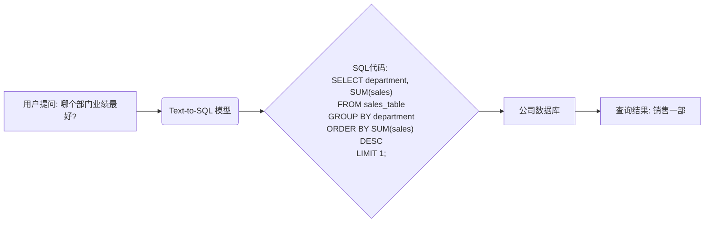
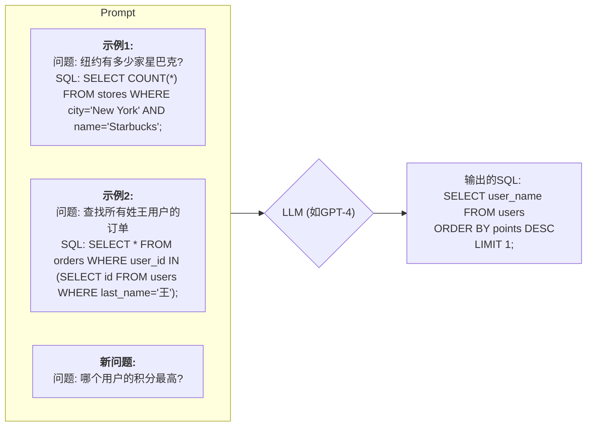
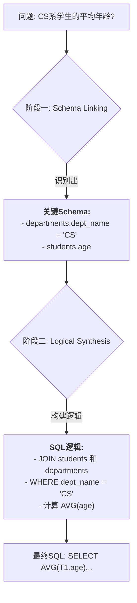
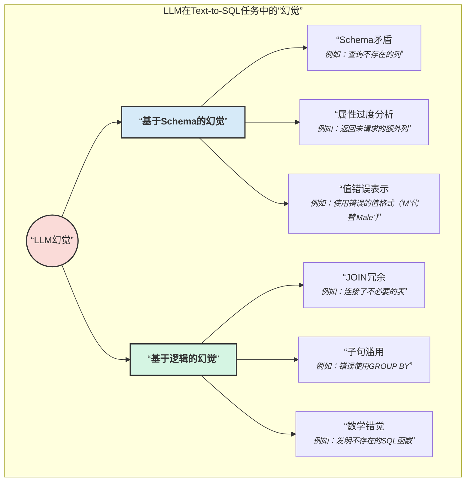

## AI论文解读 | Before Generation, Align it! A Novel and Effective Strategy for Mitigating Hallucinations in Text-to-SQL Generation
        
### 作者        
digoal        
        
### 日期        
2025-06-18        
        
### 标签        
PostgreSQL , PolarDB , DuckDB , AI , 论文解读        
        
----        
        
## 背景       
      
https://aclanthology.org/2024.findings-acl.324.pdf        
  
[《如何评测 Text-to-SQL 产品是否靠谱? | BIRD-SQL》](../202506/20250616_03.md)  
        
提示:        
```        
读懂《Before Generation, Align it! A Novel and Effective Strategy for Mitigating Hallucinations in Text-to-SQL Generation》这篇论文需要提前掌握哪些基础知识, 请使用中文给我讲一下这些基础知识, 尽量通熟易懂, 可以使用markdown支持的图形增加解释性.        
        
使用中文通熟易懂的解读《Before Generation, Align it! A Novel and Effective Strategy for Mitigating Hallucinations in Text-to-SQL Generation》这篇论文, 关键内容请深入讲解, 可以使用markdown支持的图形增加解释性.        
        
使用中文提取《Before Generation, Align it! A Novel and Effective Strategy for Mitigating Hallucinations in Text-to-SQL Generation》论文中一些重要的术语并详细解释, 可以使用markdown支持的图形示增加解释性.        
```        
        
## 1 前置知识  
  
好的，为了完全理解《Before Generation, Align it!》这篇论文，你需要了解一些核心的基础知识。这篇论文的精髓在于，它没有发明一个全新的大模型，而是巧妙地设计了一种策略，引导现有的大语言模型（LLM）更好地完成一项特定任务：**文本到SQL的转换 (Text-to-SQL)**。

我会将所需的基础知识分为五个部分，由浅入深，并使用 Markdown 图形来帮助你理解。

---

### 1. 什么是 Text-to-SQL？（任务目标）

这是最基础的概念，也是这篇论文要解决的核心问题。

简单来说，**Text-to-SQL** 就是让计算机能够**将人类的日常语言（自然语言问句）自动转换成数据库可以执行的查询语言（SQL）**。

想象一下，你是一个公司的经理，但你不会写代码。你想知道“哪个销售部门上个季度的业绩最好？”，你不需要去麻烦IT部门的同事，而是直接把这个问题输入一个系统，系统会自动生成对应的SQL代码，然后从公司数据库里把结果拿给你。

**流程示意图：**


**你需要理解**：这项技术的终极目标是降低普通人使用数据库的门槛，让数据分析变得像聊天一样简单。

---

### 2. 什么是大语言模型 (LLM) 与 上下文学习 (ICL)？（核心技术）

这是驱动现代Text-to-SQL发展的核心技术，也是论文中所有方法的基础。

*  **大语言模型 (Large Language Model, LLM)**：你可以把它想象成一个“超级大脑”，比如现在非常有名的 **GPT-4**   。它通过学习海量的文本和代码数据，掌握了语言的规律、世界的知识，甚至一定的逻辑推理能力  。它不仅能和你聊天，还能写文章、写代码。

*  **上下文学习 (In-Context Learning, ICL)**：这是与LLM交互的一种非常神奇的方式。你不需要用成千上万的数据去“训练”或“微调”这个模型，只需要在输入问题时，给它看几个例子（demonstrations），它就能“依样画葫芦”，学会解决你提出的新问题  。
    *  **Few-shot (少样本)**：给模型看几个例子  。
    *  **Zero-shot (零样本)**：不给例子，直接让模型做  。

**ICL工作原理示意图：**

**你需要理解**：论文里的方法都是基于ICL的，它们通过精心设计Prompt（包含问题、指令和可能的示例）来引导LLM生成SQL，而不是去修改LLM本身。

---

### 3. 什么是“幻觉” (Hallucination)？（主要挑战）

这是论文要解决的核心痛点。

 LLM的“幻觉”指的是模型**生成了看似合理，但实际上是错误的、无中生有的或者与事实不符的内容**  。它就像一个知道很多但有时会“一本正经地胡说八道”的专家。

 在Text-to-SQL任务中，幻觉主要分为两类  ：

1.  **基于Schema的幻觉 (Schema-based Hallucinations)**：与数据库结构（即Schema，包括表名、列名等）相关的错误。
    *  **Schema 矛盾**：生成的SQL违背了数据库的结构，比如对两个没有关联的表进行JOIN操作  。
    *  **属性过度分析**：查询只问了“谁最高？”，SQL却返回了姓名和身高两列，引入了不必要的列  。
    *  **值错误表示**：数据库里性别列存的是 'Male'，但SQL里去查询 `gender = 'M'`  。

2.  **基于逻辑的幻觉 (Logic-based Hallucinations)**：与SQL查询逻辑相关的错误。
    *  **JOIN 冗余**：明明查一张表就能解决，却复杂地JOIN了三四张表  。
    *  **子句滥用**：不该用 `GROUP BY` 的地方用了，导致结果排序或限制出错  。
    *  **数学错觉**：需要计算百分比时，LLM可能自己“发明”一个不存在的 `DIVIDE()` 函数，而不是使用标准的数学表达式 `(COUNT(...) * 100.0 / ...)`  。

 **你需要理解**：幻觉是阻碍LLM可靠地应用于Text-to-SQL的最大障碍之一。即使生成的SQL看起来很专业，一个小小的幻觉就可能导致结果完全错误  。

---

### 4. 什么是“两阶段框架”？（主流范式）

 为了让复杂的Text-to-SQL任务更容易被LLM理解和执行，研究人员通常会把任务拆解成两个主要步骤，这就是“两阶段框架”  。这篇论文的方法也建立在这个框架之上。

**阶段一：Schema Linking (模式链接)**
*  **目标**：识别出用户问题中提到的词语分别对应数据库中的哪些**表**和**列**  。
* **类比**：就像做阅读理解题时，先把题目中的关键人名、地名在原文中划出来。
* **例子**：对于问题“告诉我计算机科学系所有学生的姓名”，Schema Linking需要识别出 “计算机科学系” 对应 `departments` 表中的 `dept_name = 'Computer Science'`，以及 “学生的姓名” 对应 `students` 表中的 `student_name` 列。

**阶段二：Logical Synthesis (逻辑合成)**
*  **目标**：基于上一步链接好的Schema元素，以及问题的逻辑（比如“多少”、“平均”、“最”），来构建最终的、完整的SQL查询语句  。
* **类比**：在划出关键信息后，根据题目的要求（是问原因还是问结果），组织语言写出完整的答案。

**两阶段框架示意图：**

 **你需要理解**：这个框架将一个复杂任务拆解成了两个相对简单的子任务，有助于提高准确率并使过程更具可解释性。但同时，每个阶段都可能产生幻觉  。

---

### 5. 什么是 Pandas？（论文用到的一个类比工具）

虽然这不是一个必须精通的知识点，但了解它能帮你更好地理解论文的核心创新 **TALOG** 模块。

**Pandas** 是Python中一个非常流行的数据分析库。数据科学家用它来进行数据的筛选、转换、分组、聚合等一系列操作，通常是**一步一步**进行的。

 论文中提到，直接让LLM生成复杂的SQL逻辑很容易出错（产生逻辑幻觉）。于是，他们想出了一个办法：不直接写SQL，而是先让LLM生成一个类似于Pandas操作的 **“分析步骤”的伪代码**（Symbolic Representation） 。因为LLM在训练中见过大量类似的数据分析代码，对这种分步思考的模式更熟悉。

**TALOG 的思路类比：**
* **不好的方式（直接生成）**：
    > "喂，LLM，给我写一个计算各部门员工平均工资，并找出平均工资超过5000的部门的SQL。"（LLM可能直接就写错了）

* **TA-SQL 的方式（先生成分析步骤，再转SQL）**：
    > "喂，LLM，用类似Pandas的思路规划一下怎么解决这个问题。"
    >
    > LLM生成分析计划:
    > 1.  `step1 = group data by 'department'`
    > 2.  `step2 = calculate average 'salary' for each group`
    > 3.  `step3 = filter groups where average 'salary' > 5000`
    > 4.  `result = select 'department' from step3`
    >
    > 然后，再让LLM或者一个简单的规则器把这个清晰的计划翻译成最终的SQL。

 **你需要理解**：论文的**任务对齐 (Task Alignment)**   思想，就是把LLM不那么擅长的、抽象的“SQL生成任务”，巧妙地**对齐**到它更熟悉的“代码生成”或“分步逻辑规划”任务上，从而减少幻觉，提升准确率。

### 总结

掌握了以上五个知识点，你就可以轻松地读懂这篇论文了：

1.  **目标**：做好 **Text-to-SQL**。
2.  **工具**：使用 **LLM** 的 **ICL** 能力。
3.  **挑战**：解决 **幻觉** 问题。
4.  **框架**：在**两阶段框架** (Schema Linking + Logical Synthesis) 上进行优化。
5.  **核心创新 (Task Alignment)**：
    *  在 **Schema Linking** 阶段，将“找Schema”任务对齐到LLM更熟悉的“生成一个不完美的SQL草稿”任务上 (TASL)  。
    *  在 **Logical Synthesis** 阶段，将“生成复杂SQL”任务对齐到LLM更熟悉的“用类似**Pandas**的思路分步规划”任务上 (TALOG)  。

希望这份解释对你有帮助！
  
## 2 解读论文 
  
好的，我们来深入解读一下这篇名为《生成之前，先对齐！一种缓解Text-to-SQL生成中幻觉的新颖有效策略》的学术论文。

 这篇论文的核心思想非常巧妙：它认为大型语言模型（LLM，如GPT-4）在直接生成SQL代码时容易“犯糊涂”（产生幻觉），是因为这项任务对它们来说可能有些陌生和困难。因此，我们不应该强迫模型“从零开始”硬着头皮去完成，而是应该先把它引导到它已经非常熟悉和擅长的任务上，再从那个熟悉的任务“顺便”得到我们想要的结果。这个引导过程，论文称之为 **“任务对齐”（Task Alignment, TA）**  。

下面，我将为你分解论文的精华内容。

### **第一部分：问题背景 —— LLM在Text-to-SQL任务中的“幻觉”**

 首先，Text-to-SQL的目标是让非技术用户能用自然语言查询数据库   。近年来，以GPT-4为代表的大型语言模型（LLM）通过“上下文学习”（ICL）极大地提升了这项任务的性能  。

 然而，LLM有一个臭名昭著的问题——**幻觉（Hallucination）**，即模型会生成与用户意图、事实或输入源不一致的内容  。在Text-to-SQL任务中，这种“幻觉”会导致生成的SQL代码完全错误。

 论文首先对这些幻觉进行了归纳分类，主要分为两大类  ：

1.  **基于Schema的幻觉 (Schema-based Hallucinations)**：与数据库表结构（列名、表名、值）相关的错误。

      *  **Schema矛盾 (Schema Contradiction)**：生成的SQL与数据库的结构冲突（例如，对不存在的列进行操作）  。
      *  **属性过度分析 (Attribute Overanalysis)**：返回了问题中没有要求查询的额外列，导致结果格式不符  。
      *  **值错误表示 (Value Misrepresentation)**：模型“想象”出一个看似合理但数据库中并不存在的值格式（例如，数据库中存储的是'Male'，但模型查询时使用了'M'）  。

2.  **基于逻辑的幻觉 (Logic-based Hallucinations)**：与SQL查询逻辑相关的错误。

      *  **JOIN冗余 (Join Redundancy)**：在复杂的查询中，连接了不必要的表，增加了查询的复杂性  。
      *  **子句滥用 (Clause Abuse)**：错误地使用了`GROUP BY`等子句，扰乱了正确的结果顺序或限制  。
      *  **数学错觉 (Mathematical Delusion)**：模型无法将数学逻辑正确转换为SQL函数，甚至会“发明”一些不存在的函数（如`DIVIDE()`）  。




### **第二部分：核心思想 —— 任务对齐 (Task Alignment, TA)**

 为了解决上述幻觉问题，论文提出了 **任务对齐（TA）** 策略  。

 这个想法的灵感来源于人类的经验：当我们面对一个完全陌生的任务时，我们的大脑会感到困惑，更容易出错   。但是，如果我们能将这个新任务与我们过去某个熟悉的、做过很多次的任务联系起来，我们就能借鉴过去的经验，从而更轻松、更准确地完成新任务  。

 TA策略就是让LLM做同样的事情。LLM在预训练阶段已经学习了海量的任务（我们称之为“预训练任务”）   。TA的核心就是，当遇到一个新任务（如Schema Linking）时，不是让LLM直接去解决，而是先将这个新任务的**表达形式进行重构**，使其看起来像一个LLM早已驾轻就熟的“预训练任务”  。

**核心公式对比：**

  * **传统方法**： $y = f\_{\\mathcal{M}}(x, I, S | m)$
      *  解读：LLM（ $\\mathcal{M}$ ）需要从零开始（ $m$ ）泛化和理解这个任务  。
  * **任务对齐方法**： $y = f\_{\\mathcal{M}}(x, I, S | m^{n} \\rightarrow m^{p})$ 
      *  解读：LLM（ $\\mathcal{M}$ ）在解决新任务（ $m^n$ ）时，会应用它从一个已对齐的、熟悉的预训练任务（ $m^p$ ）中获得的经验  。

 通过这种方式，TA减轻了LLM从零开始泛化的负担，从而有效缓解了幻觉的产生  。

### **第三部分：TA-SQL框架 —— 任务对齐的具体实现**

 论文基于TA策略提出了一个名为**TA-SQL**的Text-to-SQL框架   。该框架依然遵循了经典的两阶段范式，但对每个阶段都应用了TA策略  。

#### **3.1 任务对齐的Schema Linking (TASL)**

  *  **阶段目标**：识别问题中提到的内容对应数据库中的哪些表、列和值  。
  *  **面临挑战**：LLM本身并不直接擅长“Schema Linking”这个抽象任务，当数据库很大、很复杂时，极易产生Schema相关的幻觉  。
  * **TA策略**：
      * **新任务 ($m^n$)**：从问题和数据库中，提取相关的Schema元素。
      *  **对齐的预训练任务 ($m^p$)**：**SQL代码生成**。LLM在训练中见过海量的SQL代码，这是一个它非常熟悉的任务  。
      *  **实现方法**：TASL模块并不直接提取Schema，而是先让LLM生成一个“**虚拟SQL**”（Dummy SQL）   。这个虚拟SQL的目的不是为了最终执行，而是利用LLM在生成代码时选择正确Schema的能力。生成之后，再从这个虚拟SQL中把相关的表名和列名提取出来，作为Schema Linking的结果  。

```mermaid
graph TD
    subgraph "TASL模块工作流"
        A["<b>输入:</b><br>问题: 有多少账户在1号分行有运行中的合同?"] --> B{"<b>任务对齐</b><br>将 'Schema Linking' 任务<br>对齐到 'SQL生成'' 任务"};
        B --> C["<b>生成虚拟SQL (Dummy SQL)</b><br><br><font size=1>SELECT COUNT(*) FROM account<br>JOIN district ON ...<br>JOIN loan ON ...<br>WHERE district.district_id = '1' AND ...</font>"];
        C --> D["<b>从虚拟SQL中提取Schema</b><br><br><font size=1>['account.district_id',<br>'district.district_id',<br>'account.account_id',<br>'loan.account_id', ...]</font>"];
        D --> E[<b>输出:</b><br>对齐后的Schema Linking结果];
    end
    style B fill:#FADBD8,stroke:#333,stroke-width:2px
````


#### **3.2 任务对齐的逻辑合成 (TALOG)**

  *  **阶段目标**：基于上一步的结果，推理出正确的查询逻辑，生成最终的可执行SQL  。
  *  **面临挑战**：这个过程涉及复杂的SQL语法、数学计算和多步推理，容易产生逻辑相关的幻觉  。
  * **TA策略**：
      * **新任务 ($m^n$)**：生成一个逻辑复杂的SQL查询。
      *  **对齐的预训练任务 ($m^p$)**：**使用Pandas等工具进行分步数据分析**。LLM见过大量数据科学家如何使用Pandas API一步步筛选、计算和合成数据的代码  。
      *  **实现方法**：TALOG模块不直接生成最终SQL。它首先将查询逻辑转换成一个“**符号化表示**”（Symbolic Representation），这个表示形式非常像Pandas API的调用过程   。这个符号化表示清晰地展示了数据处理的每一步。然后，再将这个清晰的、分步的“计划”转换成最终的SQL语句。为了让转换更容易，论文还将传统的Pandas函数名替换成了更像SQL关键字的符号函数  。


```mermaid
graph TD
    subgraph "TALOG模块工作流"
        Input([<b>输入:</b><br>Schema Linking结果和问题]) --> TaskAlignment{"<b>任务对齐 (TA)</b><br>将 'SQL逻辑合成' 任务<br>对齐到 '分步数据分析' 任务<br><br><b> $m^n$ :</b> 生成复杂SQL<br><b> $m^p$ :</b> 使用Pandas进行分步数据分析"};
        TaskAlignment --> SymbolicRepresentation["<b>生成符号化表示 (Symbolic Representation)</b><br><i>(类似Pandas API调用)</i><br><br><font size=1>df1 = df.where(element=account.district_id, filter=1)<br>df2 = df1.where(element=loan.status, filter=['C','D'])<br>res = df2.count()</font>"];
        SymbolicRepresentation --> SQLConversion["<b>将符号化表示转换为SQL</b><br><i>(Pandas函数名替换为SQL关键字)</i>"];
        SQLConversion --> Output([<b>输出:</b><br>最终的可执行SQL]);
    end

    style TaskAlignment fill:#E8DAEF,stroke:#333,stroke-width:2px
    style SymbolicRepresentation fill:#D1ECF1,stroke:#333,stroke-width:2px
    style SQLConversion fill:#D4EDDA,stroke:#333,stroke-width:2px
```


### **第四部分：实验结果与结论**

 论文通过在多个主流Text-to-SQL数据集（如BIRD、SPIDER）上的实验，证明了TA-SQL框架的有效性  。

  *  **性能显著提升**：在最具挑战性的BIRD数据集上，TA-SQL+GPT-4相比GPT-4基线，执行准确率相对提升了**21.23%**  。
  *  **模型通用性强**：该框架不仅对GPT系列、Claude等闭源强模型有效，对CodeLlama、DeepSeek等开源模型同样有提升作用，证明了其“模型无关性”  。
  *  **两阶段范式的重要性**：实验证明，去掉Schema Linking或Logical Synthesis任何一个模块都会导致性能显著下降，说明了分解任务的必要性  。

**结论**：
 这篇论文首次系统性地研究了Text-to-SQL中的幻觉问题，并提出了一个新颖且有效的“任务对齐”策略来缓解这一问题   。TA-SQL框架通过将LLM不熟悉的任务巧妙地转换为其擅长的任务，显著提升了生成SQL的准确性和鲁棒性，为未来如何更好地利用LLM解决复杂推理任务提供了重要的启示  。
  
## 3 术语  
  
根据您提供的论文《Before Generation, Align it! A Novel and Effective Strategy for Mitigating Hallucinations in Text-to-SQL Generation》，以下是一些重要的术语及其详细解释：

### 1. Text-to-SQL (文本到SQL)

* **解释**: Text-to-SQL 是一种自然语言处理（NLP）任务，旨在将人类语言的问题（通常是自然语言文本）自动转换为可执行的结构化查询语言（SQL）语句。这使得非技术用户可以通过自然语言与数据库进行交互，而无需学习复杂的SQL语法。

* **重要性**: 在商业智能、数据分析和各种需要数据库交互的应用中，Text-to-SQL 极大地提高了用户体验和效率。

* **图示概念**:

    ```mermaid
    graph TD
        A[自然语言问题] --> B{Text-to-SQL 模型};
        B --> C[SQL 查询语句];
        C --> D[数据库];
        D --> E[查询结果];
    ```

    * **A**: 用户提出“显示所有销售额超过1000的产品。”
    * **B**: Text-to-SQL 模型将其转换为SQL。
    * **C**: 转换结果可能类似于 `SELECT product_name FROM sales WHERE sales_amount > 1000;`
    * **D**: SQL 语句在数据库中执行。
    * **E**: 数据库返回符合条件的产品列表。

### 2. Large Language Models (LLMs - 大型语言模型)

* **解释**: LLMs 是指拥有数亿甚至数千亿参数的深度学习模型，它们通过在海量文本数据上进行训练，学习语言的复杂模式、语法、语义和世界知识。在 Text-to-SQL 任务中，LLMs 被广泛应用于生成SQL语句，因为它们具有强大的语言理解和生成能力。

* **重要性**: LLMs 在 Text-to-SQL 领域取得了显著进展，但其固有的“幻觉”问题也成为了一个挑战。

### 3. In-Context Learning (ICL - 上下文学习)

* **解释**: ICL 是一种利用 LLM 进行零样本学习或少样本学习的技术。它通过在模型输入中提供一些示例（即“上下文”），指导模型在不更新模型参数的情况下完成特定任务。在 Text-to-SQL 中，这意味着在提供用户问题之前，会给LLM提供一些自然语言问题和对应SQL查询的例子。

* **重要性**: ICL 提高了 LLM 在 Text-to-SQL 任务上的性能，但过度的泛化能力也可能导致幻觉。

* **图示概念**:

    ```mermaid
    graph LR
        A[示例1: 问-SQL 对] --> B(LLM 输入);
        C[示例2: 问-SQL 对] --> B;
        D[用户问题] --> B;
        B --> E["LLM 输出 (SQL)"];
    ```

### 4. Hallucinations (幻觉)

* **解释**: 在LLM生成的文本中，“幻觉”指的是模型生成的内容与事实不符、与输入不一致、或在逻辑上不连贯、不准确的现象。在 Text-to-SQL 领域，幻觉表现为生成的 SQL 语句不正确，例如：
    * **语法错误**: 生成的 SQL 不符合 SQL 语法规则。
    * **语义错误**: 生成的 SQL 虽然语法正确，但无法正确回答问题（例如，选择了错误的列，使用了错误的表或条件）。
    * **逻辑错误**: SQL 语句的逻辑与用户意图不符。

* **重要性**: 幻觉是限制 LLM 在 Text-to-SQL 中全面应用的关键挑战，因为它可能导致错误的查询结果，从而影响决策。

### 5. Schema Linking (模式链接)

* **解释**: 模式链接是 Text-to-SQL 的第一阶段。它的目标是将自然语言问题中的实体（如表名、列名、值）与数据库模式（schema）中的相应元素进行匹配。例如，如果问题是“告诉我销售额最高的员工姓名”，模式链接需要识别“员工姓名”对应数据库中的 `employees` 表的 `name` 列，并识别“销售额”对应 `sales` 表的 `amount` 列。

* **重要性**: 准确的模式链接是生成正确 SQL 的基础。错误的链接直接导致幻觉。

* **图示概念**:

    ```mermaid
    graph LR
        A[自然语言问题] --> B{识别实体/关系};
        B --> C[匹配数据库模式];
        C --> D[模式链接结果];
    ```

    * **A**: “显示年龄大于30的学生姓名。”
    * **B**: 识别“年龄”、“学生姓名”、“大于30”。
    * **C**: 匹配 `students` 表的 `age` 列和 `name` 列。
    * **D**: `students.age`, `students.name`

### 6. Logical Synthesis (逻辑合成)

* **解释**: 逻辑合成是 Text-to-SQL 的第二阶段。在模式链接完成后，这一阶段的任务是根据模式链接的结果和用户问题的意图，构建完整的 SQL 查询语句，包括 SELECT、FROM、WHERE、GROUP BY、ORDER BY 等子句。这需要模型理解用户问题的逻辑结构和操作类型（如聚合、过滤、排序等）。

* **重要性**: 逻辑合成决定了 SQL 语句的结构和具体操作。这一阶段的错误同样会导致幻觉。

* **图示概念**:

    ```mermaid
    graph LR
        A[模式链接结果] --> B{构建SQL子句};
        B --> C[组合成完整SQL];
        C --> D[最终SQL语句];
    ```

    * **A**: `students.age`, `students.name`, `age > 30`
    * **B**: 构建 `SELECT name`, `FROM students`, `WHERE age > 30`。
    * **C**: 组合成 `SELECT name FROM students WHERE age > 30;`
    * **D**: 最终的 SQL 语句。

### 7. Task Alignment (TA - 任务对齐)

* **解释**: 任务对齐是本文提出的一种新颖策略，旨在缓解 Text-to-SQL 中的幻觉问题。它鼓励 LLM 利用来自相似任务的经验，而不是每次都从头开始解决任务。通过这种方式，LLM 可以减轻泛化负担，从而有效地减少幻觉。这通常通过在推理过程中引入与当前任务相似的过去任务的知识或模式来实现。

* **重要性**: TA 旨在通过提供更相关的上下文或指导，使 LLM 更“专注”于当前任务，减少其在生成过程中“偏离”正确路径的可能性，从而提高 Text-to-SQL 的准确性和鲁棒性。

* **图示概念**:

    ```mermaid
    graph TD
        A["当前任务 (Question)"] --> B{寻找相似任务经验};
        B --> C[整合经验与上下文];
        C --> D{LLM 推理};
        D --> E["生成SQL (减少幻觉)"];
    ```
  
## 参考        
         
https://aclanthology.org/2024.findings-acl.324.pdf  
        
        
<b> 以上内容基于DeepSeek、Qwen、Gemini及诸多AI生成, 轻微人工调整, 感谢杭州深度求索人工智能、阿里云、Google等公司. </b>        
        
<b> AI 生成的内容请自行辨别正确性, 当然也多了些许踩坑的乐趣, 毕竟冒险是每个男人的天性.  </b>        
  
  
#### [期望 PostgreSQL|开源PolarDB 增加什么功能?](https://github.com/digoal/blog/issues/76 "269ac3d1c492e938c0191101c7238216")
  
  
#### [PolarDB 开源数据库](https://openpolardb.com/home "57258f76c37864c6e6d23383d05714ea")
  
  
#### [PolarDB 学习图谱](https://www.aliyun.com/database/openpolardb/activity "8642f60e04ed0c814bf9cb9677976bd4")
  
  
#### [PostgreSQL 解决方案集合](../201706/20170601_02.md "40cff096e9ed7122c512b35d8561d9c8")
  
  
#### [德哥 / digoal's Github - 公益是一辈子的事.](https://github.com/digoal/blog/blob/master/README.md "22709685feb7cab07d30f30387f0a9ae")
  
  
#### [About 德哥](https://github.com/digoal/blog/blob/master/me/readme.md "a37735981e7704886ffd590565582dd0")
  
  

  
