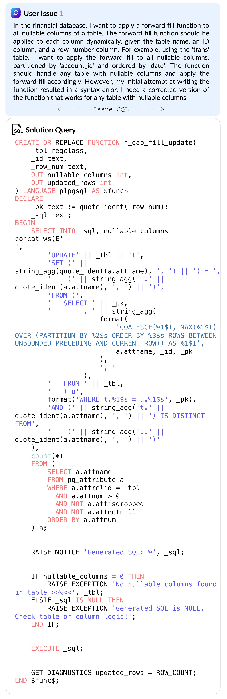
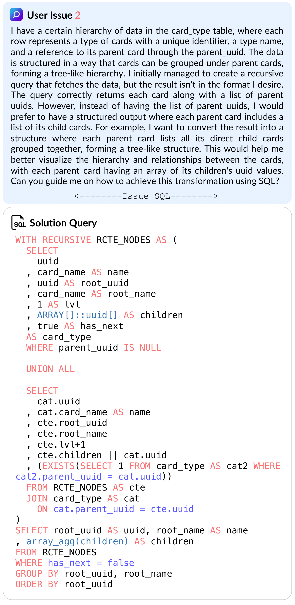
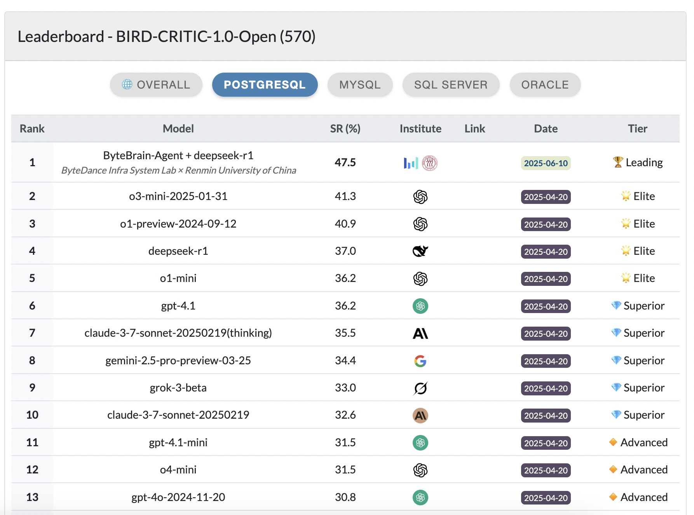

## 如何评测 AI4DB SQL问题诊断与解决产品是否靠谱? | BIRD-CRITIC      
            
### 作者            
digoal            
            
### 日期            
2025-06-18           
            
### 标签            
PostgreSQL , PolarDB , DuckDB , AI , Text-to-SQL , benchmark , AI4DB , 问题诊断 , 问题解决 , BIRD-CRITIC          
            
----            
            
## 背景     
  
做AI4DB的应用, 绕不开2个应用场景:    
- NL2SQL (Text-to-SQL)  
- 解决用户使用数据库过程中遇到的复杂SQL问题    
  
应用做得好不好? 总要有评测标准吧?   
  
前些天介绍了一个开源项目: BIRD-SQL 解决了第一个应用场景的评测标准,  这个项目是一系列数据样本和评测标准, 试图回答这个问题 “Can LLM Already Serve as A Database Interface? A BIg Bench for Large-Scale Database Grounded Text-to-SQLs” (<b>LLM目前是否具备作为数据库服务接口的能力?</b>) .  
- 这篇文章进行了详细介绍: [《如何评测 Text-to-SQL 产品是否靠谱? | BIRD-SQL》](../202506/20250616_03.md)    
  
第二个场景的评测标准呢?  
  
又一个bird开源项目来了, BIRD-CRITIC 项目包含了人类在使用各种流行数据库时遇到的一系列问题, BIRD-CRITIC 试图回答这个问题 “Can large language models (LLMs) fix user issues in real-world database applications?” (<b>LLM是否具备解决人类在真实世界遇到的各种数据库问题的能力?</b>) .    
- https://github.com/bird-bench/BIRD-CRITIC-1  
- https://github.com/bird-bench  
  
BIRD团队与谷歌云合作, 首个 SQL 诊断基准测试 BIRD-CRITIC（又名 SWE-SQL）发布，旨在回答：大型语言模型 (LLM) 能否解决实际数据库应用中的用户问题？ 该基准测试包含 600 个开发任务和 200 个 (OOD) 测试。BIRD-CRITIC 1.0 基于四种主要 SQL 方言（MySQL、PostgreSQL、SQL Server 和 Oracle）中实际的用户问题构建。它超越了简单的 SELECT 查询，涵盖了更广泛的 SQL 操作，反映了实际的应用场景。最后，它包含一个优化的基于执行的评估环境，用于进行严格而高效的验证。  
  
以下测试基准数据都可以在huggingface中下载:   
- [bird-critic-1.0-flash-exp](https://huggingface.co/datasets/birdsql/bird-critic-1.0-flash-exp) ：一个精简版本，包含200 个PostgreSQL 任务。这是一个快速实验的良好起点。  
- [bird-critic-1.0-open](https://huggingface.co/datasets/birdsql/bird-critic-1.0-open) ： BIRD-CRITIC 的完整版本，包含570 个任务，涵盖开源 SQL 方言：PostgreSQL、MySQL、SQL Server 和 Oracle。这允许跨方言评估。  
- [bird-critic-1.0-postgresql](https://huggingface.co/datasets/birdsql/bird-critic-1.0-postgresql) ：完整版本，包含530 个任务，全部使用 PostgreSQL 语言编写。这使得用户能够针对单一方言进行集中分析。  
- bird-critic-1.0-bigquery：包含BigQuery 中 200 个任务的完整版本。  
  
Google对PG也是大爱啊, 入门使用PG, 还包含一个大PG多任务版本.  
   
bird-critic 问题集例子:  
    
   
  
   
   
PostgreSQL 相关榜单如下:   
  
   
  
目前排在排行榜第一位的是: ByteBrain-Agent + deepseek-r1  
  
更多详情请参考官网:  
- https://bird-critic.github.io/  
  
