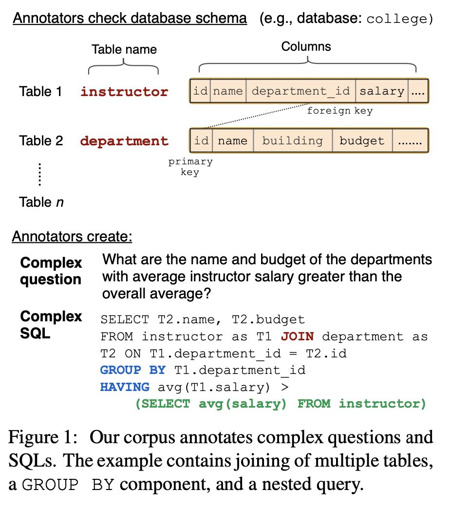
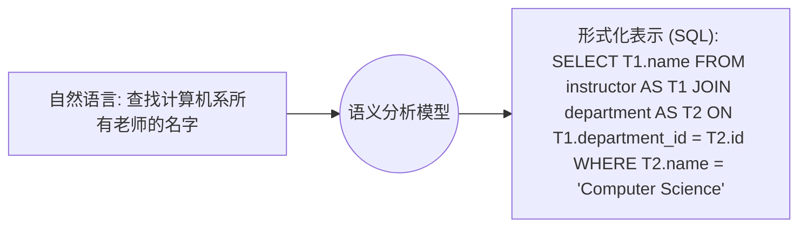
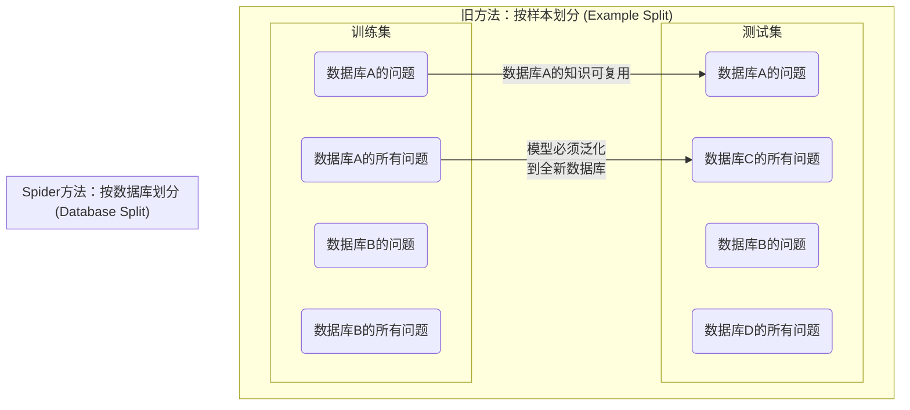
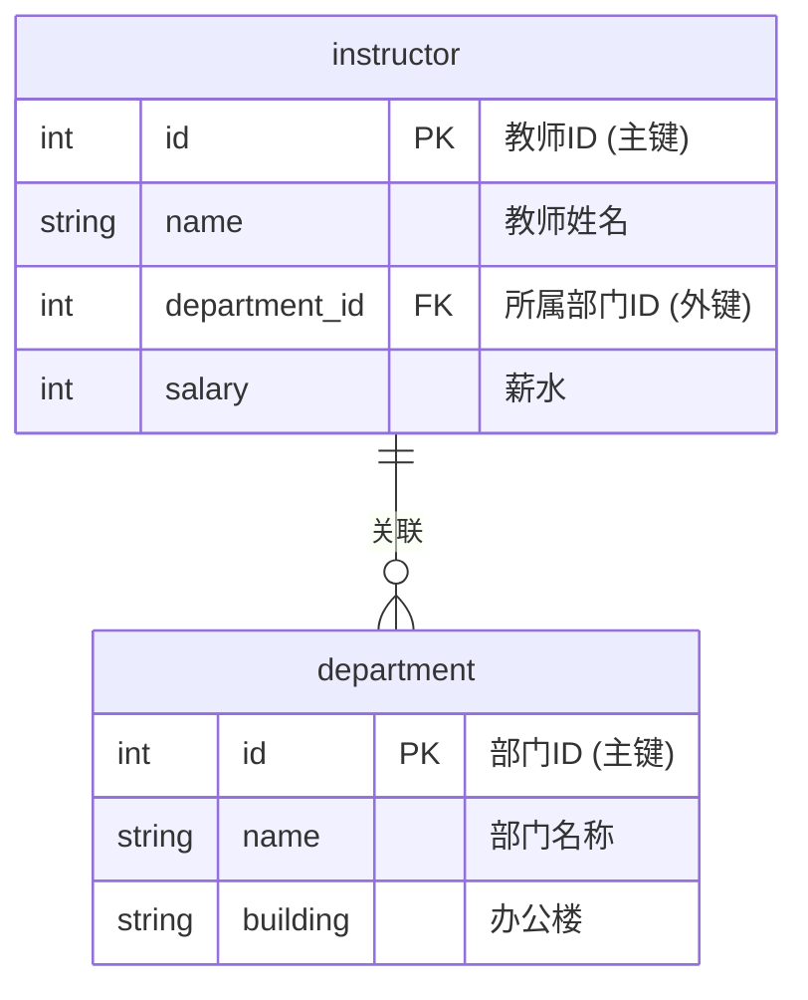
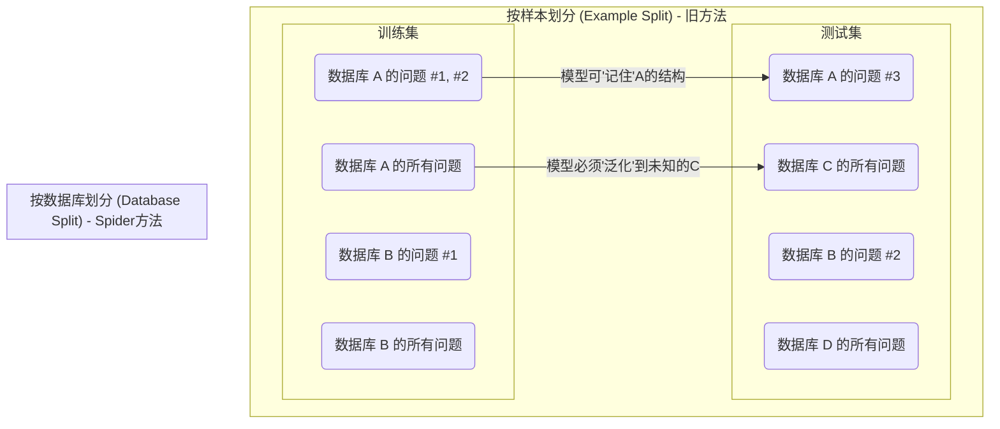

## AI论文解读 | Spider: A Large-Scale Human-Labeled Dataset for Complex and Cross-Domain Semantic Parsing and Text-to-SQL Task
        
### 作者        
digoal        
        
### 日期        
2025-06-19        
        
### 标签        
PostgreSQL , PolarDB , DuckDB , AI , 论文解读        
        
----        
        
## 背景       
      
https://arxiv.org/abs/1809.08887        
  
[《如何评测 Text-to-SQL 产品是否靠谱? | BIRD-SQL》](../202506/20250616_03.md)  
  
[《如何评测 AI4DB SQL问题诊断与解决产品是否靠谱? | BIRD-CRITIC》](../202506/20250618_03.md)  
        
提示:        
```        
读懂《Spider: A Large-Scale Human-Labeled Dataset for Complex and Cross-Domain Semantic Parsing and Text-to-SQL Task》这篇论文需要提前掌握哪些基础知识, 请使用中文给我讲一下这些基础知识, 尽量通熟易懂, 可以使用markdown支持的图形增加解释性.        
        
使用中文通熟易懂的解读《Spider: A Large-Scale Human-Labeled Dataset for Complex and Cross-Domain Semantic Parsing and Text-to-SQL Task》这篇论文, 关键内容请深入讲解, 可以使用markdown支持的图形增加解释性.        
        
使用中文提取《Spider: A Large-Scale Human-Labeled Dataset for Complex and Cross-Domain Semantic Parsing and Text-to-SQL Task》论文中一些重要的术语并详细解释, 可以使用markdown支持的图形示增加解释性.        
```        
        
## 1 前置知识  
  
好的，为了完全理解《Spider》这篇论文，你需要掌握一些来自**数据库、自然语言处理（NLP）和机器学习**领域的基础知识。下面我将用通俗易懂的中文，并搭配一些图示，为你逐一讲解这些核心概念。

---

### 核心脉络

理解这篇论文，我们可以沿着以下路径：

1.  **要解决的问题是什么？** (数据库 + NLP)
2.  **用什么技术来解决？** (机器学习模型)
3.  **如何评价解决得好不好？** (评估方法)

下面我们分模块来看每个部分需要的基础知识。

### 模块一：数据库基础知识 (The "SQL" Part)

这篇论文的目标是把人的话翻译成SQL。所以，首先你得知道SQL和数据库是什么。

#### 1. 关系型数据库 (Relational Database)

你可以把一个数据库想象成一个包含了很多张**相互关联的Excel表格**的文件夹。

* **表 (Table)**: 就是一张表格，用来存储某一类信息，比如“学生表”、“课程表”。
* **列 (Column)**: 表格中的一列，代表一种属性，比如“学生表”里有“学号”、“姓名”、“年龄”等列。
* **行 (Row)**: 表格中的一行，代表一个具体的实体记录，比如某个学生的完整信息。

#### 2. 数据库模式 (Database Schema)

Schema是数据库的**设计蓝图或骨架**，它定义了有哪些表、每张表有哪些列，以及表与表之间是如何连接的。这是理解跨表复杂查询的关键。

* **主键 (Primary Key)**: 表中一个特殊的列，它的值对于每一行都是**唯一**的，就像每个人的身份证号一样。主键用来唯一标识一条记录。
* **外键 (Foreign Key)**: 一张表（例如 `instructor` 表）中的一个列，它的值对应另一张表（例如 `department` 表）的主键。外键是建立两张表**关联的桥梁**。

**图解：主键与外键的关系**
这正是论文中Figure 1所展示的核心。
  
  
  

在上图中，`instructor` 表中的 `department_id` 是一个外键，它指向 `department` 表的 `id`（主键）。通过这个外键，我们就能知道每个老师属于哪个部门。

#### 3. SQL (Structured Query Language)

SQL是一种专门用来和数据库“沟通”的语言。通过它，你可以进行查询、插入、修改、删除数据等操作。论文中提到的复杂查询通常包含以下几种关键操作：

* **`SELECT` ... `FROM` ... `WHERE`**: 最基础的查询。
    * `SELECT name, budget`: "我想看 **名字** 和 **预算** 这两列"。
    * `FROM department`: "...从 **department** 这张表里"。
    * `WHERE budget > 100000`: "...只看那些 **预算大于10万** 的行"。

* **`JOIN`**: **连接查询**。当需要的信息分散在多张表时使用。比如，要查找“计算机系所有老师的名字”，就需要把 `department` 表和 `instructor` 表连接起来。
    * `... FROM instructor JOIN department ON instructor.department_id = department.id`

* **`GROUP BY`**: **分组**。根据某一列或多列的值进行分组，通常和聚合函数（如`COUNT`, `AVG`, `SUM`）一起使用。
    * `GROUP BY department_id`: "按 **部门ID** 进行分组"。
    * `SELECT department_id, AVG(salary)`: 查看每个部门的平均工资。

* **`HAVING`**: **分组后筛选**。`WHERE` 是对原始数据行进行筛选，而 `HAVING` 是对 `GROUP BY` 之后的分组结果进行筛选。
    * `HAVING avg(salary) > 80000`: "只保留那些 **平均工资大于8万** 的分组"。

* **嵌套查询 (Nested Query)**: 一个查询语句中包含了另一个查询语句。这通常用来解决更复杂的问题。
    * 例如论文中的问题：“查找平均工资高于**全校总平均工资**的系”。你需要先通过一个子查询算出“全校总平均工资”，再用主查询找出符合条件的系。

---

### 模块二：自然语言处理 (NLP) 核心概念 (The "Text" Part)

#### 1. 语义分析 (Semantic Parsing)

这是NLP领域的一个核心任务。它的目标是将人类的自然语言（比如一句话）转换成一种机器可以理解和执行的、具有明确含义的**形式化表示**（比如SQL查询、逻辑表达式或代码）。

**图解：语义分析过程**

**Text-to-SQL** 就是语义分析的一个具体应用场景，它的目标输出是SQL。

#### 2. 泛化能力 (Generalization)

这是机器学习中的一个核心概念，也是这篇论文反复强调的重点。它指的是一个模型在**从未见过的新数据**上的表现能力。
* **泛化能力差**: 模型只是“背诵”了训练数据里的模式，遇到新的数据库或新的问法就无法应对。
* **泛化能力强**: 模型真正“理解”了语言和数据库结构之间的映射关系，能够举一反三，在新的场景下也能工作。

#### 3. 跨领域 (Cross-Domain)

这是泛化能力在特定场景下的体现。一个模型如果在关于“餐厅”的数据库上训练，还能在关于“航班”或“大学”的数据库上成功生成SQL查询，就说明它具备**跨领域**的能力。Spider数据集包含138个不同领域，就是为了专门评测这种能力。

---

### 模块三：关键的机器学习模型 (The "to" Part)

论文中提到了一些当时（2018年）流行的深度学习模型，了解它们的基本思想有助于理解论文的实验部分。

#### 1. Seq2Seq (序列到序列模型)

这是一个非常经典的模型框架，常用于机器翻译、对话生成等任务。它由两部分组成：

* **编码器 (Encoder)**: 负责读取输入的序列（比如一句自然语言问句），并将其压缩成一个包含所有信息、固定长度的数学向量（称为“上下文向量”或“思想向量”）。
* **解码器 (Decoder)**: 负责接收这个上下文向量，并一个词一个词地生成输出序列（比如SQL查询语句）。

你可以把它想象成一个人类翻译官：先完整听完一句话（编码），在脑子里形成理解（上下文向量），然后再把理解的内容一句句翻译出来（解码）。

#### 2. 注意力机制 (Attention Mechanism)

这是对基础Seq2Seq模型的一个重要改进。基础模型的解码器只能看到最后那个“思想向量”，信息量有限。注意力机制允许解码器在生成输出的**每一步**，都能**回头去看输入序列的不同部分**，并给予不同的“关注度”。

例如，在生成SQL的 `WHERE` 子句时，模型会特别“注意”问句中描述条件的词，比如“预算大于10万”。这使得模型能更好地处理长句子和复杂的对应关系。

#### 3. 基于草图/填槽的方法 (Sketch-based / Slot-filling)

这是一种与Seq2Seq直接生成文本不同的思路。它不把SQL看作一个纯粹的单词序列，而是看作一个有固定结构的“**草图**”（Sketch）。

例如，一个SQL查询的草图可能是：
`SELECT <聚合器> <列> FROM <表> WHERE <列> <操作符> <值>`

模型的任务不是从头生成 `SELECT` 这个词，而是为 `<聚合器>`、`<列>`、`<操作符>` 这些“**槽位**” (Slot) 挑选正确的内容填进去。SQLNet和TypeSQL模型就采用了这种思想，它能更好地保证生成SQL的语法正确性。

---

### 总结

要读懂《Spider》这篇论文，你需要具备的知识拼图如下：

1.  **数据库**：理解表、列、主键、外键如何构成一个数据库模式，并掌握SQL中 `JOIN`, `GROUP BY`, `HAVING`, 嵌套查询等复杂操作的含义。
2.  **NLP**：知道什么是语义分析，以及为什么模型的“泛化能力”和“跨领域”能力至关重要。
3.  **机器学习**：对Seq2Seq、注意力机制等主流的序列生成模型有一个概念性的理解，知道它们是如何将一个序列（文本）转换为另一个序列（SQL）的。

掌握了这些基础，你就能清晰地理解这篇论文的**动机**（之前的研究泛化能力不足）、**贡献**（提出了更复杂、更注重泛化的Spider数据集和任务）以及**实验结论**（当时的先进模型在Spider任务上表现不佳，说明这个领域还有很大的提升空间）。
  
## 2 解读论文 
  
好的，这篇名为《Spider: 一个大规模、复杂、跨领域的人工标注语义分析与文本到SQL数据集》的论文是Text-to-SQL（文本到SQL转换）领域一个里程碑式的工作。下面我将用通俗的语言，结合图示，为您深入解读这篇论文的核心内容。

### **核心思想：我们真的“解决”问题了吗？**

 在Spider诞生之前，许多研究（例如在ATIS和GeoQuery数据集上）已经能在Text-to-SQL任务上取得超过80%的准确率  。这让人们感觉，AI已经快要掌握将人类语言转换成SQL这项技能了。

 然而，这篇论文的作者们提出了一个尖锐的问题：这些高分是真的代表AI“理解”了语言和数据库，还是仅仅通过“**记忆和匹配**”来“作弊”？ 

他们发现，以往的研究存在两大问题，导致了分数的虚高：
1.   **数据集过于简单或单一**：一些数据集虽然有复杂的SQL查询，但它们都只针对**一个数据库**  。这意味着模型在训练和测试时面对的是同一个数据库结构。
2.   **评估方式有漏洞**：为了扩充数据量，研究者们常常对一个SQL查询，写出好几个不同问法（即“复述”）  。在划分数据集时，同一个SQL查询（以及它对应的各种问法）会同时出现在训练集和测试集中   。这使得模型可以通过 **背诵“问题模式-SQL模板”** 的方式取得高分，而无需真正理解数据库的结构  。

 为了解决这些问题，推动领域真正发展，作者们创建了一个全新的、更具挑战性的数据集——**Spider**，并提出了一种更严格的评估范式  。

---

### **Spider是什么？一个更难的“考场”**

 Spider是一个大规模、高质量的人工标注数据集，旨在真实地评估模型的语义分析和泛化能力  。

#### **Spider的“三大光环”**

1.  **大规模与跨领域 (Large-Scale & Cross-Domain)**
    *  它包含 **200个** 独立的数据库，这些数据库覆盖了 **138个** 不同的领域，如大学、俱乐部、电视节目、政府等  。
    *  共有 **10,181个** 问题和 **5,693个** 独特的复杂SQL查询  。
    *  与之前只有一个数据库的数据集不同，Spider要求模型必须具备**跨领域**的能力，即在训练时学习到的知识，需要能应用到测试时从未见过的全新领域的数据库上  。

2.  **查询复杂度高 (High Complexity)**
    *  与当时最大的Text-to-SQL数据集WikiSQL（只包含简单的单表查询）不同  ，Spider中的SQL查询要复杂得多。
    *  它包含了大量的**多表连接（JOIN）**、**分组（GROUP BY）**、**分组后筛选（HAVING）**、**排序（ORDER BY）**以及**嵌套查询**等复杂SQL组件  。

    **图解：一个典型的Spider复杂查询案例**
    这个问题需要连接两个表，并进行分组、聚合和嵌套查询才能解答。
    ```mermaid
    graph TD
        subgraph "自然语言问题"
             Q("部门的名称和预算是多少，条件是该部门的教师平均工资要高于所有教师的总体平均工资？"  )
        end
        subgraph "数据库模式"
            T1[<b>instructor 表</b><br>id, name, department_id, salary]
            T2[<b>department 表</b><br>id, name, building, budget]
            T1 -- "外键 department_id" --> T2
        end
        subgraph "生成的复杂SQL"
            SQL("
            <b>SELECT</b> T2.name, T2.budget<br>
            <b>FROM</b> instructor <b>as</b> T1 <b>JOIN</b> department <b>as</b> T2 <b>ON</b> T1.department_id = T2.id<br>
            <b>GROUP BY</b> T1.department_id<br>
            <b>HAVING avg</b>(T1.salary) > (<br>
            &nbsp;&nbsp;<b>SELECT avg</b>(salary) <b>FROM</b> instructor<br>
            )
             "  )
        end
        Q --> SQL
    ```

3.  **高质量的人工构建**
    *  整个数据集由11名大学生耗时约1000个工时精心构建和审核  。
    *  构建过程分为数据库收集、问题与SQL标注、多轮审核与复核等五个步骤，确保了问题和SQL的质量、多样性与一致性  。

---

### **核心贡献：重新定义“游戏规则”**

 Spider最大的贡献不仅是数据集本身，更是它定义的**一项全新的、更现实的任务**  。

 这项新任务的核心在于它的**数据集划分和评估方式**，即“**按数据库划分 (Database Split)**”  。

*  **旧的划分方式 (Example Split)**：将所有“问题-SQL”对随机打乱，然后划分训练集、开发集和测试集   。这会导致同一个数据库的问题出现在不同的数据集中。模型可以“记住”这个数据库的结构  。
*  **Spider的划分方式 (Database Split)**：将**数据库本身**进行划分   。例如，146个数据库用于训练，20个用于开发，40个用于测试   。这意味着，模型在测试时遇到的数据库，是它在训练阶段**完全没有见过的**  。

**图解：“按样本” vs “按数据库”划分**

 这种划分方式杜绝了模型靠“背诵”特定数据库结构来取得高分的可能性，迫使模型必须学习到从自然语言到SQL的**通用映射能力**，即**泛化能力**  。

---

### **实验与发现：给社区泼了一盆“冷水”**

 作者们在Spider数据集上测试了当时几个最先进的模型，包括Seq2Seq、SQLNet和TypeSQL  。

#### **主要发现：**

1.   **现有模型表现极差**：在最能体现泛化能力的“按数据库划分”设置下，即便是表现最好的模型，其**精确匹配准确率也只有12.4%**   。这表明现有模型在处理复杂、跨领域的Text-to-SQL问题时，能力还远远不够  。

2.   **泛化是主要瓶颈**：所有模型在“按数据库划分”上的表现都远低于“按样本划分”   。特别是TypeSQL，它在“按样本划分”中表现优异，但在“按数据库划分”中性能下降最严重   。这说明模型虽然能处理复杂查询，但**很难泛化到新的数据库结构上**  。

3.   **WHERE子句是最难的部分**：从组件匹配的F1分数来看，所有模型在预测`WHERE`子句时表现最差   。因为`WHERE`子句往往包含多个条件和操作，预测难度最大  。

4.   **数据库越复杂，模型表现越差**：实验还发现，随着数据库中**外键数量**的增加（即表间关系更复杂），模型的准确率会显著下降   。这说明模型难以有效捕捉复杂数据库中表与表之间的关系  。

### **结论与影响**

《Spider》这篇论文通过构建一个极具挑战性的新数据集和评估任务，有力地证明了之前的Text-to-SQL研究在一定程度上高估了模型的真实能力。它揭示了现有模型在**泛化能力**上的巨大短板，尤其是在面对复杂查询和未知数据库结构时。

 这项工作直接推动了后续研究的方向，促使研究者们开发更能理解数据库模式、更具泛化能力的模型架构。Spider也因此成为了Text-to-SQL领域最重要和最广泛使用的基准之一，为整个NLP和数据库社区做出了巨大贡献  。
  
## 3 术语  
  
好的，以下是根据《Spider》这篇论文提取的一些重要术语及其详细解释。

---

### 1. 语义分析 (Semantic Parsing)

 语义分析是自然语言处理（NLP）中的一个核心任务   。它的目标是同时理解自然语言句子的含义，并将其映射为机器可执行的精确指令   。这些指令可以是逻辑形式、Python代码，或者在这篇论文的场景中，是SQL查询  。

### 2. Text-to-SQL

 这是语义分析的一个具体分支，特指将自然语言文本（通常是一个问题）转换为结构化查询语言（SQL）的任务   。Spider数据集和其定义的任务就是一个复杂且跨领域的Text-to-SQL任务  。

### 3. 跨领域 (Cross-Domain)

 这是Spider数据集的核心特性之一。它指的是模型处理来自不同主题领域数据的能力  。
*  Spider包含了覆盖138个不同领域的200个数据库  。
*  任务设定要求模型必须具备泛化到新领域的能力，因为测试集中的数据库和对应的领域在训练集中从未出现过  。
*  这与以往许多数据集只针对单一领域（如航班、地理）形成了鲜明对比  。

### 4. 数据库模式 (Database Schema)

 数据库模式是数据库的结构蓝图，它定义了数据库中有哪些表、每张表有哪些列，以及表与表之间如何通过**主键 (Primary key)** 和**外键 (Foreign key)** 进行关联   。在Text-to-SQL任务中，模型必须理解输入的数据库模式，才能生成正确的查询  。

**图解：论文中引用的数据库模式示例**
该图清晰地展示了 `instructor` 表如何通过外键 `department_id` 与 `department` 表建立联系。

 论文指出，数据库模式的复杂度（例如外键的数量）会直接影响模型的性能  。

### 5. 复杂SQL查询 (Complex SQL Queries)

 这是Spider数据集区别于其他大规模数据集（如WikiSQL）的关键特征   。复杂查询指的是那些包含高级SQL组件的查询，而不仅仅是简单的单表查询  。Spider中的复杂查询广泛覆盖了以下组件：
*  多表连接 (`JOIN`)  
*  分组 (`GROUP BY`) 与分组后筛选 (`HAVING`)  
*  排序 (`ORDER BY`) 与限制数量 (`LIMIT`)  
*  集合操作 (`INTERSECT`, `EXCEPT`, `UNION`)  
*  嵌套查询 (Nested Queries)，即查询中包含子查询  。

### 6. 数据集划分 (Dataset Splitting)

这是论文中用以评估模型**泛化能力**的核心方法，作者对比了两种不同的划分方式。

* **按样本划分 (Example Split)**:
    *  将所有“问题-SQL”对随机打乱，然后划分训练集和测试集  。
    *  在这种模式下，同一个数据库的A问题可能在训练集，B问题可能在测试集  。
    *  **缺点**：模型可以“记住”在训练中见过的数据库模式，从而在测试中取得虚高的分数，这不能真实反映其泛化能力  。

* **按数据库划分 (Database Split)**:
    *  **Spider提倡的方法**。将**数据库本身**进行划分，例如146个数据库归为训练集，40个数据库归为测试集  。
    *  一个数据库的所有问题都严格属于同一个集合（训练或测试）  。
    *  **优点**：测试集中的数据库对于模型来说是**完全未知**的。这迫使模型必须学习通用的映射规则，而非记忆特定的数据库结构，从而能真实地衡量其泛化到新数据库和新领域的能力  。

**图解：两种划分方式的根本区别**


### 7. 评估指标 (Evaluation Metrics)

 为了更精确地评估模型性能，论文提出了不考虑具体数值（value）的评估指标  。

* **组件匹配 (Component Matching)**:
    *  将一个SQL查询分解为`SELECT`、`WHERE`、`GROUP BY`、`ORDER BY`等多个组件  。
    *  对每个组件，将其中的子部分（如多个列名、多个条件）视为一个**集合**进行比较，从而解决了SQL中某些部分顺序不影响结果的问题（例如 `SELECT col_A, col_B` 和 `SELECT col_B, col_A` 应被视为相同）  。
    *  最终对每个组件计算F1分数  。

* **精确匹配 (Exact Matching)**:
    *  衡量预测的整个SQL查询是否与标准答案等价  。
    *  一个查询被判为正确，当且仅当它所有的组件都通过了“组件匹配”的检测   。这是论文中报告模型总体性能的主要指标  。

### 8. SQL难度等级 (SQL Hardness Criteria)

 为了深入分析模型在不同难度问题上的表现，论文将SQL查询划分为了4个等级：**简单 (Easy)**、**中等 (Medium)**、**困难 (Hard)** 和 **非常困难 (Extra Hard)**  。
*  **划分依据**：查询中包含的SQL组件数量、选择的列和聚合器的数量、条件的数量等  。
*  **示例**：一个包含超过两个`SELECT`列、两个`WHERE`条件，并且有`GROUP BY`或嵌套查询的SQL，通常被认为是“困难”级别  。
*  **作用**：通过这个标准可以清晰地看到，所有模型在处理更难的SQL查询时，性能都急剧下降  。
  
## 参考        
         
https://arxiv.org/abs/1809.08887  
        
        
<b> 以上内容基于DeepSeek、Qwen、Gemini及诸多AI生成, 轻微人工调整, 感谢杭州深度求索人工智能、阿里云、Google等公司. </b>        
        
<b> AI 生成的内容请自行辨别正确性, 当然也多了些许踩坑的乐趣, 毕竟冒险是每个男人的天性.  </b>        
  
  
#### [期望 PostgreSQL|开源PolarDB 增加什么功能?](https://github.com/digoal/blog/issues/76 "269ac3d1c492e938c0191101c7238216")
  
  
#### [PolarDB 开源数据库](https://openpolardb.com/home "57258f76c37864c6e6d23383d05714ea")
  
  
#### [PolarDB 学习图谱](https://www.aliyun.com/database/openpolardb/activity "8642f60e04ed0c814bf9cb9677976bd4")
  
  
#### [PostgreSQL 解决方案集合](../201706/20170601_02.md "40cff096e9ed7122c512b35d8561d9c8")
  
  
#### [德哥 / digoal's Github - 公益是一辈子的事.](https://github.com/digoal/blog/blob/master/README.md "22709685feb7cab07d30f30387f0a9ae")
  
  
#### [About 德哥](https://github.com/digoal/blog/blob/master/me/readme.md "a37735981e7704886ffd590565582dd0")
  
  

  
