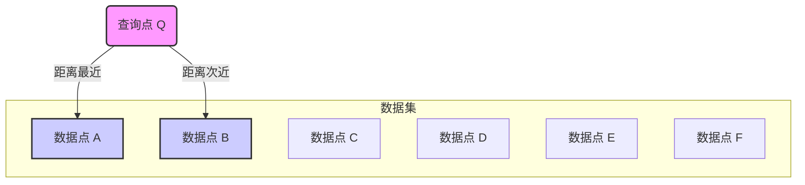
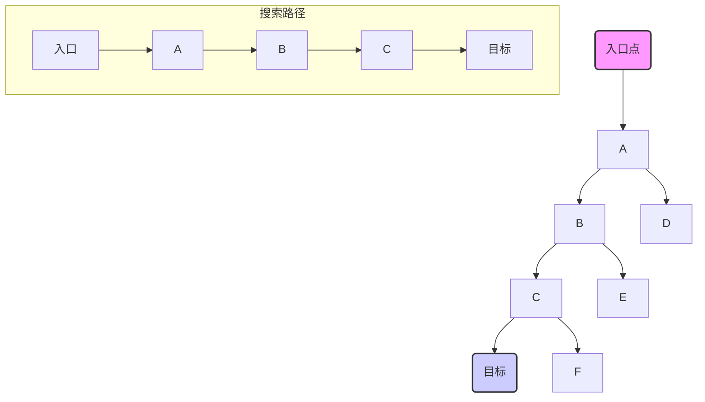
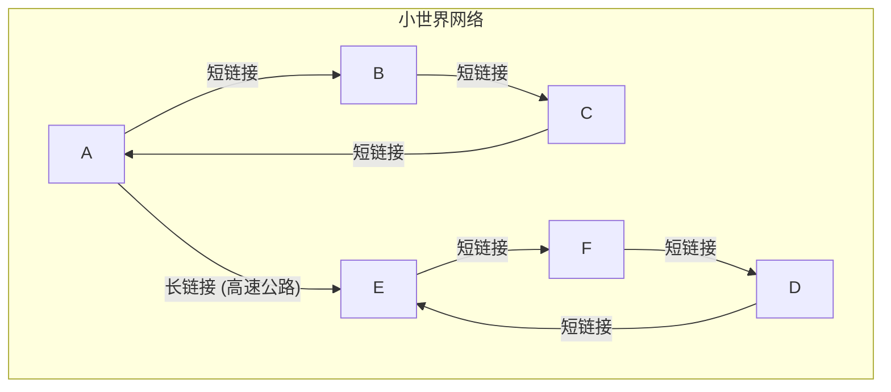
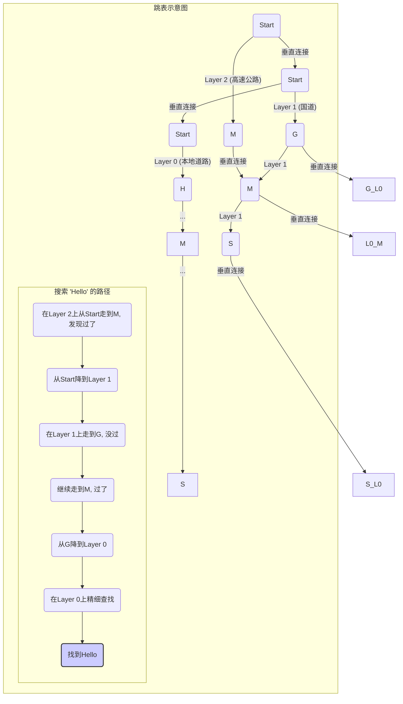
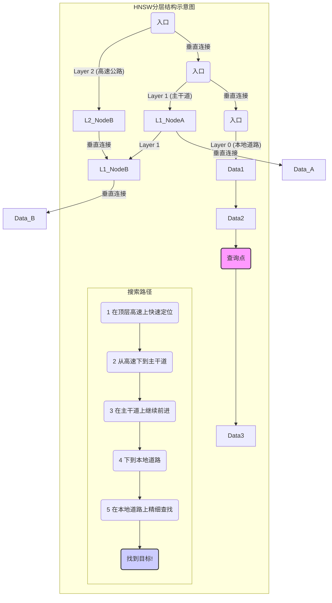
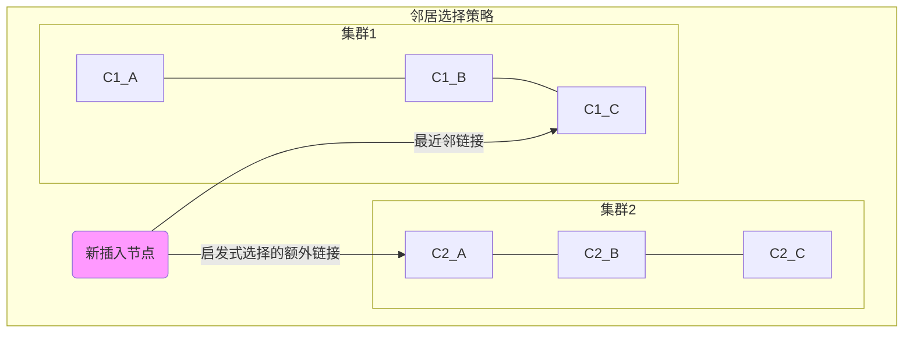

## AI论文解读 | Efficient and robust approximate nearest neighbor search using Hierarchical Navigable Small World graphs
        
### 作者        
digoal        
        
### 日期        
2025-06-19        
        
### 标签        
PostgreSQL , PolarDB , DuckDB , AI , 论文解读        
        
----        
        
## 背景       
      
https://arxiv.org/pdf/1603.09320        
  
- [《pgvector hnsw高频更新场景的坑》](../202505/20250507_01.md)  
- [《数据库筑基课 - 向量类型》](../202501/20250103_01.md)  
- [《PostgreSQL 阿里云rds pg发布高维向量索引，支持图像识别、人脸识别 - pase 插件, 以及ivfflat,hnsw搜索算法说明》](../201912/20191219_02.md)  
- [《向量搜索优化3板斧: 空间、性能、召回(recall)》](../202405/20240506_03.md)  
- [《头大! 索引扫描和全表扫描结果不一样, 这向量数据库还能用? 教你一招大幅提升召回率(recall)》](../202404/20240417_01.md)  
  
        
提示:        
```        
读懂《Efficient and robust approximate nearest neighbor search using Hierarchical Navigable Small World graphs》这篇论文需要提前掌握哪些基础知识, 请使用中文给我讲一下这些基础知识, 尽量通熟易懂, 可以使用markdown支持的图形增加解释性.        
        
使用中文通熟易懂的解读《Efficient and robust approximate nearest neighbor search using Hierarchical Navigable Small World graphs》这篇论文, 关键内容请深入讲解, 可以使用markdown支持的图形增加解释性.        
        
使用中文提取《Efficient and robust approximate nearest neighbor search using Hierarchical Navigable Small World graphs》论文中一些重要的术语并详细解释, 可以使用markdown支持的图形示增加解释性.        
```        
        
## 1 前置知识  
  
好的，为了完全理解《Efficient and robust approximate nearest neighbor search using Hierarchical Navigable Small World graphs》这篇论文，你需要掌握一些前置的基础知识。我会用尽量通俗易懂的方式，结合图示为你讲解。

这些知识点可以看作是理解HNSW算法的“技能树”，从最基础的概念到更高级的理论，层层递进。

---

### 知识树概览

为了读懂HNSW论文，你需要了解以下几个核心领域：

1.  **根本问题：K近邻搜索 (KNN)**
    * 为什么需要它？
    * 它有什么挑战？（维度灾难）
    * 我们如何妥协？（近似最近邻 ANN）
2.  **核心数据结构：图 (Graph)**
    * 什么是邻近图？
    * 如何在图中搜索？（贪心算法）
3.  **关键理论：小世界网络 (Small World Network)**
    * 什么是“小世界”？
    * 它如何实现高效导航？（长短链接）
4.  **点睛之笔：层级结构 (Hierarchy)**
    * 如何通过分层加速搜索？（跳表 Skip List）

下面我们来逐一“解锁”这些技能点。

---

### 1. 根本问题：K近邻搜索 (K-Nearest Neighbor, KNN)

#### 1.1 什么是KNN搜索？

想象一下，你的手机里有一个音乐库，你正在听一首歌，想找和它风格最像的5首歌。这个过程就是一次“K近邻搜索”。

* **K**：是你想要找的近邻的数量，这里是5。
* **近邻 (Nearest Neighbor)**：指在某种“距离”或“相似度”标准下，与你的查询目标最接近的数据点。对于歌曲，这个“距离”可能是基于曲风、节奏、使用的乐器等多种特征计算出来的。

**一句话总结：** 在一个数据集中，找到距离“查询点”最近的 K 个数据点。


*上图中，如果 K=2，那么查询点 Q 的K近邻就是 A 和 B。*

#### 1.2 挑战：维度灾难 (Curse of Dimensionality)

暴力搜索（计算查询点和数据集中每个点的距离，然后排序）在数据量小、特征少（维度低）时是可行的。但当数据变得复杂时，问题就来了。

* **维度 (Dimension)**：就是描述一个数据点的特征数量。比如，描述一个人，可以用身高、体重（2个维度）；描述一首歌，特征可能有上百个（上百个维度）；描述一张图片，每个像素点都可以是一个维度，可能有数万个维度。

**维度灾难** 是指，随着维度的增加，数据点会变得异常稀疏，我们直觉中的“远近”概念会失效。

* **通俗理解**：
    * 在一维（一条线），你的邻居只有左右两个。
    * 在二维（一个平面），你的邻居有上下左右等8个。
    * 在三维（一个空间），你的邻居就更多了。
    * 在几万维的空间里，几乎所有的点都离你“很远”，而且距离差异不大，很难说谁“更近”。这使得搜索效率极低。

#### 1.3 解决方案：近似最近邻 (Approximate Nearest Neighbor, ANN)

既然找到“绝对”最近的邻居这么难，我们可以退而求其次：**找到“足够近”的邻居就行了**。这就是ANN的核心思想。

它不保证100%正确，但速度快了成千上万倍。我们用一个指标来衡量它的好坏：

* **召回率 (Recall)**： `Recall = (找到的真正近邻数) / K`。例如，要找10个最近邻，ANN算法找到了8个，另外2个不是最准的，那么召回率就是 8/10 = 80%。在实际应用中，95%以上的召回率通常就足够好了。

HNSW就是一种非常高效、准确的ANN算法。

---

### 2. 核心数据结构：图 (Graph)

 HNSW是完全基于图的算法  。

#### 2.1 什么是邻近图 (Proximity Graph)？

想象一个社交网络：
* 每个数据点是一个“人”（节点 Node）。
* 如果两个“人”关系很“近”（距离小于某个阈值），我们就在他们之间连一条线（边 Edge）。

这样构成的网络就是一个**邻近图**。

#### 2.2 如何在图中搜索？

 最直观的方法是**贪心搜索 (Greedy Search)**  。

1.  **起点**：从一个随机的或指定的入口点开始。
2.  **决策**：查看当前节点所有邻居，计算它们到“查询目标”的距离。
3.  **移动**：移动到距离“查询目标”最近的那个邻居。
4.  **重复**：不断重复第2、3步，直到找不到比当前位置更近的邻居为止，这时就认为找到了一个局部最优解。


*上图演示了从入口点出发，每一步都选择更接近目标的邻居，最终找到目标的贪心搜索路径。*

---

### 3. 关键理论：小世界网络 (Small World Network)

贪心搜索在普通图上容易陷入“死胡同”（局部最优）。而“小世界网络”可以很好地解决这个问题。

#### 3.1 什么是小世界网络？

这个概念源于著名的“六度分隔理论”：世界上任意两个人之间，平均只需要通过六个人就能建立联系。

小世界网络的特点是：
1.  **高聚集性**：像常规网络一样，你的朋友们之间很可能也互相认识（形成小圈子）。这对应图中的**短链接 (Short-range links)**。
2.  **短路径**：任意两个节点之间都存在很短的路径。这得益于一些随机连接的**长链接 (Long-range links)**，它们像“高速公路”，能让你快速从一个圈子跳到另一个圈子。



#### 3.2 可导航性 (Navigability)

 NSW (Navigable Small World) 是HNSW的前身。它构建了一个小世界网络，使得贪心搜索非常有效。搜索过程分为两个阶段  ：

1.  **Zoom-out 阶段**：距离目标很远时，主要利用**长链接**（高速公路）快速跨越很长的距离，接近目标区域。
2.  **Zoom-in 阶段**：当离目标很近后，主要利用**短链接**（本地道路）在小范围内进行精细查找。

 **问题**：在基础的NSW中，长短链接混在一起。在搜索的每一步，都需要检查一个节点的所有邻居，这其中可能有很多密集的短链接，导致计算量大，搜索效率的扩展性只是“准对数级” (polylogarithmic)  。

---

### 4. 点睛之笔：层级结构 (Hierarchy)

 这是 HNSW (Hierarchical NSW) 中 “H” 的来源，也是它相比 NSW 最大的创新点，实现了真正的对数级复杂度  。

 这个思想可以用我们熟悉的**跳表 (Skip List)** 来类比  。

#### 4.1 跳表示意图

想象一下，你要在一本很长的字典里查找一个单词：

* **普通链表 (Layer 0)**：你只能一页一页地翻，非常慢。
* **跳表 (多层结构)**：
    * **Layer 2 (最高层)**：这一层只有少数几个索引词（比如 A, G, M, S, Z），像字典的目录。你先在这里找到目标所在的区间（比如，要找"Hello"，在G和M之间）。
    * **Layer 1 (中间层)**：在 G 和 M 之间，有更详细的索引（比如 Ga, Ge, Gl, Gr）。你在这里继续定位。
    * **Layer 0 (最底层)**：在定位到非常小的范围后，你再逐页查找，很快就能找到。



#### 4.2 HNSW 的层级结构
  
  
  
HNSW 把跳表的思想应用到了图上：

*  它构建了一个**多层的图结构**  。
* **顶层图 (Top Layer)**：节点最稀疏，但连接的都是**长链接**（高速公路）。
* **底层图 (Bottom Layer)**：包含所有数据点，连接的主要是**短链接**（本地道路）。
* **搜索过程**：
    1.  从**顶层图**的入口点开始进行贪心搜索。
    2.  当在当前层找到局部最优解后，将这个节点作为入口，**进入下一层**继续搜索。
    3.  重复此过程，直到到达最底层的第0层，在第0层进行最精细的搜索，最终找到结果。

 通过这种方式，HNSW 将长短链接在不同层级上分离开来  ，在搜索的早期阶段只用考虑稀疏的长链接，大大减少了每一步的计算量，从而实现了高效的对数级搜索性能。

---

### 总结

当你理解了以上四个知识点后，再读 HNSW 的论文原文，就会发现很多概念都豁然开朗了：

* 看到 **K-ANNS**，你就知道这是在解决什么问题，以及为什么“近似”是可以接受的。
* 看到 **Proximity Graph** 和 **Greedy Search**，你就明白它底层的运作方式。
* 看到 **Navigable Small World**，你就理解了它利用长短链接保证“可达性”和“快速导航”的理论基础。
* 看到 **Hierarchical**，你就掌握了它实现对数级复杂度的核心创新——像“跳表”一样的分层搜索策略。

 有了这些基础，你就可以更轻松地去理解论文中更细节的算法描述（如邻居选择启发式策略   、参数 M 和 `efConstruction` 的作用   等）了。祝你阅读顺利！
  
## 2 解读论文 
  
好的，这是一份对HNSW开创性论文《Efficient and robust approximate nearest neighbor search using Hierarchical Navigable Small World graphs》的通俗易懂且深入的解读。

---

### 论文概览：HNSW的目标与贡献

 在高维数据（如图片特征、词向量）中进行高效的相似性搜索，是一个非常重要且困难的问题  。想象一下“以图搜图”，计算机需要在亿万张图片中，快速找到与给定图片最相似的那几张。

*  **传统方法的困境**：最精确的方法是计算查询图片与数据库中每一张图片的相似度，但这在数据量巨大时会慢得无法接受   。这种“维度灾难”效应使得精确搜索在现实应用中几乎不可行  。
*  **近似方法的兴起**：为了追求速度，研究者们提出了“近似最近邻”（K-ANNS）搜索，它不追求100%的精确，而是力求在极短时间内返回足够好的结果（例如99%的准确率） 。
*  **HNSW的贡献**：这篇论文提出了一种名为**HNSW (Hierarchical Navigable Small World)** 的全新K-ANNS算法。它完全基于图结构，无需任何辅助索引   ，通过引入巧妙的“层级结构”，极大地提升了搜索速度和鲁棒性，在多种数据集上都取得了当时最先进的（State-of-the-Art）性能  。

---

### 核心思想一：从“平面导航”到“立体交通”

要理解HNSW的精髓，我们首先要明白它所改进的基础——**NSW (Navigable Small World)** 是如何工作的。

#### 1. NSW：在“小世界”里平面导航

 NSW将所有数据点构建成一个“小世界”网络图。这个网络图的特点是：既有连接邻近点的“**短链接**”，也有连接遥远点的“**长链接**”（像高速公路） 。

搜索过程就像在一个巨大的城市地图上找路：
1.  从一个入口点出发。
2.  查看当前位置所有邻接的道路，选择通往离目标最近的那个路口。
3.   不断重复这个“贪心”过程，直到无路可走（当前位置比所有邻居都更接近目标） 。

 **NSW的局限**：这种“平面导航”存在一个问题。当搜索路径经过一个“交通枢纽”（即连接了大量道路的节点）时，你需要检查每一条与之相连的道路，这很耗时   。随着城市（数据集）越来越大，这些枢纽会变得越来越拥堵，导致搜索速度变慢。其理论上的搜索复杂度是“准对数级”（polylogarithmic），而非理想的“对数级”  。

#### 2. HNSW：构建“立体交通网络”

 HNSW的“神来之笔”在于它没有将所有道路都画在一张平面图上，而是构建了一个**分层的立体交通网络**  。

*  **灵感来源**：这个思想非常类似于数据结构中的“**跳表 (Skip List)**”  。

我们可以用一个生动的比喻来理解：

* **第0层 (Layer 0)**：城市的**本地道路**。包含了所有地点（数据点），道路网络最密集，连接着每个地点的直接邻居。
* **第1层 (Layer 1)**：城市的**主干道**。只连接一部分重要的地点，路网比第0层稀疏。
* **第2层 (Layer 2)**：城市的**高速公路**。只连接极少数的交通枢纽，路网最稀疏，但能让你在城市的不同区域间快速穿梭。



**HNSW的搜索过程**：
1.   **从顶层开始**：搜索从最顶层（高速公路）的某个入口点开始  。
2.   **逐层下降**：在当前层进行贪心搜索，直到找到一个局部最优点（无法更近了）  。然后，将这个最优点作为下一层的入口，进入下一层继续搜索  。
3.   **底层精确定位**：这个过程一直持续到最底层的第0层。在第0层进行最后的精细搜索，返回最终结果  。

 **为什么更快？** 因为在顶层搜索时，每个节点只连接了极少数的“长链接”，计算开销很小且固定   。这使得HNSW的搜索复杂度达到了理想的**对数级 O(log(N))**，从根本上解决了NSW的性能瓶颈  。

---

### 核心思想二：更聪明的邻居选择策略

仅仅有分层结构还不够，HNSW在“如何建路”上也做出了重要改进。

*  **问题**：如果数据是聚类的（比如城市里的住宅区和商业区），简单地连接最近的邻居，可能会导致路网只在区域内部很发达，而缺少连接不同区域的“桥梁”  。
*  **HNSW的启发式策略**：在为一个新节点选择邻居时，HNSW不只看“绝对距离”，更看重“多样性”和“相对位置”   。它会优先选择那些能连接到“新大陆”的节点，即使它们的绝对距离不是最近的。这种策略确保了图的全局连通性，即使在高度聚类的数据上也能保持出色的性能  。

 如下图所示，当插入一个新节点时，如果只选最近的，它只会连接到“集群1”内部。而HNSW的启发式策略会额外选择一个指向“集群2”的链接，保持了两个集群间的连通性  。



---

### 算法流程与关键参数

#### 插入新节点 (INSERT, Algorithm 1)
1.   **随机定层**：为新节点`q`随机选择一个最大层级`l`，这个概率是指数衰减的，即大部分节点只存在于底层  。
2.   **逐层搜索入口**：从顶层开始，逐层向下搜索，为下一层找到最佳的入口点  。
3.   **寻找并连接邻居**：在`l`层及以下的每一层，为`q`找到一组最近的邻居候选，并使用启发式策略从中选出`M`个进行双向连接  。

#### 搜索最近邻 (K-NN-SEARCH, Algorithm 5)
 搜索过程与插入非常相似，但不建立连接。它从顶层一路搜索到第0层，最终在第0层维护一个动态候选列表，返回其中最接近查询点的K个结果  。

#### 关键参数
*  `M`: 构建图时每个节点在每一层连接的邻居数。`M`越大，图越密，内存占用越高，但通常能带来更高的搜索精度  。
*  `efConstruction`: **构建索引时**的搜索范围参数。值越大，构建出的图质量越高、越精确，但构建时间也越长  。
*  `ef`: **查询时**的搜索范围参数。值越大，搜索越精确（召回率越高），但耗时也越长。用户可以根据自己对速度和精度的要求来动态调整这个参数  。

---

### HNSW的性能表现

论文通过大量实验证明了HNSW的卓越性能：
*  **碾压式优于NSW**：在低维数据上，HNSW的搜索速度比原版NSW快了几个数量级，并且从根本上改善了算法的复杂度扩展性  。
*  **全面领先开源算法**：在SIFT、GloVe等多个标准测试集上，HNSW的表现远超当时流行的FLANN、Annoy等开源库  。
*  **极强的鲁棒性**：HNSW不仅在常见的向量空间中表现优异，在一些奇怪的“度量空间”（如字符串编辑距离）或高度聚类的数据集上，它依然是性能最好的算法，真正做到了“一招鲜，吃遍天”  。
*  **内存与速度的权衡**：与基于压缩的算法（如Faiss中的PQ）相比，HNSW需要更多内存。但在内存允许的情况下，它能提供无与伦比的搜索速度和精度，并且索引构建速度也快得多  。

### 结论

 HNSW通过引入**分层结构**和**启发式的邻居选择策略**这两大创新，成功地将“小世界网络”的思想潜力发挥到了极致   。它不仅速度快、精度高，而且鲁棒性极强，能够适应各种复杂的数据分布，同时支持增量索引  。这些优点使HNSW成为了近似最近邻搜索领域一个里程碑式的算法，至今仍是许多工业界和学术界应用的首选方案。
  
## 3 术语  
  
根据您提供的《Efficient and robust approximate nearest neighbor search using Hierarchical Navigable Small World graphs》论文，以下是一些重要的术语及其详细解释：

### 1. 近似最近邻搜索 (Approximate K-Nearest Neighbor Search, ANNS)

* **定义：** 在一个高维数据集中，找到与给定查询点最相似的K个数据点，但并不要求找到的K个点是**精确**的最近邻。ANNS 旨在通过牺牲一定的精度来换取更快的查询速度，这在高维数据和大规模数据集场景中非常重要。
* **重要性：** 随着数据维度和规模的增加，精确最近邻搜索的计算成本呈指数级增长，变得不切实际。ANNS 是解决这一挑战的关键技术，广泛应用于图像识别、推荐系统、自然语言处理等领域。

### 2. 分层可导航小世界图 (Hierarchical Navigable Small World graphs, HNSW)

* **定义：** HNSW 是论文提出的一种用于近似最近邻搜索的图结构。它通过构建一个多层图结构来组织数据点，其中每个层都是一个接近小世界图的图，并且上层包含下层元素的子集。
* **结构特点：**
    * **多层结构：** HNSW 包含多个层，每个层都是一个图。
    * **分层嵌套：** 上层图是下层图的子集，即上层的节点在下层中也存在。
    * **随机层选择：** 每个数据点被分配到最高层时，会根据一个指数衰减的概率分布随机选择。这有助于创建具有不同特征距离尺度的链接。
* **优点：**
    * **高效性：** 通过从顶层开始搜索，并利用层间的尺度分离，HNSW 能够实现对数复杂度的搜索性能。
    * **鲁棒性：** 在高召回率和高度聚集的数据情况下，表现出强大的性能。
    * **纯图基：** 不需要额外的搜索结构，简化了实现。

* **图形示意：**

    ```mermaid
    graph TD
        subgraph HNSW 结构示意
            A["顶层 (稀疏, 远距离连接)"] --> B[中间层]
            B --> C["底层 (密集, 近距离连接)"]
            C --> D{数据点}
        end

        style A fill:#f9f,stroke:#333,stroke-width:2px
        style B fill:#bbf,stroke:#333,stroke-width:2px
        style C fill:#9cf,stroke:#333,stroke-width:2px
        style D fill:#f0f,stroke:#333,stroke-width:2px

        subgraph 层间连接示例
            E[顶层节点] --> F[中间层节点]
            F --> G[底层节点]
        end
    ```

    * **解释：** 在HNSW中，上层图的连接通常覆盖更远的距离，而下层图的连接则覆盖较近的距离。搜索通常从最稀疏的顶层开始，快速缩小搜索范围，然后逐步深入到更密集的底层进行精确查找。

### 3. 可导航小世界图 (Navigable Small World graphs, NSW)

* **定义：** NSW 是一种在欧几里得空间中实现高效最近邻搜索的图结构。它利用了“小世界现象”，即在图中任意两点之间可以通过少量跳数进行连接。
* **与 HNSW 的关系：** HNSW 是 NSW 的改进版本，通过引入分层结构解决了 NSW 在高维数据和大规模数据集上的性能限制。HNSW 借鉴了 NSW 的核心思想，即通过构建具有短路径长度的图来实现高效搜索，但通过分层进一步优化了搜索过程。

### 4. 启发式邻居选择 (Heuristic for selecting proximity graph neighbors)

* **定义：** 在构建 HNSW 图时，为了提高性能，论文提出了一种启发式方法来选择每个节点的邻居。这种启发式方法旨在选择那些能够最大化搜索效率的邻居，尤其是在高召回率和数据高度聚集的情况下。
* **重要性：** 良好的邻居选择策略对于构建高效的图至关重要。它直接影响搜索路径的长度和搜索算法的性能。论文中的启发式方法有助于在保持较低内存开销的同时，提高搜索的准确性和速度。

### 5. 指数衰减概率分布 (Exponentially decaying probability distribution)

* **定义：** 在 HNSW 中，每个元素被分配到最高层的概率遵循一个指数衰减分布。这意味着数据点更有可能被放置在较低的层（即更密集的层），而只有少量数据点会出现在最高的层（即最稀疏的层）。
* **作用：** 这种随机分配策略有助于创建具有不同“特征距离尺度”的链接。顶层的链接可以覆盖较长的距离，而底层的链接则覆盖较短的距离。这种尺度分离是 HNSW 能够实现对数复杂度搜索性能的关键。

希望这些解释能帮助您更好地理解这篇论文的核心概念。
  
## 参考        
         
https://arxiv.org/pdf/1603.09320  
        
        
<b> 以上内容基于DeepSeek、Qwen、Gemini及诸多AI生成, 轻微人工调整, 感谢杭州深度求索人工智能、阿里云、Google等公司. </b>        
        
<b> AI 生成的内容请自行辨别正确性, 当然也多了些许踩坑的乐趣, 毕竟冒险是每个男人的天性.  </b>        
  
  
  
#### [期望 PostgreSQL|开源PolarDB 增加什么功能?](https://github.com/digoal/blog/issues/76 "269ac3d1c492e938c0191101c7238216")
  
  
#### [PolarDB 开源数据库](https://openpolardb.com/home "57258f76c37864c6e6d23383d05714ea")
  
  
#### [PolarDB 学习图谱](https://www.aliyun.com/database/openpolardb/activity "8642f60e04ed0c814bf9cb9677976bd4")
  
  
#### [PostgreSQL 解决方案集合](../201706/20170601_02.md "40cff096e9ed7122c512b35d8561d9c8")
  
  
#### [德哥 / digoal's Github - 公益是一辈子的事.](https://github.com/digoal/blog/blob/master/README.md "22709685feb7cab07d30f30387f0a9ae")
  
  
#### [About 德哥](https://github.com/digoal/blog/blob/master/me/readme.md "a37735981e7704886ffd590565582dd0")
  
  

  
