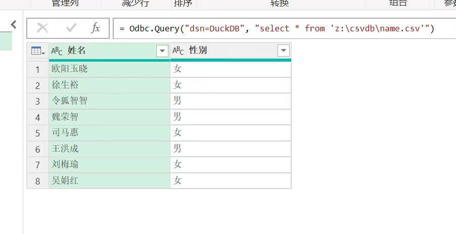
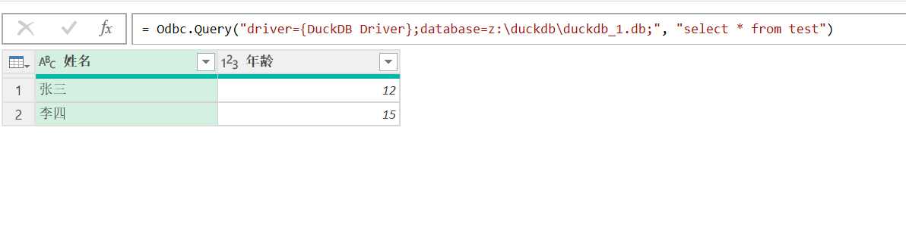
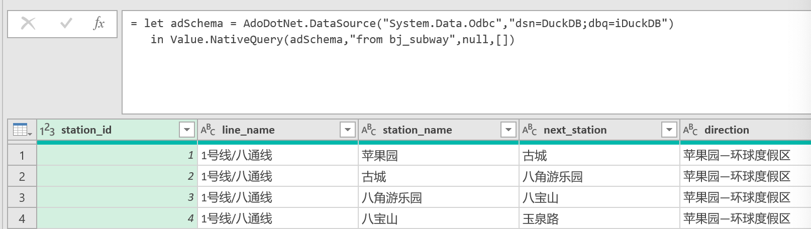
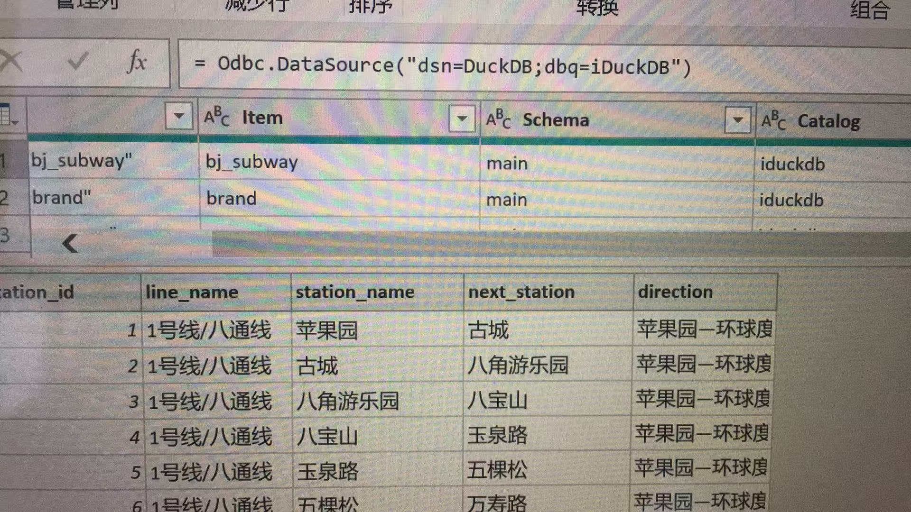
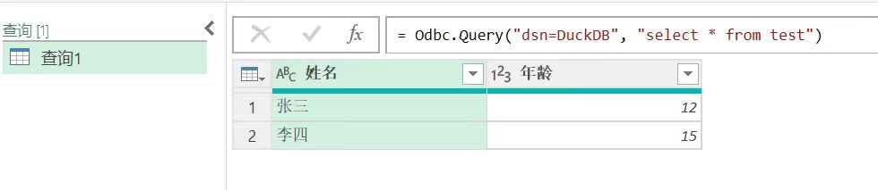

## 数据分析师直呼过瘾 | DuckDB + Excel 帅哭了    
              
### 作者              
digoal              
              
### 日期              
2025-06-19             
              
### 标签              
PostgreSQL , PolarDB , DuckDB , excel , 数据分析         
              
----              
              
## 背景     
数据分析就2步, 获取数据, 分析数据.    
  
获取数据之前, 首先要看数据在哪, 通常可能在数据库产品里、也可能是本地文件、也可能是对象存储中的文件.  
  
文件格式可能有excel、csv、txt、parquet等等.  
  
就以上这些, 感觉需要一款专业的付费应用来支撑.    
  
然后是分析数据, 分析通常需要对数据进行清洗、转换、处理, 然后是展示. 感觉又是一堆的功能, 也需要一款专业的付费应用来支撑.   
  
今天在DuckDB中文社区群看到高手了, 感叹民间高手多啊. 看到群里的讨论, 简直帅哭了.    
  
Excel通过ODBC直接调用DuckDB, 通过DuckDB可以完成数据的获取、处理、转换、统计等等一系列数据分析动作. 这些对DuckDB来讲易如反掌, 而且DuckDB又不用安装启动, 爽翻了!  
  
通过Excel则可对最终数据进行展示.  (当然Excel本身还具备数据处理的能力, 如有必要也可以在最终数据展示之前进行使用.)     
  
当然了, DuckDB的野心不止出数据获取和处理, 它可能会把UI也弄进来. 如下文所示:   
- [《DuckDB UI 开启乔布斯时刻: An Analyzer, A Brain, A Portal》](../202503/20250317_07.md)    
  
下面简单给个Demo, 在excel中如何使用DuckDB.    
  
## Excel + DuckDB  
我使用macOS进行演示.    
  
首先安装ODBC驱动, 参考:   
  
https://duckdb.org/docs/stable/clients/odbc/macos.html  
  
安装unixODBC  
```  
brew install unixodbc  
```  
  
验证安装是否正确:  
```  
$ odbcinst -j  
unixODBC 2.3.12  
DRIVERS............: /opt/homebrew/etc/odbcinst.ini  
SYSTEM DATA SOURCES: /opt/homebrew/etc/odbc.ini  
FILE DATA SOURCES..: /opt/homebrew/etc/ODBCDataSources  
USER DATA SOURCES..: /Users/digoal/.odbc.ini  
SQLULEN Size.......: 8  
SQLLEN Size........: 8  
SQLSETPOSIROW Size.: 8  
```  
  
下载DuckDB odbc driver  
```  
https://github.com/duckdb/duckdb-odbc/releases/download/v1.3.0.0/duckdb_odbc-osx-universal.zip  
  
mkdir duckdb_odbc && unzip duckdb_odbc-osx-universal.zip -d duckdb_odbc  
  
$ pwd  
/Users/digoal/Downloads  
  
  
$ ll duckdb_odbc  
total 205000  
-rwxr-xr-x@   1 digoal  staff   100M May 23 01:22 libduckdb_odbc.dylib  
drwx------@ 424 digoal  staff    13K Jun 19 14:01 ..  
drwxr-xr-x    3 digoal  staff    96B Jun 19 14:01 .  
  
-- 去除@属性  
$ sudo xattr -c ~/Downloads/duckdb_odbc/libduckdb_odbc.dylib  
$ sudo chmod +x ~/Downloads/duckdb_odbc/libduckdb_odbc.dylib  
  
-- 系统配置 - 安全和隐私 - 允许使用下载的libduckdb_odbc.dylib文件  
```  
  
配置ODBC, 参考:  
  
https://duckdb.org/docs/stable/clients/odbc/configuration.html  
  
编辑`/opt/homebrew/etc/odbc.ini`文件  
```  
vi /opt/homebrew/etc/odbc.ini  
  
[DuckDB]  
Driver = DuckDB Driver  
Database = :memory:  
access_mode = read_only  
```  
  
编辑`/opt/homebrew/etc/odbcinst.ini`文件  
```  
vi /opt/homebrew/etc/odbcinst.ini  
  
[ODBC]  
Trace = yes  
TraceFile = /tmp/odbctrace  
  
[DuckDB Driver]  
Driver = /Users/digoal/Downloads/duckdb_odbc/libduckdb_odbc.dylib  
```  
  
测试  
```  
isql -v DuckDB  
```  
  
查看日志  
```  
/tmp/odbctrace  
```  
  
我这里遇到一个小问题, isql报这个错  
```  
$ isql -v DuckDB  
[01000][unixODBC][Driver Manager]Can't open lib '/Users/digoal/Downloads/duckdb_odbc/libduckdb_odbc.dylib' : file not found  
[ISQL]ERROR: Could not SQLConnect  
```  
  
尝试了各种可能的问题, Gemini未解决  
```  
1. 检查驱动文件是否存在  
  
ls -l /Users/digoal/Downloads/duckdb_odbc/libduckdb_odbc.dylib  
  
2. 验证驱动安装  
  
odbcinst -q -d  
  
3. 检查 DSN 配置  
  
4. 解决动态库依赖问题  
  
如果驱动文件存在但依然报错，可能是依赖库缺失。运行以下命令检查依赖：  
  
otool -L /Users/digoal/Downloads/duckdb_odbc/libduckdb_odbc.dylib  
  
/Users/digoal/Downloads/duckdb_odbc/libduckdb_odbc.dylib (architecture x86_64):  
	@rpath/libduckdb_odbc.dylib (compatibility version 0.0.0, current version 0.0.0)  
	/Users/runner/work/duckdb-odbc/duckdb-odbc/build/unixodbc/build/lib/libodbcinst.2.dylib (compatibility version 3.0.0, current version 3.0.0)  
	/usr/lib/libc++.1.dylib (compatibility version 1.0.0, current version 1700.255.5)  
	/usr/lib/libSystem.B.dylib (compatibility version 1.0.0, current version 1345.120.2)  
/Users/digoal/Downloads/duckdb_odbc/libduckdb_odbc.dylib (architecture arm64):  
	@rpath/libduckdb_odbc.dylib (compatibility version 0.0.0, current version 0.0.0)  
	/Users/runner/work/duckdb-odbc/duckdb-odbc/build/unixodbc/build/lib/libodbcinst.2.dylib (compatibility version 3.0.0, current version 3.0.0)  
	/usr/lib/libc++.1.dylib (compatibility version 1.0.0, current version 1700.255.5)  
	/usr/lib/libSystem.B.dylib (compatibility version 1.0.0, current version 1345.120.2)  
  
  
如果输出中有 not found 的库，需安装对应依赖。例如：  
  
brew install openssl  # 示例：安装缺失的 OpenSSL  
  
rpath问题 修复方法  
  
# 先确保 libduckdb.dylib 存在（从 DuckDB 官网下载或编译）  
sudo cp /Users/digoal/Downloads/duckdb_odbc/libduckdb_odbc.dylib /usr/local/lib/  
  
# 使用 install_name_tool 修正路径  
install_name_tool -change \
  "@rpath/libduckdb_odbc.dylib" \
  "/usr/local/lib/libduckdb.dylib" \
  /Users/digoal/Downloads/duckdb_odbc/libduckdb_odbc.dylib  
  
install_name_tool -change \
  "/Users/runner/work/duckdb-odbc/duckdb-odbc/build/unixodbc/build/lib/libodbcinst.2.dylib" \
  "/usr/local/lib/libodbcinst.2.dylib" \
  /Users/digoal/Downloads/duckdb_odbc/libduckdb_odbc.dylib  
  
5. 确保文件权限正确  
  
chmod +x /Users/digoal/Downloads/duckdb_odbc/libduckdb_odbc.dylib  
  
6. 使用完整路径直接测试  
  
绕过 DSN，直接用驱动路径测试：  
  
isql -v "Driver=/Users/digoal/Downloads/duckdb_odbc/libduckdb_odbc.dylib;Database=:memory:"  
[S1090][unixODBC][Driver Manager]Invalid string or buffer length  
[ISQL]ERROR: Could not SQLConnect  
  
7. 其他可能原因  
  
M1/M2 Mac 兼容性问题  
  
如果是 ARM 架构 Mac，尝试用 Rosetta 运行：  
  
arch -x86_64 isql -v DuckDB  
arch: posix_spawnp: isql: Bad CPU type in executable  
  
arch -arm64 isql -v DuckDB  
[01000][unixODBC][Driver Manager]Can't open lib '/Users/digoal/Downloads/duckdb_odbc/libduckdb_odbc.dylib' : file not found  
[ISQL]ERROR: Could not SQLConnect  
```  
  
先放一边吧, 如果ODBC配置完成后, 应该可以在excel中使用odbc通过DuckDB请求任意位置的数据.  
  
截取了如下群里网友发来的截图, 大家参考一二  
  
    
  
  
    
    
  
  
  
  
  
  
    
  
