## AI论文解读 | THE FAISS LIBRARY
        
### 作者        
digoal        
        
### 日期        
2025-06-20        
        
### 标签        
PostgreSQL , PolarDB , DuckDB , AI , 论文解读        
        
----        
        
## 背景       
      
https://arxiv.org/pdf/2401.08281        
  
- [《pgvector hnsw高频更新场景的坑》](../202505/20250507_01.md)  
- [《数据库筑基课 - 向量类型》](../202501/20250103_01.md)  
- [《PostgreSQL 阿里云rds pg发布高维向量索引，支持图像识别、人脸识别 - pase 插件, 以及ivfflat,hnsw搜索算法说明》](../201912/20191219_02.md)  
- [《向量搜索优化3板斧: 空间、性能、召回(recall)》](../202405/20240506_03.md)  
- [《头大! 索引扫描和全表扫描结果不一样, 这向量数据库还能用? 教你一招大幅提升召回率(recall)》](../202404/20240417_01.md)  
- [《VectorChord 向量插件学习心得》](../202505/20250513_01.md)  
- [《向量插件新贵 VectorChord(IVF+ RaBitQ量化), pgvector 和 milvus 都被秒杀了》](../202504/20250427_02.md)  
- [《AI论文解读 | 向量ANNs方法之 RaBitQ: Quantizing High-Dimensional Vectors with a Theoretical Error Bound for Approximate Nearest Neighbor Search》](../202504/20250427_01.md) 
        
提示:        
```        
读懂《THE FAISS LIBRARY》这篇论文需要提前掌握哪些基础知识, 请使用中文给我讲一下这些基础知识, 尽量通熟易懂, 可以使用markdown支持的图形增加解释性.        
        
使用中文通熟易懂的解读《THE FAISS LIBRARY》这篇论文, 关键内容请深入讲解, 可以使用markdown支持的图形增加解释性.        
        
使用中文提取《THE FAISS LIBRARY》论文中一些重要的术语并详细解释, 可以使用markdown支持的图形示增加解释性.        
```        
        
## 1 前置知识  
  
好的，为了帮助您更好地理解《THE FAISS LIBRARY》这篇论文，我将为您梳理所需的基础知识。这些知识点是理解 Faiss 设计思想和核心技术的关键。

我会使用通俗易懂的语言，并配合 Markdown 图形来解释。

-----

### 核心思想：在海量数据中，如何快速找到“相似”的东西？

想象一下，你在一个拥有数十亿张图片的巨型图库里，想找一张和你的宠物狗很像的图片。人眼可以“感觉”到相似，但计算机如何做到呢？

Faiss 这个库就是为了解决这个问题而生的。它处理的不是图片或文字本身，而是它们的“数字指纹”——**向量（Vector）**。

要读懂这篇论文，您需要掌握以下几个核心概念：

-----

### 1\. 向量嵌入 (Vector Embeddings)

这是所有工作的基础。

  * **是什么？**
     向量嵌入是一种将复杂数据（如文字、图片、音频）转换成一串数字（即一个高维向量）的技术  。这个转换过程通常由深度学习模型（如神经网络）完成。

  * **为什么重要？**
     这个转换的神奇之处在于，它能将数据的“语义”信息编码到向量空间中。在向量空间里，**意思相近的内容，它们的向量在空间中的位置也相近**  。

  * **一个比喻：**
    想象一个巨大的图书馆，我们不按书名或作者排序，而是根据书的内容给每本书一个三维坐标 (x, y, z)。这样，所有关于“人工智能”的书都会被放在图书馆的同一个区域，而关于“历史”的书则在另一个区域。找一本和“机器学习”类似的书，只需要在你当前位置的附近寻找即可。

  

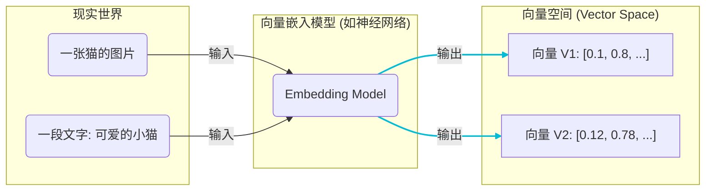

>  **论文关联：** 论文的引言部分    花了大量篇幅介绍嵌入（Embeddings）是现代AI应用的核心   ，Faiss 正是处理这些嵌入的工具  。

-----

### 2\. 向量相似度搜索与距离度量 (Vector Similarity Search & Distance Metrics)

将数据变成向量后，"相似"这个模糊概念就变成了可以计算的数学问题：**计算向量之间的“距离”**。

  * **是什么？**
     给定一个查询向量 (query vector)，从海量数据库中找出与它距离最近的 k 个向量 (k-nearest neighbors, k-NN)  。

  * **如何衡量“距离”？**
     主要有三种方式  ：

    1.   **L2 距离 (欧氏距离):** 就是我们最熟悉的“直线距离”  。`距离越小，越相似`。
    2.   **点积 (Inner Product):** 在推荐系统等领域常用  。`值越大，越相似`。
    3.   **余弦相似度 (Cosine Similarity):** 计算两个向量之间的夹角。它只关心方向不关心长度，非常适合比较文本文档  。`值越大（夹角越小），越相似`。

  

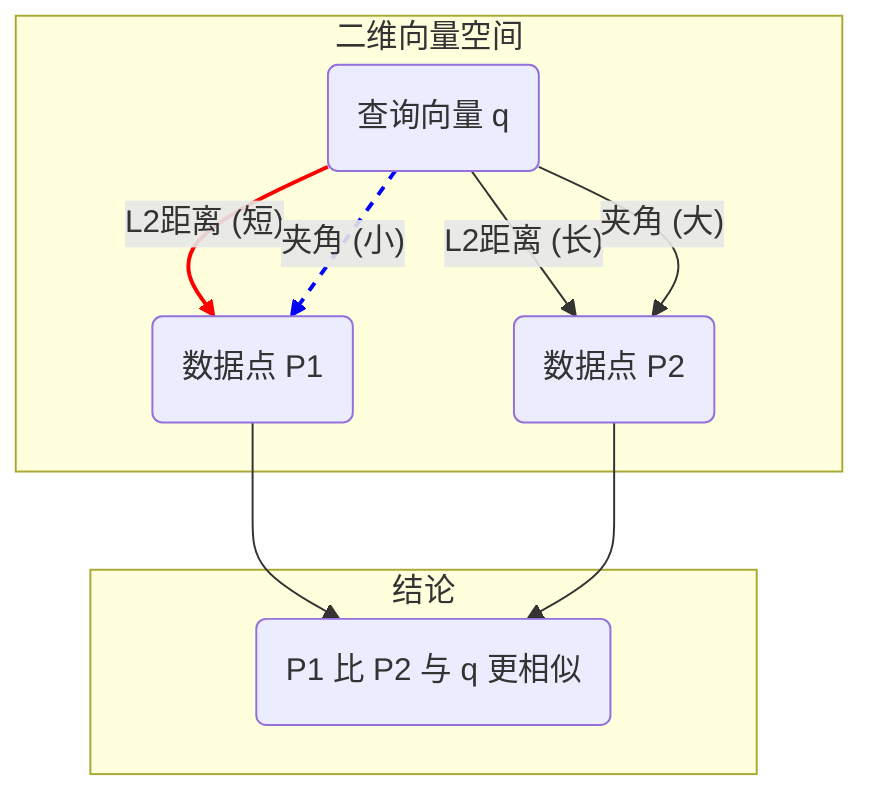

>  **论文关联：** 第 3 节 "Performance axes of a vector search library" 详细讨论了这些距离度量，以及它们之间的转换关系（见论文 Table 2） 。
  
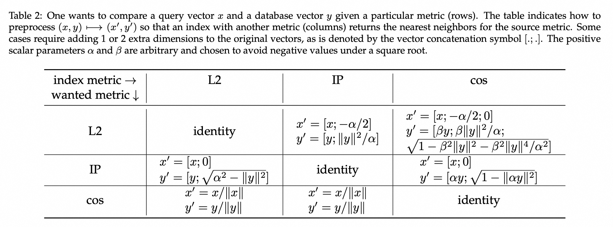  
  
-----

### 3\. 精确搜索 vs. 近似搜索 (Exact vs. Approximate Search)

  *  **暴力搜索 (Brute-force):** 最精确的方法，就是把查询向量和数据库里**每一个**向量都计算一遍距离，然后排序   。在数据量小的时候可行，但当向量数量达到百万、十亿级别时，这种方法的耗时是无法接受的  。

  *  **维度灾难 (Curse of Dimensionality):** 随着向量维度（向量里数字的个数）的增加，传统的空间索引方法（如 k-d 树）会失效，性能甚至不如暴力搜索  。

  *  **近似最近邻搜索 (ANNS - Approximate Nearest Neighbor Search):** 这是 Faiss 的核心。我们愿意牺牲一点点精度（比如，没找到“最”相似的，但找到了“第二相似”的），来换取百倍甚至千倍的速度提升  。

在 ANNS 中，我们永远在三个目标之间做权衡和取舍（trade-off）:

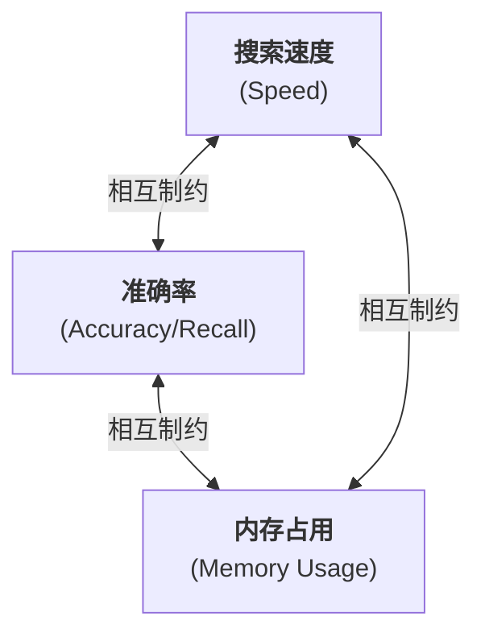

>  **论文关联：** 论文的 3.2 和 3.3 节专门讨论了 ANNS 的评估指标（如召回率 recall@k   ）和上述三个维度的权衡  。

-----

### 4\. Faiss 实现 ANNS 的两大核心技术

为了实现又快又省内存的近似搜索，Faiss 主要用了两种策略：**① 压缩向量** 和 **② 缩小搜索范围**。

#### (A) 矢量压缩 (Vector Compression)

 通过压缩，可以用更少的内存存储向量，并加速距离计算。主要方法是**矢量量化 (Vector Quantization)**  。

  * **核心思想：** 不存储原始的、精确的向量，而是存储一个代表它的“代号”（code）。
  * **主要技术：**
    1.   **标量量化 (SQ - Scalar Quantizer):** 最简单的方法，独立地压缩向量中的每一个维度（数字）。比如把高精度的浮点数变成一个8位的整数  。就像把 `3.14159` 近似成 `3.1`。

    2.   **乘积量化 (PQ - Product Quantizer):** Faiss 的明星技术之一  。它把一个长向量切成 M 段短的子向量，然后对每一小段分别进行量化。

          * **比喻：** 想象给一个电话号码 `138-1234-5678` 编码。PQ 不会为整个号码找一个代号，而是把它分成三段 `[138]`、`[1234]`、`[5678]`，然后分别为这三段找一个代号，比如 `A5`、`B77`、`C9`。这样组合起来，可以用很少的存储空间表示大量的可能性。

  

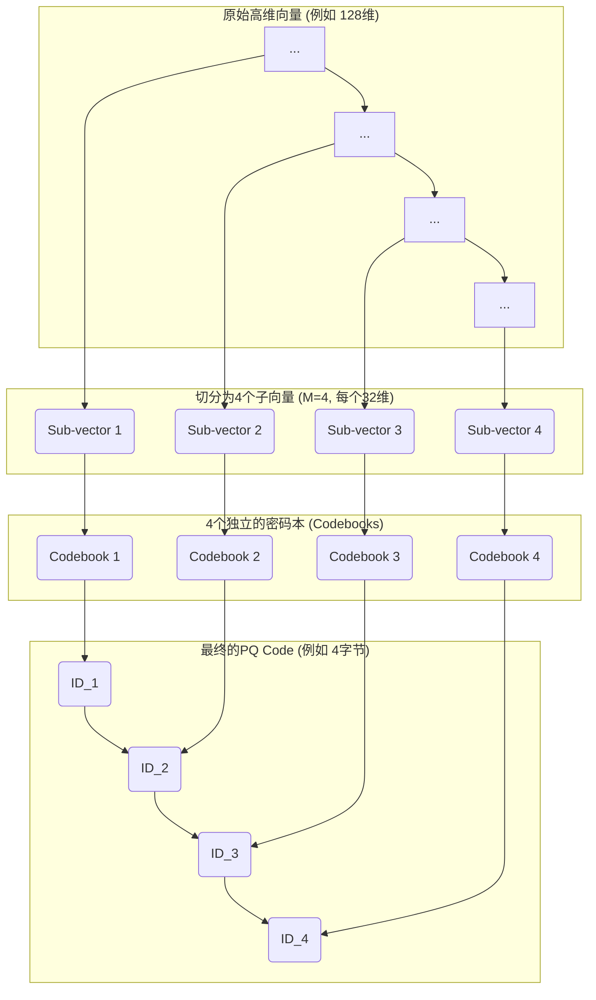

>  **论文关联：** 第 4 节 "Compression levels"    详细介绍了各种压缩方法，包括 SQ, PQ 以及更高级的 RQ/LSQ 等加性量化器   。Figure 3   对比了它们的性能。
  
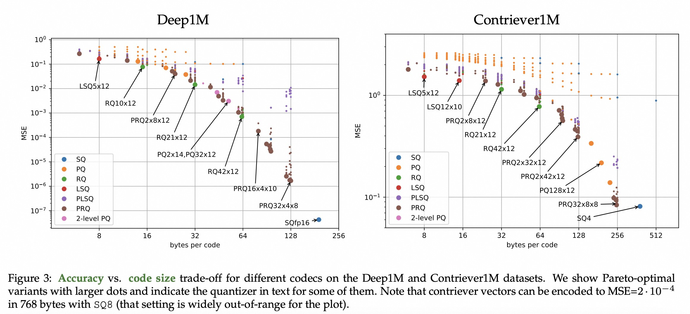  

#### (B) 搜索空间剪枝 (Pruning the Search Space)

 即使压缩了向量，全部比较一次还是太慢。所以需要通过索引结构，预先将数据组织好，搜索时只访问最有可能包含结果的一小部分数据  。

1.   **倒排文件索引 (IVF - Inverted File Index):** 这是处理超大规模数据集最常用的方法  。

      *  **步骤1 (训练):** 用 k-means 等聚类算法，把所有的数据库向量分成 `K` 个簇（cluster）。每个簇的中心点称为“质心”（centroid）  。

      * **步骤2 (添加):** 每个向量被放入离它最近的那个质心所属的簇。索引存储的是一个“倒排列表”，记录了每个簇里有哪些向量。

      *  **步骤3 (搜索):** 当一个查询向量来了，它**不会**和所有向量比较。而是先和 `K` 个质心比较，找到最近的 `nprobe` 个质心（比如 `nprobe=10`）。然后，**只**在这 `nprobe` 个簇内部进行搜索  。

      * **比喻：** 全国的人口普查。不是挨家挨户问，而是先把全国分成省份（聚类），你要找的人在“广东省”，那就在广东省内（少数几个簇）查找，其他省份就不用管了。

2.   **图索引 (Graph-based, e.g., HNSW):** 在中等规模（百万级）数据集上，通常能达到最高的准确率  。

      *  **思想：** 将每个向量看作一个节点，构建一个复杂的邻居网络图。这个图有“高速公路”（长距离连接，可以快速在图中跳转）和“普通公路”（短距离连接，用于在目标附近精细查找） 。
      *  **搜索：** 从图中的一个入口点开始，沿着边不断走向离查询向量更近的邻居，直到找不到更近的点为止  。

>  **论文关联：** 第 5 节 "Non-exhaustive search"   详细讲解了 IVF 和 HNSW 的原理、参数选择和性能表现。

-----

### 总结与阅读建议

理解了以上概念后，您就可以带着框架去阅读论文了。

| 基础概念 | 核心技术 | 关键取舍 (Trade-off) |
| :--- | :--- | :--- |
| **向量嵌入**<br>(数据表示) | **矢量压缩 (PQ, SQ)**<br>减小内存和计算量 | **速度 vs. 准确率**<br>（压缩率越高，速度越快，但精度损失越大） |
| **相似度/距离**<br>(问题定义) | **搜索空间剪枝 (IVF, HNSW)**<br>减少需要比较的向量数量 | **速度 vs. 内存**<br>（索引越复杂，如HNSW的边越多，内存占用越高，但可能更快更准） |
| **ANNS**<br>(解决方法) | **组合使用**<br>例如 `IVF+PQ` 是大规模搜索的黄金组合 | **构建时间 vs. 查询时间**<br>（复杂的索引构建慢，但查询快） |

当您看到论文中的 `IVF4096,PQ16` 这样的“天书”时，就能明白它的意思是：

  * `IVF4096`: 把数据分成 4096 个簇。
  * `PQ16`: 用乘积量化将每个向量压缩成 16 个字节。

 有了这些基础，论文中关于各种方法性能对比的图表（如 Figure 3, 4, 7）以及最终的“如何选择索引”的决策树（Figure 10  ）对您来说就会清晰很多。祝您阅读顺利！
  
  
  
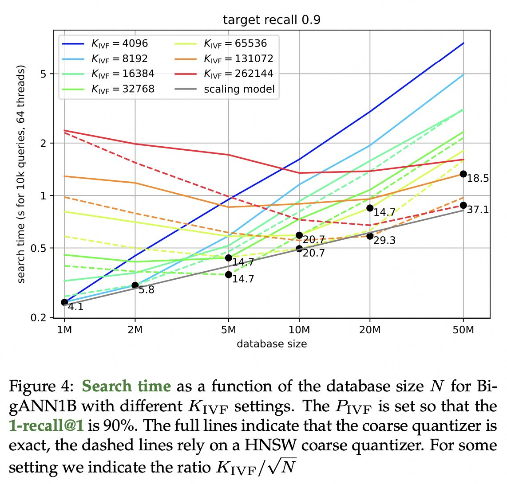  
  
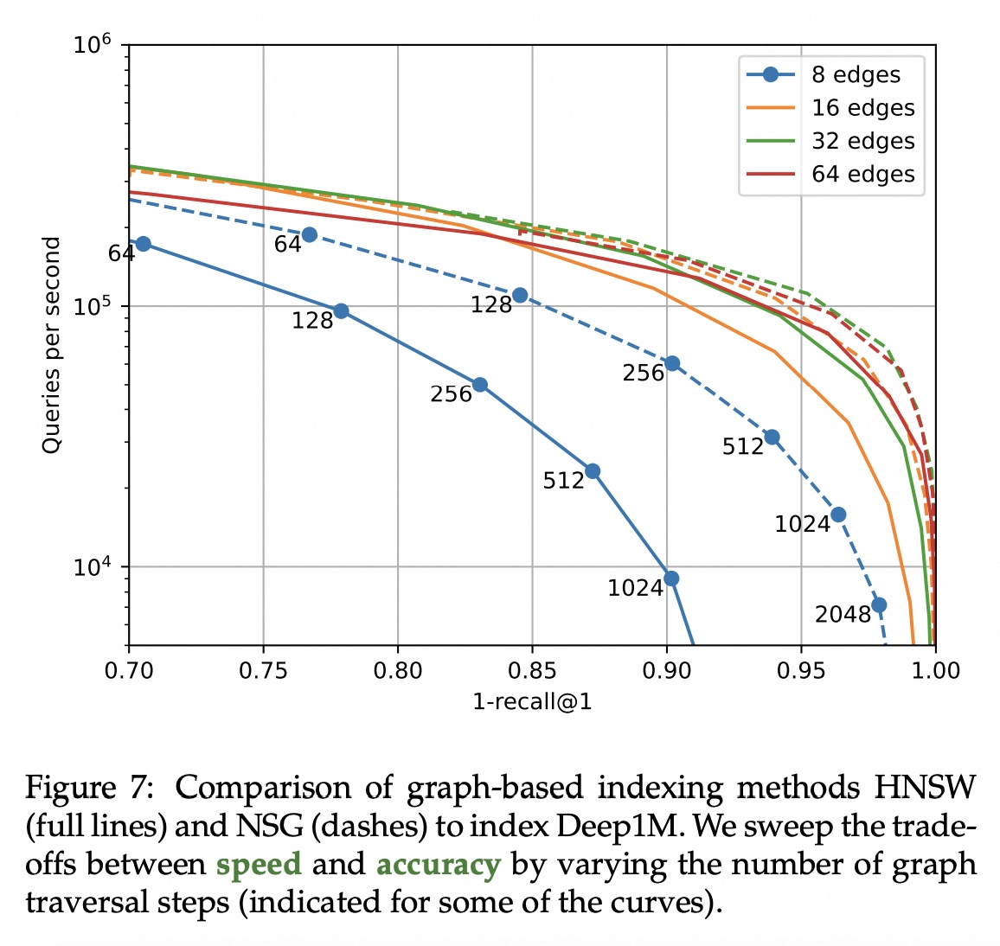  
  
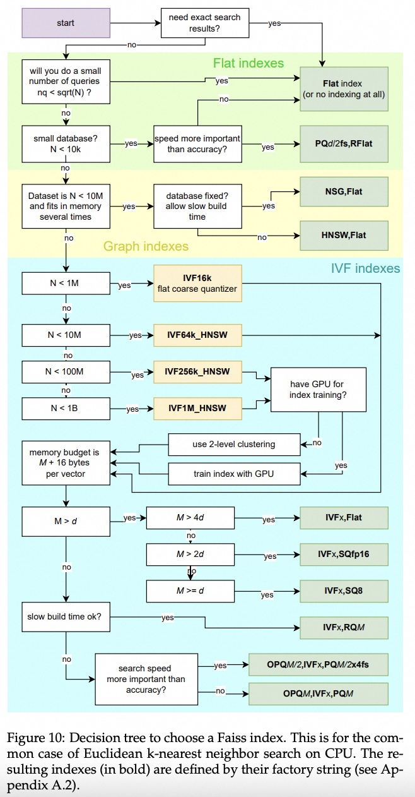  
    
## 2 解读论文 
  
好的，我们来一起深入解读这篇重要的论文——《THE FAISS LIBRARY》。

Faiss (Facebook AI Similarity Search) 是一个业界领先的开源库，专门用于高效的向量相似度搜索和聚类。这篇论文系统地介绍了 Faiss 的设计哲学、核心算法、性能权衡以及广泛应用。

---

### **核心问题：如何在海量“数字指纹”中秒速找到最相似的一个？**

 在现代人工智能中，图片、文字、用户行为等复杂信息都可以被一个称为**嵌入（Embedding）**的神经网络模型转换成一串数字，也就是**向量（Vector）**  。这些向量可以看作是原始数据的“数字指纹”。

 **Faiss 的使命**：当你有了一个新的查询向量（比如一张新图片的指纹），Faiss 的任务就是从一个可能包含数十亿个向量的数据库中，以极快的速度找出与它最相似的那些   。这是向量数据库的核心功能  。

 需要明确的是，Faiss **不是**一个完整的数据库系统   。它不负责存储原始数据、不做负载均衡或事务管理   ，它只专注于一件事并做到极致：**向量搜索算法的实现**  。

### **根本性的权衡：近似搜索的“三难困境”**

 对于海量数据，将查询向量与数据库中的每一个向量都比较一次（称为**暴力搜索**）是极其缓慢且不可行的   。因此，Faiss 的核心是**近似最近邻搜索（ANNS）**，即牺牲一点点绝对的准确性，来换取数量级的速度提升  。

在 ANNS 中，我们永远在三个核心指标之间进行权衡取舍：

1.  **搜索速度（Speed）**：每秒能处理多少次查询。
2.   **准确率（Accuracy / Recall）**：返回的结果有多大概率是真正的最近邻  。
3.   **内存占用（Memory）**：索引需要消耗多少 RAM  。

这三者构成了一个“三难困境”，提升任何一个指标通常都意味着要牺牲另外一个或两个。Faiss 的精髓就在于提供了丰富的工具集，让你根据自己的场景需求，在这三个维度上找到最佳平衡点。

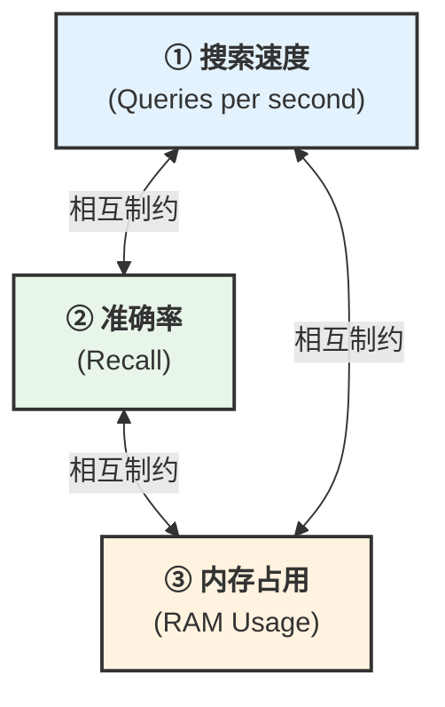

为了实现这一目标，Faiss 主要运用两大核心策略：**矢量压缩**和**非详尽搜索（搜索空间剪枝）**。

---

### **核心技术一：矢量压缩 (Vector Compression) —— 用更小的空间存数据**

 这个策略的目标是减小每个向量的内存占用，并加速距离计算   。Faiss 将其抽象为**矢量编解码器（Vector Codec）**，包含一个编码器（将原始向量压缩成简短的“码”）和一个解码器（将“码”解压回近似的向量）  。

#### 1. 标量量化 (Scalar Quantizer, SQ)
 这是最直观的压缩方式。它独立地压缩向量中的每一个维度（数字）   。例如，将一个高精度的 32-bit 浮点数，用一个 8-bit 的整数来近似表示  。这极大地降低了内存，但精度损失也较大。

#### 2. 乘积量化 (Product Quantizer, PQ)
这是 Faiss 的标志性技术之一，也是其能够在巨大规模下工作的关键。PQ 的思想是“分而治之”：
*  **分割 (Split)**：将一个高维向量（如 128 维）切分成 M 个低维的子向量（如 M=8，每个子向量 16 维）  。
*  **量化 (Quantize)**：为每一组子向量，分别训练一个自己的、小型的“密码本”（codebook）。这个密码本包含 256 个（或更少）“密码”，每个“密码”就是一个 16 维的质心向量。然后，在对应的密码本里为每个子向量找到最接近的那个“密码”，并用该密码的 ID（一个 0-255 的数字）来代替它  。
* **组合 (Concatenate)**：将 M 个子向量的 ID 组合在一起，形成最终的压缩码。例如，用 8 个 1-byte 的 ID 就可以表示一个 128 维的向量，实现了 128 字节到 8 字节的压缩。

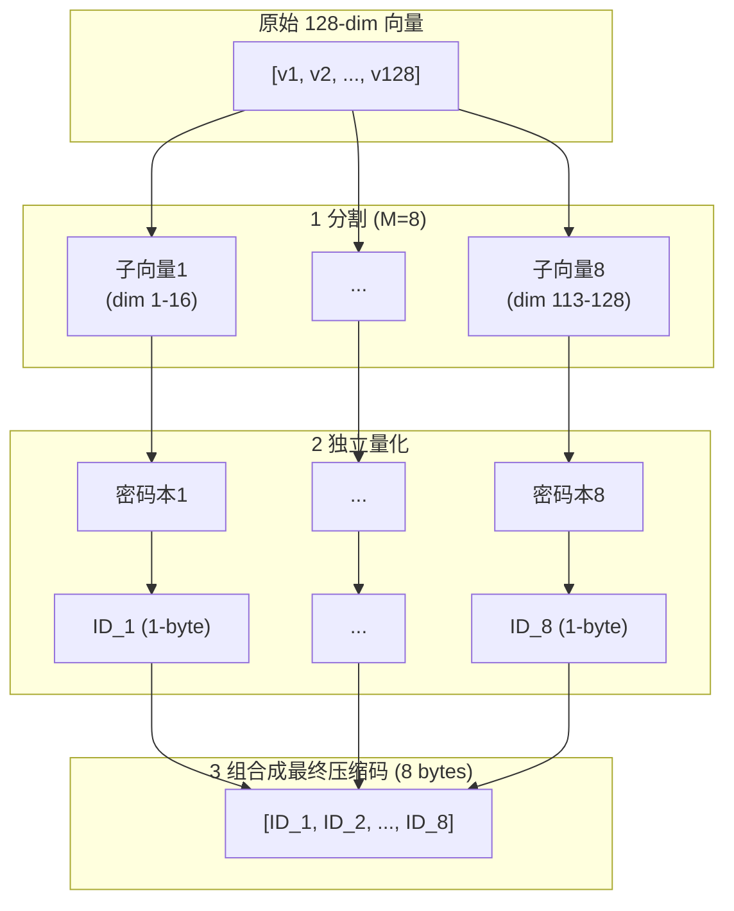
 在搜索时，Faiss 采用**非对称距离计算 (ADC)**，即查询向量保持原始精度，而数据库中的向量是压缩过的   。通过预计算查询向量与各个“密码”的距离，可以极快地估算出查询向量与数据库中任一压缩向量的距离，避免了大量的解压缩操作  。

#### 3. 加性量化 (Additive Quantizers, RQ/LSQ)
 这是比 PQ 更高级、更精确的量化方法，尤其在压缩率极高（码长极短）的情况下表现优异  。
*  **残差量化 (Residual Quantizer, RQ)**：它像一个多级火箭，第一级量化器对原始向量进行编码，第二级量化器对第一级的量化误差（残差）进行编码，以此类推  。
*  **局部搜索量化 (Local Search Quantizer, LSQ)**：它通过迭代优化的方式，为向量寻找一个最优的编码组合，精度很高但编码时间也更长  。

>  **论文解读**：论文中的 Figure 3 展示了不同压缩方法在不同码长下的精度（用均方误差 MSE 衡量）对比。可以清楚地看到，在码长较小时（如 8 字节），RQ/LSQ 等加性量化器精度最高；随着码长增加，PQ 的性能变得非常有竞争力，并且其构建速度和编码速度更快，是应用中的热门选择  。
  
  
  
---

### **核心技术二：非详尽搜索 (Non-exhaustive Search) —— 缩小搜索范围**

 这个策略的目标是通过建立索引，在搜索时跳过绝大部分不相关的向量，只在一小部分“候选区域”里进行精细查找  。

#### 1. 倒排文件索引 (Inverted File Index, IVF)
 这是 Faiss 处理十亿级别超大规模数据集的基石  。它的原理类似于书籍的目录索引。
*  **步骤 1 - 划分区域 (聚类)**：在添加数据前，先用 k-means 算法对数据进行聚类，将整个向量空间划分为 $K_{IVF}$ 个单元（cell），每个单元有一个中心点，称为**质心 (centroid)**  。你可以把这些单元想象成货架。
*  **步骤 2 - 数据上架 (索引)**：当一个向量被添加到索引时，计算它与所有质心的距离，找到最近的那个，然后将这个向量（或其压缩码）放入对应质心的**倒排列表 (inverted list)** 中  。
*  **步骤 3 - 按图索骥 (搜索)**：当一个查询向量来了，它首先与 $K_{IVF}$ 个质心比较，找出最接近的 `nprobe` 个质心（比如 `nprobe`=20）  。然后，Faiss **只**会访问这 `nprobe` 个倒排列表中的向量，而完全忽略其他成千上万个列表。这极大地减少了需要比较的向量总数。

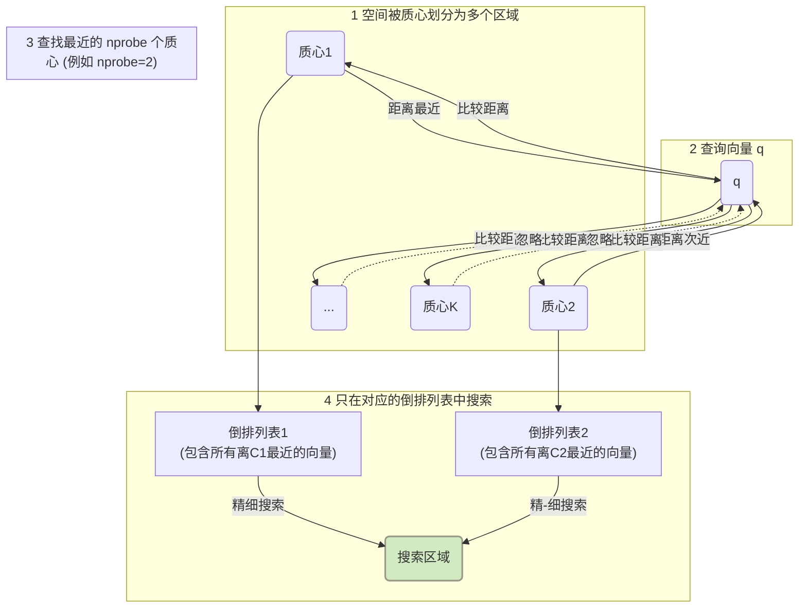
 为了进一步提升精度，IVF 通常存储的不是原始向量，而是向量与其所属质心之间的**残差 (residual)**   。对残差进行压缩效果更好，因为残差向量的长度通常更短，分布更集中  。

#### 2. 图索引 (Graph-based Indexing, HNSW)
 对于中等规模（百万到千万级）且内存充足的数据集，HNSW 通常是追求高准确率的首选方案  。
*  **原理**：HNSW (Hierarchical Navigable Small World) 为所有向量构建了一个多层次的图网络  。
    * **底层图**：是连接紧密的“本地路网”，确保了搜索的精确性。
    * **高层图**：是稀疏的“高速公路”，从图中随机抽取一些节点作为“枢纽”，连接较远的点，让搜索可以快速地在图中进行长距离跳转。
*  **搜索过程**：从顶层“高速公路”的入口点开始，贪心地沿着图的边走向离查询目标越来越近的节点。当无法在当前层找到更近的节点时，就下沉到下一层的“路网”中继续进行精细查找  。
*  **优点**：搜索效率和准确率极高，并且支持动态地向图中添加新向量  。

---

### **如何选择合适的 Faiss 索引？**

论文的精髓在于，它不仅介绍了算法，更提供了实用的指导。根据数据集大小、内存限制和性能要求，选择索引的思路如下（简化自论文 Figure 10）：  
  
  
  
1.   **数据集很小 (< 1万)**：无需任何花哨的技术，直接使用 `IndexFlat` 进行暴力搜索，这是最精确也是最简单的方案  。

2.   **中等数据集 (< 1000万) & 内存充足**：追求高准确率？`IndexHNSWFlat` 是最佳选择  。它将 HNSW 作为搜索结构，并存储原始向量。如果内存稍有压力，可以使用 `IndexHNSWPQ`，结合 HNSW 和 PQ 压缩。

3.   **超大规模数据集 (> 1000万) & 内存有限**：这是最常见的情况。此时，基于 **IVF** 的索引是唯一可行的选择  。你需要选择 IVF 和某种压缩方式的组合。
- **黄金组合**：`IndexIVFx,PQy`。例如 `IVF65536,PQ64`。
    - `IVF65536` 表示使用 65536 个质心来划分空间。
    - `PQ64` 表示使用乘积量化将每个向量压缩到 64 字节。
- **更高精度要求**：如果对精度要求苛刻且可以接受更长的构建时间，可以选择 `IndexIVFx,RQy` 等基于加性量化器的索引  。

### **应用与结论**

论文最后展示了 Faiss 在工业界的巨大影响力，包括：
*  构建**万亿 (Trillion) 规模**的向量索引  。
*  在**文本检索**和问答系统中作为核心检索引擎  。
*  用于大规模**数据挖掘**，如去重和清洗数据集  。
*  在**内容审核**中，通过搜索相似的违规内容样本来保护平台安全  。

 **总而言之，这篇论文告诉我们，Faiss 不是一个单一的算法，而是一个强大、灵活的算法工具箱  。它的设计哲学根植于对速度、准确率和内存这三大核心要素之间深刻的权衡理解。通过模块化地组合各种压缩和搜索策略，Faiss 为不同场景下的向量相似度搜索问题提供了定制化的、业界顶尖的解决方案。**
  
## 3 术语  
  
好的，我们来从《THE FAISS LIBRARY》这篇论文中提取最核心和重要的术语，并用通俗易懂的方式进行详细解释。

---

### 1. 近似最近邻搜索 (Approximate Nearest Neighbor Search, ANNS)
*  **一句话解释**：一种为了获得极快搜索速度，而愿意牺牲一点点结果精度的搜索策略  。
* **详细解释**：
     在海量向量数据中，要找到与查询向量**绝对**最相似的那个（即精确最近邻），需要将查询向量与数据库中所有向量逐一比较，这在数据量大时会非常耗时   。ANNS 算法则另辟蹊径，它的目标不是找到 100% 正确的结果，而是找到一个“足够好”的近似结果   。通过这种近似，ANNS 可以将搜索速度提升成百上千倍，是支撑大规模向量搜索的基石   。Faiss 本身就是一个 ANNS 算法的工具库  。
* **在 Faiss 中的作用**：这是 Faiss 库要解决的根本问题。Faiss 提供的所有索引结构，如 IVF、HNSW 等，都是 ANNS 的不同实现。

---

### 2. 乘积量化 (Product Quantizer, PQ)
*  **一句话解释**：一种高效的“分而治之”的向量压缩技术，用于大幅减少内存占用和加速计算  。
* **详细解释**：
    PQ 是 Faiss 的明星技术之一。它不会直接压缩整个高维向量，而是：
    1.   **分割 (Split)**：将一个高维向量（如 128 维）切分成 M 个互不重叠的低维子向量（如 M=16，每个子向量 8 维） 。
    2.   **独立量化 (Quantize)**：为每一段子向量**独立地**训练一个“密码本”（Codebook）。这个密码本通常包含 256 个质心（centroid）。然后，用离该子向量最近的那个质心的 ID (一个 0-255 的数字) 来表示这个子向量  。
    3.   **组合 (Concatenate)**：将 M 个子向量的 ID 组合起来，形成最终的压缩码  。例如，一个 128 维的 32-bit 浮点数向量（512 字节）可以被压缩成 16 个 ID（16 字节），实现了 32:1 的压缩率。

* **图形化解释**：
    ```mermaid
    graph TD
        subgraph "原始 128-dim 向量 (512 bytes)"
            V_full["[v1, ..., v128]"]
        end
        
        subgraph "1 分割成 16 个 8-dim 子向量"
            V1["子向量 1"]
            V2["..."]
            V16["子向量 16"]
        end
    
        subgraph "2 独立查找密码本"
            CB1["密码本 1 (含256个中心点)"] --> ID1["ID_1 (1-byte)"]
            CB2["..."] --> ID2["..."]
            CB16["密码本 16 (含256个中心点)"] --> ID16["ID_16 (1-byte)"]
        end
        
        subgraph "3 组合成最终 PQ Code (16 bytes)"
            FinalCode["[ID_1, ID_2, ..., ID_16]"]
        end
    
        V_full --> V1 & V2 & V16
        V1 --> CB1
        V2 --> CB2
        V16 --> CB16
        ID1 & ID2 & ID16 --> FinalCode
    ```
* **在 Faiss 中的作用**：PQ 是 Faiss 中最核心的压缩工具之一，常与 IVF 索引结合使用（如 `IndexIVFPQ`），在极大压缩数据体积的同时，还能通过“非对称距离计算”实现极快的距离估算。

---

### 3. 非对称距离计算 (Asymmetric Distance Computation, ADC)
* **一句话解释**：一种在计算查询向量与压缩向量之间距离时，能更好保留精度的方法。
* **详细解释**：
    在向量搜索中，有两种计算距离的方式：
    *  **对称 (SDC)**：将查询向量和数据库向量**都**压缩，然后计算压缩码之间的距离  。这样做速度最快，但因为查询向量也损失了精度，所以准确率较低。
    *  **非对称 (ADC)**：**只**压缩数据库中的向量，查询向量保持其原始的高精度形态   。计算距离时，是计算原始查询向量与“解压缩后的数据库向量”之间的距离   。这种方式更准确，因为查询端的信息没有损失  。
*  **在 Faiss 中的作用**：Faiss 中的大多数索引默认采用 ADC 模式，因为它在速度和准确率之间取得了更好的平衡  。

---

### 4. 倒排文件索引 (Inverted File Index, IVF)
*  **一句话解释**：一种通过聚类来划分搜索空间的索引结构，避免了对整个数据集的全局搜索  。
* **详细解释**：
    IVF 是 Faiss 处理超大规模数据集的“标准武器”。其核心思想类似于图书的目录：
    1.   **建立目录 (训练)**：首先，使用一个“粗量化器”（Coarse Quantizer，通常是 k-means 算法）将整个向量空间划分为 $K_{IVF}$ 个区域（或称为“单元”），每个区域有一个中心点，即**质心 (Centroid)**  。
    2.   **数据归类 (添加)**：当一个向量被加入索引时，它会被分配到离它最近的那个质心所代表的区域中，并被添加到一个“倒排列表”（Inverted List）里  。
    3.   **按图索骥 (搜索)**：当一个查询向量来了，它首先与 $K_{IVF}$ 个质心比较，找到最接近的 `nprobe` 个质心。然后，Faiss **只**会在这 `nprobe` 个倒排列表中进行搜索，从而将搜索范围缩小为原来的 `nprobe / K`  。

* **图形化解释**：
    ```mermaid
    graph TD
        subgraph "A. 整个向量空间"
            direction LR
            D1(.):::point --> D2(.):::point --> D3(.):::point
            D4(.):::point --> D5(.):::point --> D6(.):::point
            D7(.):::point --> D8(.):::point --> D9(.):::point
        end

        subgraph "B. 空间被 3 个质心划分为 3 个区域"
            C1(质心1) --- L1["倒排列表1<br>[v1, v4, v7]"]
            C2(质心2) --- L2["倒排列表2<br>[v2, v5, v8]"]
            C3(质心3) --- L3["倒排列表3<br>[v3, v6, v9]"]
        end

        subgraph "C. 搜索过程 (假设 nprobe=1)"
            Q(查询向量 q) --"1 找到最近的质心 (C2)"--> C2
            C2 --"2 只搜索列表2"--> L2
            L2 --"3 在v2,v5,v8中<br>进行精确比较"--> Result("返回最近邻")
        end
        
        Q -. "忽略" .-> C1
        Q -. "忽略" .-> C3
    ```
* **在 Faiss 中的作用**：IVF 是构建可扩展向量索引的基础结构 (`IndexIVF...` 系列)。它本身负责缩小搜索范围，内部的向量可以是不压缩的 (`IndexIVFFlat`)，也可以是用 PQ 等技术压缩的 (`IndexIVFPQ`)。

---

### 5. `nprobe`
*  **一句话解释**：IVF 索引在搜索时的一个关键参数，用于在“速度”和“准确率”之间进行权衡  。
* **详细解释**：
     `nprobe` 的值决定了在搜索阶段要探查多少个倒排列表（或区域） 。
    * **`nprobe` 值小**：例如 `nprobe=1`。只搜索离查询向量最近的那个区域。速度非常快，但如果真正的最近邻不幸落在了旁边的区域，就可能会漏掉，导致准确率下降。
    * **`nprobe` 值大**：例如 `nprobe=32`。搜索离查询向量最近的 32 个区域。搜索范围扩大，更有可能找到真正的最近邻，准确率提高，但相应的搜索时间也会增加。
* **在 Faiss 中的作用**：这是一个非常重要的**运行时**参数。用户可以在不重建索引的情况下，通过调整 `nprobe` 的值，灵活地控制搜索性能，以满足不同场景的需求。

---

### 6. HNSW (Hierarchical Navigable Small World)
*  **一句话解释**：一种基于图网络的多层导航索引结构，以高准确率和高效率著称  。
* **详细解释**：
     HNSW 将所有向量构建成一个复杂的网络图，其中每个向量是一个节点  。它的精妙之处在于**分层**：
    *  **高层图**：包含的节点较少，但连接的边都很长，像是“高速公路”，可以让搜索在图的不同区域间快速跳转  。
    *  **底层图**：包含所有节点，连接的边都很短，像是“本地街道”，用于在目标区域进行精细的查找  。
     搜索时，从顶层高速公路的某个入口点出发，贪心地沿着边向离查询目标更近的节点移动，当在本层找不到更近的节点时，就下沉到下一层继续搜索，直至最底层  。
*  **在 Faiss 中的作用**：HNSW (`IndexHNSW...`) 是 Faiss 中一个非常受欢迎的索引类型，尤其适用于对召回率要求极高的中等规模（千万级以下）数据集   。它支持动态添加数据  。
  
<b> PS: 我个人有个畅想, 对于超大量的向量数据集, 例如过百亿, 是不是可以使用多级索引, 类似分区表一样. 先按ivfflat分成一级(如1024个质心), 然后每个聚集再按hnsw建立索引. </b>   
  
---

### 7. 索引工厂 (Index Factory)
*  **一句话解释**：一个便捷的函数，可以通过一个描述性的字符串来快速创建和组合复杂的 Faiss 索引  。
* **详细解释**：
     创建一个复杂的 Faiss 索引通常需要组合多个对象，例如预处理（PCA）、IVF 结构、PQ 压缩等。索引工厂使得这个过程大大简化。用户只需要提供一个字符串，就能定义整个索引的结构和关键参数  。
    例如，字符串 `"IVF4096,PQ16"` 就能自动创建一个包含 4096 个倒排列表，并使用 16 字节 PQ 码来压缩向量的索引。更复杂的 `"PCA128,IVF16384_HNSW,PQ32x8,RFlat"` 也能被轻松解析并创建。
* **在 Faiss 中的作用**：这是 Faiss 易用性的一个重要体现，极大地降低了用户创建、配置和实验不同索引类型的门槛。
  
## 参考        
         
https://arxiv.org/pdf/2401.08281  
        
        
<b> 以上内容基于DeepSeek、Qwen、Gemini及诸多AI生成, 轻微人工调整, 感谢杭州深度求索人工智能、阿里云、Google等公司. </b>        
        
<b> AI 生成的内容请自行辨别正确性, 当然也多了些许踩坑的乐趣, 毕竟冒险是每个男人的天性.  </b>        
  
  
#### [期望 PostgreSQL|开源PolarDB 增加什么功能?](https://github.com/digoal/blog/issues/76 "269ac3d1c492e938c0191101c7238216")
  
  
#### [PolarDB 开源数据库](https://openpolardb.com/home "57258f76c37864c6e6d23383d05714ea")
  
  
#### [PolarDB 学习图谱](https://www.aliyun.com/database/openpolardb/activity "8642f60e04ed0c814bf9cb9677976bd4")
  
  
#### [PostgreSQL 解决方案集合](../201706/20170601_02.md "40cff096e9ed7122c512b35d8561d9c8")
  
  
#### [德哥 / digoal's Github - 公益是一辈子的事.](https://github.com/digoal/blog/blob/master/README.md "22709685feb7cab07d30f30387f0a9ae")
  
  
#### [About 德哥](https://github.com/digoal/blog/blob/master/me/readme.md "a37735981e7704886ffd590565582dd0")
  
  

  
