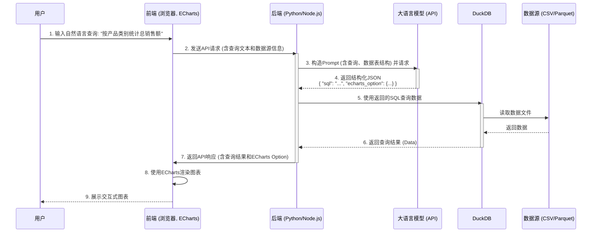

## 用 “DuckDB/DuckLake + ECharts + LLM” 实现一个智能数据可视化产品?  
                
### 作者                
digoal                
                
### 日期                
2025-06-20               
                
### 标签                
PostgreSQL , PolarDB , DuckDB , Excel , 数据分析 , ECharts , 数据分析可视化 , 数据挖掘 , DuckLake , MCP , A2A , AI Agent          
                
----                
                
## 背景      
看到群里的小伙伴在Excel里使用DuckDB来获取数据“[《数据分析师直呼过瘾 | DuckDB + Excel 帅哭了》](../202506/20250619_03.md)”后.   
  
个人认为数据分析就几个模块  
- 数据源定义和管理, 可以由DuckDB/DuckLake来完成  
- 任务理解和分解, 可以由LLM来完成  
- 数据获取/处理, 可以由DuckDB/DuckLake来完成. DuckDB/DuckLake厉害之处在于不需要启动数据库, 随时可挂载lib启用, 有算力即可. 而且能访问几乎任意数据源(文件、对象存储、数据库等). 而且处理能力还非常强(OLAP 处于第一梯队).  
- 可视化, 可以由ECharts来完成  
  
因此我有了个更大胆的想法.   
  
是不是可以用 “DuckDB/DuckLake + ECharts + LLM” 实现一个智能数据可视化产品?  
- https://echarts.apache.org/handbook/zh/get-started/  
- [《再见分布式湖仓一体, 你好DuckLake》](../202505/20250528_02.md)    
  
<b> 再结合MCP/A2A的话, 则还可以执行更复杂的任务, 例如数据分析后的决策/报告的生成等. 本位不展开 </b>    
  
那么就让Gemini来基于我的设想, 给个解决方案.  
  
好的，使用 DuckDB、ECharts 和大型语言模型（LLM）来构建一个智能数据可视化产品是一个非常前沿且实用的想法。这个组合可以创造一个强大的“对话式数据分析机器人”，让非技术用户也能通过自然语言与数据进行交互和探索。  
  
下面我将为您详细解读这个技术方案，包括其核心理念、系统架构、工作流程、关键功能、代码示例以及面临的挑战。  
  
---  
  
### 一、产品核心理念  
  
这个产品的核心是**将用户的自然语言（“人话”）转换成机器可执行的指令和可视化的图表**。  
  
* **用户说**：“帮我看看过去半年，每个地区的销售额趋势是怎样的？”  
* **产品做**：  
    1.  **理解**用户的意图（趋势 -> 折线图，地区 -> 分组，销售额 -> 聚合）。  
    2.  **生成**一段 SQL 查询语句。  
    3.  **执行** SQL 从数据源中计算出结果。  
    4.  **选择**最合适的图表类型（折线图）。  
    5.  **配置**图表的展示选项（标题、X/Y轴、图例等）。  
    6.  **渲染**出一个交互式的图表呈现给用户。  
  
### 二、三大核心组件及其角色  
  
1.  **DuckDB (高速数据处理引擎)**  
    * **角色**：数据查询与计算层。  
    * **为什么是它？** DuckDB 是一个进程内（in-process）的分析型数据库。它极其轻量、速度飞快，无需复杂的服务器部署。它可以直接读取 Parquet、CSV 等多种格式的文件，并使用完整的 SQL 标准进行复杂的分析查询（如聚合、窗口函数等）。在这个产品中，它负责执行由 LLM 生成的 SQL 查询，并快速返回计算结果。  
  
2.  **ECharts (强大的可视化渲染引擎)**  
    * **角色**：前端可视化层。  
    * **为什么是它？** ECharts 是一个功能极其丰富的图表库。它使用一个声明式的 JSON `option` 对象来定义图表的一切，非常灵活。LLM 的一个巨大优势就是能够生成结构化的 JSON 文本，这与 ECharts 的配置方式完美契合。ECharts 负责将从后端获取的数据和 LLM 生成的 `option` 配置渲染成漂亮的交互式图表。  
  
3.  **大型语言模型 (LLM) (智能大脑)**  
    * **角色**：自然语言理解与指令生成层。  
    * **为什么是它？** LLM 具备强大的自然语言理解、代码生成和逻辑推理能力。它是整个产品的“智能”核心，主要承担三大任务：  
        1.  **Text-to-SQL**：将用户的自然语言问题转换成精确的 DuckDB SQL 查询语句。  
        2.  **图表类型推荐**：根据用户问题的性质（如比较、趋势、分布、构成），决定使用柱状图、折线图、饼图还是散点图等。  
        3.  **Text-to-ECharts Option**：生成 ECharts 所需的完整 JSON `option` 配置，包括标题、坐标轴、数据系列（series）等。  
  
[《如何评测 Text-to-SQL 产品是否靠谱? | BIRD-SQL》](../202506/20250616_03.md)    
  
[《如何评测 AI4DB SQL问题诊断与解决产品是否靠谱? | BIRD-CRITIC》](../202506/20250618_03.md)    
  
  
### 三、系统架构与工作流程  
  
一个典型的架构如下所示，它将前端与后端分离，通过 API 进行通信。  
  
#### 架构图  
  

  
#### 工作流程详解  
  
1.  **用户交互**：用户在前端界面上传一个数据文件（如 `sales.csv`）或选择一个已有的数据源。然后，在输入框中用自然语言提问。  
2.  **前端请求**：前端将用户的查询文本和数据源标识发送到后端 API。  
3.  **后端编排 (核心)**：  
    * 后端首先加载数据文件，并使用 DuckDB 快速分析其**表结构（Schema）**，即列名和数据类型。  
    * 后端构造一个精心设计的 **Prompt** 发送给 LLM。这个 Prompt 至关重要，它通常包含：  
        * **用户问题**：例如，“按产品类别统计总销售额”。  
        * **数据表结构**：例如，`Table 'sales' has columns: [product_category (VARCHAR), sales_amount (DOUBLE), sales_date (DATE)]`。  
        * **指令要求**：明确要求 LLM 返回一个包含 `sql` 和 `echarts_option` 两个键的 JSON 对象。  
        * **少量示例 (Few-shot)**：可以提供一两个“问题 -> JSON”的例子，以提高 LLM 输出的准确性和稳定性。  
4.  **LLM 处理**：LLM 理解上下文后，生成相应的 SQL 和 ECharts 配置。  
5.  **数据查询**：后端解析 LLM 返回的 JSON，拿到 `sql` 字符串，并使用 DuckDB 在指定的数据源上执行该查询。  
6.  **结果返回**：后端将从 DuckDB 获取的**数据结果**和从 LLM 获取的 **ECharts `option`** 一并返回给前端。  
7.  **前端渲染**：前端的 JavaScript 代码接收到数据后，调用 ECharts 的 `setOption` 方法，将数据和配置注入，即可渲染出最终的图表。  
  
### 四、关键功能设计  
  
* **自然语言查询**：产品的核心输入方式。  
* **自动图表推荐**：LLM 根据分析意图自动选择最合适的图表。  
* **多轮对话与追问**：通过在 Prompt 中加入聊天历史，支持用户进行追问，如“那如果只看华东区呢？”或“把这个换成饼图显示”。  
* **数据探索与总结**：用户可以问“这个数据集里有什么？”“每一列是什么意思？”，LLM 可以基于表结构生成一份数据摘要。  
* **图表导出**：前端利用 ECharts 的功能，可以轻松实现将图表导出为图片，或将数据导出为 CSV。  
  
### 五、后端伪代码示例 (Python + Flask)  
  
这是一个简化的后端逻辑，展示了核心的编排过程。  
  
```python  
from flask import Flask, request, jsonify  
import duckdb  
import openai # 假设使用OpenAI  
import json  
  
app = Flask(__name__)  
  
# 假设LLM客户端已配置  
# openai.api_key = "YOUR_API_KEY"  
  
def get_table_schema(db_con, table_name='data'):  
    """使用DuckDB获取表的结构信息"""  
    result = db_con.execute(f"DESCRIBE {table_name};").fetchall()  
    schema = "\n".join([f"- {col[0]} ({col[1]})" for col in result])  
    return f"Table '{table_name}' has the following columns:\n{schema}"  
  
def generate_visualization_payload(query, schema):  
    """构造Prompt并调用LLM"""  
    prompt = f"""  
You are an expert data analyst. Your task is to help a user visualize their data.  
Given a user query and the data schema, you must generate a JSON object containing two keys: 'sql' and 'echarts_option'.  
  
**Data Schema:**  
{schema}  
  
**User Query:**  
"{query}"  
  
**Instructions:**  
1.  The 'sql' key should contain a DuckDB-compatible SQL query to retrieve the data for visualization.  
2.  The 'echarts_option' key should contain a JSON object for ECharts to render the chart. The data field in the ECharts option should be left empty, as it will be populated later.  
3.  Choose the best chart type (bar, line, pie, etc.) based on the user's query.  
  
**Output (JSON object only):**  
"""  
      
    response = openai.ChatCompletion.create(  
        model="gpt-4-turbo", # 或者其他支持的JSON模式的模型  
        messages=[{"role": "user", "content": prompt}],  
        response_format={"type": "json_object"}  
    )  
      
    return json.loads(response.choices[0].message.content)  
  
  
@app.route('/visualize', methods=['POST'])  
def visualize_data():  
    user_query = request.json.get('query')  
    file_path = request.json.get('file_path') # 例如 'data/sales.parquet'  
  
    if not user_query or not file_path:  
        return jsonify({"error": "Missing query or file_path"}), 400  
  
    try:  
        # 使用DuckDB连接数据  
        con = duckdb.connect(database=':memory:', read_only=False)  
        # DuckDB可以直接将文件注册为虚拟表  
        con.execute(f"CREATE OR REPLACE VIEW data AS SELECT * FROM '{file_path}';")  
  
        # 1. 获取表结构  
        schema_info = get_table_schema(con, 'data')  
  
        # 2. 调用LLM生成SQL和ECharts Option  
        payload = generate_visualization_payload(user_query, schema_info)  
        sql_query = payload.get('sql')  
        echarts_option = payload.get('echarts_option')  
  
        # 3. 执行SQL查询  
        data_result = con.execute(sql_query).pl().to_dicts() # Polars DataFrame to dicts  
  
        # 4. 将查询结果和ECharts Option返回给前端  
        # 注意：实际应用中，需要将data_result适配到echarts_option的数据格式中  
        return jsonify({  
            "data": data_result,  
            "echarts_option": echarts_option  
        })  
  
    except Exception as e:  
        return jsonify({"error": str(e)}), 500  
    finally:  
        if 'con' in locals():  
            con.close()  
  
if __name__ == '__main__':  
    app.run(debug=True)  
  
```  
  
### 六、挑战与考量  
  
1.  **Prompt 工程的复杂性**：如何设计稳定、高效的 Prompt 是最大的挑战。需要不断优化，确保 LLM 能稳定输出合规的 SQL 和 JSON。  
2.  **SQL 的准确性与“幻觉”**：LLM 可能会生成错误的 SQL（如错误的列名、不兼容的函数）。后端需要增加校验和错误重试机制。  
3.  **安全性**：**绝对不能**直接执行 LLM 生成的 SQL 操作一个有写权限的生产数据库。DuckDB 的进程内和只读模式在这里是一个巨大的优势，它天然地提供了一个沙箱环境。但仍需警惕潜在的数据泄露或DoS攻击风险。  
4.  **性能瓶颈**：DuckDB 查询极快，但 LLM 的 API 调用可能有延迟，这会是整个流程的性能瓶颈。可以考虑流式响应（Streaming）来改善用户体验。  
5.  **处理模糊查询**：当用户问题很模糊时（如“看看数据”），LLM 需要能做出合理的默认行为（如展示数据摘要）或向用户提澄清性问题。  
6.  **成本控制**：LLM API 调用是收费的，需要对查询进行有效管理和缓存，以控制成本。  
  
综上所述，`DuckDB + ECharts + LLM` 的组合是一个极具潜力的技术栈，它能真正实现数据可视化的智能化和大众化。虽然挑战存在，但其带来的价值和创新的用户体验是无与伦伦比的。  
      
