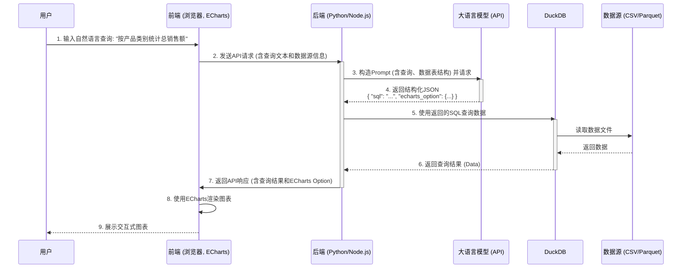
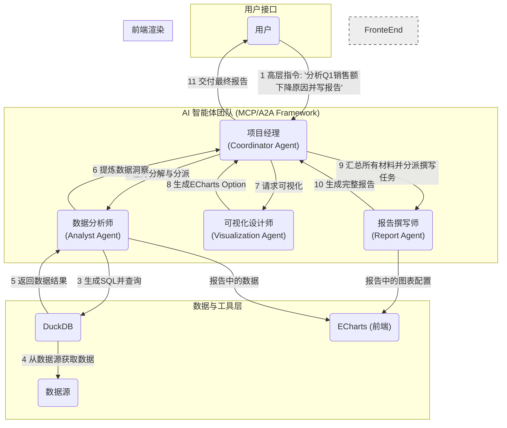

## 用 “DuckDB/DuckLake + ECharts + LLM” 实现一个BI智能数据可视化产品?  
                
### 作者                
digoal                
                
### 日期                
2025-06-20               
                
### 标签                
PostgreSQL , PolarDB , DuckDB , Excel , 数据分析 , ECharts , 数据分析可视化 , 数据挖掘 , DuckLake , MCP , A2A , AI Agent          
                
----                
                
## 背景      
看到群里的小伙伴在Excel里使用DuckDB来获取数据“[《数据分析师直呼过瘾 | DuckDB + Excel 帅哭了》](../202506/20250619_03.md)”后.   
  
个人认为数据分析就几个模块  
- 数据源定义和管理, 可以由DuckDB/DuckLake来完成  
- 任务理解和分解, 可以由LLM来完成  
- 数据获取/处理, 可以由DuckDB/DuckLake来完成. DuckDB/DuckLake厉害之处在于不需要启动数据库, 随时可挂载lib启用, 有算力即可. 而且能访问几乎任意数据源(文件、对象存储、http、数据库等, 还可以通过扩展支持更多源和数据格式). 而且处理能力还非常强(OLAP 处于第一梯队).  
- 可视化, 可以由ECharts来完成  
  
因此我有了个更大胆的想法.   
   
是不是可以用 “DuckDB/DuckLake + ECharts + LLM” 实现一个智能数据可视化产品?  
- https://echarts.apache.org/handbook/zh/get-started/  
- [《再见分布式湖仓一体, 你好DuckLake》](../202505/20250528_02.md)  
- [《祝贺DuckDB斩获30K star, Roadmap暴露野心, 估值可能过百亿》](../202506/20250610_04.md)    
- [《DuckDB进军AI数据库底座, 坐实了 | 文本语义(向量)搜索、全文检索、bm25搜索与排序、模糊搜索详解》](../202506/20250614_02.md)  
  
  
<b> 结合飞书/语雀这类文案产品就可以形成图文并茂的报表, 再结合MCP/A2A的话, 则还可以执行更复杂的任务, 例如数据分析后的决策/报告的生成等. 放在第二部分展开.  </b>    
   
那么就让Gemini来基于我的设想, 给个解决方案.  
  
## 第一部分
  
好的，使用 DuckDB、ECharts 和大型语言模型（LLM）来构建一个智能数据可视化产品是一个非常前沿且实用的想法。这个组合可以创造一个强大的“对话式数据分析机器人”，让非技术用户也能通过自然语言与数据进行交互和探索。  
  
下面我将为您详细解读这个技术方案，包括其核心理念、系统架构、工作流程、关键功能、代码示例以及面临的挑战。  
  
---  
  
### 一、产品核心理念  
  
这个产品的核心是**将用户的自然语言（“人话”）转换成机器可执行的指令和可视化的图表**。  
  
* **用户说**：“帮我看看过去半年，每个地区的销售额趋势是怎样的？”  
* **产品做**：  
    1.  **理解**用户的意图（趋势 -> 折线图，地区 -> 分组，销售额 -> 聚合）。  
    2.  **生成**一段 SQL 查询语句。  
    3.  **执行** SQL 从数据源中计算出结果。  
    4.  **选择**最合适的图表类型（折线图）。  
    5.  **配置**图表的展示选项（标题、X/Y轴、图例等）。  
    6.  **渲染**出一个交互式的图表呈现给用户。  
  
### 二、三大核心组件及其角色  
  
1.  **DuckDB (高速数据处理引擎)**  
    * **角色**：数据查询与计算层。  
    * **为什么是它？** DuckDB 是一个进程内（in-process）的分析型数据库。它极其轻量、速度飞快，无需复杂的服务器部署。它可以直接读取 Parquet、CSV 等多种格式的文件，并使用完整的 SQL 标准进行复杂的分析查询（如聚合、窗口函数等）。在这个产品中，它负责执行由 LLM 生成的 SQL 查询，并快速返回计算结果。  
  
2.  **ECharts (强大的可视化渲染引擎)**  
    * **角色**：前端可视化层。  
    * **为什么是它？** ECharts 是一个功能极其丰富的图表库。它使用一个声明式的 JSON `option` 对象来定义图表的一切，非常灵活。LLM 的一个巨大优势就是能够生成结构化的 JSON 文本，这与 ECharts 的配置方式完美契合。ECharts 负责将从后端获取的数据和 LLM 生成的 `option` 配置渲染成漂亮的交互式图表。  
  
3.  **大型语言模型 (LLM) (智能大脑)**  
    * **角色**：自然语言理解与指令生成层。  
    * **为什么是它？** LLM 具备强大的自然语言理解、代码生成和逻辑推理能力。它是整个产品的“智能”核心，主要承担三大任务：  
        1.  **Text-to-SQL**：将用户的自然语言问题转换成精确的 DuckDB SQL 查询语句。  
        2.  **图表类型推荐**：根据用户问题的性质（如比较、趋势、分布、构成），决定使用柱状图、折线图、饼图还是散点图等。  
        3.  **Text-to-ECharts Option**：生成 ECharts 所需的完整 JSON `option` 配置，包括标题、坐标轴、数据系列（series）等。  

注意, LLM的NL2SQL能力需要进行评测是否靠谱:   
- [《如何评测 Text-to-SQL 产品是否靠谱? | BIRD-SQL》](../202506/20250616_03.md)    
- [《如何评测 AI4DB SQL问题诊断与解决产品是否靠谱? | BIRD-CRITIC》](../202506/20250618_03.md)    
  
  
### 三、系统架构与工作流程  
  
一个典型的架构如下所示，它将前端与后端分离，通过 API 进行通信。  
  
#### 架构图  
  

  
#### 工作流程详解  
  
1.  **用户交互**：用户在前端界面上传一个数据文件（如 `sales.csv`）或选择一个已有的数据源。然后，在输入框中用自然语言提问。  
2.  **前端请求**：前端将用户的查询文本和数据源标识发送到后端 API。  
3.  **后端编排 (核心)**：  
    * 后端首先加载数据文件，并使用 DuckDB 快速分析其**表结构（Schema）**，即列名和数据类型。  
    * 后端构造一个精心设计的 **Prompt** 发送给 LLM。这个 Prompt 至关重要，它通常包含：  
        * **用户问题**：例如，“按产品类别统计总销售额”。  
        * **数据表结构**：例如，`Table 'sales' has columns: [product_category (VARCHAR), sales_amount (DOUBLE), sales_date (DATE)]`。  
        * **指令要求**：明确要求 LLM 返回一个包含 `sql` 和 `echarts_option` 两个键的 JSON 对象。  
        * **少量示例 (Few-shot)**：可以提供一两个“问题 -> JSON”的例子，以提高 LLM 输出的准确性和稳定性。  
4.  **LLM 处理**：LLM 理解上下文后，生成相应的 SQL 和 ECharts 配置。  
5.  **数据查询**：后端解析 LLM 返回的 JSON，拿到 `sql` 字符串，并使用 DuckDB 在指定的数据源上执行该查询。  
6.  **结果返回**：后端将从 DuckDB 获取的**数据结果**和从 LLM 获取的 **ECharts `option`** 一并返回给前端。  
7.  **前端渲染**：前端的 JavaScript 代码接收到数据后，调用 ECharts 的 `setOption` 方法，将数据和配置注入，即可渲染出最终的图表。  
  
### 四、关键功能设计  
  
* **自然语言查询**：产品的核心输入方式。  
* **自动图表推荐**：LLM 根据分析意图自动选择最合适的图表。  
* **多轮对话与追问**：通过在 Prompt 中加入聊天历史，支持用户进行追问，如“那如果只看华东区呢？”或“把这个换成饼图显示”。  
* **数据探索与总结**：用户可以问“这个数据集里有什么？”“每一列是什么意思？”，LLM 可以基于表结构生成一份数据摘要。  
* **图表导出**：前端利用 ECharts 的功能，可以轻松实现将图表导出为图片，或将数据导出为 CSV。  
  
### 五、后端伪代码示例 (Python + Flask)  
  
这是一个简化的后端逻辑，展示了核心的编排过程。  
  
```python  
from flask import Flask, request, jsonify  
import duckdb  
import openai # 假设使用OpenAI  
import json  
  
app = Flask(__name__)  
  
# 假设LLM客户端已配置  
# openai.api_key = "YOUR_API_KEY"  
  
def get_table_schema(db_con, table_name='data'):  
    """使用DuckDB获取表的结构信息"""  
    result = db_con.execute(f"DESCRIBE {table_name};").fetchall()  
    schema = "\n".join([f"- {col[0]} ({col[1]})" for col in result])  
    return f"Table '{table_name}' has the following columns:\n{schema}"  
  
def generate_visualization_payload(query, schema):  
    """构造Prompt并调用LLM"""  
    prompt = f"""  
You are an expert data analyst. Your task is to help a user visualize their data.  
Given a user query and the data schema, you must generate a JSON object containing two keys: 'sql' and 'echarts_option'.  
  
**Data Schema:**  
{schema}  
  
**User Query:**  
"{query}"  
  
**Instructions:**  
1.  The 'sql' key should contain a DuckDB-compatible SQL query to retrieve the data for visualization.  
2.  The 'echarts_option' key should contain a JSON object for ECharts to render the chart. The data field in the ECharts option should be left empty, as it will be populated later.  
3.  Choose the best chart type (bar, line, pie, etc.) based on the user's query.  
  
**Output (JSON object only):**  
"""  
      
    response = openai.ChatCompletion.create(  
        model="gpt-4-turbo", # 或者其他支持的JSON模式的模型  
        messages=[{"role": "user", "content": prompt}],  
        response_format={"type": "json_object"}  
    )  
      
    return json.loads(response.choices[0].message.content)  
  
  
@app.route('/visualize', methods=['POST'])  
def visualize_data():  
    user_query = request.json.get('query')  
    file_path = request.json.get('file_path') # 例如 'data/sales.parquet'  
  
    if not user_query or not file_path:  
        return jsonify({"error": "Missing query or file_path"}), 400  
  
    try:  
        # 使用DuckDB连接数据  
        con = duckdb.connect(database=':memory:', read_only=False)  
        # DuckDB可以直接将文件注册为虚拟表  
        con.execute(f"CREATE OR REPLACE VIEW data AS SELECT * FROM '{file_path}';")  
  
        # 1. 获取表结构  
        schema_info = get_table_schema(con, 'data')  
  
        # 2. 调用LLM生成SQL和ECharts Option  
        payload = generate_visualization_payload(user_query, schema_info)  
        sql_query = payload.get('sql')  
        echarts_option = payload.get('echarts_option')  
  
        # 3. 执行SQL查询  
        data_result = con.execute(sql_query).pl().to_dicts() # Polars DataFrame to dicts  
  
        # 4. 将查询结果和ECharts Option返回给前端  
        # 注意：实际应用中，需要将data_result适配到echarts_option的数据格式中  
        return jsonify({  
            "data": data_result,  
            "echarts_option": echarts_option  
        })  
  
    except Exception as e:  
        return jsonify({"error": str(e)}), 500  
    finally:  
        if 'con' in locals():  
            con.close()  
  
if __name__ == '__main__':  
    app.run(debug=True)  
  
```  
  
### 六、挑战与考量  
  
1.  **Prompt 工程的复杂性**：如何设计稳定、高效的 Prompt 是最大的挑战。需要不断优化，确保 LLM 能稳定输出合规的 SQL 和 JSON。  
2.  **SQL 的准确性与“幻觉”**：LLM 可能会生成错误的 SQL（如错误的列名、不兼容的函数）。后端需要增加校验和错误重试机制。  
3.  **安全性**：**绝对不能**直接执行 LLM 生成的 SQL 操作一个有写权限的生产数据库。DuckDB 的进程内和只读模式在这里是一个巨大的优势，它天然地提供了一个沙箱环境。但仍需警惕潜在的数据泄露或DoS攻击风险。  
4.  **性能瓶颈**：DuckDB 查询极快，但 LLM 的 API 调用可能有延迟，这会是整个流程的性能瓶颈。可以考虑流式响应（Streaming）来改善用户体验。  
5.  **处理模糊查询**：当用户问题很模糊时（如“看看数据”），LLM 需要能做出合理的默认行为（如展示数据摘要）或向用户提澄清性问题。  
6.  **成本控制**：LLM API 调用是收费的，需要对查询进行有效管理和缓存，以控制成本。  
  
综上所述，`DuckDB + ECharts + LLM` 的组合是一个极具潜力的技术栈，它能真正实现数据可视化的智能化和大众化。虽然挑战存在，但其带来的价值和创新的用户体验是无与伦伦比的。  
      
## 第二部分 结合"MCP/A2A" 
好的，我们继续在上一个 `DuckDB + ECharts + LLM` 的基础上进行扩展，引入 **MCP/A2A（Multi-Agent Collaboration Protocol / Agent-to-Agent Communication）** 的概念。

引入多智能体协作框架，意味着我们将单一的、全能的 LLM 拆分成一个由多个 **专业化的 AI 智能体（Agent）** 组成的团队。每个智能体都有自己独特的角色和技能，它们通过协同工作来完成比单个 LLM 更复杂、更深入的任务，例如一份完整的数据分析报告或业务决策建议。

---

### 一、从“瑞士军刀”到“专家团队”的进化

之前的模型，可以看作是一个强大的“瑞士军刀”式 LLM，它什么都能做一点。而引入 MCP/A2A 后，系统进化为一个“专家团队”。

这个团队可能包含以下几个核心角色：

1.  **项目经理 (Coordinator Agent)**
    * **职责**：作为团队的大脑和总指挥。它负责接收用户的顶层、模糊的指令（如“分析我们上季度的销售情况并给出一份报告”），将这个大任务**分解**成一系列具体的子任务，然后将这些子任务**分派**给合适的专家智能体。最后，它负责**汇总**所有结果，形成最终交付物。

2.  **数据分析师 (Analyst Agent)**
    * **职责**：与数据直接交互的专家。它的核心技能是 **Text-to-SQL**。它接收“项目经理”分配的数据分析任务（如“计算各产品线的月度销售额”），生成并执行 DuckDB 查询，然后对返回的原始数据进行初步的解读和洞察提炼。

3.  **可视化设计师 (Visualization Agent)**
    * **职责**：负责将数据转化为图表的专家。它的核心技能是 **Text-to-ECharts Option**。它接收“数据分析师”处理好的结构化数据和“项目经理”的指令（如“用柱状图展示各产品线的销售额对比”），然后生成精美的、符合数据故事的 ECharts JSON `option`。

4.  **报告撰写师 (Report Agent)**
    * **职责**：负责将分析过程和结果“人话化”的专家。它接收来自“分析师”的文字洞察和来自“设计师”的可视化图表，然后将这些零散的信息**组织**成一篇结构完整、逻辑清晰、语言流畅的分析报告（可以是 Markdown、HTML 甚至 PDF 格式）。

### 二、多智能体协作下的系统架构与工作流程

#### 架构图（升级版）



#### 复杂任务工作流程示例

**用户指令**：“分析第一季度销售额相比去年同期下降的原因，并生成一份图文并茂的分析报告。”

1.  **任务接收与分解**：
    * **项目经理 (Coordinator)** 接收到指令。它知道这不是一个简单的查询，于是将其分解为多个步骤：
        1.  【任务A - 分配给分析师】: 查询今年Q1和去年Q1的总销售额，确认下降幅度。
        2.  【任务B - 分配给分析师】: 按“产品类别”细分，查询两个季度的销售额，找出下降最多的品类。
        3.  【任务C - 分配给分析师】: 按“销售区域”细分，查询两个季度的销售额，找出下降最严重的区域。
        4.  【任务D - 待定】: 基于以上分析结果，生成可视化图表。
        5.  【任务E - 待定】: 撰写最终报告。

2.  **数据分析与洞察**：
    * **数据分析师 (Analyst)** 接收任务A、B、C。它会**多次**与 DuckDB 交互，执行三次不同的 SQL 查询。
    * 它将查询结果提炼成文字洞察，例如：“*初步分析发现，总销售额同比下降15%。其中，‘智能家电’品类下降了30%，是主要拖累项。从区域看，‘华北区’的销售额下降了25%，问题最为突出。*”
    * 分析师将这些文字洞察和对应的数据表返回给**项目经理**。

3.  **数据可视化**：
    * **项目经理** 收到分析结果后，启动任务D。它向**可视化设计师 (Visualizer)** 发出指令：
        1.  “请根据这份数据，生成一个柱状图，对比两个季度不同产品类别的销售额。”
        2.  “再生成一个饼图，展示华北区各产品销售额在Q1的构成。”
    * **可视化设计师** 生成两个独立的 ECharts `option` JSON 对象，并返回给**项目经理**。

4.  **报告生成**：
    * **项目经理** 现在手上有了所有材料：文字洞察、数据表、图表配置。它启动任务E，将所有材料打包，并向**报告撰写师 (Report Agent)** 发出最终指令：“请将这些发现和图表整合成一份专业的分析报告，重点突出问题所在，并给出标题和摘要。”
    * **报告撰写师** 发挥其强大的文本生成能力，撰写出一篇包含标题、摘要、正文分析、并内嵌图表（通过引用数据和 `option`）的完整报告。

5.  **结果交付**：
    * **项目经理** 收到最终报告，呈现给用户。用户得到的不再是一个孤立的图表，而是一份可以直接使用的、有深度、有条理的分析文档。

### 三、多智能体协作的优势

1.  **专业化与高精度**：每个智能体可以针对性地进行优化或微调（Fine-tuning）。例如，Analyst Agent 可以使用专门的 Text-to-SQL 模型，使其生成的 SQL 更准确，减少“幻觉”。
2.  **复杂任务拆解**：能够将一个模糊、宏大的用户目标，拆解成一系列清晰、可执行的步骤，从而解决单一 LLM 难以应对的复杂问题。
3.  **降低认知负荷**：让一个 LLM 同时思考 SQL、图表逻辑和报告结构，很容易出错。将任务分发给不同的专家，可以降低每个步骤的“认知负荷”，提高整体的稳定性和质量。
4.  **可扩展与可维护性**：系统模块化程度更高。未来如果想升级可视化能力，只需更新或替换 Visualization Agent，而不会影响其他部分。

### 四、新的挑战

1.  **框架与协议设计 (MCP/A2A)**：如何设计智能体之间的通信语言和协作流程是最大的挑战。需要定义清晰的任务格式、数据交换标准和状态管理机制。
2.  **任务规划与编排**：Coordinator Agent 的“项目管理”能力变得至关重要。它的规划、分解、容错和汇总能力直接决定了整个系统的上限。
3.  **成本与延迟**：完成一个复杂报告可能需要多次（甚至十几次）LLM API 调用，这会显著增加成本和总响应时间。需要设计高效的缓存和并行处理机制。

总而言之，引入 MCP/A2A 框架，让智能数据可视化产品从一个“有问必答的工具”，**进化为一个“能独立完成项目的自动化分析团队”**。这不仅是功能的延伸，更是产品智能水平和实用价值的质的飞跃。
  
  
#### [期望 PostgreSQL|开源PolarDB 增加什么功能?](https://github.com/digoal/blog/issues/76 "269ac3d1c492e938c0191101c7238216")
  
  
#### [PolarDB 开源数据库](https://openpolardb.com/home "57258f76c37864c6e6d23383d05714ea")
  
  
#### [PolarDB 学习图谱](https://www.aliyun.com/database/openpolardb/activity "8642f60e04ed0c814bf9cb9677976bd4")
  
  
#### [PostgreSQL 解决方案集合](../201706/20170601_02.md "40cff096e9ed7122c512b35d8561d9c8")
  
  
#### [德哥 / digoal's Github - 公益是一辈子的事.](https://github.com/digoal/blog/blob/master/README.md "22709685feb7cab07d30f30387f0a9ae")
  
  
#### [About 德哥](https://github.com/digoal/blog/blob/master/me/readme.md "a37735981e7704886ffd590565582dd0")
  
  

  
