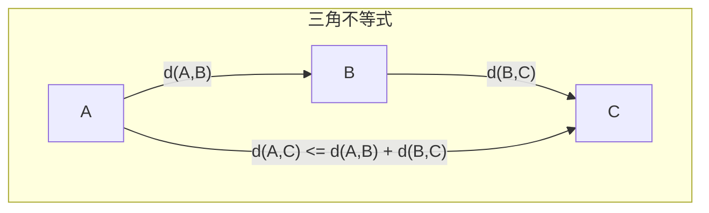
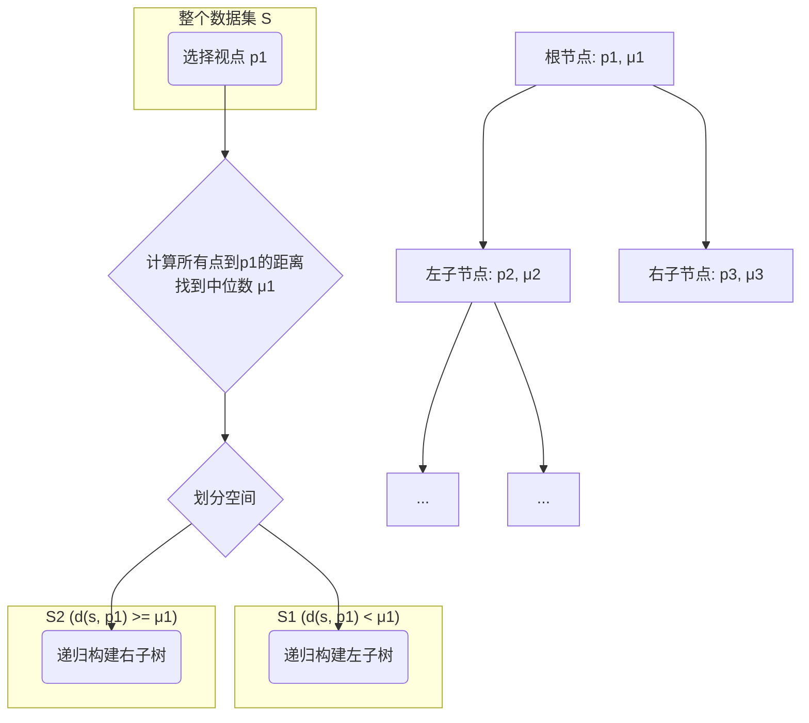
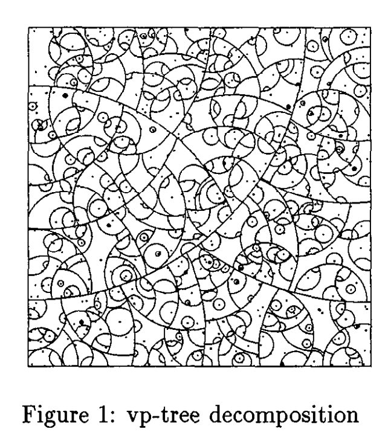
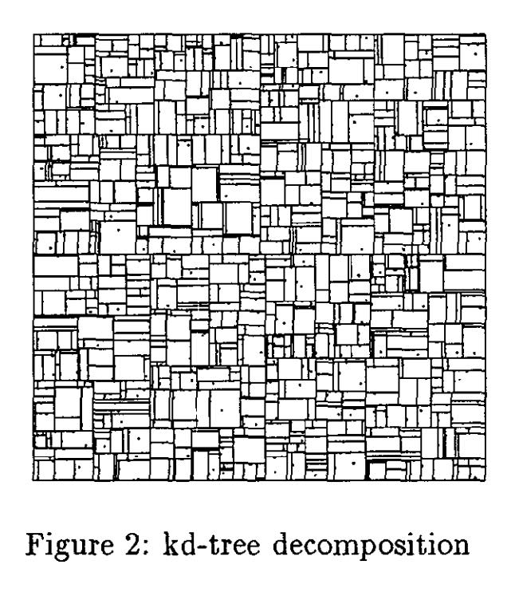
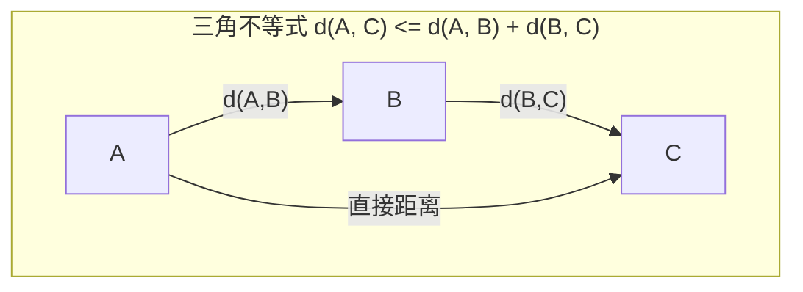
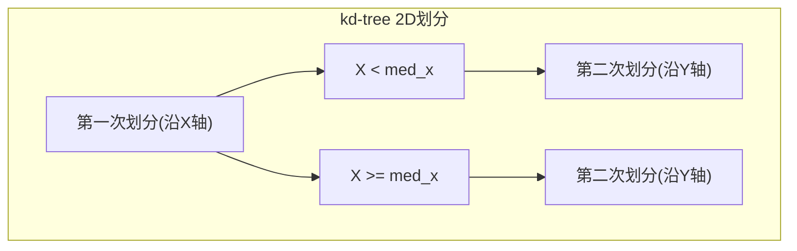

## AI论文解读 | Data Structures and Algorithms for Nearest Neighbor Search in General Metric Spaces 
        
### 作者        
digoal        
        
### 日期        
2025-06-21        
        
### 标签        
PostgreSQL , PolarDB , DuckDB , AI , 论文解读        
        
----        
        
## 背景       
      
http://algorithmics.lsi.upc.edu/docs/practicas/p311-yianilos.pdf        
  
      
提示:        
```        
读懂《Data Structures and Algorithms for Nearest Neighbor Search in General Metric Spaces》这篇论文需要提前掌握哪些基础知识, 请使用中文给我讲一下这些基础知识, 尽量通熟易懂, 可以使用markdown支持的图形增加解释性.        
        
使用中文通熟易懂的解读《Data Structures and Algorithms for Nearest Neighbor Search in General Metric Spaces》这篇论文, 关键内容请深入讲解, 可以使用markdown支持的图形增加解释性.        
        
使用中文提取《Data Structures and Algorithms for Nearest Neighbor Search in General Metric Spaces》论文中一些重要的术语并详细解释, 可以使用markdown支持的图形示增加解释性.        
```        
        
## 1 前置知识 
  
好的，为了更好地理解《通用度量空间中最近邻搜索的数据结构与算法》(Data Structures and Algorithms for Nearest Neighbor Search in General Metric Spaces)这篇论文，你需要掌握一些计算机科学和数学的基础知识。

这篇论文的核心是提出一种名为**Vantage Point Tree (vp-tree, 视点树)** 的数据结构，用于在“通用度量空间”中高效地找到与查询点“最近”的数据点。下面我将为你分解这些前置知识，并用通俗易懂的方式进行解释。

-----

### 核心知识框架

要读懂这篇论文，你的知识储备需要涵盖以下三个方面：

1.  **计算机科学基础**：算法和数据结构的基本概念。
2.  **核心数学概念**：理解论文标题中的“通用度量空间”是什么。
3.  **相关的算法和数据结构**：了解论文中用来作对比的经典方法，如 kd-树。

-----

### 1\. 计算机科学基础 (CS Fundamentals)

这些是理解任何算法论文都必不可少的基础。

#### 1.1 数据结构 (Data Structures)

  * **树 (Tree)**，特别是 **二叉树 (Binary Tree)**

      * **是什么**：一种像树枝一样分叉的数据组织形式。每个节点最多有两个子节点，分别称为左子节点和右子节点。
      * **为什么重要**：论文提出的 **vp-树** 本质上就是一种特殊的二叉树。整个算法的构建和搜索都围绕这棵树展开。

        

    ```mermaid
    graph TD
        A[根节点] --> B[左子节点];
        A --> C[右子节点];
        B --> D[...];
        B --> E[...];
        C --> F[...];
    ```

#### 1.2 算法思想 (Algorithmic Concepts)

  * **递归 (Recursion)**

      * **是什么**：一个函数或过程不断调用自身来解决问题的方法。通常，它会将一个大问题分解为与原问题相似但规模更小的子问题。
      *  **为什么重要**：vp-树的构建过程是典型的递归过程  。从根节点开始，将数据集一分为二，然后对左右两个子集分别递归地构建子树，直到数据集为空。

  * **分治法 (Divide and Conquer)**

      * **是什么**：一种重要的算法设计策略。它包含三个步骤：
        1.  **分解 (Divide)**：将问题分解成若干个与原问题相似的、规模更小的子问题。
        2.  **解决 (Conquer)**：递归地求解这些子问题。
        3.  **合并 (Combine)**：将子问题的解合并成原问题的解。
      *  **为什么重要**：vp-树和kd-树都是分治思想的体现   。vp-树通过选择一个“视点”并将其他点按与视点的距离分为“近”和“远”两部分，从而实现空间的划分  。

  * **算法复杂度分析 (Big O Notation)**

      * **是什么**：一种衡量算法效率的方法，用来描述算法的执行时间或占用空间随数据规模(n)增长的变化趋势。
      * **为什么重要**：论文中用 Big O 来评估其算法的性能。例如：
          *  **$O(n \\log n)$**：构建vp-树的时间复杂度  。这通常被认为是比较高效的构建速度（类似于快速排序）。
          *  **$O(\\log n)$**：理想情况下的搜索时间复杂度  。这意味着即使数据量翻倍，搜索时间也只增加一个固定的量，非常快（类似于二分查找）。

  * **分支界定法 (Branch and Bound)**

      * **是什么**：一种在树状结构中进行优化的搜索策略。在搜索过程中，如果能确定某个分支（子树）不可能包含比当前已找到的最优解更好的解，就直接“剪掉”这个分支，不再进行搜索。
      *  **为什么重要**：vp-树的搜索过程就是一种分支界定搜索   。通过利用“三角不等式”（后面会讲），算法可以判断某个子树中的所有点与查询点的距离必然大于已找到的最近距离，从而安全地跳过对整个子树的搜索，极大地提高了效率  。

-----

### 2\. 核心数学概念 (Key Mathematical Concepts)

这是理解这篇论文**最关键、最独特**的部分。

#### 2.1 度量空间 (Metric Space)

**是什么**：简单来说，一个“度量空间”就是一个集合，并且在这个集合上定义了一种“距离”的计算方式（称为“度量”或`metric`） 。这种距离必须满足三个基本性质：  
  
2\.1\.1\.  **非负性与同一性**：
* 任意两点 A 和 B 的距离 $d(A, B) \\ge 0$。
* $d(A, B) = 0$ 当且仅当 A 和 B是同一个点。
  
2\.1\.2\.  **对称性**：
* 从 A 到 B 的距离等于从 B 到 A 的距离： $d(A, B) = d(B, A)$。
  
2\.1\.3\.  **三角不等式 (Triangle Inequality)**：
* 从点 A 直接到点 C 的距离，永远不会比“先从A到B，再从B到C”的距离更长。即： $d(A, C) \\le d(A, B) + d(B, C)$。
  

  
**为什么重要**：**三角不等式是vp-树能够进行“剪枝”的理论基石**  。整个算法的核心就是巧妙地利用这个性质来排除大量不必要的距离计算。
   
**通用性体现在哪里**：
*  我们熟悉的**欧几里得空间**（比如二维平面上的点，用勾股定理算距离）只是度量空间的一种  。
*  还存在很多**非欧几里得空间**  。例如：
    * **字符串编辑距离**：计算一个单词变成另一个单词需要多少次增、删、改操作。这在拼写检查中很有用。
    * **图像相似度**：论文中提到的，用像素差的平方和来定义两张图片切块的“距离”  。
*  vp-树的强大之处在于，它不关心你如何定义“距离”，只要这个定义满足上述三个条件，它就能工作  。这使得它非常通用。
  
#### 2.2 概率论基础 (Basics of Probability)

  * **是什么**：你需要对概率分布、期望等有基本概念。
  *  **为什么重要**：论文的理论分析部分（第2节）建立在一个概率框架上   。作者假设数据点和查询点都来自某个概率分布  。这么做是为了：
      * **避免个例**：现实世界的数据可能存在极端情况（例如所有点都挤在一起），这会让算法性能变差。概率模型可以分析算法在“平均情况”或“期望”下的表现。
      *  **理论证明**：作者引入了**ZPS (Zero Probability Spheres)** 属性  ——一个理想化的假设，即空间中随机取一个球体，其表面上恰好有数据点的概率为零。这个假设保证了每次划分都能比较均匀地把数据集切开，从而在理论上证明了 $O(\\log n)$ 的期望搜索时间。

-----

### 3\. 相关的算法和数据结构 (Related Algorithms)

了解这些背景可以帮助你理解vp-树的创新点和适用场景。

#### 3.1 kd-树 (kd-tree)

  *  **是什么**：一种在高维欧几里得空间中进行搜索的经典数据结构。它的工作方式是轮流沿着各个坐标轴进行空间划分  。

      * 比如在二维空间，第一次沿着 x 轴切一刀，将点分为左右两部分；第二次在左右两个子空间里，分别沿着 y 轴切一刀，以此类推。PS: PostgreSQL SP-GiST索引就有用kd-tree的实现.  

  * **为什么重要**：

      *  **作为基准**：kd-树是当时（现在也是）最著名的高维搜索数据结构之一。论文作者实现了kd-树，并在相同的实验条件下与vp-树进行了详细的性能对比，以证明vp-树的优势  。
      *  **凸显vp-树的优势**：kd-树强依赖于坐标系，并且在维度非常高时，性能会急剧下降（“维度灾难”）  。而vp-树不依赖坐标，只依赖距离，因此在高维空间和非欧几里得空间中表现更稳健  。

-----

### 总结与学习建议

为了读懂这篇论文，你可以按以下顺序来巩固基础：

| 知识点 | 关键概念 | 在论文中的作用 |
| :--- | :--- | :--- |
| **数据结构** |  二叉树、递归、分治 | vp-树的实现基础和核心思想  。 |
| **算法分析** | Big O表示法、分支界定 |  衡量算法效率，解释搜索过程为何高效  。 |
| **核心数学** | **度量空间**、**三角不等式** |  **论文的理论基石**，使得算法可以“剪枝”并适用于各种距离定义  。 |
| **概率论** | 概率分布、期望 |  用于理论分析，证明算法在平均情况下的高效性  。 |
| **对比算法** | kd-树 |  作为性能比较的基准，凸显vp-树在处理高维和非坐标数据时的优势  。 |

**建议**：在阅读论文前，请务必深刻理解**度量空间**和**三角不等式**。这是解锁这篇论文所有精妙之处的钥匙。一旦你理解了算法如何利用三角不等式来避免不必要的计算，vp-树的整个工作原理就会变得非常清晰。
  
## 2 解读论文 
  
好的，这篇由 Peter N. Yianilos 撰写的论文《通用度量空间中最近邻搜索的数据结构与算法》是一篇在计算机科学领域具有重要影响的经典之作。它提出了一种优雅而高效的解决方案，用于解决一个非常普遍的问题：**如何在海量数据中快速找到离我最近的那个？**

这篇解读将带你深入理解论文的核心思想、技术细节和其重要意义。

### 论文解决了什么核心问题？

 想象一下，你的手机相册里有成千上万张照片，你拍了一张新照片，想在相册里找到和它最像的一张。或者，在一个庞大的商品数据库里，你想为用户推荐和他刚刚浏览过的商品最相似的几款。这些都属于“最近邻搜索”（Nearest Neighbor Search）问题  。

 最直观的办法是“暴力搜索”：把你的新照片和相册里的每一张都比对一遍，计算相似度，然后找出最像的那个   。当数据量很小时，这没问题。但当数据量达到百万、千万甚至更多时，这种方法的计算量将变得无法接受  。

 更复杂的是，很多时候我们衡量“距离”或“相似度”的方式非常抽象，并非简单的欧几里得直线距离  。比如：

  *  **字符串距离**：单词 "apple" 和 "apply" 的“距离”可能被定义为需要修改几个字母才能互相转换  。
  *  **图像距离**：两张图片的“距离”可能是它们所有像素点颜色差异的总和  。

 这些场景都属于**通用度量空间（General Metric Space）**——一个只定义了“距离”概念的抽象数学空间   。论文的目标，就是为这种通用、抽象的空间提供一种快速的搜索算法，其效率要远超暴力搜索，最好能达到像“二分查找”那样的对数级（ $O(\\log n)$ ）效率  。

### 核心解决方案：视点树 (Vantage Point Tree, vp-tree)

 为了解决上述问题，论文提出了核心数据结构——**视点树 (vp-tree)**  。它是一种基于“分治”思想的二叉树，巧妙地利用了度量空间的一个基本性质——**三角不等式**——来实现高效搜索。

#### 1\. vp-树是如何构建的？(Construction)

vp-树的构建过程是一个优美的递归过程，其核心思想是“从某个点的视角来划分整个宇宙”。

1.   **选择一个视点 (Vantage Point)**：从当前数据点集中随机或通过某种策略选择一个点 `p` 作为“视点”  。这个点将成为当前树节点的代表。
2.   **计算距离并找到中位数**：计算数据集中所有其他点到视点 `p` 的距离。然后，找到这些距离的**中位数 `μ`**  。这个中位数 `μ` 就像一个半径，以视点 `p` 为中心画一个球体（或超球体）。
3.   **划分空间**：根据中位数距离 `μ`，将所有其他点分为两组  ：
      * **内部 (Inside)**：所有到 `p` 的距离 **小于** `μ` 的点。这些点将构成左子树。
      * **外部 (Outside)**：所有到 `p` 的距离 **大于或等于** `μ` 的点。这些点将构成右子树。
4.   **递归构建**：对“内部”和“外部”这两个子集，递归地重复以上三个步骤，直到数据子集为空  。

通过这个过程，我们就构建了一棵二叉树。树的每个节点都包含一个视点 `p` 和一个中位数距离 `μ`，它将自己的“管辖范围”一分为二。



*图1：vp-树的递归构建过程*
  
  
#### 2\. vp-树如何实现高效搜索？ (Search)

这部分是vp-树的精髓所在，它巧妙地利用**三角不等式**来“剪枝”，避免了大量不必要的计算。

**搜索过程如下：**

 假设我们要搜索查询点 `q` 的最近邻。我们维护一个当前找到的最近距离 `τ` (tau)，初始时 `τ` 为无穷大  。

1.   从树的根节点开始，计算查询点 `q` 与当前节点视点 `p` 的距离 `d(q, p)`  。

2.   如果 `d(q, p)` 小于当前的 `τ`，说明我们找到了一个更近的点。我们更新最近邻为 `p`，并把 `τ` 缩小为 `d(q, p)`  。

3.  **关键的剪枝步骤**：现在我们需要决定是否要搜索左右子树。

      * 我们已经知道查询点 `q` 到视点 `p` 的距离 `d(q, p)`。
      * 我们也知道这个节点划分空间的半径是 `μ`。
      * **剪枝判断**：如果 `q` 和以 `p` 为圆心、`μ` 为半径的“边界球”的距离 **大于** 我们已经找到的最近距离 `τ`，那么其中一个子树就可以被完全忽略！

    让我们用图来解释：

    *图2：vp-树搜索剪枝原理*  
   
  
      *  **情况A（剪掉右子树）**：如图所示，查询点 `q` 在“球内”。我们已经找到的最近邻的搜索范围（以 `q` 为圆心，`τ` 为半径的虚线圆）完全没有和“球外”区域（灰色区域，即右子树的范围）相交。这意味着右子树里**不可能**有比当前 `τ` 更近的点。因此，我们无需搜索右子树  。
      *  **情况B（剪掉左子树）**：同理，如果 `q` 在“球外”，且其搜索范围 `τ` 没有和“球内”区域相交，我们就可以剪掉左子树  。
      * **情况C（无法剪枝）**：如果 `q` 的搜索范围 `τ` 同时与“球内”和“球外”区域相交，那么我们必须两个子树都进行搜索。

4.   如果需要搜索子树，算法会优先进入更有可能包含最近邻的那个子树（比如，如果 `d(q, p) < μ`，则优先搜索左子树），然后根据剪枝判断决定是否需要搜索另一个  。

5.  这个过程递归地进行下去，直到搜索结束。

通过不断缩小 `τ` 并利用三角不等式剪枝，vp-树避免了对数据集中大部分点的距离计算，从而实现了远超暴力搜索的效率。

### 实验结果与对比

论文通过一系列实验来验证vp-树的性能，并与当时最先进的 **kd-树** 进行了对比。

  *  **在标准欧氏空间中**：当数据维度不高时（例如2到14维），vp-tree的性能与经过优化的kd-tree不相上下，表现非常出色  。
  * **在高维和嵌入式空间中（vp-树的核心优势）**：
      *  实验模拟了一种常见情况：数据本身是低维的（比如一个二维平面），但被嵌入到了一个非常高维的空间中（如10维甚至50维空间） 。
      *  在这种情况下，kd-树的性能急剧恶化，因为它被高维坐标系“迷惑”了，几乎要搜索所有节点  。
      *  而 **vp-树的性能下降得则平缓得多**   。因为它不依赖坐标，只关心点之间的内在距离，所以能更好地适应数据的“内在维度”  。
  * **在真实世界问题中（图像检索）**：
      *  论文将该方法应用于一个极具挑战性的高维问题：从数百万个图像切块中找到与给定切块最相似的一个   。这里的维度高达 $50 \\times 50 = 2500$ 维  。
      *  结果表明，vp-树在这种极端高维的真实场景下依然有效。虽然为了确保找到真正的最近邻仍需访问5%到15%的节点，但这已经比暴力搜索好了几个数量级，并且远非kd-tree能及  。
  
   
   
  

### 结论与意义

这篇论文的贡献是深远的：

1.   **通用性**：它提出了一种不依赖于坐标系，仅依赖于距离度量本身的数据结构   。这意味着无论你是处理文本、图像、基因序列还是任何可以定义“距离”的抽象数据，vp-树都能适用  。
2.  **对高维数据的鲁棒性**：它为解决“维度灾难”问题提供了一个有效途径，尤其是在数据内在维度低于其表示维度的情况下。
3.   **理论与实践的结合**：论文不仅给出了清晰的算法和数据结构   ，还提供了坚实的理论基础（概率分析）   和详尽的实验验证  ，是一篇非常完整的学术著作。

总而言之，Yianilos的vp-树就像是多维和抽象空间中的“二分查找”。它通过“从某个点的视角看世界”这一简单而深刻的洞察，并借助三角不等式的力量，将一个看似复杂无比的搜索问题分解、简化，最终实现了高效求解。
  
## 3 术语  
  
好的，这篇论文引入并使用了许多重要的术语来构建其理论和算法。以下是一些关键术语的提取与详细解释，均基于论文内容。

-----

### 1\. 度量空间 (Metric Space)

这是理解整篇论文的基石。

  *  **定义**：一个度量空间由两部分组成：一个对象的集合 (S) 和一个定义在集合上任意两个对象之间的“距离”函数 (d)  。这个距离函数（或称“度量”）必须满足三个严格的数学条件。

  * **关键性质**：

    1.  **非负性与同一性**：任意两点 `a` 和 `b` 的距离 $d(a,b) \\ge 0$。距离为0当且仅当`a`和`b`是同一个点。
    2.   **对称性**：从`a`到`b`的距离等于从`b`到`a`的距离，即 $d(a,b) = d(b,a)$  。
    3.   **三角不等式 (Triangle Inequality)**：对于任意三点 `a`, `b`, `c`，从`a`直接到`b`的距离，永远不会长于先从`a`到`c`再从`c`到`b`的路径之和，即 $d(a,b) \\le d(a,c) + d(c,b)$  。

  *  **重要性**：论文提出的vp-tree算法不依赖于坐标等具体表示，它唯一依赖的信息就是这个距离函数 `d` 以及它所满足的三角不等式   。这使得该算法非常通用，能应用于欧几里得空间、字符串差异、图像相似度等任何可以定义有效距离的场景  。

  



### 2\. 最近邻搜索 (Nearest Neighbor Search)

  *  **定义**：给定一个固定的数据集（称为数据库 `S_D`）和一个新的查询点 `q`，最近邻搜索的目标是在数据库 `S_D` 中找到一个与 `q` 距离最小的元素  。
  *  **简单方法**：最直接的方法是遍历数据库中的每一个元素，计算它与查询点 `q` 的距离，然后找到最小值  。但这种方法在数据量大时效率极低。
  *  **目标**：论文的目标是像二分查找一样，通过对数据进行预处理（构建vp-tree），使得查询时间能从线性级（ $O(n)$ ）降低到对数级（ $O(\\log n)$ ） 。

### 3\. 视点树 (Vantage Point Tree / vp-tree)

 这是论文提出的核心数据结构  。

  *  **定义**：一种二叉树，用于在通用度量空间中组织数据以加速最近邻搜索   。它也被称为“up-tree”  。
  * **构建原理**：vp-tree采用分治策略递归地划分空间。在每个节点，它会：
    1.   选择一个“视点” (vantage point) `p`  。
    2.   计算数据集中所有其他点到 `p` 的距离，并找到这些距离的中位数 `μ`  。
    3.   根据 `μ` 将空间划分为两部分：距离 `p` 小于 `μ` 的点（左子树/内部空间）和距离 `p` 大于等于 `μ` 的点（右子树/外部空间） 。
  * **结构图示**：
    ```mermaid
    graph TD
        A[根节点<br>视点: p1<br>中位距离: μ1]
        A --> B["左子树<br>d(x, p1) < μ1"]
        A --> C["右子树<br>d(x, p1) >= μ1"]
        B --> D[视点: p2, μ2]
        C --> E[视点: p3, μ3]
        D --> F[...]
        D --> G[...]
    ```

### 4\. 分支界定法 (Branch and Bound)

  *  **定义**：一种在树结构中进行智能搜索的算法策略  。它的核心是在搜索过程中，通过评估一个分支（子树）的“界限”，来判断这个分支内是否可能包含比当前已找到的最优解更好的解。
  *  **在vp-tree中的应用**：vp-tree的搜索算法是一种递归的分支界定搜索   。当搜索到一个节点时，它利用三角不等式来计算查询点 `q` 与子空间边界的最小可能距离。如果这个最小距离已经大于当前找到的最近邻距离 `τ`，那么整个子树就可以被安全地“剪枝”（pruned），无需进一步探索  。这极大地减少了需要计算距离的点的数量。

### 5\. kd-树 (kd-tree)

  *  **定义**：一种在多维欧几里得空间中进行搜索的经典数据结构，论文用它作为性能对比的基准  。
  *  **工作原理**：kd-tree同样采用分治法，但它的划分方式是沿着坐标轴进行的   。它轮流选择一个坐标维度，并根据该维度上的值的中位数，用一个与该轴垂直的超平面将空间一分为二  。
  * **局限性**：
      *  它严重依赖坐标系，不适用于无法方便地用坐标表示的通用度量空间  。
      *  在维度非常高时，其性能会急剧下降，搜索时几乎需要访问树中的每一个节点，失去了优势  。

  



### 6\. 零概率球面属性 (ZPS - Zero Probability Spheres Property)

  *  **定义**：这是论文在进行理论分析时引入的一个理想化假设   。它指的是，在一个度量空间中，任意一个球体的“表面”（即与球心距离正好等于半径`r`的所有点的集合）包含数据点的概率为零  。
  *  **作用**：这个假设简化了理论证明。它保证了当用中位数距离 `μ` 来划分空间时，几乎不会有大量的点恰好落在距离等于 `μ` 的分界线上   。这使得每次划分都能将数据集比较均匀地分成两半，从而保证了vp-tree的平衡性，并最终在理论上得出了 $O(\\log n)$ 的期望搜索时间  。
  
## 参考        
         
http://algorithmics.lsi.upc.edu/docs/practicas/p311-yianilos.pdf  
        
        
<b> 以上内容基于DeepSeek、Qwen、Gemini及诸多AI生成, 轻微人工调整, 感谢杭州深度求索人工智能、阿里云、Google等公司. </b>        
        
<b> AI 生成的内容请自行辨别正确性, 当然也多了些许踩坑的乐趣, 毕竟冒险是每个男人的天性.  </b>        
  
  
#### [期望 PostgreSQL|开源PolarDB 增加什么功能?](https://github.com/digoal/blog/issues/76 "269ac3d1c492e938c0191101c7238216")
  
  
#### [PolarDB 开源数据库](https://openpolardb.com/home "57258f76c37864c6e6d23383d05714ea")
  
  
#### [PolarDB 学习图谱](https://www.aliyun.com/database/openpolardb/activity "8642f60e04ed0c814bf9cb9677976bd4")
  
  
#### [PostgreSQL 解决方案集合](../201706/20170601_02.md "40cff096e9ed7122c512b35d8561d9c8")
  
  
#### [德哥 / digoal's Github - 公益是一辈子的事.](https://github.com/digoal/blog/blob/master/README.md "22709685feb7cab07d30f30387f0a9ae")
  
  
#### [About 德哥](https://github.com/digoal/blog/blob/master/me/readme.md "a37735981e7704886ffd590565582dd0")
  
  

  
