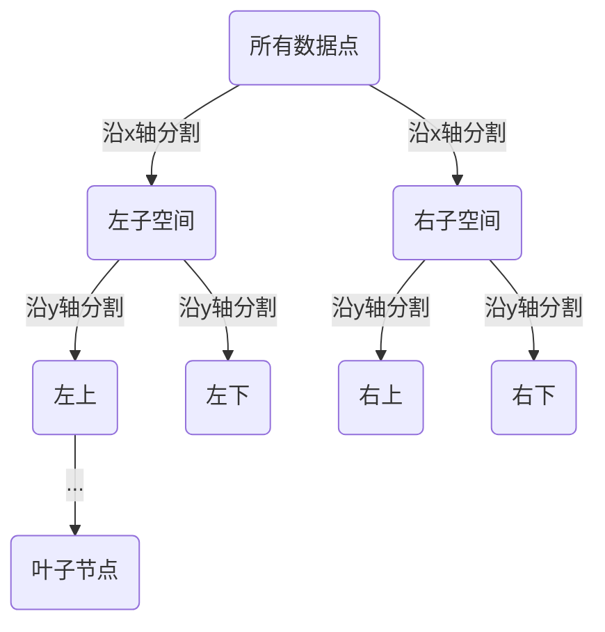
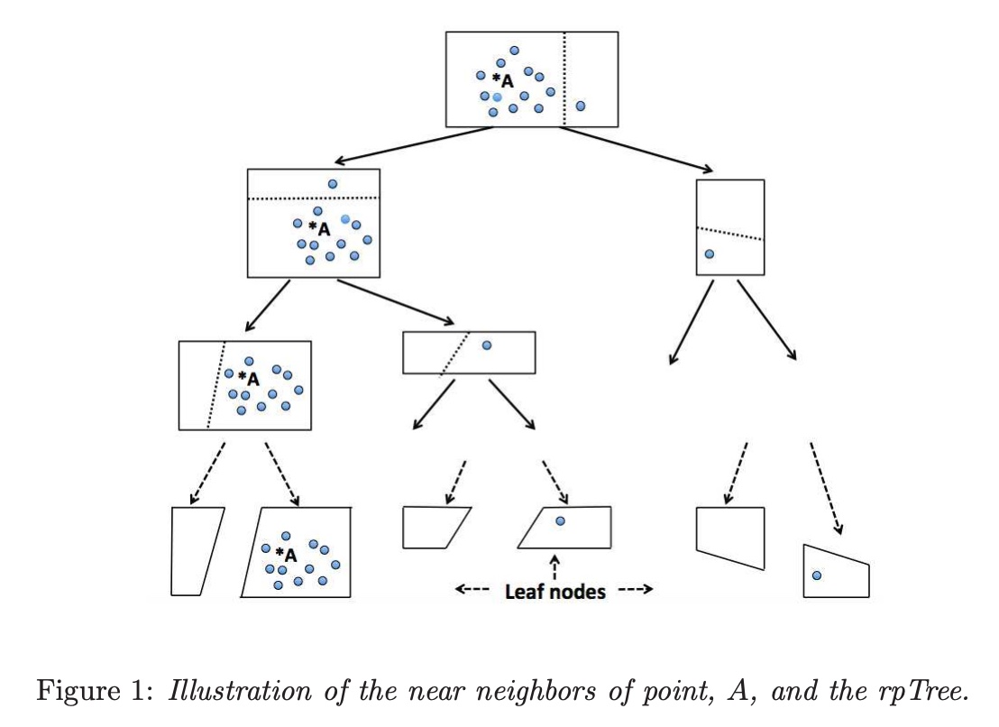
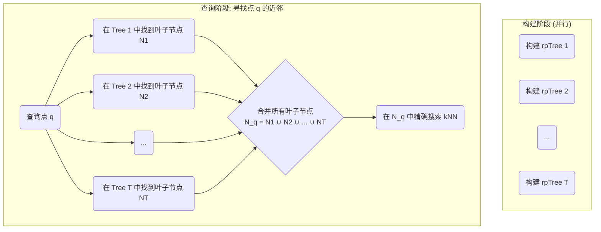

## AI论文解读 | K-nearest Neighbor Search by Random Projection Forests
        
### 作者        
digoal        
        
### 日期        
2025-06-21        
        
### 标签        
PostgreSQL , PolarDB , DuckDB , AI , 论文解读        
        
----        
        
## 背景       
      
https://arxiv.org/pdf/1812.11689v1        
  
      
提示:        
```        
读懂《K-nearest Neighbor Search by Random Projection Forests》这篇论文需要提前掌握哪些基础知识, 请使用中文给我讲一下这些基础知识, 尽量通熟易懂, 可以使用markdown支持的图形增加解释性.        
        
使用中文通熟易懂的解读《K-nearest Neighbor Search by Random Projection Forests》这篇论文, 关键内容请深入讲解, 可以使用markdown支持的图形增加解释性.        
        
使用中文提取《K-nearest Neighbor Search by Random Projection Forests》论文中一些重要的术语并详细解释, 可以使用markdown支持的图形示增加解释性.        
```        
        
## 1 前置知识 
  
好的, 为了帮助您理解《K-nearest Neighbor Search by Random Projection Forests》这篇论文, 我将为您梳理阅读该论文所需的核心基础知识. 我会用通俗易懂的语言, 结合图示和比喻来解释这些概念.

-----

### 理解论文所需的基础知识地图

要读懂这篇论文, 您需要先掌握以下几个关键领域的知识. 它们就像一块块拼图, 组合起来就能清晰地展现出论文的全貌.

1.  **核心问题**: K-近邻 (kNN) 搜索是什么？为什么它很重要但又很困难？
2.  **经典解决方案**: 什么是树状数据结构？它如何加速搜索 (例如 kd-树)？
3.  **论文的关键创新点**:
      * **随机投影 (Random Projection)**: 这是 "rpForests" 中 "rp" 的来源.
      * **集成方法 (Ensemble Method)**: 这是 "rpForests" 中 "Forests" 的来源.
4.  **性能评估**: 如何衡量一个算法的好坏 (例如 "大O表示法")？

下面我们来逐一讲解这些基础知识.

### 1\. 核心问题: K-近邻 (kNN) 搜索

**(1) 是什么？**

 K-近邻 (k-Nearest Neighbor, kNN) 搜索是数据科学中最基本的问题之一 . 想象一下, 在一个布满了很多人的大广场上, 给你一个新人 A, 让你找到离他最近的 `k` 个人. 这就是 kNN 搜索.

  * **k 是一个数字**: 如果 `k=1`, 就是找离 A 最近的 1 个人. 如果 `k=5`, 就是找离 A 最近的 5 个人.
  * **"近"由距离定义**: 这个 "距离" 可以是现实中的物理距离, 也可以是更抽象的 "相似度" (比如, 在推荐系统中, 两个用户购买的商品越相似, 他们的 "距离" 就越近).

**(2) 为什么困难: "维度灾难" (Curse of Dimensionality)**

在只有二维 (x, y 坐标) 的广场上找人似乎不难. 最笨的方法就是让新人 A 和广场上所有人一一计算距离, 然后排序, 找到最近的 `k` 个. 这叫**暴力搜索 (Brute-force Search)**.

但如果数据不是二维, 而是成百上千维呢？比如, 描述一个用户的数据可能包含: 年龄, 性别, 浏览过的上千种商品, 每种商品的停留时间等等. 这就构成了一个几千维的空间.

在高维空间里, 我们的直觉会失灵, 并且会发生几件可怕的事情:

  * **数据点极其稀疏**: 想象一下, 即使有海量的数据点, 撒在一个高维空间里, 它们彼此之间的距离也会变得非常遥远, 就像沙漠里的沙子.
  * **距离失去意义**: 所有点到目标点的距离都变得差不多远, "最近" 和 "较远" 的差异不再明显.
  * **计算量爆炸**: 暴力搜索的计算量会随着维度和数据量的增加而急剧增长, 变得不切实际.

 这篇论文的核心动机之一, 就是要提出一种**在高维度下依然能快速且准确**地进行 kNN 搜索的算法 .

### 2\. 经典解决方案: 树状数据结构 (以 kd-树为例)

为了避免和每个人都计算距离, 前人发明了 "分而治之" 的策略, 其中最经典的就是**kd-树 (k-dimensional tree)**.

 kd-树是一种**空间划分树 (Space-partitioning tree)** . 它的核心思想是不断地用超平面把空间一分为二, 直到每个小空间里的数据点足够少.

**工作原理 (以二维空间为例):**

想象一下我们用一把刀, 不断地切割一块蛋糕.

1.  **第一次切割**: 沿着 **x轴** 找到所有点的中位数, 从这个位置竖着切一刀. 左边的点归左边, 右边的点归右边.
2.  **第二次切割**: 对左右两个子区域, 这次沿着 **y轴** 找到各自的中位数, 横着切一刀.
3.  **循环往复**: 不断地在 x, y, x, y... 轴之间切换, 持续切割, 直到每个小区域的点都很少.




 **优点**: 查找时, 我只需要沿着树的路径往下走, 就能快速定位到一个小区域, 大大减少了需要比较的点的数量 .
**缺点 (论文指出的问题)**: 这种沿着坐标轴切割的方式非常僵硬.  如果两个很近的点恰好被分割线分开了, 那么在后续的搜索中, 其中一个点可能就永远找不到了 . 这就是 "边界问题".

### 3\. 论文的关键创新点

这篇论文提出的 **rpForests** 正是为了解决传统方法的这些弊端. 它融合了两个强大的思想.

**(1) 随机投影 (Random Projection, rp)**

这是 **rpTree** 的核心.  与 kd-树呆板地沿着坐标轴切割不同, rpTree 每次选择一个**完全随机的方向**来切割空间 .

  * **比喻**: 想象一下, kd-树的切割刀只能横着或竖着切. 而 rpTree 的切割刀可以从任意一个随机的角度下刀.
  * **做法**:
    1.   随机生成一个方向 (一个向量 $\\vec{r}$) .
    2.   把当前区域内所有的点都**投影**到这个方向上, 得到一维坐标 . 就像用一束光从这个随机方向照过来, 看所有点在墙上的影子.
    3.   在这些影子里随机选一个分割点, 把数据分成两部分 .
  *  **优点**: 这种随机的切割方式更加灵活, 更能适应数据本身的几何形状 , 减少了 "边界问题" 发生的概率.

**(2) 集成方法 (Ensemble Method) - 森林的力量**

这是 "rpForests" 中 **Forests** 的核心. 单个 rpTree 虽然比 kd-树好, 但由于其随机性, 单独一棵树也可能犯错. 怎么办呢？答案是: **人多力量大 (三个臭皮匠, 顶个诸葛亮)**.

  *  **核心思想**: 构建很多棵**不同**的 rpTree, 形成一片 "森林" . 每一棵树都是一个 "专家", 它们从不同的随机角度 (不同的随机投影) 去理解数据.

  * **如何工作**:

    1.   **构建 (Training)**: 独立地构建 `T` 棵 rpTree, 每棵树的构建过程都充满了随机性 (随机选择投影方向等) .
    2.  **查询 (Query)**: 当要为一个点 `q` 找 kNN 时:
          *  让 `q` 依次穿过森林里的每一棵树, 找到它在每棵树中最终落入的那个**叶子节点** .
          *  把这 `T` 个叶子节点里的**所有点**合并起来, 形成一个候选邻居集合 .
          *  最后, 只在这个较小的候选集合里进行暴力搜索, 计算精确距离, 找出最终的 k 个近邻 .

  *  **为什么有效**: 两个真正相邻的点, 可能会在某一棵树中被不幸分开, 但在其他很多树中, 它们大概率会落在同一个叶子节点里 .  通过汇总所有树的结果, 就能极大地降低 "错失" 真正邻居的概率, 从而获得非常高的准确率 .

### 4\. 性能评估: 大O表示法 (Big O Notation)

论文中会用 $O(n\\log(n))$ 这样的符号来描述算法的效率. 这是一种评估**计算复杂度**的方式, 告诉你当数据量 `n` 增长时, 算法的运行时间会如何增长.

  * $O(n^2)$: **很慢**. 对应暴力搜索. 数据量翻倍, 时间变成 4 倍.
  * $O(n\\log(n))$: **很快**.  对应这篇论文中构建树的时间 . 数据量翻倍, 时间只是略微增加超过两倍.
  * $O(\\log(n))$: **极快**.  对应在单棵树里搜索的时间 . 即使数据量从百万增加到十亿, 搜索时间也只是增加一点点.

rpForests 算法的优势在于, 构建森林的过程可以**并行化**处理.  因为每棵树的生长是独立的, 你可以把任务分配给多个 CPU 核心同时进行, 从而大大缩短总时间 .

### 总结

现在, 让我们把所有知识串起来, 形成对这篇论文的整体理解:

1.  **目标**: 解决高维空间下的 kNN 搜索问题, 追求**快**和**准**.
2.  **方法**: 提出 **rpForests** 算法.
3.  **核心组件**:
      *  它不是用一棵树, 而是用一片**森林 (Forests)**, 这是一种**集成思想**, 用群体的智慧弥补个体的不足 .
      *  森林里的每一棵树 (rpTree) 都不是像传统 kd-树那样呆板地切割空间, 而是通过**随机投影 (Random Projection)** 来进行灵活、自适应的划分 .
4.   **工作流程**: 通过建立一片随机投影树森林, 在查询时汇总所有树给出的 "候选邻居", 然后在小范围里精确查找, 最终实现可扩展、可并行、高精度的 kNN 搜索 .

掌握了这些背景知识, 您在阅读论文原文时, 就能更好地理解作者为什么这么做, 以及这个方法的技术优势在哪里了.
  
## 2 解读论文 
  
好的, 这是一份对研究论文《K-nearest Neighbor Search by Random Projection Forests》的通俗易懂的中文解读. 我将结合论文原文, 深入讲解其关键内容, 并使用图示进行辅助说明.

### **论文概述: 更快、更准、更智能地寻找 "近邻"**

 在高维数据(例如图像特征、用户画像)中, 如何快速且准确地找到任何一个数据点的 K 个最近邻 (kNN) 是一个经典难题 .  许多现有算法为了追求速度而牺牲了准确性 .  这篇论文则提出了一种名为 **随机投影森林 (rpForests)** 的新算法, 旨在实现高准确率和高效率的 kNN 搜索 .

rpForests 的核心思想是, 结合了两种强大的技术:

1.   **随机投影树 (rpTree)**: 一种灵活的、能适应数据几何形状的树形结构 .
2.   **集成学习 (Ensemble)**: "三个臭皮匠顶个诸葛亮" 的思想, 将许多棵树组成一片 "森林", 以集体的智慧克服单棵树的弱点 .

-----

### **核心痛点: 单棵树的 "边界问题"**

为了理解 rpForests 的精妙之处, 我们必须先了解它要解决的问题.  传统的树方法 (如 kd-树) 在划分数据空间时, 容易产生 "边界问题" .

想象一下, 点 A 和它的一个近邻点 B 非常接近.  但在构建树的过程中, 一次不巧的分割, 恰好将 A 和 B 分到了两个不同的子区域(叶子节点)中 .  当我们为 A 寻找近邻时, 搜索被限制在 A 所在的叶子节点里, 从而永远地 "错过" 了本应找到的点 B .

 如下图所示, 在树的生长过程中, 点 A 的一些近邻(蓝色点)被一次次分割出去, 最终只有部分近邻和 A 留在了同一个叶子节点里 .

 *图解: 点 A 的近邻在单棵树的构建中被分割到不同叶子节点*
  
  
  
rpForests 的设计正是为了系统性地解决这个 "错失近邻" 的问题.
  
-----

疑问: rpforests是由多颗rptree构成的, 解决单棵树的 "边界问题". 那是不是意味着同一份数据要被多次切割, 重复存储

是的，根据论文《K-nearest Neighbor Search by Random Projection Forests》的描述，rpForests确实是由多棵rpTree构成的 。这意味着同一份数据会“被多次切割”。

至于“重复存储”，这取决于具体的实现方式。在构建rpForests时，每一棵rpTree都会独立地对数据进行处理和分裂 。从概念上讲，这意味着数据会被多棵树“看到”并进行结构化。

在实际实现中，通常不会物理性地将原始数据重复存储多份。更常见的做法是：

* **引用或指针**: 每棵rpTree在构建时，会操作数据的引用或指针，而不是创建数据的完整副本。这样可以避免大量的数据复制和存储冗余。
* **空间划分信息存储**: 每棵rpTree主要存储的是数据空间的划分信息（即每个节点的分裂方向和分裂点）以及每个叶节点包含哪些数据点的索引或引用 。
* **共享原始数据**: 原始数据集通常只存储一份。当进行kNN搜索时，查询点会通过rpForests中的每棵rpTree进行遍历，并找到其在每棵树中的叶节点。最终，这些叶节点中的数据点会合并成一个“合并邻居集”进行距离计算，以找到kNN 。

因此，虽然数据在逻辑上被多棵树“切割”和处理，但通过智能的实现方式，可以避免显著的物理重复存储，从而控制内存消耗。论文也强调了rpForests的计算效率和可伸缩性，如果存在大量的重复存储，这些优势将难以实现 。

-----

### **rpForests 算法深度解析**

rpForests 的工作流程分为两大部分: **构建森林** 和 **查询近邻**.

#### **第一部分: 构建单棵随机投影树 (rpTree)**

rpForests 的基本单元是 **rpTree**.  它通过一种更智能的随机方式来递归地分割数据空间 .

**1. 如何分割 (The Split):**
 与 kd-tree 只能沿着坐标轴分割不同, rpTree 选择一个**随机方向** $\\vec{r}$ 来进行分割 .

  *  **投影**: 将当前节点(一个数据子集 W)中的所有点 $x$ 都投影到这个随机方向 $\\vec{r}$ 上 .  投影后的值可以理解为每个点在这个方向上的 "影子" 位置, 其值为 $r \\cdot x$ .
  *  **选择分割点**: 在所有 "影子" 构成的范围 [min, max] 内, 随机选择一个分割点 c .
  *  **生成子节点**: 根据投影值与 c 的大小关系, 将数据点分为左右两个子节点 $W\_{L}$ 和 $W\_{R}$ .

**2. 关键创新: 如何选择 "最佳" 随机方向?**
简单的随机可能不是最高效的.  论文提出了一个重要的改进: 与其随便用一个随机方向, 不如多试几个, 然后选一个最好的 .

  *  **"好" 的标准**: 一个 "好" 的分割方向, 应该能让数据点投影后的 "影子" **拉得最开**, 也就是方差 (variance) 或标准差 (standard deviation) 最大 .
  * **算法 (Algorithm 2)**:
    1.   生成 `nTry` 个候选的随机方向 .
    2.   对每个方向, 计算数据投影后的标准差 .
    3.   选择那个让标准差最大的方向作为最终的分割方向 .

 这个改进的意义在于, 它引导树沿着数据本身 "伸展" 得最开的方向进行分割, 有效避免了产生又长又窄的 "薄片" 式分割, 这种薄片式分割极易错失近邻 .  这是对传统随机树方法的一大贡献, 因为传统方法只关心分割*点*的选择, 而 rpForests 则优化了分割*方向*的选择 .

#### **第二部分: 集成森林 (Ensemble) 并查询**

 单棵 rpTree 仍可能犯错, 但一片森林的力量则非常强大 .

**1. 构建森林:**
 算法会独立地构建 `T` 棵 rpTree .  由于每棵树在构建时选择的随机方向都不同, 因此这 `T` 棵树是形态各异的 .

**2. 查询 kNN (Algorithm 3):**
这是 rpForests 的精髓所在. 当要为一个查询点 `q` 寻找 kNN 时:

1.   **并行穿透**: 让 `q` 同时在森林中的 `T` 棵树里 "下落", 分别找到它在每棵树中所对应的叶子节点 $N^i$ .
2.   **合并候选集**: 将这 `T` 个叶子节点中的**所有**数据点全部汇集起来, 形成一个统一的、更大的 "候选邻居集合" $N\_q = \\bigcup\_{i=1}^{T}N^{i}$ .
3.   **精确查找**: 在这个小得多的候选集 $N\_q$ 内部, 进行精确的距离计算, 从而找到最终的 K 个最近邻 .




这个机制完美地解决了 "边界问题". 一个近邻点即使在某几棵树中被不幸分开了, 但在其他大多数树中, 它们极有可能落在同一个叶子节点里.  通过合并所有叶子节点, 就能把这些被 "错杀" 的近邻重新找回来 .

-----

### **理论支撑与实验结果**

#### **理论**

论文从理论上证明了这种方法的有效性.  关键结论是: 两个相邻点被整个森林分离的概率, 会随着森林中树的数量 `T` 的增加而**指数级下降** .  这意味着只要森林规模适中 (例如 20-40 棵树), 算法的准确率就能快速趋近于 100% .

#### **实验**

 论文在多种真实数据集上进行了验证, 数据维度从 19 到超过 10000 .

  *  **高准确率**: 实验结果表明, 随着树数量的增加, "近邻丢失率" 和 "近邻距离误差" 都迅速下降, 大约在 20-40 棵树时就趋近于零, 这与理论预测完全一致 .
  *  **高效率**: rpForests 的运行时间具有竞争力, 尤其是其天生的并行性, 使它在多核处理器上表现优异 .  运行时间几乎与核心数成反比, 展现了极强的可扩展性 .

-----

### **总结与贡献**

《K-nearest Neighbor Search by Random Projection Forests》这篇论文的主要贡献可以概括为:

1.   **提出 rpForests 算法**: 一种简单、可扩展、高精度且能自适应数据几何形态的 kNN 搜索算法 .
2.   **优化分割方向**: 创新性地提出通过比较多个随机投影的方差来选择 "最佳" 分割*方向*, 而不仅仅是选择分割*点*, 这被实验证明是非常有效的策略 .
3.   **强大的集成机制**: 利用森林的集成思想, 有效克服了单棵树的 "边界问题", 大幅提升了搜索的准确率 .
4.   **理论与实践统一**: 提供了严谨的理论分析来解释算法为何有效, 并通过在各种数据集上的大量实验验证了理论的正确性 .

总而言之, rpForests 通过巧妙地结合随机投影的灵活性和集成学习的鲁棒性, 为高维数据 kNN 搜索问题提供了一个优雅且强大的解决方案.
  
## 3 术语  
  
以下是论文《K-nearest Neighbor Search by Random Projection Forests》中一些重要术语的详细解释：

###  1. K-nearest neighbor (kNN) search (K近邻搜索)  

*  **定义**: K近邻搜索是指在一个数据集中，找到距离给定数据点最近的K个点的问题。  
*  **应用**: 广泛应用于数据挖掘、机器学习、统计学和许多应用领域，例如数据挖掘中的相似性搜索   、机器学习中的快速核方法   、统计学中的非参数密度估计和内在维度估计   ，以及异常检测算法  。

###  2. Random Projection Forests (rpForests) (随机投影森林)  

*  **定义**: rpForests 是一种用于 kNN 搜索的方法，它通过聚合随机投影树（rpTrees）集合的结果来查找 kNN。    每棵树都是通过一系列精心选择的随机投影递归构建的。  
* **特点**:
    *  **高准确性**: 在 kNN 缺失率和 kNN 距离差异方面表现出显著的准确性。  
    *  **低计算复杂度**: 具有非常低的计算复杂度。  
    *  **并行化**: 其集合性质使其易于在多核或集群计算机上并行运行，运行时间预计与核或机器数量成反比。  
    *  **理论支撑**: 理论上证明了当集合大小增加时，相邻点被集合随机投影树分离的概率呈指数衰减。  
    *  **灵活性和可伸缩性**: 具有基于树的方法的灵活性和集成方法的强大功能，实现简单，高度可伸缩，并且易于适应数据的几何形状。  

###  3. Random Projection Tree (rpTree) (随机投影树)  

*  **定义**: rpForests 的构建块   ，是流行的 kd 树的随机版本。  
* **构建过程**:
    1.   从整个数据集作为树的根节点开始。  
    2.   根据分裂规则将根节点分裂成两个子节点。  
    3.   对每个子节点递归应用相同的过程，直到满足停止条件（例如，节点变得太小，即包含太少的数据点）。  
    4.   节点的分裂沿着随机生成的方向进行。  
    5.   选择分裂点的一种方法是：在所有点投影到随机方向上形成的区间内均匀随机选择一个点作为分裂点   ，然后将节点分成左右两个子节点。    另一种流行的方法是选择投影系数的中位数作为分裂点。  
*  **优点**: 相比传统树方法（如 kd 树），rpTree 能够适应数据的几何形状，并轻松克服维度诅咒。  
*  **计算复杂度**: 针对 $n$ 个数据点的树生长预期计算复杂度为 $O(n \log(n))$   ，搜索的平均成本为 $O(\log(n))$。  

###  4. Ensemble Methods (集成方法)  

*  **定义**: 通过组合多个模型（例如多棵树）来提高算法性能的方法。  
*  **rpForests 中的应用**: rpForests 通过集成多个 rpTree 来减少 kNN 搜索中不匹配的可能性。    对于每棵 rpTree，kNN 搜索会路由到一个叶节点，但在集合中，kNNs 的搜索将在所有路由到的叶节点的并集上进行。    由于每个 rpTree 的增长是独立的，因此这些叶节点的并集将扩展边界，从而减少不匹配的机会。  
*  **优势**: 提升算法性能，被认为是许多成功机器学习算法（如随机森林）的核心要素。  

###  5. Neck Size ( $\nu(S)$ ) (颈部尺寸)  

* **定义**: 对于一组点 $S$，其颈部尺寸 $\nu(S)$ 定义为：
    $$\nu(S)=\inf_{\vec{r}}\sup_{x_1,x_2\in S}\{|P_{\vec{r}}(x_1)-P_{\vec{r}}(x_2)|\}.$$
     这表示数据在“次要”方向上的伸展程度，即数据点“伸展”最少的方向。  
*  **重要性**: 在 kNN 搜索中，树生长过程中任何阶段出现小的颈部尺寸都是不希望的，因为这会增加树分裂时分离两个相邻点的可能性（kNN 搜索中潜在的遗漏）。  
*  **Algorithm 2 (选择分裂方向的算法)**: 通过选择数据“伸展很多”的方向进行分裂，旨在减少小颈部出现的可能性。  

###  6. Average Missing Rate ($\overline{m}_{k}$) (平均缺失率)  

* **定义**: 对于每个点 $X_i$，算法错过的其 kNN 数量为 $m(i)$。平均缺失率的计算公式为：   `$$\overline{m}_{k}=\frac{1}{nk}\sum_{i=1}^{n}m(i).$$`      
*  **评估指标**: 平均缺失率越小越好。  

###  7. Average Discrepancy in kNN Distance ($\overline{d}_{k}$) (kNN距离的平均差异)  

* **定义**: 对于每个点 $X_i$，其与第 k 个最近邻居之间的距离称为 $X_i$ 的 kNN 距离，表示为 $d_k(i)$ 。平均差异的计算公式为：   `$\overline{d}_{k}=\frac{1}{n}\sum_{i=1}^{n}d_{k}(i).$`  
*  **评估指标**: 如果错过了任何 kNN，估计的 kNN 距离   `$\hat{d}_{k}(i)$` 会满足   `$\hat{d}_{k}(i) \ge d_k(i)$` ，因此平均 kNN 距离也会更大。所以， $\overline{d}_{k}$ 越小越好。  

###  8. Random Projections (随机投影)  

*  **定义**: 在 rpTree 的生长过程中，用于选择分裂方向的方法。  
*  **优化**: 论文提出了一种改进方法，即生成 $nTry$ 个随机投影，并选择其中使投影数据“伸展”最多的方向（通过投影数据的标准差测量）作为分裂方向。  
*  **理论指导**: 理论表明，这种选择将引导分裂沿着数据“伸展最多”的方向进行，从而避免数据分裂导致薄片（在 kNN 搜索中容易失败的情况）。    实验也证实了这种策略的有效性。  

###  9. Curse of Dimensionality (维度诅咒)  

* **概念**: 在高维空间中，数据变得稀疏，距离计算失去意义，导致许多算法（包括 kNN 搜索）性能下降的问题。
*  **rpTree 的克服能力**: rpTree 相比传统树方法（如 kd 树），能够更好地适应数据的几何形状并克服维度诅咒。  

###  10. Splitting Direction vs. Splitting Point (分裂方向与分裂点)  

*  **传统随机树方法**: 大多数之前的随机树方法都侧重于选择分裂点，而不是分裂方向。  
*  **rpForests 的创新**: rpForests 改进了分裂方向的选择，偏好与数据伸展方向对齐的投影方向。    实验表明这种策略效果显著，并且有望在更一般的设置中应用。  

这些术语共同构成了论文《K-nearest Neighbor Search by Random Projection Forests》的核心概念，解释了 rpForests 如何通过集成随机投影树来高效且准确地执行 kNN 搜索。
  
## 参考        
         
https://arxiv.org/pdf/1812.11689v1  
        
        
<b> 以上内容基于DeepSeek、Qwen、Gemini及诸多AI生成, 轻微人工调整, 感谢杭州深度求索人工智能、阿里云、Google等公司. </b>        
        
<b> AI 生成的内容请自行辨别正确性, 当然也多了些许踩坑的乐趣, 毕竟冒险是每个男人的天性.  </b>        
  
  
#### [期望 PostgreSQL|开源PolarDB 增加什么功能?](https://github.com/digoal/blog/issues/76 "269ac3d1c492e938c0191101c7238216")
  
  
#### [PolarDB 开源数据库](https://openpolardb.com/home "57258f76c37864c6e6d23383d05714ea")
  
  
#### [PolarDB 学习图谱](https://www.aliyun.com/database/openpolardb/activity "8642f60e04ed0c814bf9cb9677976bd4")
  
  
#### [PostgreSQL 解决方案集合](../201706/20170601_02.md "40cff096e9ed7122c512b35d8561d9c8")
  
  
#### [德哥 / digoal's Github - 公益是一辈子的事.](https://github.com/digoal/blog/blob/master/README.md "22709685feb7cab07d30f30387f0a9ae")
  
  
#### [About 德哥](https://github.com/digoal/blog/blob/master/me/readme.md "a37735981e7704886ffd590565582dd0")
  
  

  
