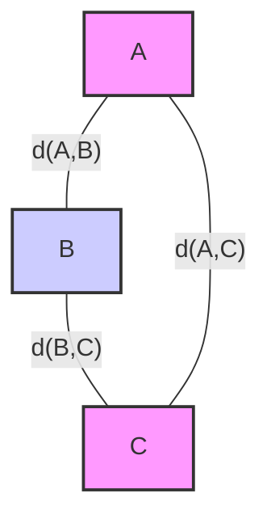
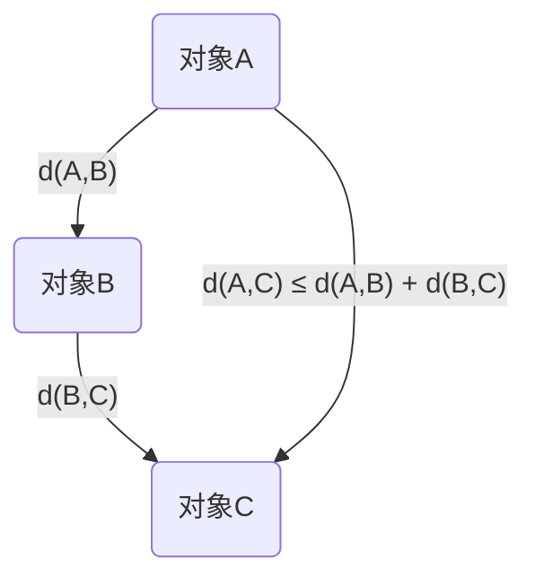
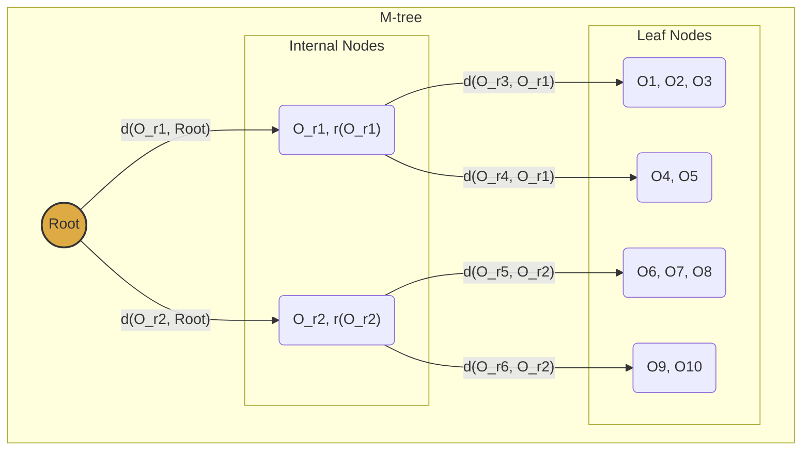
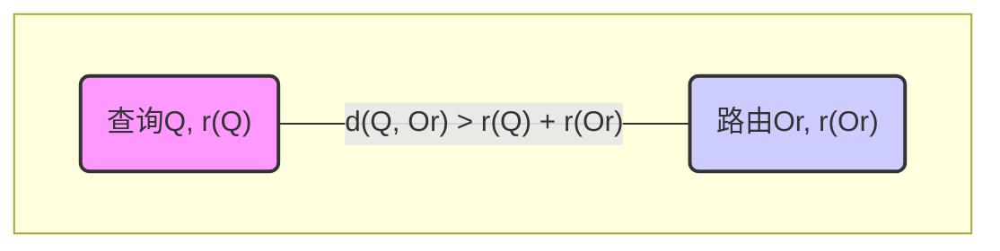

## AI论文解读 | M-Tree: An Efficient Access Method for Similarity Search in Metric Spaces
        
### 作者        
digoal        
        
### 日期        
2025-06-22        
        
### 标签        
PostgreSQL , PolarDB , DuckDB , AI , 论文解读        
        
----        
        
## 背景       
      
https://www.vldb.org/conf/1997/P426.PDF        
  
      
提示:        
```        
读懂《M-Tree: An Efficient Access Method for Similarity Search in Metric Spaces》这篇论文需要提前掌握哪些基础知识, 请使用中文给我讲一下这些基础知识, 尽量通熟易懂, 可以使用markdown支持的图形增加解释性.        
        
使用中文通熟易懂的解读《M-Tree: An Efficient Access Method for Similarity Search in Metric Spaces》这篇论文, 关键内容请深入讲解, 可以使用markdown支持的图形增加解释性.        
        
使用中文提取《M-Tree: An Efficient Access Method for Similarity Search in Metric Spaces》论文中一些重要的术语并详细解释, 可以使用markdown支持的图形示增加解释性.        
```        
        
## 1 前置知识 
  
好的，为了完全理解《M-tree: An Efficient Access Method for Similarity Search in Metric Spaces》这篇经典论文，你需要掌握一些数据库索引、数据结构和数学方面的基础知识。下面我将用通俗易懂的中文，为你逐一讲解这些概念。

### 核心基础知识概览

读懂这篇论文，你需要了解以下四个核心领域的知识：

1.  **度量空间 (Metric Space)**：这是M-tree操作的数学“世界”，理解它至关重要。
2.  **相似性查询 (Similarity Queries)**：这是M-tree要解决的“问题”。
3.  **基于树的索引结构 (Tree-based Indexing)**：这是M-tree所属的“家族”，了解其家族历史有助于理解M-tree的设计思想。
4.  **性能衡量标准 (Performance Metrics)**：这是评价M-tree“好坏”的尺子。

-----

### 1\. 度量空间 (Metric Space)

 想象一下，我们不仅可以测量地图上两点间的直线距离，还可以测量两篇文章的相似度、两张图片的相似度，甚至两个DNA序列的相似度。**度量空间**就是一个通用的概念，用来描述一个集合，以及在这个集合中衡量任意两个“点”（对象）之间“距离”的方法  。

 这个“距离”的定义非常宽泛，但它必须遵守三个基本规则（或称公理）  ：

1.  **对称性 (Symmetry)**：从A到B的距离等于从B到A的距离。

      * $d(A, B) = d(B, A)$

2.  **非负性 (Non-negativity)**：任意两点间的距离都大于等于0。只有当两个点是同一个点时，距离才为0。

      * $d(A, B) \> 0$ (如果 $A \\neq B$) 且 $d(A, A) = 0$

3.   **三角不等式 (Triangle Inequality)**：从A直接到C的距离，永远不会比“先从A到B，再从B到C”的距离更长。这是最关键的性质，是M-tree能够高效剪枝搜索的基础  。

      * $d(A, C) \\le d(A, B) + d(B, C)$

我们可以用一个简单的图来理解**三角不等式**：



 这个性质就像GPS导航，直接从家到公司的距离，肯定比先去超市再到公司的距离要短（或者相等）。M-tree正是利用这个看似简单的原理来排除大量不可能包含查询结果的数据区域，从而实现高效搜索  。

 **为什么重要？** 传统的数据库索引（如B-tree）或空间索引（如R-tree）通常要求数据位于向量空间中（例如，二维坐标点）  。而度量空间的概念更加通用，只要能定义一个满足上述三条公理的距离函数，无论是文本、图像还是基因序列，都可以用M-tree来索引  。

-----

### 2\. 相似性查询 (Similarity Queries)

 相似性查询的目的，是在数据库中找到与给定查询对象“最像”的数据   。论文中主要提到了两种基本类型  ：

1.  **范围查询 (Range Query)**

      *  **问题**：给定一个查询对象Q和一个半径r，找出数据库中所有与Q的距离小于等于r的对象  。
      * **通俗比喻**：在社交App上，“查找附近500米内的人”。

    

    ```mermaid
    graph TD
        subgraph 数据库
            O1((O1))
            O2((O2))
            O3((O3))
            O4((O4))
        end

        Q(查询对象 Q)
        Q -- "d(Q,O1)" --> O1
        Q -- "d(Q,O2)" --> O2
        Q -- "d(Q,O3)" --> O3

        %% 显示名称的非透明节点
        range_r["查询范围 r"]
        style range_r fill:#ece,stroke:#999,stroke-dasharray:5,5
        range_r -.- O1
        range_r -.- O2
    ```

    在这个例子中，O1和O2在查询范围内，O3和O4则在范围外。

2.  **k-最近邻查询 (k-Nearest Neighbor, k-NN)**

      *  **问题**：给定一个查询对象Q和一个整数k，找出数据库中离Q最近的k个对象  。
      * **通俗比喻**：“给我推荐最像这首歌的5首歌”。

 **为什么重要？** 这两种查询是内容检索（如以图搜图、音乐识别）应用的核心   。M-tree的设计目标就是为了高效地执行这两种查询  。

-----

### 3\. 基于树的索引结构

为了避免在海量数据中进行暴力搜索（即计算查询对象与数据库中每个对象的距离），我们需要索引。索引就像书的目录，可以让我们快速定位信息。M-tree是一种树状的索引结构。

1.  **基础：B-Tree**

      *  你可能熟悉关系型数据库中的B-Tree。它是一种**平衡的**、**多路**的搜索树，非常适合存储在磁盘上。它的特点是所有叶子节点都在同一层，查询、插入、删除的时间复杂度都是对数级别的。M-tree借鉴了B-tree的“**平衡**”和“**动态**”特性，这意味着它在数据不断增删的过程中，不需要代价高昂的全局重建就能保持良好的性能  。

2.  **空间索引：R-Tree**

      *  R-tree是为多维空间数据（如地图上的点和矩形）设计的索引  。它将空间上邻近的对象组织在一起，并用一个“最小边界矩形”（Minimum Bounding Rectangle, MBR）来包裹它们。查询时，如果查询范围与某个MBR不相交，那么这个MBR下的所有对象都可以被安全地忽略。
      *  M-tree的思想与R-tree类似，但它不使用“矩形”来组织数据。而是使用“**球体**”（或超球体）的概念。在M-tree中，每个节点都有一个“**路由对象**”(routing object)，以及一个“**覆盖半径**”(covering radius)  。这两者共同定义了一个“球”，所有在该节点下的子对象都在这个球的范围内。查询时，通过比较查询范围和这些“球”的距离，就可以实现高效的剪枝。

 **为什么重要？** 理解B-tree和R-tree有助于你明白M-tree并非凭空出现，而是站在了巨人的肩膀上。它将B-tree的平衡动态特性与R-tree的空间划分思想相结合，并将其推广到了更普适的度量空间  。

-----

### 4\. 性能衡量标准

 评价一个索引结构的好坏，不能只看它能不能用，还要看它用得快不快、省不省资源。这篇论文主要关注两个核心性能指标  ：

1.  **I/O成本 (I/O Costs)**

      * **是什么**：指的是读取磁盘页面的次数。由于数据通常存储在硬盘上，而硬盘访问速度远慢于内存，所以减少I/O次数是数据库索引设计的首要目标之一。
      *  M-tree是一种“分页的”(paged)树，它的一个节点通常对应一个磁盘页面  。因此，查询时访问的节点数直接等同于I/O成本。

2.  **CPU成本 (CPU Costs)**

      *  **是什么**：在这里，主要指**距离计算的次数**  。
      *  在很多应用场景下（比如比较两张复杂图片），计算一次距离本身可能非常耗时   。因此，一个好的度量空间索引不仅要减少磁盘访问，还应该尽可能地减少不必要的距离计算   。论文中提到的很多优化（如利用父节点距离信息）就是为了这个目的  。

 **为什么重要？** M-tree的设计同时兼顾了I/O和CPU两种成本的优化，这是它相比于早期只关注减少距离计算的静态度量树的一大进步  。

### 总结

为了帮助你快速回顾，这里有一张总结表：

| 基础知识 | 核心概念 | 在M-tree论文中的作用 |
| :--- | :--- | :--- |
| **度量空间** | 距离函数、对称性、三角不等式 |  定义了M-tree可以操作的数据类型和环境，三角不等式是其高效剪枝的理论基石  。 |
| **相似性查询** | 范围查询、k-最近邻查询 |  M-tree设计出来就是为了高效解决这两类问题  。 |
| **树索引** | 平衡树 (B-tree)、空间划分 (R-tree) |  M-tree借鉴了它们的思想，是动态、平衡的，通过“覆盖半径”来划分度量空间  。 |
| **性能标准** | I/O成本 (访问节点数)、CPU成本 (距离计算数) |  这是评估M-tree各种策略（如分裂策略）优劣的两个主要维度  。 |

掌握了以上这些基础知识，你就能更好地理解M-tree的动机、设计细节、算法流程以及实验评估的意义，从而顺利读懂这篇论文。
  
## 2 解读论文 
  
好的，我们来一起深入解读这篇在数据库和多媒体检索领域具有里程碑意义的论文——《M-tree: An Efficient Access Method for Similarity Search in Metric Spaces》。

我将按照以下结构为你层层解析，力求通俗易懂，并使用图示辅助理解。

1.  **论文解读开篇：M-tree解决了什么核心问题？**
2.  **核心基石：度量空间 (Metric Space) 与相似性查询**
3.  **M-tree的内部构造：节点里究竟存了什么？**
4.  **M-tree的核心算法（深入讲解）：如何高效地查找与剪枝？**
5.  **M-tree的成长与塑造：插入与节点分裂策略**
6.  **实验与结论：M-tree到底表现如何？**
7.  **总结：M-tree的价值与贡献**

-----

### 1\. 论文解读开篇：M-tree解决了什么核心问题？

在M-tree出现之前，要在海量数据中进行相似性搜索，主要有两种方法，但它们都有明显的缺陷：

  *  **传统空间索引 (如 R-tree)**：这类方法非常成熟，但它们有两大“硬伤”  。

1\.   **依赖向量空间**：它们要求数据必须能表示为多维空间中的点或矩形  。但如果你的数据是DNA序列、一段音频或一篇文档，很难找到一个合适的、不失真的向量表示。
2\.   **依赖特定距离**：它们通常使用欧几里得距离 ($L\_2$) 或曼哈顿距离 ($L\_1$) 这类 $L\_p$ 度量  。如果你的数据需要一个更复杂的、自定义的距离函数（例如，编辑距离），R-tree就无能为力了。

  *  **早期的度量树 (Metric Trees)**：这类方法不依赖向量空间，更加通用  。但它们也有两个问题：

1\.   **静态结构**：它们通常是一次性构建好的，不适合数据频繁增删的动态环境，否则性能会严重下降  。
2\.   **忽视I/O成本**：它们的设计主要目标是减少距离计算的次数（CPU成本），但没有充分考虑磁盘读写（I/O成本），而后者在大型数据库中往往是性能瓶颈  。

**M-tree的目标就是集两家之长，避两家之短**：
它旨在创建一个**既通用又高效**的索引结构，它应该：

  *  能工作在任意**度量空间**上，不限制数据类型和距离函数  。
  *  是**动态**的、**平衡**的树，能高效处理数据增删，无需定期重构  。
  *  **同时优化**CPU成本（距离计算次数）和I/O成本（磁盘页面读取次数） 。

-----

### 2\. 核心基石：度量空间 (Metric Space) 与相似性查询

要理解M-tree，首先要理解它工作的“世界”——度量空间。

 一个度量空间由一个数据集合 $\\mathcal{D}$ 和一个距离函数 $d$ 组成   。这个距离函数 $d$ 必须满足三个基本定律  ：

1.  **对称性**： $d(A, B) = d(B, A)$
2.  **非负性**： $d(A, B) \> 0$ （若 $A \\neq B$）， $d(A, A) = 0$
3.  **三角不等式**： $d(A, C) \\le d(A, B) + d(B, C)$

**三角不等式是M-tree所有剪枝优化的灵魂**。它保证了“两点之间直线最短”这个常识在抽象的度量空间中依然成立。



M-tree要高效处理两种核心的**相似性查询**：

  *  **范围查询 (Range Query)**：给定查询对象Q和半径r，找出所有与Q距离不超过r的对象  。
  *  **k-最近邻查询 (k-NN Query)**：给定查询对象Q和数量k，找出离Q最近的k个对象  。

-----

### 3\. M-tree的内部构造：节点里究竟存了什么？

M-tree是一棵平衡的、分页的树，其结构设计巧妙地将度量空间中的对象组织起来。

  * **节点类型**：分为**内部节点 (Internal Node)** 和 **叶子节点 (Leaf Node)**。

  *  **叶子节点**：存储的是实际的数据库对象（或其特征） 。每个条目包含：

      *  $O\_j$：对象本身的数据（特征值） 。
      *  $oid(O\_j)$：对象的唯一标识符（指向完整数据） 。
      *  $d(O\_j, P(O\_j))$：该对象与其“父路由对象”之间的距离  。

  *  **内部节点**：存储的是 **“路由对象” (Routing Objects)**   。这些路由对象本身也是数据库中的对象，只是被“提拔”上来充当区域代表  。每个路由条目包含：

      *  $O\_r$：路由对象的数据  。
      *  $ptr(T(O\_r))$：一个指针，指向以 $O\_r$ 为根的子树  。
      *  $r(O\_r)$：**覆盖半径 (Covering Radius)**。这是一个关键概念，它定义了一个以 $O\_r$ 为中心、半径为 $r(O\_r)$ 的“球”状区域。该子树中的所有对象，都保证落在这个球内  。
      *  $d(O\_r, P(O\_r))$：该路由对象与其上一层父路由对象的距离  。

我们可以这样想象M-tree的结构：



*每个内部节点像一个区域负责人，它管辖的范围就是一个“球”（由路由对象和覆盖半径定义）。*

-----

### 4\. M-tree的核心算法（深入讲解）：如何高效地查找与剪枝？

 这是M-tree的精髓所在。其目标是**尽可能少地访问节点（省I/O），并且在访问节点后尽可能少地计算距离（省CPU）**  。它利用三角不等式实现了两层强大的剪枝策略。

#### 范围查询 `range(Q, r(Q))`

假设我们要查询以Q为中心、半径为r(Q)范围内的所有对象。算法从根节点开始递归向下。在一个节点中，对于每一个路由对象 $O\_r$，算法需要判断是否要进入它的子树。

**剪枝法则 1 (利用父节点距离，节省CPU)**

当算法到达一个节点时，它已经计算了查询对象Q到该节点父路由对象 $O\_p$ 的距离，即 $d(O\_p, Q)$。对于当前节点中的一个路由对象 $O\_r$，我们从树中已经存好了它到父节点的距离 $d(O\_r, O\_p)$。

根据三角不等式，我们有： $d(O\_r, Q) \\ge |d(O\_p, Q) - d(O\_r, O\_p)|$ 。

如果连这个距离的**下界**都已经超出了查询范围，那么 $O\_r$ 的整个子树都可以被安全剪掉。更具体地说，如果 $O\_r$ 的覆盖范围和查询范围不可能相交，即 $|d(O\_p, Q) - d(O\_r, O\_p)| \>  r(Q) + r(O\_r)$，那么我们**无需计算 $d(O\_r, Q)$** 就可以直接剪枝  。

  * **通俗比喻**：一个邮递员要去一个小区（子树 $T(O\_r)$）送信。他现在在小区的入口（父节点 $O\_p$），他知道自己离收信人（查询Q）有10公里。他也知道小区大门（路由对象 $O\_r$）离小区入口（父节点 $O\_p$）有8公里，且这个小区的最大半径（覆盖半径 $r(O\_r)$）是1公里。根据三角不等式，他可以推断出，收信人离小区大门的最短距离是 $|10-8|=2$ 公里。因为2公里 \> 1公里（小区半径），所以收信人绝对不可能住在这个小区里。邮递员甚至**不需要走到小区大门**去确认具体距离，就可以直接排除了。这就是节省CPU的地方。

**剪枝法则 2 (常规剪枝)**

 如果法则1无法剪枝，我们就必须计算 $d(O\_r, Q)$。这时，我们可以使用更直观的剪枝法则：如果查询球和 $O\_r$ 的覆盖球不相交，即 $d(O\_r, Q) \> r(Q) + r(O\_r)$，那么 $O\_r$ 的子树就可以被剪掉  。

如下图所示，查询范围Q与 $O\_r$ 的覆盖范围不相交，因此其子树 $T(O\_r)$ 无需访问。



 论文的实验表明，剪枝法则1非常有效，可以节省高达40%的距离计算  。

#### k-最近邻查询 (k-NN)

 k-NN查询采用了一种“分支定界” (branch-and-bound) 的策略  。

1.   维护一个优先队列PR，用于存放可能包含结果的子树  。
2.   维护一个大小为k的结果列表NN，保存到目前为止找到的k个最近邻   。列表中最远的邻居距离 $d\_k$ 构成了一个**动态的查询半径**  。
3.   查询时，从优先队列中取出距离下界最小的子树进行探索  。
4.  当找到一个更近的对象时，就更新结果列表NN和动态半径 $d\_k$。
5.   **剪枝**：优先队列中任何距离下界大于当前动态半径 $d\_k$ 的子树，都可以被安全地移除  。

-----

### 5\. M-tree的成长与塑造：插入与节点分裂策略

M-tree的动态性体现在其插入和分裂算法上。

#### 插入 (Insertion)

 插入一个新对象 $O\_n$ 时，算法从根节点开始，为它寻找一个最合适的叶子节点  。选择路径的策略是：

1.   **优先选择无需扩张的子树**：即新对象能被现有路由对象的覆盖半径容纳 ( $d(O\_r, O\_n) \\le r(O\_r)$ )。如果多个子树都满足，则选择能让新对象离路由对象最近的那个  。
2.   **其次选择扩张最小的子树**：如果所有子树都需要扩大半径，则选择那个半径增长量最小的  。

#### 节点分裂 (Split)

 当一个节点满了之后，就需要分裂   。这是M-tree设计中非常灵活的一点，论文探讨了多种**分裂策略 (Split Policy)**  。一个分裂策略由两部分组成：

1.   **提拔路由对象 (Promote)**：从满载的节点中选出两个对象，将它们“提拔”到父节点，作为分裂后两个新节点的“区域代表”  。
2.   **分配条目 (Partition)**：将旧节点中的所有条目，重新分配给分裂后的两个新节点  。

论文研究了多种提拔和分配的组合，例如：

  *  **提拔策略**：可以是随机选择(RANDOM)、抽样选择(SAMPLING)、选择能让分裂后两个区域半径和最小的(m\_RAD)、或者最大化两个新路由对象距离的(MLB\_DIST)等  。
  *  **分配策略**：可以是“广义超平面”分配（每个对象被分给离它最近的那个新路由对象），或者“平衡”分配（强制让两个新节点的对象数量大致相等） 。

 这些策略各有优劣。比如，复杂的策略（如m\_RAD）可以构建出查询性能更好的树，但构建过程本身计算开销很大   ；而简单的策略（如RANDOM）构建速度快，但查询性能可能稍差   。这种可配置性让M-tree可以根据具体应用场景（CPU敏感型或I/O敏感型）进行调优  。

-----

### 6\. 实验与结论：M-tree到底表现如何？

论文通过大量实验证明了M-tree的有效性。

  *  **可扩展性 (Scalability)**：M-tree的性能随着数据量的增长呈对数级变化，而不是线性增长，证明了其良好的可扩展性  。这是对静态度量树的一大超越。
  *  **高维性能**：虽然也受“维度灾难”的影响，但M-tree在高维数据空间中依然表现得相当不错  。
  *  **与R\*-tree对比**：在R\*-tree适用的向量空间数据上，M-tree也表现出强大的竞争力，甚至在I/O成本上优于R\*-tree   。其独特的CPU优化（剪枝法则1）效果显著  。
  *  **分裂策略**：实验表明，没有一种策略是绝对的赢家。简单的策略构建快，复杂的策略查询快，用户可以按需选择  。

-----

### 7\. 总结：M-tree的价值与贡献

M-tree是一项开创性的工作，其主要贡献可以总结为：

1.   **通用性**：首次提出了一种**动态、平衡、分页**的索引结构，能够直接在通用的**度量空间**上进行高效的相似性搜索，极大地扩展了索引技术的应用范围  。
2.   **双重优化**：其算法设计巧妙地**同时兼顾了I/O和CPU两种成本的优化**，尤其利用父节点距离进行剪枝的策略，是其性能的一大亮点  。
3.   **动态与可扩展**：解决了以往度量树的静态问题，使其能够适应数据不断变化的真实数据库环境，并保证了性能的可扩展性  。
4.   **灵活性**：提供了多种分裂策略，允许用户根据应用特点进行性能调优  。

总而言之，M-tree成功地将传统数据库索引的鲁棒性和动态性，与度量空间搜索的通用性结合起来，为后来的许多多媒体和非传统数据类型的数据库检索技术铺平了道路。
  
## 3 术语  
  
好的，遵照您的要求，我们从《M-Tree: An Efficient Access Method for Similarity Search in Metric Spaces》这篇论文中提取最核心的术语，并用中文进行详细、通俗的解释。

-----

### 1\. 度量空间 (Metric Space)

  *  **定义**：一个度量空间是一个由数据域 $\\mathcal{D}$ 和距离函数 $d$ 组成的对，记为 $\\mathcal{M}=(\\mathcal{D},d)$   。这个距离函数 $d$ 必须满足三个性质：对称性、非负性，以及最重要的**三角不等式**  。

  * **通俗解释**：
    想象一下，我们有一个包含各种对象的“宇宙”（比如所有的图片、所有的文章、所有的指纹）。“度量空间”就是指这个宇宙，并且我们还拥有一把特殊的“尺子”（距离函数 $d$），可以衡量这个宇宙中任意两个对象之间的“距离”或“不相似度”。这把尺子不一定量的是物理距离，但必须遵守三个常识性规则：

    1.  A到B的距离等于B到A的距离（对称性）。
    2.  不同对象间的距离总是正数，同一个对象和自己的距离是0（非负性）。
    3.  从A到C的“直线距离”一定小于等于从A先到B再到C的“绕路距离”（三角不等式）。

  * **它为什么重要**：
     这是M-tree能够工作的最基本前提   。它将M-tree的应用范围从传统的多维向量数据（如坐标点）解放出来，扩展到了任何可以定义合理“距离”的领域，如图像、文本、基因序列等  。

-----

### 2\. 三角不等式 (Triangle Inequality)

  *  **定义**：对于任意三个对象 $O\_x, O\_y, O\_z$，它们之间的距离满足 $d(O\_{x},O\_{y})\\le d(O\_{x},O\_{z})+d(O\_{z},O\_{y})$  。

  * **通俗解释**：
    这是“两点之间直线最短”这个几何常识在抽象空间中的推广。

    ```mermaid
    graph TD
        A(对象A) -- d(A,B) --> B(对象B)
        B -- d(B,C) --> C(对象C)
        A -- "距离 ≤ d(A,B) + d(B,C)" --> C(对象C)
    ```

  * **它为什么重要**：
     **这是M-tree能够高效剪枝、避免全局搜索的数学基石**   。在搜索时，M-tree利用这个不等式，可以推断出某个数据区域（子树）与查询目标之间的最小可能距离。如果这个最小距离已经超出了查询范围，那么整个区域就可以被安全地忽略，从而极大地节省了I/O和距离计算的开销  。

-----

### 3\. 路由对象 (Routing Object)

  *  **定义**：一个存储在M-tree内部节点中的数据库对象，它在节点分裂时通过特定的“提拔”算法被赋予了路由的角色   。每个路由对象都关联一个指针，指向它所“覆盖”的子树  。

  * **通俗解释**：
    可以把路由对象想象成一个“区域的中心点”或“邮政编码的中心局”。它本身是一个真实的数据对象，但被挑选出来代表一片区域。当需要向下搜索时，我们通过计算与这些“区域中心点”的距离，来决定应该进入哪个区域继续查找。

  * **它为什么重要**：
     路由对象是M-tree组织层次结构的关键。M-tree不是通过抽象的几何边界（如R-tree的矩形）来划分空间，而是通过这些真实存在的数据点来划分，这使得它能够适应任意度量空间  。

-----

### 4\. 覆盖半径 (Covering Radius)

  *  **定义**：对于一个路由对象 $O\_r$，其覆盖半径 $r(O\_r)$ 是一个距离值，它保证其子树 $T(O\_r)$ 中的所有对象与 $O\_r$ 的距离都在 $r(O\_r)$ 之内  。

  * **通俗解释**：
    如果说路由对象是“区域中心点”，那么覆盖半径就是这个中心点所管辖的“势力范围”。它以路由对象为球心，以覆盖半径为半径，画出了一个“球”（在抽象空间中）。这个路由对象负责的所有下属对象，都保证落在这个球里面。

    ```mermaid
    graph TD
        subgraph "覆盖范围"
            style 覆盖范围 fill:#ece,stroke:#999,stroke-dasharray: 5 5
            Or((路由对象 Or))
            O1(O1)
            O2(O2)
            O3(O3)
        end
        Or -- "半径 r(Or)" --> O1
        Or -- " " --> O2
        Or -- " " --> O3
    ```

  * **它为什么重要**：
     “路由对象”和“覆盖半径”共同定义了M-tree中一个子树的空间范围   。查询算法正是通过比较查询范围与这些“覆盖球”的位置关系，来决定是否需要进入一个子树进行搜索，这是剪枝操作的基础   。一个好的M-tree，其覆盖半径（即“死空间”）应该尽可能小  。

-----

### 5\. 分裂策略 (Split Policy)

  *  **定义**：当一个节点因插入新条目而溢出时，管理该过程的一套方法。一个分裂策略由两个核心部分组成：`Promote`（提拔方法），用于选择两个对象作为分裂后新节点的路由对象；以及`Partition`（划分方法），用于将溢出节点中的所有条目分配到两个新节点中  。

  * **通俗解释**：
    想象一个文件夹（节点）装满了文件（对象条目），现在需要把它分成两个新文件夹。分裂策略就是你遵循的规则：

    1.  **提拔**：如何为这两个新文件夹选定新的标签（路由对象）？
    2.  **划分**：根据什么原则将旧文件夹里的文件分到这两个新文件夹里？
         论文探讨了多种策略，例如：提拔时可以随机选（RANDOM），也可以精挑细选，选那对能让分裂后两个新文件夹“管辖范围”最小的组合（m\_RAD）  。划分时可以简单地谁离哪个新标签近就跟谁（Generalized Hyperplane），也可以强制让两个新文件夹里的文件数量一样多（Balanced） 。

  * **它为什么重要**：
     这是M-tree能够**动态调整**的关键机制   。分裂策略的好坏直接决定了M-tree的结构质量，从而深刻影响查询效率和未来的插入成本   。论文的一大贡献就是提供了多种策略，并分析了它们在CPU成本和I/O成本之间的权衡，让用户可以按需“调优”  。

-----

### 6\. 确认分裂策略 (Confirmed Split Policy)

  *  **定义**：一种特殊的分裂策略，它在提拔路由对象时，选择将分裂节点的原父对象 ($O\_p$) 作为两个提拔对象之一   。换句话说，一个新节点的“区域代表”仍然是原来的那个，只是从中“挖”出了一小块区域，由一个新的代表来管理  。

  * **通俗解释**：
     延续上面的例子，当一个文件夹要分裂时，这种策略是：一个新文件夹继续沿用旧的标签，我们只为另一个“分裂出去”的文件夹创建一个新标签。这种方法通常更简单，计算量也更小  。

  * **它为什么重要**：
     这是一种具体的、简化的分裂启发式算法。论文通过实验对比了“确认策略”（在图中用 `_1` 后缀标识）和“非确认策略”（用 `_2` 后缀标识），以评估不同分裂思路对性能的影响  。这体现了论文在算法设计上的细致考量。
  
## 参考        
         
https://www.vldb.org/conf/1997/P426.PDF  
        
        
<b> 以上内容基于DeepSeek、Qwen、Gemini及诸多AI生成, 轻微人工调整, 感谢杭州深度求索人工智能、阿里云、Google等公司. </b>        
        
<b> AI 生成的内容请自行辨别正确性, 当然也多了些许踩坑的乐趣, 毕竟冒险是每个男人的天性.  </b>        
  
  
  
#### [期望 PostgreSQL|开源PolarDB 增加什么功能?](https://github.com/digoal/blog/issues/76 "269ac3d1c492e938c0191101c7238216")
  
  
#### [PolarDB 开源数据库](https://openpolardb.com/home "57258f76c37864c6e6d23383d05714ea")
  
  
#### [PolarDB 学习图谱](https://www.aliyun.com/database/openpolardb/activity "8642f60e04ed0c814bf9cb9677976bd4")
  
  
#### [PostgreSQL 解决方案集合](../201706/20170601_02.md "40cff096e9ed7122c512b35d8561d9c8")
  
  
#### [德哥 / digoal's Github - 公益是一辈子的事.](https://github.com/digoal/blog/blob/master/README.md "22709685feb7cab07d30f30387f0a9ae")
  
  
#### [About 德哥](https://github.com/digoal/blog/blob/master/me/readme.md "a37735981e7704886ffd590565582dd0")
  
  

  
