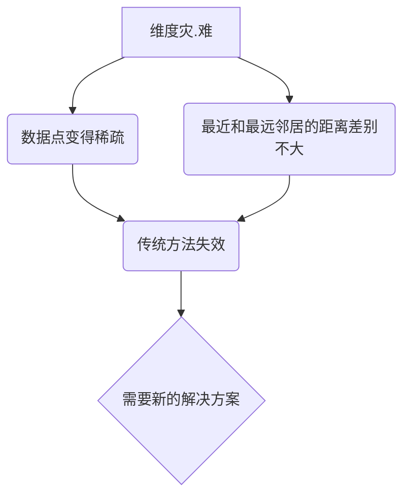
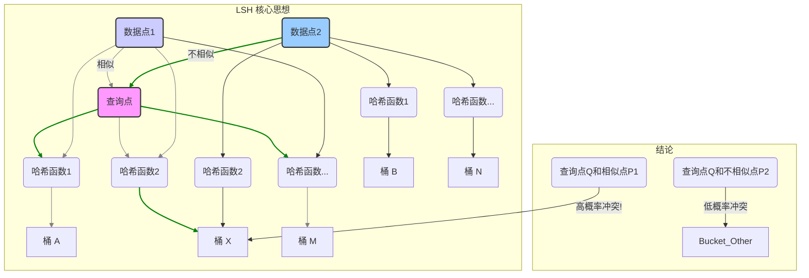
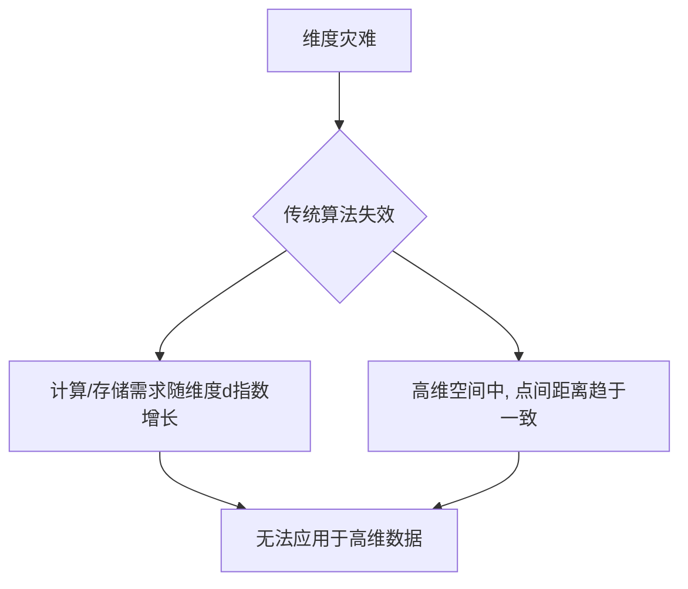
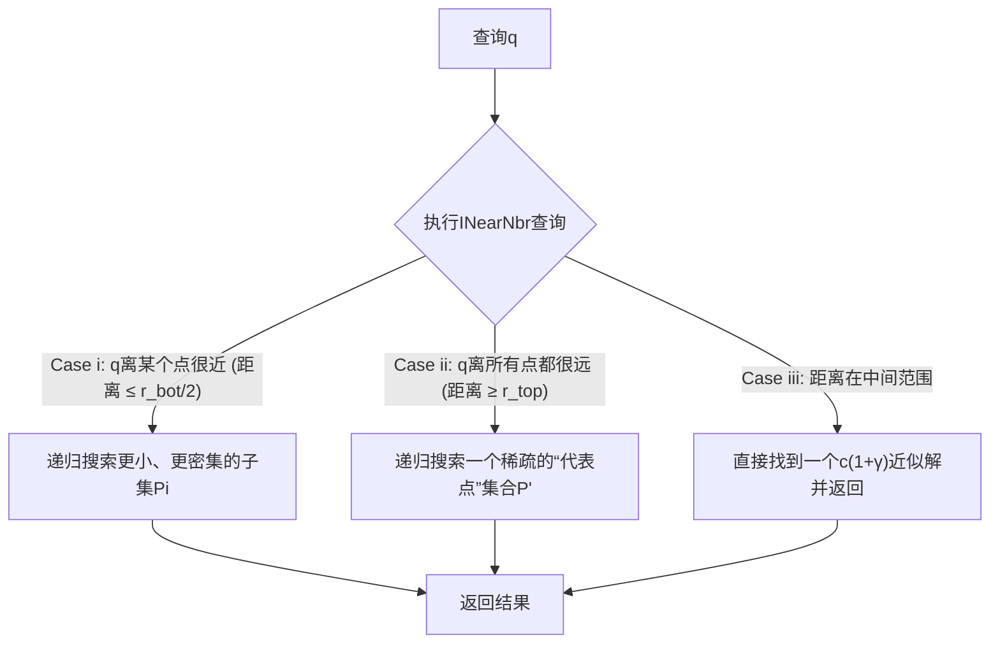

## AI论文解读 | Approximate Nearest Neighbors: Towards Removing the Curse of Dimensionality
        
### 作者        
digoal        
        
### 日期        
2025-06-22        
        
### 标签        
PostgreSQL , PolarDB , DuckDB , AI , 论文解读        
        
----        
        
## 背景       
      
https://www.theoryofcomputing.org/articles/v008a014/v008a014.pdf        
  
      
提示:        
```        
读懂《Approximate Nearest Neighbors: Towards Removing the Curse of Dimensionality》这篇论文需要提前掌握哪些基础知识, 请使用中文给我讲一下这些基础知识, 尽量通熟易懂, 可以使用markdown支持的图形增加解释性.        
        
使用中文通熟易懂的解读《Approximate Nearest Neighbors: Towards Removing the Curse of Dimensionality》这篇论文, 关键内容请深入讲解, 可以使用markdown支持的图形增加解释性.        
        
使用中文提取《Approximate Nearest Neighbors: Towards Removing the Curse of Dimensionality》论文中一些重要的术语并详细解释, 可以使用markdown支持的图形示增加解释性.        
```        
        
## 1 前置知识 
  
好的，为了帮助您更好地理解这篇开创性的论文《近似最近邻：旨在消除维度灾难》(Approximate Nearest Neighbor: Towards Removing the Curse of Dimensionality)，我将为您梳理阅读前需要掌握的核心基础知识。我会用通俗易懂的语言，并借助图表来解释这些概念。

这篇论文主要探讨的是，如何在拥有非常多特征（高维）的数据中，快速地找到与查询目标“足够近”的邻居，而不是非要找到“最”近的那一个。这在图像搜索、推荐系统、数据挖掘等领域至关重要。

### 1\. 核心问题：最近邻搜索 (Nearest Neighbor Search)

想象一下你在一个布满了很多人的广场上，你的任务是找到离你最近的那个人。

  * **低维度情况 (Low Dimensions)**：如果这个广场是二维的（一个平面），你环顾四周，很容易就能找到谁离你最近。在计算机里，对于二维或三维空间中的点，已经有很多高效的算法（比如k-d树）能快速解决这个问题。

  * **高维度情况 (High Dimensions)**：现在想象一下，你要找的不是物理上最近的人，而是与你“最相似”的人。我们用很多特征来描述一个人，比如：身高、体重、年龄、收入、看的电影数量、听的音乐类型……等等，假设我们用了1000个特征。这时，每个人都变成了1000维空间中的一个点。在这个超高维度的空间里，你无法“环顾四周”，想快速找到“最近”的点变得极其困难。

这就是论文要解决的核心问题：**高维空间中的最近邻搜索**。

### 2\. 主要障碍：维度灾难 (The Curse of Dimensionality)

“维度灾难”是理解这篇论文的钥匙。它指的是当数据的维度（特征数量）急剧增加时，会出现一系列奇怪且反直觉的现象，导致很多在低维空间中行之有效的算法性能严重下降。

主要体现在以下几个方面：

  * **空间变得极其稀疏**：在高维空间中，数据点会变得非常分散。想象一下，在一个一维的线段上撒10个点，它们可能会很密集。但在一个三维的立方体里撒10个点，它们之间的距离会大很多。在一个1000维的超立方体中，这些点几乎肯定都离彼此非常遥远。
  * **“最近”和“最远”邻居的距离趋于一致**：在高维空间中，任意一个点到其他所有点的距离都差不多是相等的。这就好比在一个巨大的、空旷的房间里，你看任何一个角落，感觉距离都差不多远。这使得“最近邻”这个概念本身变得不那么有意义，而且给搜索带来了巨大麻烦。




  * **计算量爆炸**：很多传统算法（如k-d树）的计算复杂度都与维度 $d$ 成指数关系（例如 $O(2^d)$ ）。当 $d$ 很大时，比如1000，这个计算量是天文数字，算法变得不可行。这篇论文明确指出，它们的目标之一就是**移除对维度的指数依赖**。

### 3\. 核心思想：从“精确”到“近似”

既然精确找到“最”近的那个点那么困难，我们能不能退而求其次，只要找到一个“足够近”的点就行了？这就是**近似最近邻 (Approximate Nearest Neighbor, ANN)** 的思想。

  * **定义**：给定一个查询点 $q$ 和一个点集 $P$。 $p$ 是 $q$ 在 $P$ 中的精确最近邻。一个算法如果能返回点 $p'$，使得 $p'$ 到 $q$ 的距离不大于 $p$ 到 $q$ 距离的 $c$ 倍（其中 $c\>1$），那么这个算法就解决了 c-近似最近邻问题。
      * 数学上表示为： $Distance(q, p') \\le c \\times Distance(q, p)$
      * $c$ 被称为近似因子。 $c$ 越接近1，表示近似效果越好。

这种妥协非常实用，因为在很多应用场景（如图片搜索）中，找到一张“非常相似”的图片和找到“最最相似”的图片，给用户的感觉差别不大，但计算成本却能降低成千上万倍。

### 4\. 关键技术：局部敏感哈希 (Locality-Sensitive Hashing, LSH)

这是这篇论文提出的**最核心、最具影响力的技术**。LSH是一种特殊的哈希（或称“散列”）方法，它的设计思想与传统的哈希完全不同。

  * **传统哈希**：目的是将数据均匀地打乱散开，避免冲突。比如你用MD5对两个相似的文件（哪怕只差一个字节）进行哈希，得到的哈希值也天差地别。
  * **局部敏感哈希 (LSH)**：目的是让**相似（距离近）的对象有很高的概率发生哈希冲突，而不相似（距离远）的对象有很低的概率发生冲突**。

**工作原理类比：**

想象一下，我们有很多书，想把内容相似的书放在同一个书架上。

1.  **设计“局部敏感”的规则（哈希函数）**：我们可以设计一些简单的规则，比如“书名中包含‘算法’这个词的书”、“页数超过500页的书”、“作者名字首字母是‘R’的书”。
2.  **多次分组（多个哈希表）**：我们使用很多这样的规则。对于每一本书，我们看它符合哪些规则，就在对应的书架上放一个它的“标签”。
3.  **查询**：现在来了一本新书（查询点），你想给它找相似的书。你看看它符合哪些规则，然后就只去那些规则对应的书架上寻找。因为内容相似的书很可能也符合这些规则，所以它们大概率会在同一个书架上，你只需要在很小的范围内搜索，而不用检查所有的书。




LSH的巧妙之处在于，它将搜索问题从“检查所有点”降维到“只检查少数几个哈希桶里的点”，从而**将查询时间从与总数据量 $n$ 线性相关 ( $O(dn)$ ) 降低到亚线性 ($O(dn^{1/c}))$**，极大地提高了效率。

### 5\. 其他相关概念

  * **欧几里得空间和 $l\_s$ 范数 (Euclidean Space and $l\_s$ norms)**：

      * $\\mathbb{R}^d$ 表示 $d$ 维实数空间。
      * $l\_s$ 范数是衡量空间中两点之间距离的一种方式。
          * **$l\_1$ 范数（曼哈顿距离）**：  `$||x-y||*1 = \\sum*{i=1}^{d} |x\_i - y\_i|$`。想象在城市街区里开车，只能沿着街道走，不能斜穿，走过的总路程就是曼哈顿距离。
          * **$l\_2$ 范数（欧几里得距离）**：  `$||x-y||*2 = \\sqrt{\\sum*{i=1}^{d} (x\_i - y\_i)^2}$`。这就是我们最熟悉的“直线距离”。
      * 论文中提到的算法主要适用于 $l\_1$ 和 $l\_2$ 范数。

  * **降维 (Dimensionality Reduction)**：

      * 一种将高维数据映射到低维空间，同时尽量保持数据点之间距离关系的技术。
      * 论文中提到了著名的 **Johnson-Lindenstrauss (JL) 引理**，它证明了可以将 $n$ 个点从高维空间随机投影到一个 $O(\\log n)$ 的低维空间，而点对之间的距离只有很小的扭曲。这是一种将问题简化的强大工具。

  * **Voronoi 图 (Voronoi Diagram)**：

      * 在一个平面上，对于一组点，Voronoi图将平面划分为多个区域，使得每个区域内的任意一点都离这组点中的某一个特定点最近。
      * 论文中提出了 **近似Voronoi图** 的概念，即划分出的区域能保证为区域内所有点提供一个“近似”最近邻，而不是“精确”最近邻。这样做的好处是，这个近似图的复杂性比精确图大大降低。

### 总结：你需要掌握的知识地图

为了看懂这篇论文，你需要理解以下逻辑链条：

1.  **目标问题**：我们想在海量高维数据中做**最近邻搜索**。
2.  **巨大挑战**：**维度灾难**使得传统方法失效，计算成本过高。
3.  **解决思路**：我们放弃完美，追求高效，将目标从**精确最近邻**放宽到**近似最近邻**。
4.  **核心武器**：我们发明了一种叫**局部敏感哈希 (LSH)** 的新工具。它能巧妙地将距离近的点聚集到一起，从而避免全局搜索，实现亚线性的查询时间。
5.  **辅助工具**：我们还会用到**降维**技术来简化问题，并从**Voronoi图**的概念中获得启发，构建近似版本。

掌握了以上这些核心概念，您就拥有了阅读这篇经典论文所需的“藏宝图”，能够更好地理解作者们是如何一步步“消除维度灾难”的。
  
## 2 解读论文 
  
好的，我们来一起深入解读这篇在计算机科学领域具有里程碑意义的论文——《近似最近邻：旨在消除维度灾难》。

这篇论文的核心贡献在于，它直面并解决了在高维数据中进行高效搜索的“**维度灾难**”问题，其提出的**局部敏感哈希 (LSH)** 算法，已经成为现代大规模数据处理的基石技术之一。

-----

### 论文概览

  * **论文标题**: Approximate Nearest Neighbor: Towards Removing the Curse of Dimensionality
  * **作者**: Sariel Har-Peled, Piotr Indyk, Rajeev Motwani
  * **核心思想**: 放弃对“绝对最近”的执念，通过寻找一个“足够近”的邻居（即近似最近邻），来换取搜索效率的巨大提升，从而在根本上绕开维度灾难。

-----

### 第一部分：理解核心困境——“维度灾难”

要理解这篇论文的伟大之处，必须先理解它要战胜的敌人：**维度灾难 (The Curse of Dimensionality)**。

 想象一下，你在一个二维平面上找离你最近的点，非常简单   。但如果点的特征（维度）变得非常多，比如用一百万个像素值来描述一张图片  ，情况就会急剧恶化。

**维度灾难的表现：**

1.   **计算量爆炸**：传统算法的计算或存储需求会随着维度 $d$ **指数级增长**   。比如，某些精确算法的空间复杂度是 $n^{O(d)}$  ，当 $d=100$ 时，这根本无法实现。
2.  **距离失去意义**：在高维空间中，一个点到它“最近”邻居的距离和到它“最远”邻居的距离，差别会变得微乎其微。所有点看起来都离你差不多远，这让“最近”这个概念的区分度大大降低。




 作者们的洞察是：既然精确查找如此困难，不如放宽要求。在很多实际应用中，比如以图搜图，我们不需要找到最完美匹配的那一张，只要找到一张非常相似的就足够了   。这就是 **c-近似最近邻 (c-Approximate Nearest Neighbor)** 的核心思想  。

 **定义**：对于查询点 $q$，算法返回的点 $p'$ 与 $q$ 的距离，最大不超过真实最近邻 $p$ 与 $q$ 之间距离的 $c$ 倍（ $c \> 1$ ）  。

-----

### 第二部分：论文的核心策略——两步走

论文的整体框架非常清晰，它把复杂的“近似最近邻”问题拆解为两步：

1.   **先解决一个简化版问题**：定义并解决一个更简单的“决策”版本问题，称为 **(c, r)-近似*近邻* (Approximate *Near* Neighbor)**  。
2.   **再把原问题规约到简化版问题上**：设计一个高效的框架，用上面简化版问题的解法来解决原始的、更复杂的“近似最近邻”问题  。

#### 第2.1节：简化版问题 - (c, r)-近似近邻

 这个问题问的是：给定一个固定的距离半径 $r$，对于一个查询点 $q$，如果存在一个数据点 $p$ 与它的距离小于等于 $r$，那么算法就必须返回一个距离 $q$ 不超过 $cr$ 的数据点 $p'$   。如果不存在这样的 $p$，算法可以返回任何结果  。

这个简化版问题之所以好解决，是因为我们有了一个明确的距离阈值 $r$，而不用去大海捞针般地寻找那个未知的“最近距离”。

#### 第2.2节：从“近邻”到“最近邻”的规约

这是论文中非常精巧的一个设计。如何用上面那个只能判断固定半径 $r$ 的“近邻”工具，来解决要找未知“最近距离”的“最近邻”问题呢？

  *  **朴素想法**：我们可以为各种可能的半径 $r$ 都建立一个“近邻”数据结构，比如 $r=1, 2, 4, 8, ...$   。查询时，从小到大依次尝试，直到找到答案。但这样做可能需要存储太多数据结构，空间开销巨大  。

  *  **论文的精妙规约**：作者设计了一个基于分治和递归的搜索树结构  。对一个查询点 $q$，它会这样做：



这个规约过程只会增加对数级的额外开销 ( $O(\\log n)$ 的查询时间和 $O(\\log^2 n)$ 的空间因子 )  ，非常高效。

-----

### 第三部分：解决“近邻”问题的两大神器

论文为解决上面提到的简化版“(c, r)-近似近邻”问题，提出了两种截然不同的算法。

#### 神器一：局部敏感哈希 (LSH) —— 本文最耀眼的明星

LSH是本文最具开创性的贡献，它为高维搜索提供了一种全新的思维范式。

  *  **核心思想**：设计一种特殊的哈希函数，使得**原始空间中距离近的点，有很大概率被哈希到同一个桶里；而距离远的点，则很大概率被分到不同的桶里**  。

  *  **LSH函数族的定义**: 一个哈希函数族 H 被称为是 $(r\_1, r\_2, p\_1, p\_2)$-敏感的，如果对于任意两点 $p, q$  ：

      * 若 $Distance(p,q) \\le r\_1$，则 $Pr[h(p)=h(q)] \\ge p\_1$ （近点高概率碰撞）
      * 若 $Distance(p,q) \> r\_2$，则 $Pr[h(p)=h(q)] \\le p\_2$ （远点低概率碰撞）
      *  其中必须满足 $p\_1 \> p\_2$  。

  * **LSH的工作流程**：

    1.   **增强差距**：将 $k$ 个LSH函数拼接成一个更长的哈希函数 $g(p) = (h\_1(p), h\_2(p), ..., h\_k(p))$  。这会使得近点碰撞的概率变为 $p\_1^k$，远点碰撞的概率变为 $p\_2^k$，两者差距被指数级放大。
    2.   **提高成功率**：独立构建 $L$ 个这样的哈希表，每个表使用一个不同的 $g$ 函数  。
    3.   **查询**：当一个查询点 $q$ 到来时，计算它在 $L$ 个哈希表中的位置，然后只检查这些桶里的数据点，而无需遍历整个数据集  。

    

    ```mermaid
    graph LR
        subgraph 数据预处理
            P1(数据点 P1) --> g1(哈希函数g1) --> T1_BucketA[表1/桶A];
            P1 --> g2(哈希函数g2) --> T2_BucketX[表2/桶X];
            P2(数据点 P2) --> g1 --> T1_BucketB[表1/桶B];
            P2 --> g2 --> T2_BucketX;
        end
        subgraph 查询过程
            Q(查询点 Q) -- 与P2相似 --> g1_q(哈希函数g1) --> T1_Bucket_Q[表1/桶B];
            Q --> g2_q(哈希函数g2) --> T2_Bucket_Q[表2/桶X];
        end
        subgraph 结论
            Note1("Q和P2在表2中发生碰撞!");
            Note2("只需在'桶B'和'桶X'中寻找最近邻");
        end
        linkStyle 3 stroke-width:2px,stroke:red,fill:none;
        linkStyle 6 stroke-width:2px,stroke:red,fill:none;
        linkStyle 7 stroke-width:2px,stroke:red,fill:none;
    ```

  *  **结果**：LSH算法的查询时间约为 $O(dn^{1/c})$，空间复杂度为 $O(dn+n^{1+1/c})$  。最关键的是，**复杂度和维度 $d$ 是线性关系，而不是指数关系**，成功“移除了维度灾难”。

#### 神器二：基于分桶的确定性算法

这是论文提出的另一个方案，它在查询时间上更快，但空间开销更大。

  *  **核心思想**：在 $d$ 维空间上覆盖一个精细的网格  。
  * **工作流程**：
    1.   **预处理**：对于每个数据点 $p$，把以它为中心、半径为 $r$ 的球体所覆盖到的所有网格单元，都打上点 $p$ 的标签，并存入一个哈希表中  。
    2.   **查询**：当查询点 $q$ 到来时，计算它落在哪个网格单元里，然后直接去哈希表里查找这个单元的标签即可  。
  * **优缺点**：
      *  **优点**：查询时间极快，基本上是 $O(d)$  。
      *  **缺点**：空间复杂度是 $O(n \\cdot (C/\\epsilon)^d)$  ，与维度 $d$ 成指数关系，看似又回到了维度灾难。
  *  **神来之笔**：作者指出，可以先用 **Johnson-Lindenstrauss (JL) 引理**    进行降维，将维度 $d$ 降到 $O(\\log n / \\epsilon^2)$   。这样一来，空间复杂度就变成了 $n^{O(\\log(1/\\epsilon)/\\epsilon^2)}$   ，虽然指数上还有 $1/\\epsilon^2$，但已经**完全消除了对原始维度 $d$ 的依赖**，变成了只和数据量 $n$ 和精度 $\\epsilon$ 相关的多项式级别  。

-----

### 第四部分：应用与影响

 论文最后还展示了如何将这些高效的近似最近邻数据结构应用于解决其他几何问题，例如**近似最小生成树 (Approximate Minimum Spanning Tree)**   。其思路是模拟经典的Kruskal算法，在每个阶段使用近似近邻数据结构来高效地找出需要连接的、相距足够近的点对  。

### 总结

《Approximate Nearest Neighbor: Towards Removing the Curse of Dimensionality》这篇论文是高维数据处理领域的一座丰碑。它通过“近似”换“效率”的哲学思想，以及LSH这一革命性的技术，为我们提供了一套强大的理论和工具，成功地挑战了“维度灾难”这一难题。

其主要贡献可以总结为：

1.  **范式转变**：清晰地阐述了从“精确”到“近似”的转变是解决高维搜索问题的关键。
2.  **技术创新 (LSH)**：提出了局部敏感哈希，一种查询时间与维度呈线性关系而非指数关系的革命性算法。
3.  **理论完备**：不仅提出了算法，还提供了从“近邻”问题到“最近邻”问题的完整规约框架，以及另一种基于分桶和降维的备选方案。
4.   **深远影响**：LSH及其变种已经广泛应用于搜索引擎、推荐系统、生物信息学等众多领域，成为处理海量高维数据的标准技术之一  。
  
## 3 术语  
  
很乐意为你提取并解释《Approximate Nearest Neighbors: Towards Removing the Curse of Dimensionality》论文中的重要术语。

这篇论文主要关注在高维空间中解决“最近邻”问题，并提出了克服“维度诅咒”的方法。以下是一些关键术语及其详细解释：

### 1\. 最近邻 (Nearest Neighbor, NN) 问题

**解释:** 给定一个度量空间（metric space）中的 $n$ 个点集 $P$ 和一个距离函数 $D$ ，最近邻问题旨在预处理 $P$ ，以便高效地回答查询，即找到点集 $P$ 中距离给定查询点 $q$ 最近的点。

**举例说明:**
假设你在一个城市里有许多餐馆的位置数据（点集 $P$ ），你想找到离你当前位置（查询点 $q$ ）最近的餐馆。这就是一个最近邻问题。

### 2\. 近似最近邻 (Approximate Nearest Neighbor, ANN) 问题

**解释:** 严格的最近邻问题在高维空间中变得非常困难（计算成本极高）。近似最近邻问题放宽了要求，允许找到一个“近似”最近的点，即其距离与真正最近点的距离相差在一个可接受的范围内。

具体来说，对于给定的查询点 $q$ 和点集 $P$ ，ANN算法会返回一个点 $p' \\in P$ ，使得 $D(q, p') \\le c \\cdot D(q, p\_{NN})$ ，其中 $p\_{NN}$ 是 $P$ 中真正的最近邻点， $c \\ge 1$ 是一个常数（近似因子）。 $c$ 越接近1，近似程度越高。

**重要性:** ANN是解决高维数据挑战的关键。通过牺牲一些精度，我们能够获得显著的性能提升。

### 3\. 维度诅咒 (Curse of Dimensionality)

**解释:** 这是指在高维空间中，许多在低维空间中表现良好的概念和算法会失效或变得非常低效的现象。

在高维空间中，“维度诅咒”主要体现在以下几个方面：

  * **数据稀疏性:** 随着维度的增加，数据点在空间中变得极其稀疏。这意味着任意两个点之间的距离都趋于相等，使得“近”或“远”的概念变得不那么有意义。
  * **计算复杂性:** 许多几何算法的计算复杂度与维度呈指数关系，导致在高维空间中不可行。例如，传统的基于树的数据结构（如kd-tree）在高维空间中效率会大大降低，因为它们的分裂策略不再有效。
  * **数据探索和可视化困难:** 超过三维的数据很难被直观地理解和可视化。

**图示解释:**

想象一下在一个一维空间（一条线）中，随机生成100个点。它们会相对密集。
在二维空间（一个平面）中，随机生成100个点，它们会变得稀疏一些。
在三维空间（一个立方体）中，100个点会显得非常稀疏。
当维度达到数百甚至数千时，数据点会变得异常稀疏，以至于“最近”的概念变得模糊。

### 4\. 高维空间 (High-Dimensional Spaces)

**解释:** 当数据的维度（特征数量）非常大时，我们称之为高维空间。在论文中，这通常指的是 $d$ 非常大，例如 $d \\ge 100$ 甚至更高。

**应用场景:** 图像识别（图片可以表示为像素值的向量，维度非常高）、自然语言处理（文本可以表示为词向量，维度也很高）、基因组学、推荐系统等领域都涉及到高维数据。

### 5\. 局部敏感哈希 (Locality-Sensitive Hashing, LSH)

**解释:** LSH是一种**核心技术**，用于解决高维空间中的近似最近邻问题。它的基本思想是设计一系列哈希函数，使得“相似”的项以高概率映射到相同的哈希桶中，而“不相似”的项以低概率映射到相同的哈希桶中。

**工作原理:**

1.  **哈希函数族:** LSH定义了一个哈希函数族 $\\mathcal{H}$ 。对于族中的任何哈希函数 $h \\in \\mathcal{H}$ ，如果两个点 $p$ 和 $q$ 的距离 $D(p,q)$ 小于某个阈值 $R$ ，则它们哈希到同一桶的概率较高；如果 $D(p,q)$ 大于 $cR$ ，则它们哈希到同一桶的概率较低。
2.  **多哈希表:** 为了提高召回率，通常会构建多个LSH哈希表。查询时，查询点 $q$ 会被哈希到每个表中的一个或多个桶中，然后只检查这些桶中的点，而不是整个数据集。

**图示解释:**

```
[图片描述：LSH示意图]

           数据点集合 P
           /   |   \
          /    |    \
哈希函数 h1   哈希函数 h2   哈希函数 h3
      |        |        |
      v        v        v
   哈希桶 A   哈希桶 B   哈希桶 C
     / \      / \      / \
    P1 P2    P3 P4    P5 P6  (桶中包含相似的数据点)

查询点 Q -> 哈希到桶 A -> 只在桶 A 中搜索最近邻
```

**优点:** LSH能够将高维相似性搜索问题转化为低维的哈希查找问题，显著降低了查询时间复杂度。

### 6\. 子线性查询时间 (Sub-linear Query Time)

**解释:** 指查询时间复杂度与数据集大小 $n$ 呈次线性关系，即查询时间 $O(n^\\alpha)$ ，其中 $\\alpha \< 1$ 。这意味着随着数据集规模的增大，查询时间增长的速度比线性搜索（ $O(n)$ ）慢得多。

在论文中，作者提出的算法实现了亚线性查询时间，这对于处理大规模高维数据集至关重要。

### 7\. 多项式空间 (Polynomial Space)

**解释:** 指算法所需的存储空间与数据集大小 $n$ 和维度 $d$ 呈多项式关系，即 $O(poly(n, d))$ 。这表明算法的内存占用是可控的，不会随着 $n$ 或 $d$ 的增加而呈指数级增长。

论文强调，他们的算法只需要多项式空间，这在高维问题中是重要的一个约束，因为有些方法可能会产生过大的空间开销。

### 8\. 最小生成树 (Minimum Spanning Tree, MST)

**解释:** 最小生成树问题是在一个加权无向图中，找到一个连接所有顶点的树，使得所有边的权重之和最小。

**与ANN的关系:** 论文中提到，ANN算法可以应用于其他高维几何问题，例如近似最小生成树。在高维空间中构建精确的MST同样受到维度诅咒的影响，因此使用ANN的思想可以找到近似的MST。

### 9\. $L\_s$ 范数 ($L\_s$ Norm)

**解释:** 范数是向量空间中向量“长度”或“大小”的一种度量。 $L\_s$ 范数定义为：  `$$\|x\|_s = \left(\sum_{i=1}^d |x_i|^s\right)^{1/s}$$` 
其中 $x = (x\_1, \\dots, x\_d)$ 是 $d$ 维向量。

  * **$L\_1$ 范数 (曼哈顿距离/出租车几何距离):** 当 $s=1$ 时，  `$|x|*1 = \\sum*{i=1}^d |x\_i|$` 。
  * **$L\_2$ 范数 (欧几里得距离):** 当 $s=2$ 时，  `$|x|*2 = \\sqrt{\\sum*{i=1}^d x\_i^2}$` 。这是最常用的距离度量。
  * **$L\_\\infty$ 范数 (切比雪夫距离):** 当 $s \\to \\infty$ 时，  `$|x|*\\infty = \\max*{i} |x\_i|$` 。

论文中，Nearest Neighbor问题通常在 $d$ 维欧几里得空间（即使用 $L\_2$ 范数）下进行讨论，但也提及了通用的 $L\_s$ 范数。

### 10\. STOC'98 和 FOCS'01 论文

**解释:** 这些是计算机科学领域顶级会议的缩写，论文中提到当前文章基于作者在这些会议上发表的早期工作：

  * **STOC'98:** 1998年ACM理论计算机科学研讨会 (ACM Symposium on Theory of Computing)。
  * **FOCS'01:** 2001年IEEE计算机科学基础研讨会 (IEEE Symposium on Foundations of Computer Science)。

这意味着这篇2012年的论文是对作者之前在这些重要会议上发表的工作的统一、泛化和简化，代表了在该领域研究的演进和成熟。

希望这些详细的解释能帮助你更好地理解这篇论文的核心概念！
  
## 参考        
         
https://www.theoryofcomputing.org/articles/v008a014/v008a014.pdf  
        
        
<b> 以上内容基于DeepSeek、Qwen、Gemini及诸多AI生成, 轻微人工调整, 感谢杭州深度求索人工智能、阿里云、Google等公司. </b>        
        
<b> AI 生成的内容请自行辨别正确性, 当然也多了些许踩坑的乐趣, 毕竟冒险是每个男人的天性.  </b>        
  
  
  
#### [期望 PostgreSQL|开源PolarDB 增加什么功能?](https://github.com/digoal/blog/issues/76 "269ac3d1c492e938c0191101c7238216")
  
  
#### [PolarDB 开源数据库](https://openpolardb.com/home "57258f76c37864c6e6d23383d05714ea")
  
  
#### [PolarDB 学习图谱](https://www.aliyun.com/database/openpolardb/activity "8642f60e04ed0c814bf9cb9677976bd4")
  
  
#### [PostgreSQL 解决方案集合](../201706/20170601_02.md "40cff096e9ed7122c512b35d8561d9c8")
  
  
#### [德哥 / digoal's Github - 公益是一辈子的事.](https://github.com/digoal/blog/blob/master/README.md "22709685feb7cab07d30f30387f0a9ae")
  
  
#### [About 德哥](https://github.com/digoal/blog/blob/master/me/readme.md "a37735981e7704886ffd590565582dd0")
  
  

  
