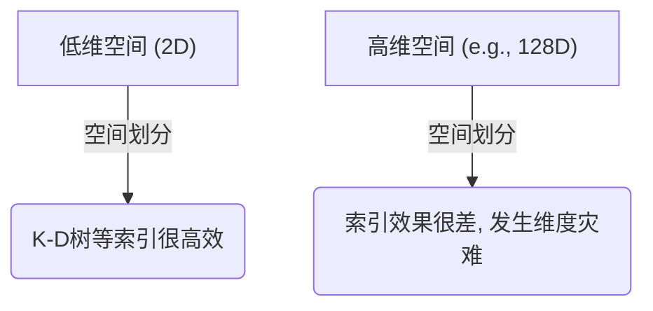
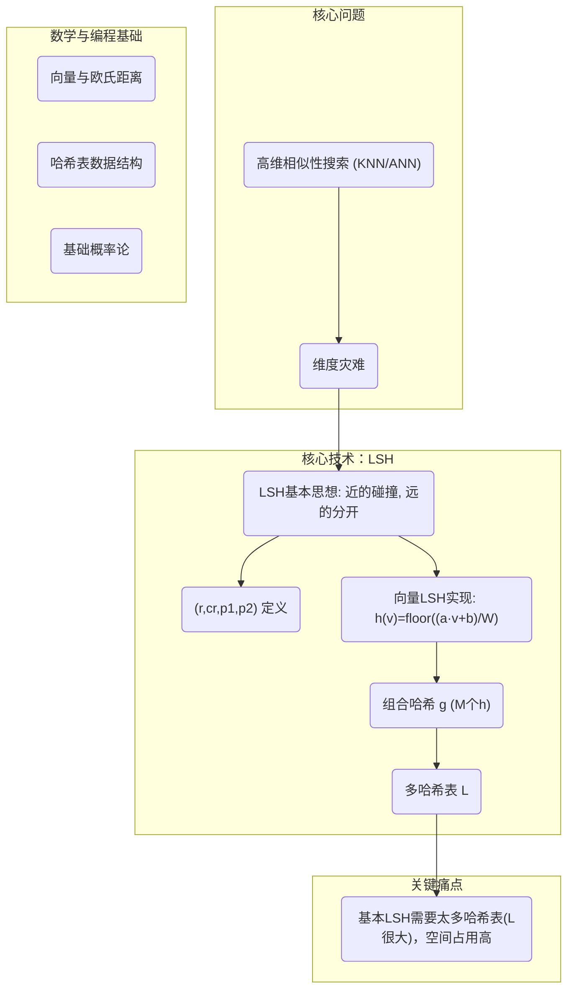
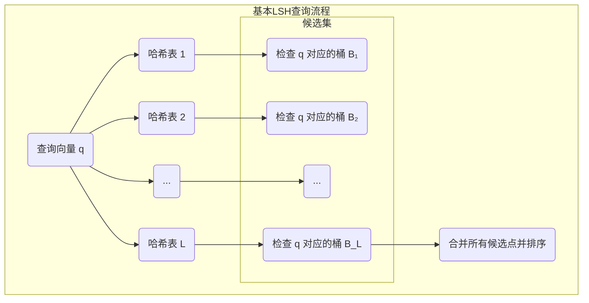
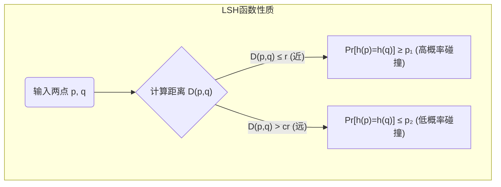
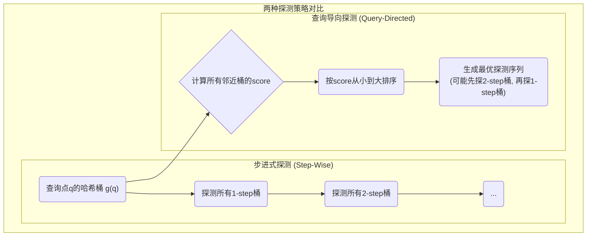

## AI论文解读 | Multi-Probe LSH: Efficient Indexing for High-Dimensional Similarity Search
        
### 作者        
digoal        
        
### 日期        
2025-06-23        
        
### 标签        
PostgreSQL , PolarDB , DuckDB , AI , 论文解读        
        
----        
        
## 背景       
      
https://www.cs.princeton.edu/cass/papers/mplsh_vldb07.pdf        
  
      
提示:        
```        
读懂《Multi-Probe LSH: Efficient Indexing for High-Dimensional Similarity Search》这篇论文需要提前掌握哪些基础知识, 请使用中文给我讲一下这些基础知识, 尽量通熟易懂, 可以使用markdown支持的图形增加解释性.        
        
使用中文通熟易懂的解读《Multi-Probe LSH: Efficient Indexing for High-Dimensional Similarity Search》这篇论文, 关键内容请深入讲解, 可以使用markdown支持的图形增加解释性.        
        
使用中文提取《Multi-Probe LSH: Efficient Indexing for High-Dimensional Similarity Search》论文中一些重要的术语并详细解释, 可以使用markdown支持的图形示增加解释性.        
```        
        
## 1 前置知识 
  
好的，为了能透彻理解《Multi-Probe LSH》这篇论文，你需要先掌握一些核心的基础概念。这篇论文的目标是提出一种更高效的索引方法，来解决在高维空间里寻找相似数据点的问题。

以下我将为你梳理这些必备的知识点，并用通俗易懂的语言和图示来解释。

### 1\. 核心问题：高维相似性搜索 (High-Dimensional Similarity Search)

这是整篇论文要解决的根本问题。

  * **是什么**：想象一下你的手机里有成千上万张照片。当你选择一张猫的照片，想要“查找相似图片”时，系统就需要从海量图片中，找出所有和这张猫最像的图片。这就是相似性搜索。
  *  **高维 (High-Dimensional)**：计算机无法直接“看懂”图片。它会把每张图片转换成一个由很多数字组成的列表（即**特征向量**），比如用64个数字来描述一张图的颜色分布、纹理等信息   。这个列表的长度（64）就是维度。在很多应用中，这个维度可能高达数百甚至数千  ，这就是“高维”。
  *  **如何衡量“相似”**：在数学上，两个特征向量的“相似度”通常用它们之间的**距离**来衡量，最常用的是**欧几里得距离**（也就是我们初中学的两点间直线距离公式） 。距离越近，就代表越相似。

 所以，核心问题可以概括为：**给定一个查询向量（比如你的猫），如何在一个包含海量高维向量的数据集中，快速找到距离它最近的 K 个向量（K-Nearest Neighbors, KNN）** 。

### 2\. 传统方法的困境：“维度灾难” (Curse of Dimensionality)

 你可能会想，给数据排个序不就行了？或者用一些数据结构来加速查找，比如像R树、K-D树这样的索引  。

  *  **问题所在**：这些传统方法在低维空间（比如2维或3维）表现很好。但在高维空间里，它们会变得比最笨的“线性扫描”（即把数据集里每个点都比较一遍）还要慢  。
  * **原因（维度灾难）**：在高维空间里，数据点之间的距离会变得非常“相似”（大部分点都离得很远），空间的体积增长速度远超数据点的增长速度。这使得基于空间划分的索引方法（如K-D树）失去了效率，因为查询一个点几乎需要访问索引的每一个角落。




 因为传统精确查找的方法在高维失效了，所以研究者们转向了**近似最近邻 (Approximate Nearest Neighbors, ANN)** 的方法   ，即不要求找到100%准确的最近邻，只要找到的足够接近（比如在真正最近邻距离的1.1倍以内）就可以了  。

### 3\. 核心技术：局部敏感哈希 (Locality Sensitive Hashing, LSH)

 LSH 是解决高维近似最近邻搜索问题的最著名方法之一  ，也是理解本篇论文的**最最关键**的基础。

  *  **核心思想**：LSH的设计目标和普通的哈希函数（比如用于密码存储的MD5）相反。普通哈希要求输入哪怕只变动一点点，输出也要千差万别。而LSH追求的是：**相似（距离近）的输入能以高概率哈希到同一个“桶”（bucket）里，而不相似（距离远）的输入则以高概率哈希到不同的桶里**  。

  * **正式定义**：一个哈希函数族被称为 `(r, cr, p1, p2)`-敏感的，如果：

      *  对于任意两个点 `p` 和 `q`，如果它们的距离 `D(p,q) ≤ r`（可视为“近”），那么它们哈希值相同的概率 `Pr[h(q)=h(p)] ≥ p1`（一个较高的概率） 。
      *  如果它们的距离 `D(p,q) > cr`（可视为“远”，`c>1`），那么它们哈希值相同的概率 `Pr[h(q)=h(p)] ≤ p2`（一个较低的概率） 。
      *  关键在于 `p1 > p2`  。

  *  **LSH 如何处理向量**：论文中使用的LSH函数形式为 $h\_{a,b}(v)=\\lfloor\\frac{a\\cdot v+b}{W}\\rfloor$  。我们可以这样理解它的工作流程：
  
1\.  **投影**：`a · v` 是将高维向量 `v` 投影到一条随机的直线 `a` 上。这是一个降维的过程。空间中原本离得很近的点，投影到直线上后，大概率也离得很近。  
2\.  **分段**：将这条无限长的直线，切成等宽为 `W` 的小线段，并给它们编号（0, 1, 2, ...）。  
3\.  **取整**：`⌊...⌋` 符号就是取整，它的作用是看投影点落在了哪个编号的线段上。这个编号就是哈希值。  
  
    
  
```
<-- 高维空间中的点 -->                <-- 投影到一条直线上 -->

     q ●                                  q'
                                          ●
     p ●                                  p'
                                          ●

x ●                                                      x'
                                                          ●

====================== 投影线 a ======================>
...|--- bucket 0 ---|--- bucket 1 ---|--- bucket 2 ---|...
```
  
从上图可以看出，相近的点 `p` 和 `q` 投影后 `p'` 和 `q'` 也很可能落在同一个桶（bucket）里，而远处的点 `x` 投影后 `x'` 则很可能落在别的桶里。

  * **基本LSH索引的构建**：

    1.   **增强哈希函数 `g`**：单个 `h` 函数不够可靠。因此，我们会选取 `M` 个不同的 `h` 函数，把它们的结果串联起来，形成一个组合哈希键 `g(v) = (h₁(v), h₂(v), ..., h_M(v))`   。这样一来，两个点只有在 `M` 个哈希函数下的结果**完全一样**时，才会被认为碰撞到了同一个桶里。这大大降低了不相似的点被错误分到一桶的概率  。
    2.   **构建多个哈希表 `L`**：但上述操作也降低了相似点碰撞的概率   。为了弥补这一点，我们独立地重复这个过程 `L` 次，构建 `L` 个完全不同的哈希表  。
    3.   **查询过程**：当一个查询点 `q` 到来时，我们计算它在 `L` 个哈希表里分别对应的 `L` 个哈希桶，然后将这 `L` 个桶里所有的点集合起来作为候选集   。最后，我们只在这个小得多的候选集里计算精确距离，找出最近的K个点  。

  *  **基本LSH的缺点**：为了保证查得全（高召回率），`L` 的值通常需要非常大，比如几百个   。每个哈希表的大小又和数据集规模成正比   ，这就导致了巨大的**空间占用**，这也是本篇论文要解决的核心 drawback  。

### 4\. 论文中其他对比方法的基础

  *  **Entropy-Based LSH**：这是在《Multi-Probe LSH》之前的一种改进方法。它的思路是，既然一个桶不够，那我干脆在查询点 `q` 周围随机生成一些“微扰”点 `p'`，然后把 `q` 和这些 `p'` 的哈希桶都查一遍   。这种方法能减少哈希表的数量，但随机生成微扰点效率不高，且可能重复探测同一个桶  。

### 总结：你需要掌握的知识图谱



掌握了以上这些知识点，你就可以很顺利地读懂这篇论文了。你会明白：

  *  论文提出的 **Multi-Probe LSH** 正是为了解决**基本LSH空间占用大**的问题  。
  *  它的核心思想是，我们不需要 `L` 个那么多的哈希表。我们可以在少数几个哈希表里，**智能地**、**系统地**探测查询点 `q` 所在桶**附近**的那些桶  。
  *  论文中提出的“步进式探测 (step-wise probing)”和“查询导向探测 (query-directed probing)”   就是实现这种“智能探测”的具体算法，它们旨在以最高效的方式找到最有可能包含最近邻的那些“邻居桶”。

希望这份梳理对你有所帮助！
  
## 2 解读论文 
  
好的，我们来一起深入解读这篇在工业界和学术界都非常有影响力的论文——《Multi-Probe LSH: Efficient Indexing for High-Dimensional Similarity Search》。

这篇论文的核心贡献是提出了一种名为 **Multi-Probe LSH** 的新方法，它极大地提升了局部敏感哈希（LSH）在空间使用上的效率，使其能够用更少的内存处理更大规模的数据。

-----

### 一、论文解决了什么问题？

 想象一下在海量图片库中“以图搜图”。计算机会将每张图片转换成一个高维特征向量（比如一个包含几百个数字的列表） 。当你想搜索一张相似图片时，系统需要在数百万甚至上亿的向量中，找到和你的查询图片向量“距离”最近的那些。

**传统方法的困境：**

1.  **线性扫描**：最笨的方法，把数据库里每个向量都和你给的向量比对一遍。数据量大时，这会慢得无法接受。
2.   **树形索引（如 K-D 树）**：这些方法在低维（比如2、3维）时很高效，但在高维空间中会遭遇“维度灾难”——性能急剧下降，甚至比线性扫描还慢  。
3.   **基本LSH (Locality Sensitive Hashing)**：这是当时解决该问题最知名的技术   。但它有一个致命弱点：为了保证能找到足够多的相似项（即高召回率），它需要构建**非常多**的哈希表，有时多达几百个   。这导致了巨大的内存开销，限制了其在超大规模数据集上的应用  。

 **Multi-Probe LSH 的目标**：解决基本LSH空间占用过高的问题   。它希望在不显著增加查询时间的前提下，将哈希表的数量减少一个数量级以上  。

### 二、核心技术回顾：基本LSH是如何工作的？

要理解 Multi-Probe LSH 的精妙之处，必须先明白基本LSH的原理及其局限。

  *  **LSH函数**：一种特殊的哈希函数，能让距离近的向量有高概率映射到同一个“桶”，而距离远的向量则高概率映射到不同桶  。
  * **组合与多表**：
    1.   **增强哈希键 (g)**：将 `M` 个不同的LSH函数 `h` 组合成一个更长的哈希键 `g = (h₁, h₂, ..., h_M)`  。
    2.   **构建多表 (L)**：独立构建 `L` 个使用不同 `g` 函数的哈希表  。
  *  **查询**：给定一个查询向量 `q`，分别计算它在 `L` 个表中的哈希桶位置，然后将这 `L` 个桶里的所有数据点作为候选集，最后在候选集中进行精确的距离计算  。




 **局限性**：这种方法过于依赖“运气”——只有当近邻点和查询点 `q` 恰好落入同一个桶时才会被发现。为了增加这种“运气”，只能简单粗暴地增加表的数量 `L`，导致内存暴增  。

### 三、论文精髓：Multi-Probe LSH 的创新之处

Multi-Probe LSH 的核心思想是：**我们不需要那么多张桌子（哈希表），我们可以在一张桌子上更聪明地寻找**。

 与其在每个表中只检查一个桶，不如去探索查询点所在桶**附近**的那些桶，因为近邻点很大概率就藏在这些“隔壁邻居”里  。

**如何定义“附近”的桶？**
 论文引入了“哈希摄动向量” $\\Delta = (\\delta\_1, \\delta\_2, ..., \\delta\_M)$   。如果查询 `q` 的哈希键是 `g(q)`，那么Multi-Probe LSH会去探测 `g(q) + \Delta` 所指向的桶   。由于LSH函数的特性，近邻点的哈希值与查询点的哈希值很可能只相差1（+1或-1），因此论文将 `δ_i` 的取值限定在 `{-1, 0, 1}` 中  。

论文提出了两种探测策略：

#### 1\. 步进式探测 (Step-Wise Probing) - 简单但不够优

这种方法非常直观：

  *  **1-step**：先探测所有只在一个哈希值上不同的桶（例如 $\\Delta = (0, 1, 0, ..., 0)$） 。
  *  **2-step**：然后探测所有在两个哈希值上不同的桶（例如 $\\Delta = (0, 1, -1, ..., 0)$） 。
  * 以此类推。

 **缺点**：这种方法是盲目的。它假设所有1-step的桶都比2-step的桶更“有希望”，但事实并非如此。一个精心选择的2-step桶可能比一个随意的1-step桶包含近邻的概率更高  。

#### 2\. 查询导向探测 (Query-Directed Probing) - 论文的核心算法

这是本文最精彩的部分，它提出了一种**基于概率**的智能探测方法。

**核心思想**：不是所有哈希位置的重要性都一样。一个点投影到LSH直线上的位置，决定了它有多大概率会和邻居“分家”。

```
<------------------- LSH 投影后的一维直线 ------------------->
          |        slot (h(q)-1)       |        slot (h(q))       |        slot (h(q)+1)       |
          |                            |                          |                            |
边界<------|----------------------------|------------●-------------|----------------------------|------>边界
                                                    f(q)
                                       <-- x(-1) --> <--- x(1) --->
```

  *  如图所示，`f(q)` 是查询向量 `q` 投影后的位置   。它离右边边界的距离是 `x(1)`，离左边边界的距离是 `x(-1)`  。
  * 直觉上，如果 `f(q)` 非常靠近右边边界（即 `x(1)` 很小），那么它的近邻点就很有可能跨过边界，掉进右边的桶 `h(q)+1` 里。
  *  论文推导出，一个摄动 $\\Delta$ 能找到近邻的概率，与一个**分数 (score)** 成反比，这个分数定义为： $score(\\Delta) = \\sum\_{i=1}^{M} x\_i(\\delta\_i)^2$  。
  *  **分数越小，意味着这个探测方向的成功率越高**  。

**智能探测序列的生成**：
该方法的目标就是按照 `score` 从小到大的顺序生成探测序列。

1.  **计算基础值**：对于查询 `q` 和一个哈希表中的 `M` 个LSH函数，计算出 $2 \\times M$ 个基础距离值（每个 $x\_i(1)$ 和 $x\_i(-1)$）。
2.  **排序**：将这 $2 \\times M$ 个距离值从小到大排序。
3.   **动态生成序列**：论文设计了一个巧妙的算法（Algorithm 1），使用最小堆（min-heap）数据结构，从分数最小的摄动开始，通过`shift`和`expand`操作，高效地、按顺序地生成一系列分数递增的探测序列，而无需预先计算所有可能的组合  。

 **优化**：为了进一步减少查询时的计算开销，论文还提出可以**预计算**一个通用的探测序列   。这个序列是基于 `score` 的期望值 $E[z\_j^2]$ 生成的，与具体查询无关   。查询时，只需将这个预计算好的序列应用到具体的查询向量上即可，避免了动态维护最小堆的开销  。

### 四、实验结果有多惊人？

实验结果有力地证明了 Multi-Probe LSH 的巨大优势。

  * **空间效率**：

      * **vs.  基本LSH**：在达到相同搜索质量（例如90%的召回率）时，Multi-Probe LSH 所需的哈希表数量比基本LSH**减少了14到18倍**   。这意味着用同样的内存，Multi-Probe LSH 可以索引的数据量是基本LSH的十几倍  。
      * **vs.  Entropy-Based LSH**：也比之前的改进方法（Entropy-LSH）要好得多，哈希表数量减少5到8倍，同时查询速度更快  。

  * **时间效率与探测效率**：

      *  **查询导向 vs. 步进式**：查询导向探测比步进式探测效率高得多，达到同样的搜索质量，前者需要的探测次数要少一个数量级   。这是因为它会优先探测那些“高价值”的桶，哪怕它们是2-step甚至3-step的  。
      * **vs.  Entropy-Based LSH**：Entropy-LSH 的随机探测会产生大量重复，实验中发现超过70%甚至90%的探测都是无效的重复工作   。而 Multi-Probe LSH 的探测序列经过精心设计，从不重复探测同一个桶  。

### 五、结论与启示

这篇论文的贡献是里程碑式的：

1.   **提出了Multi-Probe LSH**，一种通过智能探测邻近桶来大幅提升LSH空间效率的方法  。
2.   **设计了Query-Directed Probing**，一种基于概率模型的高效探测算法，远优于朴素的步进式方法  。
3.  **实现了数量级的提升**：它将LSH方法的内存需求降低了超过一个数量级，使得在高维空间中对海量数据进行相似性搜索变得更加实用和经济。

总而言之，《Multi-Probe LSH》通过一个“聪明的探测”思想，巧妙地解决了基本LSH算法的“笨拙”和空间浪费问题，是高维索引领域一个既深刻又实用的重大突破。
  
## 3 术语  
  
好的，这里是论文《Multi-Probe LSH: Efficient Indexing for High-Dimensional Similarity Search》中的一些重要术语及其详细解释。

-----

### 1\. 局部敏感哈希 (Locality Sensitive Hashing, LSH)

这是整篇论文所基于的核心技术。

  *  **定义**：LSH是一种特殊的哈希技术，它的核心思想是：让原始空间中距离相近的点，能够以很高的概率被哈希到同一个“桶”中；而距离较远的点，则以很高的概率被哈希到不同的桶中  。这与传统密码学中的哈希函数（要求输入微小的变化导致输出巨大的不同）正好相反。
  *  **作用**：它是解决高维空间中近似最近邻搜索问题最著名的方法   。通过将海量数据点哈希到不同的桶里，查询时我们只需要将被查询点哈希到的那个桶里的少量数据作为候选集进行比较，从而极大地缩小了搜索范围，提高了效率  。

### 2\. (r, cr, p₁, p₂)-敏感哈希函数

 这是对LSH函数家族性质的数学化和形式化定义  。

  * **定义**：对于一个哈希函数族 `H`，如果对于任意两个数据点 `q` 和 `p`，满足以下条件，则称其为 `(r, cr, p₁, p₂)`-敏感的：
      *  如果它们的距离 `D(q,p) ≤ r`（即它们“很近”），那么它们哈希值相同的概率 `Pr[h(q)=h(p)] ≥ p₁`（一个**较高**的概率） 。
      *  如果它们的距离 `D(q,p) > cr`（其中`c>1`，即它们“很远”），那么它们哈希值相同的概率 `Pr[h(q)=h(p)] ≤ p₂`（一个**较低**的概率） 。
  *  **关键**：`p₁ > p₂` 是LSH能够区分远近点的根本保证  。这个性质使得哈希碰撞本身就携带了数据点之间距离远近的信息。




### 3\. 基本LSH索引 (Basic LSH Indexing)

这是Multi-Probe LSH所要改进的基准方法。

  *  **定义**：这是一种使用LSH函数构建索引的经典方法  。它通过两个关键步骤来增强LSH的效果：
    1.   **组合M个h函数**：为了降低远处点被错误地哈希到一桶的概率，它将 `M` 个独立的LSH函数 `h` 的结果连接起来，形成一个更鲁棒的组合哈希键 `g(v) = (h₁(v), ..., h_M(v))`  。
    2.   **构建L个哈希表**：为了提高近处点被成功哈希到一桶的概率，它独立地构建 `L` 个这样的哈希表，每个表使用不同的 `g` 函数  。
  *  **缺点**：为了达到理想的搜索质量，`L` 的值通常需要非常大（比如几百个   ），这导致了巨大的内存占用和空间浪费  。

### 4\. 哈希摄动向量 (Hash Perturbation Vector, Δ)

这是Multi-Probe LSH实现“探测邻近桶”这一核心思想的工具。

  *  **定义**：它是一个M维向量，`Δ = (δ₁, ..., δ_M)`  。
  *  **作用**：当查询点 `q` 的哈希键为 `g(q)` 时，基本LSH只查找 `g(q)` 指向的桶   。而Multi-Probe LSH则会应用这个摄动向量，去探测 `g(q) + Δ` 指向的桶   。由于论文中使用的LSH函数特性，相似点很可能哈希到相邻的整数值上，因此 `δᵢ` 的取值被限定在 `{-1, 0, 1}` 之间   。这样可以直接通过哈希值的加减法来定位邻近桶，避免了重新计算哈希值的开销  。

### 5\. 步进式探测 (Step-Wise Probing)

这是Multi-Probe LSH提出的一种较为简单的探测策略。

  *  **定义**：该方法基于一个直观的假设：与查询桶只差一步（1-step）的桶比差两步（2-step）的桶更可能包含近邻  。
  * **流程**：
    1.  首先，探测所有1-step的桶（即只有一个 `δᵢ` 非零）。
    2.  然后，探测所有2-step的桶（即只有两个 `δᵢ` 非零）。
    3.   以此类推，逐级向外探测  。
  *  **评价**：虽然直观，但实验证明它并非最优，因为它忽略了不同哈希位置的内在概率差异  。

### 6\. 查询导向探测 (Query-Directed Probing)

这是论文提出的更先进、更高效的探测策略，也是Multi-Probe LSH性能优越的关键。

  *  **定义**：这是一种不盲目按“步数”远近，而是根据“成功概率”高低来决定探测顺序的智能策略   。它认为，一个桶是否值得被探测，取决于查询点 `q` 在每个LSH投影轴上的具体位置  。
  * **核心思想**：
      *  对于每个LSH函数 `hᵢ`，查询点 `q` 在投影轴上距离其所在“槽”的边界越近，其近邻点就越有可能“跨界”掉入旁边的槽里  。
      *  该方法为每一个可能的摄动 `Δ` 计算一个分数 `score(Δ)`，这个分数与 `q` 到目标桶边界距离的平方和相关  。
      *  `score(Δ)` 越小，代表找到近邻的概率越高。因此，该策略会优先探测 `score` 最小的那些桶  。
  *  **效果**：实验表明，这种方法远比步进式探测高效，能用少得多的探测次数达到相同的搜索质量  。




### 7\. 召回率 (Recall)

这是论文中衡量搜索算法好坏（即搜索质量）的主要指标。

  *  **定义**：它衡量的是“算法找回的真实近邻”占“所有真实近邻”的比例  。 $Recall = \\frac{|A(q) \\cap I(q)|}{|I(q)|}$ 其中，`I(q)` 是理想的答案集合（即真正的K个最近邻），`A(q)` 是算法返回的答案集合  。 
  *  **解读**：召回率越接近1.0，说明算法查得越全，搜索质量越高  。例如，召回率为0.9意味着在真正的10个最近邻中，算法成功找到了9个。
  
## 参考        
         
https://www.cs.princeton.edu/cass/papers/mplsh_vldb07.pdf  
        
        
<b> 以上内容基于DeepSeek、Qwen、Gemini及诸多AI生成, 轻微人工调整, 感谢杭州深度求索人工智能、阿里云、Google等公司. </b>        
        
<b> AI 生成的内容请自行辨别正确性, 当然也多了些许踩坑的乐趣, 毕竟冒险是每个男人的天性.  </b>        
  
  
  
#### [期望 PostgreSQL|开源PolarDB 增加什么功能?](https://github.com/digoal/blog/issues/76 "269ac3d1c492e938c0191101c7238216")
  
  
#### [PolarDB 开源数据库](https://openpolardb.com/home "57258f76c37864c6e6d23383d05714ea")
  
  
#### [PolarDB 学习图谱](https://www.aliyun.com/database/openpolardb/activity "8642f60e04ed0c814bf9cb9677976bd4")
  
  
#### [PostgreSQL 解决方案集合](../201706/20170601_02.md "40cff096e9ed7122c512b35d8561d9c8")
  
  
#### [德哥 / digoal's Github - 公益是一辈子的事.](https://github.com/digoal/blog/blob/master/README.md "22709685feb7cab07d30f30387f0a9ae")
  
  
#### [About 德哥](https://github.com/digoal/blog/blob/master/me/readme.md "a37735981e7704886ffd590565582dd0")
  
  

  
