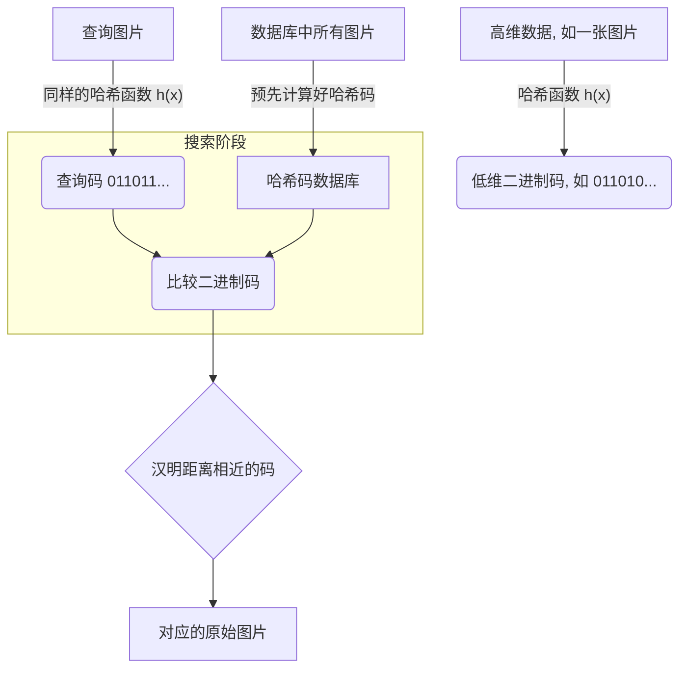
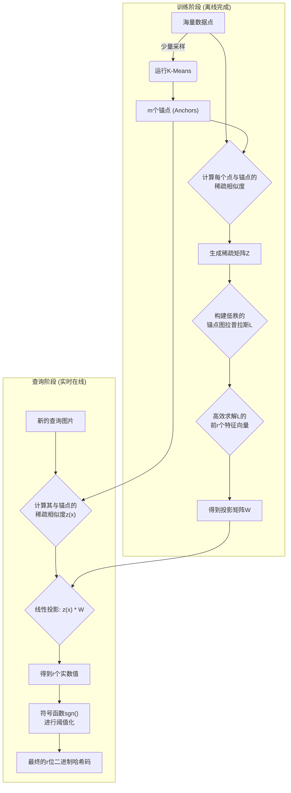

## AI论文解读 | Hashing with Graphs
        
### 作者        
digoal        
        
### 日期        
2025-06-23        
        
### 标签        
PostgreSQL , PolarDB , DuckDB , AI , 论文解读        
        
----        
        
## 背景       
      
http://www.icml-2011.org/papers/6_icmlpaper.pdf        
  
      
提示:        
```        
读懂《Hashing with Graphs》这篇论文需要提前掌握哪些基础知识, 请使用中文给我讲一下这些基础知识, 尽量通熟易懂, 可以使用markdown支持的图形增加解释性.        
        
使用中文通熟易懂的解读《Hashing with Graphs》这篇论文, 关键内容请深入讲解, 可以使用markdown支持的图形增加解释性.        
        
使用中文提取《Hashing with Graphs》论文中一些重要的术语并详细解释, 可以使用markdown支持的图形示增加解释性.        
```        
        
## 1 前置知识 

好的，为了完全理解《Hashing with Graphs》这篇论文，你需要掌握一些横跨机器学习、线性代数和图论的基础知识。下面我将为你逐一讲解这些概念，力求通俗易懂，并使用Markdown来辅助说明。

这篇论文的核心思想是：**利用图（Graph）来发现数据内在的邻近结构，然后基于这个图结构来学习出高质量的哈希码，从而实现快速的近邻搜索。**

要理解这个过程，你需要先了解以下几个基石：

### 1\. 基础问题：什么是哈希和近邻搜索？

#### 知识点：

  * **近邻搜索 (Nearest Neighbor Search, NN)**: 想象一个巨大的图片数据库。给你一张新的图片（查询图片），让你在数据库里找到和它最像的几张。这个“寻找最像”的过程就是近邻搜索。
  *  **“维度灾难” (Curse of Dimensionality)**: 当数据维度很高时（例如，一张图片有成千上万个像素点），计算距离变得非常缓慢，而且距离的“意义”也可能下降    。直接遍历整个数据库来计算距离（线性扫描）是不现实的  。
  *  **近似近邻搜索 (Approximate Nearest Neighbor, ANN)**: 既然精确查找那么慢，我们退而求其次，找一些“足够像”但不一定“最像”的邻居。这通常能极大地提升搜索速度   。
  *  **哈希 (Hashing)**: 这是一种实现ANN的流行技术    。它的核心思想是设计一个“哈希函数”，把高维的、复杂的数据（如图片、文档）转换成一个短小的二进制码（比如一个64位的01字符串）   。

#### 为什么对理解论文重要？

 这篇论文的出发点就是要解决大规模、高维度数据下的**快速近邻搜索**问题   。它提出的`Anchor Graph Hashing (AGH)`就是一种新的、高效的**哈希**方法   。

**可以这样理解：**



通过比较简短的二进制码（计算汉明距离，即对应位不同的数量）要比直接比较高维原始数据快得多。

### 2\. 核心思想：为什么要用“图”？

#### 知识点：

  *  **流形学习 (Manifold Learning)**: 很多现实世界的高维数据，其内在结构其实是低维的。比如，一系列不同角度拍摄的同一个物体的照片，虽然每张照片的像素数据构成的维度很高，但它们本质的变化（即拍摄角度）可能只是一个二维或三维的流形  。
  *  **图 (Graph)**: 在机器学习中，我们可以用图来描述数据点之间的关系。每个数据点是一个**节点 (Node)**，如果两个数据点很相似，就在它们之间连一条**边 (Edge)**，边的权重可以表示相似程度。这样构建出的图，可以很好地近似数据所在的低维流形结构  。

#### 为什么对理解论文重要？

 传统哈希方法（如LSH）通常假设数据是均匀分布的，但这忽略了数据内在的流形结构   。这篇论文最大的创新点就在于，它认为**应当首先发现数据本身的邻域结构（即流形），然后基于这个结构去学习哈希函数**   。这个邻域结构就是通过构建一个**图**来体现的。好的图能告诉你哪些点是“真正”的邻居，即便它们在原始高维空间中的欧式距离不一定是最近的。

**可视化解释：**
想象一下“瑞士卷”数据。A点和B点在三维空间中的直线距离（欧式距离）很远，但如果沿着数据所在的二维卷曲面（流形）去看，它们其实是邻居。构建一个只连接“表面上”邻近点的图，就能发现A和B的真实关系。

### 3\. 关键数学工具：谱图理论

#### 知识点：

  *  **邻接矩阵 (Adjacency Matrix, $A$)**: 一个方阵，如果节点 $i$ 和节点 $j$ 之间有边，则矩阵元素 $A\_{ij}$ 为边的权重（相似度）；否则为0   。
  * **度矩阵 (Degree Matrix, $D$)**: 一个对角矩阵， $D\_{ii}$ 的值是所有与节点 $i$ 相连的边的权重之和。
  *  **图拉普拉斯矩阵 (Graph Laplacian, $L$)**: 这是谱图理论的核心，定义为 $L = D - A$   。拉普拉斯矩阵是一个半正定矩阵，它包含了图的全部结构信息。
  *  **特征值和特征向量 (Eigenvalues & Eigenvectors)**: 拉普拉斯矩阵的特征向量揭示了图的结构特性。特别是，与最小的非零特征值对应的特征向量，可以最优地将图分割成两个部分。这个过程被称为**谱聚类**或**图分割**  。

#### 为什么对理解论文重要？

这篇论文的哈希方法本质上就是一种**图分割**。它希望找到一些切分方式，将相似的点分到同一边，不相似的点分到不同边。

1.   论文的目标是最小化 $\\sum\_{i,j=1}^{n}{||Y\_i - Y\_j||^2 A\_{ij}}$   。这个公式的含义是：如果两个点 $x\_i$ 和 $x\_j$ 很相似（即 $A\_{ij}$ 很大），我们希望它们的哈希码 $Y\_i$ 和 $Y\_j$ 也尽可能一样，这样 $||Y\_i - Y\_j||^2$ 就接近0，使得总和最小。
2.   这个最小化问题经过数学推导，等价于求解**图拉普拉斯矩阵 $L$ 的最小特征值对应的特征向量**   。
3.   得到这些特征向量后，通过一个简单的**阈值操作**（例如，大于0的映为1，小于0的映为-1）就可以得到最终的二进制哈希码   。

所以，整个过程可以概括为：
**数据点 → 构建图 → 计算图拉普拉斯矩阵L → 求解L的特征向量 → 阈值化得到哈希码**

### 4\. 解决计算瓶颈的关键技术

 直接在N个数据点上构建图并计算特征向量，计算复杂度是 $O(N^2)$，对于百万级数据是不可行的  。为了解决这个问题，论文引入了几个关键技术：

#### 知识点：

  * **K-均值聚类 (K-Means Clustering)**: 一种快速的无监督学习算法，能将数据分成 K 个簇。
  *  **锚点图 (Anchor Graphs)**: 这是论文的核心贡献之一    。它的思想是不直接计算所有N个数据点两两之间的相似度，而是先选出少量（m个，m \<\< N）的**锚点 (Anchors)**（通常用K-Means的聚类中心来当锚点    ），然后所有数据点都只计算和这m个锚点的相似度。两点之间的相似度通过它们与锚点的关系来**间接**表示  。
  *  **低秩近似 (Low-Rank Approximation)**: 通过锚点图方法构建出的邻接矩阵 $\\hat{A}$ 具有**低秩**特性（秩最多为m）   。这意味着这个巨大的 $N \\times N$ 矩阵可以用几个小得多的矩阵来表示和计算，从而极大地降低了计算和存储开销。这使得特征向量的求解时间从 $O(N^2)$ 级别降到了线性时间 $O(N)$   。
  *  **Nyström 方法**: 当我们为训练数据生成了哈希码之后，还需要一个能为**新来的查询点**（out-of-sample）快速生成哈希码的函数。Nyström方法是一种经典技术，可以将只在样本点上定义的特征向量**推广**成一个适用于任何新数据点的连续函数（称为特征函数, eigenfunction）   。论文证明了对于锚点图，这个推广过程的计算时间是常数级别的，非常快   。

### 总结

为了读懂这篇论文，你需要搭建如下的知识体系：

1.  **理解目标**：知道论文是为了解决大规模数据下的**快速近似近邻搜索**问题，而**哈希**是主要手段。
2.  **理解核心哲学**：明白数据通常存在于**低维流形**上，用**图**来描述数据的内在结构比直接用欧式距离更合理。
3.  **理解数学原理**：掌握**图拉普拉斯矩阵**及其**特征向量**如何用于图分割，并理解这为什么能被用来生成好的哈希码。
4.  **理解技术创新**：了解论文如何使用**锚点图 (Anchor Graphs)** 和**低秩近似**来克服传统谱方法 $O(N^2)$ 的计算瓶颈，并用 **Nyström 方法**解决了新样本的哈希码生成问题。

掌握了这些，你就能清晰地理解论文的动机、方法、以及它相比于之前工作的优越性。
  
## 2 解读论文 
  
好的，我们来一起深入解读这篇在哈希学习领域具有重要影响的论文——《Hashing with Graphs》。

这篇论文的核心是解决一个经典难题：如何在大规模数据库中（例如，百万、千万级的图片库）快速且准确地找到与查询项最相似的内容。作者提出了一种名为**锚点图哈希（Anchor Graph Hashing, AGH）** 的新方法，它巧妙地利用图结构来捕捉数据内在的关联性，从而生成高质量、紧凑的二进制哈希码。

-----

### 1\. 问题背景：为什么需要更好的哈希方法？

首先，我们得知道传统的“大海捞针”为什么行不通。

  *  **线性扫描的无奈**：最直接的方法是拿查询项和数据库里的每一项都比对一遍    。但在百万级数据面前，这种线性扫描的速度慢得无法接受   。
  *  **传统索引的瓶颈**：像kd树这样的树形结构方法，在数据维度很低时表现良好，一旦维度升高（这在图像、文本等领域是常态），它们的性能会急剧下降，甚至不如线性扫描   。
  *  **哈希的兴起与挑战**：哈希方法应运而生，它通过一个哈希函数将高维数据映射成一个短小的二进制码（例如 `101100...`）   。这样，我们只需要比较二进制码（计算汉明距离），速度极快   。
      *  **挑战1：如何学习“好”的哈希码？** 早期的哈希方法（如LSH）是数据独立的，通常需要很长的哈希码才能保证精度，这又会导致存储和查询效率问题   。
      *  **挑战2：如何理解数据的“真实”结构？** 多数方法都基于一个全局的距离度量（如欧氏距离），但现实世界的数据往往分布在一个复杂的低维流形上  。这意味着，有些数据点在原始高维空间里看着很远，但在其内在的“数据表面”上其实是近邻。

 这篇论文正是为了解决以上挑战，特别是第二个挑战，提出了一种能自动发现并利用数据内在邻域结构的新方法  。

### 2\. 核心思想：让图来告诉我们谁是邻居

论文的出发点非常直观：**要生成好的哈希码，首先要准确地知道数据点之间的邻里关系。** 而“图”（Graph）正是描述这种关系的最佳工具。

整个方法的目标可以概括为：

>  将数据点嵌入到一个汉明空间（二进制码空间），使得在原始数据空间中的邻居，在汉明空间中依然是邻居   。

 数学上，这个目标被描述为最小化一个目标函数： $tr(Y^{\\top}LY)$   。

  * $Y$ 是我们想要求的 $n \\times r$ 维的二进制码矩阵（n个数据，r位编码）。
  * $L$ 是**图拉普拉斯矩阵**，它由数据的邻接（相似度）矩阵 $A$ 派生而来。
  * 这个公式的直观含义是：如果两个数据点 $i$ 和 $j$ 非常相似（即 $A\_{ij}$ 值很大），我们希望它们的哈希码 $Y\_i$ 和 $Y\_j$ 也完全相同，这样它们的差值为0，对总和的贡献也为0。通过最小化这个总和，我们就迫使相似的样本获得相同的哈希码。

 然而，理想很丰满，现实很骨感。对于百万级的数据点（ $n$ 很大），直接构建这个图并求解是一个计算噩梦  。

### 3\. 关键创新：锚点图 (Anchor Graphs) —— 四两拨千斤

 为了解决构建图的巨大计算成本，论文提出了其核心创新——**锚点图 (Anchor Graphs)**   。这个想法堪称“四两拨千斤”。

**具体步骤如下：**

1.   **选取“锚点” (Anchors)**：首先，不去看所有N个数据点，而是只选择一小部分（例如300个）有代表性的点，称之为“锚点”    。这些锚点通常是通过对数据进行K-Means聚类得到的聚类中心   。
2.   **建立“数据-锚点”关系**：然后，让每一个数据点都只计算它和这少数几个锚点的相似度。具体来说，每个数据点只和它最近的 $s$ 个锚点（ $s$ 是一个很小的数，如2或5）建立连接    。这样，我们就得到了一个非常稀疏的“数据-锚点”关系矩阵 $Z$   。
3.   **近似完整图**：最后，利用这个稀疏的矩阵 $Z$ 来近似出完整的 $n \\times n$ 数据邻接矩阵 $\\hat{A}$    。关键在于，这个近似的邻接矩阵 $\\hat{A}$ 不需要显式地计算和存储，它始终以其**低秩**形式（ $Z\\Lambda^{-1}Z^{\\top}$ ）存在   。

**锚点图的巨大优势：**

  *  **快**：构建图的时间复杂度从 $O(n^2)$ 骤降到 $O(n)$，实现了线性扩展  。
  *  **省**：由于 $\\hat{A}$ 是低秩的（秩最多为锚点数m），后续求解图拉普拉斯特征向量的计算复杂度也大大降低，从依赖 $n$ 变为依赖小得多的 $m$  。

下面是整个方法的流程图：



### 4\. 核心技术：从图到可用的哈希函数

#### 4.1. 新样本的哈希（Out-of-Sample Extension）

 模型训练好后，必须能对任何一个新来的查询数据快速生成哈希码    。论文利用**Nyström方法**优雅地解决了这个问题    。它证明了，可以将离散的特征向量**泛化**为连续的特征函数 $\\phi\_k(x)$    。对于一个新数据点 $x$，其哈希码的计算过程非常简单：先计算它与锚点的相似度向量 $z(x)$，然后做一个线性投影 $w\_k^{\\top}z(x)$ 即可    。这个过程的计算量只与锚点数 $m$ 和哈希位数 $r$ 有关，与数据库大小 $n$ 无关，因此速度极快，是**常数时间**的  。

#### 4.2. 分层哈希（Hierarchical Hashing）—— 好钢用在刀刃上

 在实践中，人们发现图拉普拉斯矩阵的**高阶特征向量**对于图分割的效果可能并不好，其数值也不稳定，直接用来做哈希可能会引入误差  。

为了解决这个问题，论文提出了一种**分层哈希**的策略，可以理解为“好钢用在刀刃上”：

1.   **第一层**：不用 $r$ 个不同的特征向量生成 $r$ 位哈希码，而是只用最可靠的前 $r/2$ 个特征向量。通过简单的0值阈值化，生成前 $r/2$ 位哈希码   。
2.   **第二层**：对于这 $r/2$ 个特征向量中的每一个，不再简单地用0作为分界线，而是为已经分开的两部分数据（即第一层哈希值为1和-1的两组）**再次寻找新的、最优的分割阈值 $b^+$ 和 $b^-$**   。这个过程旨在修正第一层中可能出现的“边界错误”（比如两个非常相似的点恰好在0的两侧，被分开了）  。这样，每个特征向量都能贡献两位哈希码，总共得到 $r$ 位。

 这种分层策略（在论文中被称为2-AGH）充分利用了最稳定的低阶特征向量的信息，避免了使用不稳定的高阶向量，实验证明这能显著提高搜索的准确率和召回率  。

### 5\. 实验效果：全面超越当时最优方法

 论文在两个著名数据集 MNIST（手写数字）和 NUS-WIDE（网络图片）上进行了详尽的实验   。

  *  **性能惊人**：无论是单层（1-AGH）还是双层（2-AGH）的锚点图哈希，其性能都显著优于当时其他所有无监督哈希方法（如LSH, SH, KLSH等）  。
  *  **超越线性扫描**：在MNIST数据集上，2-AGH的平均精度（MAP）甚至超过了在原始像素空间进行暴力线性扫描的结果   。这证明了AGH学习到的哈希码成功捕捉到了比原始像素距离更有意义的**语义相似性**。
  *  **分层效果显著**：分层的2-AGH在精度和召回率上都稳定地优于单层的1-AGH，证明了该策略的有效性  。
  *  **对长编码友好**：许多哈希方法在编码变长后，由于汉明空间过于稀疏，性能会下降。但AGH不存在这个问题，其性能会随着编码变长而稳定提升   。

### 结论

《Hashing with Graphs》这篇论文提出了一个优雅、高效且可扩展的哈希学习框架。它的核心贡献在于：

1.   **思想上**，强调了利用数据内在的**流形结构**对于学习高质量哈希码的重要性   。
2.   **技术上**，引入**锚点图**来构建一个低秩的图近似，从而在保证精度的前提下，将图方法的计算复杂度从二次降为线性，解决了可扩展性难题   。
3.   **实践上**，提出的**分层哈希**策略进一步提升了编码质量，使得最终的算法在多个基准上取得了当时最先进的成果，甚至超越了暴力搜索，展示了其在语义检索方面的巨大潜力   。
  
## 3 术语  
  
好的，这是一份从《Hashing with Graphs》论文中提取的重要术语及其详细解释：

### 1. 最近邻搜索 (Nearest Neighbor Search - NN Search)

* **定义**: 最近邻搜索是一个基本问题，旨在从给定数据集中找到与查询点最相似的数据点。这在计算机视觉、机器学习、数据挖掘和信息检索等领域非常常见。
*  **挑战**: 对于大规模数据库（例如，数百万个项目），详尽的线性搜索时间复杂度为 $O(n)$，成本极高  。
*  **解决方案**: 为了解决这一问题，研究人员提出了许多快速近似最近邻（ANN）搜索技术   。

### 2. 局部敏感哈希 (Locality-Sensitive Hashing - LSH)

*  **定义**: LSH 是一种哈希方法，它使用简单的随机投影将数据映射到二进制代码   。它的核心思想是使相似的数据点在哈希后以高概率落入同一个“桶”中。
* **特点**:
    *  **数据独立**: LSH 的哈希函数是数据独立的，即它们在数据生成之前就已经确定   。
    *  **长代码需求**: 为了达到良好的精度，LSH 相关方法需要较长的二进制代码   。
    *  **召回率问题**: 长代码会导致哈希查找表的召回率较低，因为碰撞概率随代码长度呈指数下降   。
    *  **多哈希表**: 通常需要设置多个哈希表来获得合理的召回率，但这会增加查询时间和存储需求   。

### 3. 图拉普拉斯算子 (Graph Laplacian)

*  **定义**: 图拉普拉斯算子 $L$ 是图论中的一个重要矩阵，它反映了图的连通性。在论文中，它被定义为 $L=D-A$，其中 $D$ 是度矩阵（对角矩阵，对角线元素是对应节点的度）， $A$ 是相似度（或邻接）矩阵   。
*  **作用**: 论文中的哈希方法通过最小化 $tr(Y^{\top}LY)$ 来学习二进制代码，这意味着它试图在哈希空间中保持原始数据空间中的邻近关系   。
*  **挑战**: 构建基础图及其关联的拉普拉斯算子成本为 $O(dn^2)$，对于大型数据集来说是不可行的  。

### 4. 锚图 (Anchor Graphs)

*  **定义**: 锚图是一种使用少量“锚点”来近似数据邻域结构的方法    。它通过计算所有数据点与这些锚点之间的相似性来近似真实的邻接矩阵 $A$   。
* **构建过程**:
    1.   **锚点选择**: 使用 K-means 聚类从 $n$ 个数据点中获取 $m$ 个聚类中心作为锚点 ( $m \ll n$ )   。
    2.   **截断相似度**: 定义数据点 $x_i$ 与锚点 $u_j$ 之间的截断相似度 $Z_{ij}$。 $Z_{ij}$ 仅在 $u_j$ 是 $x_i$ 的 $s$ 个最近锚点之一时非零   。
* **优点**:
    *  **计算效率**: 锚图的构建时间成本为 $O(dmnT+dmn)$，其中 $T$ 是 K-means 迭代次数，远比构建 kNN 图的 $O(dn^2)$ 效率高  。
    *  **稀疏性和低秩性**: 得到的近似邻接矩阵 $\hat{A}$ 是非负、稀疏和低秩的（秩最多为 $m$）  。
    *  **内存效率**: 存储 $Z$ 矩阵的内存成本为 $O(sn)$   。
*  **近似邻接矩阵**: 锚图将邻接矩阵 $A$ 近似为 $\hat{A}=Z\Lambda^{-1}Z^{\top}$，其中 $\Lambda=diag(Z^{\top}1)$   。

### 5. 锚图哈希 (Anchor Graph Hashing - AGH)

*  **定义**: AGH 是一种新颖的基于图的哈希方法，它利用锚图自动发现数据中固有的邻域结构，以学习合适的紧凑代码  。
* **关键特性**:
    *  **处理流形结构**: 它能够捕捉真实世界数据存在的低维流形结构，这对于获取有意义的最近邻至关重要  。
    *  **常数时间哈希**: 通过将图拉普拉斯算子的特征向量外推到特征函数，实现新数据点的常数时间哈希  。
    *  **捕获语义邻域**: AGH 倾向于捕获语义邻域，即在 Hamming 空间中接近的数据点往往共享相似的语义标签  。
*  **哈希函数**: AGH 的哈希函数定义为 $h_k(x)=sgn(w_k^{\top}z(x))$   。
* **计算复杂性**:
    *  **训练阶段**: $O(dmnT+dmn+m^2n+(s+1)rn)$   。
    *  **测试阶段**: $O(dm+sr)$，主要由稀疏向量 $z(x)$ 的构建决定  。

### 6. 分层哈希 (Hierarchical Hashing)

*  **定义**: 分层哈希是一种生成多位代码的程序，其中每个特征函数产生多个位，从而提高搜索精度    。它通过对较低的图拉普拉斯特征向量进行优先级处理来生成多个位   。
*  **动机**: 较高的特征向量可能不适合哈希，并且将实值特征向量转换为整数解的误差会随着特征向量索引的增加而迅速累积  。
* **两层哈希**: 论文中提出了一种两层分层哈希方案。
    *  **第一层**: 使用阈值零对图进行分区，生成第一位哈希值 $h^{(1)}(x)=sgn(w_k^{\top}z(x))$  。
    *  **第二层**: 针对第一层可能出现的边界错误（例如，邻近点被哈希到不同的位），通过在 $b^{+}$ 和 $b^{-}$ 处设置阈值进一步划分分区来纠正这些错误，生成第二位哈希值 $h^{(2)}(x)$  。
*  **阈值优化**: 通过平衡图划分的视角来优化两个阈值 $b^{+}$ 和 $b^{-}$   。
*  **优点**: 2-AGH 相较于 1-AGH 表现出显著更好的性能，尤其是在召回率方面  。

### 7. 特征函数泛化 (Eigenfunction Generalization)

*  **定义**: 这是指将训练阶段学习到的图拉普拉斯特征向量推广到特征函数的能力，以便对任何未见过的数据点生成哈希代码  。
*  **方法**: 论文中使用了 Nyström 方法来实现这一泛化   。
*  **公式**: 对于任何样本 $x$，特征函数 $\phi_k(x)$ 可以表示为 $\phi_k(x)=w_k^{\top}z(x)$   。
*  **重要性**: 使得基于图的哈希方法在实际中可行，因为它允许为新点快速生成哈希代码  。

这些术语是理解《Hashing with Graphs》论文核心思想和贡献的关键。
  
## 参考        
         
http://www.icml-2011.org/papers/6_icmlpaper.pdf  
        
        
<b> 以上内容基于DeepSeek、Qwen、Gemini及诸多AI生成, 轻微人工调整, 感谢杭州深度求索人工智能、阿里云、Google等公司. </b>        
        
<b> AI 生成的内容请自行辨别正确性, 当然也多了些许踩坑的乐趣, 毕竟冒险是每个男人的天性.  </b>        
  
  
  
#### [期望 PostgreSQL|开源PolarDB 增加什么功能?](https://github.com/digoal/blog/issues/76 "269ac3d1c492e938c0191101c7238216")
  
  
#### [PolarDB 开源数据库](https://openpolardb.com/home "57258f76c37864c6e6d23383d05714ea")
  
  
#### [PolarDB 学习图谱](https://www.aliyun.com/database/openpolardb/activity "8642f60e04ed0c814bf9cb9677976bd4")
  
  
#### [PostgreSQL 解决方案集合](../201706/20170601_02.md "40cff096e9ed7122c512b35d8561d9c8")
  
  
#### [德哥 / digoal's Github - 公益是一辈子的事.](https://github.com/digoal/blog/blob/master/README.md "22709685feb7cab07d30f30387f0a9ae")
  
  
#### [About 德哥](https://github.com/digoal/blog/blob/master/me/readme.md "a37735981e7704886ffd590565582dd0")
  
  

  
