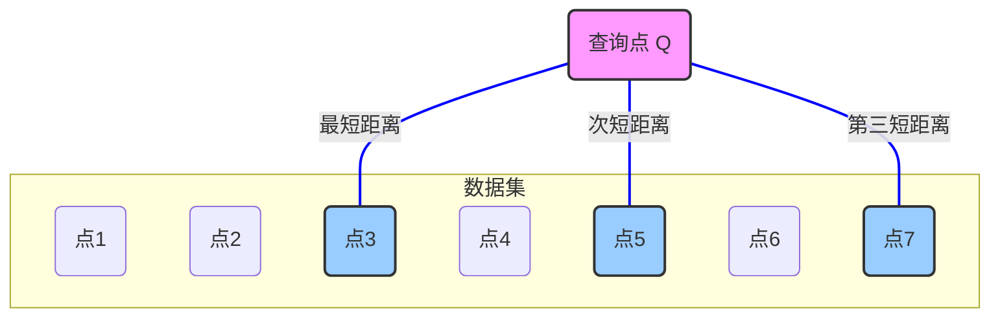
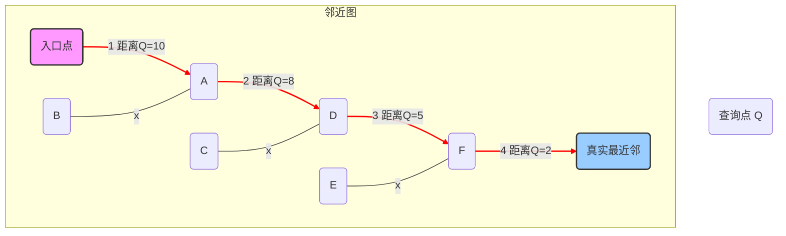
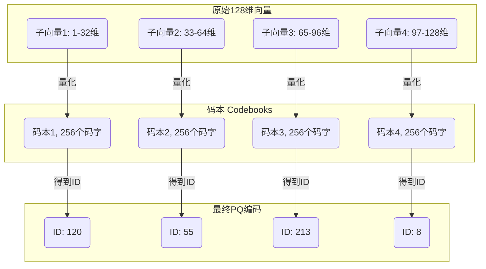

## AI论文解读 | Approximate Nearest Neighbor Search on High Dimensional Data — Experiments, Analyses, and Improvement (v1.0)
        
### 作者        
digoal        
        
### 日期        
2025-06-24        
        
### 标签        
PostgreSQL , PolarDB , DuckDB , AI , 论文解读        
        
----        
        
## 背景       
      
https://arxiv.org/pdf/1610.02455        
  
      
提示:        
```        
读懂《Approximate Nearest Neighbor Search on High Dimensional Data — Experiments, Analyses, and Improvement (v1.0)》这篇论文需要提前掌握哪些基础知识, 请使用中文给我讲一下这些基础知识, 尽量通熟易懂, 可以使用markdown支持的图形增加解释性.        
        
使用中文通熟易懂的解读《Approximate Nearest Neighbor Search on High Dimensional Data — Experiments, Analyses, and Improvement (v1.0)》这篇论文, 关键内容请深入讲解, 可以使用markdown支持的图形增加解释性.        
        
使用中文提取《Approximate Nearest Neighbor Search on High Dimensional Data — Experiments, Analyses, and Improvement (v1.0)》论文中一些重要的术语并详细解释, 可以使用markdown支持的图形示增加解释性.        
```        
        
## 1 前置知识 
  
好的，为了帮助您理解这篇关于高维近似近邻搜索（ANNS）的论文（*Approximate Nearest Neighbor Search on High Dimensional Data - Experiments, Analyses, and Improvement*），我将为您梳理所需的基础知识。

这篇论文是一篇综述性很强的实验分析论文，它对比了大量现有算法，并提出了一种改进方法。要读懂它，您需要对问题本身、相关的数学、数据结构和算法思想有基本的了解。

我会将这些知识点分为五个部分，并用通俗的语言和图示来解释。

-----

### 1\. 核心问题：什么是高维近似近邻搜索？

首先，我们要理解论文到底在解决一个什么问题。

#### 1.1 K-近邻搜索 (K-Nearest Neighbor, kNN)

这是最基本的问题。想象一下，你有一个数据库，里面有很多数据点（比如，很多张用户的头像照片）。现在，你拿到一张新的照片（查询点），想在数据库里找到和它最相似的 `k` 张照片。

  * **数据点 (Data Point):** 可以是任何东西，但在计算机里通常表示为一个向量（一串数字）。例如，一张图片可以表示为一个包含所有像素值的长向量。
  * **查询点 (Query Point):** 你想查找的目标。
  * **k:** 你想找的最相似对象的数量。比如 `k=1` 就是找最像的1个，`k=10` 就是找最像的10个。

  



> 上图展示了在2维空间中，对于查询点 `Q`，它的 3-近邻 (k=3) 是点3、点5和点7。

#### 1.2 高维数据 (High-Dimensional Data)

论文标题中的“高维”是关键。我们平时接触的2维（平面）或3维（空间）都属于低维。但在机器学习等领域，一个数据点（向量）的维度 `d` 可能非常高。

  * **图片:** 一张100x100像素的灰度图，其向量维度就是 `100 * 100 = 10,000`。
  * **文本:** 一篇文章可以用词袋模型表示，向量的维度是词典的大小，可能有几万甚至几十万维。

#### 1.3 维度灾难 (Curse of Dimensionality)

这是高维数据带来的核心挑战，也是理解这篇论文所有算法动机的钥匙。随着维度的急剧增加：

1.  **空间变得极其稀疏:** 数据点之间会变得非常“遥远”。想象一下，在一个巨大的空房子里撒几粒沙子，它们彼此之间都离得很远。
2.  **距离失去区分度:** 在高维空间中，任意两点之间的距离都趋向于相等。这意味着“最近的邻居”和“随便一个邻居”的距离差变得很小，很难区分谁更近。
3.  **暴力搜索不可行:** 最简单的找kNN的方法是“暴力搜索”（Brute-force），即计算查询点和数据集中每一个点的距离，然后排序。在数据量大、维度高时，这个计算量是无法承受的。

#### 1.4 近似近邻搜索 (Approximate Nearest Neighbor, ANN)

由于在高维空间中精确地找到kNN（Exact kNN）太慢了，甚至比暴力搜索也好不了多少，学者们退而求其次：**不要求100%精确找到真正的k个最近邻，只要能找到“足够近”的k个邻居就可以了。**

这就是“近似”的含义。我们牺牲一点点**准确性（Quality）**，来换取巨大的 **速度（Speed）** 提升。这篇论文的核心，就是评测和分析各种实现这种“牺牲-换取”策略的算法。

-----

### 2\. 基础数学知识

#### 2.1 线性代数 (Linear Algebra)

  * **向量 (Vector):** 论文中所有的数据点都以向量 $\\vec{v} = (x\_1, x\_2, ..., x\_d)$ 的形式存在。你需要理解向量的基本运算，如加法、数乘。
  * **点积 (Dot Product):** $\\vec{a} \\cdot \\vec{b}$。它与向量间的夹角和投影有关，是很多算法（如LSH）的基础。

#### 2.2 距离度量 (Distance Metrics)

你需要知道如何衡量两个向量的“距离”。论文主要使用**欧几里得距离 (Euclidean Distance)**，也就是我们通常理解的“直线距离”。

对于两个d维向量 $p$ 和 $q$，它们的欧式距离是：
$$d(p, q) = \sqrt{\sum_{i=1}^{d}(p_i - q_i)^2}$$

-----

### 3\. 核心计算机科学知识

#### 3.1 数据结构 (Data Structures)

  * **哈希表 (Hash Table):** 一种能快速存取的数据结构。理解它的基本原理（键-值映射）有助于理解LSH。

  * **树 (Tree):** 特别是**kd-tree**。它是一种将空间递归地切分成小块的树形结构，常用于低维空间的kNN搜索。理解它的划分思想是理解论文中“Tree-based Methods”一章的基础。

    ```mermaid
    graph TD
        A[根: 按x轴划分] -- x < 50 --> B(按y轴划分)
        A -- x >= 50 --> C(按y轴划分)
        B -- y < 30 --> D[叶子节点]
        B -- y >= 30 --> E[叶子节点]
    ```

    > kd-tree 示意图：每次选择一个维度进行空间划分。

  * **图 (Graph):** 由**节点 (Node/Vertex)** 和 **边 (Edge)** 构成。论文中的“Neighborhood-based Methods”就是把所有数据点看作节点，在相近的点之间连上边，构成一张“邻近图”。搜索时，就在这张图上“行走”来寻找最近邻。

#### 3.2 算法思想 (Algorithmic Concepts)

  * **贪心算法 (Greedy Algorithm):** 在每一步都做出当前看起来最好的选择。图搜索方法中，从一个点出发，下一步总是走向它的邻居中离查询点最近的那个，就是一种贪心策略。
  * **聚类 (Clustering)，特别是 k-means:** k-means算法能把一堆数据点分成 `k` 个簇（cluster）。这个思想被用在FLANN和Annoy等算法中，通过构建聚类树来组织数据。

#### 3.3 复杂度分析 (Complexity Analysis)

  * **大O表示法 (Big-O Notation):** 如 $O(n)$, $O(n^2)$, $O(\\log n)$。这是衡量算法运行时间或空间消耗随数据量 `n` 增长趋势的标准方法。论文中会用它来分析算法的理论性能。

-----

### 4\. 论文涉及的关键算法思想

这篇论文将ANNS算法分成了几个大类。你需要对每一类的核心思想有一个宏观的认识。

#### 4.1 基于局部敏感哈希 (LSH-based)

  * **核心思想:** 设计一种特殊的“哈希函数”，使得原本距离近的向量有很大概率被哈希到同一个“桶”里，而距离远的向量则有很大概率被分到不同的桶里。
  * **查询过程:** 当查询一个点时，只需计算它的哈希值，然后只在与它落入同一个桶里的数据点中进行比较，从而避免了全局搜索。

#### 4.2 基于编码/量化 (Encoding/Quantization-based)

  * **核心思想:** 将高维的、浮点数的向量“压缩”成一个简短的编码，比如一个很短的二进制串（Hashing）或者整数ID（Quantization）。
  * **优点:** 压缩后的编码大大减少了内存占用，并且可以直接利用编码计算近似的距离（如汉明距离），速度极快。论文中提到的 **Product Quantization (PQ)** 是其中的代表。

#### 4.3 基于树的划分 (Tree-based)

  * **核心思想:** 像kd-tree一样，递归地将整个数据空间划分成越来越小的子区域，形成一棵树。
  * **查询过程:** 从树根开始，根据查询点的位置，优先访问更可能包含最近邻的子树分支，同时可以剪掉（prune）那些肯定不包含最近邻的分支。

#### 4.4 基于邻近图 (Neighborhood-based)

  * **核心思想:** 将数据集构建成一个图。每个数据点是一个节点。每个节点都与它的几个“邻居”节点通过边相连。
  * **查询过程:** 从图中的一个或几个入口点开始，利用贪心策略，不断地沿着边走向离查询点更近的邻居，直到找不到更近的点为止。论文中提到的 **KGraph**, **HNSW** 以及作者提出的 **DPG** 都属于这一类。

-----

### 5\. 实验评估指标

要看懂论文的实验部分，你需要理解以下几个关键的评估指标：

  * **召回率 (Recall):** 这是衡量“查得准不准”的指标。
    $$Recall@k = \frac{|A \cap G|}{k}$$
    其中 `A` 是你的算法返回的k个结果，`G` 是数据集中真实存在的k个最近邻。召回率0.9意味着算法找到了90%的真实近邻。

  * **速度/吞吐量:** 衡量“查得快不快”的指标。论文中常用**加速比 (Speedup)**，即 `暴力搜索耗时 / 算法耗时`，或者 **QPS (Queries Per Second)**，即每秒能处理的查询次数。

  * **权衡曲线 (Trade-off Curve):** 论文中有大量的图表，横轴通常是召回率（Recall），纵轴是QPS或Speedup。**这是评估ANNS算法最重要的图。** 一个好的算法，其曲线应该尽可能地靠近右上角，代表在相同的召回率下速度更快，或者在相同的速度下召回率更高。

### 总结

要读懂这篇论文，你可以按以下路径准备：

1.  **理解问题:** 搞清楚为什么需要"近似"以及"维度灾难"是什么。
2.  **补齐基础:** 快速回顾向量、欧式距离、树、图、哈希表等基本概念。
3.  **抓住思想:** 重点理解LSH、树划分、编码、邻近图这四大家族算法的核心思路，不必深究具体实现细节。
4.  **看懂图表:** 知道召回率和速度的含义，并能解读它们之间的权衡关系图。

有了这些知识储备，你就可以抓住论文的主干，理解不同算法的优劣，以及作者提出的DPG算法的创新点所在。祝你阅读顺利！
  
## 2 解读论文 
  
好的，我们来深入解读这篇重要的ANNS（近似近邻搜索）领域的论文：**《Approximate Nearest Neighbor Search on High Dimensional Data - Experiments, Analyses, and Improvement (v1.0)》**。

请注意，您提供的论文标题与文档的实际标题略有不同。本文将基于您上传的文档内容进行解读。

这篇论文是一份非常详尽和扎实的“武林大会”式报告。作者们汇集了当时（2016年）各大门派（研究领域）的顶尖武功（ANNS算法），在一个公平的擂台（统一的测试环境）上进行了一场全面的比武，并在此基础上，提出了一种更强的武功——**DPG (Diversified Proximity Graph)**。

### 论文核心思想概览

这篇论文主要做了三件大事：

1.   **全面公正的算法评测**：作者们选取了来自数据库、机器学习、计算机视觉等不同领域的16种主流ANNS算法，在20个多样化的真实和合成数据集上进行了大规模实验   。他们特意排除了硬件加速等“外力”干扰，力求公平地展现各算法的“内功”  。
2.   **深入的实验分析**：论文不仅报告了谁快谁慢，还深入分析了为什么快、为什么慢，以及不同算法在不同场景（如数据维度、数据集大小、查询难度变化）下的表现，并对现有的一些基准测试结果中的矛盾之处做出了解释  。
3.   **提出改进算法DPG**：在对现有方法（特别是基于图的方法）的优缺点进行深刻洞察后，作者提出了一种新的方法——多元化邻近图（DPG），它在大部分数据集上都取得了顶尖的性能和鲁棒性  。

-----

### 论文评测的关键算法门派

为了理解DPG的创新之处，我们首先要了解它所要战胜的“武林高手”们，也就是论文中评测的几大类算法。

#### 1\. LSH (局部敏感哈希) 派

  *  **武功秘籍**：这类方法的核心是设计一种特殊的哈希函数，让原始空间中距离近的点有很大概率映射到同一个哈希桶中，而距离远的点则分散到不同桶里  。查询时，只需在查询点所在的桶内寻找近邻，大大减少了计算量。
  *  **代表人物**：SRS、QALSH  。
  *  **特点**：理论基础扎实，有性能保证   。但因为它们不利用数据本身的分布特点（data-independent），在实际效果上通常打不过那些“因材施教”的算法  。

#### 2\. 编码 (Encoding) 派

  *  **武功秘籍**：将高维向量通过学习压缩成一个短小的编码（比如一串01代码），然后在低维的编码空间里快速搜索  。
  *  **代表人物**：OPQ (Optimal Product Quantization)   。OPQ的思想是把一个长向量切成几段（子空间），对每一段分别进行量化（类似k-means聚类），最后把各段的量化结果拼接起来作为最终编码  。
  * **特点**：索引文件非常小，节省内存，构建速度也较快。

#### 3\. 树 (Tree-based) 派

  *  **武功秘籍**：通过递归的方式，将整个数据空间不断切割成更小的区域，并用树形结构组织起来  。
  *  **代表人物**：Annoy、FLANN  。
      *  **Annoy**：构建多棵随机化的二分树（通过2-means聚类进行划分）  。
      *  **FLANN**：一个“自动配置”工具箱，它能根据你的数据集，自动选择最合适的算法（比如随机kd树或k-means树）和参数  。
  * **特点**：实现相对直观，搜索效率不错。

#### 4\. 图 (Neighborhood-based) 派

  *  **武功秘籍**：这是当前ANNS领域的“顶尖门派”。它们将所有数据点构建成一个网络图，每个点是图中的一个节点，在距离相近的点之间连上边   。搜索时，从图上的某个随机点出发，像导航一样，沿着边不断走向离目标更近的节点，直到找到局部最优解  。
  * **代表人物**：KGraph、HNSW。
      *  **KGraph**：为每个点找到它的K个最近邻并连边，构成一个K-NN图   。搜索时，从随机点开始进行贪心遍历  。
      *  **HNSW**：KGraph的加强版，它构建了一个分层的图结构。底层是包含所有点的完整图，越往上层，点越稀疏，但边的“跨度”越大。搜索时先在高层快速定位到目标的大致区域，再逐层下降到低层进行精确查找，效率极高  。

-----

### 深入讲解：论文的核心贡献——DPG (Diversified Proximity Graph)

作者们发现，像KGraph这样的图方法虽然强大，但存在两个致命缺陷。DPG正是为了解决这两个问题而设计的。

#### DPG的动机：K-NN图的两个缺陷

1.  **邻居覆盖度不足 (Poor Coverage)**
     想象一下，下图中的点 `p` 要构建自己的邻居列表（假设k=2）。按照K-NN图的规则，它会选择离它最近的 `a3` 和 `a4` 作为邻居   。现在，假设有一个查询 `q`，它的真正最近邻是 `b`。当搜索路径走到 `p` 时，`p` 的邻居列表里只有 `a3` 和 `a4`，这两个点都挤在同一个方向，无法引导搜索走向 `b` 所在的方向，导致搜索陷入局部最优  。

    ```mermaid
    graph TD
        subgraph "a点集群"
            a1(a1); a2(a2); a3(a3); a4(a4)
        end
        subgraph "b点集群"
            b(b)
        end
        p(p)
        q(q)

        p -- "K-NN邻居" --> a3;
        p -- "K-NN邻居" --> a4;
        p -. "更好的邻居选择" .-> b;
        q <--> b

        style p fill:#f9f,stroke:#333,stroke-width:2px
        style q fill:#f9f,stroke:#333,stroke-width:2px
        linkStyle 2 stroke:green,stroke-width:2px,stroke-dasharray: 5 5;
    ```

    > **DPG的改进1：多元化 (Diversification)**
    >  DPG认为，`p` 的邻居不仅要“近”，还要“方向分散”。与其选择挤在一起的 `a3` 和 `a4`，不如选择 `a3` 和 `b`，因为它们来自不同方向，更能代表 `p` 周围的全貌  。这样，当搜索到达 `p` 时，就有机会通过 `(p, b)` 这条边跳到 `b` 点所在的区域。

2.  **节点孤立问题 (Hubness / Isolated Points)**
     在K-NN图中，边是有向的（从一个点指向它的近邻）。在高维空间中，存在一种“Hubness”现象：某些点（Hubs）会成为很多点的近邻，而另一些点则很少成为任何点的近邻   。这意味着后者的**入度**（指向它的边的数量）会非常少，甚至为0，成为图中的“孤岛”  。

     在上面的例子中，`a` 集群和 `b` 集群的点可能都认为 `p` 离它们太远，所以没有一条边指向 `p`  。如果搜索的入口点不在 `p` 所在的区域，就永远无法通过图遍历找到 `p`。

    > **DPG的改进2：反向边 (Reverse Edges)**
    >  DPG通过增加反向边来解决这个问题。如果 `p` 选择 `b` 作为它的多元化邻居，图中不仅会加入 `(p, b)` 这条边，还会强制加入一条反向边 `(b, p)`  。这样，图就变成了双向的，大大增强了连通性，消除了孤岛，使得搜索可以从任何地方到达图中的任何角落。

#### DPG构建总结

DPG的构建分为两步：

1.   **构建一个K-NN图** (与KGraph类似，但K会选得比最终邻居数`κ`稍大，如K=2κ)  。
2.  **对图进行后处理**：
      *  **多元化**：对每个节点的邻居列表进行筛选，保留那些方向更分散的`κ`个邻居  。
      *  **加反向边**：为所有保留下来的边添加反向边，形成一个无向图（或双向图）  。

 搜索过程则与KGraph一样，采用贪心搜索策略  。

-----

### 实验结果与结论

 论文通过海量实验得出了非常清晰的结论，并用一张总览表（Table 6）进行了排名总结  。

  *  **王者对决**：**DPG** 和 **HNSW** 在搜索性能（速度和准确率的平衡）和鲁棒性上表现最佳，是当之无愧的王者   。它们在各种数据集，特别是困难数据集上，都能保持极高的性能  。
  *  **性能优良**：**Annoy** 和 **KGraph** 紧随其后。Annoy表现稳定，且参数调节简单   。KGraph在大部分情况下很好，但在少数数据集上表现不佳，而DPG正是对KGraph的有效改进  。
  *  **经济适用**：**OPQ** 和 **SRS** 虽然在搜索速度上不及图方法，但它们的索引文件非常小，构建速度快   。这使它们在处理超大规模数据集（如十亿级别）且计算资源有限时成为很好的选择  。
  *  **理论派**：**SRS** 是唯一有理论性能保证的算法，但其经验性能远不如其他数据依赖的算法  。

#### 给用户的最终建议

 论文给出了非常实用的建议  ：

1.  **如果你追求极致的搜索性能，且有足够的内存和离线构建时间**：

      *  **首选 DPG 和 HNSW**。它们是目前（截至论文发表时）ANNS问题的最佳选择  。

2.  **如果你也追求高性能，但希望在索引大小/构建时间上有所平衡**：

      *  **推荐 Annoy**。它的性能非常出色，且可以通过调整树的数量来灵活地平衡性能和资源开销  。

3.  **如果你的数据集规模巨大（例如超过10亿），内存和CPU资源紧张**：

      *  **选择 OPQ 或 SRS**。它们的索引大小和构建成本都非常低，适合大规模部署   。SRS还有一个额外优点：它有理论保证并且容易更新数据  。

### 总结

这篇论文不仅仅是一份算法评测报告，它通过系统性的实验和分析，深刻揭示了高维ANNS领域的核心挑战和不同技术路线的内在联系与权衡。其提出的**DPG算法**抓住了邻近图方法的**覆盖度**和**连通性**两大痛点，并给出了简洁而有效的解决方案，为后续的图方法研究提供了重要的思路。对于任何想进入ANNS领域的学习者或从业者来说，这篇论文都是一份必读的经典文献。
  
## 3 术语  
  
好的，我们来从这篇论文 **《Approximate Nearest Neighbor Search on High Dimensional Data - Experiments, Analyses, and Improvement (v1.0)》** 中提取并解释一些核心术语。

-----

### 1\. 召回率 (Recall)

**定义**：
 召回率是衡量近似近邻搜索（ANNS）算法**搜索质量**或**准确性**的核心指标  。它的计算公式为：
$$\text{Recall} = \frac{\text{算法返回的结果中与真实k个最近邻重合的数量}}{\text{k}}$$
 其中 `k` 是要查找的近邻数量  。

**详细解释**：
由于ANNS算法为了追求速度而牺牲了100%的精确性，我们需要一个指标来量化这种“牺牲”的程度。召回率就是这个指标。

  * **Recall = 1.0**：意味着算法找到了全部 `k` 个真实的最近邻，达到了和暴力搜索一样的完美结果。
  * **Recall = 0.9**：意味着在要求的 `k` 个近邻中，算法找对了90%。
    在论文的实验图中，召回率通常作为横轴，用来评估在特定搜索精度下，算法能达到多快的速度。

### 2\. 加速比 (Speedup)

**定义**：
 加速比是衡量ANNS算法**搜索效率**的指标   。它的计算方式是与最原始、最精确但最慢的 **暴力线性扫描（Brute-force Linear Scan）** 方法进行比较  。
$$\text{Speedup} = \frac{\text{暴力线性扫描的搜索时间}}{\text{ANNS算法的搜索时间}}$$

**详细解释**：
暴力线性扫描是指计算查询点与数据集中每一个点的距离，然后排序找到最近的k个。加速比直观地告诉我们，一个ANNS算法比这种最笨的方法快了多少倍。例如，`Speedup = 100` 意味着该算法的速度是暴力搜索的100倍。在论文的图表中，它通常作为纵轴，与召回率共同构成算法的性能权衡曲线。

### 3\. 维度灾难 (Curse of Dimensionality)

**定义**：
 这是一个根本性难题，指的是当数据维度（即描述一个数据点的特征数量）变得非常高时，精确地找到最近邻变得异常困难的现象  。

**详细解释**：
随着维度增加：

  * **空间体积指数级增长**：数据点变得极其稀疏。
  *  **距离失去区分度**：在高维空间中，任意一个点到其他所有点的距离都惊人地相似。这使得“最近邻”和“随机一个点”在距离上差别很小  。
  *  **传统索引失效**：像kd树这类在低维空间很有效的索引结构，其性能会迅速退化，甚至比暴力线性扫描还要慢  。
    正是因为“维度灾难”的存在，我们才需要放弃精确查找，转而研究“近似”查找方法。

### 4\. 邻近图 (Neighborhood Graph / Proximity Graph)

**定义**：
 这是一种数据结构，被论文中性能顶尖的一类“基于邻近关系的方法”所使用   。它将整个数据集构建成一个图：每个数据点是图中的一个**节点**，在相近的点之间连接一条**边**  。

**详细解释**：
 构建好邻近图后，搜索就变成了一次在图上的“导航”或“贪心行走”  。

1.   **起点**：从图中的一个或多个随机节点开始  。
2.   **行走**：在当前节点的所有邻居中，选择一个距离查询点更近的节点，然后移动到该节点  。
3.   **终止**：重复此过程，直到当前节点比它所有的邻居都更接近查询点，此时认为找到了一个局部最优解（即一个近似最近邻） 。




> **图解**：上图模拟了一次贪心搜索。从`入口点`开始，沿着红色箭头路径，每一步都走向离查询点`Q`更近的邻居，最终到达`真实最近邻`附近。

### 5\. 多元化邻近图 (Diversified Proximity Graph - DPG)

**定义**：
 这是论文作者提出的一种改进的邻近图算法   。它在构建标准K-NN图的基础上，通过 **多元化（Diversification）** 和 **增加反向边（Reverse Edges）** 来解决传统图方法的两个关键缺陷，从而获得更好、更鲁棒的搜索性能  。

**详细解释**：

1.  **多元化 (Diversification)**：

      *  **问题**：标准的K-NN图只考虑距离。一个节点的K个最近邻可能都挤在同一个方向，这会阻碍搜索向其他方向探索  。
      *  **DPG的解决办法**：在选择邻居时，不仅考虑**距离**，还考虑**方向**（如角度）  。目标是选出一组既近又分散的邻居，以提高图的“覆盖范围”  。

2.  **增加反向边 (Adding Reverse Edges)**：

      *  **问题**：在标准的K-NN图中，边是有向的。由于“Hubness现象”，一些点很少成为别人的近邻，导致它们没有“入边”，成为图中的孤岛，难以在搜索中被发现  。
      *  **DPG的解决办法**：将图变成**双向的**。如果节点 `p` 连接了 `u`，那么也强制加上一条从 `u` 到 `p` 的反向边   。这极大地增强了图的连通性，确保搜索可以“四通八达”  。

### 6\. 乘积量化 (Product Quantization - PQ)

**定义**：
 一种高效的向量量化（Vector Quantization）技术，属于论文中“基于编码的方法”   。其核心思想是将一个高维向量**分解**成若干个低维子向量的笛卡尔积，然后对每个子空间**独立地进行量化**  。

**详细解释**：
假设有一个 `d=128` 维的向量，要为它生成编码。

1.  **分解 (Decompose)**：将128维向量切成 `M=4` 段，每段 `32` 维。
2.  **独立量化 (Separate Quantization)**：对每一段32维的子向量，分别在它们自己的子空间中进行k-means聚类（比如 `k=256`），得到256个聚类中心（称为码字 codeword）。
3.  **编码 (Encode)**：对于一个给定的128维向量，看它的第一段离哪个码字最近，记下其ID（0-255）；第二段离哪个码字最近，记下ID……以此类推。最后得到4个ID，这就是它的最终编码。
    这种方法巧妙地用 `M*k` (4\*256) 个码字的存储，实现了 `k^M` (256^4) 个码字组合的表达能力，极大地压缩了数据。




> **图解**：一个128维向量被切分为4个32维子向量。每个子向量在各自独立的码本中找到最近的码字，并记录其ID。这4个ID共同构成了原始向量的PQ编码。
  
## 参考        
         
https://arxiv.org/pdf/1610.02455    
        
        
<b> 以上内容基于DeepSeek、Qwen、Gemini及诸多AI生成, 轻微人工调整, 感谢杭州深度求索人工智能、阿里云、Google等公司. </b>        
        
<b> AI 生成的内容请自行辨别正确性, 当然也多了些许踩坑的乐趣, 毕竟冒险是每个男人的天性.  </b>        
  
  
  
#### [期望 PostgreSQL|开源PolarDB 增加什么功能?](https://github.com/digoal/blog/issues/76 "269ac3d1c492e938c0191101c7238216")
  
  
#### [PolarDB 开源数据库](https://openpolardb.com/home "57258f76c37864c6e6d23383d05714ea")
  
  
#### [PolarDB 学习图谱](https://www.aliyun.com/database/openpolardb/activity "8642f60e04ed0c814bf9cb9677976bd4")
  
  
#### [PostgreSQL 解决方案集合](../201706/20170601_02.md "40cff096e9ed7122c512b35d8561d9c8")
  
  
#### [德哥 / digoal's Github - 公益是一辈子的事.](https://github.com/digoal/blog/blob/master/README.md "22709685feb7cab07d30f30387f0a9ae")
  
  
#### [About 德哥](https://github.com/digoal/blog/blob/master/me/readme.md "a37735981e7704886ffd590565582dd0")
  
  

  
