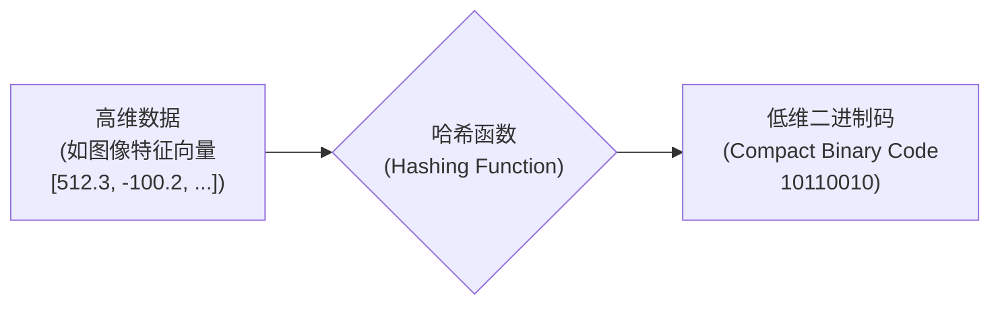
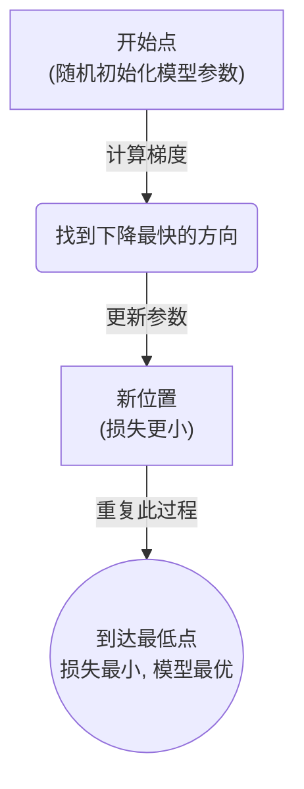
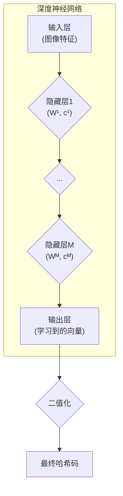
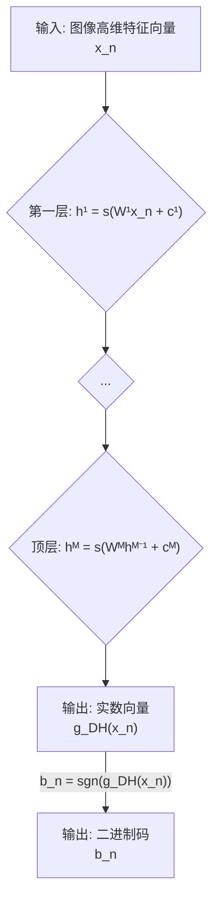

## AI论文解读 | Deep Hashing for Compact Binary Codes Learning
        
### 作者        
digoal        
        
### 日期        
2025-06-24        
        
### 标签        
PostgreSQL , PolarDB , DuckDB , AI , 论文解读        
        
----        
        
## 背景       
      
https://openaccess.thecvf.com/content_cvpr_2015/papers/Liong_Deep_Hashing_for_2015_CVPR_paper.pdf        
  
      
提示:        
```        
读懂《Deep Hashing for Compact Binary Codes Learning》这篇论文需要提前掌握哪些基础知识, 请使用中文给我讲一下这些基础知识, 尽量通熟易懂, 可以使用markdown支持的图形增加解释性.        
        
使用中文通熟易懂的解读《Deep Hashing for Compact Binary Codes Learning》这篇论文, 关键内容请深入讲解, 可以使用markdown支持的图形增加解释性.        
        
使用中文提取《Deep Hashing for Compact Binary Codes Learning》论文中一些重要的术语并详细解释, 可以使用markdown支持的图形示增加解释性.        
```        
        
## 1 前置知识 
  
好的，为了完全理解《Deep Hashing for Compact Binary Codes Learning》这篇论文，你需要掌握以下几个核心领域的基础知识。我会用通俗易懂的方式，并配合一些简单的图示来为你讲解。

这篇论文的核心思想是：**用深度神经网络来学习一种高质量的哈希编码，从而实现大规模图像的快速检索**。

要理解这个核心思想，我们需要拆解出以下几个知识点：

### 1\. 基础知识一：什么是哈希与相似性检索 (Hashing for Similarity Search)

这是理解这篇论文“**要做什么**”的关键。

  * **目标**：想象一下，你的电脑里有数百万张图片，你想找到所有和“猫”相似的图片。一张一张地比对太慢了。我们需要一种快速的方法。
  *  **传统方法的问题**：计算机通常用一个很长的向量（比如一个包含512个浮点数的GIST特征向量  ）来表示一张图片。直接比较这些长向量非常耗时。
  *  **哈希的作用**：哈希是一种降维技术，它的目标是为每一张图片生成一个简短的“指纹”，这个指纹通常是一串二进制码（比如 `10110010`）。这个过程就像是给每张图片打上一个独特的、简短的标签  。
  * **核心优势**：
      * **存储小**：存储一串二进制码比存储一个长浮点数向量节省空间。
      * **比较快**：比较两个二进制“指纹”的差异（通过汉明距离，即计算有多少位不同）远比比较两个长向量快得多。

你可以这样理解这个过程：



 论文中提到的传统哈希方法，如局部敏感哈希 (LSH)   ，大多使用较为简单的线性函数来完成这个映射过程   。而这篇论文认为，简单的线性函数无法很好地捕捉图片之间复杂的非线性关系  。

### 2\. 基础知识二：机器学习基本概念

这是理解这篇论文“**怎么做**”的基础。

#### (1) 监督学习 vs. 无监督学习 (Supervised vs. Unsupervised Learning)

  *  **无监督学习 (Unsupervised Learning)**：训练数据**没有**标签。算法需要自己从数据中发现结构和模式。论文中提出的 **DH (Deep Hashing)** 就是无监督的  。它在学习过程中只看图片数据本身，并不知道哪些图片属于同一类。
  *  **监督学习 (Supervised Learning)**：训练数据**有**标签。比如，我们提前告诉算法，“图片A和图片B都是猫”，“图片A和图片C不是一类”。算法利用这些标签信息来学习。论文中提出的 **SDH (Supervised Deep Hashing)** 就是监督学习   。它利用了样本对的标签信息（哪些是相似的，哪些不相似）来学习更好的哈希码  。

#### (2) 损失函数与优化 (Loss Function & Optimization)

这是机器学习模型学习和改进的方式。

  *  **损失函数 (Loss Function)**：一个用来衡量模型“做得有多差”的函数。损失值越大，说明模型当前的效果越差。这篇论文设计了一个非常精巧的损失函数，它同时考虑了三个目标  ：
    1.   **量化损失要小**：模型输出的向量要尽可能接近-1或1，方便转换成二进制码  。
    2.   **比特要均衡**：生成的二进制码中，每一位是0或1的概率应该大致相等，这样能最大化信息量  。
    3.   **比特要独立**：生成的二进制码的不同位之间应该互不相关，避免信息冗余  。
  * **优化 (Optimization)**：就是想办法调整模型的参数，让损失函数的值变得尽可能小。你可以把它想象成一个“下山”的过程，目标是走到山谷的最低点（损失最小）。
      *  **梯度下降 (Gradient Descent)**：一种常用的优化算法。它通过计算损失函数对模型参数的**梯度**（导数），来找到让损失下降最快的方向，然后沿着这个方向更新参数。论文中使用了**随机梯度下降 (Stochastic Gradient Descent)**  。




### 3\. 基础知识三：深度学习 (神经网络)

这是实现这篇论文“**非线性映射**”的核心工具。

  *  **为什么需要深度学习？** 正如前面所说，简单的线性函数无法捕捉图像复杂的视觉相似性。而深度神经网络 (Deep Neural Network) 通过堆叠多个**非线性**层，可以学习到数据之间非常复杂和抽象的层次化关系  。

  * **基本构成**：

      *  **层 (Layer)**：网络由多个层堆叠而成，包括输入层、若干隐藏层和输出层  。
      *  **权重 (Weights) 和偏置 (Biases)**：每一层都有一组权重 ($W$) 和偏置 ($c$)，这些就是模型需要学习的参数  。
      *  **激活函数 (Activation Function)**：在每层计算后，会经过一个非线性函数（如Sigmoid或论文中使用的tanh   ）。正是这个函数赋予了网络学习非线性关系的能力  。
      *  **前向传播 (Forward Propagation)**：数据从输入层开始，逐层计算，直到输出层，得到最终结果  。
      *  **反向传播 (Back-propagation)**：在计算出损失后，将误差从输出层反向传播回每一层，并依据此计算梯度，用于更新每层的权重和偏置  。这是梯度下降在神经网络中的具体应用。

一个简化的深度网络结构如下：



### 4\. 基础知识四：必要的数学知识

  *  **线性代数**：你需要对**矩阵和向量**有基本了解，尤其是**矩阵乘法**、**转置**等操作。因为整个神经网络的计算都是通过矩阵运算来完成的  。
  *  **微积分**：主要需要理解**导数**和**偏导数**（梯度）的概念，因为这是理解梯度下降和反向传播算法的关键  。

### 总结

为了读懂这篇论文，你需要按照以下顺序建立知识体系：

1.  **理解目标**：明白什么是**哈希**，以及它为什么能用于**快速图像检索**。
2.  **理解方法论**：掌握**机器学习**的基本概念，特别是**监督/无监督学习**的区别，以及**损失函数**和**优化**在模型训练中的作用。
3.  **理解核心工具**：了解**深度神经网络**的基本原理，知道它是如何通过多层非线性变换来学习复杂模式的，并了解**前向/反向传播**的过程。
4.  **具备数学基础**：熟悉基本的**线性代数**和**微积分**概念，以便理解文中的公式和算法推导。

当你掌握了这些基础后，再去看论文中提出的DH和SDH模型的具体结构、损失函数的设计以及优化过程，就会感到清晰很多。
  
## 2 解读论文 
  
好的，我们来一起用通俗易懂的方式，深入解读这篇开创性的论文——《Deep Hashing for Compact Binary Codes Learning》。

### 论文核心思想概览

 这篇论文的主要目标是解决一个在大规模视觉搜索中非常实际的问题：**如何快速地从海量图片库中找到与查询图片相似的图片？**  

 传统方法通常为每张图片提取一个高维特征向量（比如一个512维的浮点数数组）  ，然后通过计算向量之间的距离来判断相似度。但在数据量达到百万甚至千万级别时，这种方式的计算和存储成本都非常高。

 哈希（Hashing）技术应运而生，它旨在将高维的特征向量映射成一个短小的二进制码（例如，`1011001011...`）   。比较二进制码的差异（汉明距离）远比比较高维向量快得多，从而极大地提升了检索速度  。

 然而，在当时（2015年），大多数哈希方法都使用单一的**线性**投影，这难以捕捉现实世界中图像数据复杂的**非线性**结构   。这篇论文的突破性贡献在于，**首次提出使用深度神经网络（Deep Neural Network）来学习这种从图像特征到紧凑二进制码的非线性映射过程**  。

-----

### 论文提出的两大方法：DH 与 SDH

作者提出了两种方法：一种是无监督的**深度哈希（Deep Hashing, DH）**，另一种是其监督学习版本**监督深度哈希（Supervised Deep Hashing, SDH）**。

#### 1\. 深度哈希 (Deep Hashing, DH) - 无监督学习

DH方法是论文的核心，它构建了一个深度神经网络，在不需要任何人工标注的情况下，学习优质的二进制码。

##### DH 的网络结构与目标

 DH的网络接收一个原始的图像特征向量（如GIST特征）作为输入，经过多个包含非线性激活函数（如tanh）的隐藏层，最终在顶层输出一个与目标二进制码等长的实数向量   。这个输出向量经过一个符号函数（`sgn`）处理即可得到最终的二进制码（-1/1表示）  。



##### DH 的精髓：三大优化目标

 为了让网络学习到“好”的二进制码，作者在网络顶层设计了一个巧妙的优化目标（即损失函数），它由三个部分约束构成  ，如下图所示。

 *图示：DH方法在网络顶层对二进制码提出的三个核心要求*

1.  **最小化量化损失 (Minimizing Quantization Loss)**

      *  **目标**：网络顶层输出的实数向量 `H` 应该尽可能地接近它二值化后的目标 `B`（由-1和1组成）  。
      *  **通俗解释**：这要求网络输出的值不要模棱两可，要旗帜鲜明地接近-1或1，这样在二值化时造成的信息损失最小  。

2.  **比特均衡 (Balanced Bits)**

      *  **目标**：让每个比特位上的码（-1或1）都尽可能均匀分布   。具体做法是最大化每个比特位上输出值的方差  。
      * **通俗解释**：如果某个比特位上几乎所有的码都是1，那么这个比特位就失去了区分能力，等于浪费了。一个好的哈希码，每一位都应该有一半左右的概率是1，一半左右是-1，这样才能最大化地承载信息。

3.  **比特独立 (Independent Bits)**

      *  **目标**：让不同的比特位之间尽可能独立、不相关   。论文通过一个正交性约束来实现这一点  。
      *  **通俗解释**：如果第i个比特位和第j个比特位高度相关（比如总是一起为1或一起为-1），那么它们就传递了重复的信息，造成了浪费。我们希望每个比特位都能提供新的、独立的信息，使得哈希码的表达能力更强  。

 通过优化这个包含三大目标的损失函数，并使用**反向传播**和**随机梯度下降**算法来更新网络的权重，DH模型就能学习到如何将输入的特征向量转换为高质量的二进制码  。

#### 2\. 监督深度哈希 (Supervised Deep Hashing, SDH) - 监督学习

 DH是无监督的，它无法利用图像的类别标签信息。为了进一步提升二进制码的判别能力，作者提出了SDH  。

 SDH在DH的基础上，吸收了监督学习的思想，其核心改动是在优化目标中增加了一项**判别性约束**  。

  *  **目标**：同时**最小化同类样本的哈希码差异**（intra-class variation）并**最大化不同类样本的哈希码差异**（inter-class variation）  。
  * **实现方式**：在训练时，除了单个样本，还向模型输入大量的样本对。这些样本对分为两类：
      * **正样本对 (S)**：两张图片来自同一类别（相似）。
      *  **负样本对 (D)**：两张图片来自不同类别（不相似）  。
  *  **效果**：通过这个新增的约束，SDH学习到的二进制码不仅满足DH的三个基本要求，还能确保在汉明空间中，同类的图片聚集得更近，不同类的图片分得更远，从而在搜索时获得更高的准确率  。

-----

### 实验与结论

 作者在CIFAR-10、MNIST和LabelMe22k等三个主流数据集上进行了详尽的实验  。

  *  **性能优越**：实验结果清晰地表明，在无监督方法中，DH的性能超越了当时所有的主流方法（如ITQ、SH、KMH等）   。在监督方法中，SDH也同样优于其他监督哈希方法（如SPLH、BRE、MLH）  。
  *  **超越Semantic Hashing**：论文还与另一个同样采用深度学习的哈希方法“Semantic Hashing”    进行了比较。结果显示，作者提出的DH和SDH表现更优，因为它们不仅考虑了重构误差（即量化损失），还创新性地加入了比特均衡和独立性的约束  。
  *  **效率**：在计算时间上，虽然DH/SDH的训练时间比一些传统方法要长，但在测试阶段（即为新图片生成哈希码），其速度非常快，与其他方法相当，完全满足大规模检索的实时性要求  。

### 总结

《Deep Hashing for Compact Binary Codes Learning》是一篇里程碑式的工作。它的核心贡献可以总结为：

1.   **引入深度学习**：首次将深度神经网络引入哈希码学习，通过其强大的非线性建模能力，有效捕捉了图像数据复杂的内在结构  。
2.   **设计精巧的优化目标**：创新性地提出了一个包含**最小化量化损失**、**比特均衡**和**比特独立**三大约束的无监督学习框架（DH），显著提升了二进制码的质量  。
3.   **扩展至监督学习**：进一步提出了监督版本SDH，通过利用标签信息来增强码的判别力，使得检索精度更高  。

这项工作为后续的深度哈希研究奠定了坚实的基础，并开启了利用深度学习解决大规模相似性检索问题的新篇章。
  
## 3 术语  
  
本篇论文《Deep Hashing for Compact Binary Codes Learning》提出了一种新的深度哈希（DH）方法，用于学习紧凑的二值码，以进行大规模视觉搜索。该方法利用深度神经网络学习多层级的非线性变换来生成二值码，从而更好地利用样本的非线性关系。论文中提到了一些重要的术语，以下是详细解释：

###  1. 深度哈希 (Deep Hashing, DH)  

 **解释：** DH 是本文提出的一种学习紧凑二值码的新方法。与大多数现有通过单一线性投影将样本映射到二值向量的二值码学习方法不同，DH 使用深度神经网络来学习多个分层非线性变换，以更好地利用样本的非线性关系。它旨在通过最小化原始实值特征描述符与学习到的二值向量之间的损失、确保二值码在每个位上均匀分布以及使不同位之间尽可能独立来学习二值码。  

**图示：**

```
原始实值特征 -> [深度神经网络 (多层非线性变换)] -> 学习到的二值码
```

###  2. 紧凑二值码 (Compact Binary Codes)  

 **解释：** 紧凑二值码是指长度较短的二值向量（例如，由-1或1组成），用于表示数据样本。在视觉搜索中，使用紧凑二值码可以大大减少存储空间，并加速相似性搜索过程，因为可以通过计算汉明距离（Hamming distance）来高效地比较它们。  

###  3. 大规模视觉搜索 (Large Scale Visual Search)  

 **解释：** 随着图像和视频数据的爆炸式增长，从海量视觉数据中快速准确地检索出相似内容变得至关重要。大规模视觉搜索指的就是在这种海量数据集上进行高效、准确的图像或视频检索任务。哈希技术因其在存储和计算效率方面的优势，成为解决大规模视觉搜索问题的有力工具。  

###  4. 非线性变换 (Non-linear Transformations)  

 **解释：** 在机器学习中，非线性变换指的是将数据从一个空间映射到另一个空间时，使用的函数是非线性的。这使得模型能够捕捉到数据中更复杂、更抽象的模式和关系。传统的哈希方法通常采用单一线性投影，这在处理复杂、非线性的数据结构时效果不佳。而深度哈希利用深度神经网络的多层非线性激活函数，能够学习到数据的多层级非线性表示，从而生成更具表达力的二值码。  

###  5. 目标函数约束 (Objective Function Constraints)  

 **解释：** 在深度哈希模型训练过程中，通过在深度网络顶层施加三个主要约束来优化模型，以确保学习到的二值码具有良好的特性：  

  *  **量化损失最小化 ($J\_1$)**: 旨在最小化学习到的二值向量与原始实值向量之间的损失。这确保了二值码能够尽可能地保留原始数据的判别信息。  
  *  **位平衡性 ($J\_2$)**: 旨在最大化学习到的二值向量的方差，以确保二值码在每个位上均匀分布。这意味着每个位有大约一半的时间是-1，一半时间是1，从而避免了信息冗余并提高了搜索效率。  
  *  **位独立性 ($J\_3$)**: 强制对投影矩阵施加一个松弛的正交性约束，以最大限度地提高每个变换的独立性。这确保了二值码的不同位之间尽可能独立，从而提高二值码的表示能力和区分度。  
  *  **正则化项 ($J\_4$)**: 用于控制模型参数的尺度，防止过拟合。  

 **目标函数公式 (公式 5):**  
   
 ```
 $$
 \begin{aligned}
 min\_{W,c}J=J\_{1}-\\lambda\_{1}J\_{2}+\\lambda\_{2}J\_{3}+\\lambda\_{3}J\_{4} \\
 &= \\frac{1}{2}||B-H^{M}||*{F}^{2} - \\frac{\\lambda*{1}}{2N}tr((H^{M}(H^{M})^{T})) \\
 &+ \\frac{\\lambda\_{2}}{2}\\sum\_{m=1}^{M}||W^{m}(W^{m})^{T}-I||*{F}^{2} \\
 &+ \\frac{\\lambda*{3}}{2}(||W^{m}||*{F}^{2}+||c^{m}||*{2}^{2})
 \end{aligned}
 $$
 ```

###  6. 有监督深度哈希 (Supervised Deep Hashing, SDH)  

 **解释：** SDH 是在 DH 的基础上，进一步利用训练样本的标签信息来提高二值码的判别能力。SDH 在目标函数中引入了一个判别项，该判别项同时最大化学习到的二值码的类间变异并最小化类内变异。这意味着来自同一类的样本被映射到相似的二值码，而来自不同类的样本被映射到不同的二值码，从而提高搜索精度。  

**图示：**

```
原始实值特征 + 标签信息 -> [深度神经网络 (多层非线性变换 + 判别项)] -> 学习到的二值码
```

###  7. 汉明距离 (Hamming Distance)  

 **解释：** 汉明距离是衡量两个等长二值字符串之间差异的一种度量。它表示在相同位置上，两个字符串对应位不同的数量。在哈希方法中，汉明距离用于衡量两个二值码的相似性，距离越小表示越相似。  

###  8. 平均精度均值 (mean Average Precision, mAP)  

 **解释：** mAP是评估哈希算法性能的常用指标之一。它计算了精确率-召回率曲线下的面积，综合评估了不同哈希算法的整体性能。mAP值越高，表示算法的检索性能越好。  

###  9. N个样本的精确率 (Precision@N samples)  

 **解释：** 这是另一个评估哈希算法性能的指标。它衡量的是在检索到的前N个样本中，真正相关的邻居样本所占的百分比。这个指标关注的是检索结果的“头部”质量，即用户最先看到的那些结果的相关性。  

###  10. 汉明查找 (Hamming Look-up)  

 **解释：** 汉明查找是在给定汉明半径 $r$ 的条件下，衡量所有落在汉明半径 $r$ 内的桶中点的精确率。如果查找失败，则精确率为零。这是一种衡量哈希表检索效率和准确性的方法，特别是在大规模数据集中查找近似邻居时。  

这些术语共同构成了《Deep Hashing for Compact Binary Codes Learning》这篇论文的核心概念和评估框架。
  
## 参考        
         
https://openaccess.thecvf.com/content_cvpr_2015/papers/Liong_Deep_Hashing_for_2015_CVPR_paper.pdf  
        
        
<b> 以上内容基于DeepSeek、Qwen、Gemini及诸多AI生成, 轻微人工调整, 感谢杭州深度求索人工智能、阿里云、Google等公司. </b>        
        
<b> AI 生成的内容请自行辨别正确性, 当然也多了些许踩坑的乐趣, 毕竟冒险是每个男人的天性.  </b>        
  
  
  
#### [期望 PostgreSQL|开源PolarDB 增加什么功能?](https://github.com/digoal/blog/issues/76 "269ac3d1c492e938c0191101c7238216")
  
  
#### [PolarDB 开源数据库](https://openpolardb.com/home "57258f76c37864c6e6d23383d05714ea")
  
  
#### [PolarDB 学习图谱](https://www.aliyun.com/database/openpolardb/activity "8642f60e04ed0c814bf9cb9677976bd4")
  
  
#### [PostgreSQL 解决方案集合](../201706/20170601_02.md "40cff096e9ed7122c512b35d8561d9c8")
  
  
#### [德哥 / digoal's Github - 公益是一辈子的事.](https://github.com/digoal/blog/blob/master/README.md "22709685feb7cab07d30f30387f0a9ae")
  
  
#### [About 德哥](https://github.com/digoal/blog/blob/master/me/readme.md "a37735981e7704886ffd590565582dd0")
  
  

  
