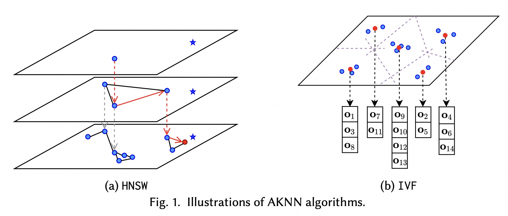

## 数据库筑基课 - 向量索引之 HNSW    
                                                                                            
### 作者                                                                
digoal                                                                
                                                                       
### 日期                                                                     
2025-06-24                                                      
                                                                    
### 标签                                                                  
PostgreSQL , PolarDB , DuckDB , 应用开发者 , 数据库筑基课 , 索引结构 , 向量 , ANNs , KNN , 图 , HNSW    
                                                                                           
----                                                                    
                                                                                  
## 背景    
[《数据库筑基课 - 大纲》](../202409/20240914_01.md)      
    
<b>本节: 向量索引之 HNSW</b>       
    
前言: 如果你对向量搜索(语义搜索)的背景不太了解, 可以先了解一下RAG相关文章:  
- [《为什么用了RAG, 我的AI还是笨得跟猪一样! RAG效果评测与优化》](../202504/20250414_04.md)  
- [《维基百科(wikipedia) RAG 优化 | PolarDB + AI》](../202504/20250417_01.md)  
  
## 一、索引原理  
  
hnsw 是一种基于图结构的近似最近邻搜索算法，在高维向量相似性搜索中表现出色。它通过创建多层次的图结构来实现高效的向量检索，其中每个向量作为图中的节点，与其邻居节点建立连接。   
  
HNSW（Hierarchical Navigable Small World，分层可导航小世界）, 要理解hnsw一定要从3个关键点出发  
- 小世界.   
    - 有点像地图的缩放效果. 顶层可能是国家级别, 向下可能是省, 然后是市、区、街道、小区(底层: 0层).     
    - 上层点稀疏, 下层点密集. 为了保证联通性, 上层的某个点, 在下层一定存在. (从上层的点链接到下层的点, 类似跳表结构.)     
- 可导航. 每一层都是图结构, 有联通性, 确保任何点都不会成为孤点.    
- 分层结构. 分层是提升搜索性能的精髓, 从顶层(稀疏层)入口节点开始, 每一层使用贪婪算法快速找到离目标最近的点, 然后下到下一层, 继续直到底层(稠密层), 搜索离目标最近的K个近邻点.    
  
  
下图截取自论文《High-Dimensional Approximate Nearest Neighbor Search: with Reliable and Efficient Distance Comparison Operations》  
  
  
  
左图为HNSW索引, 右图为IVF索引结构.   
  
假设星号为where条件输入的点(目标是要找其附近的K个近邻点), 顶层的另一个点是搜索时选择的入口点(通常只有一个点), 红色的线是跳跃图层的路径.     
  
下面以PostgreSQL [pgvector插件](https://github.com/pgvector/pgvector)的hnsw索引接口为例进行分析.  
  
HNSW通过分层图结构实现了高效的近似最近邻搜索，在查询性能和结果质量(召回率)之间提供了良好的平衡。其分层导航的设计思想和高效的搜索算法使其成为向量数据库中重要的索引技术。在pgvector的实现中，HNSW支持并行构建、动态维护和灵活的参数配置，能够适应各种实际应用需求。  
  
### 1、分层图结构  
  
HNSW的核心思想是构建一个多层次的图结构：  
  
- **底层（第0层）**：包含所有向量节点，每个节点的连接数最多（2\*m个连接）  
- **上层（第1层及以上）**：包含部分节点，每个节点的连接数较少（m个连接）  
- **层级选择**：每个节点的层级通过指数分布随机确定 (层级越高, 概率越低. 例如, 假设当前最高位为9级, 插入某个点时, 最高被确定为4级, 则这个点仅仅需要在`4,3,2,1,0`级存在.)    
- **入口点**：从最高层的节点开始搜索(最高层通常只有一个点, 如果有多个点同时处于最高层, 则按顺序排列, 搜索还是从排在第一的点开始.)     
  
这种分层结构类似于跳表，允许从稀疏的高层快速导航到密集的低层。   
  
### 2、数据结构设计  
  
每个HNSW元素(点)包含以下关键信息：  
  
- **向量值**：存储的高维向量数据  
- **层级信息**：该节点存在的最高层  
- **邻居列表**：每一层的邻居连接信息  
- **堆元组ID**：指向实际数据的引用  (ctid, 即heap表中的行号)  
  
### 3、性能特点  
  
1、时间复杂度  
- **搜索**：O(log N)，其中N是向量数量  
- **插入**：O(M log N)，其中M是连接数  
- **构建**：O(N M log N)  
  
2、空间复杂度  
- **存储**：O(N M)，每个向量平均M个连接. 这只是底层的规模, 实际应该比这大, 因为每个节点可能存在多个图层中.   
- **内存**：构建时需要足够内存容纳图结构  
  
  
### 4、类型介绍  
  
**1、vector类型 - 标准全精度向量**  
  
支持最多2,000维，这是pgvector的主要向量类型。  
  
**存储特点**：  
- 每个向量占用 `4 * dimensions + 8` 字节存储空间  
- 使用单精度浮点数（4字节/维度）  
- 所有元素必须是有限值（不允许NaN、Infinity等）  
  
**应用场景**：  
- **通用嵌入向量**：如Word2Vec、GloVe等传统词向量  
- **图像特征向量**：CNN提取的图像特征，通常在几百到2000维之间  
- **用户/物品嵌入**：推荐系统中的用户和物品表示向量  
- **精度要求高的场景**：需要保持完整浮点精度的应用  
  
**2、halfvec类型 - 半精度向量**  
  
支持最多4,000维，是内存优化的选择。  
  
**存储特点**：  
- 每个向量占用 `2 * dimensions + 8` 字节存储空间  
- 使用半精度浮点数（2字节/维度）  
- 存储空间是vector类型的一半  
  
**应用场景**：  
- **大规模语言模型嵌入**：如BERT、GPT等模型的输出向量（通常768-4096维）  
- **内存受限环境**：需要存储大量向量但内存有限的场景  
- **高维度向量**：当向量维度超过2000时的替代方案  
- **精度要求适中的场景**：可以接受轻微精度损失换取存储效率  
  
**3、bit类型 - 二进制向量**  
  
支持最多64,000维，专门用于二进制数据。  
  
**存储特点**：  
- 每个向量占用 `dimensions / 8 + 8` 字节存储空间  
- 每个维度只占用1位  
- 存储效率极高  
  
**应用场景**：  
- **图像哈希**：如感知哈希(pHash)、局部敏感哈希(LSH)  
- **文档指纹**：二进制文档特征表示  
- **布隆过滤器**：快速成员检测  
- **二值化神经网络**：使用二进制权重的神经网络输出  
- **快速相似性检索**：使用汉明距离进行快速筛选，再用精确向量重排序  
  
**4、sparsevec类型 - 稀疏向量**  
  
最多1,000个非零元素，专门处理稀疏数据。  
  
**存储特点**：  
- 每个向量占用 `8 * non-zero elements + 16` 字节存储空间  
- 只存储非零元素的索引和值  
- 支持极高维度（最多10亿维）但非零元素有限  
  
**应用场景**：  
  
4\.1\. 文本处理  
- **TF-IDF向量**：文档的词频-逆文档频率表示  
- **词袋模型(BoW)**：文档的词汇表示，大部分词汇在单个文档中不出现  
- **N-gram特征**：文本的n元语法特征，通常非常稀疏  
  
4\.2\. 推荐系统  
- **用户-物品交互矩阵**：用户只与少数物品有交互  
- **协同过滤特征**：基于用户行为的稀疏特征向量  
  
4\.3\. 分类特征  
- **One-hot编码**：类别特征的独热编码表示  
- **特征工程**：组合特征、交叉特征等，通常产生高维稀疏向量  
  
4\.4\. 科学计算  
- **基因表达数据**：大多数基因在特定条件下不表达  
- **化学分子指纹**：分子结构的稀疏二进制表示  
  
**5、选择建议**  
- 1. **默认选择vector**：对于大多数机器学习应用  
- 2. **高维度选择halfvec**：当维度超过2000或内存受限时  
- 3. **二进制数据选择bit**：用于哈希、指纹等二进制表示  
- 4. **稀疏数据选择sparsevec**：当大部分元素为零时，如文本TF-IDF向量  
  
每种类型都针对特定的数据特征和性能需求进行了优化，选择合适的类型可以显著提升存储效率和查询性能。  
  
  
## 二、索引Build、搜索、DML、垃圾回收过程  
  
### 1、构建过程  
  
#### 内存阶段构建  
  
HNSW索引的构建采用两阶段方法：  
  
1\. **内存阶段**：在内存中逐步构建图结构  
   - 为每个新向量随机确定层级  
   - 使用搜索算法找到合适的邻居  
   - 与邻居点建立双向连接关系  
   - 更新现有节点的邻居列表    
  
#### 磁盘阶段构建  
  
当内存不足时，切换到磁盘构建模式(变成插入模式, 也就是索引创建完之后的模式, 相比内存构建慢很多很多)：  
  
2\. **磁盘阶段**：将内存图刷写到磁盘，继续逐条插入剩余向量  
   - 从磁盘读取现有图结构  
   - 为新向量找到邻居并建立连接  
   - 更新相关节点的邻居信息    
  
#### 并行构建支持  
  
pgvector支持并行构建HNSW索引，使用共享内存在多个工作进程之间协调构建工作。    
  
### 2、搜索算法  
  
#### 分层搜索过程  
  
HNSW的搜索算法采用贪心策略(贪婪算法?)，分为以下步骤：  
  
1\. **从入口点开始**：在最高层开始搜索  
2\. **层内搜索**：在当前层找到最近的邻居  
3\. **层间转移**：将当前层的最近邻作为下一层的入口点    
4\. **逐层下降**：重复此过程直到第0层  
5\. **精确搜索**：在第0层进行更精确的搜索，返回`ef_search`个最近邻  
  
这种方法的时间复杂度为对数级别`O(log(n))`，大大提高了搜索效率。    
  
#### 候选队列管理  
  
搜索过程中维护两个优先队列：  
  
- **候选队列C**：待探索的候选节点，按距离升序排列   
- **结果队列W**：当前最佳候选节点，按距离降序排列   
  
算法通过比较候选队列中最近的节点与结果队列中最远的节点来决定是否继续搜索。    
  
### 3、Insert  
  
新向量的插入过程：  
  
1\. 确定新向量的(最高)层级(指数概率分布, 越高的层级概率越低. 例如当前索引有9层, 新向量的最高层级大概率可能小于9)  
2\. 在(从最高到最低)每一层找到合适的邻居  
3\. 建立双向连接关系    
4\. 必要时更新入口点(当新向量的最高层级大于索引当前入口点的层级时)    
  
### 4、DELETE   
  
当带有 HNSW 索引的表发生 DELETE 操作时，元素不会立即从图结构中移除。相反，它们会被标记为无效的堆 TIDs(也就是表上tuple head的xmax标记)，但会保留在图(hnsw index)中，直到 VACUUM 进程处理它们。  
  
### 5、UPDATE    
  
UPDATE 操作实现为先执行 DELETE 再执行 INSERT 操作，因此它们遵循相同的延迟删除模式。   
  
#### 并发控制机制  
  
**锁机制**  
  
HNSW索引使用多级锁来保证并发安全：  
- **HNSW_UPDATE_LOCK**: 保护图结构更新  
- **HNSW_SCAN_LOCK**: 保护扫描操作  
- **元素级LWLock**: 保护单个元素的邻居和heaptids  
  
**版本控制**   
  
每个HNSW元素包含版本字段，用于：  
- 检测并发修改  
- 避免迭代扫描时读取不一致数据  
- 支持乐观并发控制  
  
### 6、VACUUM 垃圾清理  
  
HNSW 索引清理在 VACUUM 操作期间通过一个三阶段过程完成：  
  
1\.  **第一阶段：移除堆 TIDs** - 对于被删除堆元组的元素，其堆 TIDs 会被标记为无效，但元素仍保留在图结构中。   
  
2\.  **第二阶段：修复图** - 该算法会修复图中指向被删除元素的连接，通过为指向已删除节点的邻居的元素找到新的邻居连接，确保图的可导航性。   
  
3\.  **第三阶段：标记为已删除** - 最后，元素会被实际标记为已删除，其数据会从索引中清除。   
  
为了避免vacuum时重复扫描索引, 影响性能. 应该配置合理的内存参数, 参考: 
- [《PostgreSQL 垃圾回收参数优化之 - maintenance_work_mem , autovacuum_work_mem》](../201902/20190226_01.md)  
- [《PostgreSQL 17 preview - 使用TidStore数据结构存储dead tupleids, 提升vacuum效率, 为什么PG单表不建议超过8.9亿条记录?》](../202404/20240402_02.md)  
  
  
#### 注意事项  
  
这种延迟处理方法比立即删除更有效率，因为：  
  
*   它避免了每次 DELETE 操作都进行昂贵的即时图重构。  
*   它允许 vacuum 进程批量处理多次删除和修复。  
*   它通过在图正确修复之前保留对已删除元素的访问，从而在删除过程中保持图的可导航性。  
  
VACUUM 期间的图修复确保 HNSW 索引在元素删除后仍然可用且可导航，因为损坏的连接会被有效的邻居关系所取代。  
  
  
#### 特殊处理机制  
  
**入口点更新**  
  
当入口点被删除时，系统会：  
- 寻找最高层级的非入口点元素作为新入口点  
- 更新元数据页(hnsw index 的metapage)中的入口点信息  
- 确保图的连通性  
  
**跳过已删除元素(点)**  
  
在搜索过程中，`RemoveElements`函数会：  
- 检查元素的`heaptidsLength`字段  
- 跳过已被标记删除的元素  
- 确保搜索结果的有效性  
  
  
## 三、最佳实践  
  
### 1、加速hnsw索引build过程  
- 开启并行, 例如配置`max_parallel_maintenance_workers`、`max_parallel_workers`等相关参数  
- 设置足够大的`maintenance_work_mem`以支持内存构建  
- 优化构建时机, 在数据加载完成后再创建索引  
  
### 2、加速vacuum  
- 优先使用`REINDEX + VACUUM`的组合，而不是单独的`VACUUM`  
- 在生产环境使用`REINDEX CONCURRENTLY`选项避免阻塞  
- 定期监控索引性能，在性能下降明显时主动重建  
- 考虑维护窗口，在低峰期进行这些操作  
  
### 3、提升召回率(召回条数/实际近邻条数)  
  
需要从查询阶段和构建索引阶段分别考虑。  
  
**1、查询阶段提升召回率**  
  
1\.1\. 调整ef_search参数  
  
`ef_search`是影响查询召回率的最重要参数。 默认值为40，范围1-1000。  
  
```sql  
SET hnsw.ef_search = 100;  -- 提高到100获得更好召回率  
```  
  
更高的`ef_search`值会在搜索过程中维护更大的候选列表，从而提高召回率，但会降低查询速度。  
  
1\.2\. 启用迭代扫描  
  
当查询包含过滤条件时，可以启用迭代扫描来提高召回率。   
  
```sql  
-- 严格模式：确保结果按距离精确排序  
SET hnsw.iterative_scan = strict_order;  
  
-- 宽松模式：允许结果略微乱序，但提供更好的召回率  
SET hnsw.iterative_scan = relaxed_order;  
```  
  
1\.3\. 调整迭代扫描参数：  
  
```sql  
SET hnsw.max_scan_tuples = 50000;     -- 增加扫描的最大元组数  
SET hnsw.scan_mem_multiplier = 2;     -- 增加扫描使用的 work_mem 内存倍数  
```  
  
1\.4\. 查询优化技巧  
  
对于混合过滤查询，合理设置参数可以显著提升召回率。  
  
**2、build index 参数提升召回率**  
  
2\.1\. 调整`m`参数  
  
`m`参数控制每个节点的最大连接数。 默认值为16，范围2-100。  
  
```sql  
CREATE INDEX ON items USING hnsw (embedding vector_l2_ops) WITH (m = 32);  
```  
  
更高的`m`值会创建更密集的图连接，提高召回率但增加索引大小和构建时间。  
  
2\.2\. 调整`ef_construction`参数  
  
`ef_construction`控制构建时的动态候选列表大小。 默认值为64，范围4-1000。 `ef_construction`必须大于等于`2 * m`：  
  
```sql  
CREATE INDEX ON items USING hnsw (embedding vector_l2_ops) WITH (ef_construction = 128);  
```  
  
2\.3\. 优化构建时机和内存配置   
  
建议在加载初始数据后创建索引，这样可以获得更好的图质量。   
  
```sql  
SET maintenance_work_mem = '8GB';  
```  
  
充足的内存确保图结构在内存中完整构建，避免切换到性能较差的磁盘构建模式。  
  
2\.4\. 并行构建优化   
  
并行构建不仅能加速构建过程，还能通过更好的负载分布提升图质量。  
  
**3、如何测试验证召回率?**   
- 1. 先获取精确搜索结果作为基准  
- 2. 使用HNSW索引进行近似搜索  
- 3. 计算两者的重叠率作为召回率指标  
  
详见:  
- [《头大! 索引扫描和全表扫描结果不一样, 这向量数据库还能用? 教你一招大幅提升召回率(recall)》](../202404/20240417_01.md)    
  
  
**4、最佳实践总结**  
  
4\.1\. **查询阶段**：  
   - 根据精度要求调整`ef_search`（40-200）  
   - 对过滤查询启用迭代扫描  
   - 适当增加扫描参数限制  
  
4\.2\. **构建阶段**：  
   - 使用较大的`m`值（16-64）提升图连接密度  
   - 设置充足的`ef_construction`（64-200）  
   - 确保足够的`maintenance_work_mem`  
   - 在数据加载完成后构建索引  
  
4\.3\. **监控和调优**：  
   - 定期测试召回率  
   - 根据查询模式调整参数  
   - 平衡召回率与查询性能  
   - build 过程监测 `pg_stat_progress_create_index`  
  
### 4、如何提升混合搜索查询效率?   
  
混合搜索的核心挑战:   
  
混合搜索的主要性能瓶颈在于过滤操作是在索引扫描**之后**应用的。 这意味着如果过滤条件匹配10%的行，而HNSW默认的`ef_search`为40，平均只有4行会匹配。  
  
提升混合搜索效率的策略:   
  
1、启用迭代索引扫描  
  
pgvector 0.8.0引入了迭代索引扫描功能，可以自动扫描更多索引直到找到足够的结果：`hnsw.iterative_scan`    
  
有两种模式可选：  
- **严格模式`strict_order`**：确保结果按距离精确排序  
- **宽松模式`relaxed_order`**：允许结果略微乱序，但提供更好的召回率    
  
2、调整搜索参数  
  
对于过滤查询，增加动态候选列表大小：`ef_search`    
  
同时可以调整迭代扫描的控制参数：  `hnsw.max_scan_tuples`    
  
3、索引策略优化  
  
为过滤列创建索引   
  
使用部分索引  
- 对于频繁过滤的特定值，考虑部分索引：`CREATE INDEX ON items USING hnsw (embedding vector_l2_ops) WHERE (category_id = 123);`  
  
表分区  
- 对于高基数过滤条件，考虑表分区： `CREATE TABLE items (embedding vector(3), category_id int) PARTITION BY LIST(category_id);`  
  
4、查询优化技巧  
  
使用物化CTE进行距离过滤   
```  
WITH nearest_results AS MATERIALIZED (  
    SELECT id, embedding <-> '[1,2,3]' AS distance FROM items ORDER BY distance LIMIT 5  
) SELECT * FROM nearest_results WHERE distance < 5 ORDER BY distance;  
```  
  
重排序模式  
- 对于更高精度，使用两阶段方法：   
  
```  
SELECT * FROM (  
    SELECT * FROM items ORDER BY binary_quantize(embedding)::bit(3) <~> binary_quantize('[1,-2,3]') LIMIT 20  
) ORDER BY embedding <=> '[1,-2,3]' LIMIT 5;  
```  
  
5、与全文搜索结合  
  
pgvector支持与PostgreSQL全文搜索结合进行真正的混合搜索：   
```  
SELECT id, content FROM items, plainto_tsquery('hello search') query  
    WHERE textsearch @@ query ORDER BY ts_rank_cd(textsearch, query) DESC LIMIT 5;  
```  
  
可以使用`Reciprocal Rank Fusion`或`cross-encoder`来合并结果。  
  
6、混合搜索查询效率提升最佳实践总结  
- 1. **启用迭代扫描**：对于不可预测的过滤模式使用宽松排序  
- 2. **合理设置参数**：根据过滤选择性调整`ef_search`和扫描限制  
- 3. **索引策略**：为过滤列创建适当的索引或使用部分索引  
- 4. **查询结构**：使用物化CTE优化复杂过滤查询  
- 5. **监控性能**：使用`EXPLAIN ANALYZE`分析执行计划  
  
通过这些策略的组合使用，可以显著提升混合搜索的查询效率，特别是在处理复杂过滤条件时。  
  
### 5、如何避免超慢响应情况?  
  
1、限制扫描条数的机制  
  
pgvector提供了多个参数来控制HNSW索引扫描的范围，防止查询执行时间过长：  
  
`hnsw.max_scan_tuples`参数    
  
这个参数设置了迭代扫描时访问的最大元组数，默认值为20,000。当启用迭代扫描时，如果达到这个限制，查询会停止扫描并返回当前找到的结果。  
  
`hnsw.scan_mem_multiplier`参数    
  
这个参数控制迭代扫描使用的内存量，作为`work_mem`的倍数。当内存使用达到限制时，扫描会停止。  
  
扫描终止条件的实现  
- 在实际的扫描过程中，系统会检查这些限制条件：    
- 当达到最大扫描元组数或内存限制时，扫描会自动终止。  
  
2、查询参数优化策略  
  
2\.1\. 控制ef_search参数    
  
通过合理设置`ef_search`参数，可以在查询质量和性能之间找到平衡：  
  
```sql  
-- 对于性能敏感的查询，使用较小的ef_search  
SET hnsw.ef_search = 20;  
  
-- 对于质量要求高的查询，适当增加  
SET hnsw.ef_search = 100;  
```  
  
2\.2\. 启用迭代扫描的控制模式    
  
可以根据需求选择不同的迭代扫描模式：  
  
```sql  
-- 关闭迭代扫描，使用固定的ef_search  
SET hnsw.iterative_scan = off;  
  
-- 使用宽松模式，在性能和召回率间平衡  
SET hnsw.iterative_scan = relaxed_order;  
```  
  
3、语句超时设置  
  
3\.1\. PostgreSQL级别的超时控制  
  
```sql  
-- 设置语句执行超时（毫秒）  
SET statement_timeout = 30000;  -- 30秒超时  
  
-- 设置锁等待超时  
SET lock_timeout = 10000;  -- 10秒锁超时  
```  
  
3\.2\. 会话级别的临时设置  
  
```sql  
BEGIN;  
SET LOCAL statement_timeout = 15000;  -- 仅对当前事务生效  
SELECT * FROM items ORDER BY embedding <-> '[1,2,3]' LIMIT 10;  
COMMIT;  
```  
  
4、查询优化最佳实践  
  
4\.1\. 合理使用LIMIT子句  
  
确保查询包含适当的LIMIT子句，避免返回过多结果：  
  
```sql  
-- 好的做法：限制返回结果数量  
SELECT * FROM items ORDER BY embedding <-> '[1,2,3]' LIMIT 10;  
```  
  
4\.2\. 避免复杂的过滤条件  
  
对于复杂的混合查询，考虑使用物化CTE来优化：  
  
```sql  
WITH candidates AS MATERIALIZED (  
    SELECT * FROM items ORDER BY embedding <-> '[1,2,3]' LIMIT 100  
)  
SELECT * FROM candidates WHERE category_id = 123 LIMIT 10;  
```  
  
在没有迭代扫描功能之前, 可以考虑以上方法, 或者采用存储过程, hnsw索引返回时逐条判断是否满足其他过滤条件.  参考如下文章的思路:    
- [《PostgreSQL 15 preview - 窗口函数排序过滤N条支持推理filter, 大幅提升性能, 避免whole filter, 避免性能骤变(limit N, GIST等场景)》](../202204/20220408_03.md)    
- [《PostgreSQL GiST Order by 距离 + 距离范围判定 + limit 骤变/骤降优化与背景原因》](../201912/20191218_02.md)    
- [《GIS附近查找性能优化 - PostGIS long lat geometry distance search tuning using gist knn function》](../201308/20130806_01.md)    
  
4\.3\. 监控查询执行  
  
使用EXPLAIN ANALYZE来分析查询性能：  
  
```sql  
EXPLAIN ANALYZE SELECT * FROM items ORDER BY embedding <-> '[1,2,3]' LIMIT 10;  
```  
  
5、生产环境配置建议  
  
5\.1\. 设置合理的默认值  
  
```sql  
-- 在postgresql.conf中设置  
hnsw.max_scan_tuples = 10000  
hnsw.scan_mem_multiplier = 1  
statement_timeout = 30000  
```  
  
5\.2\. 应用层面的超时控制  
  
在应用代码中也应该设置连接超时和查询超时，作为双重保障。  
  
5\.3\. 监控和告警  
  
建立监控机制，当查询执行时间超过阈值时及时告警。  
  
6、总结  
  
通过合理配置扫描限制参数、设置语句超时、优化查询结构，可以有效避免HNSW索引查询出现超慢响应的情况。关键是在查询性能和结果质量之间找到适合业务需求的平衡点。  
  
## 四、优势 & 适合场景       
  
hnsw采用分层图结构, 层与层之间采用类似跳表的结构, 可快速逐层递进搜索到近邻向量.     
  
适合场景      
- 高维向量相似性搜索  
- 需要高查询性能的应用  
- 对搜索精度有一定要求的场景  
- 向量数据集较大的情况  
  
## 五、劣势 & 不适合场景     
  
由于hnsw采用图结构,   
- 构建超过内存大小的图, 耗时较长.   
- 要维护图关系, 插入性能较差.  
- 如果表会频繁发生update、delete, 垃圾回收不仅要回收垃圾, 还需要修复图关系, 性能会较差  
  
不适合场景  
- 频繁DML的向量数据.    
- 在构图完成后, 还要求持续的高并发低延迟写入的向量数据.    
  
HNSW (Hierarchical Navigable Small World) 为近似最近邻搜索创建了一个多层图结构。它在`速度-召回率`权衡方面提供了比 IVFFlat 更好的查询性能，但构建时间更慢且使用更多内存。  
  
如果你既要查询性能, 又要未来频繁的DML, 可以考虑vectorchrod, 参考文章:   
- [《VectorChord 向量插件学习心得》](../202505/20250513_01.md)    
- [《向量插件新贵 VectorChord(IVF+ RaBitQ量化), pgvector 和 milvus 都被秒杀了》](../202504/20250427_02.md)    
  
## 六、常见问题    
  
### 1、索引构建问题  
  
#### 问题1：索引构建速度过慢  
  
**症状**：创建HNSW索引时间过长，出现内存不足提示  
  
**原因**：图结构超出了`maintenance_work_mem`限制，切换到磁盘构建模式    
  
**解决方案**：  
1. 增加内存分配：  
   ```sql  
   SET maintenance_work_mem = '8GB';  
   ```    
  
2. 启用并行构建：  
   ```sql  
   SET max_parallel_maintenance_workers = 7; -- plus leader  
   ```    
  
3. 注意不要设置过高导致内存耗尽    
  
#### 问题2：参数配置错误  
  
**症状**：创建索引时出现参数验证错误  
  
**原因**：`ef_construction`必须大于等于`2 * m`    
  
**解决方案**：  
- 确保参数范围正确：  
  - `m`: 2-100，默认16    
  - `ef_construction`: 4-1000，默认64    
  
### 2、查询性能问题  
  
#### 问题3：查询结果数量不足  
  
**症状**：使用HNSW索引后返回的结果比预期少  
  
**原因**：结果受`ef_search`参数限制，过滤条件进一步减少了结果    
  
**解决方案**：  
1. 增加搜索候选列表大小：  
   ```sql  
   SET hnsw.ef_search = 200;  
   ```    
  
2. 启用迭代扫描：  
   ```sql  
   SET hnsw.iterative_scan = strict_order;  
   ```    
  
#### 问题4：索引未被使用  
  
**症状**：查询计划显示使用顺序扫描而非索引扫描  
  
**原因**：查询格式不正确，缺少`ORDER BY`和`LIMIT`子句    
  
**解决方案**：  
1. 确保查询格式正确：  
   ```sql  
   -- 正确格式  
   SELECT * FROM items ORDER BY embedding <-> '[3,1,2]' LIMIT 5;  
     
   -- 错误格式（不会使用索引）  
   SELECT * FROM items WHERE embedding <-> '[3,1,2]' < 5;  
   ```  
  
2. 强制使用索引进行测试：  
   ```sql  
   SET enable_seqscan = off;  
   ```    
  
### 3、维护和运维问题  
  
#### 问题5：VACUUM操作缓慢  
  
**症状**：对包含HNSW索引的表执行VACUUM时耗时过长  
  
**原因**：HNSW索引结构复杂，VACUUM需要处理图连接关系    
  
**解决方案**：  
先重建索引再执行VACUUM：  
```sql  
REINDEX INDEX CONCURRENTLY index_name;  
VACUUM table_name;  
```    
  
#### 问题6：生产环境索引创建阻塞  
  
**症状**：创建索引时阻塞了写操作  
  
**解决方案**：  
使用并发索引创建：  
```sql  
CREATE INDEX CONCURRENTLY ...  
```    
  
### 4、配置优化问题  
  
#### 问题7：过滤查询性能差  
  
**症状**：带WHERE条件的向量查询返回结果少或性能差  
  
**解决方案**：  
1. 为过滤列创建索引：  
   ```sql  
   CREATE INDEX ON items (category_id);  
   ```    
  
2. 启用迭代扫描模式：  
   ```sql  
   SET hnsw.iterative_scan = relaxed_order;  
   ```    
  
3. 调整扫描参数：  
   ```sql  
   SET hnsw.max_scan_tuples = 20000;  
   SET hnsw.scan_mem_multiplier = 2;  
   ```    
  
#### 问题8：向量类型选择不当  
  
**症状**：索引大小过大或维度限制问题  
  
**解决方案**：  
根据需求选择合适的向量类型：  
- `vector`: 最多2,000维    
- `halfvec`: 最多4,000维    
- `bit`: 最多64,000维    
- `sparsevec`: 虽然支持更多的维度, 但是最多1,000个非零元素. 通常用来存储文档token化之后的tokenID. (假设字典数有限)    
  
### 5、监控和诊断  
  
#### 监控索引构建进度  
  
使用PostgreSQL内置视图监控构建进度：  
```sql  
SELECT phase, round(100.0 * blocks_done / nullif(blocks_total, 0), 1) AS "%"   
FROM pg_stat_progress_create_index;  
```    
  
#### 性能分析  
  
使用`EXPLAIN ANALYZE`分析查询性能：  
```sql  
EXPLAIN ANALYZE SELECT * FROM items ORDER BY embedding <-> '[3,1,2]' LIMIT 5;  
```  
  
### 6、问题总结  
  
1. **构建时机**：在加载初始数据后创建索引    
2. **参数调优**：除非召回率低，否则使用默认参数    
3. **内存配置**：合理设置`maintenance_work_mem`避免磁盘构建  
4. **并发创建**：生产环境使用`CONCURRENTLY`选项  
5. **监控维护**：定期监控索引性能和大小  
  
  
## 七、有哪些坑     
  
可能在高频更新场景存在坑.     
  
[《pgvector hnsw高频更新场景的坑》](../202505/20250507_01.md)    
  
## 八、DEMO     
  
```sql  
-- 1. 创建扩展  
CREATE EXTENSION vector;  
  
-- 2. 创建表  
CREATE TABLE documents (  
    id SERIAL PRIMARY KEY,  
    title TEXT,  
    content TEXT,  
    embedding vector(384),  -- 假设使用384维向量  
    category_id INTEGER,  
    created_at TIMESTAMP DEFAULT NOW()  
);  
  
-- 3. 插入测试数据（生成1万条记录）  
INSERT INTO documents (title, content, embedding, category_id)  
SELECT   
    'Document ' || i,  
    'Content for document ' || i,  
    ARRAY(SELECT random() FROM generate_series(1, 384))::vector(384),  
    (i % 10) + 1  
FROM generate_series(1, 10000) i;  
  
-- 4. 配置内存参数  
SET maintenance_work_mem = '2GB';  
SET max_parallel_maintenance_workers = 4;  
  
-- 5. 创建HNSW索引  
CREATE INDEX CONCURRENTLY idx_documents_embedding   
ON documents USING hnsw (embedding vector_cosine_ops)  
WITH (m = 16, ef_construction = 64);  
  
-- 6. 为过滤列创建索引  
CREATE INDEX idx_documents_category ON documents (category_id);  
  
-- 7. 配置查询参数  
SET hnsw.ef_search = 100;  
SET hnsw.iterative_scan = relaxed_order;  
  
-- 8. 执行向量相似性查询  
SELECT id, title, embedding <=> '[0.1, 0.2, ...]' AS distance  
FROM documents   
WHERE category_id = 5  
ORDER BY embedding <=> '[0.1, 0.2, ...]'  
LIMIT 10;  
  
-- 9. 监控查询性能  
EXPLAIN ANALYZE   
SELECT id, title   
FROM documents   
ORDER BY embedding <=> '[0.1, 0.2, ...]'   
LIMIT 5;  
```  
  
## 九、扩展问题    
  
### 1、搜索时, 是从固定入口点开始的吗?   
  
如果图的顶层有多个点呢? 搜索还是从固定入口(点)开始的吗？  
  
### 2、有没有可能存在孤岛点?  
  
就是没有邻居的一个或多个点.  
  
类似海上的没有通航的岛礁.  
  
或者没有通航的大岛屿.   
  
### 3、HNSW的多层图结构还能优化吗
HNSW采用了多层图结构, 从稀疏到稠密多层分布. 耗费的内存和存储空间都比实际点数要多, 有更好的图结构吗? 
- 保证连通性
- 更少的边
- 一层结构
- 保证近乎好的单调性(贪婪搜索时, 每一次迭代总是能找到离目标更近的点)
   
有, 参考: [《AI论文解读 | Fast Approximate Nearest Neighbor Search With The Navigating Spreading-out Graph》](../202506/20250625_02.md)    
  
### 4、迭代扫描  
  
迭代扫描（Iterative Index Scans）是pgvector在0.8.0版本中引入的一个重要功能，用于解决近似索引（HNSW和IVFFlat）在带过滤条件查询时可能返回结果不足的问题  。  
  
#### 基本原理  
  
传统的近似索引扫描存在一个问题：过滤条件是在索引扫描**之后**应用的  。例如，如果一个条件匹配10%的行，而HNSW使用默认的`hnsw.ef_search`值40，平均只有4行会匹配  。  
  
迭代扫描通过自动扫描索引的更多部分来解决这个问题，直到找到足够的结果或达到限制条件（如`hnsw.max_scan_tuples`或`ivfflat.max_probes`）  。  
  
#### 扫描模式  
  
迭代扫描支持两种排序模式：  
  
##### 严格排序（Strict Order）  
确保结果按距离严格排序：  
```sql  
SET hnsw.iterative_scan = strict_order;  
```   
  
##### 宽松排序（Relaxed Order）  
允许结果在距离上略微无序，但提供更好的召回率：  
```sql  
SET hnsw.iterative_scan = relaxed_order;  
SET ivfflat.iterative_scan = relaxed_order;  
```    
  
#### 实现细节  
  
##### HNSW迭代扫描实现  
  
在HNSW的扫描实现中，迭代扫描通过以下机制工作：  
  
1. **内存和元组限制检查**：当当前结果列表为空时，检查是否达到了最大扫描元组数或内存限制    
  
2. **恢复扫描**：如果还有更多候选项可以扫描，调用`ResumeScanItems`继续扫描    
  
3. **距离排序控制**：在严格模式下，确保返回的结果距离不小于前一个结果的距离    
  
##### 配置参数  
  
###### HNSW参数  
- `hnsw.max_scan_tuples`：最大扫描元组数（默认20,000）    
- `hnsw.scan_mem_multiplier`：内存使用倍数，相对于`work_mem`（默认1）    
  
###### IVFFlat参数  
- `ivfflat.max_probes`：最大探测数    
  
#### 使用示例  
  
迭代扫描特别适用于带过滤条件的查询：  
  
```sql  
-- 启用迭代扫描  
SET hnsw.iterative_scan = strict_order;  
  
-- 带过滤条件的查询  
SELECT * FROM items   
WHERE category_id = 123   
ORDER BY embedding <-> '[3,1,2]' LIMIT 5;  
```  
  
对于需要严格排序的宽松模式结果，可以使用物化CTE：  
```sql  
WITH relaxed_results AS MATERIALIZED (  
    SELECT id, embedding <-> '[1,2,3]' AS distance   
    FROM items   
    WHERE category_id = 123   
    ORDER BY distance LIMIT 5  
)   
SELECT * FROM relaxed_results ORDER BY distance;  
```    
  
#### Notes  
  
迭代扫描是pgvector 0.8.0版本的重要改进，主要解决了近似索引在过滤查询中召回率不足的问题。通过自动扩展扫描范围，它在保持性能的同时显著提高了查询结果的完整性。测试文件显示了该功能在不同配置下的召回率表现  。  
  
  
     
## 十、扩展阅读    
  
https://deepwiki.com/pgvector/pgvector  
  
[《AI论文解读 | Approximate Nearest Neighbor Search on High Dimensional Data — Experiments, Analyses, and Improvement (v1.0)》](../202506/20250624_01.md)    
  
[《AI论文解读 | Efficient and robust approximate nearest neighbor search using Hierarchical Navigable Small World graphs》](../202506/20250619_02.md)    
  
[《AI论文解读 | Fast Approximate Nearest Neighbor Search With The Navigating Spreading-out Graph》](../202506/20250625_02.md)  
  
[《pgvector hnsw高频更新场景的坑》](../202505/20250507_01.md)    
  
[《数据库筑基课 - 向量类型》](../202501/20250103_01.md)    
  
[《他山之石可以攻玉 | 向量召回IO性能问题解决之道 - 线性化降维(Hilbert & Z-Order)》](../202412/20241213_03.md)    
  
[《向量搜索优化3板斧: 空间、性能、召回(recall)》](../202405/20240506_03.md)    
  
[《头大! 索引扫描和全表扫描结果不一样, 这向量数据库还能用? 教你一招大幅提升召回率(recall)》](../202404/20240417_01.md)    
  
[《PostgreSQL 阿里云rds pg发布高维向量索引，支持图像识别、人脸识别 - pase 插件, 以及ivfflat,hnsw搜索算法说明》](../201912/20191219_02.md)    
  
[《VectorChord 向量插件学习心得》](../202505/20250513_01.md)    
  
[《向量插件新贵 VectorChord(IVF+ RaBitQ量化), pgvector 和 milvus 都被秒杀了》](../202504/20250427_02.md)    
  
[《PostgreSQL 垃圾回收参数优化之 - maintenance_work_mem , autovacuum_work_mem》](../201902/20190226_01.md)  
  
[《PostgreSQL 17 preview - 使用TidStore数据结构存储dead tupleids, 提升vacuum效率, 为什么PG单表不建议超过8.9亿条记录?》](../202404/20240402_02.md)  
  
[《PostgreSQL 15 preview - 窗口函数排序过滤N条支持推理filter, 大幅提升性能, 避免whole filter, 避免性能骤变(limit N, GIST等场景)》](../202204/20220408_03.md)    
  
[《PostgreSQL GiST Order by 距离 + 距离范围判定 + limit 骤变/骤降优化与背景原因》](../201912/20191218_02.md)    
  
[《GIS附近查找性能优化 - PostGIS long lat geometry distance search tuning using gist knn function》](../201308/20130806_01.md)    
  
  
#### [期望 PostgreSQL|开源PolarDB 增加什么功能?](https://github.com/digoal/blog/issues/76 "269ac3d1c492e938c0191101c7238216")
  
  
#### [PolarDB 开源数据库](https://openpolardb.com/home "57258f76c37864c6e6d23383d05714ea")
  
  
#### [PolarDB 学习图谱](https://www.aliyun.com/database/openpolardb/activity "8642f60e04ed0c814bf9cb9677976bd4")
  
  
#### [PostgreSQL 解决方案集合](../201706/20170601_02.md "40cff096e9ed7122c512b35d8561d9c8")
  
  
#### [德哥 / digoal's Github - 公益是一辈子的事.](https://github.com/digoal/blog/blob/master/README.md "22709685feb7cab07d30f30387f0a9ae")
  
  
#### [About 德哥](https://github.com/digoal/blog/blob/master/me/readme.md "a37735981e7704886ffd590565582dd0")
  
  

  
