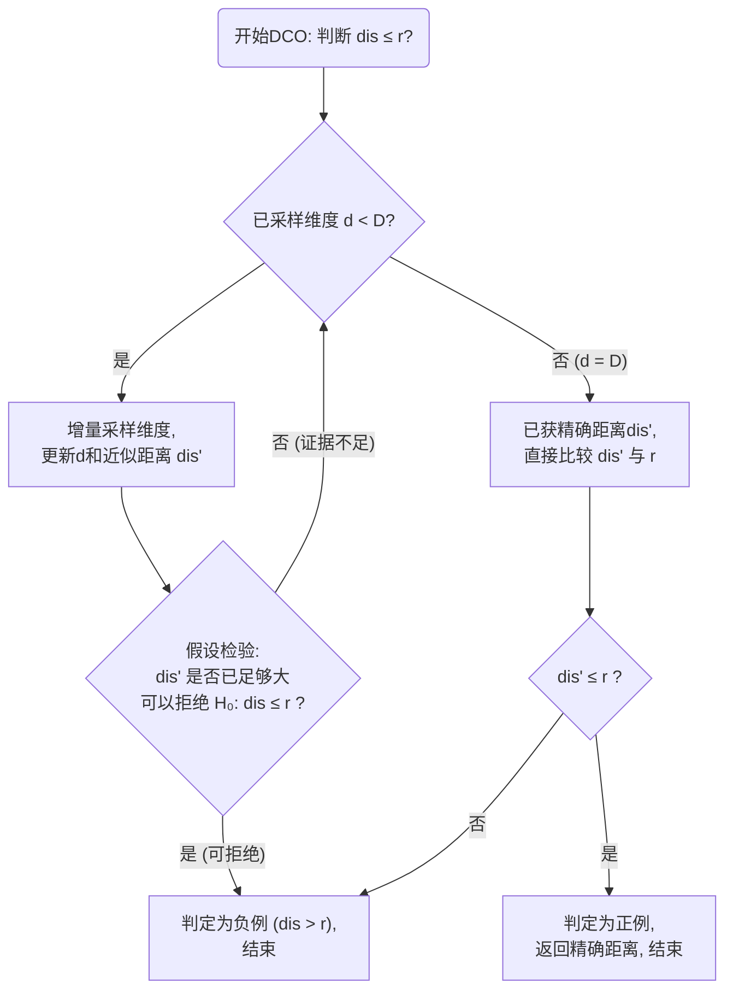

## AI论文解读 | High-Dimensional Approximate Nearest Neighbor Search: with Reliable and Efficient Distance Comparison Operations
        
### 作者        
digoal        
        
### 日期        
2025-06-25        
        
### 标签        
PostgreSQL , PolarDB , DuckDB , AI , 论文解读        
        
----        
        
## 背景  
      
https://dl.acm.org/doi/pdf/10.1145/3589282        
  
      
提示:        
```        
读懂《High-Dimensional Approximate Nearest Neighbor Search: with Reliable and Efficient Distance Comparison Operations》这篇论文需要提前掌握哪些基础知识, 请使用中文给我讲一下这些基础知识, 尽量通熟易懂, 可以使用markdown支持的图形增加解释性.        
        
使用中文通熟易懂的解读《High-Dimensional Approximate Nearest Neighbor Search: with Reliable and Efficient Distance Comparison Operations》这篇论文, 关键内容请深入讲解, 可以使用markdown支持的图形增加解释性.        
        
使用中文提取《High-Dimensional Approximate Nearest Neighbor Search: with Reliable and Efficient Distance Comparison Operations》论文中一些重要的术语并详细解释, 可以使用markdown支持的图形示增加解释性.        
```        
        
## 1 前置知识 
  
好的，为了完全理解《High-Dimensional Approximate Nearest Neighbor Search: with Reliable and Efficient Distance Comparison Operations》这篇论文，你需要掌握一些基础知识。我会用通俗易懂的语言，结合图示和比喻来为你讲解。

这篇论文的核心思想非常巧妙：在进行高维数据搜索时，我们不必每次都精确计算两个点的完整距离。对于大部分“明显不是邻居”的点，我们只用一小部分维度信息，就能快速做出“排除”的判断，从而节省大量计算时间。

以下是你需要了解的几个关键基础知识领域：

### 1\. 核心问题：K-近邻搜索 (KNN Search)

#### 什么是K-近邻 (K-Nearest Neighbor, KNN)？

想象一个班级里所有同学的座位分布图，每个同学是一个数据点。现在新来一个同学（查询点），KNN要做的就是找到离这位新同学最近的 K 个同学。

  * **精确KNN (Exact KNN)**：必须找到**毫无疑问**最近的那 K 个人。
  * **近似KNN (Approximate KNN, AKNN)**：找的 K 个人不一定100%是最近的，但八九不离十。比如，要求召回率(Recall)达到99%，意味着找到的 K 个人里，有99%是真正的近邻。在很多应用中，这种近似已经足够好，但速度快得多。

这篇论文聚焦的就是如何让 **AKNN** 变得更快。


### 2\. 主要挑战：维度诅咒 (Curse of Dimensionality)

这是理解本论文动机的基石。当数据的维度（特征数量）变得非常高时（比如几百上千维），会出现一些反直觉的现象：

1.  **数据稀疏**：在高维空间中，所有的数据点都互相离得很远，空间变得“空旷”。想象一下，在一条线上随机撒10个点很密集，但在一个巨大的立方体里随机撒10个点，它们就非常分散。
2.  **距离失效**：所有点到查询点的距离都变得差不多。这就好比在一场马拉松比赛中，除了领头的几个人，大部分人的差距都非常微小，很难区分谁前谁后。这使得“最近”这个概念变得模糊，搜索难度剧增。
3.  **计算昂贵**：计算两个高维点的距离，需要遍历每一个维度。维度是 `D`，计算一次距离的时间复杂度就是 `O(D)`。如果 `D` 很大，这个开销是惊人的。

**这篇论文的核心攻击点就是第三点**：既然计算完整距离（`O(D)`）这么慢，我们能不能用更快的（比如 `O(log D)`）方式完成大部分的距离比较任务？

### 3\. 核心数学与算法工具

#### a. 欧氏距离 (Euclidean Distance)

这是最常见的距离度量，就是我们初中学的两点间距离公式的推广。对于两个D维的点 $p$ 和 $q$，它们的欧氏距离是：
$$d(p, q) = \sqrt{(p_1-q_1)^2 + (p_2-q_2)^2 + \dots + (p_D-q_D)^2} = \sqrt{\sum_{i=1}^{D}(p_i - q_i)^2}$$
论文中所有“距离”指的都是这个。

#### b. 随机投影 (Random Projection)

这是论文方法 `ADSampling` 的理论基石。

  * **思想**：一个惊人的数学结论（Johnson-Lindenstrauss 引理）告诉我们，可以把高维空间中的点，通过一个随机矩阵，“拍扁”到一个低维空间，同时还能**基本保持点与点之间的相对距离不变**。
  * **比喻**：想象你用手电筒把一堆三维空间的物体（高维数据）投影到墙上形成影子（低维数据）。虽然影子是二维的，但原来靠得近的物体，它们的影子在墙上通常也靠得近。
  * **论文的创新用法**：传统随机投影是把所有点投到一个固定的低维空间。而本文提出的 `ADSampling` 更加灵活：它先对所有数据进行一次“随机旋转”（正交变换，这个操作不改变任何距离，只是换个坐标系看），然后在查询时，**动态地、增量地**采样一部分维度来估算距离。采样的维度越多，估算越准。这等价于一个可以动态调整目标维度的随机投影。

#### c. 假说检验 (Hypothesis Testing)

这是 `ADSampling` 实现“自适应”的关键。

  * **思想**：这是一种统计决策方法，用来判断一个猜想（假说）是否成立。
  * **比喻**：你想知道一枚硬币是否是公平的（正反概率都是50%）。这就是你的“原假设” ($H\_0$)。你抛了10次，结果是10次正面。这个结果在“硬币公平”的假设下，发生的概率极低。于是你就有很强的信心“拒绝原假设”，并断定这枚硬幣很可能有问题。
  * **论文中的应用**：
      * **任务**：判断一个候选点 `o` 到查询点 `q` 的真实距离 `dis` 是否小于某个门槛 `r`？
      * **原假设 ($H\_0$)**：`dis ≤ r` (这个点**是**一个潜在的近邻)。
      * **操作**：用少量采样的维度计算出一个**近似距离** `dis'`。
      * **决策**：
          * 如果这个近似距离 `dis'` **远大于** 门槛 `r`，那么真实距离 `dis` 小于 `r` 的可能性就微乎其微。这时就可以充满信心地“拒绝原假设”，直接把这个点排除掉，**而不需要计算完整的距离**。这就是加速的关键！
          * 如果 `dis'` 不够大，无法做出判断，那就再多采样一些维度，重新计算 `dis'`，再次进行检验，直到可以做出判断或者所有维度都被采样完。

### 4\. 需要了解的现有AKNN算法框架

论文提出的方法是一个“插件”，可以嵌入到几乎所有的AKNN算法中。因此，了解这些算法的基本框架很重要。

#### a. 基于图的方法 (Graph-based)，如 HNSW

  * **思想**：将所有数据点构建成一个复杂的“社交网络图”。每个点是图中的一个节点，相似的点之间有边连接。
  * **比喻**：这就像一个有普通公路和高速公路的地图系统。查询时，先走高速公路（图的上层结构）快速到达目标的大致区域，然后再切换到普通公路（图的底层结构）进行精细查找。
  * **论文的切入点**：在图上导航的每一步，都需要“判断邻居中谁离我更近”，这就要进行大量的**距离比较操作 (DCO)**。论文的方法可以加速这个比较过程。

#### b. 基于倒排索引/量化的方法 (Inverted File based)，如 IVF

  * **思想**：先把数据点通过聚类（比如K-Means）分成几千个“桶”（簇）。
  * **比喻**：这就像一个大图书馆，先把书按类别（如“计算机”、“文学”、“艺术”）放在不同的书架上。查询时，先确定查询点属于哪个或哪几个类别，然后只在这些书架上找书。
  * **论文的切入点**：从选定的“桶”里拿出所有候选点后，需要逐一计算它们与查询点的精确距离，来找出最终的K个近邻。这个过程是该方法最耗时的部分，同样涉及大量DCO，可以用论文方法优化。

### 5\. 计算机系统知识：缓存友好 (Cache Friendliness)

这是论文在 `IVF++` 中提到的一个工程优化技巧。

  * **思想**：CPU访问内存的速度远慢于访问自己的高速缓存（Cache）。如果能让CPU要用的数据提前、整块地进入缓存，就能极大提升性能。
  * **比喻**：一个厨师做菜。如果他先把这道菜要用的所有食材（葱、姜、蒜、肉）一次性从冰箱（内存）里拿出来放在案板（缓存）上，做菜就很快。如果他每切一样东西，都要重新跑回冰箱去拿，效率就很低。
  * **论文中的应用 (`IVF++`)**：`ADSampling` 总是先访问每个候选点的前 `Δd` 个维度。`IVF++` 优化了数据在内存中的布局，把所有候选点的“前 `Δd` 个维度”连续存放在一起，把“剩余的维度”存放在另一片区域。这样CPU可以一次性把所有“前 `Δd` 维”数据加载到缓存，实现批量快速处理。

### 总结

要读懂这篇论文，你的知识储备应该像一个工具箱：

| 必备知识 | 在论文中的作用 |
| :--- | :--- |
| **KNN/AKNN问题** | 理解论文要解决的根本目标。 |
| **维度诅咒** | 理解为什么需要这篇论文，即传统方法的痛点。 |
| **欧氏距离** | 基础数学度量。 |
| **随机投影 & 假说检验** | 理解论文核心算法 `ADSampling` 的两大理论支柱。 |
| **HNSW, IVF等算法框架** | 理解论文提出的“插件”可以应用在哪些主流系统中。 |
| **缓存友好** | 理解论文中的一个重要工程优化技巧 `IVF++`。 |

掌握了这些，你就能明白这篇论文是如何通过“用少量维度信息进行假设检验来提前排除非近邻点”这一核心思想，设计出 `ADSampling` 这一高效的距离比较方法，并将其作为插件，极大地提升了现有主流AKNN算法的性能。
  
## 2 解读论文 
  
好的，我们来一起深入解读这篇非常重要的论文——《High-Dimensional Approximate Nearest Neighbor Search: with Reliable and Efficient Distance Comparison Operations》。

这篇论文的核心贡献在于，它找到了一个在现有高维近邻搜索算法中普遍存在但被忽视的性能瓶颈，并为此设计了一套极为高效且可靠的“插件式”解决方案。

-----

### **引言：论文解决的核心问题是什么？**

 在高维度数据（例如，图像特征、词向量）中进行近似K近邻（AKNN）搜索是一个基础且充满挑战的问题   。想象一下，你需要在数百万张图片中，找到与给定图片最相似的10张。现有的大多数AKNN算法，无论是基于图、树、哈希还是量化，都遵循一个基本流程：首先筛选出一批“候选者”，然后再从这些候选者中精确找出最终的K个近邻  。

 问题就出在第二步：“从候选者中找出K个近邻”。这个过程耗费了惊人的计算资源。作者敏锐地观察到，几乎所有AKNN算法的耗时都主要由**距离比较操作 (Distance Comparison Operations, DCOs)** 主导  。

这篇论文就是要解决这个问题：**如何用一种更可靠、更高效的方式来执行DCO，从而为现有的各种AKNN算法普遍提速。**

-----

### **问题的瓶颈：被忽视的“距离比较操作 (DCO)”**

#### 1\. DCO是什么？

首先，我们来定义什么是DCO。

>  **距离比较操作 (DCO)**：给定一个候选对象`o`和一个距离阈值`r`，DCO的任务是判断`o`到查询点的距离`dis`是否不大于`r`。如果`dis ≤ r`，则返回精确的距离`dis`   。如果`dis ≤ r`，我们称`o`为**正例 (positive object)**；否则称为**负例 (negative object)**  。

传统的执行DCO的方法非常直接，被称为`FDScanning` (Full Dimension Scanning)：

1.   计算候选对象`o`和查询点`q`之间的完整欧氏距离`dis`  。
2.   将计算出的`dis`与阈值`r`进行比较  。

 这个方法的计算复杂度是`O(D)`，其中`D`是数据的维度  。

#### 2\. DCO为何是瓶颈？

 作者通过理论和实验证明，DCO是绝大多数AKNN算法的性能瓶颈  。

  *  **压倒性的时间占比**：在像HNSW这样的先进图算法中，DCO的耗时占总运行时间的77.2%到87.6%   。在IVF（倒排索引）算法中，这个比例更是高达85.0%到95.3%  。
  *  **大量的冗余计算**：作者发现，在一个典型的AKNN查询流程中，绝大多数的DCO都是针对**负例**的   。例如，在IVF算法中，负例的数量是正例的60到869倍   。对于这些负例，我们其实只需要知道它们的距离**大于**阈值`r`即可，根本不需要知道确切的距离值   。而`FDScanning`总是计算完整距离，做了大量不必要的计算  。

  


这个发现揭示了巨大的优化空间：如果我们能快速地“筛掉”那些大量的负例，就能实现显著的性能提升。

-----

### **核心解决方案：ADSampling 方法**

 为了解决DCO的效率问题，论文提出了一种全新的随机算法——`ADSampling` (Adaptive Dimension Sampling)   。它比传统的`FDScanning`更智能，并且能够保证结果的可靠性  。

`ADSampling`的核心思想可以分解为两步：

#### 第1步：随机变换与维度采样（等价于灵活的随机投影）

 传统方法如乘积量化或普通随机投影，为了提速通常会牺牲精度，难以用于需要高可靠性的DCO阶段  。`ADSampling`另辟蹊径：

1.   **预处理（索引阶段）**：对所有数据库中的高维向量进行一次**随机正交变换**   。这可以理解为将整个数据空间进行一次“随机旋转”。这个操作非常关键，因为它**完全不改变任何向量的长度和任意两点间的欧氏距离**，只是改变了坐标基  。
2.   **查询阶段**：当一个DCO请求到来时，`ADSampling`并不直接计算完整距离，而是从变换后的向量中**增量地采样维度**来估算距离  。

 这个“旋转+采样”的过程，其结果在概率分布上与经典的**随机投影**是等价的   。这为`ADSampling`提供了坚实的理论基础，即估算的距离与真实距离之间的误差是有界的   。但它比传统随机投影更灵活，因为它可以为不同的对象、在不同的时刻，采样不同数量的维度  。

#### 第2步：“自适应”的智慧：增量采样与假设检验

 `ADSampling`最精妙的地方在于它知道**何时停止采样**。它通过一种统计学工具——**假设检验 (Hypothesis Testing)** 来做决策  。

流程如下：

  *  **建立假设**：对于一个DCO（判断 `dis ≤ r`），我们建立一个“原假设” $H\_0$：“该对象的真实距离`dis`确实小于等于`r`” ($H\_0: dis \\le r$)  。
  *  **收集证据**：`ADSampling`先采样一小部分维度（例如32维），计算出一个近似距离`dis'`  。
  * **做出判断**：
      *  **情况1 (快速拒绝)**：如果这个近似距离`dis'`已经**显著地大于**阈值`r`（例如， $dis' \> (1+\\epsilon\_0/\\sqrt{d})\\cdot r$ ），那么`dis`实际小于`r`的可能性就微乎其微   。此时，我们可以充满信心地**拒绝原假设 $H\_0$**，直接判定这是一个负例，并立即终止计算  。这对于大量的负例来说，极大地节省了时间。
      *  **情况2 (证据不足)**：如果`dis'`没有显著大于`r`，我们还不能做出判断。这时，`ADSampling`会继续采样更多的维度，更新近似距离`dis'`，然后重复进行假设检验  。
      *  **情况3 (采样到底)**：如果直到所有`D`个维度都被采样完，我们仍然无法拒绝 $H\_0$ ，此时我们已经得到了**精确的距离**  。然后就按常规方法比较即可。

这个自适应过程可以用下面的流程图来表示：



#### 性能分析

  *  对于**负例**，`ADSampling`的期望时间复杂度是**对数级别**的 $O(\\log D)$  。
  *  对于**正例**，它会以极高的概率成功（即不会错误地拒绝），并且时间复杂度为 $O(D)$（最坏情况）  。
  *  由于负例占绝大多数，整体性能提升非常显著  。

-----

### **从理论到实践：AKNN+ 与 AKNN++**

作者进一步提出了如何将`ADSampling`这个强大的“DCO引擎”集成到现有AKNN算法中的具体方案。

#### 1\. AKNN+：通用插件方案

 这是一个普适性的增强方案：在任何一个AKNN算法（如HNSW, IVF）中，简单地将原来使用`FDScanning`进行DCO的地方，全部替换为`ADSampling`   。这样得到的算法被称为`AKNN+`（例如HNSW+, IVF+）  。

 `AKNN+`能够在保持原算法结果（召回率）基本不变的前提下，显著降低查询时间  。

#### 2\. AKNN++：针对特定算法的深度优化

作者还为两类主流算法设计了更具针对性的`++`版本。

**a. HNSW++：为图算法引入更多近似**

  *  **背景**：在HNSW+中，DCO的阈值`r`是已访问节点中第 $N\_{ef}$ 远的距离（ $N\_{ef}$ 是一个远大于K的参数），这个距离`r`既用于筛选最终结果，也用于指导图的搜索过程  。
  *  **优化**：HNSW++认为，用于“指导搜索”的距离不必那么精确   。因此，它将DCO的阈值`r`大胆地从第 $N\_{ef}$ 远的距离换成了第**K**远的距离  。
  *  **好处**：因为K通常远小于 $N\_{ef}$ ，所以这个新的阈值`r`会小很多。一个更小的`r`意味着候选点的距离`dis`与`r`的相对差距（即 $(dis-r)/r$ ）变大了，这使得`ADSampling`的假设检验更容易提前成功，从而可以用更少的采样维度完成DCO，实现进一步加速  。

**b. IVF++：为倒排索引算法优化缓存**

  *  **背景**：IVF算法在处理一批候选者时，数据是连续存储的，缓存友好度很高   。但`ADSampling`的增量采样破坏了这种连续访问模式，导致缓存效率下降  。
  *  **优化**：IVF++重新组织了内存中数据的布局   。它将所有候选向量的**前`d₁`个维度**（`ADSampling`第一步肯定会访问的维度）连续存储在一起，将**剩余的`D-d₁`个维度**存储在另一块连续的内存中  。
  *  **好处**：在执行DCO时，CPU可以一次性将所有候选者的前`d₁`个维度加载到高速缓存中，进行批量、高效的第一轮筛选，极大地提升了缓存命中率和整体性能  。

下面的图示清晰地展示了IVF、IVF+和IVF++在数据访问模式上的区别：


  
  
  
### **实验结果与结论**

 论文通过在多个真实数据集上的大量实验，充分验证了其方法的有效性  。

  *  **显著提速**：`ADSampling`为HNSW带来了最高**2.65倍**的加速，为IVF带来了最高**5.58倍**的加速，同时保持了几乎完全相同的精度  。
  *  **大幅减少计算量**：在精度损失不超过0.14%的情况下，HNSW++最多可以节省**75.3%的维度评估开销，IVF++最多可以节省89.2%**  。
  *  **全面超越**：无论是与原版算法（HNSW/IVF）还是与简单的优化方法（如`PDScanning`）相比，`AKNN+`和`AKNN++`系列算法在速度-精度权衡曲线上都表现出压倒性的优势  。

**总而言之**，这篇论文做出了以下关键贡献：

1.   **识别并证明**了DCO是现有AKNN算法的普遍性能瓶颈  。
2.   **提出**了`ADSampling`，一个基于随机变换和自适应假设检验的、可靠且高效的DCO新方法  。
3.   **开发**了一套通用的`AKNN+`和针对性的`AKNN++`增强技术，可作为插件提升现有算法的性能  。

这项工作不仅在理论上优雅，在工程实践上也极具价值，为高维近邻搜索领域的发展提供了新的、有效的优化方向。
  
## 3 术语  
  
好的，这是对《High-Dimensional Approximate Nearest Neighbor Search: with Reliable and Efficient Distance Comparison Operations》论文中一些关键术语的中文提取和详细解释。

-----

### **1. 距离比较操作 (Distance Comparison Operation, DCO)**

  *  **定义**：给定一个对象`o`和一个距离阈值`r`，DCO旨在判断对象`o`到查询点的距离`dis`是否不大于`r`   。如果`dis ≤ r`，它还会返回这个精确的距离值  。

  *  **详细解释**：DCO是近似K近邻（AKNN）搜索算法中的一个核心计算单元   。无论是基于图、树还是倒排索引的方法，在从大量候选中筛选最终的K个近邻时，都需要反复执行这个操作来决定一个候选是应该被保留还是丢弃   。这篇论文的核心论点是，DCO的效率直接决定了整个AKNN算法的性能  。
  
在这个操作中，有两个重要的子概念：  
*  **正例 (Positive Object)**：如果一个对象的真实距离`dis`不大于阈值`r`（即`dis ≤ r`），则称其为正例  。
*  **负例 (Negative Object)**：如果对象的真实距离`dis`大于阈值`r`，则称其为负例  。
  
论文发现，在实际查询中，绝大多数DCO都是在处理**负例**   。而对于负例，我们其实只需要知道它“不符合条件”即可，无需知道其确切距离，这为优化提供了巨大空间  。
  
### **2. DCO的基准方法**

#### **a. FDScanning (Full Dimension Scanning)**

  *  **定义**：这是一种执行DCO的传统方法，它通过扫描一个对象的**全部维度**来计算其完整、精确的距离，然后再与阈值进行比较  。
  *  **详细解释**：`FDScanning`简单直接，但效率低下，其时间复杂度与维度`D`成正比，即`O(D)`   。在处理高维数据时，这个开销是巨大的，也是导致DCO成为性能瓶颈的直接原因  。

#### **b. PDScanning (Partial Dimension Scanning)**

  *  **定义**：这是一种在论文实验中用于对比的基准方法。它会增量式地扫描**原始向量**的维度，并累加距离的平方和。一旦基于部分维度计算出的距离已经超过了阈值`r`，它就会提前终止计算  。
  *  **详细解释**：`PDScanning`比`FDScanning`更智能一些，因为它能提前排除某些负例。但它是一个**精确算法**，其结论不会有任何错误   。它的性能依赖于数据的原始坐标分布，在最坏情况下，仍然需要扫描所有维度，复杂度仍为`O(D)`  。

### **3. 核心解决方法：ADSampling**

 `ADSampling` (Adaptive Dimension Sampling) 是本文提出的核心创新，一种用于DCO的、高效且可靠的随机算法  。

  *  **定义**：它通过对随机变换后的向量进行自适应的维度采样，能够在对数时间内处理绝大多数DCO，并以极高的概率获得正确结果  。

  * **详细解释**：其工作原理包含两个关键部分：

    1.  **随机正交变换 (Random Orthogonal Transformation)**
         这是一个预处理步骤，在索引阶段对所有数据向量应用一个随机的正交矩阵   。这个操作可以理解为对整个数据空间进行一次“随机旋转”   。它的关键特性是**完全保持任意两点间的欧氏距离不变**   。这样做的目的是为了让后续的维度采样在概率上等价于经典的随机投影，从而拥有坚实的理论保证（如距离近似误差有界） 。

    2.  **增量采样与假设检验 (Incremental Sampling with Hypothesis Testing)**
         这是`ADSampling`的“自适应”智慧所在。它并非一次性决定采样多少维度，而是采用一种“边采样、边决策”的策略  。

        ```mermaid
        graph TD
            subgraph ADSampling 决策流程
                A(开始DCO) --> B{已采样维度 d < D?};
                 B -- 是 --> C[增量采样更多维度<br>更新近似距离 dis'  ];
                 C --> D{进行假设检验<br>H₀: 真实距离 dis ≤ r  };
                 D -- 检验通过(显著大于r) --> E[判定为<b>负例</b>, 提前终止  ];
                D -- 检验不通过(证据不足) --> B;
                 B -- 否 (d = D) --> F[已获精确距离<br>直接比较大小  ];
                 F -- dis' ≤ r --> G[判定为<b>正例</b>, 返回精确距离  ];
                F -- dis' > r --> E;
            end
        ```

          *  **假设检验**：算法的核心决策机制   。它设立一个“原假设” $H\_0: dis \\le r$（即对象是一个正例） 。
          *  **决策规则**：基于已采样的`d`个维度计算出的近似距离`dis'`，如果`dis'`已经足够大，大到使得“原假设为真”的可能性变得极小，算法就会“拒绝原假设”，并自信地将该对象判定为负例，从而提前结束计算   。如果证据不足，则继续采样  。

### **4. 优化方案：AKNN+ 与 AKNN++**

`ADSampling`是一个基础工具，论文进一步提出了如何将其集成到现有AKNN算法中的方案。

#### **a. AKNN+**

  *  **定义**：一个通用的增强方案，指将任意一个AKNN算法中的DCO操作从`FDScanning`替换为`ADSampling`  。例如，HNSW算法增强后称为HNSW+。
  *  **目标**：在以极高的概率保持原算法搜索结果不变的同时，显著提升其运行效率  。

#### **b. AKNN++**

  *  **定义**：在`AKNN+`的基础上，针对特定类型的算法（如基于图的HNSW和基于倒排索引的IVF）进行的深度、专属优化  。

      * **HNSW++**:
         这个优化针对HNSW这类图算法。HNSW在搜索时维护一个大小为 $N\_{ef}$ 的动态结果集`R`，DCO的阈值就是`R`中第 $N\_{ef}$ 远的距离   。HNSW++认为用于指导搜索的距离不必完全精确   ，因此大胆地将DCO的阈值从第 $N\_{ef}$ 远的距离改为第**K**远的距离   。因为K远小于 $N\_{ef}$ ，阈值变小使得`ADSampling`更容易提前终止，从而进一步提速  。

        ```mermaid
        graph TD
            subgraph HNSW+
                DCO_Threshold_Plus("DCO 阈值: 第 Nₑբ 远的距离")
            end
            subgraph HNSW++
                DCO_Threshold_PlusPlus("DCO 阈值: 第 K 远的距离 (更小, 更快)")
            end
        ```

      * **IVF++**:
         这个优化针对IVF这类批量处理候选者的算法，旨在提升**缓存友好性 (Cache Friendliness)**   。`ADSampling`的跳跃式维度采样会破坏IVF原有的连续内存访问模式，导致缓存效率降低   。IVF++通过重新组织内存布局来解决此问题：它将所有候选者的**前`d₁`个维度**（`ADSampling`最先访问的部分）连续存储，将**剩余维度**存在另一处   。这样CPU可以一次性将高频访问的数据加载到缓存中，实现高效的批量处理  。
  
## 参考        
         
https://dl.acm.org/doi/pdf/10.1145/3589282  
        
        
<b> 以上内容基于DeepSeek、Qwen、Gemini及诸多AI生成, 轻微人工调整, 感谢杭州深度求索人工智能、阿里云、Google等公司. </b>        
        
<b> AI 生成的内容请自行辨别正确性, 当然也多了些许踩坑的乐趣, 毕竟冒险是每个男人的天性.  </b>        

  
  
#### [期望 PostgreSQL|开源PolarDB 增加什么功能?](https://github.com/digoal/blog/issues/76 "269ac3d1c492e938c0191101c7238216")
  
  
#### [PolarDB 开源数据库](https://openpolardb.com/home "57258f76c37864c6e6d23383d05714ea")
  
  
#### [PolarDB 学习图谱](https://www.aliyun.com/database/openpolardb/activity "8642f60e04ed0c814bf9cb9677976bd4")
  
  
#### [PostgreSQL 解决方案集合](../201706/20170601_02.md "40cff096e9ed7122c512b35d8561d9c8")
  
  
#### [德哥 / digoal's Github - 公益是一辈子的事.](https://github.com/digoal/blog/blob/master/README.md "22709685feb7cab07d30f30387f0a9ae")
  
  
#### [About 德哥](https://github.com/digoal/blog/blob/master/me/readme.md "a37735981e7704886ffd590565582dd0")
  
  

  
