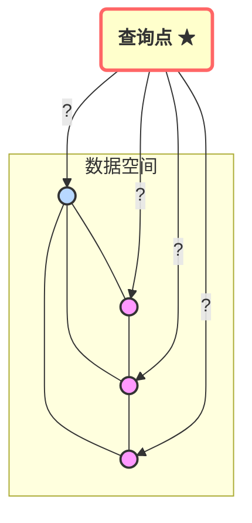
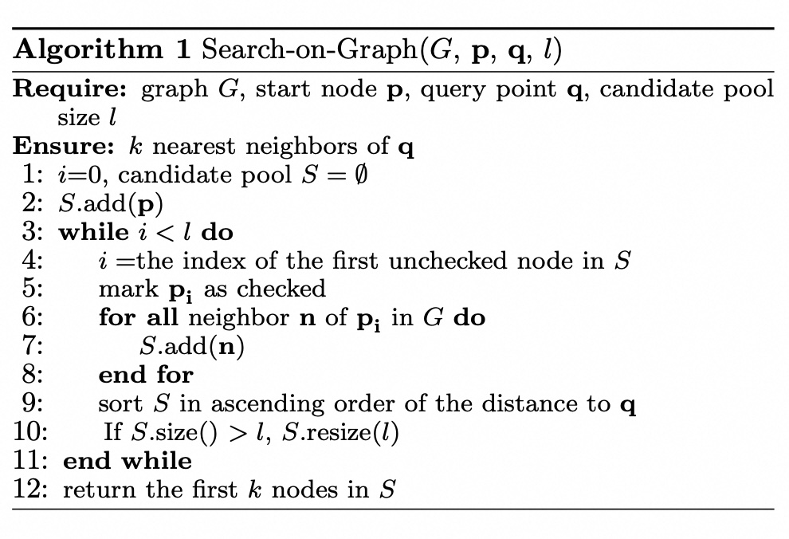
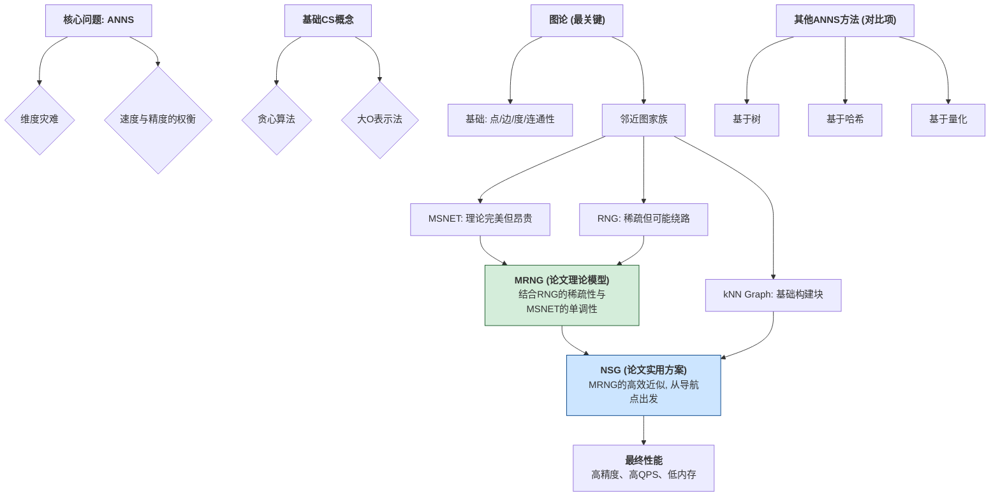
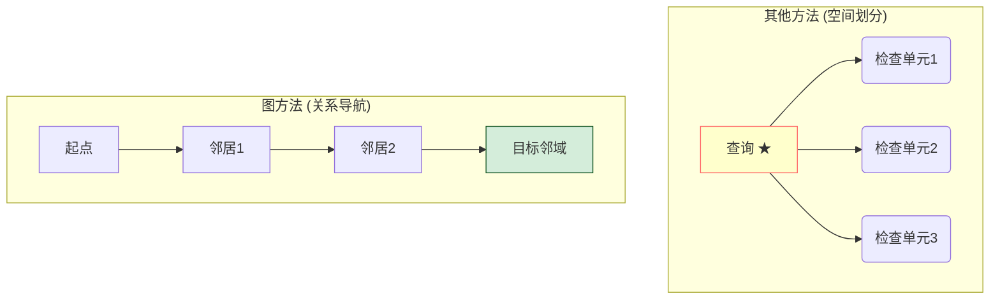
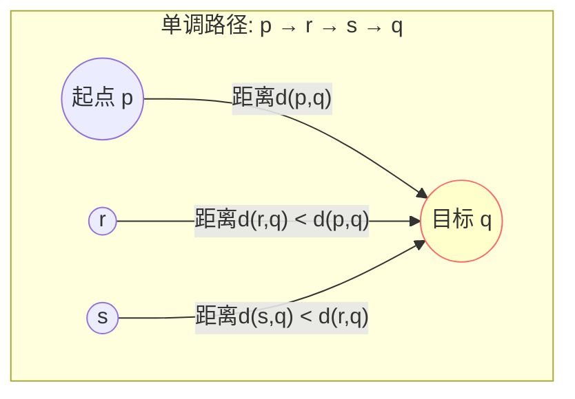
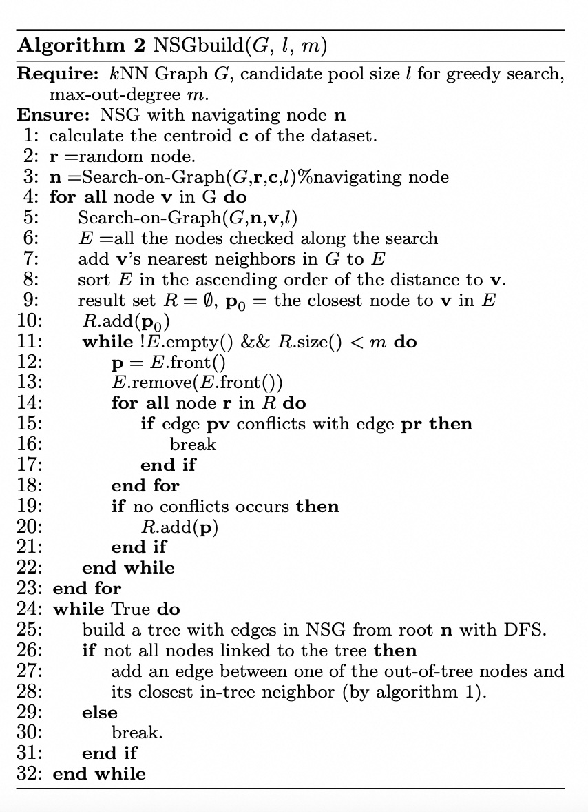

## AI论文解读 | Fast Approximate Nearest Neighbor Search With The Navigating Spreading-out Graph
        
### 作者        
digoal        
        
### 日期        
2025-06-25        
        
### 标签        
PostgreSQL , PolarDB , DuckDB , AI , 论文解读        
        
----        
        
## 背景  
      
https://dl.acm.org/doi/pdf/10.14778/3303753.3303754        
  
      
提示:        
```        
读懂《Fast Approximate Nearest Neighbor Search With The Navigating Spreading-out Graph》这篇论文需要提前掌握哪些基础知识, 请使用中文给我讲一下这些基础知识, 尽量通熟易懂, 可以使用markdown支持的图形增加解释性.        
        
使用中文通熟易懂的解读《Fast Approximate Nearest Neighbor Search With The Navigating Spreading-out Graph》这篇论文, 关键内容请深入讲解, 可以使用markdown支持的图形增加解释性.        
        
使用中文提取《Fast Approximate Nearest Neighbor Search With The Navigating Spreading-out Graph》论文中一些重要的术语并详细解释, 可以使用markdown支持的图形示增加解释性.        
```        
        
## 1 前置知识 
  
好的，为了完全理解《使用导航扩展图进行快速近似最近邻搜索》（Fast Approximate Nearest Neighbor Search With The Navigating Spreading-out Graph）这篇论文，你需要掌握一系列从基础到专业的知识。我会将这些知识点分门别类，并用通俗易懂的语言和图示来解释。

-----

### 核心思想概览

这篇论文的目标是解决一个经典问题：如何**在大规模数据中快速且准确地找到与查询点最相似的几个点**。作者提出了一种名为 **NSG (Navigating Spreading-out Graph)** 的新方法。其核心思想是：

1.  构建一个特殊的 **图（Graph）** 来表示数据点之间的“邻近”关系。
2.  从一个固定的“导航点”出发，像在地图上导航一样，沿着图的边高效地走向查询目标。

要理解这个过程，你需要以下基础知识：

### 1\. 核心问题：近似最近邻（ANNS）搜索

#### 1.1 什么是最近邻搜索 (NNS)？

想象一下，你在一个满是星星的夜空中，指定其中一颗星星（查询点），让你找出离它最近的那颗（最近邻）。这就是最近邻搜索。如果让你找最近的 K 颗星，那就是 K-NNS。



  * **挑战**：当数据量巨大时（比如几十亿个点），一个一个去比较距离（暴力搜索）会非常慢，计算量无法接受。

#### 1.2 为什么需要“近似” (ANNS)？

为了追求极致的速度，我们可以稍微牺牲一点精度。ANNS 的目标是：**不一定非要找到100%正确的最近邻，但要找到一个足够近的（比如，在真实最近邻距离的1.1倍范围内的点），并且速度要快成千上万倍**。在绝大多数应用场景（如推荐系统、图像搜索），这种“近似”的结果已经足够好了。

  * **核心权衡 (Trade-off)**：**速度 vs. 精度**。ANNS 算法通常可以调整参数，让你在这两者之间做选择。

#### 1.3 维度灾难 (Curse of Dimensionality)

这是高维数据搜索领域的核心难题。当数据的特征维度很高时（比如论文中提到的128维甚至960维），会出现一些反直觉的现象：

  * **空间变得极其稀疏**：所有的数据点都互相离得很远。
  * **距离失去意义**：随便两个点之间的距离都差不多远，“远”和“近”的对比不再明显。
  * **传统索引失效**：像树一样的空间划分方法（下面会讲）效果会急剧下降。

### 2\. 计算机基础算法与概念

#### 2.1 贪心算法 (Greedy Algorithm)

这篇论文中图搜索的核心策略就是贪心。贪心算法在每一步决策时，都采取**当前看起来最好**的选择。

  * **例子**：假设你在一个山坡上，目标是尽快到达山顶。贪心策略就是你每走一步，都选择脚下最陡峭的方向。
  * **论文中的应用 (Algorithm 1)**：从一个起始点开始，检查它所有的邻居，然后跳到离查询目标**最近**的那个邻居。重复这个过程，一步步逼近目标。
  
  
  
#### 2.2 大O表示法 (Big O Notation)

这是衡量算法效率（时间和空间）的通用语言。你需要理解几种常见的复杂度：

  * $O(n^2)$: 非常慢，比如暴力比较所有点对。n是数据量。
  * $O(n\\log n)$: 比较高效，很多排序算法是这个级别。
  * $O(n)$: 线性时间，速度很快。
  * $O(\\log n)$: 极快，比如二分查找。
    论文的目标之一就是把搜索复杂度从很高（如 $O(n^2)$）降低到接近对数级别（ $O(\\log n)$ ）。

### 3\. 图论（Graph Theory）核心概念

这是理解这篇论文**最关键**的部分，因为 NSG 本质上就是一种图。

#### 3.1 基础概念

  * **图 (Graph)**: 由**节点 (Node/Vertex)** 和连接节点的**边 (Edge)** 组成。在论文里，每个数据点就是一个节点。
  * **邻居 (Neighbor)**: 如果两个节点之间有边直接相连，它们互为邻居。
  * **出度 (Out-degree)**: 在有向图中，一个节点指向其他节点的边的数量。出度越低，贪心搜索时需要比较的邻居就越少，速度越快。
  * **连通性 (Connectivity)**: 确保从图中的任意一个节点出发，总能找到一条路径到达另一个节点。这对于搜索至关重要，否则目标可能根本无法到达。

#### 3.2 几种重要的邻近图 (Proximity Graph)

论文中提到和对比了多种图，你需要了解它们的核心思想：

  * **k-近邻图 (kNN Graph)**

      * **定义**：每个节点都与它在数据集中最接近的 k 个节点相连。
      * **特点**：构建简单直观，是很多现代图算法的基础。但 k 值选择很关键，k太小图可能不连通，k太大边太多导致搜索变慢。

  * **相对邻近图 (Relative Neighborhood Graph, RNG)**

      * **定义**：一条边 `(p, q)` 存在，当且仅当以 `p` 和 `q` 为圆心、以 `pq` 距离为半径画两个圆，这两个圆相交的月牙区域（lune）内**没有任何其他点**。
      * **图示**:
        ```mermaid
        graph TD
            subgraph Lune区域
                P((p)) --- Q((q))
            end
            subgraph "无其他点，可以连接"
                P2((p)) --- Q2((q))
            end
            subgraph "lune中有r，p和q不能连接"
                P3((p)) -.-> Q3((q))
                R((r))
            end
            style Lune区域 fill:#e6f3ff
        ```
      * **特点**: 边的选择条件非常严格，所以图很**稀疏**（边少，出度低），但可能因为边太少而**不保证**搜索路径是最优的（可能需要绕远路）。

  * **单调搜索网络 (Monotonic Search Network, MSNET)**

      * **定义**：一种理论上很完美的图。对于图中任意两点 `p` 和 `q`，**一定存在**一条从 `p` 到 `q` 的路径，使得路径上的每一步都离终点 `q` **越来越近**。
      * **特点**: 在这种图上用贪心算法搜索，**永远不会走错方向或陷入局部最优**，保证能找到目标。但构建一个真正的 MSNET 非常非常耗时。

#### 3.3 论文的核心图结构：MRNG 和 NSG

  * **单调相对邻近图 (Monotonic RNG, MRNG)**

      * 这是作者首先提出的一个**理论上**的图结构。
      * **思想**: 它是对 RNG 的一种**改进**，通过一个递归的、更宽松的边选择策略，**确保了图的单调性**（即它是一个 MSNET）。这样既保持了图的稀疏性，又保证了贪心搜索的有效性。
      * **定位**: 这是一个理论模型，构建起来还是很慢，不实用。

  * **导航扩展图 (Navigating Spreading-out Graph, NSG)**

      * 这是论文最终提出的**实用方案**。
      * **思想**: 它是对 **MRNG 的一种高效近似**。它不要求所有点之间都有单调路径，而是：
        1.  **选择一个导航点 (Navigating Node)**：通常是数据的中心点。
        2.  **保证单调性**: 尽力确保从这个**导航点**到**其他所有点**的路径是单调的。
        3.  **搜索**: 所有查询都从这个固定的导航点开始。
      * **定位**: 这是一个工程上的杰作，它通过牺牲全局最优性换来了极高的构建和搜索效率，同时通过精心设计（如限制出度、保证连通性）在性能上超越了当时的所有算法。

### 4\. 其他 ANNS 方法（用于对比）

论文中将 NSG 与其他类型的 ANNS 方法进行了比较，了解这些方法能让你更好地理解 NSG 的优势。

  * **基于树的方法 (Tree-based)**: 如 KD-Tree。通过不断地用超平面分割数据空间来建立索引。在高维空间中，为了找到最近邻需要回溯检查非常多的“盒子”，效率急剧下降。
  * **基于哈希的方法 (Hashing-based)**: 如 LSH (Locality Sensitive Hashing)。思想是“相似的点有很大概率哈希到同一个桶里”。通过哈希快速缩小搜索范围。但为了保证查准率，需要很多哈希表，占用内存大。
  * **基于量化的方法 (Quantization-based)**: 如 PQ (Product Quantization)。通过将高维向量压缩成短编码来减少内存和计算量。是一种在内存和精度之间取得很好平衡的方法，也是工业界应用最广的方法之一。

-----

### 总结：你需要掌握的知识地图

为了读懂这篇论文，你的知识储备应该像这样：



掌握了这些基础知识后，你再阅读论文时，就能明白作者为什么要做这些选择，他们的方法创新在何处，以及为什么 NSG 能够取得如此优异的性能。
  
## 2 解读论文 
  
好的，我们来一起深入解读这篇在近似最近邻搜索（ANNS）领域具有里程碑意义的论文——《使用导航扩展图进行快速近似最近邻搜索》。

 这篇论文的核心贡献是提出了一种名为 **NSG (Navigating Spreading-out Graph)** 的图索引结构，它在搜索速度、内存占用和搜索精度之间取得了当时（state-of-the-art）最佳的平衡，尤其是在高精度要求下表现卓越  。

为了让您彻底理解，我们将按照以下逻辑来剖析这篇论文：

1.  **问题的核心**：为什么我们需要 ANNS，图方法又好在哪里？
2.  **作者的思考**：如何设计一个“理想”的 ANNS 图？
3.  **理论的基石**：完美的“单调相对邻近图 (MRNG)”是什么？
4.  **现实的方案**：如何从完美的 MRNG 近似出实用的“导航扩展图 (NSG)”？
5.  **NSG 的优势与成果**：它为什么这么快？

-----

### 1\. 问题的核心：为什么图方法是 ANNS 的好选择？

 近似最近邻搜索（ANNS）旨在从海量数据（如上亿张图片、商品）中，快速找到和给定查询最相似的几个目标   。传统方法如树、哈希等，在处理高维数据时会遭遇“维度灾难”，性能急剧下降  。

 图方法（Graph-based Methods）另辟蹊径，它们不划分空间，而是建立一个“关系网”：每个数据点是一个**节点**，相似的点之间用**边**连接   。搜索过程就像在一个社交网络里找人，从一个起点出发，通过朋友（邻居节点）一步步接近目标  。

 **图方法的天然优势**：它们能更好地表达数据在高维空间中的复杂邻里关系，相比其他方法，往往可以用更少的距离计算次数达到同样的精度  。



*如上图所示，图方法通过“导航”的方式，可以更精准地逼近目标，而其他方法可能需要检查很多不相关的空间区域。*

 然而，早期的图方法要么构建太慢（复杂度高达 $O(n^2)$），要么内存占用巨大，难以扩展到十亿级别的数据集  。

### 2\. 作者的思考：如何设计一个“理想”的 ANNS 图？

 论文作者首先明确了设计一个优秀的图索引需要同时优化的四个目标，这也是理解 NSG 设计哲学的关键  ：

1.   **保证连通性 (Connectivity)**：图必须是连通的，否则如果起点和目标不在一个“岛”上，就永远也找不到  。
2.   **降低平均出度 (Low Out-degree)**：每个节点的邻居数量（出度）要少。因为搜索时每一步都要计算与当前节点所有邻居的距离，邻居越少，每一步的计算成本就越低  。
3.   **缩短搜索路径 (Short Path)**：从起点到目标的“导航”路径要尽可能短，这样总的搜索步数就少  。
4.   **减小索引大小 (Small Index Size)**：图本身占用的内存要小，才能处理海量数据  。

这四个目标常常是相互矛盾的。比如，为了缩短路径，我们可能想多加一些“高速公路”式的长边，但这会增加出度和索引大小。如何平衡这四者，是这篇论文的核心挑战。

### 3\. 理论的基石：单调相对邻近图 (MRNG)

 在提出实用的 NSG 之前，作者先构建了一个理论上非常优美的图模型——**MRNG (Monotonic Relative Neighborhood Graph)**  。

#### 什么是“单调性 (Monotonicity)”？

 单调性是图搜索中最理想的属性。一个图具有单调性，意味着对于任意起点 `p` 和目标 `q`，总存在一条路径，路径上的每一步都**严格地**离目标 `q` 更近  。



 **单调性的巨大好处**：当使用贪心算法（即每一步都走向离目标最近的邻居）在此类图上搜索时，永远不会“走回头路”或陷入局部最优，理论上保证了搜索的高效性  。
  
 **科学的发展也具有单调性! 后来者要么站在前者的肩膀上, 或者推翻前人的理论, 基于新的假设建立新的理论!**  

#### MRNG 如何实现单调性？

 之前的 RNG (Relative Neighborhood Graph) 图通过一个严格的“月牙区域”规则来建边，使得图非常稀疏，但也破坏了单调性，搜索时容易绕远路  。

MRNG 对 RNG 的建边规则进行了巧妙的修改。其定义是递归的，可以通俗理解为：

>  对于两点 `p` 和 `q`，我们尝试连接它们。除非在它们的“月牙区域”里存在一个“更好的”中继点 `r`，并且 `p` 到 `r` 的连接是允许的，否则 `p` 和 `q` 之间就可以建立一条有向边 $\\vec{pq}$  。

 这个定义确保了 MRNG 是一个单调搜索网络（MSNET），从而保证了搜索路径的长度期望值接近对数级（ $O(\\log n)$ ）  。同时，它还保持了图的稀疏性，节点的度数不会随数据量 `n` 的增加而增加  。

 **MRNG 的定位**：一个理论上近乎完美的 ANNS 图，它同时拥有**低出度**和**短路径**。但它的构建复杂度依然很高（ $O(n^2 \\log n)$ ），不适合直接用于大规模问题  。

### 4\. 现实的方案：导航扩展图 (NSG)

 NSG 是论文的最终方案，它是对理论模型 MRNG 的一个极其高效的**近似**  。NSG 的构建过程巧妙地围绕着第二节中提到的四个设计目标展开。

 **NSG 构建步骤 (Algorithm 2)**：
  
   
  
1.  **预处理：构建一个近似 kNN 图**

      *  万丈高楼平地起，NSG 的基础是一个高质量的近似 kNN 图。这一步保证了数据点基本的邻里关系  。

2.  **确定导航点 (Navigating Node)**

      *  这是 NSG 的点睛之笔。算法会计算数据集的质心，然后在 kNN 图上找到离质心最近的那个数据点，并将其定为全局唯一的**导航点**  。
      *  **作用**：之后所有的搜索都将从这个固定的导航点开始。这大大简化了问题，我们不再需要保证图中任意两点间的单调性，而只需关注从**导航点**到其他所有点的路径即可  。

3.  **为每个节点筛选邻居 (Search-Collect-Select)**

      * 这是近似 MRNG 的核心步骤。对于图中的每一个节点 `p`：
          *  **模拟搜索 (Search & Collect)**：从**导航点**出发，在 kNN 图上模拟一次到 `p` 的搜索。将搜索路径上访问过的所有节点都收集起来，作为 `p` 的**候选邻居集**  。
          *  **应用 MRNG 规则 (Select)**：在这些有限的候选邻居中，应用 MRNG 的边选择策略，为 `p` 选出最终的邻居  。
      *  **为什么这样做有效？** 因为从导航点到 `p` 的路径上的点，很可能就是构成最优、最直路径的关键节点。在这个小范围内应用 MRNG 规则，能以极低的成本高效地近似出 MRNG 的优良结构  。

4.  **保证连通性 (Spreading-out)**

      * 由于在第 3 步中为了控制出度而丢弃了很多边，可能会导致图出现孤岛。
      *  **解决方法**：从导航点开始，对生成的图进行一次深度优先搜索（DFS）生成一棵树。检查是否有节点未被连接到树上，如果有，就为这些“孤立点”找到它们在树中最近的邻居并连上，重复此过程，直到所有点都可从导航点到达  。这确保了图的完全连通性。

通过以上步骤，NSG 成功地将 MRNG 的思想落地，构建出一个**索引小、出度低、路径短、且完全连通**的实用图索引。

### 5\. NSG 的优势与成果

  *  **性能卓越**：实验表明，NSG 在多个公用和工业数据集上，其搜索性能显著超越了包括 HNSW 在内的所有现有算法   。尤其是在要求 99% 以上的高精度时，NSG 的速度优势更加明显，比次优算法快数倍  。

  *  **内存效率高**：相比于当时最强的 HNSW（它采用多层图结构），NSG 只有一层稀疏图，没有辅助结构   。这使得 NSG 的内存占用非常小，大约只有 HNSW 的 1/3 到 1/2，使其能处理更大数据规模的问题  。

  * **理论支撑坚实**：NSG 的设计并非凭空而来，而是基于 MRNG 坚实的理论基础。它对“为什么这样设计有效”给出了清晰的解释，而不是单纯的启发式调参。

  *  **工业界成功应用**：论文提到，NSG 已经在阿里巴巴淘宝的十亿级电商搜索场景中成功部署和应用，取得了比其基线方法（优化的量化方法）快 5-10 倍的效果，并满足了严苛的响应时间要求  。

### 总结

《Fast Approximate Nearest Neighbor Search With The Navigating Spreading-out Graph》这篇论文提供了一个从深刻理论到高效实践的完美范例。

  * 它首先通过 **MRNG** 定义了一个理论上理想的 ANNS 图应具备的**单调性**和**稀疏性**。
  * 然后，它创造性地提出了 **“导航点”** 的概念，并设计了一套 **“搜索-收集-选择”** 的流程，从而诞生了实用的 **NSG** 算法。
  * NSG 精妙地平衡了**连通性、出度、路径长度、索引大小**这四个核心指标，最终在效果上实现了对当时所有顶尖算法的超越。

理解了从 MRNG 到 NSG 的演进，以及 NSG 构建过程中每一步的精巧设计，就掌握了这篇论文的精髓。
  
## 3 术语  
  
这是一篇关于近似最近邻搜索（Approximate Nearest Neighbor Search, ANNS）的论文，名为《Fast Approximate Nearest Neighbor Search With The Navigating Spreading-out Graph》。以下是论文中一些重要术语的提取和详细解释，并辅以Markdown支持的图示说明：

### 1\. 近似最近邻搜索 (Approximate Nearest Neighbor Search, ANNS)

  * **定义：** 在一个大规模数据集中，找到与给定查询点“最相似”的K个点（即K近邻）。与精确最近邻搜索（Exact Nearest Neighbor Search）不同，ANNS允许一定的误差，以换取更快的搜索速度和更低的内存消耗。这在处理高维数据或海量数据集时尤为重要，因为精确搜索的计算成本会非常高。

  * **重要性：** ANNS是许多领域的基础问题，例如图像识别、推荐系统、自然语言处理、数据挖掘等。例如，在推荐系统中，ANNS可以用来找到与用户历史行为最相似的其他用户或商品。

  * **图示理解：**
    假设我们有许多数据点散布在一个二维空间中。一个查询点（红色星形）出现后，我们需要找到离它最近的几个数据点（绿色圆圈）。

    ```mermaid
    graph TD
        A[数据点集合] --> B{查询点 Q};
        B --> C{寻找与 Q 最相似的 K 个点};
        C --> D[近似最近邻];
    ```

### 2\. 图基方法 (Graph-based Methods)

  * **定义：** 一类用于解决ANNS问题的方法，它们将数据点构建成一个图结构，其中节点代表数据点，边代表数据点之间的相似性或连接关系。通过在图上进行遍历或搜索，可以找到近似最近邻。

  * **特点：**

      * **优点：** 许多图基方法在搜索效率上表现出色，尤其是在高维空间中。它们通常能实现较高的召回率。
      * **挑战：** 传统图基方法的索引构建时间复杂度和内存消耗可能较高，难以扩展到超大规模数据集。

  * **常见类型：** 导航图 (Navigating Graph)、导航扩散图 (Navigating Spreading-out Graph, NSG)、HNSW (Hierarchical Navigable Small World) 等。

  * **图示理解：**
    一个简单的图结构，节点代表数据点，边代表连接关系。

    ```mermaid
    graph LR
        A --- B
        A --- C
        B --- D
        C --- D
    ```

### 3\. 导航扩散图 (Navigating Spreading-out Graph, NSG)

  * **定义：** 这是论文中提出的一种新型图结构，旨在进一步提高图基ANNS方法的搜索效率和可扩展性。NSG通过优化图的连接性、降低平均出度、缩短搜索路径和减少索引大小来实现这些目标。

  * **核心思想：**

      * **连接性保证：** 确保图中没有孤立的组件，以便能够从任意点导航到其他点。
      * **低平均出度：** 减少每个节点的平均连接数量，降低遍历时的计算成本。
      * **短搜索路径：** 优化图的结构，使得从起始点到目标点的路径尽可能短，从而减少搜索时间。
      * **小索引大小：** 降低存储图结构所需的内存，使其能够扩展到更大的数据集。

  * **图示理解：**
    NSG旨在构建一个“高效导航”的图，使得搜索能够快速收敛到最近邻。

    ```mermaid
    graph TD
        Start(搜索起点) --> Path1(路径1);
        Start --> Path2(路径2);
        Path1 --> Midpoint1;
        Path2 --> Midpoint2;
        Midpoint1 --> Target(目标：最近邻);
        Midpoint2 --> Target;
    ```

### 4\. 单调相对邻居图 (Monotonic Relative Neighborhood Graph, MRNG)

  * **定义：** 论文中提出的一种特殊的图结构，用于构建NSG。MRNG是基于相对邻居图 (Relative Neighborhood Graph, RNG) 的改进，它引入了“单调性”的概念，以确保图的连通性和稀疏性，同时保持良好的搜索性能。

  * **相对邻居图 (RNG) 概念回顾：**
    对于数据集中的任意两个点 $p$ 和 $q$，如果不存在第三个点 $r$ 使得 $dist(p, r) \< dist(p, q)$ 且 $dist(q, r) \< dist(p, q)$，则 $p$ 和 $q$ 之间存在一条边。简单来说，就是 $p$ 和 $q$ 之间没有“中转站”比它们直接连接更近。

  * **MRNG的优势：** MRNG在保持RNG的稀疏性优势的同时，通过单调性属性进一步优化了图的结构，使其更适合作为ANNS的底层图。论文中提到MRNG能够保证极低的搜索复杂度（接近 $O(\\log N)$ ）。

  * **图示理解：**
    假设有三点 $P, Q, R$。如果 $R$ 不在以 $PQ$ 为直径的圆内（或者说 $dist(P,R) \\ge dist(P,Q)$ 且 $dist(Q,R) \\ge dist(P,Q)$），那么 $PQ$ 就是RNG中的一条边。MRNG在此基础上增加了单调性约束。

    ```mermaid
    graph TD
        A[点 P] --- B[点 Q];
        B --- C[点 R];
        A --- C;
        subgraph RNG条件
            D[判断是否存在点 R] --使得--> E["dist(P,R) < dist(P,Q) 且 dist(Q,R) < dist(P,Q)"];
            E --若否--> F[P 和 Q 之间有边];
        end
    ```

### 5\. 出度 (Out-degree)

  * **定义：** 在有向图中，一个节点指向其他节点的边的数量。在无向图中，一个节点的出度等于其度（连接到该节点的边的数量）。

  * **在ANNS中的意义：** 对于图基ANNS方法，节点的平均出度是影响搜索效率和内存消耗的关键因素。

      * **高出度：** 意味着每个节点连接了更多其他节点，这可能导致遍历时需要检查更多的邻居，增加计算量。同时，存储这些连接也需要更多内存。
      * **低出度：** 意味着每个节点连接的邻居较少，可以减少遍历时的计算量和内存消耗，从而提高搜索速度和可扩展性。论文中强调了降低平均出度对提高搜索效率的重要性。

  * **图示理解：**
    节点A的出度为2，节点B的出度为1。

    ```mermaid
    graph LR
        A --> B;
        A --> C;
        B --> D;
    ```

### 6\. 搜索路径 (Search Path)

  * **定义：** 在图基ANNS中，从查询点开始到找到最近邻点的过程中，遍历的节点序列所形成的路径。

  * **重要性：** 搜索路径的长度直接影响搜索时间。路径越短，需要访问的节点越少，搜索速度越快。论文的目标之一就是通过优化图结构来缩短搜索路径。

  * **图示理解：**
    从起始点到目标点的最短路径。

    ```mermaid
    graph LR
        Start(起点) --> Node1;
        Node1 --> Node2;
        Node2 --> End(目标);
    ```

### 7\. 索引大小 (Index Size)

  * **定义：** 存储图结构（包括节点和边信息）以及其他必要数据所需的内存空间。

  * **重要性：** 索引大小是衡量ANNS算法可扩展性的重要指标。

      * **小索引：** 意味着算法更节省内存，能够处理更大规模的数据集，或者在内存受限的环境下运行。
      * **大索引：** 可能导致内存溢出或需要昂贵的外部存储，限制了算法的应用范围。论文致力于通过优化图结构和数据存储方式来减小索引大小。

  * **图示理解：**
    想象一个数据结构，索引大小就是它占据的存储空间。

    ```mermaid
    graph TD
        A[数据点集合] --> B[构建图索引];
        B --> C[索引存储空间];
    ```

这些术语共同构成了理解这篇论文核心贡献的关键。论文通过引入NSG和MRNG等概念，试图在保持高搜索效率和召回率的同时，解决传统图基方法在索引构建和内存消耗方面的挑战，从而实现更好的可扩展性。
  
## 参考        
         
https://dl.acm.org/doi/pdf/10.14778/3303753.3303754  
        
        
<b> 以上内容基于DeepSeek、Qwen、Gemini及诸多AI生成, 轻微人工调整, 感谢杭州深度求索人工智能、阿里云、Google等公司. </b>        
        
<b> AI 生成的内容请自行辨别正确性, 当然也多了些许踩坑的乐趣, 毕竟冒险是每个男人的天性.  </b>        
  
  
  
#### [期望 PostgreSQL|开源PolarDB 增加什么功能?](https://github.com/digoal/blog/issues/76 "269ac3d1c492e938c0191101c7238216")
  
  
#### [PolarDB 开源数据库](https://openpolardb.com/home "57258f76c37864c6e6d23383d05714ea")
  
  
#### [PolarDB 学习图谱](https://www.aliyun.com/database/openpolardb/activity "8642f60e04ed0c814bf9cb9677976bd4")
  
  
#### [PostgreSQL 解决方案集合](../201706/20170601_02.md "40cff096e9ed7122c512b35d8561d9c8")
  
  
#### [德哥 / digoal's Github - 公益是一辈子的事.](https://github.com/digoal/blog/blob/master/README.md "22709685feb7cab07d30f30387f0a9ae")
  
  
#### [About 德哥](https://github.com/digoal/blog/blob/master/me/readme.md "a37735981e7704886ffd590565582dd0")
  
  

  
