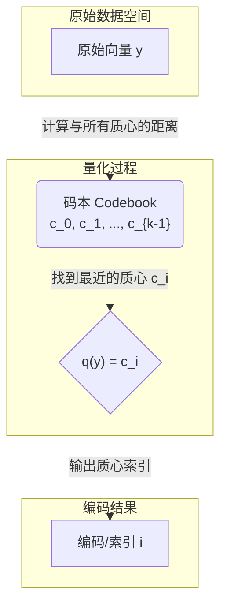
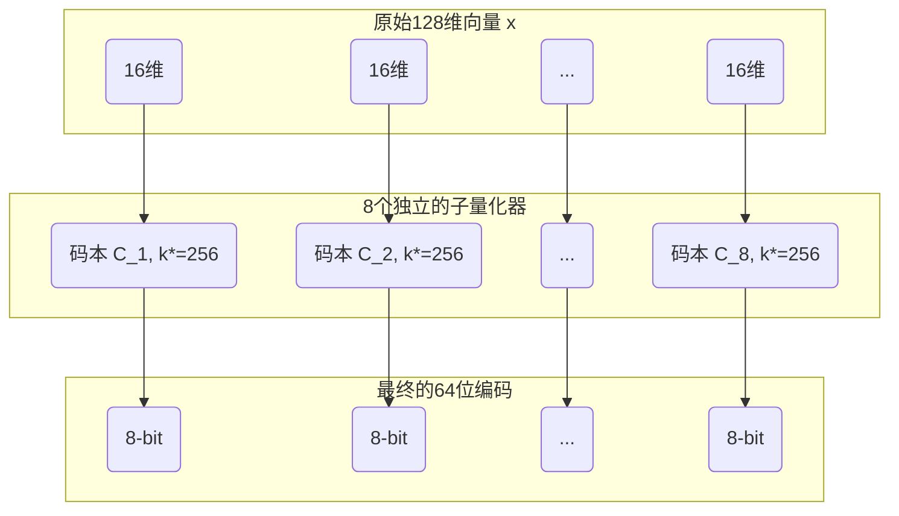
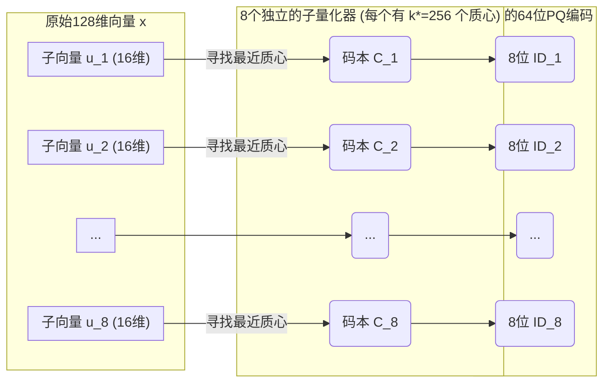
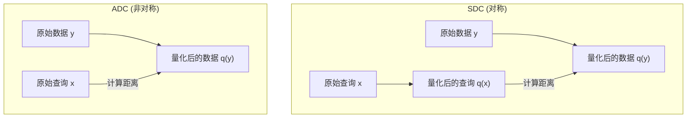
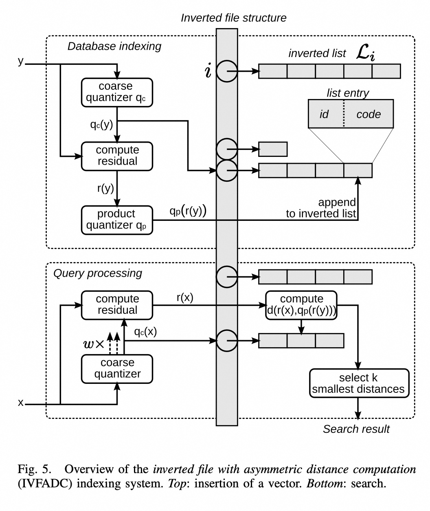
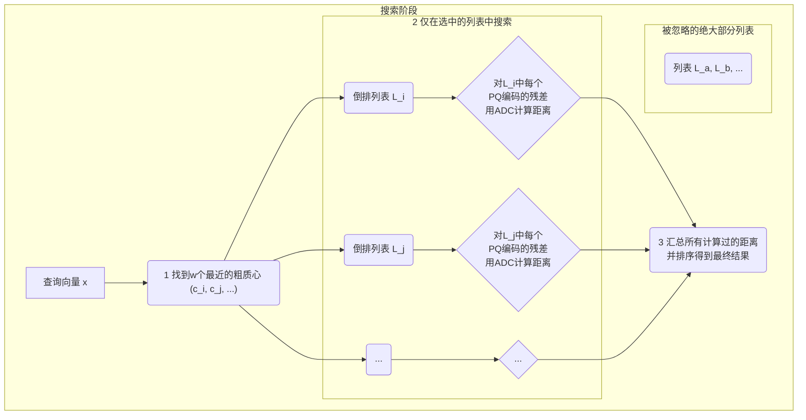
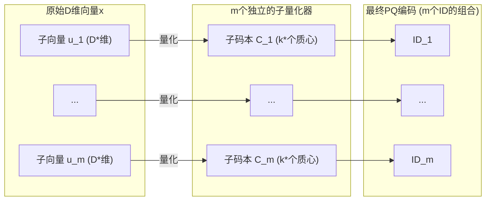
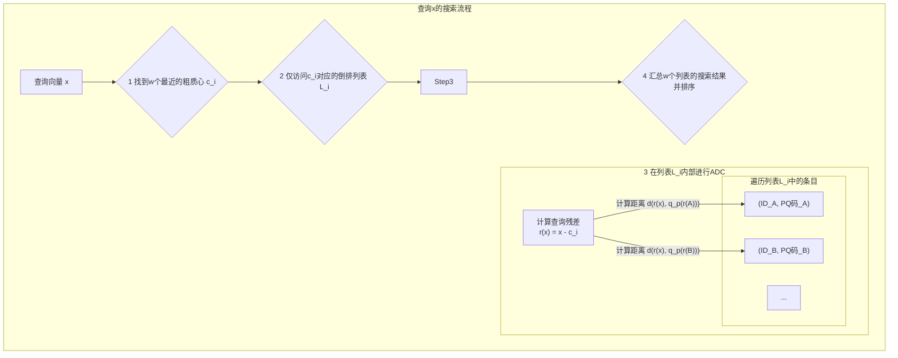

## AI论文解读 | Product Quantization for Nearest Neighbor Search
        
### 作者        
digoal        
        
### 日期        
2025-06-26        
        
### 标签        
PostgreSQL , PolarDB , DuckDB , AI , 论文解读        
        
----        
        
## 背景  
      
https://inria.hal.science/inria-00514462v2/document        
  
      
提示:        
```        
读懂《Product Quantization for Nearest Neighbor Search》这篇论文需要提前掌握哪些基础知识, 请使用中文给我讲一下这些基础知识, 尽量通熟易懂, 可以使用markdown支持的图形增加解释性.        
        
使用中文通熟易懂的解读《Product Quantization for Nearest Neighbor Search》这篇论文, 关键内容请深入讲解, 可以使用markdown支持的图形增加解释性.        
        
使用中文提取《Product Quantization for Nearest Neighbor Search》论文中一些重要的术语并详细解释, 可以使用markdown支持的图形示增加解释性.        
```        
        
## 1 前置知识 
  
好的，为了完全理解《Product Quantization for Nearest Neighbor Search》这篇开创性的论文，你需要掌握一些核心的基础知识。我会用通俗易懂的方式，结合图示为你讲解。

这篇论文的核心目标是解决一个经典问题：**如何在一个极大的数据库中（比如包含十亿张图片的特征），为一个新的查询目标（比如一张新图片），快速且准确地找到最相似的几个数据点**。

以下是你需要预先了解的5个关键知识点：

-----

### 1\. K-近邻搜索 (k-NN) 与“维度灾难”

#### 基础概念：K-近邻搜索 (k-Nearest Neighbors, k-NN)

 这是最根本的问题。想象一下你在一个二维地图上，有很多餐馆，你想找到离你最近的3家（k=3）。这很简单，你只需要计算你和每家餐馆的直线距离（即欧氏距离），然后排序即可  。

#### 核心难点：维度灾难 (Curse of Dimensionality)

 现在，想象一下，描述一个数据点的不再是二维坐标，而是128个数字（比如论文中用到的SIFT特征   ）甚至960个数字（GIST特征  ）。我们进入了高维空间。

 在高维空间里，很多我们习以为常的直觉都失效了，这就是“维度灾难”  。主要体现在：

  * **空间变得极其稀疏**：数据点之间会变得非常遥远。想象一下，在一个一维线段上撒10个点很容易，但在一个巨大的三维空间里撒10个点，它们会非常分散。维度越高，这种分散程度呈指数级增长。
  * **距离失去了区分度**：在高维空间中，一个查询点到它最近邻和最远邻的距离差，相对于距离本身来说，变得微不足道。也就是说，几乎所有点都成了“差不多远”的邻居。
  *  **传统索引方法失效**：像KD树这样的传统空间索引结构，在低维时效率很高，但在高维空间，它们的性能会迅速退化到跟暴力搜索（计算每一个点）一样差  。

>  **小结**：由于“维度灾难”，在高维数据上进行精确的k-NN搜索非常非常慢   ，因此学术界和工业界都转向了“近似最近邻搜索”（Approximate Nearest Neighbor, ANN）  ，即不要求100%正确，但要快得多。这篇论文提出的就是一种顶级的ANN方法。

-----

### 2\. 向量量化 (Vector Quantization, VQ)

向量量化是这篇论文方法论的核心，你可以把它理解为一种**数据压缩**或**数据聚类**技术。

#### 核心思想

 它的目的是用一个小的“码本”（Codebook）来表示海量、连续的向量数据  。

想象一下，你有很多高维空间中的数据点（下图中的黑点）。向量量化的过程就是：

1.   **寻找代表点**：找到`k`个“代表点”或“中心点”，这些点被称为**质心 (Centroids)**  。
2.   **分组**：对于空间中的任何一个数据点，我们看它离哪个质心最近，就把它归为哪个质心的“势力范围”（这个范围在几何上被称为**Voronoi单元**  ）。
3.  **编码**：我们用质心的ID（比如0, 1, 2, ... k-1）来代表这个范围内的所有点。




  *  **码本 (Codebook)**：所有`k`个质心的集合 $\\mathcal{C}={c\_{0}, ..., c\_{k-1}}$  。
  *  **如何生成码本？**：最常用的方法是**K-均值聚类 (k-means)** 算法  。它通过迭代的方式，不断地将样本分配给最近的质心，并更新质心的位置为该簇样本的平均值，直到收敛。

> **小结**：向量量化把无限可能的高维向量，映射到了有限的`k`个质心上。这样做的好处是**用一个简单的ID（编码）代替了复杂的原始向量**，大大减少了存储和计算的复杂度。

-----

### 3\. 乘积量化 (Product Quantization, PQ) 的基本思想

 这是论文的**核心创新点**。传统的向量量化有一个致命问题：如果想提高精度，就需要非常非常多的质心（ 比如`k` = $2^{64}$ ） 。但这样做：

  *  **内存爆炸**：存不下这么多质心  。
  *  **训练不了**：没有足够的数据和计算资源来训练这么多质心  。

PQ用一种“分而治之”的巧妙思想解决了这个问题。

#### 核心思想

 它将一个高维向量**切分**成`m`个低维的子向量，然后对**每一个子向量**分别进行向量量化  。

假设我们有一个128维的向量，要生成一个64位的编码。

  * **传统VQ**：需要 $k=2^{64}$ 个128维的质心，这绝对不可能。
  * **PQ的做法**：
    1.  **切分 (Split)**：把128维向量切成 `m=8` 段，每段都是16维。
    2.  **分别量化 (Quantize Separately)**：为每一段都准备一个小的码本，比如包含 $k^\*=256$ ($2^8$) 个16维的质心。
    3.  **编码拼接 (Concatenate Codes)**：对8个子向量分别进行量化，每个都会得到一个8位的编码（0-255）。把这8个编码拼接起来，就得到了一个 $8 \\times 8 = 64$ 位的最终编码。




PQ的魔力在于：

  *  **虚拟码本巨大**：它实际上能表示 $(k^\*)^m = 256^8 = (2^8)^8 = 2^{64}$ 个不同的组合质心  。
  *  **实际存储很小**：我们只需要存储 `m` 个小码本，总共是 $m \\times k^\* = 8 \\times 256$ 个16维的质心，这完全可行  。

> **小结**：PQ通过分解向量再分别量化的方式，用极小的存储和训练代价，构建出了一个巨大且精细的虚拟码本，从而可以更精确地估计向量间的距离。

-----

### 4\. 倒排文件系统 (Inverted File System)

 即使有了PQ，对十亿个数据点逐一计算近似距离，依然很慢   。为了避免这种**穷举搜索 (Exhaustive Search)**，论文采用了信息检索领域一个非常经典的技术：**倒排文件**  。

#### 核心思想

倒排文件的思想类似于书本后面的**关键词索引**。

  * **传统方法（正排）**：一页一页地翻书，看每一页有没有你想要的关键词。
  * **索引方法（倒排）**：直接在书末的索引里找到关键词，索引会告诉你它出现在哪些页码。

在ANN搜索中：

1.   **建立索引 (粗量化)**：先用一个规模不大的“粗”量化器（比如k-means，k'=1024）对所有数据进行第一次聚类  。这1024个粗质心就相当于索引中的“关键词”。
2.   **建立倒排列表**：每个“关键词”（粗质心）后面都跟着一个列表（Inverted List），记录了所有被分到这个簇的数据点  。
3.   **非穷举搜索**：当一个查询向量`x`来了以后，我们先看它离哪几个“关键词”（粗质心）最近（比如最近的`w`个）  。然后，我们**只**去这`w`个关键词对应的倒排列表里搜索，而完全忽略数据库中99.9%的其他数据  。

 论文中的`IVFADC`方法就是倒排文件（IVF）和非对称距离计算（ADC）的结合  。

> **小结**：倒排文件系统通过一次粗定位，将搜索范围从整个数据集缩小到几个小的子集，极大地提升了搜索速度，是实现大规模搜索的关键。

-----

### 5\. 评价指标和基本机器学习概念

  *  **特征向量 (Feature Vectors)**：你需要知道像 SIFT    和 GIST   是什么。你不需要了解它们的具体计算细节，但需要明白它们是将一张图片复杂的视觉内容，转换成一个高维向量（一长串数字）的技术。这个向量就是算法处理的对象。

  *  **评价指标 `recall@R`**：这是衡量ANN搜索质量的标准  。它的意思是：“在返回的前R个结果中，有多大的比例找到了真正的最近邻？”

      * `recall@1 = 0.9` 意味着，对于90%的查询，返回的第1个结果就是最准确的那个。
      * `recall@100 = 0.98` 意味着，对于98%的查询，真正的最近邻包含在返回的前100个结果中。

 掌握了以上这些基础知识，你就能更好地理解论文中各种方法设计的动机、它们之间的区别（如SDC vs ADC  ），以及为什么它能在保证高精度的同时实现惊人的搜索速度和极低的内存占用了。
  
## 2 解读论文 
  
好的，这篇由Hervé Jégou等人撰写的《Product Quantization for Nearest Neighbor Search》是近似最近邻（Approximate Nearest Neighbor, ANN）搜索领域一篇里程碑式的论文。它提出了一种极其高效的向量编码和搜索方法，完美地平衡了内存、速度和精度。

下面我将为你深入解读这篇论文的核心思想、关键技术和主要贡献。

### 论文解决了什么问题？

 想象一下，你需要在拥有**数十亿**张图片的数据库中，为一张新图片找到最相似的10张。计算机处理这个问题时，会先将每张图片转换成一个高维向量（比如128维的SIFT特征或960维的GIST特征） 。问题就变成了：**如何在一个由数十亿个高维向量组成的集合中，快速找到与查询向量距离最近的几个？**

 传统的“暴力搜索”（计算与每一个向量的距离）太慢，而像KD树这样的索引结构在数据维度很高时会失效，这就是所谓的“维度灾难”  。因此，我们需要一种**近似**搜索方法，它不保证100%精确，但速度极快，同时内存占用要尽可能小  。

这篇论文提出的**乘积量化 (Product Quantization, PQ)** 正是为此而生。

-----

### 核心技术一：乘积量化 (Product Quantization, PQ)

这是整篇论文的基石。要理解PQ，我们先要明白传统的**向量量化 (Vector Quantization, VQ)**。

  *  **传统VQ**：可以看作是一种聚类（如k-means）。它试图用`k`个“代表点”（称为**质心 (centroids)**）来概括整个数据集。空间中的任何一个向量，都用离它最近的那个质心的ID来表示  。
  *  **VQ的困境**：为了精确，我们需要非常非常多的质心。比如，要得到一个64位的编码，就需要 $2^{64}$ 个质心   。这在计算上和存储上都是不可能实现的  。

**PQ的“分而治之”妙计**

 PQ巧妙地绕过了这个难题。它将一个高维向量**分解**成若干个低维子向量，然后对每个子向量**独立地**进行量化  。

假设我们有一个128维的向量，目标是生成一个64位的编码：

1.   **切分 (Split)**：将128维的向量切成 `m=8` 段，每一段都是一个16维的子向量  。
2.   **独立量化 (Quantize Separately)**：为这8个“赛道”的每一个都训练一个独立的、小规模的码本 (codebook)。例如，每个码本包含 $k^\*=256$ 个16维的质心。256正好是 $2^8$，所以每个子向量量化后可以用一个8位的ID表示  。
3.   **编码拼接 (Concatenate)**：将8个子向量得到的8位编码拼接在一起，形成一个最终的 $8 \\times 8 = 64$ 位编码  。




**PQ的魔力在于**：

  *  **巨大的虚拟码本**：虽然我们只存储了 $8 \\times 256$ 个16维质心，但通过组合，它能表示的质心总数高达 $256^8 = (2^8)^8 = 2^{64}$ 个  。
  *  **极低的存储成本**：存储这套量化器所需的内存只是 $m \\times k^\* \\times D/m = k^\* \\times D$  ，与质心总数`k`无关，完全可行。

-----

### 核心技术二：基于PQ的距离计算

有了PQ编码，我们如何估算两个向量之间的距离呢？论文提出了两种方式。

#### 1\. 对称距离计算 (Symmetric Distance Computation, SDC)

 这种方式下，查询向量`x`和数据库向量`y`都先被转换成它们的PQ码，也就是用质心 $q(x)$ 和 $q(y)$ 来代替。距离就估算为这两个质心之间的距离 $d(q(x), q(y))$  。

 这个计算非常快，因为所有子质心之间的距离可以预先计算好并存成一个查找表。计算时只需`m`次查表和加法  。

#### 2\. 非对称距离计算 (Asymmetric Distance Computation, ADC)

这是论文的一个关键改进。SDC因为对查询向量也做了量化，损失了一部分精度。ADC则不同：

  *  数据库中的向量`y`仍然被其量化质心 $q(y)$ 代表  。
  *  **查询向量`x`则保留其原始的、未经量化的形式**  。
  *  距离估算为原始查询向量`x`和量化数据库向量`q(y)`之间的距离 $d(x, q(y))$  。

 **为什么ADC更好？** 因为它避免了查询侧的量化误差，从而能够得到更精确的距离估算，显著提升了搜索准确率  。



 实验结果表明，ADC的效果远好于SDC，且计算开销相似，因此是首选方案  。

-----

### 核心技术三：结合倒排文件的非穷举搜索 (IVFADC)

即使ADC非常快，在十亿级别的数据集上进行“穷举”扫描（即与每个数据库条目都计算一次距离）仍然是不可接受的。为此，论文将ADC与信息检索领域的经典技术——**倒排文件 (Inverted File System)** 相结合，构建了名为 **IVFADC** 的高效索引系统。

其工作流程如下（见论文图5的简化解释）：   

1.   **粗量化 (Coarse Quantization)**：首先，使用一个规模较小的“粗”量化器（比如k-means，有`k'`个质心）将整个数据集划分成`k'`个单元（或称为桶） 。这`k'`个粗粒度的质心构成了倒排文件的“索引词典”。

2.   **编码残差 (Encode Residuals)**：对于数据库中的每个向量`y`，我们首先找到它所属的粗质心 $q\_c(y)$。然后，我们计算它与该粗质心的**残差向量** $r(y) = y - q\_c(y)$   。我们**使用PQ编码的不是原始向量`y`，而是这个残差向量`r(y)`**。编码残差比编码原始向量更精确，因为残差的能量和分布范围更小   。每个向量最终以`(粗质心ID, 残差的PQ码)`的形式存入对应粗质心的倒排列表中  。

3.  **非穷举搜索 (Non-exhaustive Search)**：

      *  当一个查询向量`x`到来时，系统首先找到离它最近的`w`个粗质心  。
      *  系统**仅仅**访问这`w`个粗质心对应的倒排列表，而忽略数据库中其他所有的列表  。
      *  在这些被访问的列表中，系统使用ADC的方法，计算查询向量`x`（或其相应残差）与列表中存储的（基于残差的）PQ码之间的距离  。
      * 最后，从被访问过的少数向量中，选出距离最近的作为最终结果。




通过这种方式，搜索范围被急剧缩小（比如从10亿缩小到几万），从而实现了惊人的速度提升。

### 主要贡献与结论

  *  **提出了一种极其节约内存且高效的编码方案 (PQ)**：用极小的存储代价，生成了一个等效于天文数字规模的巨大码本，实现了对向量的精确表示  。
  *  **设计了高精度的非对称距离估计算法 (ADC)**：通过不对查询向量进行量化，显著提升了搜索的准确率  。
  *  **构建了可扩展的非穷举搜索框架 (IVFADC)**：将PQ与倒排文件和残差编码相结合，使得在数十亿规模的数据集上进行毫秒级搜索成为可能  。
  *  **性能卓越**：在多个标准数据集（SIFT, GIST）上的实验表明，该方法在速度、内存和精度的综合权衡上，显著优于当时包括谱哈希 (Spectral Hashing)、FLANN在内的多种顶尖方法  。

总而言之，这篇论文通过一系列精妙的设计，为大规模高维向量的近似搜索问题提供了一个影响深远的解决方案，至今仍是许多现代搜索引擎和推荐系统中向量索引技术的基础。
  
## 3 术语  
  
好的，这里从论文《Product Quantization for Nearest Neighbor Search》中提取了几个最重要的术语，并结合图示进行详细解释。所有解释均严格来源于论文原文。

-----

### 1\. 向量量化 (Vector Quantization)

向量量化是理解这篇论文所有技术的基础。

  *  **定义**：从根本上说，量化器是一个函数 `q`，它将一个D维的输入向量 $x \\in \\mathbb{R}^{D}$ 映射到码本 $\\mathcal{C}$ 中的一个向量 $q(x)$   。码本是一个由 `k` 个“代表点”（称为质心）组成的有限集合 $\\mathcal{C}={c\_{i}; i=0...k-1}$   。这是一个有损的过程，目的是减少表示空间的基数（即可能值的数量） 。

  * **核心组成**：

      *  **码本 (Codebook)**: 所有质心的集合  。
      *  **质心 (Centroid)**: 码本中的每个“代表点” $c\_i$  。
      *  **（Voronoi）单元 (Cell)**: 所有被映射到同一个质心 $c\_i$ 的原始向量的集合   。一个量化器的`k`个单元构成了对整个空间 $\\mathbb{R}^{D}$ 的一个划分  。

简单来说，向量量化就像是把高维空间中的所有点，根据“就近原则”指派给最近的代表点（质心），并用这个代表点的ID来表示原始点。

-----

### 2\. 乘积量化器 (Product Quantizer)

这是整篇论文的**核心创新点**，是一种巧妙的、可扩展的向量量化方法。

  *  **定义**：它的核心思想是将原始的高维空间分解为多个低维子空间的笛卡尔积，然后对每个子空间**分别**进行量化  。

  * **工作流程**：

    1.   **切分 (Split)**：一个D维向量`x`被切分成`m`个互不重叠的D\*维子向量 $u\_1(x), ..., u\_m(x)$  。
    2.   **独立量化 (Quantize Separately)**：使用`m`个不同的子量化器 $q\_1, ..., q\_m$，对每个子向量分别进行量化   。每个子量化器都有自己的小码本 $\\mathcal{C}\_j$（假设每个包含 $k^\*$ 个子质心） 。
    3.   **组合 (Combine)**：最终的全局码本 $\\mathcal{C}$ 是所有子码本的笛卡尔积，即 $\\mathcal{C} = \\mathcal{C}\_1 \\times ... \\times \\mathcal{C}\_m$   。一个全局质心就是由`m`个子质心拼接而成的  。




  *  **优势**：PQ可以用极小的存储代价，生成一个巨大的虚拟码本   。例如，使用`m=8`个子量化器，每个子码本大小为 $k^\*=256$ ，那么总的质心数量将高达 $k = (k^\*)^m = 256^8 = 2^{64}$ 个   。但我们实际需要存储的只是 $m \\times k^\*$ 个子质心，这在内存上是完全可行的  。

-----

### 3\. 对称/非对称距离计算 (SDC / ADC)

有了PQ编码后，如何估算距离是关键。

  * **对称距离计算 (Symmetric Distance Computation, SDC)**：

      *  **定义**：查询向量`x`和数据库向量`y`**都被**它们各自的量化质心 $q(x)$ 和 $q(y)$ 所替代  。
      *  **计算**：距离被近似为 $d(q(x), q(y))$   。这个计算可以通过查阅预先计算好的子质心距离表来高效完成  。

  * **非对称距离计算 (Asymmetric Distance Computation, ADC)**：

      *  **定义**：一种更精确的计算方式。其中，数据库向量`y`仍由其质心 $q(y)$ 表示，但**查询向量`x`保持其原始、未编码的形式**  。
      *  **计算**：距离被近似为 $d(x, q(y))$  。
      *  **优势**：因为查询向量没有被量化，减少了量化误差，从而提高了搜索精度  。

-----

### 4\. 残差向量 (Residual Vector)

这个术语在非穷举搜索框架`IVFADC`中至关重要。

  *  **定义**：给定一个向量`y`和一个“粗”量化器 $q\_c$，`y`的残差向量 $r(y)$ 是指原始向量`y`与其对应的粗质心 $q\_c(y)$ 之间的差值，即 $r(y) = y - q\_c(y)$   。它代表了向量在一个Voronoi单元内的偏移量  。

  *  **用途**：在IVFADC方法中，系统使用PQ编码的不是原始向量，而是这个**残差向量**   。这样做的好处是，残差向量的能量通常比原始向量小，因此可以用同样的比特数更精确地进行编码，从而提升搜索的准确率  。

-----

### 5\. 结合倒排文件的非对称距离计算 (IVFADC)

 为了避免对整个庞大的数据集进行穷举搜索，论文将PQ与倒排文件（Inverted File）结构相结合，构建了IVFADC系统  。

  *  **定义**：一个结合了倒排文件系统和非对称距离计算的近似最近邻搜索方法  。

  * **核心流程**：

    1.   **建立索引 (粗量化)**：使用一个“粗量化器” $q\_c$（通常是质心数量`k'`不多的k-means）来建立一个倒排文件结构   。数据库中的每个向量`y`被分配到一个粗质心 $q\_c(y)$ 对应的倒排列表中  。
    2.   **编码残差并存储**：在列表中，存储的不是原始向量，而是其**残差向量** $r(y)$ 经过PQ编码后的短码  。
    3.  **非穷举搜索**：
          *  当一个查询向量`x`到来时，系统首先找到离它最近的`w`个粗质心  。
          *  搜索范围被限定在这`w`个粗质心对应的倒排列表内，大大减少了需要比较的向量数量  。
          *  在这些列表内部，使用ADC方法计算查询向量`x`的残差与被索引的残差PQ码之间的距离  。



   
## 补充 ivf-adc vs ivf-flat   
IVFADC（Inverted File with Asymmetric Distance Computation）和 IVF-Flat 都是基于倒排索引（Inverted File, IVF）的向量检索方法，但它们在量化方式和计算效率上有显著区别。以下是它们的对比：  
  
---  
  
### **1. IVFADC（IVF + Product Quantization, PQ）**  
- **核心思想**：    
  - 使用 **倒排索引（IVF）** 进行粗粒度聚类（如 `nlist=1024`），减少搜索范围。    
  - 对残差向量（原始向量减去聚类中心）进行 **乘积量化（PQ）**，压缩存储并支持快速近似距离计算。    
  
- **优点**：    
  ✅ **存储高效**：PQ 将高维向量压缩为短编码（如 64 位），显著减少内存占用。    
  ✅ **计算高效**：通过 ADC（非对称距离计算）加速查询，适合大规模数据集（如十亿级）。    
  
- **缺点**：    
  ❌ **精度损失**：PQ 引入量化误差，距离计算是近似的。    
  ❌ **调参复杂**：需平衡 `nlist`（倒排列表数）和 PQ 参数（如 `m`、`bits`）。    
  
- **典型应用**：    
  Faiss 中的 `IVF1024,PQ64`，适合内存受限的大规模检索。  
  
---  
  
### **2. IVF-Flat（IVF + 原始向量）**  
- **核心思想**：    
  - 同样使用 **倒排索引（IVF）** 进行粗粒度聚类。    
  - 但 **不量化残差**，直接存储原始向量（Flat），计算精确距离。    
  
- **优点**：    
  ✅ **精度高**：无量化误差，距离计算精确。    
  ✅ **实现简单**：无需调参 PQ，只需设置 `nlist`。    
  
- **缺点**：    
  ❌ **内存占用高**：需存储原始向量（如 128 维 float 占 512 字节/向量）。    
  ❌ **计算较慢**：需计算全精度距离，吞吐量低于 IVFADC。    
  
- **典型应用**：    
  Faiss 中的 `IVF1024,Flat`，适合小规模高精度检索（如百万级数据）。  
  
---  
  
### **3. 关键对比总结**  
| 特性                | IVFADC（IVF+PQ）       | IVF-Flat              |  
|---------------------|-----------------------|-----------------------|  
| **量化方式**         | 乘积量化（PQ）         | 无量化（原始向量）     |  
| **内存占用**         | 低（如 64 位/向量）    | 高（如 512 字节/向量）|  
| **距离计算**         | 近似（ADC）           | 精确（全精度）        |  
| **查询速度**         | 快（适合批量查询）     | 较慢（逐向量计算）    |  
| **适用规模**         | 十亿级                | 百万级               |  
| **典型 Faiss 索引**  | `IVF1024,PQ64`        | `IVF1024,Flat`        |  
  
---  
  
### **4. 如何选择？**  
- **选 IVFADC 如果**：    
  - 数据量极大（>1亿），内存有限。    
  - 可接受轻微精度损失（如推荐系统、相似图片搜索）。    
  
- **选 IVF-Flat 如果**：    
  - 数据量较小（<1千万），要求高精度（如生物特征验证）。    
  - 内存充足，需避免量化误差。    
  
- **进阶方案**：    
  结合两者，例如用 IVFADC 粗筛 Top-K，再用 IVF-Flat 精排（类似 Faiss 的 `IVFx,PQy + Refine`）。  
    
  
## 参考        
         
https://inria.hal.science/inria-00514462v2/document  
        
        
<b> 以上内容基于DeepSeek、Qwen、Gemini及诸多AI生成, 轻微人工调整, 感谢杭州深度求索人工智能、阿里云、Google等公司. </b>        
        
<b> AI 生成的内容请自行辨别正确性, 当然也多了些许踩坑的乐趣, 毕竟冒险是每个男人的天性.  </b>        
  
  
  
#### [期望 PostgreSQL|开源PolarDB 增加什么功能?](https://github.com/digoal/blog/issues/76 "269ac3d1c492e938c0191101c7238216")
  
  
#### [PolarDB 开源数据库](https://openpolardb.com/home "57258f76c37864c6e6d23383d05714ea")
  
  
#### [PolarDB 学习图谱](https://www.aliyun.com/database/openpolardb/activity "8642f60e04ed0c814bf9cb9677976bd4")
  
  
#### [PostgreSQL 解决方案集合](../201706/20170601_02.md "40cff096e9ed7122c512b35d8561d9c8")
  
  
#### [德哥 / digoal's Github - 公益是一辈子的事.](https://github.com/digoal/blog/blob/master/README.md "22709685feb7cab07d30f30387f0a9ae")
  
  
#### [About 德哥](https://github.com/digoal/blog/blob/master/me/readme.md "a37735981e7704886ffd590565582dd0")
  
  

  
