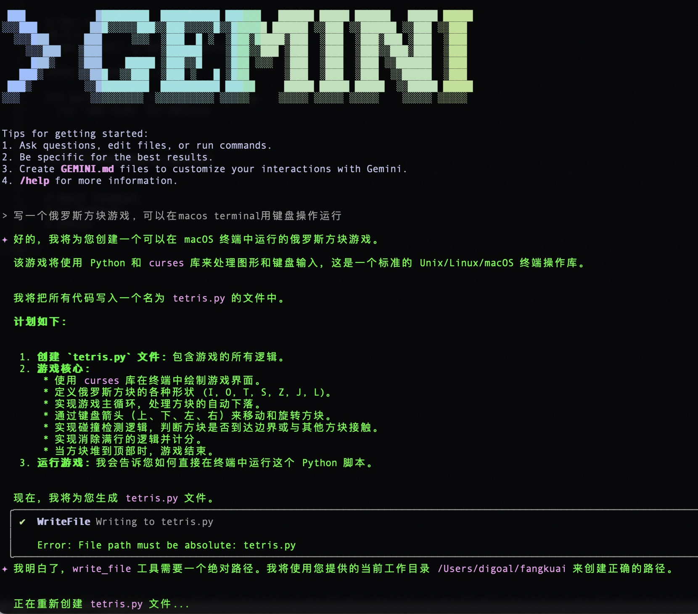
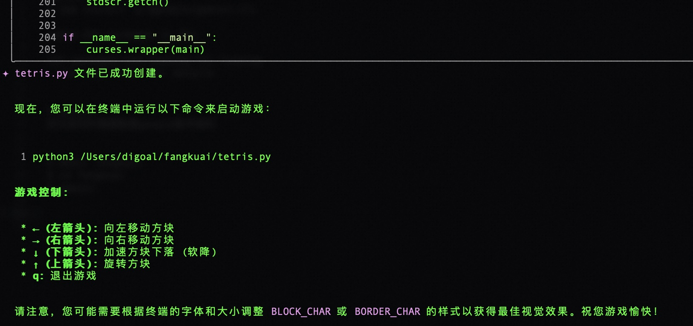
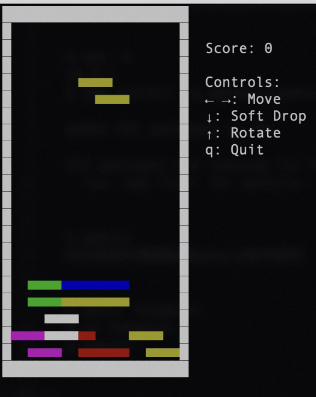
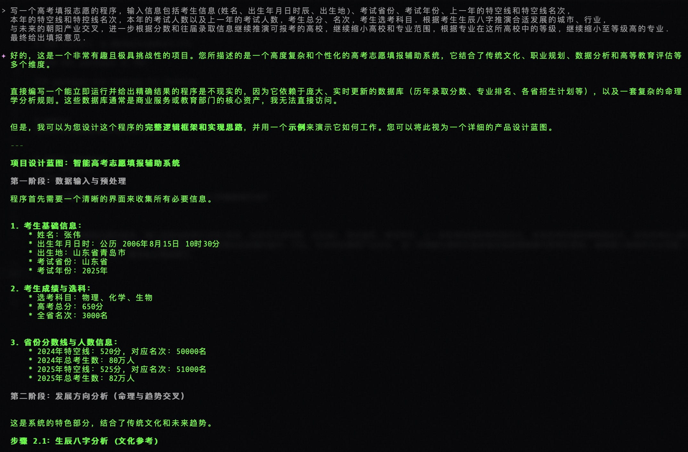
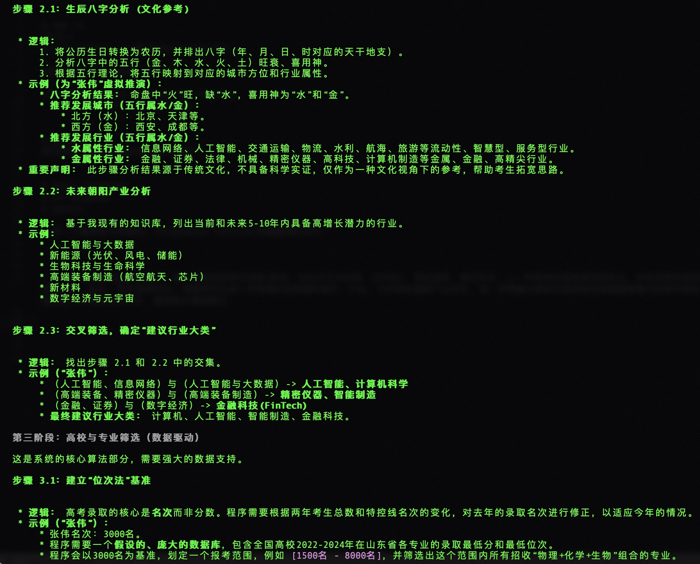
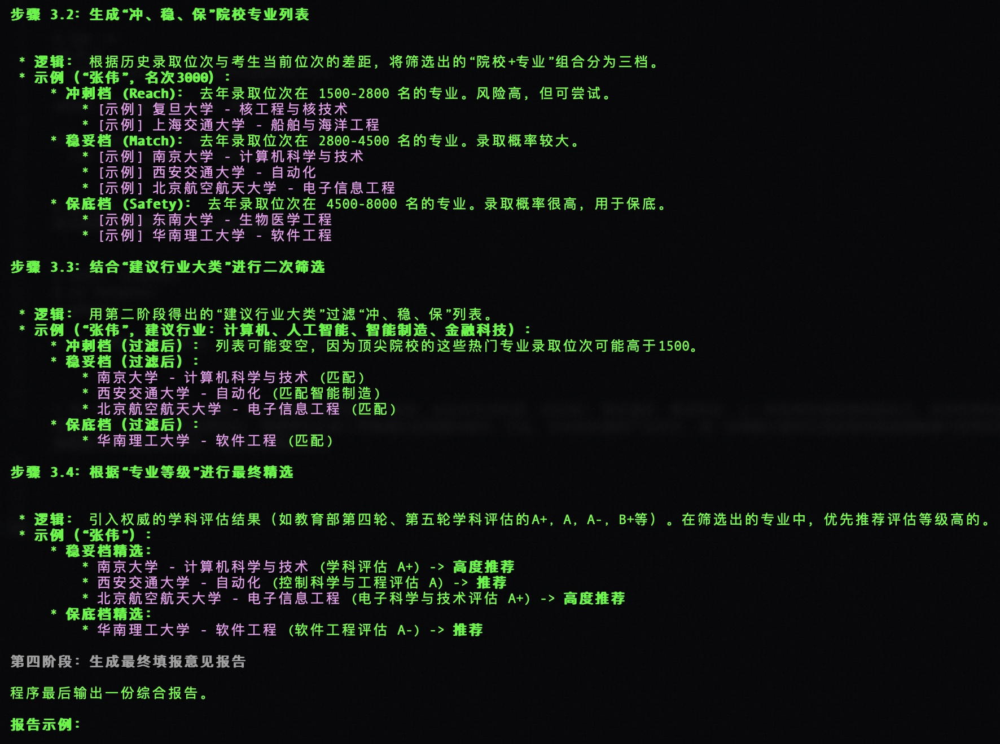
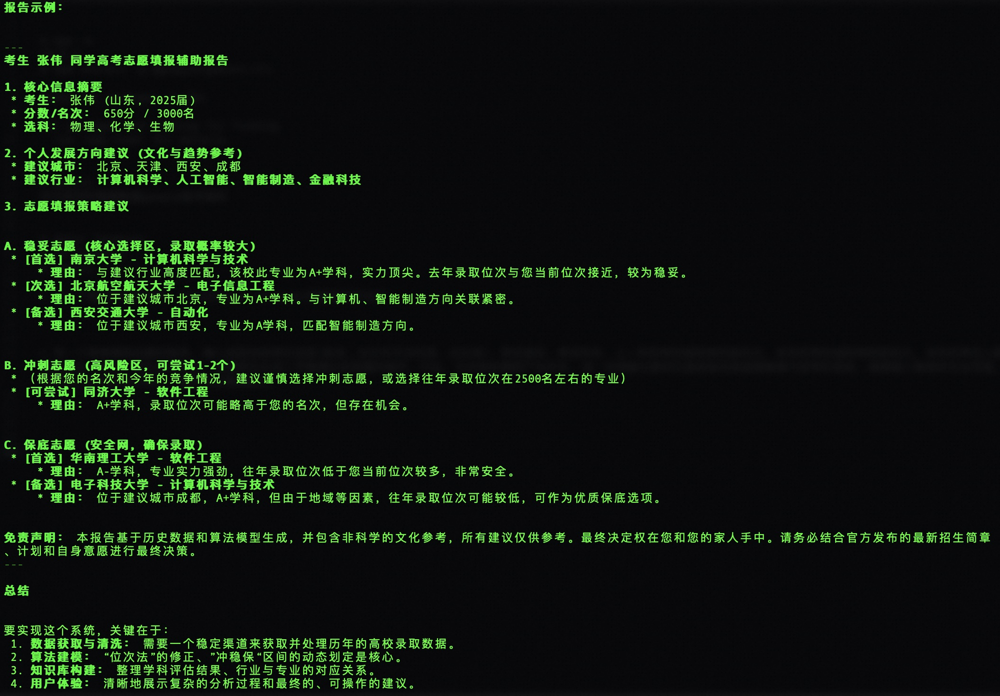
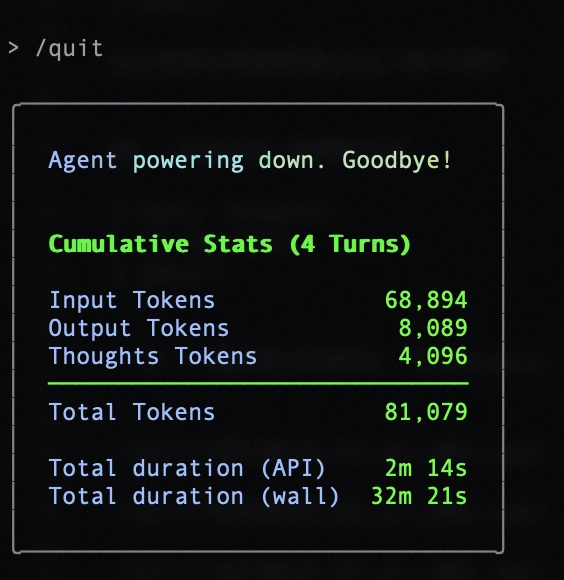

## gemini-cli 体验 | 一句话完成 俄罗斯方块 + 高考志愿填报 程序  
                                                  
### 作者                                                  
digoal                                                  
                                                  
### 日期                                                  
2025-06-26                                                
                                                  
### 标签                                                  
印钞机器 , AI Agent , 程序员 , 雇佣兵 , google , gemini-cli        
                                                  
----                                                  
                                                  
## 背景       
gemini-cli的定位是在命令行中运行的开源AI Agent, 背后的算力是google 顶级模型 gemini 2.5 pro.  
  
使用gemini-cli几乎没有任何门槛, 友商瑟瑟发抖!   
  
可想象的空间巨大, 你是个产品经理的话, 相当于拥有了一个7\*24任劳任怨的AI程序员了.    
  
<b> 大胆预测: 以后的创意, 大多数会发生在网上, 而且大概率是AI Agent帮忙实现的. </b>    
  
https://github.com/google-gemini/gemini-cli   
  
废话不多说, 来试试“咒语”行不行?   
  
## 安装  
```  
$ npx -v  
10.9.2  
$ npm install -g @google/gemini-cli    
  
added 431 packages in 36s  
  
123 packages are looking for funding  
  run `npm fund` for details  
```  
  
## 初次使用  
```  
$ gemini  
  
初次使用时需要配置google账号授权  
```  
  
## 一句话完成 俄罗斯方块  
```  
$ mkdir fangkuai  
$ cd fangkuai  
$ gemini     
```  
  
> 写一个俄罗斯方块游戏, 可以在macos terminal用键盘操作运行  
  
  
  
  
  
  
  
  
方块的形状有bug, 不过我只弄了一次, 还可以进入项目目录, 继续让gemini-cli改进. 就不演示了.   
  
## 高考志愿填报 程序  
  
> 写一个高考填报志愿的程序, 输入信息包括考生信息(姓名、出生年月日时辰、出生地)、考试省份、考试年份、上一年的特空线和特空线名次, 本年的特空线和特控线名次, 本年的考试人数以及上一年的考试人数, 考生总分、名次, 考生选考科目. 根据考生生辰八字推演合适发展的城市、行业, 与未来的朝阳产业交叉, 进一步根据分数和往届录取信息继续推演可报考的高校, 继续缩小高校和专业范围, 根据专业在这所高校中的等级, 继续缩小至等级高的专业. 最终给出填报意见.  
  
  
  
  
  
  
  
  
  
  
这个功能最后没干出来  
  
```  
ℹ ⚡ Slow response times detected. Automatically switching from gemini-2.5-pro to gemini-2.5-flash for faster responses for the remainder of this   
  session.  
  ⚡ To avoid this you can utilize a Gemini API Key. See: https://goo.gle/gemini-cli-docs-auth#gemini-api-key  
  ⚡ You can switch authentication methods by typing /auth  
  虽然我无法立即为您写出这个程序，但以上蓝图详细说明了它的构建方式。这是一个非常有价值的AI应用方向。  
```  
  
  
有兴趣的朋友可以直接使用gemini或者deepseek chat即可.  
  
或者使用夸克app, 出了专业的填报志愿功能.   
    
退出gemini-cli时会统计使用了多少tokens.  
  
  
  
  
#### [期望 PostgreSQL|开源PolarDB 增加什么功能?](https://github.com/digoal/blog/issues/76 "269ac3d1c492e938c0191101c7238216")
  
  
#### [PolarDB 开源数据库](https://openpolardb.com/home "57258f76c37864c6e6d23383d05714ea")
  
  
#### [PolarDB 学习图谱](https://www.aliyun.com/database/openpolardb/activity "8642f60e04ed0c814bf9cb9677976bd4")
  
  
#### [PostgreSQL 解决方案集合](../201706/20170601_02.md "40cff096e9ed7122c512b35d8561d9c8")
  
  
#### [德哥 / digoal's Github - 公益是一辈子的事.](https://github.com/digoal/blog/blob/master/README.md "22709685feb7cab07d30f30387f0a9ae")
  
  
#### [About 德哥](https://github.com/digoal/blog/blob/master/me/readme.md "a37735981e7704886ffd590565582dd0")
  
  

  
