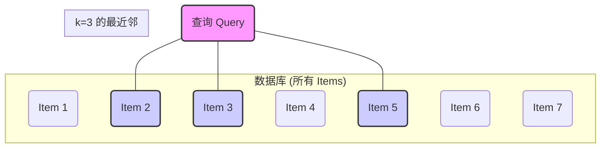
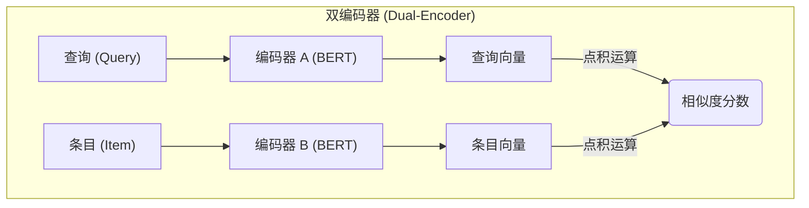
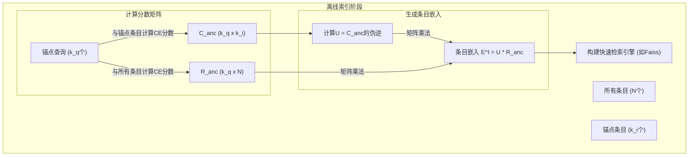
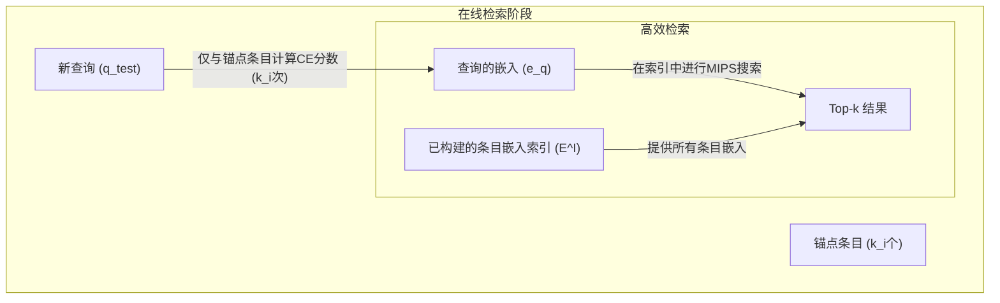
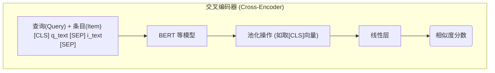
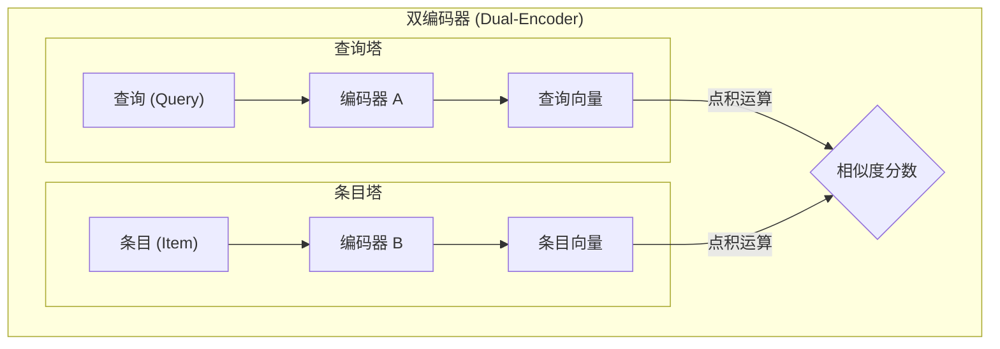
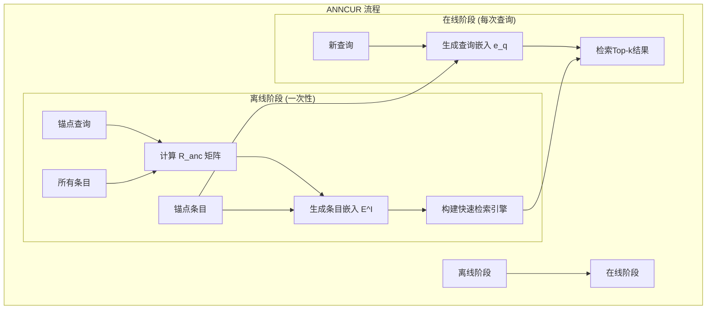

## AI论文解读 | Efficient Nearest Neighbor Search for Cross-Encoder Models using Matrix Factorization
        
### 作者        
digoal        
        
### 日期        
2025-06-29       
        
### 标签        
PostgreSQL , PolarDB , DuckDB , AI , 论文解读        
        
----        
        
## 背景  
      
https://arxiv.org/pdf/2210.12579        
  
      
提示:        
```        
读懂《Efficient Nearest Neighbor Search for Cross-Encoder Models using Matrix Factorization》这篇论文需要提前掌握哪些基础知识, 请使用中文给我讲一下这些基础知识, 尽量通熟易懂, 可以使用markdown支持的图形增加解释性.        
        
使用中文通熟易懂的解读《Efficient Nearest Neighbor Search for Cross-Encoder Models using Matrix Factorization》这篇论文, 关键内容请深入讲解, 可以使用markdown支持的图形增加解释性.        
        
使用中文提取《Efficient Nearest Neighbor Search for Cross-Encoder Models using Matrix Factorization》论文中一些重要的术语并详细解释, 可以使用markdown支持的图形示增加解释性.        
```        
        
## 1 前置知识 
  
好的，为了完全理解《使用矩阵分解的高效交叉编码器模型近邻搜索》这篇论文，你需要了解一些机器学习和自然语言处理（NLP）的基础知识。

我会将这些知识点分为几个核心领域，并用尽可能通俗易懂的方式，配合一些图示来解释。

-----

### 核心知识体系

为了读懂这篇论文，你需要掌握以下四个方面的基础：

1.  **核心问题：K-近邻搜索 (k-Nearest Neighbors, k-NN)**
2.  **关键模型：神经信息检索模型 (Dual-Encoder vs. Cross-Encoder)**
3.  **核心方法：矩阵分解 (Matrix Factorization)，特别是CUR分解**
4.  **相关概念：知识蒸馏、Transformer/BERT、评估指标等**

下面我们逐一讲解。

### 1\. 核心问题：K-近邻搜索 (k-NN)

**这是什么？**
想象一下，你有一个巨大的图书馆，里面有数百万本书。现在你手上有一本书（我们称之为“查询” Query），你想在图书馆里找到和它内容最相似的 `k` 本书（比如 `k=10`）。这个寻找最相似的 `k` 个邻居的过程，就是 k-NN 搜索。

在 NLP 领域，"书" 可以是任何文本，比如一个问题、一个句子、一篇文章、一个商品描述等。k-NN 的目标就是对于一个给定的“查询”，从海量数据中高效地找出与它“最相关”或“最相似”的 `k` 个“条目”（Item）。

**可视化解释：**
假设我们能把所有书（items）和你的查询（query）都表示为空间中的点。两个点离得越近，就代表它们越相似。k-NN 就是要找到离“查询”点最近的那 `k` 个点。



> **论文关联：** 这篇论文的根本目标，就是解决当“相似度计算”非常复杂和耗时（使用交叉编码器）的情况下，如何快速完成 k-NN 搜索。

-----

### 2\. 关键模型：神经信息检索模型

为了计算“查询”和“条目”之间的相似度，现在主流的方法是使用深度学习模型，尤其是 Transformer 架构（如 BERT）。论文中重点对比了两种模型：**双编码器 (Dual-Encoder)** 和 **交叉编码器 (Cross-Encoder)**。

#### A. 双编码器 (Dual-Encoder)

**工作原理：**
它使用两个独立的编码器（Encoder）分别处理“查询”和“条目”，将它们各自转换成一个固定维度的向量（也叫嵌入，Embedding）。然后通过计算这两个向量的点积（Dot Product）或余弦相似度来得到它们的分数。

**好比：**
你要给一份简历（Query）和一份招聘启事（Item）匹配。你先分别给它们写一个“摘要”（生成向量），然后再比较这两个摘要有多相似。整个过程，简历和招聘启事是独立被阅读的。

**流程图：**

```
+-----------+           +------------------+
| Query (q) | --------> |  Encoder A (BERT)| -----> [Vector q]
+-----------+           +------------------+
                                                    |
                                                    v
                                                 点积/相似度计算 --> Score
                                                    ^
                                                    |
+-----------+           +------------------+
| Item (i)  | --------> |  Encoder B (BERT)| -----> [Vector i]
+-----------+           +------------------+
```

  * **优点：** **速度快**。因为所有条目（items）的向量都可以提前计算好并存起来。当一个新查询来了，只需要计算它的向量，然后和数据库里数百万个向量做快速的点积运算（这有非常成熟的优化算法，如 FAISS）。
  * **缺点：** **精度相对较低**。因为它在编码时没有考虑查询和条目之间的细微交互。就像只看摘要可能会错过原文中的关键细节一样。

#### B. 交叉编码器 (Cross-Encoder)

**工作原理：**
它将“查询”和“条目”拼接在一起，作为一个整体输入到一个单一的编码器中。模型在内部同时分析两者，并直接输出一个最终的相似度分数。

**好比：**
这次你不再是分别写摘要了，而是把简历和招聘启事放在同一页纸上，逐字逐句地对比阅读，找出所有相关的技能、经验等对应关系，然后给出一个综合匹配分。

**流程图：**

```
+---------------------+
| Query (q) + Item (i)|
+---------------------+
           |
           v
+---------------------+
|  Encoder (BERT)     | ----> Score
+---------------------+
```

  * **优点：** **精度高**。因为它能捕捉到查询和条目之间非常复杂的、深度的交互信息。
  * **缺点：** **速度极慢**。对于一个查询，你必须把它和数据库里**每一个**条目都组合起来，然后完整地运行一遍昂贵的模型。如果有100万个条目，就要运行100万次模型，这在实际应用中是不可接受的。

#### 总结对比

| 特性 | 双编码器 (Dual-Encoder) | 交叉编码器 (Cross-Encoder) |
| :--- | :--- | :--- |
| **工作方式** | 分别编码，后计算相似度 | 拼接编码，直接输出分数 |
| **速度** | **非常快** (适合检索) | **非常慢** (适合重排) |
| **精度** | 相对较低 | **非常高** |
| **典型用途** | 从百万数据中快速召回（retrieve）几百个候选 | 对几百个候选进行精确重排（re-rank） |

> **论文关联：** 传统方法是先用双编码器快速找出几百个候选，再用交叉编码器精排。这篇论文想跳过双编码器，直接用一种新方法让交叉编码器也能高效地进行大规模检索。

-----

### 3\. 核心方法：矩阵分解 (Matrix Factorization)

**这是什么？**
矩阵分解是一种数学技术，旨在将一个大矩阵分解成两个或多个小矩阵的乘积。

**好比：**
想象一个巨大的“用户-电影”评分矩阵，行是用户，列是电影，矩阵里的值是用户给电影的评分。这个矩阵可能非常大且有很多空白（用户没看过的电影）。
矩阵分解可以把它拆分成两个小矩阵：

1.  **用户-特征** 矩阵 (e.g., 用户对“科幻”、“爱情”、“动作”等类型的偏好程度)
2.  **特征-电影** 矩阵 (e.g., 电影在“科幻”、“爱情”、“动作”等类型上的成分)

把这两个小矩阵相乘，就可以近似地还原出原始的大矩阵，甚至还能预测那些空白的评分。

`[用户 x 电影] ≈ [用户 x 特征] * [特征 x 电影]`

#### CUR 分解 (CUR Decomposition)

这是矩阵分解的一种特殊形式。与传统方法（如SVD）分解出抽象的“特征”不同，CUR分解直接从原矩阵 `M` 中抽取一些 **实际的列（C）** 和 **实际的行（R）** 来近似原矩阵。

`M ≈ C * U * R`

  * `M`: 原始的、巨大的、我们想近似的矩阵。在论文里，这就是 **“所有查询-所有条目”** 的交叉编码器分数矩阵。这个矩阵太大了，我们根本不想（也无法）完全计算出来。
  * `C`: 从 `M` 中抽取的几列。在论文里，这代表所有查询与少数几个“**锚点条目 (anchor items)**”的交叉编码器分数。
  * `R`: 从 `M` 中抽取的几行。在论文里，这代表少数几个“**锚点查询 (anchor queries)**”与所有条M目的交叉编码器分数。
  * `U`: 一个小的“胶水”矩阵，用来连接 `C` 和 `R`，可以通过 `C` 和 `R` 的重叠部分计算出来。

**论文如何巧妙运用CUR？**

1.  **离线索引 (Offline Indexing):**

      * 选定几百个“锚点查询”。
      * 计算这些“锚点查询”和**所有**条目的交叉编码器分数，得到矩阵 `R_anc`。
      * 基于 `R_anc` 和一个很小的核心矩阵 `U`，为**每一个**条目（Item）生成一个低维度的“潜在向量”，记作 `E^I`。这个 `E^I` 可以被索引起来，用于快速搜索。

2.  **在线推理 (Test-time Inference):**

      * 当一个新的测试查询 `q_test` 到来时，**不需要**将它与所有百万条目计算分数。
      * 只需要计算 `q_test` 和少数几个“**锚点条目**”的交叉编码器分数，得到一个很短的向量 `C_test`。
      * 最终，`q_test` 和任何一个条目 `i` 的**近似分数**可以通过 `C_test` 和 `i` 的预计算向量 `E^I[:, i]` 的点积快速得到。
      * 这就把昂贵的交叉编码器计算从“与百万条目”的比较，降维到了“与几百个锚点条目”的比较，大大提升了效率。

> **论文关联：** CUR分解是这篇论文实现“用交叉编码器进行高效检索”的核心技术。

-----

### 4\. 相关概念

  * **知识蒸馏 (Knowledge Distillation):** 一种常见的模型压缩技术。让一个复杂的、强大的“教师模型”（如交叉编码器）去“教”一个简单的、轻量的“学生模型”（如双编码器）。学生模型学习的目标是模仿教师模型的输出。这是论文中提到的、当前主流的提升双编码器精度的方法，也是本文方法的主要比较对象。

  * **Transformer 和 BERT:** 这是当前NLP领域最核心的神经网络架构。你不需要知道它的所有内部细节，但需要知道它非常擅长捕捉文本中的上下文关系，是构成双编码器和交叉编码器的“引擎”。

  * **评估指标 Recall@k (召回率@k):** 这是衡量检索系统性能的常用指标。它的含义是：“系统返回的 `k` 个结果中，命中了多少个我们真正想要的正确答案？”。例如，`Recall@10` 很高，说明系统在前10个结果里就很有可能找到了正确答案。

-----

### 总结

要读懂这篇论文，你可以这样梳理思路：

1.  **背景**：交叉编码器精度高但太慢，双编码器速度快但精度不足。大家通常用双编码器“粗筛”，交叉编码器“精排”。
2.  **本文目标**：我们能不能设计一种方法，直接用高精度的交叉编码器进行“粗筛”，还不用牺牲太多速度？
3.  **核心方案**：把“所有查询-所有条目”的分数看作一个大矩阵。我们用 **CUR矩阵分解** 的思想来近似这个大矩阵。通过预先计算一些“锚点”行和列，我们可以为所有条目构建一个可供快速搜索的索引。当新查询到来时，只需进行少量交叉编码器计算，就能利用这个索引快速估算出它和所有条目的相似度，从而实现高效的 k-NN 搜索。
4.  **创新点**：除了提出ANNCUR方法，论文还设计了一种新的交叉编码器变体 `[EMB]-CE`，它的分数分布更有利于矩阵分解，从而进一步提升了近似效果。

掌握了以上这些基础知识，你就能更好地理解论文的动机、方法和实验设计的巧妙之处了。祝你阅读顺利！
  
## 2 解读论文 
  
好的，我们来一起深入解读这篇优秀的论文：《Efficient Nearest Neighbor Search for Cross-Encoder Models using Matrix Factorization》。

 本文的核心思想是提出了一种名为 **ANNCUR** 的新方法，它利用 **CUR 矩阵分解** 技术，使得原本因计算量巨大而只能用于小范围“重排”的**交叉编码器 (Cross-Encoder)** 模型，能够直接用于大规模的“检索”任务，从而摆脱了对传统两阶段检索流程的依赖  。

下面，我将为你分步解析这篇论文的背景、核心方法、关键创新点和实验结论。

-----

### 1\. 研究背景与痛点：检索与重排的两难困境

 在信息检索、问答系统等领域，我们需要从海量数据（如网页、文档）中找到与用户查询最相关的内容  。为此，学术界和工业界主要使用两种神经模型架构：

#### A. 双编码器 (Dual-Encoder, DE)

 它为“查询 (Query)”和“条目 (Item)”分别编码，生成各自的向量，然后通过计算向量相似度（如点积）来打分  。



  *  **优点**：**速度极快**。所有条目的向量都可以提前计算好并存入索引。检索时，只需计算查询的向量，再进行高效的向量相似度搜索  。
  *  **缺点**：**精度有限**。因为它在编码时，查询和条目是“相互隔离”的，无法捕捉它们之间细微的、复杂的语义交互  。

#### B. 交叉编码器 (Cross-Encoder, CE)

 它将“查询”和“条目”拼接后，一同送入一个模型进行深度交互，直接输出一个最终的相似度分数  。


  *  **优点**：**精度极高**。因为它能充分捕捉查询和条目间的深层交互，通常效果远超双编码器  。
  *  **缺点**：**速度极慢**。对于一个查询，它必须和库里的每一个条目都进行一次完整的、昂贵的模型推理  。这使得它无法直接用于大规模检索。

#### 痛点：两阶段流程的“天花板效应”

 正因为上述优缺点，业界普遍采用一种 **“检索-重排 (Retrieve-Rerank)”** 的两阶段流程  ：

1.  **检索 (Retrieve)**：先用速度快的**双编码器**或 TF-IDF 从百万、千万甚至上亿的数据中快速召回几百个候选条目。
2.  **重排 (Rerank)**：再用精度高的**交叉编码器**对这几百个候选条目进行精细打分和排序，返回最终结果。

 这个流程最大的问题在于，**最终的系统精度受限于第一阶段检索的召回率**   。如果双编码器在第一步就没能召回正确答案，那么精度再高的交叉编码器也无力回天，因为它根本没有机会看到那个正确答案  。

 **这篇论文要解决的核心问题就是：我们能否绕过有“天花板”的第一阶段，直接利用交叉编码器进行高效的、大规模的近邻搜索？**  

-----

### 2\. 本文的解决方案：ANNCUR 方法详解

 作者的洞察力在于，他们认为“所有查询-所有条目”的交叉编码器得分矩阵虽然巨大，但可能具有“低秩 (low-rank)”特性，这意味着这个复杂矩阵可以用更简单的信息来近似   。他们选择的工具正是 **CUR 矩阵分解**  。

**ANNCUR** (Approximate Nearest Neighbor search using CUR) 的流程分为两个阶段：

#### 阶段一：离线索引 (Offline Indexing) - 预计算与建库

这个阶段在后台一次性完成，为未来的快速检索做准备。



1.   **选取锚点**：从数据中随机选择一小部分“锚点查询” (anchor queries, 数量为 $k\_q$) 和“锚点条目” (anchor items, 数量为 $k\_i$)  。
2.   **计算R矩阵**：计算所有 `锚点查询` 与数据库中 `所有条目` 的交叉编码器分数，得到矩阵 $R\_{anc}$  。这是计算成本最高的一步，但只需离线完成一次。
3.   **计算C矩阵**：计算 `锚点查询` 与 `锚点条目` 的交叉编码器分数，得到小矩阵 $C\_{anc}$  。
4.   **计算U矩阵**：计算 $C\_{anc}$ 的伪逆，得到核心的“胶水”矩阵 $U$  。
5.   **生成条目嵌入**：通过矩阵乘法 $E^{\\mathcal{I}} = U \\times R\_{anc}$，为数据库中的**每一个条目**生成一个 $k\_i$ 维的潜在嵌入向量 $E^{\\mathcal{I}}[:,i]$  。
6.   **构建索引**：将所有条目的嵌入向量 $E^{\\mathcal{I}}$ 存入一个支持最大内积搜索 (MIPS) 的高效检索引擎（如Faiss）中  。

#### 阶段二：在线检索 (Online Inference) - 响应用户查询

当一个新查询到来时，执行以下步骤：



1.   **生成查询嵌入**：获取新的测试查询 $q\_{test}$，**仅**计算它与 $k\_i$ 个 `锚点条目` 的交叉编码器分数，从而得到该查询的嵌入向量 $e\_q$  。这只需要 $k\_i$ 次CE模型推理，计算量很小。
2.   **近似分数计算**： $q\_{test}$ 与任何一个条目 $i$ 的交叉编码器**近似分数**，现在可以通过一次简单的向量点积来计算：   `$\\hat{f}*{\\theta}(q,i) = e*{q}^{\\top}E^{\\mathcal{I}}[:,i]$`  。
3.   **快速检索**：我们甚至不需要计算所有近似分数。直接将查询嵌入 $e\_q$ 放入之前构建好的MIPS索引中，即可在毫秒级时间内检索出得分最高的 Top-k 个条目  。

通过这个流程，ANNCUR 巧妙地将“N次昂贵的CE计算”转化为了“ $k\_i$ 次CE计算 + 1次高效的向量搜索”，其中 $k\_i$ 远小于 N。

-----

### 3\. 另一个关键创新：[EMB]-CE 模型

 作者在研究中发现，标准的交叉编码器（论文中称为`[CLS]-CE`）输出的分数分布非常倾斜：绝大多数分数都接近0，只有极少数非常高   。这种分布导致分数矩阵的“秩”很高，难以用矩阵分解来有效近似  。

 为了解决这个问题，他们提出了一种对交叉编码器架构的微小但重要的改进，称为 **`[EMB]-CE`**  。

  *  **`[CLS]-CE` (标准模型)**: 将查询和条目拼接后，取 `[CLS]` 特殊标记对应的输出向量，通过一个线性层得到最终分数  。
  *  **`[EMB]-CE` (本文提出的模型)**: 在拼接的输入序列中，分别插入代表“查询”和“条目”的特殊标记。经过Transformer的联合编码后，提取这两个特殊标记对应的、已充分交互过的上下文向量，最后计算这两个向量的点积作为分数  。

 这个改动使得分数分布变得更平滑，更像双编码器的分数分布   。实验证明，`[EMB]-CE` 的分数矩阵的秩远低于 `[CLS]-CE`（在一个实验中，秩从315降到了45）  ，因此 ANNCUR 的近似效果更好，最终的检索性能也更高  。

-----

### 4\. 实验与核心结论

 论文在零样本实体链接任务 (ZESHEL) 上进行了详尽的实验  。

  *  **性能超越基线**: 对于 $k\>10$ 的检索任务，ANNCUR 在“召回率 vs. 计算成本”的权衡上全面优于所有基线方法，包括TF-IDF和通过知识蒸馏训练的各种双编码器模型  。
  *  **成本效益高**: ANNCUR 的索引构建成本比训练一个同等效果的双编码器更低，因为它避免了耗时的梯度下降训练过程  。
  *  **稳定且可扩展**: ANNCUR 的性能随着锚点查询数量的增加而稳定提升，不像基于蒸馏的双编码器模型可能因超参数、过拟合等问题而表现不稳定  。
  *  **`[EMB]-CE` 的有效性**: 实验证明，使用 `[EMB]-CE` 的 ANNCUR 性能显著优于使用 `[CLS]-CE` 的版本，证实了改进模型架构对矩阵分解的友好性  。

### 5\. 总结与意义

这篇论文做出了以下重要贡献：

1.   **提出ANNCUR**：一个基于CUR分解的创新框架，首次实现了直接利用交叉编码器进行高效的大规模近邻搜索，打破了传统“检索-重排”范式的性能瓶颈  。
2.  **提出[EMB]-CE**：一种改进的交叉编码器架构，其分数分布更适合矩阵分解，为类似方法提供了新的模型设计思路。
3.   **推动前沿**：这项工作是迈向“让最强大的文本匹配模型直接用于一线检索任务”的重要一步，极大地拓展了高精度模型在实际应用中的想象空间   。它让交叉编码器不再仅仅是一个“配角”（Reranker），而有机会成为检索任务的“主角”  。
  
## 3 术语  
  
好的，这里是《Efficient Nearest Neighbor Search for Cross-Encoder Models using Matrix Factorization》这篇论文中一些重要术语的中文提取和详细解释。

-----

### 1\. 交叉编码器 (Cross-Encoder, CE)

**定义与解释:**
 交叉编码器是一种神经网络模型，它将“查询 (Query)”和“条目 (Item)”的文本**拼接**在一起，作为一个整体输入到模型（如BERT）中进行处理，从而直接输出一个表示两者相似度的分数   。由于模型可以同时分析查询和条目的内部细节及其相互作用，它通常能获得非常高的准确度，并且在未见过的数据上泛化能力很强  。

**在论文中的角色:**
 交叉编码器是这篇论文中**精度最高但也是最希望被加速**的核心模型。它的主要缺点是计算成本极高，因为对于每一个查询，都必须与数据库中所有的条目逐一进行完整的模型推理，这使得它不适用于大规模的直接检索   。因此，传统上它仅被用于小范围候选集的“重排 (re-ranking)”  。

**图示:**



-----

### 2\. 双编码器 (Dual-Encoder, DE)

**定义与解释:**
 双编码器（也被称为双塔模型）是另一种神经模型架构，它使用两个**独立**的编码器分别处理“查询”和“条目”，将它们各自转换（编码）成一个固定维度的向量（也叫嵌入 Embedding）   。然后，通过计算这两个向量的点积或余弦相似度来得到它们的相似度分数  。

**在论文中的角色:**
 双编码器是与交叉编码器形成鲜明对比的模型，也是本文方法（ANNCUR）的主要**比较基线 (Baseline)**。它的优点是检索速度非常快，因为所有条目的向量可以离线预先计算好   。然而，由于在编码阶段查询和条目之间没有信息交互，其精度通常不如交叉编码器   。论文中的基线方法就是通过“知识蒸馏”来训练双编码器，让它学习交叉编码器的行为  。

**图示:**



-----

### 3\. CUR 分解 (CUR Decomposition)

**定义与解释:**
 CUR 分解是一种矩阵分解技术，它可以将一个大矩阵 $M$ 近似为三个小矩阵的乘积： $M \\approx CUR$   。与传统的SVD等分解方法不同，CUR分解的特点是它的构成矩阵 $C$ 和 $R$ 是直接从原始矩阵 $M$ 中抽取的**一部分列 (Columns)** 和**一部分行 (Rows)**   。 $U$ 是一个用于连接它们的“胶水”小矩阵  。

**在论文中的角色:**
 CUR 分解是本文提出的方法 **ANNCUR 的数学核心**。论文将其应用于近似一个巨大的、无法完全计算的“所有查询-所有条目”交叉编码器分数矩阵   。通过只计算分数矩阵的一小部分行（锚点查询对所有条目的分数）和一小部分列（所有查询对锚点条目的分数），就能高效地近似出整个矩阵，从而避免了对所有查询-条目对进行交叉编码器打分  。

-----

### 4\. ANNCUR

**定义与解释:**
 ANNCUR (Approximate Nearest Neighbor search using CUR decomposition) 是这篇论文提出的**核心方法名称**   。它是一个基于CUR分解的框架，旨在为交叉编码器模型实现高效的近似最近邻搜索  。

**在论文中的角色:**
ANNCUR 是整篇论文的**解决方案**。它通过离线和在线两个阶段工作：

  *  **离线索引 (Offline Indexing):** 利用一组“锚点查询”和所有条目的交叉编码器分数，为数据库中每个条目预先计算并索引一个低维度的嵌入向量  。
  *  **在线推理 (Online Inference):** 当一个新查询到来时，只需计算该查询与一小组“锚点条目”的交叉编码器分数，就能得到该查询的嵌入向量，然后利用这个向量在预建的索引中进行快速的最大内积搜索  。

 这个方法成功地将大规模的交叉编码器计算转化为了小规模的计算和一次高效的向量搜索  。

**图示:**



-----

### 5\. 锚点查询 / 锚点条目 (Anchor Queries / Anchor Items)

**定义与解释:**
 它们分别是从所有查询和所有条目中选取出来的一小部分、固定的子集，作为整个近似计算过程的“参考点”或“基准”  。

**在论文中的角色:**
这两个概念是 ANNCUR 方法的**基石**。

  *  **锚点查询 ($k\_q$ 个)**：主要在**离线索引阶段**使用。通过计算它们与数据库中所有条目的交叉编码器分数，来构建CUR分解中的 $R\_{anc}$ 矩阵，这是生成所有条目嵌入的基础   。索引的成本与锚点查询的数量成正比  。
  *  **锚点条目 ($k\_i$ 个)**：主要在**在线推理阶段**使用。当一个新查询到来时，只需计算它与这些锚点条目的交叉编码器分数，就能快速生成该查询的嵌入向量   。在线检索的延迟与锚点条目的数量相关  。

-----

### 6\. [EMB]-CE 模型

**定义与解释:**
 `[EMB]-CE` 是论文提出的一种**新型的交叉编码器架构**   。与传统的 `[CLS]-CE` 模型（即使用 `[CLS]` 符号的输出来代表整个序列）不同，`[EMB]-CE` 在输入的查询和条目文本之间插入了特殊的嵌入标记   。在经过Transformer的联合编码之后，模型会提取这些特殊标记对应的、已经充分交互过的上下文向量，然后通过计算这两个向量的**点积**来得到最终的相似度分数  。

**在论文中的角色:**
 这是一个**关键的性能优化点**。作者发现，标准 `[CLS]-CE` 模型产生的分数矩阵秩很高，不利于矩阵分解近似   。而 `[EMB]-CE` 产生的分数分布更平滑，其分数矩阵的秩也**远低于** `[CLS]-CE` 模型（例如，在一个实验中，秩从315降至45）   。这使得 ANNCUR 方法能够以更小的误差来近似分数矩阵，从而显著提升了最终的检索召回率  。

-----

### 7\. 知识蒸馏 (Knowledge Distillation)

**定义与解释:**
 知识蒸馏是一种模型压缩技术，其核心思想是训练一个更小、更快的“学生模型”（如双编码器）来模仿一个更大、更准确但更慢的“教师模型”（如交叉编码器）的行为   。学生模型不仅学习原始数据的标签，还学习教师模型的输出（比如类别概率或分数分布），从而获得比单独训练更好的性能  。

**在论文中的角色:**
 知识蒸馏是本文方法 ANNCUR 的**主要对比对象和当前的主流替代方案**。许多现有工作都尝试通过将交叉编码器的知识蒸馏到双编码器中，来提升双编码器的精度，从而改善两阶段检索系统的整体性能   。论文中的多个基线模型（如 $DE\_{BERT+CE}$ 和 $DE\_{BASE+CE}$）就是通过这种方式训练的   。实验结果表明，ANNCUR 在召回率-成本权衡上优于这些经过精心蒸馏的双编码器模型  。
  
## 参考        
         
https://arxiv.org/pdf/2210.12579  
        
        
<b> 以上内容基于DeepSeek、Qwen、Gemini及诸多AI生成, 轻微人工调整, 感谢杭州深度求索人工智能、阿里云、Google等公司. </b>        
        
<b> AI 生成的内容请自行辨别正确性, 当然也多了些许踩坑的乐趣, 毕竟冒险是每个男人的天性.  </b>        
  
  
  
#### [期望 PostgreSQL|开源PolarDB 增加什么功能?](https://github.com/digoal/blog/issues/76 "269ac3d1c492e938c0191101c7238216")
  
  
#### [PolarDB 开源数据库](https://openpolardb.com/home "57258f76c37864c6e6d23383d05714ea")
  
  
#### [PolarDB 学习图谱](https://www.aliyun.com/database/openpolardb/activity "8642f60e04ed0c814bf9cb9677976bd4")
  
  
#### [PostgreSQL 解决方案集合](../201706/20170601_02.md "40cff096e9ed7122c512b35d8561d9c8")
  
  
#### [德哥 / digoal's Github - 公益是一辈子的事.](https://github.com/digoal/blog/blob/master/README.md "22709685feb7cab07d30f30387f0a9ae")
  
  
#### [About 德哥](https://github.com/digoal/blog/blob/master/me/readme.md "a37735981e7704886ffd590565582dd0")
  
  

  
