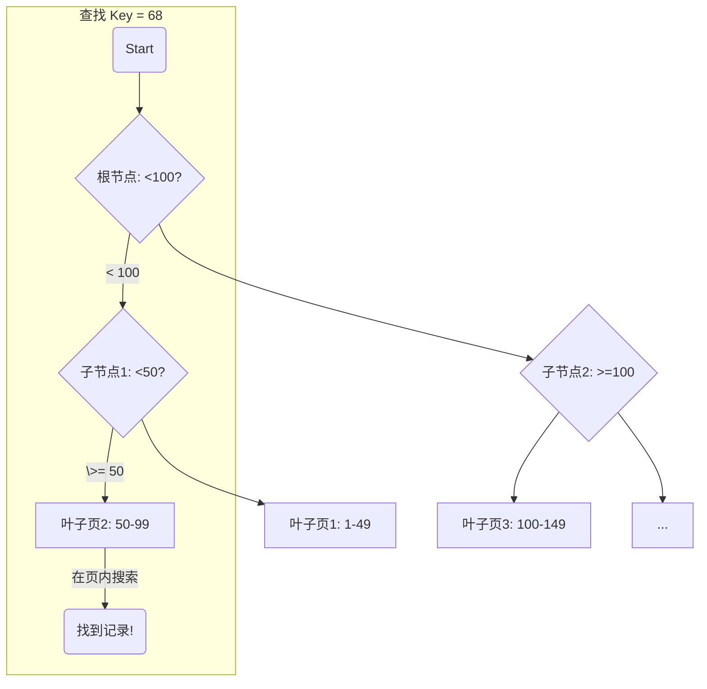
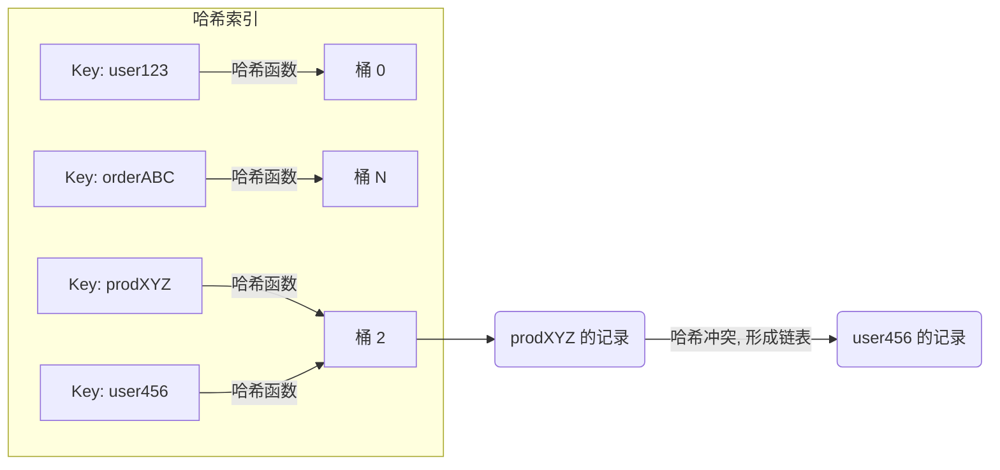
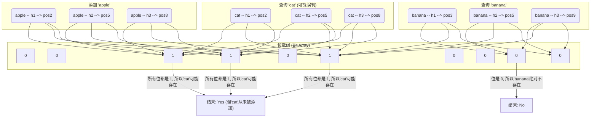
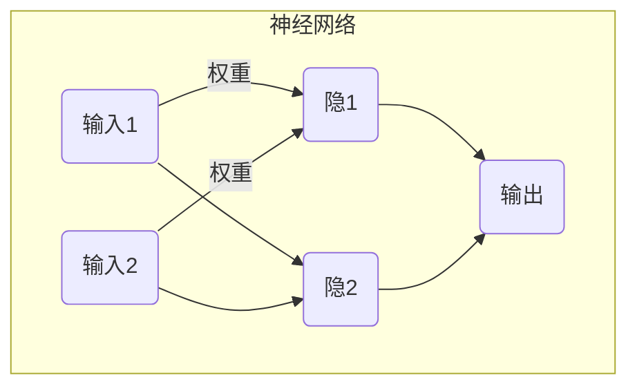
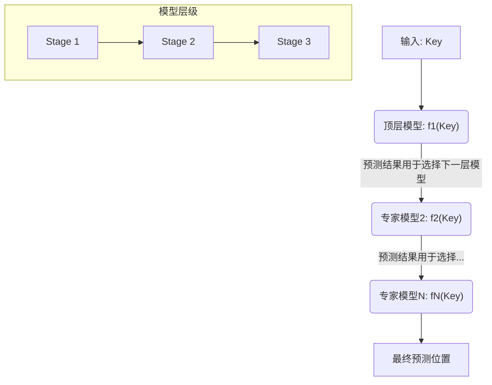
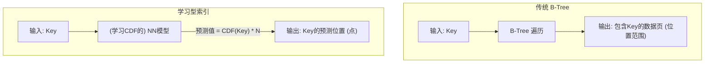
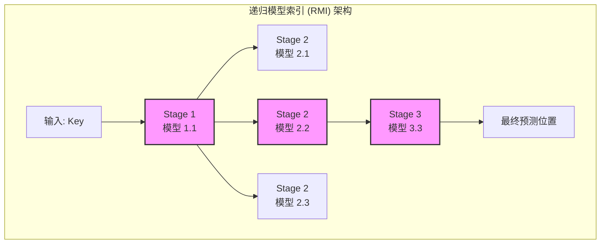
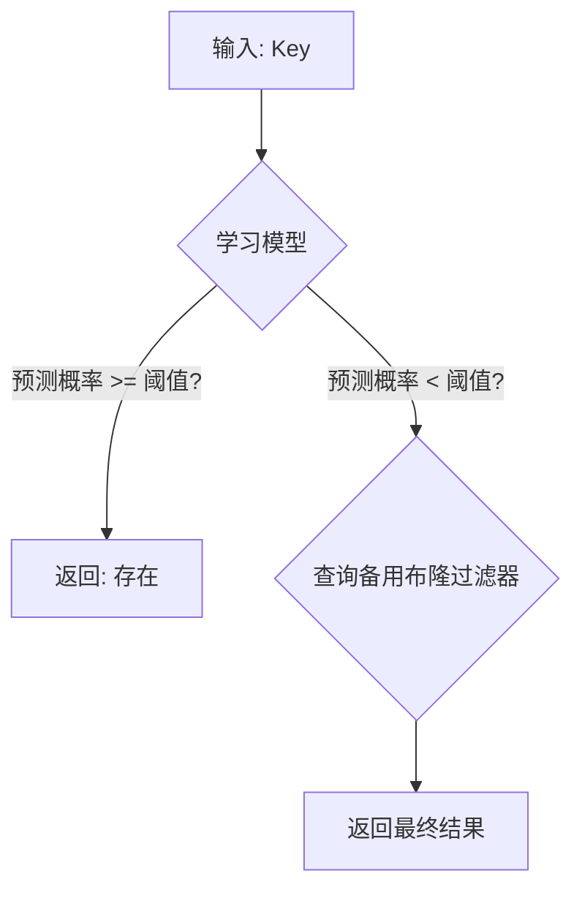
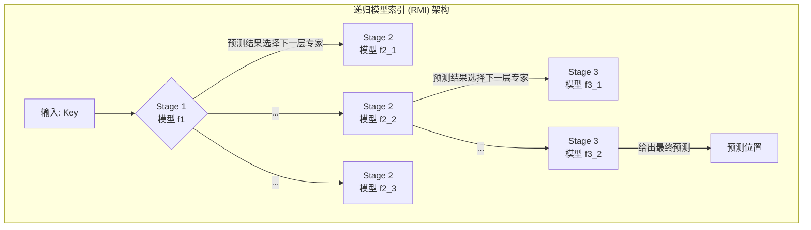

## AI论文解读 | The Case for Learned Index Structures
        
### 作者        
digoal        
        
### 日期        
2025-06-29       
        
### 标签        
PostgreSQL , PolarDB , DuckDB , AI , 论文解读        
        
----        
        
## 背景  
      
https://arxiv.org/pdf/1712.01208        
  
      
提示:        
```        
读懂《The Case for Learned Index Structures》这篇论文需要提前掌握哪些基础知识, 请使用中文给我讲一下这些基础知识, 尽量通熟易懂, 可以使用markdown支持的图形增加解释性.        
        
使用中文通熟易懂的解读《The Case for Learned Index Structures》这篇论文, 关键内容请深入讲解, 可以使用markdown支持的图形增加解释性.        
        
使用中文提取《The Case for Learned Index Structures》论文中一些重要的术语并详细解释, 可以使用markdown支持的图形示增加解释性.        
```        
        
## 1 前置知识 
  
好的，为了完全理解《The Case for Learned Index Structures》这篇开创性的论文，你需要对【数据库索引】和【机器学习】这两个领域有一些基础的了解。下面我将用通俗易懂的中文，为你讲解这些必备的基础知识，并配上一些简单的图示来帮助理解。

这篇论文的核心思想非常巧妙：**它认为所有索引结构本质上都是一种“模型”，这个模型可以根据一个键（Key）来预测数据的位置或是否存在。既然是模型，那我们就可以用更强大的机器学习模型（比如神经网络）来替代它们，从而可能获得比传统索引结构更高的效率和更小的空间占用。**

要理解这个思想，我们先来分解一下需要哪些知识。

-----

### Part 1: 数据库索引基础 (The "What" They Are Replacing)

想象一下，你有一本非常厚的书，你想快速找到包含某个词语的页面。如果你一页一页地翻，那会非常慢。书末尾的“索引”可以让你通过词语快速定位到页码。数据库索引就是起到同样的作用，它帮助数据库系统快速地从海量数据中找到你想要的数据，而无需扫描整个数据表。

你需要了解论文中提到的三种主要索引：

#### 1\. B-Tree (B树)

B树是数据库中最最常见、最重要的索引结构，尤其擅长处理**范围查询**（例如，查找所有5月1日到5月10日的订单）。

  * **工作原理**: 它是一种自平衡的多路搜索树。你可以把它想象成一个层级结构。顶层节点提供一个大致的范围，你根据你的键（Key）选择一个分支往下走，下一层的节点会进一步缩小范围，直到你最终在最底层的叶子节点（Leaf Node）中找到数据的位置。
  * **论文的视角**: 论文认为B树就是一个**分段的、基于规则的模型**。它通过一系列“如果-否则”的判断，把一个键（Key）映射到一个数据页（Page）的位置。




#### 2\. Hash Index (哈希索引)

哈希索引非常适合进行**单点查询**（例如，通过用户ID精确查找一个用户的信息），速度极快。

  * **工作原理**: 它使用一个“哈希函数”（Hash Function）直接计算出键（Key）应该存储在哪个位置（称为“桶”或“Bucket”）。就像一个神奇的分类帽，你给它一个名字，它直接告诉你这个人应该去哪个学院。
  * **挑战**: 可能会有“哈希冲突”（Collision），即两个不同的键被哈希函数分到了同一个位置。解决方法通常是在这个位置上挂一个链表或者使用其他探测方法。
  * **论文的视角**: 论文认为，传统的哈希函数试图将键**均匀随机**地分布到各个桶里，但如果能**学习数据本身的分布规律**，我们或许能设计一个更好的哈希函数，从源头上就大大减少冲突。




#### 3\. Bloom Filter (布隆过滤器)

布隆过滤器是一种空间效率极高的概率型数据结构，用于判断一个元素**是否可能存在**于一个集合中。

  * **工作原理**: 它使用多个哈希函数对一个键进行计算，得到多个位置，并将这些位置的二进制位（bit）设为1。查询时，同样计算出多个位置，如果这些位置上的位**全部**为1，则该元素**可能**存在；但只要有**任何一个**位是0，那该元素就**绝对不存在**。
  * **特点**:
      * **可能会有误判（False Positive）**: 告诉你“可能在”，但实际上不在。
      * **绝不会漏判（No False Negative）**: 如果告诉你“绝对不在”，那它就一定不在。
  * **论文的视角**: 布隆过滤器可以被看作一个**二元分类器（Binary Classifier）**。它在回答“是/否”的问题：“这个键是否存在？”




-----

### Part 2: 机器学习基础 (The "How" They Are Replacing It)

机器学习的核心是让计算机从数据中自动学习规律（即构建模型），并利用这些规律进行预测。

#### 1\. 模型 (Model)

在ML中，模型就是一个数学函数，它接受输入，然后产生一个预测输出。例如 `f(输入) -> 预测输出`。训练模型的过程就是调整这个函数的内部参数，使其预测尽可能准确。

#### 2\. 回归 (Regression) vs. 分类 (Classification)

这是两种最基本的机器学习任务。

  * **回归 (Regression)**: 预测一个**连续的数值**。

      * *例子*: 根据房子的面积、位置等特征，预测它的价格。
      * *与论文的联系*: **学习型范围索引**（替代B树）就是一个回归问题。模型学习从 **键（Key）** 到它在有序数据中的 **位置（Position）** 的映射，位置是一个连续的数值。

  * **分类 (Classification)**: 预测一个**离散的类别**。

      * *例子*: 判断一封邮件是“垃圾邮件”还是“非垃圾邮件”。
      * *与论文的联系*: **学习型存在索引**（替代布隆过滤器）就是一个分类问题。模型学习判断一个 **键（Key）** 属于“存在”还是“不存在”这两个类别。

#### 3\. 神经网络 (Neural Networks, NN)

神经网络是机器学习中一类非常强大的模型，灵感来源于人脑的结构。

  * **基本结构**: 由许多相互连接的“神经元”层组成。数据从输入层进入，经过一个或多个“隐藏层”的处理，最终在输出层得到结果。
  * **强大之处**: 理论上，只要神经网络足够复杂，它可以拟合（学习）出任何复杂的函数或数据分布。这使得它成为替代传统索引的理想候选者，因为现实世界的数据分布往往非常复杂和不规则。




-----

### Part 3: 核心衔接思想 (The Bridge Between Two Worlds)

理解了以上两部分，现在我们来看论文是如何把它们连接起来的。

#### 1\. 索引即模型，位置 ≈ 累积分布函数 (CDF)

这是理解这篇论文**最关键的洞见**。

  * **累积分布函数 (CDF - Cumulative Distribution Function)**: 对于一个数值型数据集，CDF(x) 表示“数据集中小于或等于x的数值所占的比例”。这个函数的输出值范围是0到1。

\<p align="center"\>
\
\<br\>
\<em\>一个典型的CDF曲线\</em\>
\</p\>

  * **论文的洞见**: 如果数据是**有序**的，那么一个键（Key）在数据中的位置（Position）可以通过它的CDF值来估算：
    `Position ≈ CDF(Key) * N`
    （其中 `N` 是数据总数）

    这意味着，**学习一个范围索引，本质上就是在学习数据的累积分布函数！** B树通过构建一颗树来**隐式地、分段地**逼近这个CDF，而神经网络可以直接学习一个**平滑的、连续的**函数来近似这个CDF，这可能更高效。

#### 2\. 递归模型索引 (Recursive Model Index, RMI)

论文发现，用一个庞大而复杂的神经网络来精确预测每个键的位置，成本太高且不切实际（这被称为“最后一英里问题”）。

  * **解决方案**: 他们提出了**递归模型索引（RMI）**，也叫**专家混合模型（Mixture of Experts）**。这是一个分层模型架构：

    1.  **顶层模型 (Stage 1)**: 先对键进行一次粗略的预测，这个预测结果不是最终位置，而是用来**选择下一层的某个“专家”模型**。
    2.  **专家模型 (Stage 2, 3...)**: 每个专家模型只负责数据的一个小子集，因此它可以更简单、更精确地对这个小范围内的键进行预测。

    这个结构就像B树的层级查询，但每一步的跳转都是通过模型计算完成的，而不是硬盘指针。




### 总结

要读懂《The Case for Learned Index Structures》，你需要：

1.  **数据库知识**: 明白B树、哈希索引和布隆过滤器是做什么的，以及它们的优缺点。
2.  **机器学习知识**: 了解模型、回归、分类和神经网络的基本概念。
3.  **核心思想**: 抓住 **“索引即模型”** 这个核心，特别是范围索引与 **CDF** 之间的深刻联系，并理解**RMI**是如何巧妙地解决“最后一英里”精度问题的。

掌握了这些，你就能轻松地理解为什么作者会提出用学习的方式来构建索引，以及他们提出的具体方法是如何工作的了。
  
## 2 解读论文 
  
 好的，这篇名为《The Case for Learned Index Structures》（学习型索引结构的案例）的论文是数据库领域的一篇开创性作品。它的核心思想极具颠覆性：**将数据库中沿用数十年的经典索引结构（如B-Tree、哈希索引、布隆过滤器）看作是一种“模型”，并提出可以使用机器学习模型（特别是神经网络）来替代它们，从而在速度和空间上实现数量级的提升**  。

下面，我将为您深入解读这篇论文的关键内容。

### 核心洞见：索引即模型 (Indexes are Models)

论文的出发点是一个非常新颖的视角：

  *  **B-Tree 索引**可以看作一个模型，它输入一个键（Key），预测出这个键对应的数据在一个**有序**数组中的位置（Position） 。
  *  **哈希索引**可以看作一个模型，它输入一个键，预测出在一个**无序**数组中的位置  。
  *  **布隆过滤器**则是一个模型，它判断一个给定的键是否存在于集合中  。

 既然它们都是模型，那么我们完全可以用其他更强大的模型来替代它们   。论文认为，机器学习模型，尤其是神经网络，能够学习数据本身复杂的分布规律，并利用这个规律来极其高效地预测数据的位置或存在性   。这与传统索引结构有本质区别，因为传统索引几乎不对数据分布做任何假设  。

-----

### 1\. 学习型范围索引 (Learned Range Indexes) - 替代 B-Tree

B-Tree 是最常见的索引，擅长单点查询和范围查询。论文首先从它开刀。

#### 从 B-Tree 到 CDF 模型

  *  **B-Tree 的工作方式**：在一个排好序的数据数组上，B-Tree 通过层层节点查找，最终将查询定位到一个数据页（Page）中。它给出的预测是一个范围，其最大误差就是这个数据页的大小  。例如，它告诉你“你要找的键在第1000到1100号位置之间”。

  *  **论文的关键抽象**：作者指出，对于一个**有序**的数据集，一个键（Key）的位置（Position）和它的 **累积分布函数（Cumulative Distribution Function, CDF）** 之间存在一个简单的关系  。CDF(Key) 表示数据集中小于等于这个Key的元素所占的比例（一个0到1之间的值）。因此，我们可以估算：

$$\text{Position} \approx \text{CDF}(\text{Key}) \times N$$

其中 N 是数据总条数  。

这意味着，**建立范围索引的本质，就是在学习数据的CDF**   ！B-Tree用一棵树来分段、粗糙地逼近这个CDF  ，而神经网络则可以直接学习一个平滑的函数来拟合它。




#### 解决“最后一英里”问题：递归模型索引 (RMI)

 一个简单的模型或许能很好地学习数据的大致分布（例如，从1亿条数据中定位到1万条的范围），但要精确到最后几百个记录（即“最后一英里”）则非常困难且低效  。

 为此，论文提出了 **递归模型索引（Recursive Model Index, RMI）** 的架构，其灵感来源于“专家混合模型”  。

  *  **工作原理**：RMI 构建了一个模型的层级结构。顶层模型接收查询的键，它不直接预测最终位置，而是根据预测结果选择下一层的某个“专家”模型。这个专家模型只负责数据的一个更小的子集，因此能做出更精确的预测。这个过程可以递归进行  。

     **这巧妙地模仿了 B-Tree 的层级思想，但用模型计算代替了节点间的指针跳转**  。




  *  **混合索引 (Hybrid Indexes)**：为了保证最坏情况下的性能，RMI 允许在最后一层，如果某个专家模型的预测误差超过了预设的阈值，就自动用一个传统的B-Tree来替换它   。这使得学习型索引的性能下限不会差于B-Tree  。

#### 效果

在多个真实数据集上的实验显示，学习型索引相比于缓存优化的B-Tree：

  *  **速度提升高达 70%**  。
  *  **内存占用节省一个数量级以上**  。
     在某些整数数据集上，它甚至比B-Tree快**1.5到3倍**，同时体积缩小了**两个数量级**  。

-----

### 2\. 学习型点索引 (Learned Point Indexes) - 替代哈希索引

 哈希索引（Hash Map）通过哈希函数将键映射到数组位置，但“哈希冲突”是其核心挑战  。

  *  **论文思想**：传统哈希函数的目标是“均匀随机”，它不关心数据本身的分布。论文提出，我们可以再次利用学习数据CDF的思想来创建一个更智能的哈希函数  。
    $$\text{h}(\text{Key}) = \text{F}(\text{Key}) \times M$$
     其中 F 是学习到的CDF模型，M 是哈希表的大小   。如果模型 F 能完美学习数据的经验CDF，那么理论上就不会产生任何冲突  。

  *  **效果**：这种方法与具体的哈希冲突解决方案（如链地址法、开放地址法）是正交的，可以结合使用   。实验表明，通过学习数据分布，**哈希冲突的数量最多可以减少 77%**   。对于冲突代价高昂的场景（如分布式哈希），这种提升尤为重要  。

-----

### 3\. 学习型存在索引 (Learned Existence Indexes) - 替代布隆过滤器

 布隆过滤器用于快速判断一个元素“是否可能存在”，它允许有误判（False Positives）但绝不漏判（False Negatives） 。

  *  **论文思想**：论文将这个问题框架化为一个**二元分类问题**  。
  
  1.   **训练一个分类模型**：例如，使用循环神经网络（RNN）来学习一个URL是否为恶意的钓鱼网址   。模型的输出是一个0到1的概率，表示该键存在的可能性  。
  2.   **设定阈值**：选择一个阈值（如0.9），如果模型输出概率高于它，就认为键存在  。
  3.   **保证“无漏判”**：模型本身可能会漏判（即对一个真实存在的键给出了低于阈值的概率）。为了维持布隆过滤器“无漏判”的特性，所有被模型漏判的键会被存入一个**规模很小的“备用”布隆过滤器**中  。

  * **查询流程**：

  1.  首先用学习模型进行预测。
  2.  如果模型认为“存在”，则返回“存在”。
  3.   如果模型认为“不存在”，则再去查询那个小型的备用布隆过滤器，以它为准  。




  *  **效果**：在钓鱼网址黑名单的应用中，这种“模型+备用过滤器”的混合结构，在达到相同误判率的前提下，比传统的布隆过滤器**节省了15%到36%的内存空间**  。模型越准，备用过滤器就越小，节省的空间就越多。

-----

### 总结与未来方向

 《The Case for Learned Index Structures》这篇论文的核心贡献在于，它开辟了一个全新的研究方向，即**用机器学习来重新设计和优化计算机系统中的核心组件**  。它证明了学习数据分布可以带来巨大的性能和空间优势。

论文最后也指出了几个激动人心的未来方向：

  *  **多维索引**：神经网络天然擅长处理高维数据，将其思想扩展到多维索引（如R-Tree）上具有巨大潜力  。
  *  **超越索引**：CDF模型不仅能用于索引，还可能加速**排序**和 **数据库连接（Join）** 等其他操作  。
  *  **硬件加速**：随着GPU/TPU等AI加速器的普及，执行神经网络的成本会变得微不足道，这将让学习型索引的优势更加突出  。

总而言之，这篇论文不仅仅是提出了一种更快的索引，更是倡导了一种全新的系统设计哲学：**让系统组件通过学习数据来自动“进化”和“优化”，而不是依赖于人类设计的、普适但次优的算法**。
  
## 3 术语  
  
好的，以下是论文《The Case for Learned Index Structures》中的一些核心术语及其详细解释，希望能帮助您更好地理解这篇论文的精髓。

-----

### 1\. 学习型索引 (Learned Index)

这是整篇论文最核心的术语。

  *  **定义与解释**: “学习型索引”是一种使用机器学习（ML）模型，特别是神经网络，来替代或增强传统索引结构（如B-Tree、哈希表、布隆过滤器）的新型索引   。其基本思想是，索引结构本质上就是一个“模型”，它将一个键（Key）映射到数据记录的位置（Position）或判断其是否存在   。既然是模型，就可以用能够学习数据分布规律的机器学习模型来替代，从而实现更高的性能和更小的空间占用  。

  * **与传统索引的区别**:

      *  **传统索引** (如B-Tree) 不对数据分布做任何假设，其性能是固定的，例如查找时间复杂度为 $O(\\log n)$  。
      *  **学习型索引** 通过学习数据本身的模式和顺序来直接预测位置，有望将查找时间复杂度从 $O(\\log n)$ 降至 $O(1)$  。

-----

### 2\. 累积分布函数 (Cumulative Distribution Function, CDF)

这是学习型**范围索引**（替代B-Tree）背后的关键理论基础。

  * **定义与解释**: CDF(x) 表示数据集中，数值小于或等于 x 的元素所占的比例。它是一个值域在 [0, 1] 之间的函数，通常呈 "S" 型。

  *  **在论文中的应用**: 论文作者观察到，如果数据是**有序**的，那么一个键（Key）的位置（Position）可以通过其CDF值来近似估算  。
    $$\text{Position} \approx F(\text{Key}) \times N$$
     其中， $F(\\text{Key})$ 是该键的CDF估计值， $N$ 是数据集中的记录总数   。因此，训练一个模型来预测键的位置，本质上就是在学习数据的累积分布函数  。

\<div align="center"\>
\
\<br\>
\<em\>一个典型的CDF曲线，它将数据值映射到[0,1]的累积概率上\</em\>
\</div\>

-----

### 3\. 递归模型索引 (Recursive Model Index, RMI)

这是论文针对学习型索引在实践中遇到的“最后一英里”问题所提出的核心架构。

  *  **“最后一英里”问题 (Last Mile Problem)**: 使用单个复杂的神经网络模型，虽然能从亿万数据中快速定位到一个小范围（例如，数千条记录），但要进一步将误差从几千精确到几百甚至个位数，会变得非常低效和困难  。

  *  **RMI 架构**: RMI 采用了一种层级式的“专家混合模型”架构来解决此问题  。

  1.   一个顶层模型接收输入的键，进行一次粗略预测  。
  2.   这次预测的结果并不直接是最终位置，而是被用来从下一层级的多个“专家”模型中**选择一个**  。
  3.   被选中的专家模型只负责数据的一个小范围，因此可以用更简单的模型进行更精确的预测   。这个过程可以递归地进行下去，直到最后一层模型给出最终的位置预测  。

  这种结构巧妙地将一个复杂的大问题分解成了多个简单的小问题，既保证了精度，又控制了计算成本。




-----

### 4\. 混合索引 (Hybrid Index)

这是RMI架构的一个实用性扩展，旨在保证学习型索引的性能下限。

  *  **定义与解释**: 在RMI的最后一层，学习过程结束后，系统会检查每个“专家”模型的最大预测误差   。如果某个模型的误差超过了预设的阈值（意味着它对这部分数据学得不好），系统就会自动放弃这个学习模型，转而用一个**传统的B-Tree**来替代它，负责这部分数据的索引  。

  *  **意义**: 这种做法非常聪明，它为学习型索引提供了一个“安全网”。在最坏的情况下，如果数据分布极其复杂且难以学习，所有模型都可能被B-Tree替代，此时整个索引就退化成了一个传统B-Tree   。这保证了学习型索引的性能**永远不会比B-Tree差**  。

-----

### 5\. 模型偏置搜索 (Model Biased Search)

这是一个利用学习型索引预测结果来优化搜索过程的策略。

  *  **定义与解释**: 传统的二分搜索（Binary Search）总是从查找区间的中间点开始。而模型偏置搜索则利用了模型的预测能力   。它的第一步不是从中间点开始，而是直接跳转到 **模型预测的位置（pos）** 作为二分搜索的第一个“中间点”  。

  *  **优势**: 因为模型预测的位置通常已经非常接近真实位置，从这个点开始搜索可以大大减少后续的查找次数，尤其是在误差范围（由`min_err`和`max_err`限定）较大的情况下。论文还探讨了类似的“偏置四元搜索”，即从`pos - σ`, `pos`, `pos + σ`三个点开始搜索  。
  
## 参考        
         
https://arxiv.org/pdf/1712.01208  
        
        
<b> 以上内容基于DeepSeek、Qwen、Gemini及诸多AI生成, 轻微人工调整, 感谢杭州深度求索人工智能、阿里云、Google等公司. </b>        
        
<b> AI 生成的内容请自行辨别正确性, 当然也多了些许踩坑的乐趣, 毕竟冒险是每个男人的天性.  </b>        
  
   
  
#### [期望 PostgreSQL|开源PolarDB 增加什么功能?](https://github.com/digoal/blog/issues/76 "269ac3d1c492e938c0191101c7238216")
  
  
#### [PolarDB 开源数据库](https://openpolardb.com/home "57258f76c37864c6e6d23383d05714ea")
  
  
#### [PolarDB 学习图谱](https://www.aliyun.com/database/openpolardb/activity "8642f60e04ed0c814bf9cb9677976bd4")
  
  
#### [PostgreSQL 解决方案集合](../201706/20170601_02.md "40cff096e9ed7122c512b35d8561d9c8")
  
  
#### [德哥 / digoal's Github - 公益是一辈子的事.](https://github.com/digoal/blog/blob/master/README.md "22709685feb7cab07d30f30387f0a9ae")
  
  
#### [About 德哥](https://github.com/digoal/blog/blob/master/me/readme.md "a37735981e7704886ffd590565582dd0")
  
  

  
