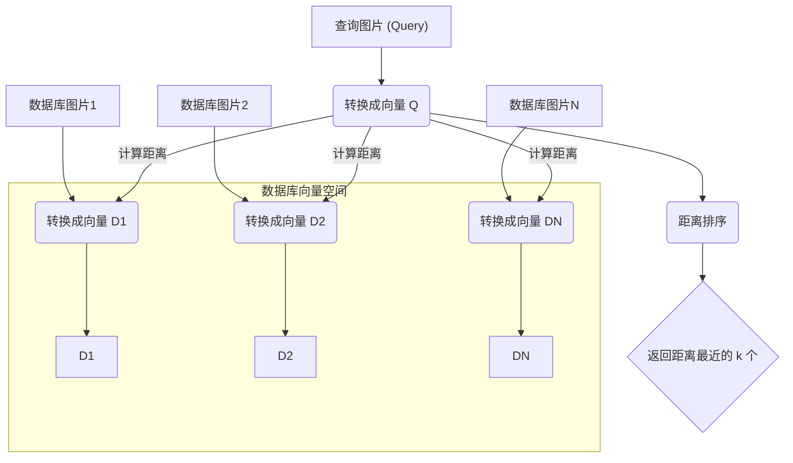
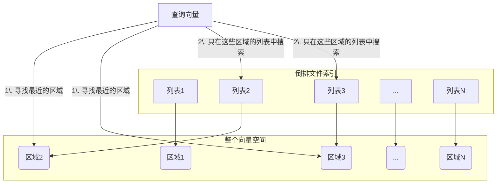
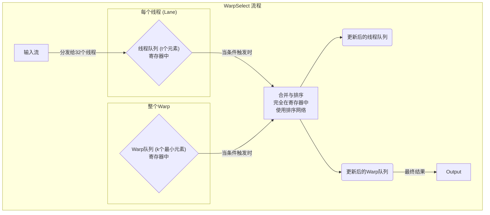
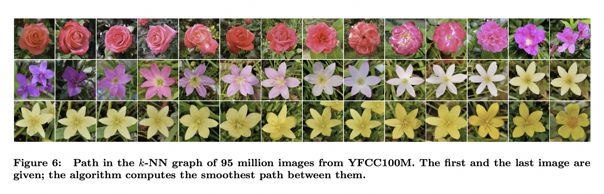
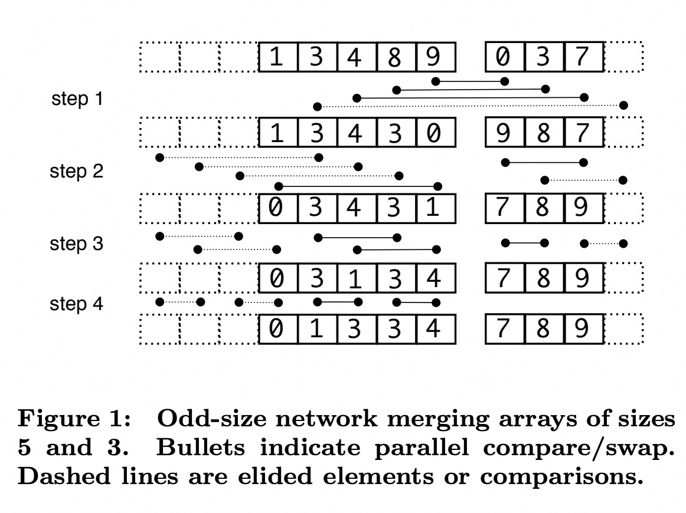
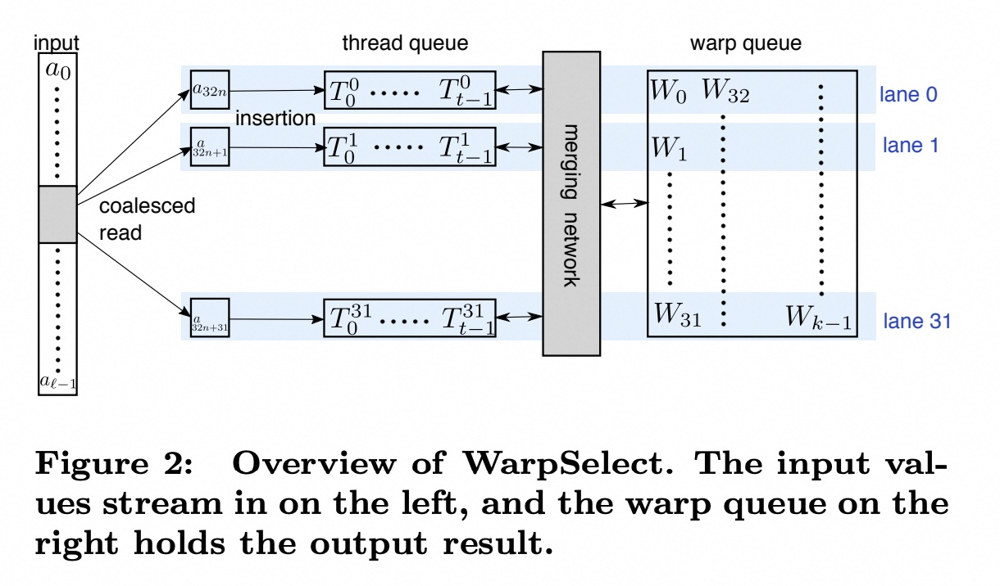

## AI论文解读 | Billion-scale similarity search with GPUs
        
### 作者        
digoal        
        
### 日期        
2025-06-30        
        
### 标签        
PostgreSQL , PolarDB , DuckDB , AI , 论文解读        
        
----        
        
## 背景  
      
https://arxiv.org/pdf/1702.08734        
  
      
提示:        
```        
读懂《Billion-scale similarity search with GPUs》这篇论文需要提前掌握哪些基础知识, 请使用中文给我讲一下这些基础知识, 尽量通熟易懂, 可以使用markdown支持的图形增加解释性.        
        
使用中文通熟易懂的解读《Billion-scale similarity search with GPUs》这篇论文, 关键内容请深入讲解, 可以使用markdown支持的图形增加解释性.        
        
使用中文提取《Billion-scale similarity search with GPUs》论文中一些重要的术语并详细解释, 可以使用markdown支持的图形示增加解释性.        
```        
        
## 1 前置知识 
  
好的，为了完全理解《Billion-scale similarity search with GPUs》这篇论文，你需要提前掌握三大块基础知识：**核心问题与挑战**、**关键算法与数据结构**、以及**GPU架构与编程**。

下面我将用通俗易懂的方式，为你详细讲解这些知识点。

-----

### 一、 核心问题与挑战 (我们在解决什么？)

#### 1\. 相似度搜索 (Similarity Search) 与 k-近邻 (k-NN)

想象一下你在手机相册里搜索所有“猫”的照片。系统是如何找到所有与“猫”相似的图片的呢？这就是相似度搜索。

在技术上，我们通常会用一个高维度的数学向量 (vector) 来表示一张图片、一段文字或一个声音。这个向量就像是这个对象的“数字指纹”。

  * **向量化 (Vectorization)**: 将复杂数据（如图片）转换成一串数字（向量）。例如，一张图片可以表示为一个 512 维的向量 `[0.1, 0.8, -0.2, ..., 0.5]`。
  * **相似度衡量**: 两个向量在空间中的距离越近，代表它们表示的对象就越相似。最常用的距离是**欧氏距离 (L2 distance)**。
  * **k-近邻 (k-NN)**: 给定一个查询向量 (比如一张你想搜索的猫的图片)，k-NN 的任务就是在海量数据库中，找到与它距离最近的 k 个向量（即最相似的 k 张图片）。




**你需要理解**：这篇论文的核心目标，就是如何在一个拥有**十亿级别 (Billion-scale)** 向量的数据库里，**极快地**完成 k-NN 搜索。

#### 2\. 维度诅咒 (The Curse of Dimensionality)

当向量的维度（比如前面说的 512 维）变得非常高时，会出现一个严重的问题——“维度诅咒”。

简单来说，维度越高，所有向量点之间的距离会变得越来越相似，区分度降低。想象一下：

  * **二维空间**：点与点之间有远有近，很容易区分。
  * **高维空间**：所有点仿佛都分布在一个“球壳”上，离查询点的距离都差不多远。

这对搜索是灾难性的。传统的索引方法（如 KD-tree）在高维下会失效，搜索效率退化到和“暴力搜索”（计算查询向量和数据库里每一个向量的距离）一样慢。而暴力搜索在十亿级别的数据上是不可接受的。

**你需要理解**：由于“维度诅z咒”，我们无法在海量高维数据上进行**精确**且**快速**的 k-NN 搜索。因此，论文转向了**近似最近邻 (Approximate Nearest Neighbor, ANN)** 搜索。ANN 的目标是牺牲一点点精度（比如找到 99% 准确的近邻），来换取成千上万倍的速度提升。

-----

### 二、 关键算法与数据结构 (我们用什么方法解决？)

为了实现快速的近似搜索，论文主要依赖两种技术：**乘积量化 (Product Quantization, PQ)** 和 **倒排文件系统 (Inverted File System, IVF)**。它们共同构成了论文中的核心索引结构 **IVFADC**。

#### 1\. 向量量化 (Vector Quantization)

核心思想是**压缩**。一个高维向量（通常用 32 位浮点数表示）占用的存储空间很大。如果我们能用一个更短的编码 (code) 来近似表示它，就能大大减少内存占用和计算量。

这就像用一个词（如“红色”）来代替一个具体的 RGB 值（如 `(255, 0, 0)`）。

#### 2\. 乘积量化 (Product Quantization, PQ)

PQ 是一种非常高效的向量量化技术，也是这篇论文的基石。它的步骤如下：

1.  **切分 (Split)**: 将一个高维向量（如 256 维）切成多段独立的低维子向量（如 8 段，每段 32 维）。
2.  **量化 (Quantize)**: 为每一段子向量分别创建一个小的“码本 (codebook)”。这个码本里有 256 个“质心 (centroid)”向量。然后，在每一段上，找到离该段子向量最近的那个质心，并用这个质心的 ID（0-255，正好一个字节）来表示它。
3.  **拼接 (Concatenate)**: 将每一段得到的 ID 拼接起来，形成最终的 PQ 编码。

**例子**：一个 256 维的向量，如果用 32 位浮点数存储，需要 `256 * 4 = 1024` 字节。使用 PQ，切成 8 段，每段用 1 个字节的 ID 表示，最终只需要 `8 * 1 = 8` 字节！实现了巨大的压缩。

**你需要理解**：PQ 通过“分而治之”的思想，极大地压缩了向量，并且在计算距离时，可以通过查表 (Lookup Table) 的方式快速估算，避免了昂贵的浮点运算。

#### 3\. 倒排文件系统 (Inverted File, IVF)

如果说 PQ 是为了“压缩”，那么 IVF 就是为了“筛选”。它的思想借鉴了搜索引擎的倒排索引。

1.  **空间划分**: 使用 k-means 等聚类算法，将整个向量空间粗略地划分为几千或几万个“单元 (cell)”。每个单元的中心是一个“粗糙质心”。
2.  **建立倒排列表**: 每个单元都维护一个“倒排列表 (inverted list)”，记录了所有落入这个单元的向量的 PQ 编码。
3.  **查询**: 当一个查询向量到来时：
      * 首先，只计算它和所有“粗糙质心”的距离，找到最近的几个单元（比如最近的 5 个）。
      * 然后，只在这些被选中的单元的“倒排列表”里进行搜索。

**你需要理解**：IVF 极大地缩小了搜索范围。本来要和十亿个向量比较，现在可能只需要和最近的几个单元里的几万个向量比较，效率大大提升。

**IVFADC** 就是将 IVF 和 PQ 结合起来：先用 IVF 筛选候选列表，再用 PQ 编码快速计算这些候选向量与查询向量的近似距离。

-----

### 三、 GPU 架构与编程 (我们在什么平台上加速？)

这篇论文的另一个核心贡献是在 GPU 上高效实现了上述算法。所以你需要了解 GPU 的工作原理。

#### 1\. GPU 架构层级

GPU 是一个为**大规模并行**计算设计的处理器。它的架构可以这样理解：

```
Grid (网格)
└── Block / CTA (线程块)
    └── Warp (线程束)
        └── Thread / Lane (线程)
```

  * **线程 (Thread)**: 最基本的执行单元。
  * **Warp**: GPU 调度的基本单位，通常由 32 个线程组成。一个 Warp 中的 32 个线程会**同时**执行相同的指令，这个模型叫做 **SIMT (Single Instruction, Multiple Threads)**。
  * **线程块 (Block)**: 由多个 Warp 组成。同一个 Block 内的线程可以通过高速的**共享内存 (Shared Memory)** 进行通信。
  * **网格 (Grid)**: 一次 GPU 计算任务（称为一个 Kernel）由一个 Grid 的线程来执行。

**你需要理解**：GPU 的力量来自于成千上万个线程的并行执行。写出好的 GPU 程序，关键在于如何将任务拆分给大量线程，并让它们高效协作。

#### 2\. GPU 内存层级

这是 GPU 编程中**最重要**的概念，也是论文性能优化的关键。

<pre>
+-----------------------------+
|    <b>Register File (寄存器)</b>   |  <-- 每个线程私有，最快，最小
+-----------------------------+
|
+-----------------------------+
|   <b>Shared Memory (共享内存)</b>  |  <-- 每个Block共享，很快，很小 (类似L1 Cache)
+-----------------------------+
|
+-----------------------------+
|    <b>Global Memory (全局内存)</b> |  <-- 所有线程共享，慢，很大 (类似主内存)
+-----------------------------+
</pre>

  * **寄存器 (Register File)**: 速度最快，但容量极小，论文中的核心算法 `WarpSelect` 就设计为完全在寄存器中运行。
  * **共享内存 (Shared Memory)**: 速度远快于全局内存，是 Block 内线程通信的关键。论文用它来存储 PQ 距离计算时需要的查询表。
  * **全局内存 (Global Memory)**: 容量最大（GB 级别），但访问延迟最高。整个十亿向量数据库就存放在这里。

**你需要理解**：高性能 GPU 编程的精髓在于**最大化利用寄存器和共享内存，最小化对全局内存的访问**。论文中的许多设计，如 Kernel Fusion (内核融合)、数据布局优化，都是为了这个目标。

#### 3\. 论文中的关键 GPU 优化点

  * **k-Selection (k-选择)**: 这是 k-NN 的最后一步，即从一堆距离值中选出最小的 k 个。传统的堆 (Heap) 算法在 GPU 上是串行的，效率很低。论文设计了 `WarpSelect` 算法，它利用 **Warp 内的 shuffle 指令**（一种让 Warp 内线程直接交换寄存器数据的超快操作）和**排序网络 (Sorting Network)**，在寄存器中并行地完成 k-选择。
  * **Kernel Fusion (内核融合)**: 将多个独立的计算步骤（比如计算距离和 k-选择）合并成一个大的 GPU Kernel。这样做可以避免将中间结果写回慢速的全局内存再读出，从而大大提升效率。

### 总结

在你阅读这篇论文之前，请确保你对以下问题有了清晰的认识：

1.  **目标是什么？** 在十亿级别的高维向量数据中，快速地找到一个查询向量的 k 个近似最近邻。
2.  **挑战是什么？** “维度诅咒”让精确搜索变得不可能，海量数据对计算和存储要求极高。
3.  **核心算法是什么？** `IVFADC`，它结合了 `IVF`（倒排文件，用于快速筛选）和 `PQ`（乘积量化，用于快速压缩和距离估算）。
4.  **如何实现加速？** 在 GPU 上实现。关键在于理解其并行架构（Warp/SIMT）和内存层级（寄存器 \> 共享内存 \> 全局内存），并围绕它们设计算法，如论文中创新的 `WarpSelect`。

掌握了这些基础知识后，你就能更好地理解论文中各种设计选择的动机和其巧妙之处，从而领会其如何实现“Billion-scale similarity search with GPUs”这一宏伟目标的。
  
## 2 解读论文 
  
好的，这篇名为《Billion-scale similarity search with GPUs》的论文是相似度搜索领域的一篇里程碑式著作。它详细阐述了如何利用 GPU 的强大并行计算能力，来解决在**十亿级别**的海量高维数据中进行快速相似度搜索的难题。

下面，我们将用通俗易懂的语言，结合图示，为您深入解读这篇论文的核心思想与关键技术。

-----

### **一、 核心问题：大海捞针，但捞的是“相似的针”**

 想象一下，你有一个包含 10 亿张图片的数据库，现在你想找出一张“夕阳下的海滩”图片，并找到数据库里和它最相似的 10 张图片。这就是这篇论文要解决的问题  。

  * **技术挑战**：
    1.   **向量化表示**：首先，每张图片都会被一个深度学习模型转换成一个高维向量（比如 512 维或更高维度的数字数组） 。向量空间中，距离越近，代表图片越相似。
    2.   **维度诅咒**：在高维空间中，所有点之间的距离都趋向于相等，这使得传统的索引方法（如树结构）失效，搜索效率急剧下降  。
    3.   **计算量巨大**：最直接的方法是“暴力搜索”，即计算查询图片与数据库中**每一张**图片的距离，但这在十亿级别的数据上是完全不可行的  。
    4.   **GPU 利用率瓶颈**：虽然 GPU 擅长并行计算，但之前的算法在某些步骤（如选出最小的 k 个距离）上并行度不足，或未能有效利用 GPU 高速的内存层级，导致性能瓶颈  。

 这篇论文的目标就是设计一套全新的算法和计算框架，充分压榨 GPU 的性能，实现前所未有的搜索速度  。

-----

### **二、 核心算法框架：IVFADC——“先粗筛，再精选”**

 为了避免对十亿向量进行暴力搜索，论文采用了一种名为 **IVFADC (Inverted File system with Asymmetric Distance Computation)** 的近似搜索方法   。这个方法的核心思想是“分而治之”，通过两级量化来加速搜索  。

#### **1. 第一级：IVF (倒排文件) - 粗筛**

这一步的目的是快速缩小搜索范围。

  *  **空间划分**：首先，通过聚类算法（如 k-means）将整个十亿向量的空间划分成数万个“区域”（或称为“桶”），每个区域有一个中心点，称为“粗糙质心”  。
  *  **建立索引**：然后，为每个区域建立一个“倒排列表”，这个列表里存储了所有落入该区域的向量的“压缩编码”  。这就像书的目录，每个章节标题（区域中心）下都列出了该章节包含的页面（向量）。
  * **查询过程**：当一个查询向量到来时，它**不会**和所有十亿个向量比较。而是：
    1.  先和几万个“区域中心”比较，找到距离最近的几个区域（比如 10 个）。
    2.   只在这 10 个区域对应的“倒排列表”中进行后续的精确搜索  。




通过 IVF，搜索范围从十亿级别急剧缩小到了百万甚至万级别，这是实现高性能的第一步。

#### **2. 第二级：PQ (乘积量化) - 精选与压缩**

 即使范围缩小了，我们仍然需要计算查询向量与候选向量的距离。为了进一步加速并节省内存，论文使用了**乘积量化 (Product Quantization, PQ)** 技术  。

 PQ 是一种非常高效的向量压缩技术，其步骤如下  ：

1.   **向量切分**：将一个高维向量（例如 128 维）切成 `b` 个低维子向量（例如 `b=8`，每段 16 维） 。
2.   **子空间量化**：为每一个子空间（16 维）独立训练一个小的码本（Codebook），这个码本通常包含 256 个“质心”向量。对于每个子向量，找到其在对应码本中最近的那个质心，并用该质心的 ID (0-255，正好 1 个字节) 来表示它  。
3.   **编码拼接**：将 `b` 个子向量的 ID (每个 1 字节) 拼接起来，形成最终的 PQ 编码（`b` 字节） 。

**效果**：一个 128 维的浮点向量原本需要 `128 * 4 = 512` 字节，经过 PQ 压缩后，只需要 `8` 字节，压缩率惊人。

 **距离计算**：更妙的是，计算查询向量和一个 PQ 编码的距离时，可以预先计算查询向量的每个子向量到各个码本中 256 个质心的距离，存成一个查找表 (Lookup Table)   。实际计算时，只需根据 PQ 编码进行 `b` 次查表和加法即可，速度极快  。

-----

### **三、 核心贡献：WarpSelect——专为 GPU 设计的极速 k-选择算法**

找到了候选向量并快速计算完距离后，我们需要从成千上万个距离值中选出最小的 `k` 个。这个操作称为 **k-selection**。传统方法（如堆排序）在 GPU 上是串行的，效率低下。

 为此，论文提出了其核心贡献之一：**WarpSelect**，一个完全在 GPU 寄存器（最快的内存）中运行的 k-选择算法  。

 它的设计思想是让一个 **Warp**（GPU 中 32 个线程的执行单元）协同完成对一个列表的 k-选择  。

  * **数据结构**：

      *  **线程队列 (Thread Queue)**：每个线程在自己的寄存器中维护一个大小为 `t` 的微型有序队列（比如 `t=4`） 。
      *  **Warp 队列 (Warp Queue)**：整个 Warp 共享一个大小为 `k` 的最终结果队列，它也通过一种特殊方式存储在所有线程的寄存器中  。

  * **工作流程**：




1.   **初步筛选**：当新的距离值输入时，每个线程先尝试将其插入自己的“线程队列”   。如果这个值比队列中最大的值还大，就直接丢弃  。这过滤掉了大量无用的数据。
2.   **状态维持**：算法维持一个**不变性 (Invariant)**：所有“线程队列”中的最大值，都必须大于“Warp 队列”中的最大值  。
3.   **触发合并**：一旦某个线程的“线程队列”更新后破坏了这个不变性（即它的最大值小于了 Warp 队列的最大值），就会触发一次全局同步  。
4.   **寄存器内排序**：此时，整个 Warp 会执行一次高效的并行合并排序，将所有 32 个“线程队列”和“Warp 队列”中的数据完全在寄存器中进行重排序   。排序后，最小的 `k` 个值更新到“Warp 队列”，剩下的放回“线程队列”   。这个过程使用**排序网络 (Sorting Networks)** 实现，非常适合 GPU 的并行架构  。

 **优势**：WarpSelect 避免了与缓慢的全局内存进行数据交换，几乎所有操作都在超高速的寄存器中完成，其性能可以达到 GPU 理论峰值的 55%   。这使得 k-NN 的整体实现比之前的 GPU SOTA 快了 **8.5 倍**  。

-----

### **四、 惊人的成果与应用**

通过将优化的 IVFADC 算法和高效的 WarpSelect 等技术结合，论文取得了前所未有的成果：

  *  **YFCC100M 数据集**：在包含 9500 万张图片的数据集上，构建一个高质量的 k-NN 图（k=10）仅需 **35 分钟**  。
  *  **DEEP1B 数据集**：在 **10 亿**个向量的数据集上，构建 k-NN 图也仅需不到 **12 小时**（使用 4 块 Titan X GPU） 。
  *  **开源贡献**：作者将这项工作开源为 **Faiss** (Facebook AI Similarity Search) 库，它已成为当今学术界和工业界进行大规模相似度搜索的事实标准  。

 一个有趣的应用是，在构建好的 k-NN 图上，可以找到任意两张图片之间的“平滑路径”，如下图所示，算法可以自动找到从一朵红玫瑰渐变到一朵黄水仙花的图像路径  。

 *图：在 YFCC100M k-NN 图中找到的图像路径示例*
   
   
  
### **总结**

《Billion-scale similarity search with GPUs》这篇论文的核心贡献可以概括为：

1.  **算法层面**：优化了基于 IVFADC 的近似最近邻搜索框架，使其非常适合 GPU 架构。
2.  **实现层面**：设计了以 **WarpSelect** 为代表的一系列底层 GPU 计算原语 (primitives)，通过极致地利用 GPU 寄存器和并行能力，突破了以往的性能瓶颈。
3.  **系统层面**：打造了一个端到端的、支持多 GPU 的十亿级别搜索系统  ，并将其开源为 Faiss 库，极大地推动了该领域的发展。

它不仅是一篇理论和实践完美结合的论文，更是一个强大的工程杰作，展示了通过软硬件协同设计能够达到的惊人性能。
  
## 3 术语  
  
《Billion-scale similarity search with GPUs》论文中提到了一些重要术语，并对其进行了详细解释：

### 重要术语解释

* **相似性搜索 (Similarity Search)**
    *  **解释**：相似性搜索在处理图像、视频等复杂数据（通常表示为高维特征）的专业数据库系统中得到应用，这类系统需要特定的索引结构来查找与给定查询内容最相似的数据。论文旨在更好地利用GPU来完成这项任务，通过数值相似性而非结构化关系进行搜索，例如查找与图片最相似的内容，或找出对集合中所有向量的线性分类器响应最高的向量  。

* **GPU (图形处理器)**
    *  **解释**：GPU是一种通用计算设备，擅长数据并行任务。在处理高维向量表示（如图像和视频特征）时，许多表示只能在GPU系统上高效生成，因为底层过程需要高算术复杂度和/或高数据带宽，或者在不因通信开销或表示质量下降的情况下无法有效分区。然而，如何有效利用GPU资产并不简单  。

* **k-选择 (k-selection)**
    *  **解释**：k-选择是从一个数组中找出k个最低值元素及其索引的操作。在相似性搜索中，通常只对少数结果感兴趣（例如k小于1000）。论文提出了一种在GPU上运行的k-选择算法，它在快速寄存器内存中操作，并足够灵活以与其他核函数融合  。

* **k-NN 图 (k-NN Graph)**
    *  **解释**：k-NN图是一个有向图，其中数据库中的每个向量都是一个节点，每条边将一个节点连接到其k个最近邻居。构建这样一个图是处理大型集合中最昂贵的操作之一  。

* **维度灾难 (Curse of Dimensionality)**
    *  **解释**：当处理高维数据时，由于数据空间的指数增长，无论是穷举搜索还是非穷举搜索的精确索引都会变得不切实际。这使得在十亿规模的数据库上进行搜索非常困难。因此，出现了大量关于近似搜索和/或图构建的研究  。

* **乘积量化 (Product Quantization, PQ)**
    *  **解释**：乘积量化是一种向量压缩方法，通过将高维向量分解为多个子向量，并对每个子向量进行量化来编码数据。这种方法可以产生大量的重构值，而不会显著增加处理成本。论文专注于基于PQ码的方法，因为它们被证明比二进制码更有效  。

* **IVFADC (Inverted File Index Auxiliary Distance Computation)**
    *  **解释**：IVFADC是一种索引结构，它结合了两级量化和倒排文件。数据库向量被编码，并且搜索不是穷举性的，而是根据第一级量化器预选向量。这种方法在GPU上实现了高效的近似最近邻搜索  。

* **Warp (Warp)**
    *  **解释**：Nvidia GPU使用一个32宽度的CUDA线程向量（称为warp）来执行指令流。Warp中的独立线程被称为lane。一个warp共享一个指令计数器，可以类比为现代矢量化多核CPU中的一个独立的CPU硬件线程。Warp中的lane如果走不同的执行路径会导致warp发散，从而降低性能  。

* **Lane (线程通道)**
    *  **解释**：Warp中的每个独立线程都被称为lane，其ID范围从0到31。每个lane都有自己的寄存器，用于执行本地任务。多个lane可以通过warp shuffle指令交换寄存器数据，从而实现warp范围内的并行化和存储  。

* **流多处理器 (Streaming Multiprocessor, SM)**
    *  **解释**：每个GPU核心被称为流多处理器（SM），每个block（或co-operative thread array, CTA）在一个SM上运行。SM包含功能单元，如ALU、内存加载/存储单元和各种特殊指令单元。GPU通过在所有SM上的warp中同时执行多个操作来隐藏执行延迟  。

* **寄存器文件 (Register File)**
    *  **解释**：GPU的寄存器文件是带宽最高的内存类型。为了维持GPU上大量指令的并行执行，需要一个庞大的寄存器文件。论文中提到的WarpSelect算法就是将状态完全保存在寄存器中，以实现单次数据遍历和避免跨warp同步  。

* **WarpSelect (WarpSelect)**
    *  **解释**：WarpSelect是论文中提出的k-选择算法实现，它将状态完全保存在寄存器中，只需要单次数据遍历，并避免了跨warp同步。它使用Odd-size Merging和Sorting作为基本操作，支持k值最高达1024  。

* **双调排序网络 (Bitonic Sorting Network)**
    *  **解释**：双调排序网络是一种常用的SIMD架构排序算法，它利用向量并行性。论文使用Batcher双调排序网络的一种变体，作为构建块来实现寄存器内排序。该网络通过一系列并行合并操作对数组进行排序  。

**关于图形说明：**

 很抱歉，我无法直接生成markdown支持的图形来增加解释性。论文中包含了一些图表，例如图1展示了奇数尺寸网络合并数组的过程，图2展示了WarpSelect的概览  。如果您需要查看这些图形，建议您查阅原始论文。
  
   
   
  
## 参考        
         
https://arxiv.org/pdf/1702.08734  
        
        
<b> 以上内容基于DeepSeek、Qwen、Gemini及诸多AI生成, 轻微人工调整, 感谢杭州深度求索人工智能、阿里云、Google等公司. </b>        
        
<b> AI 生成的内容请自行辨别正确性, 当然也多了些许踩坑的乐趣, 毕竟冒险是每个男人的天性.  </b>        
  
  
  
#### [期望 PostgreSQL|开源PolarDB 增加什么功能?](https://github.com/digoal/blog/issues/76 "269ac3d1c492e938c0191101c7238216")
  
  
#### [PolarDB 开源数据库](https://openpolardb.com/home "57258f76c37864c6e6d23383d05714ea")
  
  
#### [PolarDB 学习图谱](https://www.aliyun.com/database/openpolardb/activity "8642f60e04ed0c814bf9cb9677976bd4")
  
  
#### [PostgreSQL 解决方案集合](../201706/20170601_02.md "40cff096e9ed7122c512b35d8561d9c8")
  
  
#### [德哥 / digoal's Github - 公益是一辈子的事.](https://github.com/digoal/blog/blob/master/README.md "22709685feb7cab07d30f30387f0a9ae")
  
  
#### [About 德哥](https://github.com/digoal/blog/blob/master/me/readme.md "a37735981e7704886ffd590565582dd0")
  
  

  
