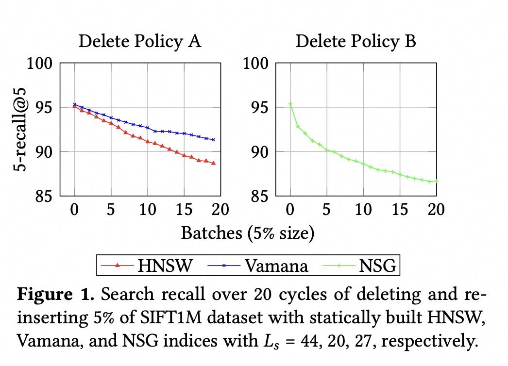
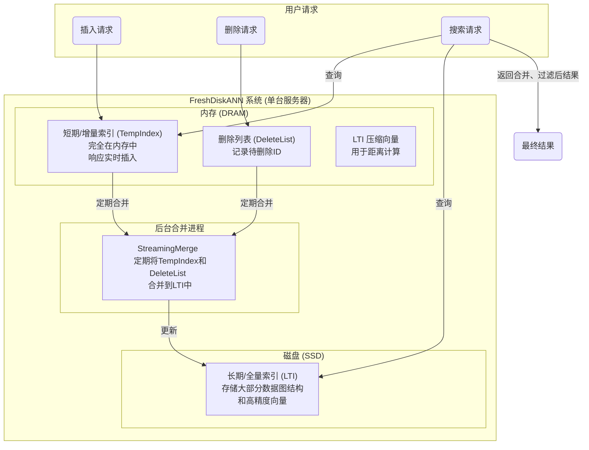
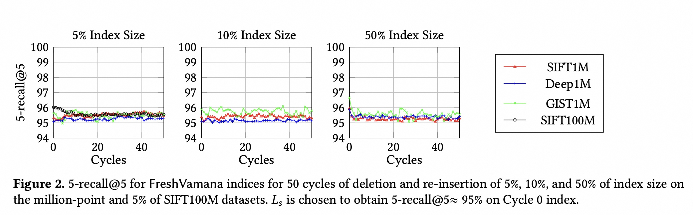
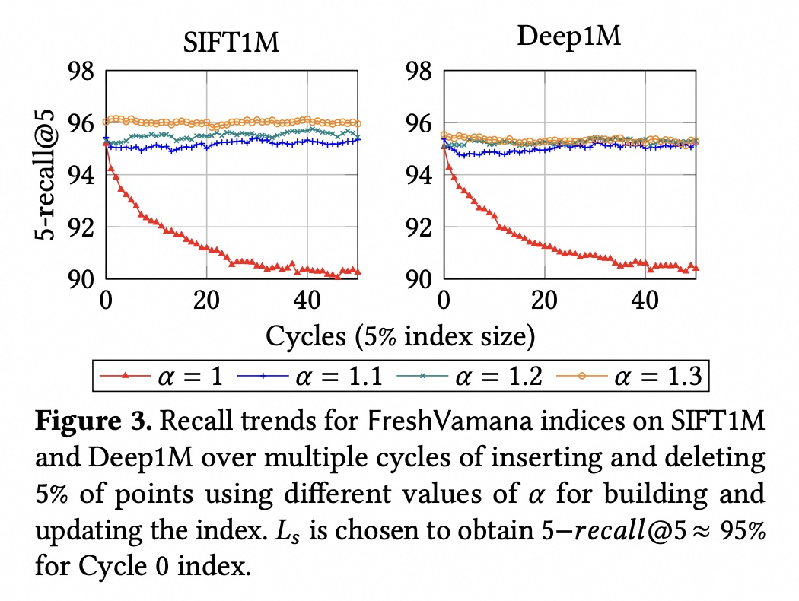
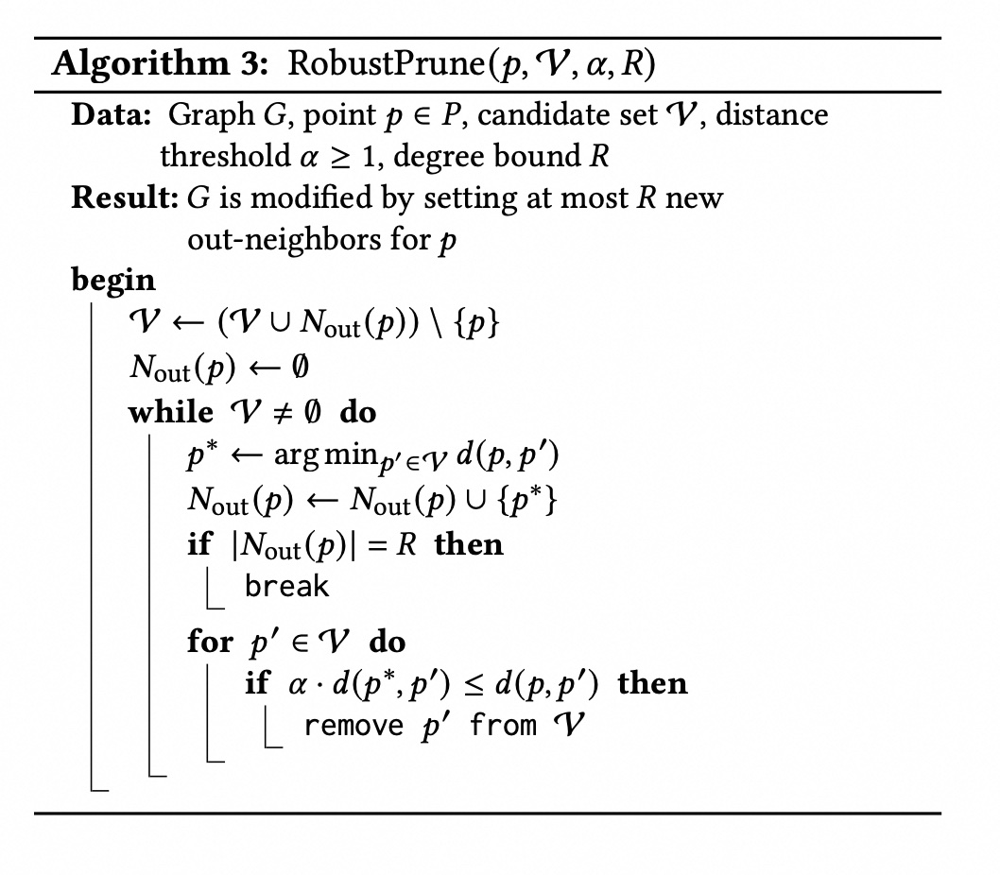
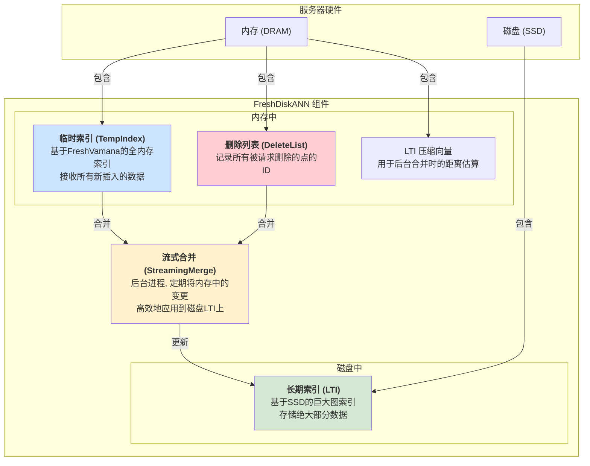

## AI论文解读 | FreshDiskANN: A Fast and Accurate Graph-Based ANN Index for Streaming Similarity Search
        
### 作者        
digoal        
        
### 日期        
2025-07-01       
        
### 标签        
PostgreSQL , PolarDB , DuckDB , AI , 论文解读        
        
----        
        
## 背景  
      
https://arxiv.org/pdf/2105.09613        
  
      
提示:        
```        
读懂《FreshDiskANN: A Fast and Accurate Graph-Based ANN Index for Streaming Similarity Search》这篇论文需要提前掌握哪些基础知识, 请使用中文给我讲一下这些基础知识, 尽量通熟易懂, 可以使用markdown支持的图形增加解释性.        
        
使用中文通熟易懂的解读《FreshDiskANN: A Fast and Accurate Graph-Based ANN Index for Streaming Similarity Search》这篇论文, 关键内容请深入讲解, 可以使用markdown支持的图形增加解释性.        
        
使用中文提取《FreshDiskANN: A Fast and Accurate Graph-Based ANN Index for Streaming Similarity Search》论文中一些重要的术语并详细解释, 可以使用markdown支持的图形示增加解释性.        
```        
        
## 1 前置知识 
  
当然可以！为了透彻理解《FreshDiskANN》这篇论文，你需要掌握一些关于**最近邻搜索、数据结构和系统设计**的基础知识。我会用通俗易懂的语言，结合图表来为你讲解。

-----

## 理解《FreshDiskANN》所需的基础知识

想象一下，你想开发一个“以图搜图”的系统。用户上传一张猫的图片，系统需要在海量的图片库中，快速找出和这张猫最像的几张图片。这个过程，本质上就是一个“相似性搜索”问题。

为了让计算机理解“像不像”，我们通常会用一个叫“深度学习模型”的工具，把每张图片都转换成一个由很多数字组成的“向量”（Vector）。如果两张图片很像，它们对应的向量在多维空间里的距离就越近。

于是，“找最像的图片”就变成了“**在一个高维向量空间里，找离查询向量最近的几个向量**”。这就是这篇论文要解决的核心问题。

-----

### 1\. 核心问题：最近邻搜索 (Nearest Neighbor Search)

这是所有知识的起点。

  * **精确最近邻搜索 (NNS)**: 就是要在数据集中，一丝不差地找到距离查询点最近的那个（或K个）点。最笨但最准的方法是“暴力搜索”：把查询向量和数据库里每一个向量都算一遍距离，然后排序。当数据量达到百万、十亿级别时，这种方法慢到无法接受。
  * **近似最近邻搜索 (Approximate Nearest Neighbor Search, ANNS)**: 既然精确的太慢，我们能不能找一个“八九不离十”的结果？ANNS的目标就是牺牲一点点精度，来换取成百上千倍的速度提升。它不保证找到的是“最优解”，但能保证找到的是“相当好的解”。这是目前工业界和学术界的主流方案。

> **关键概念：维度灾难 (Curse of Dimensionality)**
> 随着向量维度（比如图片特征有128个、960个）的增加，所有点之间的距离看起来都差不多远，空间变得极其稀疏。这使得很多传统的数据结构（比如树）失效，搜索效率急剧下降。这也是为什么ANNS如此重要的原因。

-----

### 2\. 核心评价指标 (How to Judge an ANNS Algorithm)

论文里会用大量图表来展示算法性能，你看懂这些指标，就看懂了图表。

  * **召回率 (Recall)**: 这是衡量“准不准”的指标。比如你要找最近的5个邻居（`k=5`），你的算法也返回了5个结果。如果这5个结果中有4个是“真正”的最近邻，那么`5-recall@5`就是 `4/5 = 80%`。召回率越高，结果越准。
  * **延迟 (Latency)**: 这是衡量“快不快”的指标之一，指单次查询需要多长时间，单位通常是毫秒（ms）或微秒（µs）。延迟越低，用户体验越好。
  * **吞吐量 (Throughput)**: 也是衡量“快不快”的指标，指系统一秒钟能处理多少次查询（QPS, Queries Per Second）。吞吐量越高，系统承载能力越强。

ANNS算法的核心就是在这三者之间做权衡（Trade-off）。《FreshDiskANN》的目标就是要在保持高召回率（如95%）的同时，实现低延迟和高吞-吐量。

-----

### 3\. 主流的ANNS实现方法

论文中会对比自己的方法和现有方法的优劣，了解这些方法能帮你理解它的创新点。

#### A. 基于图的方法 (Graph-based Methods)

**这是理解本论文最重要的一块知识**，因为FreshDiskANN就是基于图的。

  * **核心思想**: 将数据集里的每个向量看作一个图上的**节点 (Node)**。如果两个节点（向量）在空间中很近，就在它们之间连一条**边 (Edge)**。这样，整个数据集就构成了一张巨大的“近邻关系图”。

  * **如何搜索**: 搜索时，从一个随机的或预设的“起始点”开始，然后沿着边“走”，每一步都走向离查询目标更近的邻居节点，直到走不动为止（当前节点的所有邻居都比自己离目标远）。这个过程就像是在一个城市地图上，不断走向离目的地更近的路口。

    ```mermaid
    graph TD
        subgraph "数据点（向量）"
            A(A)
            B(B)
            C(C)
            D(D)
            E(E)
            F(F)
        end

        subgraph "查询点"
            Q(Query)
        end

        A -- "d=5" --- B
        A -- "d=3" --- C
        C -- "d=2" --- D
        B -- "d=4" --- D
        D -- "d=1" --- E
        B -- "d=6" --- F

        style Q fill:#f9f,stroke:#333,stroke-width:2px
        style E fill:#9f9,stroke:#333,stroke-width:2px

        subgraph "搜索路径 (Greedy Search)"
            direction LR
            S(Start: A) -->|A的邻居中C最近| C
            C -->|C的邻居中D最近| D
            D -->|D的邻居中E最近| E
            E -->|无法找到更近的| End(找到E)
        end
    ```

  * **知名算法**: 论文中提到的 **HNSW**、**NSG** 和 **Vamana** 都是当前最先进的基于图的ANNS算法。你不需要知道它们的实现细节，只需要知道它们在处理**静态**数据集（即数据不发生变化）时非常快且准。

#### B. 其他方法（作为对比）

  * **基于树的方法 (Tree-based)**: 如 kd-tree。它们通过不断地切分空间来组织数据。在低维数据上效果很好，但在高维时会遭遇“维度灾难”，性能急剧下降。
  * **基于哈希的方法 (Hashing-based)**: 如 LSH (Locality Sensitive Hashing)。它的思想是设计一种特殊的哈希函数，能让相似的向量有很大概率被映射到同一个“桶”里。它的优点是更新（增删）方便，但要达到高召回率通常需要很大内存，或者查询很慢。
  * **基于量化的方法 (Quantization-based)**: 如 PQ (Product Quantization)。它的核心思想是“压缩”向量，用很短的编码来表示一个很长的向量，从而大大减少内存占用。缺点是压缩是有损的，会牺牲一部分精度，导致召回率有上限。

-----

### 4\. “Fresh”的挑战：流式数据与索引更新

这是论文要解决的另一个核心难点。

  * **静态索引 (Static Index)**: 绝大多数ANNS算法（尤其是高性能的图算法）都是为静态数据设计的。它们假设数据集是一次性给定的，然后花费很长时间（几小时甚至几天）构建一个完美的索引。一旦建成，数据就不再变化。
  * **动态/流式索引 (Dynamic/Streaming Index)**: 在真实世界中，数据是不断变化的。比如，电商网站不断有新商品上架、旧商品下架；社交网络不断有新帖子发布、旧帖子删除。索引必须能实时地**插入 (Insert)** 新数据和**删除 (Delete)** 旧数据。

**为什么图的更新很难？**
在图索引中，每个节点都可能是其他很多节点导航路径上的“中转站”。如果你粗暴地删掉一个节点，很多路径就断了，整个图的“可导航性”就会变差，导致搜索性能（召回率）下降。这正是论文Figure 1想展示的现象。    

**传统笨办法**: **周期性重建 (Periodic Rebuilding)**。比如，每隔6小时，把整个索引扔掉，用最新的全量数据重新构建一个。这种方法非常消耗计算资源，而且有延迟（最新的数据要等6小时才能被搜到）。

《FreshDiskANN》的第一个主要贡献（**FreshVamana**）就是设计了一套巧妙的图更新算法，可以在不降低搜索性能的前提下，高效地处理插入和删除。

-----

### 5\. “Disk”的挑战：内存与外存的平衡

这是论文要解决的第三个核心难点，也是“ANN”走向“DiskANN”的关键。

  * **内存 (RAM)**: 速度极快，但容量小、价格贵。把所有数据和索引都放内存里，性能最好，但处理十亿级别的数据集需要几百GB甚至TB的内存，成本太高。
  * **外存 (SSD)**: 速度比内存慢很多，但容量大、价格便宜。

**挑战**: 如何在只有有限内存（如128GB）的单台普通服务器上，处理远超内存容量（如1TB）的数据集？

答案是 **混合存储**。

  * 把**绝大部分、不常变动**的“长期”数据和图索引放在 **SSD** 上。
  * 把**最新、频繁变动**的“短期”数据放在**内存**里。

《FreshDiskANN》的第二个主要贡献（**StreamingMerge**）就是设计了一套高效的合并流程，能定期、在后台将内存中的新数据和删除标记，“合并”到SSD上的大索引中，整个过程对用户的查询影响很小，并且非常节省资源。

-----

### 总结一下你需要掌握的知识点：

1.  **目标问题**: 知道什么是近似最近邻搜索（ANNS），以及为什么需要它（维度灾难）。
2.  **评价标准**: 理解召回率（Recall）、延迟（Latency）和吞吐量（QPS）的含义。
3.  **主流技术**:
      * **重点**: 深入理解**基于图的ANNS方法**的基本原理（节点、边、贪心搜索）。
      * **了解**: 知道哈希、树、量化等其他方法的优缺点，以理解论文的对比。
4.  **核心挑战**:
      * **“Fresh”**: 理解**静态索引**和**动态索引**的区别，以及为什么在图上做增删操作很困难。
      * **“Disk”**: 理解**内存**和**SSD**的性能差异，以及为什么处理大规模数据需要将索引放在外存上。

掌握了这些，你就可以轻松地看懂论文的**动机（Motivation）**、**挑战（Challenges）和贡献（Contributions）**，从而理解它提出的 FreshVamana、StreamingMerge 等设计的精妙之处。祝你阅读顺利！
  
## 2 解读论文 
  
好的，我们来一起深入解读《FreshDiskANN》这篇重要的论文。我会用尽可能通俗的语言，结合图表，为您剖析它的核心思想与创新之处。

-----

### **论文标题解读**

**《FreshDiskANN: A Fast and Accurate Graph-Based ANN Index for Streaming Similarity Search》**

  * **Fresh**: 核心词，意为“新鲜”。指的是数据可以实时更新，保证搜索结果永远是基于最新数据的。
  * **DiskANN**: 它的“姓”，表明它源于或基于 [DiskANN](https://www.google.com/search?q=https://proceedings.neurips.cc/paper/2019/hash/571c1de71c34ec16fe9589d3635398DE-Abstract.html) 这项技术，即能够在磁盘（SSD）上运行的近似最近邻（ANN）搜索。
  * **Fast and Accurate**: 它的目标，即要“又快又准”。
  * **Graph-Based ANN Index**: 它的“名”，表明其技术路线是基于图结构的近似最近邻（ANN）索引。
  * **Streaming Similarity Search**: 它要解决的问题场景，即在数据流（不断有增删）的环境下进行相似性搜索。

一言以蔽之，这篇论文提出了一种**能在普通服务器（有限内存+SSD）上，对动态更新的、十亿级别的数据集，进行又快又准的相似性搜索的图索引技术**。

-----

### **一、 问题背景：传统方法的“新鲜”困境**

想象一个大型电商网站，每天都有海量新商品上架、旧商品下架。当用户“拍立淘”时，系统需要在数十亿的商品库中实时地找到最相似的商品。

这个问题对传统的ANN索引技术提出了两大挑战：

1.   **“静态”的局限**：当时最先进的图索引算法（如HNSW, NSG）虽然搜索性能极好，但它们被设计为**静态索引**   。这意味着它们在构建索引后，不支持或不擅长处理数据的增删。强行删除一个节点，可能会破坏图的“导航结构”，导致搜索准确率（召回率）随着更新次数的增加而持续下降  。

2.   **“昂贵”的更新成本**：为了让数据保鲜，当时的业界普遍做法是**周期性重建 (Periodic Rebuilding)**  。例如，每隔几小时就丢弃旧索引，用最新的全量数据重新构建一个。这种方法简单粗暴，但缺点致命：

      *  **成本高昂**：重建一个十亿级的索引可能需要数台高性能服务器花费数小时  。
      * **延迟严重**：新数据需要等待下一个重建周期才能被搜到，无法做到真正的实时。

 《FreshDiskANN》的目标就是打破这种困境，用远低于重建的成本，实现索引的实时更新，同时维持高搜索性能  。

-----

### **二、 核心思想：内存“增量”与磁盘“全量”的分层架构**

 为了在有限内存的单机上处理远超内存容量的数据，并实现高效更新，FreshDiskANN设计了一套精妙的分层架构  。

  *  **长期索引 (Long-Term Index, LTI)**: 这是一个巨大、相对稳定的图索引，存储了绝大部分数据   。它的主体（邻接表和高精度向量）放在**SSD**上，只在内存中保留每个向量的压缩版本（用于快速计算近似距离）  。LTI不直接响应实时的插入和删除请求  。

  *  **临时索引 (Temporary Index, TempIndex)**: 这是一个小巧、完全存放在**内存**中的`FreshVamana`图索引   。所有**新插入**的数据点都会被实时添加到这里  。

  *  **删除列表 (DeleteList)**: 一个记录了待删除点ID的内存列表   。当用户请求删除一个点时，系统只是将它的ID记在这个列表里，并不会立即从LTI或TempIndex中移除  。

这套架构可以用下图来理解：



**工作流程**:

  *  **插入**: 新数据点直接进入内存中的 `TempIndex`  。
  *  **删除**: 待删除点的ID被加入内存中的 `DeleteList`  。
  *  **搜索**: 系统会**同时**搜索 LTI 和所有 TempIndex，将两边的结果聚合，然后根据 `DeleteList` 过滤掉已删除的点，最后返回给用户  。
  *  **合并**: 当内存中的 `TempIndex` 增长到一定规模时，系统会在**后台**启动 `StreamingMerge` 进程，将 `TempIndex` 中的新数据和 `DeleteList` 中的删除操作，一次性、高效地应用到SSD上的LTI中  。

-----

### **三、 关键创新点详解**

#### **创新点1：可稳定更新的图算法 FreshVamana**

 为了解决图索引在更新后性能下降的问题，论文首先提出了一种新的图算法——`FreshVamana`  。

它的核心在于修改了图的**边剪枝 (Pruning)** 规则。在构建图时，为了控制每个节点的最大出度（邻居数量），需要剪掉一些“冗余”的边。

  *  **传统算法的问题**: 剪枝策略过于激进，倾向于构建稀疏的图。这在静态时效率高，但一旦有节点被删除，稀疏的图更容易“断路”，导致导航性变差  。
  *  **FreshVamana的改进**: 引入了 **α-RNG** 属性。简单来说，在决定是否要剪掉边 `(p, p'')` 时，它会看是否存在另一条路径 `(p -> p')`。只有当 `p'` 点比 `p` 点离 `p''` **“显著”近**（即 `d(p', p'') < d(p, p'') / α`，其中 α \> 1）时，才认为边 `(p, p'')` 是冗余的，可以被剪掉  。

 这个 `α > 1` 的设定，使得图保留了更多有用的长边，变得更“稠密”，鲁棒性更强。即使一些节点被删除，依然有其他备用路径可以走，从而保证了在经历大量增删后，图的搜索性能（召回率）能够保持稳定  。论文中的 Figure 2 和 Figure 3 通过实验完美证明了这一点。       

#### **创新点2：高效的后台合并机制 StreamingMerge**

 这是将内存中的变更同步到SSD的关键，也是整个系统能持续运行的核心。它必须在有限内存下，以远低于重建的开销完成合并。`StreamingMerge` 通过一个巧妙的两阶段、三步骤的过程来实现  。

**假设**: LTI 中原有的数据是 `P`，内存中待插入的新数据是 `N`，待删除的ID列表是 `D`。目标是生成一个新的 LTI，其包含的数据为 `(P ∪ N) \ D`。

1.  **删除阶段 (Delete Phase)**:

      *  这个阶段处理删除操作。它以数据块的方式，流式地将LTI的图从SSD读入内存  。
      *  对于每个读入的节点 `p`，检查它的邻居是否在 `D` 中。如果有邻居被删了，就触发一个修复过程：将被删邻居的“邻居的邻居”作为新的候选，通过 `FreshVamana` 的`RobustPrune`算法为节点 `p` 重新选择邻居  。
      * 修改后的数据块被写回SSD，形成一个只包含 `P \ D` 的中间态LTI。

2.  **插入-修补阶段 (Insert-Patch Phase)**: 这个阶段处理插入，被巧妙地拆分为两步，以避免大量的随机磁盘写操作。

      *  **步骤一：插入 (Insert)**: 对于每一个待插入的新点 `n ∈ N`，在中间态LTI上执行一次搜索，找到它的一批候选邻居   。这一步会产生一些随机磁盘读。然后，它只构建了从 `n` 指向这些邻居的**前向边**。至于反向边（从邻居指向`n`），它并**不立即写入SSD**，而是将这个信息（“嘿，节点X，你要加一个新邻居n”）记录在一个叫 `Δ` 的内存数据结构里  。
      *  **步骤二：修补 (Patch)**: 在所有新点都处理完毕后，`Δ` 中记录了所有需要被更新的“老邻居”以及它们要添加的新邻居。此时，再次流式地将LTI从SSD读入内存，对于每个读入的节点，查询`Δ`，将需要添加的反向边合并进去，如果邻居数超了就用`RobustPrune`进行剪枝，最后将更新后的数据块写回SSD  。

**StreamingMerge的优势**:

  *  **I/O高效**: 整个过程只需要对主索引进行两次完整的顺序读写（删除和修补阶段），以及在插入阶段有一些可控的随机读  。这比完全随机的更新模式高效得多。
  * **内存可控**: 内存占用主要与**变更集的大小（|N|  和 |D|）** 成正比，而与整个索引的大小无关，因此能处理远超内存的数据  。
  *  **成本极低**: 论文指出，合并一次占索引大小7.5%的变更，所花时间仅为从头重建索引的**8.5%**  。这带来了巨大的成本节约。

-----

### **四、 实验结果与结论**

论文在十亿级别的SIFT1B数据集上进行了长达一周的严苛实验，结果令人印象深刻：

  *  **高性能**: 在维持一个8亿点索引的稳定状态下，系统可以支持**每秒1800次插入和1800次删除**，同时还能以**每秒1000次**的吞吐量进行搜索，并且召回率稳定在 **95%** 以上，平均搜索延迟低于**20毫秒**  。
  *  **低资源占用**: 整个过程在一台拥有128GB内存和3.2TB SSD的普通服务器上完成，峰值内存占用控制在125GB以内  。
  *  **高性价比**: 与传统的周期性重建方案相比，维护索引新鲜度的成本降低了**5到10倍**  。

**结论**:
《FreshDiskANN》成功地设计并实现了一个工业级的、高可用的流式ANNS系统。它通过创新的 `FreshVamana` 算法保证了图索引在持续更新下的稳定性，并通过分层架构和高效的 `StreamingMerge` 机制，解决了在有限资源下对海量动态数据进行实时、低成本索引的难题，是该领域一个里程碑式的工作。
  
## 3 术语  
  
好的，我们来从《FreshDiskANN》这篇论文中提取并详细解释一些关键术语。

-----

### **1. Fresh-ANNS (实时近似最近邻搜索)**

  *  **定义**: 这是一个由论文作者定义的问题，指的是在一个**持续变化**的数据集上进行近似最近邻搜索（ANNS）  。系统需要支持三种核心操作：(a) 插入一个新数据点，(b) 删除一个已存在的数据点，以及 (c) 对给定的查询点搜索其最近邻  。
  * **通俗解释**: 传统的ANNS处理的是静态、不变的数据集，就像一本印刷好的电话簿。而Fresh-ANNS处理的则是一个“活”的数据集，就像一个在线共享文档，随时有人添加新联系人、删除旧联系人，而你需要在任何时刻都能快速查找到正确的人。
  * **评价标准**: 一个Fresh-ANNS系统的优劣由三方面衡量：
      *  搜索的“召回率-延迟”权衡及其在数据不断变化下的稳定性  。
      *  插入和删除操作的吞吐量和延迟  。
      *  构建和维护索引所需的硬件总成本（CPU、内存、SSD） 。

### **2. k-recall@k (k-召回率@k)**

  *  **定义**: 这是一个衡量ANNS算法准确度的核心指标。假设对于一个查询，数据集中**真实**的k个最近邻集合是G，而你的算法返回的k个结果集合是X，那么k-recall@k的计算公式为： $\\frac{|X \\cap G|}{k}$  。
  *  **通俗解释**: 比如你要找最相似的5张图片（k=5），算法也给你返回了5张。如果这5张结果里，有4张确实是“标准答案”里最相似的5张之一，那么这次查询的 `5-recall@5` 就是 `4/5 = 80%`。这个值越高，说明算法找得越准。论文中的实验通常以达到95%的5-recall@5为目标  。

### **3. α-RNG (α-相对邻近图) 属性**

  *  **定义**: 这是 `FreshVamana` 算法用于构建和维护图结构的核心属性，也是保证图在更新后依然稳健的关键。在剪枝时，一条边 `(p, p'')` 只有在存在另一条边 `(p, p')`，并且 `p'` 到 `p''` 的距离比 `p` 到 `p''` 的距离**显著缩短**时才会被移除   。这个“显著缩短”由公式 $d(p', p'') \< \\frac{d(p, p'')}{\\alpha}$ 定义，其中 `α` 是一个大于1的参数  。
  * **通俗解释**: 想象你在规划从家 `p` 到公司 `p''` 的路线。现在有一条直达路线（边 `(p, p'')`）。如果有人告诉你，有一条经过邻居家 `p'` 的中转路线（路径 `p -> p'`），你只有在这条中转路线的第二段（`p'` 到 `p''`）**明显比**你的整个直达路线短很多（短 `α` 倍）时，你才会觉得原来的直达路线 `(p, p'')` 是“绕远”的、可以被忽略。
  *  **作用**: 设置 `α > 1` 会让图保留更多有用的“长连接”，使得图结构更加鲁棒和稠密   。即使某些节点被删除，搜索时依然有备用路径可选，从而保证了召回率在持续的增删下保持稳定  。

### **4. FreshVamana**

  *  **定义**: 论文提出的第一个能够支持插入和删除操作，并在大量更新后保持性能稳定的图索引算法  。它使用 `α-RNG` 属性来维护图的质量。
  * **核心操作**:
      *  **插入 (Insert)**: 为新节点搜索近邻，并使用基于`α-RNG`的`RobustPrune`算法（算法3）来建立双向连接  。      
      *  **删除 (Delete)**: 采用“懒删除”策略，先将被删除点记录在`DeleteList`中，在搜索时过滤掉它们   。然后在一个被称为“删除合并”的批处理过程中，使用`RobustPrune`修复受影响节点的邻居关系  。

### **5. FreshDiskANN 系统架构**

这是一个分层的系统设计，旨在用有限的内存处理海量的磁盘数据。



  *  **长期索引 (Long-Term Index, LTI)**: 一个存放在SSD上的巨大索引，包含了大部分数据   。它在内存中只保留每个数据点的一个小的压缩表示（约25-32字节），用于快速计算近似距离   。它不直接响应实时的增删请求  。

  *  **临时索引 (Temporary Index, TempIndex)**: 一个或多个完全存放在内存中的 `FreshVamana` 实例   。所有新插入的数据都会被实时加入其中   。它的存在保证了新数据的插入延迟极低（毫秒级） 。

  *  **流式合并 (StreamingMerge)**: 这是整个系统的“后台管家”。当内存中的TempIndex变得太大时，它会被触发，负责将TempIndex中的新数据和DeleteList中的删除操作，高效地合并到SSD上的LTI中   。这个过程被精心设计，以最小化对SSD的写操作和对前台搜索性能的影响   。它包含三个主要阶段：删除(Delete)、插入(Insert)和修补(Patch)  。

通过这套架构，FreshDiskANN巧妙地将实时、高频的写操作限制在小而快的内存索引中，而将大而慢的磁盘索引的更新操作转化为低频、高效的后台批处理任务，从而实现了高性能的流式相似性搜索。
  
## 参考        
         
https://arxiv.org/pdf/2105.09613  
        
        
<b> 以上内容基于DeepSeek、Qwen、Gemini及诸多AI生成, 轻微人工调整, 感谢杭州深度求索人工智能、阿里云、Google等公司. </b>        
        
<b> AI 生成的内容请自行辨别正确性, 当然也多了些许踩坑的乐趣, 毕竟冒险是每个男人的天性.  </b>        
  
   
