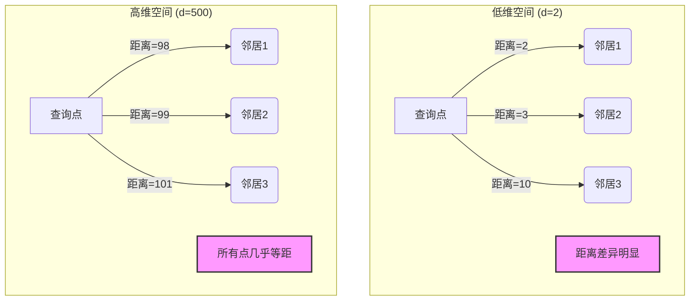
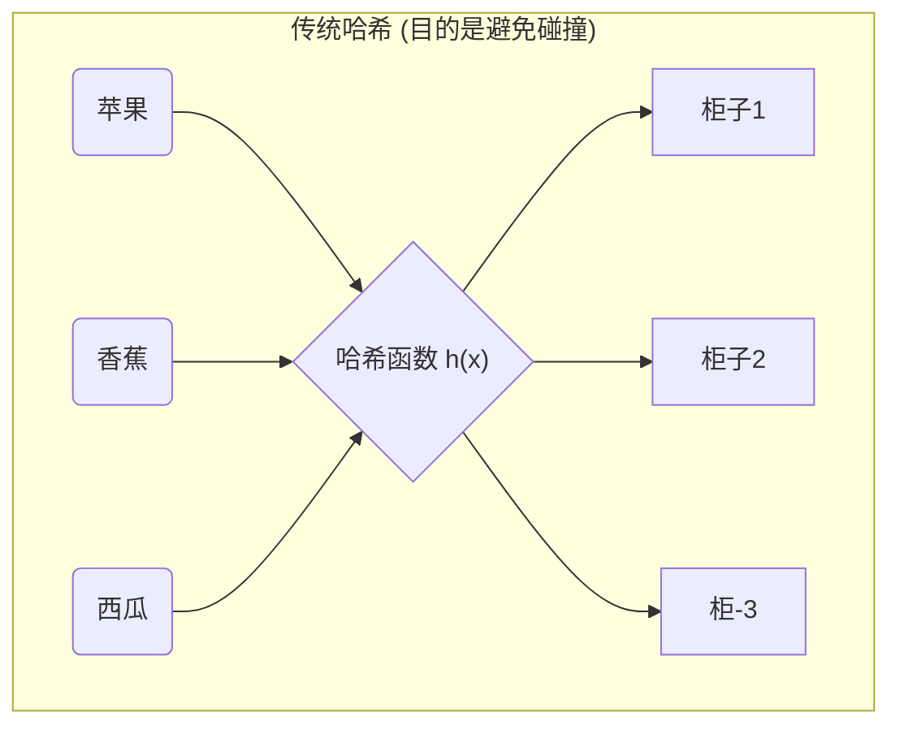
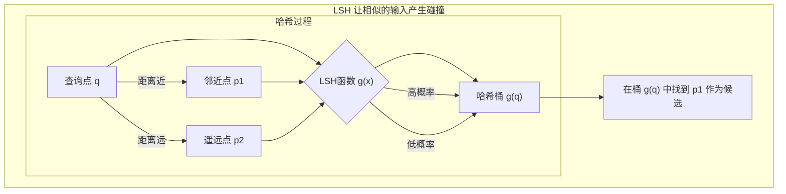
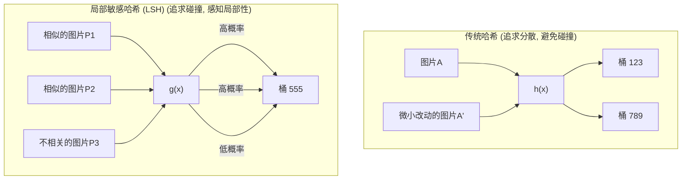
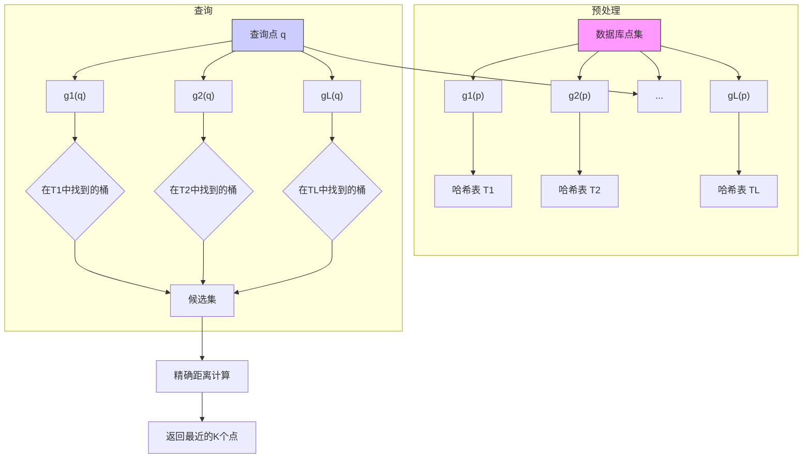

## AI论文解读 | Similarity Search in High Dimensions via Hashing
        
### 作者        
digoal        
        
### 日期        
2025-07-01       
        
### 标签        
PostgreSQL , PolarDB , DuckDB , AI , 论文解读        
        
----        
        
## 背景  
      
https://www.vldb.org/conf/1999/P49.pdf        
  
      
提示:        
```        
读懂《Similarity Search in High Dimensions via Hashing》这篇论文需要提前掌握哪些基础知识, 请使用中文给我讲一下这些基础知识, 尽量通熟易懂, 可以使用markdown支持的图形增加解释性.        
        
使用中文通熟易懂的解读《Similarity Search in High Dimensions via Hashing》这篇论文, 关键内容请深入讲解, 可以使用markdown支持的图形增加解释性.        
        
使用中文提取《Similarity Search in High Dimensions via Hashing》论文中一些重要的术语并详细解释, 可以使用markdown支持的图形示增加解释性.        
```        
        
## 1 前置知识 
  
好的，为了完全理解这篇经典的论文《Similarity Search in High Dimensions via Hashing》，你需要掌握一些来自数学和计算机科学领域的基础知识。我会用尽量通俗易懂的语言，并配合图表来为你讲解。

-----

这篇论文的核心是提出一种名为**局部敏感哈希 (Locality-Sensitive Hashing, LSH)** 的方法，来解决**高维空间**中的**近似最近邻**搜索问题。所以，我们需要理解的知识点也围绕这几个关键词展开。

### 1\. 核心问题背景

#### 1.1 相似度搜索 (Similarity Search)

这非常容易理解。想象一下“以图搜图”的功能：你上传一张图片，系统会返回数据库里和它最相似的其他图片。这就是相似度搜索。

在计算机里，无论是图片、文档还是音乐，都可以被转换成一个由很多数字组成的列表，我们称之为**向量 (Vector)**。列表里每个数字代表对象的一个特征（比如图片某个区域的颜色值）。如果一个对象有 `d` 个特征，我们就说它是一个 **d维向量**。

 相似度搜索就变成了：**给定一个查询向量，从海量向量数据中，找到和它“距离”最近的那个或那些向量。**  

#### 1.2 高维数据 (High-Dimensional Data)

 当特征数量 `d` 很小的时候（比如2维或3维），问题很简单   。但现代应用中的 `d` 往往非常大，可以达到几百甚至几千  。

  *  **图片**：一个简单的颜色直方图特征就可以有64维或更高。  
  *  **文档**：用词袋模型表示一篇文章，维度可能是几千甚至上万（每个维度代表一个词）。  

#### 1.3 维度灾难 (The Curse of Dimensionality)

 这是理解本篇论文动机的关键。当维度 `d` 急剧增高时，很多看似合理的方法都会失效，这就是“维度灾难”  。

想象一下：

  * **1维**：在一个线段上找最近点，很简单。
  * **2维**：在一个正方形里找最近点，也还行，可以画个圈慢慢扩大。
  * **3维**：在立方体里找，也还能想象。

但是，到了几百维呢？高维空间的行为和我们的直觉非常不一样：

  * **空间变得极其“空旷”**：数据点像宇宙中的星星一样，彼此之间都非常遥远。
  *  **“最近”和“最远”的邻居距离差别不大**：对于一个查询点来说，可能所有其他点到它的距离都差不多远，这让“最近邻”这个概念本身都变得模糊了  。
  *  **传统方法失效**：像k-d树这类基于空间划分的数据结构，在高维下性能会急剧退化到和暴力搜索（一个一个比）差不多  。




 **小结**：由于“维度灾难”，在高维空间里进行**精确**的最近邻搜索非常非常慢。这促使科学家们思考：我们能不能退而求其次，找一个**差不多近（近似）** 的邻居，但速度要快得多？  

-----

### 2\. 数学基础

#### 2.1 向量空间与范数 (Vector Spaces & Norms)

你需要知道数据点是如何在数学上被表示的。

  *  **向量空间**：所有d维向量存在的抽象空间，论文中用 $\\mathfrak{R}^{d}$ 表示。  
  * **范数 (Norm)**：就是衡量向量“长度”或两向量间“距离”的数学工具。论文主要提到了两种：
      * **$l\_2$ 范数 (欧几里得距离)**：就是我们最熟悉的直线距离，计算公式是 $d(p, q) = \\sqrt{\\sum\_{i=1}^{d}(p\_i - q\_i)^2}$。
      *  **$l\_1$ 范数 (曼哈顿距离)**：想象在纽约曼哈顿街区开车，你不能走斜线，只能沿着街道网格走。距离是所有坐标轴上差值的绝对值之和。计算公式是 $d(p, q) = \\sum\_{i=1}^{d}|p\_i - q\_i|$   。这篇论文主要基于 $l\_1$ 距离进行算法设计  。

#### 2.2 汉明距离 (Hamming Distance)

 这个距离是用来衡量两个等长**二进制字符串**（由0和1组成）的差异的。它就是两个字符串中，对应位置上字符不同的个数  。

  * 例如，向量 A = `10110` 和向量 B = `11010`。
  * 它们在第2位和第3位不同。
  * 所以，它们的汉明距离是2。

 论文中一个巧妙的技巧，就是把 $l\_1$ 距离的问题转换到汉明距离的空间去解决  。

-----

### 3\. 计算机科学基础

#### 3.1 算法复杂度 (Big-O Notation)

你需要对算法效率的衡量方式有所了解，即大O表示法。它描述了算法的运行时间或空间使用随输入数据规模 `n` 增长的趋势。

  *  $O(n)$：**线性时间**。意味着数据量增大一倍，耗时也约增大一倍。暴力搜索就是 $O(n)$。  
  * $O(\\log n)$：**对数时间**。非常快，数据量翻倍，耗时仅增加一个常数。
  *  论文的目标是达到**亚线性 (sub-linear)** 时间，比如 $O(n^{1/(1+\\epsilon)})$  ，这比线性时间快得多。

#### 3.2 哈希 (Hashing)

这是论文方法的核心，所以至关重要。

**传统哈希**：可以想象成一个储物柜系统。你有一个物品（数据），一个哈希函数会告诉你该把它存到哪个柜子里（桶，bucket）。

  * **目的**：让数据分布得尽可能**均匀**，**避免**不同的物品被分到同一个柜子（这叫“碰撞”，Collision）。
  * **用途**：快速查找（比如字典、数据库索引）。




-----

### 4\. 论文核心思想：局部敏感哈希 (LSH)

掌握了以上知识后，就可以来理解论文的精髓LSH了。

LSH是一种**特殊**的哈希，它的理念和传统哈希**正好相反**：

  * **传统哈希**：想让相似的输入也尽可能分开，避免碰撞。
  *  **LSH**：**希望**相似的输入能以**高概率**分到**同一个**柜子里（产生碰撞），而不相似的输入则以高概率分到不同的柜子里  。

**核心思想**：
如果两个点距离很近，它们经过LSH函数计算后，得到相同哈希值的概率就很高。如果距离很远，概率就很低。

**类比**：可以把LSH函数想象成一个“眼神不太好”的管理员。

  * 两个长得很像的人（距离近），管理员很大概率会把他们认成同一个人，分到同一个档案柜。
  * 一个张三，一个李四（距离远），管理员基本不会认错，会把他们分到不同的档案柜。

**算法流程**：

1.  **预处理**：
      *  准备很多组不同的LSH哈希函数（相当于雇佣了很多个“眼神不好”的管理员） 。
      *  用每一组哈希函数，都对数据库里所有的点进行一次哈希，建立多个哈希表（相当于每个管理员都有一套自己的档案柜系统） 。
2.  **查询**：
      * 当一个查询点 `q` 来了以后，用同样的那些哈希函数组计算它的哈希值。
      *  直接去对应的哈希桶（档案柜）里查看有哪些数据点  。
      * 因为LSH的特性，这些桶里的点有很大概率是和 `q` 很近的点。
      *  我们只需要在这些被“圈出来”的少量候选点中进行精确的距离计算，就能找到近似的最近邻  。




通过这种方式，LSH避免了对整个数据集进行扫描，从而实现了亚线性的查询时间，有效地绕开了“维度灾难”的诅咒。

### 总结

要读懂这篇论文，你需要提前理解：

1.  **问题**：什么是高维空间中的相似度搜索，以及它为何因“维度灾难”而变得困难。
2.  **数学**：向量、范数（特别是 $l\_1$ 和 $l\_2$ 距离）和汉明距离是什么。
3.  **计科**：哈希和哈希表的基本原理，以及衡量算法效率的Big-O表示法。

有了这些基础，你就能轻松理解论文是如何定义LSH，并巧妙地利用“让相似者碰撞”这一特性来设计出高效的近似最近邻搜索算法的。
  
## 2 解读论文 
  
好的，我们来一起深入解读这篇开创性的论文——《Similarity Search in High Dimensions via Hashing》。这篇论文由 Gionis、Indyk 和 Motwani 在1999年发表，它提出的**局部敏感哈希（Locality-Sensitive Hashing, LSH）** 算法，至今仍是解决高维数据搜索问题的基石之一。

### 一、论文要解决的核心问题：高维空间的“诅咒”

首先，我们需要理解论文试图解决的困境是什么。

想象一下，你要做一个“以图搜图”的系统。你需要将每张图片转换成一个**高维向量**（例如，一个包含64个数字的颜色特征向量），然后当用户上传一张新图片（查询向量）时，你要在数百万的图片库中找到和它最“像”的图片。

在数学上，这个“像”是通过计算向量间的**距离**来度量的。距离越近，就越相似。这个任务被称为**最近邻搜索（Nearest Neighbor Search, NNS）**。

  * **低维很简单**：如果数据只有2维或3维，我们可以用一些高效的数据结构（如k-d树、R树）来快速找到最近邻，就像在地图上找最近的餐馆一样。
  *  **高维是场灾难**：当维度急剧增加到几十甚至几百维时，所有这些传统方法都会失效   。它们的性能会衰退到和**线性扫描**（即把数据库里的每个点都比一遍）一样慢   。这就是著名的 **“维度灾难”（Curse of Dimensionality）**  。

> **维度灾难的通俗理解**：
> 随着维度的增加，数据点会变得极其稀疏，任意两点之间的距离都倾向于变得很远且相差无几。这就好比在偌大的太空中，任何两颗星星对你来说都“远在天边”，让你很难判断哪一颗才是“最近”的。传统的基于空间划分的方法（像切蛋糕一样把空间切成小块）在高维下需要切分天文数字般的次数才能区分出数据点，因此完全失效。

### 二、核心思想的转变：从“精确”到“近似”

 面对维度灾难，这篇论文的作者们提出了一个关键的思想转变：既然找**绝对精确**的最近邻这么困难，我们能不能退一步，找一个**差不多近（Approximate）** 的就行了？ 

 对于很多应用场景，这种近似是完全可以接受的   。比如在搜图时，返回一张“非常像”的图片和“最像”的图片，用户的体验可能没什么差别   。这个小小的妥协，却能换来性能上数量级的提升  。

 论文将这个问题定义为 **(1+ε)-最近邻搜索**：给定一个查询点 `q`，只要能返回一个点 `p`，使得 `p` 到 `q` 的距离不大于真实最近邻距离的 `(1+ε)` 倍即可  。这里的 `ε` (epsilon) 是一个我们可以控制的小误差。

### 三、革命性方法：局部敏感哈希 (LSH)

 为了高效地找到近似最近邻，论文提出了一种全新的、基于哈希的方法，这就是**局部敏感哈希（Locality-Sensitive Hashing, LSH）**  。

#### 1\. LSH 与传统哈希的根本区别

理解LSH的关键在于明白它和我们熟知的传统哈希（如用于`HashMap`或`MD5`）有何不同。

  * **传统哈希**：核心目标是**避免碰撞**。它希望即使输入有微小的变化（比如两个字符串只差一个字母），输出的哈希值也要有天壤之别，从而让数据均匀地散布在哈希表中。
  *  **LSH**：核心目标是**让相似的输入大概率碰撞**。它是一种特殊的哈希函数，能够“感知”数据点之间的距离  。
      * 如果两个点在原始空间中**距离很近**，它们经过同一个LSH函数计算后，得到相同哈希值的**概率就很高**。
      * 如果两个点**距离很远**，它们碰撞的**概率就很低**。




#### 2\. LSH算法的详细流程

LSH算法分为**预处理**和**查询**两个阶段。

**A. 预处理阶段：建立索引**

我们不能只依赖一个LSH函数，因为它的“感知能力”是概率性的。为了提高准确率，算法会构建多个哈希表。

1.   **选择LSH族**：首先，定义一个LSH函数的“家族”`H`。这个家族里的每个函数都能实现上述的“局部敏感”特性  。
2.   **构建复杂哈希函数**：从`H`中随机抽取 `k` 个函数 (如 $h\_1, h\_2, ..., h\_k$)，将它们组合成一个新的、更强的哈希函数 $g(p) = (h\_1(p), h\_2(p), ..., h\_k(p))$  。这个 `g(p)` 的输出就是一个由 `k` 个哈希值组成的元组，可以看作是数据点 `p` 的一个“指纹”。两个点只有在这 `k` 个哈希值上全部相等，它们的 `g` 值才会碰撞，这大大降低了远处点碰撞的概率。
3.   **构建多个哈希表**：重复步骤2，创建 `l` 个不同的、独立的哈希函数 ($g\_1, g\_2, ..., g\_l$)   。然后，为每一个 $g\_i$ 函数都建立一个单独的哈希表 $\\mathcal{T}\_i$   。将数据库中所有的点，都分别通过这 `l` 个函数计算哈希值，并放入 `l` 个哈希表中对应的桶里  。

这个过程相当于从不同角度、用不同的“指纹”为所有数据点建立了 `l` 套独立的索引。

**B. 查询阶段：寻找候选者**

当一个查询点 `q` 到来时：

1.  **计算查询指纹**：使用预处理阶段的 `l` 个哈希函数($g\_1, ..., g\_l$)，计算出 `q` 的 `l` 个“指纹”： $g\_1(q), g\_2(q), ..., g\_l(q)$。
2.   **提取候选集**：对于每一个哈希表 $\\mathcal{T}\_i$，找到 $g\_i(q)$ 对应的桶，并将桶中所有的点都取出来  。
3.  **合并与筛选**：将从 `l` 个桶中取出的所有点汇总成一个候选集。
4.   **最终排序**：由于候选集的规模远小于整个数据库，我们现在可以对这个小集合里的点进行精确的距离计算，然后返回距离 `q` 最近的K个点作为近似查询的结果  。




### 四、LSH的具体实现：从 $l\_1$ 距离到汉明距离

论文给出了一个非常巧妙的具体实现，用于处理在数据库和信息检索领域常见的 **$l\_1$ 距离**。

1.   **嵌入到汉明空间**：算法首先将原始的 $d$ 维整数向量空间 ($l\_1^d$) 嵌入到一个更高维度的二进制**汉明空间** ($H^{d'}$)  。

      * 假设原始向量的所有坐标都是 `0` 到 `C` 之间的整数。
      *  每个整数坐标 `x` 被转换成一个长度为 `C` 的二进制串：前面是 `x` 个 `1`，后面是 `C-x` 个 `0`（这被称为一元编码 `Unary_C(x)`） 。
      * 一个 `d` 维的原始向量就被转换成了一个 $d' = d \\times C$ 维的二进制向量。

2.   **距离保持**：这个嵌入最神奇的地方在于它**保持了距离**。原始空间中两个向量的 $l\_1$ 距离，正好等于它们在新空间中的**汉明距离**（即二进制位不同的个数） 。

3.   **为汉明空间设计LSH**：为汉明距离设计LSH函数就非常简单了。最简单的LSH函数就是：**随机选择一个坐标，并返回该坐标上的比特值（0或1）**  。

      * 如果两个二进制向量 `p` 和 `q` 的汉明距离为 `d_H(p,q)`，那么随机选一个坐标，它们在该坐标上比特值相同的概率是 $1 - d\_H(p,q)/d'$。
      * 显然，`p` 和 `q` 越近（汉明距离越小），它们在随机坐标上碰撞的概率就越高。这完全符合LSH的定义。

因此，前面提到的复杂哈希函数 $g(p)$，在这个具体实现中就变成了：**从 $d'$ 维的二进制向量中随机挑选 `k` 个比特位，把这 `k` 个比特值拼起来作为哈希“指纹”**。

### 五、性能与结论

  *  **理论性能**：论文从理论上证明了，通过合理选择参数 `k` 和 `l`，LSH算法可以在亚线性时间，即 $O(dn^{1/(1+\\epsilon)})$ 的时间内，以高概率找到近似最近邻  。
  *  **实验效果**：实验结果非常惊人。在包含27万个60维向量的大型数据集上，SR-树（一种优化的树结构）平均每次查询需要访问**1310**个磁盘块，而LSH在达到15%的平均误差时，仅需要访问不到**100**个磁盘块，性能提升了一到两个数量级   。随着数据量和维度的增加，LSH的优势愈发明显  。
  * **论文贡献**：
      *  提出了一种全新的、基于哈希的近似相似度搜索方案，有效克服了维度灾难  。
      *  给出了具体的LSH函数族和算法实现，并提供了理论和实验的双重验证  。
      *  其可扩展性和高效性为大规模、高维数据（如图像、文档、基因数据）的实时检索系统铺平了道路  。
  
## 3 术语  
  
根据《Similarity Search in High Dimensions via Hashing》这篇论文，以下是一些重要的术语及其详细解释：

### 1. 相似性搜索 (Similarity Search)
 相似性搜索是数据库应用中常见的问题，旨在从大量数据对象中找到与给定查询对象相似（或最近）的对象。这些对象通常被表示为高维空间中的点，通过距离度量来衡量它们之间的相似性。例如，在图像数据库中，相似性搜索可以用于查找与给定图片在视觉内容上相似的其他图片  。

### 2. 高维数据 (High-Dimensional Data)
 高维数据指的是具有大量特征或属性的数据集合。在这样的数据集中，每个对象都被表示为一个高维空间中的点。例如，图像数据库、文档集合、时间序列数据库和基因组数据库都包含高维数据  。随着特征数量的增加，数据的维度也随之增加，这给传统的搜索和索引方法带来了挑战。

### 3. 维度灾难 (Curse of Dimensionality)
 “维度灾难”是指当数据的维度（特征数量）变得非常高时，传统的数据结构和搜索算法的性能会急剧下降的现象。具体来说，当维度超过10到20时，基于k-d树或类似结构的搜索方法可能需要检查数据库中的大部分数据，其效率甚至不如暴力线性搜索。这严重阻碍了大规模相似性搜索系统的发展  。

### 4. 近似最近邻 (Approximate Nearest Neighbor)
 为了克服维度灾难，论文提出了一种近似搜索的方法。近似最近邻搜索的目标不是找到与查询点距离最近的精确邻居，而是找到一个与实际最近邻足够接近的点。在许多实际应用中，由于特征选择和距离度量的启发式性质，一个近似的答案通常就足够了，并且可以显著提高搜索速度  。

### 5. 哈希 (Hashing)
 哈希是一种将输入数据（或“键”）映射到固定大小值（通常是数字）的过程，这些值称为哈希值或哈希码。在本文中，哈希被用作执行近似相似性搜索的基础方案。其基本思想是将数据点哈希到不同的“桶”中，以确保相互接近的对象发生碰撞（即落入同一个桶中）的概率远高于相距较远的对象  。

### 6. 局部敏感哈希 (Locality-Sensitive Hashing, LSH)
 局部敏感哈希是论文中介绍的一种新颖的索引方法，用于处理高维数据中的近似最近邻搜索。LSH的核心思想是设计多组哈希函数，使得距离较近的点以高概率哈希到同一个桶中，而距离较远的点则以低概率哈希到同一个桶中。通过查询点所在桶中的元素，可以高效地找到其近似邻居。这种方法实现了真正意义上的次线性查询时间，即使对于高维数据也能保持高效  。

### 7. 最近邻搜索 (Nearest Neighbor Search, NNS)
 最近邻搜索问题定义为：给定一个在范数空间 $l_p^d$ 中表示为点的对象集合 P，对 P 进行预处理，以便能够高效地回答查询，即找到 P 中距离查询点 q 最近的点  。

### 8. K-最近邻搜索 (K-Nearest Neighbors Search, K-NNS)
 K-最近邻搜索是最近邻搜索的推广，目标是找到数据库中距离查询点 q 最近的 K 个点   。在近似 K-NNS 问题中，目标是找到 K 个点 $p_1, ..., p_K$，使得每个点 $p_i$ 到查询点 q 的距离最多是第 i 个最近点到 q 距离的 $(1+\epsilon)$ 倍  。

### 9. 汉明度量空间 (Hamming Metric Space)
 汉明度量空间 $H^d$ 是指维度为 d 的二进制向量空间，其中两点（二进制向量）之间的距离由汉明距离定义。汉明距离是两个等长二进制字符串之间对应位不同的位置的数量   。论文通过将数据点转换为一元表示（unary representation）来将其嵌入到汉明立方体中，从而将 $l_1$ 范数下的距离转换为汉明距离  。

### 10. 欧几里得空间 ($l_p^d$ norm)
 欧几里得空间 $\mathfrak{R}^d$ 是一个 d 维的实数空间。在本文中，它指的是在 $l_p$ 范数下的空间，即向量 $(x_1, ..., x_d)$ 的长度定义为 $(|x_1|^p + ... + |x_d|^p)^{1/p}$。欧几里得距离是 $l_p$ 范数在 $p=2$ 时的特例。论文主要关注 $l_1$ 范数，并指出在相似性搜索中， $l_1$ 范数和 $l_2$ 范数的效果通常非常相似  。

### 11. 哈希表 (Hash Tables)
 哈希表是LSH算法中用于存储数据的核心数据结构。在预处理阶段，数据点被存储在多个哈希表中。每个哈希表都使用一个LSH函数将数据点映射到一个桶中，然后这些桶的内容再通过一个标准哈希函数映射到哈希表中。通过这种两层哈希机制，可以有效地组织和检索数据  。

### 12. 预处理 (Preprocessing)
 预处理是LSH算法的第一阶段。在这个阶段，算法会根据输入的数据集 P，创建多个哈希表 $\mathcal{T}_i$。具体来说，对于每个哈希表，都会生成一个随机的局部敏感哈希函数 $g_i(\cdot)$，然后数据集中的每个点 $p_j$ 都会被存储到哈希表 $\mathcal{T}_i$ 中由 $g_i(p_j)$ 指定的桶中。这个过程旨在构建一个索引结构，以便后续高效地进行查询  。

### 13. 查询应答 (Query Answering)
 查询应答是LSH算法的第二个阶段。给定一个查询点 q 和要查找的近似最近邻的数量 K，算法会访问预处理阶段生成的多个哈希表。对于每个哈希表 $\mathcal{T}_i$，算法会计算 $g_i(q)$ 来确定查询点 q 应该落入的桶，并检索该桶中存储的所有点。最终，从所有检索到的点中，通过内存线性搜索找到距离 q 最近的 K 个点作为近似最近邻返回  。

请注意，本解释未能提供图形示例，因为我无法生成 markdown 支持的图形。
  
## 参考        
         
https://www.vldb.org/conf/1999/P49.pdf  
        
        
<b> 以上内容基于DeepSeek、Qwen、Gemini及诸多AI生成, 轻微人工调整, 感谢杭州深度求索人工智能、阿里云、Google等公司. </b>        
        
<b> AI 生成的内容请自行辨别正确性, 当然也多了些许踩坑的乐趣, 毕竟冒险是每个男人的天性.  </b>        
  
   
  
