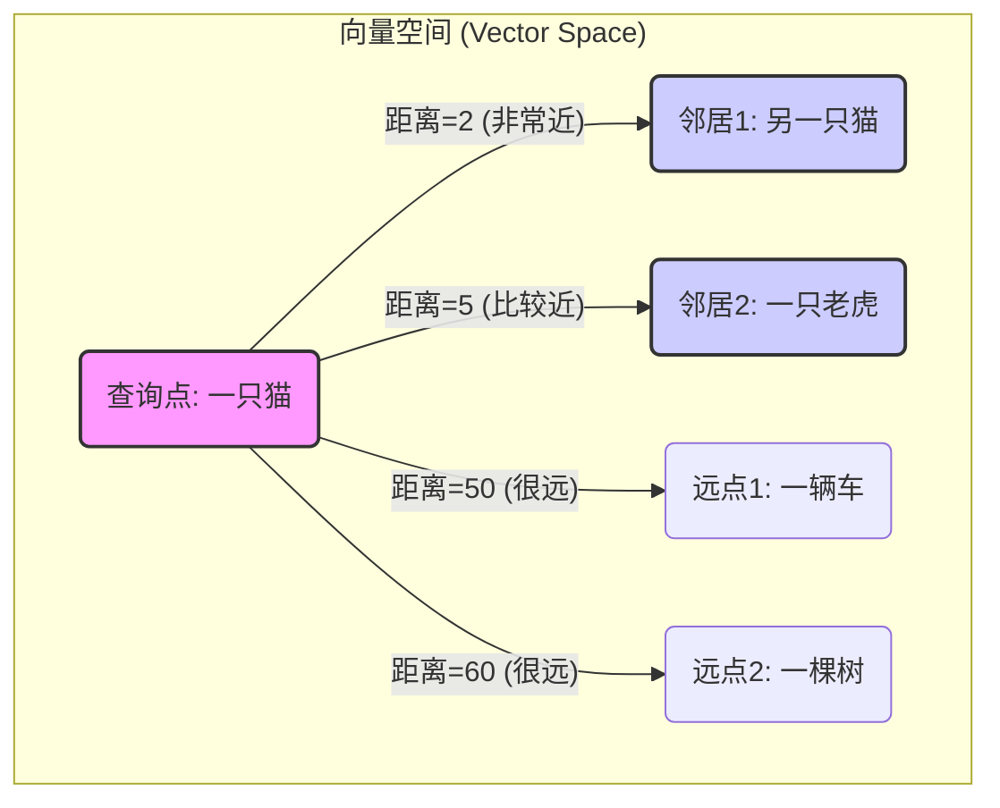
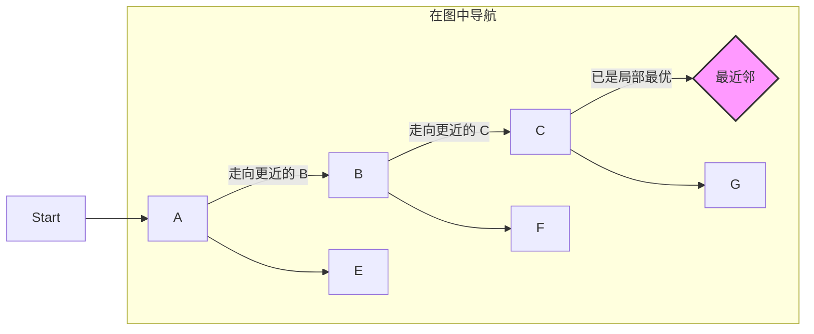
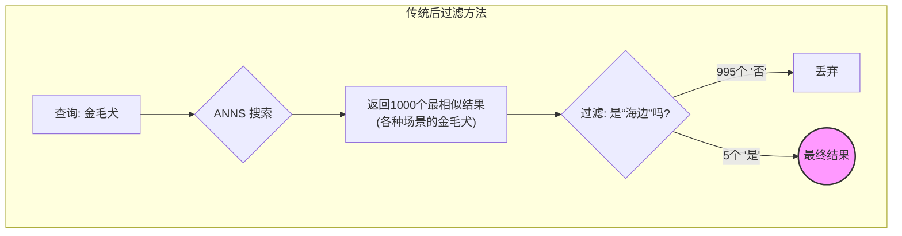
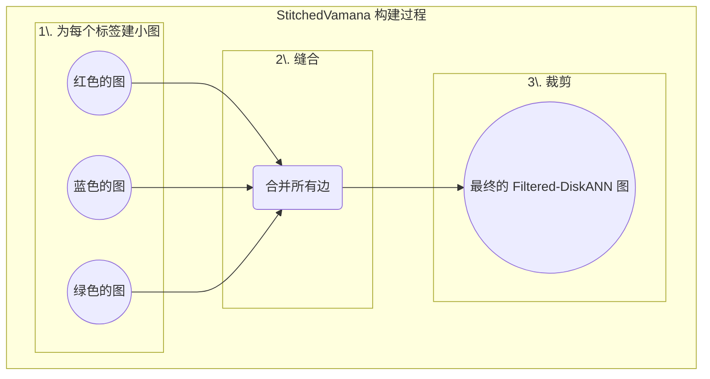
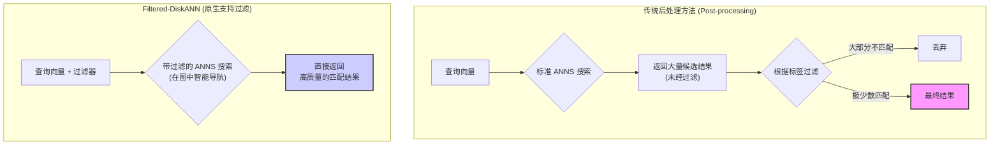

## AI论文解读 | Filtered − DiskANN: Graph Algorithms for Approximate Nearest Neighbor Search with Filters
        
### 作者        
digoal        
        
### 日期        
2025-07-02       
        
### 标签        
PostgreSQL , PolarDB , DuckDB , AI , 论文解读        
        
----        
        
## 背景  
      
https://harsha-simhadri.org/pubs/Filtered-DiskANN23.pdf        
  
      
提示:        
```        
读懂《Filtered − DiskANN: Graph Algorithms for Approximate Nearest Neighbor Search with Filters》这篇论文需要提前掌握哪些基础知识, 请使用中文给我讲一下这些基础知识, 尽量通熟易懂, 可以使用markdown支持的图形增加解释性.        
        
使用中文通熟易懂的解读《Filtered − DiskANN: Graph Algorithms for Approximate Nearest Neighbor Search with Filters》这篇论文, 关键内容请深入讲解, 可以使用markdown支持的图形增加解释性.        
        
使用中文提取《Filtered − DiskANN: Graph Algorithms for Approximate Nearest Neighbor Search with Filters》论文中一些重要的术语并详细解释, 可以使用markdown支持的图形示增加解释性.        
```        
        
## 1 前置知识 
  
好的，为了完全理解《Filtered-DiskANN》这篇论文，你需要先掌握一些基础概念。我会用通俗易懂的方式，并配合图表来解释这些知识点。

-----

### 1\. 核心概念：向量、向量空间与相似性搜索

想象一下，我们想让计算机理解图片、文字或者商品。一种常见的方法是把这些复杂的东西转换成一串数字，这串数字就叫做 **向量 (Vector)** 或者 **嵌入 (Embedding)**。

  * **向量 (Vector)**: 一串用来描述某个对象的有序数字列表。例如，一个用户可能被表示为 `[0.2, 0.8, -0.1, ...]`，这串数字捕捉了该用户的兴趣特征。
  * **向量空间 (Vector Space)**: 所有这些向量共同存在于一个多维度的坐标系中。在这个空间里，每个向量都是一个点。
  * **相似性 (Similarity)**: 在这个空间里，如果两个向量（点）的距离很近，我们就认为它们代表的对象很相似。比如，“国王”和“女王”的向量距离会比“国王”和“香蕉”的向量距离近得多。

**核心任务：最近邻搜索 (Nearest Neighbor Search, NNS)**
给你一个查询向量（比如，一张猫的图片转换成的向量），让你在海量的向量数据库中（比如，数百万张各种图片），找到和它距离最近的那些向量（也就是最像猫的那些图片）。



*上图中，`N1` 是 `Q` 的“最近邻”，因为它在向量空间中的距离最小。*

-----

### 2\. 现实的挑战：维度诅咒与近似最近邻 (ANNS)

当向量的维度非常高时（例如，描述一张图片可能需要几百个数字），要精确地找到最近邻，计算量会变得极其巨大，几乎等于把你的查询向量和数据库里的每一个向量都比较一遍。这对于需要实时响应的系统（如搜索引擎）来说是不可接受的。

这就是 **近似最近邻搜索 (Approximate Nearest Neighbor Search, ANNS)** 发挥作用的地方。ANNS 的目标是：**牺牲一点点精度，换取巨大的速度提升**。它不保证找到100%准确的最近邻，但能以极快的速度找到一个“足够好”的近似结果。

  * **关键指标：召回率 (Recall)**
    这是衡量ANNS算法好坏的核心标准。比如 `Recall@10 = 95%` 的意思是，在查找最近的10个邻居时，算法返回的结果中有95%是真正的最近邻。这篇论文追求的就是在极高的查询速度下，实现90%以上的召回率。

-----

### 3\. 主流解决方法：基于图的ANNS算法

这是目前最高效、最流行的ANNS方法之一，也是理解这篇论文的基石。

  * **基本思想**: 将数据库中所有的向量点构建成一个网络图（Graph）。图中的每个 **节点 (Node)** 就是一个向量，如果两个向量在空间中距离很近，就在它们之间连接一条 **边 (Edge)**。

  * **搜索方式：贪心导航 (Greedy Search)**
    当一个查询请求到来时，我们不需要遍历所有点。而是：

    1.  从图中的某个“入口点”开始。
    2.  计算当前点所有“邻居”（通过边连接的点）与查询点的距离。
    3.  移动到距离查询点最近的那个邻居节点。
    4.  重复第2步和第3步，就像在图中“跳跃”一样，不断向查询点逼近，直到找不到更近的邻居为止。




*这种导航方式避免了全局搜索，大大提高了效率。Vamana算法（论文中提到）就是一种构建这种高效导航图的先进技术。*

-----

### 4\. 论文的核心创新：带“过滤条件”的ANNS

这是理解 `Filtered-DiskANN` 的**最关键**的知识点。在真实世界的应用中，搜索往往不只看相似度，还要满足特定条件。

**举个例子**：在电商网站搜索“红色T恤”。

  * “T恤” 是 **向量相似性** 查询 (query)。
  * “红色” 是 **过滤条件 (filter)** 或 **标签 (label)**。

你只希望在所有“红色”的商品中，寻找和“T恤”最相似的那些。

**传统方法的困境**:

1.  **先搜索，后过滤 (Post-processing)**: 先用ANNS找出最像“T恤”的100件商品，然后逐一检查它们是不是“红色”。如果红色T恤很少，你可能找了100件，没有一件是红色的，导致结果为空或质量很差。
2.  **为每个标签建一个索引 (Pre-processing)**: 为“红色”商品建一个ANNS图，为“蓝色”商品建一个，为“绿色”再建一个... 如果标签很多（成千上万个品牌、颜色、材质），或者一个商品有多个标签（如“耐克”的“红色”“纯棉”T恤），这种方法会造成巨大的存储和维护成本。

**Filtered-DiskANN 的贡献**:
这篇论文提出的算法 (`FilteredVamana` 和 `StitchedVamana`) 的核心思想是，**在构建那张导航图的时候，就把“标签信息”考虑进去**。

它创建的边，不仅连接几何上相近的点，还会优先连接那些 **拥有共同标签且相近的点**。这样，在图上进行贪心导航时，算法就能自然而然地走向那些既满足过滤条件（如“红色”）又与查询目标相似（如“T恤”）的邻居。这使得即使在过滤条件非常严苛（满足条件的点非常少）的情况下，也能高效地找到高质量的结果。

### 总结 (Summary)

要读懂这篇论文，你需要理解：

1.  **向量与相似性搜索**: 现实世界的东西可以变成数字向量，通过计算距离来判断相似性。
2.  **ANNS**: 为了速度，我们通常寻找“近似”而非“精确”的最近邻。
3.  **基于图的ANNS**: 通过在预先构建好的关系图上进行“贪心导航”，实现快速搜索。
4.  **过滤搜索**: 真实世界的搜索需要同时满足“相似”和“指定标签”两个条件，而 `Filtered-DiskANN` 通过构建一个同时理解几何和标签的“智能图结构”，完美地解决了这个问题。
  
## 2 解读论文 
  
好的，我们来一起深入解读这篇非常实用的论文《Filtered-DiskANN: Graph Algorithms for Approximate Nearest Neighbor Search with Filters》。

### 论文精读：《Filtered-DiskANN》—— 让向量搜索带上高效“滤镜”

想象一个场景：你想在巨大的图片库中搜索一张“傍晚时分在海边的金毛犬”的图片。

  * **向量搜索 (ANNS)** 负责找到与“金毛犬”最相似的图片。
  * **过滤 (Filter)** 负责筛选出那些标签为“傍晚”和“海边”的图片。

 如何高效地将这两者结合起来？这就是这篇论文要解决的核心问题：**带过滤条件的近似最近邻搜索 (Filtered ANNS)**  。

-----

### 一、 问题的痛点：传统方法的“笨拙”

 在 `Filtered-DiskANN` 出现之前，业界主要有两种处理过滤搜索的方法，但这两种方法都有明显的缺陷  。

#### 1\. 先搜索，后过滤 (Post-processing)

 这是最直接的方法：先忽略过滤条件，用ANNS算法找出1000张最像“金毛犬”的图片，然后再一张张检查哪些图片有“傍晚”和“海边”的标签  。

  *  **缺陷**: 效率极低，尤其当过滤条件很“稀有”时。比如，数据库里“海边的金毛犬”图片本来就很少，你可能搜了1000张，结果没有一张符合条件，导致召回率极低，或者为了找到一个符合条件的点，需要检索海量的候选项，延迟变得不可接受  。




*上图显示，大量不符合条件的搜索结果被浪费了。*

#### 2\. 先过滤，后搜索 (Pre-processing)

 为每个可能的标签或标签组合单独创建一个ANNS索引（一张独立的导航图） 。比如，为“海边”的图片建一个索引，为“城市”的图片建另一个。

  *  **缺陷**: 成本极高，不具备扩展性。当标签数量巨大（如成千上万个品类、地点），或者一个数据点有多个标签时（如一张图片同时有“狗”、“户外”、“晴天”三个标签），索引的数量和总大小会爆炸式增长，变得不切实际  。

-----

### 二、 核心思想：在构建图时就融入“过滤信息”

 这篇论文的**核心贡献**是提出了一种全新的思路：**我们不应该将搜索和过滤割裂开，而是在构建ANNS导航图的阶段，就将“几何位置”和“标签信息”同时考虑进去**  。

这样构建出的图，其连接（边）不仅指向“空间上”的近邻，更会优先指向那些**既在空间上相近，又共享相同标签**的“优质”近邻。如此一来，搜索算法在图上导航时，就能自然而然地沿着符合过滤条件的路径前进，大大提升了效率和准确性。

 论文提出了两种实现这一思想的具体算法：`FilteredVamana` 和 `StitchedVamana`  。

-----

### 三、 两大核心算法详解

#### 1\. FilteredVamana (增量构建算法)

 `FilteredVamana` 采用一种**增量式、在线**的方法构建索引，非常适合数据流式更新的场景  。

 其构建过程可以简化为以下步骤  ：

1.  **逐点加入**: 每次向图中加入一个新点 `p`。
2.   **带过滤的邻居搜索**: 为这个新点 `p` 寻找初始邻居。在寻找时，使用的不再是普通的贪心搜索，而是一种**带过滤的贪心搜索 (`FilteredGreedySearch`)**   。这个搜索只会访问和探索那些与 `p` 拥有共同标签的节点  。
3.   **带过滤的边裁剪 (`FilteredRobustPrune`)**: 为 `p` 添加了候选邻居后，需要裁剪掉多余的边以保证图的性能。这里的裁剪规则也融入了过滤思想  。

**深入讲解 `FilteredRobustPrune`**：
 这是算法的关键。普通Vamana的裁剪规则是：如果从点 `a` 到点 `c`，中间有个“跳板” `b`，且 `b` 到 `c` 的距离比 `a` 到 `c` 的距离近很多，那么 `a` 到 `c` 的直连边就可以被裁剪掉  。

`FilteredRobustPrune` 在此基础上增加了一个**至关重要的条件**：

>  那个“跳板” `b`，必须拥有 `a` 和 `c` 所有的共同标签  。

这意味着，只有当跳板 `b` 能够完全替代 `a` 在过滤搜索中连接 `c` 的功能时，这条直连边才能被安全地删除。这保证了图在任何过滤条件下都具有良好的连通性。

#### 2\. StitchedVamana (批量构建算法)

 `StitchedVamana` 采用一种**批量、离线**的构建方式，思路更像是“分而治之”  。

 其构建过程如下  ：

1.   **分组建图**: 针对**每一个**标签 `f`，将其对应的所有数据点 `Pf` 拿出来，为它们单独构建一个规模较小、参数较低的Vamana图 `Gf`  。
2.   **“缝合”图**: 将所有这些为单个标签构建的小图 `Gf` 合并成一个大图 `G`。合并方式很简单，就是将所有图的边的集合取并集  。
3.   **全局裁剪**: 合并后，很多节点的出度（连接的边数）会非常大。此时，对每个出度超标的节点，统一使用上面提到的 `FilteredRobustPrune` 算法进行裁剪，将出度降低到合理的范围  。




**两种算法的对比**:

  *  `StitchedVamana` 通常性能更好，因为它在裁剪前整合了所有标签维度的邻居信息，视野更全局   。但它需要一次性处理所有数据，属于批量构建  。
  *  `FilteredVamana` 构建速度更快   ，并且支持流式数据插入，更具灵活性  。

-----

### 四、 惊人的实验效果与商业价值

论文通过详尽的实验证明了其算法的巨大优势。

1.   **性能碾压**: 在多个真实数据集上，`FilteredVamana` 和 `StitchedVamana` 的性能（QPS，每秒查询数）比之前的最优方法（如IVF-inline）高出一个数量级以上   。在同样达到90%召回率时，速度快了数倍  。

2.   **攻克稀有过滤难题**: 对于过滤后结果占比极低（如低于万分之一）的查询，传统方法几乎完全失效，而 `Filtered-DiskANN` 依然能保持超过90%的高召回率  。

3.   **真实世界A/B测试的成功**: 论文将 `FilteredVamana` 应用于某搜索引擎的广告推荐系统进行了线上A/B测试  。

      *  **结果**: 相比于使用后过滤的基线系统，新算法带来了显著的点击和收入提升，根据查询的稀有度，**收入增幅达到了30%至80%**   。特别是对于那些代表性不足的小众地区，效果提升更为明显，因为算法保证了它们的广告也能被公平且高效地检索到  。

4.   **支持SSD部署 (DiskANN)**: 这些算法可以无缝集成到 DiskANN 框架中，将巨大的索引图存放在成本低廉的SSD上，仅需少量内存即可运行，成功将过滤搜索扩展到了无法完全载入内存的超大规模数据集  。

### 总结

 《Filtered-DiskANN》这篇论文解决了向量搜索领域一个长期存在且极具价值的难题。它通过**将过滤条件前置到索引构建阶段**的核心思想，设计出了两种高效的图构建算法，使得带任意过滤条件的ANNS查询不再是性能瓶颈。其卓越的性能和在真实商业场景中取得的巨大成功，证明了这是一个里程碑式的工作，为现代搜索和推荐系统的发展铺平了道路  。
  
## 3 术语  
  
好的，这是对《Filtered-DiskANN》论文中一些核心术语的提取和中文详解。

-----

### 1\. Filtered ANNS (带过滤的近似最近邻搜索)

**定义**:
 这指的是一种特殊的近似最近邻搜索 (ANNS) 任务。在这种任务中，每个数据点（向量）都关联了一组**标签 (label)**   。查询请求不仅包含一个向量，还包含一个**过滤器 (filter)**   。算法的目标是从所有**匹配该过滤器标签**的数据点中，找出与查询向量最相似的近似最近邻  。

**通俗解释**:
可以将其理解为“带条件的搜索”。标准的ANNS就像在整个图书馆里找一本和你的书最像的书。而 `Filtered ANNS` 则像是在图书馆的“历史类”书架上，找一本和你的书最像的书。“历史类”就是过滤器。

-----

### 2\. Specificity (过滤器特异性/稀有度)

**定义**:
过滤器 `f` 的特异性被定义为，数据集中拥有标签 `f` 的点的数量与数据点总数的比率，即 $|P\_f|  / |P|$  。

**通俗解释**:
这个术语用来衡量一个过滤条件有多“稀有”或多“普遍”。

  * **高特异性 (High Specificity)**: 意味着这个标签很**普遍**。例如，在一个全球商品库中，标签为“美国”的商品可能很多，其特异性就高。
  *  **低特异性 (Low Specificity)**: 意味着这个标签很**稀有**。例如，标签为“冰岛”的商品可能就很少，其特异性就低。论文的实验表明，其算法在特异性极低的情况下（如 $10^{-6}$）依然表现出色  。

-----

### 3\. Post-processing (后处理/后过滤)

**定义**:
 这是一种处理 `Filtered ANNS` 的直接方法。它首先建立一个标准的ANNS索引，在搜索时先忽略过滤条件，检索出大量的候选结果，然后再对这些结果进行筛选，只保留那些匹配查询过滤器的部分  。

**通俗解释**:
 这是一种“先捞鱼，再挑鱼”的策略。先不管三七二十一，把所有看起来像的鱼都捞上来，然后再一条条检查哪条鱼是你真正想要的品种。这种方法的缺点是，如果你想要的鱼很稀有，你可能捞了成百上千条，结果一条都不是，白费力气  。



*上图直观地对比了后处理的低效和 `Filtered-DiskANN` 的高效。*

-----

### 4\. FilteredVamana (过滤Vamana算法)

**定义**:
 这是论文提出的两种核心算法之一，采用增量方式构建支持过滤的图索引   。它从一个空图开始，逐个添加数据点，并在添加过程中使用带过滤的搜索和裁剪规则来构建和优化图的边  。

**核心特点**:

  *  **增量构建**: 每次只处理一个点，适合流式数据和需要频繁更新的场景  。
  *  **动态优化**: 在添加一个点或一条边后，如果某个节点的度数超标，会立即调用 `FilteredRobustPrune` 进行优化  。

-----

### 5\. StitchedVamana (缝合Vamana算法)

**定义**:
 这是论文提出的第二种核心算法，采用批量处理的方式构建索引   。它首先为每个独立的标签分别构建一个初步的Vamana图，然后将所有这些图的边“缝合”(Stitched)在一起，形成一个大的、冗余的图，最后再对这个大图进行全局的裁剪和优化  。

**核心特点**:

  *  **批量构建**: 需要一次性看到所有数据，适合静态数据集  。
  *  **全局视野**: 在裁剪之前，节点拥有来自所有相关标签的邻居信息，因此裁剪决策更优，通常性能也更好  。

-----

### 6\. FilteredRobustPrune (带过滤的鲁棒裁剪)

**定义**:
 这是论文最核心的技术创新之一，是一个改进版的边裁剪算法。在决定是否可以裁剪掉一条从 `p` 到 `p'` 的直连边时，除了考虑几何关系，还必须满足标签约束  。

**裁剪规则详解**:
对于一个点 `p`，如果要裁剪它的邻居 `p'`，必须存在另一个邻居 `p*` (它比 `p'` 更靠近 `p`) 满足以下条件：

1.   **几何优势**: `p*` 是一个更好的“跳板”，即从 `p` 经 `p*` 到达 `p'` 的路径比直连路径更有优势  。
2.   **标签覆盖 (关键创新点)**: “跳板” `p*` 必须拥有 `p` 和 `p'` **所有的共同标签**，即 $F\_p \\cap F\_{p'} \\subseteq F\_{p^\*}$  。

**通俗解释**:
想象一下你要从A地去C地，B地是途中的一个中转站。

  * **普通裁剪**: 如果从A到B再到C比从A直接到C更“顺路”，那么从A到C的直达地图导航就可以被简化掉。
  * **FilteredRobustPrune**: 不仅要满足“顺路”的条件，还必须保证中转站B拥有A和C共同的所有“通行证”（标签）。如果A和C都需要“蓝色通行证”，而B没有，那么即使B再顺路，也不能裁掉A到C的直达路线，因为通过B无法完成需要“蓝色通行证”的行程。这保证了图在任何过滤条件下都不会“断路”。
  
## 参考        
         
https://harsha-simhadri.org/pubs/Filtered-DiskANN23.pdf  
        
        
<b> 以上内容基于DeepSeek、Qwen、Gemini及诸多AI生成, 轻微人工调整, 感谢杭州深度求索人工智能、阿里云、Google等公司. </b>        
        
<b> AI 生成的内容请自行辨别正确性, 当然也多了些许踩坑的乐趣, 毕竟冒险是每个男人的天性.  </b>        
    
  
