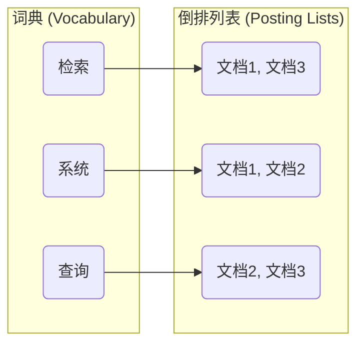
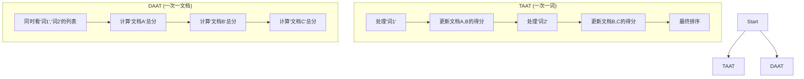
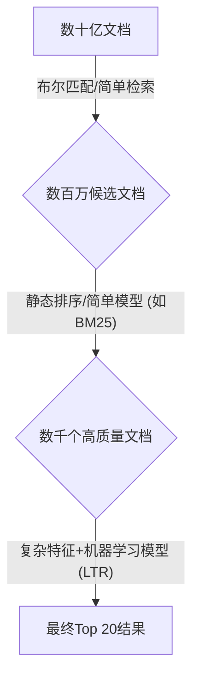
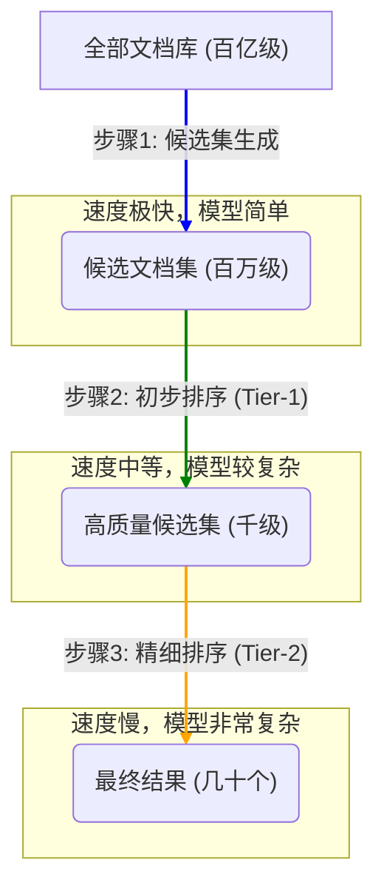
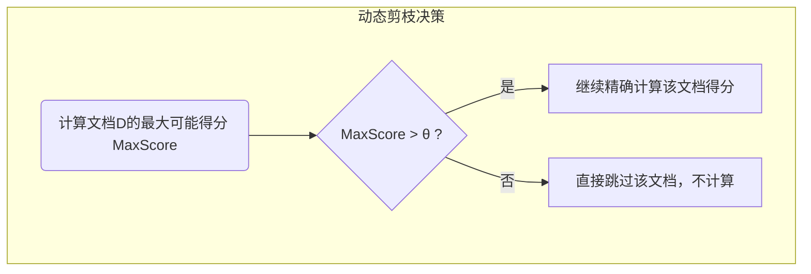
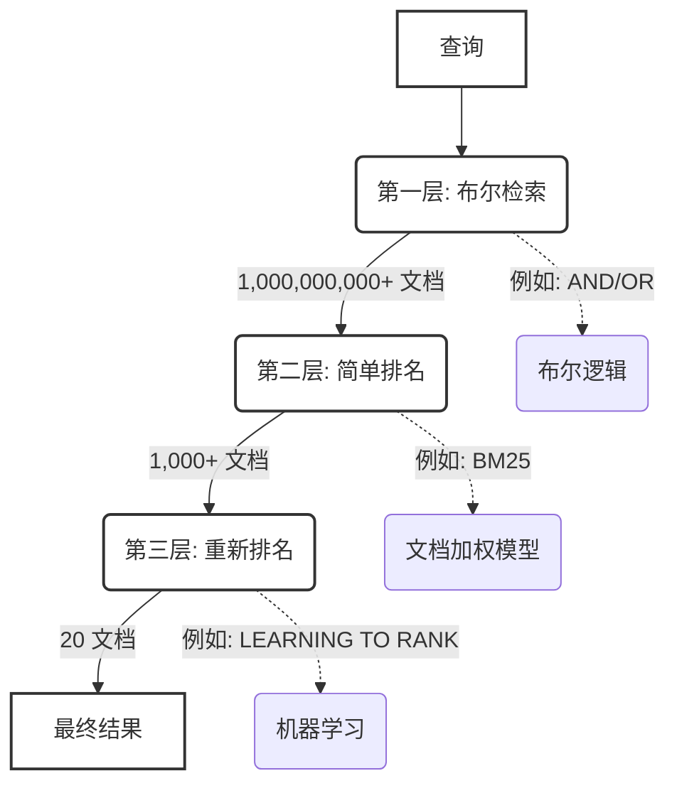
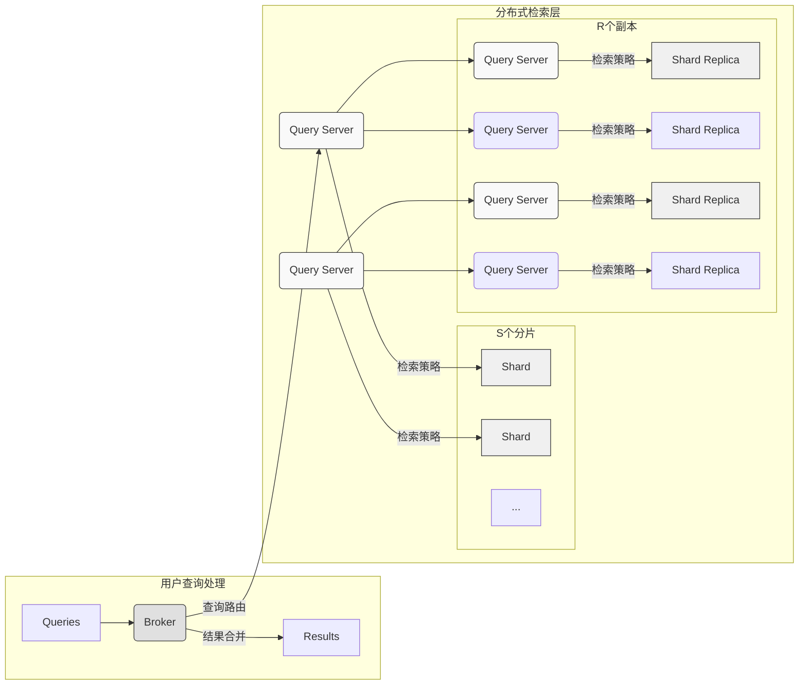

## AI论文解读 | Efficient Query Processing for Scalable Web Search
        
### 作者        
digoal        
        
### 日期        
2025-07-02       
        
### 标签        
PostgreSQL , PolarDB , DuckDB , AI , 论文解读        
        
----        
        
## 背景  
      
https://www.dcs.gla.ac.uk/~craigm/publications/fnt-efficient-query-processing.pdf        
  
      
提示:        
```        
读懂《Efficient Query Processing for Scalable Web Search》这篇论文需要提前掌握哪些基础知识, 请使用中文给我讲一下这些基础知识, 尽量通熟易懂, 可以使用markdown支持的图形增加解释性.        
        
使用中文通熟易懂的解读《Efficient Query Processing for Scalable Web Search》这篇论文, 关键内容请深入讲解, 可以使用markdown支持的图形增加解释性.        
        
使用中文提取《Efficient Query Processing for Scalable Web Search》论文中一些重要的术语并详细解释, 可以使用markdown支持的图形示增加解释性.        
```        
        
## 1 前置知识 
  
好的，为了帮助您更好地理解《Efficient Query Processing for Scalable Web Search》这篇论文，我将为您梳理所需的基础知识。这篇论文属于信息检索领域的经典综述，深入探讨了现代搜索引擎如何能够快速（高效地）处理海量的用户查询。

掌握以下几个方面的基础知识，将极大地帮助您读懂这篇论文：

### 1\. 信息检索 (Information Retrieval) 核心概念

这是理解全文的基石。搜索引擎的核心工作方式都建立在这些概念之上。

#### a. 倒排索引 (Inverted Index)

 这是现代搜索引擎的“心脏”，也是最高效的文本查询数据结构  。想象一下一本书末尾的“索引”部分，它告诉你每个关键词出现在哪些页码。倒排索引做的就是类似的事情。

  * **基本结构**: 它主要由两部分构成：
      * **词典 (Vocabulary/Lexicon)**: 包含所有文档中出现过的词语（term）。
      *  **倒排列表 (Posting List)**: 每个词语都对应一个列表，记录了包含该词语的所有文档的ID（`docID`）。列表中通常还包含额外信息，如词语在该文档中出现的频率（`Term Frequency`, TF）和位置等  。

下面是一个极简的倒排索引示意图：



当用户查询“检索 系统”时，搜索引擎只需找到“检索”和“系统”各自的倒排列表，然后找出同时出现在两个列表中的文档（如“文档1”），而无需扫描所有文档。

#### b. 文档排序与评分 (Document Ranking & Scoring)

 找到包含查询词的文档只是第一步，更重要的是对这些文档进行排序，将最相关的结果排在最前面  。

  * **评分函数 (Scoring Function)**: 系统会使用一个评分函数（如论文中提到的 `BM25` 或 `TF-IDF`）来计算每个文档与查询的“相关性得分”。
  * **核心思想 (以 TF-IDF 为例)**:
      * **TF (Term Frequency)**: 一个词在文档中出现次数越多，该文档与这个词的相关性可能就越高。
      * **IDF (Inverse Document Frequency)**: 一个词在越少的文档中出现（即越稀有），它对区分文档的重要性就越大。例如，“的”、“是”这种词几乎每篇文档都有，IDF值就很低；而“可扩展性”这种专业词汇IDF值就很高。
      * **TF-IDF Score**: 两者相乘，既考虑了词在文档内的重要性，也考虑了它在整个文档集里的重要性。

#### c. 查询处理策略 (Query Processing Strategies)

论文的核心内容之一就是对比和优化查询处理策略，主要是以下两种：

  * **TAAT (Term-At-A-Time, 一次一词)**:

      *  逐个处理查询中的每个词。先遍历第一个词的倒排列表，为相关文档创建或更新一个“累加器”（accumulator）来存部分得分。然后处理第二个词，更新累加器，以此类推。所有词处理完后，根据累加器的最终得分排序  。
      * **优点**: 对倒排列表的访问是连续的，缓存友好。
      *  **缺点**: 需要为大量文档维护累加器，内存开销大  。

  * **DAAT (Document-At-A-Time, 一次一文档)**:

      *  同时处理所有查询词的倒排列表。想象一下你有多根指针，分别指向每个词的倒排列表的开头。你不断地将这些指针同步前移，一次性计算完一个文档的最终得分，然后再处理下一个文档  。
      * **优点**: 内存开销小，只需保留Top-K的结果。
      * **缺点**: 对倒排列表的访问是跳跃式的，缓存不友好。




### 2\. 关键数据结构与算法

#### a. 索引压缩 (Index Compression)

 真实的倒排索引非常巨大，需要高效的压缩技术才能存入内存，加快访问速度  。论文中提到的压缩算法（如 VByte, PForDelta）旨在减小索引体积的同时，保证解压速度足够快。理解其动机（节省空间、利用内存层级）比了解具体算法更重要。

#### b. 跳跃指针 (Skip Pointers)

 在处理DAAT或进行列表求交集时，我们经常需要在一个很长的倒排列表中快速跳到某个`docID`之后的位置。如果从头遍历会很慢。跳跃指针就是在长列表中设置一些“快捷方式”，可以直接跳到某个位置，极大地提升了`next(d)`操作的效率  。

### 3\. 搜索引擎系统架构

#### a. 分布式架构 (Distributed Architecture)

单个服务器无法存储和处理整个互联网的数据。因此，现代搜索引擎都是大规模的分布式系统。

  *  **分片 (Sharding)**: 将整个索引库水平切分成很多小份（shard），每个分片由一个服务器子集负责  。
  *  **副本 (Replication)**: 每个分片都会被复制多份（replica），分散在不同机器上，以实现负载均衡和容错  。

当一个查询到来时，一个“代理”（Broker）会把查询分发给所有分片，然后汇总所有分片返回的结果，进行合并排序后呈现给用户。

#### b. 多阶段排序瀑布模型 (Cascading Ranking)

 计算所有文档的精准得分非常耗时。因此，搜索引擎采用一种“漏斗”式的多阶段排序模型  。



  * **第一阶段**: 使用非常高效的方法（如布尔匹配）从海量文档中快速筛选出几百万个相关的候选文档。
  * **第二阶段**: 对这些候选文档使用较简单的排序模型（如BM25）进行粗排序，得到几千个文档。
  * **第三阶段**: 只对这几千个文档，提取非常丰富和复杂的特征（如网页链接、用户点击历史等），然后用一个复杂的机器学习模型（即**排序学习**模型）进行精排序，得到最终呈现给用户的几十个结果。

 论文中的很多高效查询技术，如**动态剪枝 (Dynamic Pruning)**  ，其核心思想就是在前几个阶段，通过预估一个文档的“得分上限”，提前“剪掉”那些不可能进入最终排序结果的文档，从而避免不必要的计算。

### 4\. 机器学习基础

#### 排序学习 (Learning to Rank - LTR)

 传统排序函数（如BM25）依赖人工设计的固定公式和参数。而排序学习（LTR）则利用机器学习技术，自动学习如何组合成百上千个“特征”（feature）来得到一个最优的排序模型  。理解这个概念即可，无需深入具体算法。

-----

**总结一下**:

如果您能对**倒排索引**、**TAAT/DAAT**、**多阶段排序**和**动态剪枝**这些核心概念有一个清晰的理解，您就已经掌握了阅读这篇论文的80%的基础。其他知识点（如压缩、分布式、LTR）则能帮助您更好地理解论文中各种优化技术的动机和应用场景。

希望这份梳理对您有帮助！
  
## 2 解读论文 
  
好的，我们来一起深入解读这篇信息检索领域的经典论文——《Efficient Query Processing for Scalable Web Search》（可扩展网络搜索中的高效查询处理）。

这篇论文的核心目标是回答一个看似简单却极具挑战性的问题：**搜索引擎如何在不到一秒的时间内，从数百亿的网页中，为你找到最相关的几十个结果？**

这背后涉及一系列精妙的算法、数据结构和系统设计。我将为您层层解析，力求通俗易懂。

### 核心背景：无法承受的“暴力”计算

首先，我们必须理解为什么“高效”如此重要。假设一个搜索引擎索引了100亿个网页，一个用户的查询包含3个词。

  * **天真的做法**：遍历100亿个网页，检查每个网页是否包含这3个词，然后计算一个相关性得分，最后排序。
  * **结果**：即使每秒能处理1000个网页，也需要超过115天才能完成一次查询。这显然是不可接受的。

因此，现代搜索引擎采用了一种“**多阶段排序瀑布模型 (Cascading Ranking)**”的架构，这正是理解本文所有技术的大前提。

### 1\. 宏观架构：多阶段排序瀑布模型

这个模型就像一个层层筛选的漏斗，在每个阶段用越来越复杂但越来越慢的方法，处理越来越少的候选文档。



  * **阶段 1: 候选集生成 (Candidate Generation)**: 使用最核心的**倒排索引**，快速从百亿文档中找出所有包含查询词的文档。这个集合可能依然有数百万之多。
  * **阶段 2: 初步排序 (Tier-1 Ranking)**: 对这几百万文档，使用一个**高效但相对简单**的评分函数（如 BM25 或 TF-IDF）进行打分和排序，筛选出得分最高的几千个文档。**本文的核心技术主要应用在这个阶段**。
  * **阶段 3: 精细排序 (Tier-2 Ranking)**: 只对这几千个文档，使用一个**非常复杂但耗时**的机器学习模型（即“排序学习” LTR）。这个模型会考虑数百个特征（如网页的权威度、链接结构、用户点击历史等），进行最终的精准排序，得到呈现给用户的几十个结果。

理解了这个瀑布模型，我们就明白了本文的主战场在**阶段2**：如何在保证最终结果质量不太差的前提下，用最快的速度完成对数百万候选文档的初步排序。

### 2\. 两大核心策略：TAAT vs. DAAT

为了完成阶段2的排序，论文详细对比了两种主流的查询处理策略：

#### a. TAAT (Term-At-A-Time, 一次一词)

TAAT策略逐个处理查询中的词。

  * **工作方式**:

    1.  处理查询中的第一个词，遍历其倒排列表。为每个包含该词的文档创建一个“得分累加器”（Accumulator），并计算该词对文档的贡献分数，存入累加器。
    2.  处理第二个词，同样遍历其倒排列表。如果文档已经有累加器了，就在原有分数上累加；如果没有，就新建一个。
    3.  重复此过程，直到所有词处理完毕。
    4.  最后，对所有累加器按总分进行排序，选出Top-K。

  * **优点**:

      * **缓存友好**: 对每个词的倒排列表是顺序读取的，磁盘/内存访问效率高。

  * **缺点**:

      * **内存开销巨大**: 如果一个词非常普遍（例如“的”），可能需要为数百万甚至上亿的文档创建累加器，内存会爆炸。

#### b. DAAT (Document-At-A-Time, 一次一文档)

DAAT策略一次处理一个文档，计算它对查询的完整得分。

  * **工作方式**:

    1.  同时打开查询中所有词的倒排列表，并用指针指向每个列表的开头。
    2.  找到所有列表中共同的、ID最小的下一个文档（例如，通过不断将指针前移到与其他列表对齐的位置）。
    3.  一旦找到这样一个文档，立即计算所有查询词对这个文档的总分。
    4.  将这个文档及其得分与已找到的Top-K结果进行比较，如果得分更高，就插入Top-K列表中。
    5.  重复此过程，直到遍历完所有列表。

  * **优点**:

      * **内存开销小**: 无需为大量文档维护累加器，只需维护一个大小为K的堆（Heap）来存放Top-K结果。

  * **缺点**:

      * **缓存不友好**: 指针在各个倒排列表上是跳跃式前进的，导致随机I/O，访问效率较低（**跳跃指针 Skip Pointers** 在一定程度上缓解了这个问题）。

### 3\. 核心灵魂：剪枝与近似计算 (Pruning & Approximation)

无论是TAAT还是DAAT，对几百万文档完整计算得分依然很慢。因此，论文的精髓在于介绍了一系列“偷懒”的艺术——**剪枝（Pruning）**，即在不影响（或很少影响）最终结果的前提下，跳过大量不必要的计算。

#### a. 静态剪枝 (Static Pruning)

在**建立索引时**就进行剪枝，提前减少索引的规模。

  * **基于影响力的剪枝**: 对于一个词的倒排列表，可以预先删除那些“贡献”很小的记录。例如，某个网页虽然包含了“搜索引擎”这个词，但只出现了一次，且网页本身质量很低，那么它对查询“搜索引擎”的最终排名贡献可能微乎其微，可以提前从索引中删除这条记录。
  * **基于文档质量的剪枝**: 直接从索引中移除所有低质量的文档（如垃圾网站、内容农场）。

#### b. 动态剪枝 (Dynamic Pruning)

这是本文最重要的概念之一，指**在查询处理时**动态地决定跳过哪些计算。其核心思想是：**维护一个动态的得分阈值**。

这个阈值 `θ` 通常是当前已找到的Top-K结果中，分数最低那个文档的分数。



**关键是如何估算一个文档的“最大可能得分”？**

  * **对于DAAT**: 当处理到文档`d`时，假设我们已经计算了前`i`个查询词对它的得分`S_i`。我们可以预先知道剩下未计算的词，它们能为任何文档贡献的**最大分数**是多少（例如，取该词在所有文档中的最高TF-IDF值）。那么，文档`d`的最大可能得分就是 `S_i + Sum(MaxScore of remaining terms)`。如果这个上限值都小于当前的阈值 `θ`，就没必要计算剩下的词了，可以直接跳到下一个文档。

  * **对于TAAT**: 在处理第`i`个词时，对于一个文档`d`，它的累加分是`S_i`。我们同样可以估算出剩下所有词能为它贡献的最大分数。如果 `S_i + Sum(MaxScore of remaining terms)` 小于 `θ`，这个文档的累加器就可以被丢弃了。

**动态剪枝是效率与效果权衡（Trade-off）的完美体现**：剪枝越激进（例如，把阈值`θ`人为提高），速度越快，但“误杀”最终可能进入Top-K结果的风险也越高。

#### c. 近似评分 (Score Approximation)

除了完全跳过计算，另一种“偷懒”的方法是使用更简单的、计算成本更低的近似评分函数。

  * **量化 (Quantization)**: 将浮点型的TF或IDF值，量化成整数。例如，将TF值从 `1.386` 变成 `1`。这样，大量的浮点数乘法就可以变成更快的整数运算或查表操作。
  * **分层评分**: 在瀑布模型的同一阶段内，也可以再分层。先用一个极简的评分模型（例如，只考虑查询词是否出现，不考虑频率）过滤掉大部分文档，再对剩下的使用BM25。

### 结论：现代搜索引擎如何选择与组合

这篇论文告诉我们，不存在一个“最优”的通用策略。现代搜索引擎是一个**混合系统**，会根据查询的特点、系统的负载、对效果和效率的不同要求，动态地组合使用上述技术：

1.  **索引构建时**: 采用**静态剪枝**，去除噪音，从源头减负。
2.  **查询处理时**:
      * **DAAT** 策略因其低内存和对动态剪枝的天然友好性，通常在**第一阶段排序**中更受欢迎。系统会采用**DAAT + 激进的动态剪枝 + 近似评分**，快速从数百万文档中筛选出几千个候选者。
      * **TAAT** 在某些特定场景下（如查询词非常稀有，或者硬件内存极大）也可能被使用。
3.  **效果与效率的权衡**: 系统会有一个总的“时间预算”（例如100毫秒）。它会先用最高效的算法跑，如果时间有富余，就会减少剪枝的力度，用更精确的模型重新计算，以提升结果质量。

总而言之，《Efficient Query Processing for Scalable Web Search》为我们描绘了一幅现代搜索引擎内部的“作战地图”。它通过**分层架构、两大查询策略（TAAT/DAAT）的博弈、以及剪枝与近似计算的艺术**，成功地在“效率”和“效果”这对永恒的矛盾体之间，找到了一个精妙的平衡点，从而实现了我们今天所体验到的即时、精准的搜索服务。
  
## 3 术语  
  
本文档旨在从《高效可伸缩Web搜索的查询处理》论文中提取重要术语并进行详细解释。

### 重要术语及其解释

#### 1\. 信息检索 (Information Retrieval, IR)

 信息检索系统的目标是返回与用户的信息需求相关的文档。在本文中，信息对象被称为“文档”，执行信息检索的文档集合被称为“文档集合” 。

#### 2\. 有效性 (Effectiveness) 与 效率 (Efficiency)

  *  **有效性**: 指搜索结果的质量，即返回结果与用户需求的匹配程度。  
  *  **效率**: 指向用户返回结果的速度。  

 在搜索引擎中，有效性和效率是两个目标，它们之间存在自然的权衡。提高有效性的技术可能会降低效率，反之亦然。  

#### 3\. 倒排索引 (Inverted Index)

 倒排索引（或称倒排文件）是实现文本查询处理的最有效的数据结构   。它通过为每个词项（term）组织一个列表，其中包含该词项出现过的文档信息。  

一个典型的倒排索引包含两个主要组成部分：

  *  **词汇表 (Vocabulary/Lexicon)**: 一个存储词项条目的数组，每个条目包含词项的文档频率（docfreq）以及指向该词项倒排列表起始位置的指针。  
  *  **倒排列表 (Posting Lists/Inverted Lists)**: 与词汇表中每个词项关联，由一系列“倒排项”（postings）组成。一个倒排项是关于文档中特定词项信息的逻辑表示，最基本的情况下包含文档标识符（docid），还可以包含词项在文档中出现的频率（freq）或位置（positions）。  

#### 4\. 逐词处理 (Term-At-A-Time, TAAT) 与 逐文档处理 (Document-At-A-Time, DAAT)

这些是基本的查询处理策略，用于从倒排索引中检索信息。

  *  **TAAT**: 是一种早期常见的信息检索系统优化方法，但目前已很少实际部署。  
  *  **DAAT**: 是目前大多数信息检索系统普遍使用的优化方法，例如MaxScore、WAND和BMW。  

#### 5\. 动态剪枝 (Dynamic Pruning)

 动态剪枝技术旨在提高查询处理的效率，其核心思想是避免对那些不可能进入最终排名靠前结果的文档进行评分。    WAND 和 BMW 是两种著名的动态剪枝算法。  

#### 6\. 加权AND (Weighted AND, WAND) 与 块最大WAND (Block-Max WAND, BMW)

  *  **WAND**: 是一种动态剪枝算法，通过设置一个阈值来避免不必要的文档评分。  
  *  **BMW**: 是WAND的变体，通过在块级别上应用最大分数来进一步优化剪枝过程，以提高效率。  

#### 7\. 查询效率预测 (Query Efficiency Prediction, QEP)

 查询效率预测旨在预估一个查询在执行前需要多长时间来处理。    这项技术允许搜索引擎根据查询的预期效率做出即时决策，从而进行配置调整。    QEP 的主要应用包括：选择性剪枝、选择负载最低的副本查询服务器、选择最佳查询处理策略以及动态电压和频率调整。  

#### 8\. 学习排名 (Learning-to-Rank, LTR)

 学习排名是一种信息检索技术，通过利用机器学习模型来优化文档的排序，从而提高搜索引擎的有效性。    LTR模型通常在搜索引擎的级联架构的顶层应用，对初始检索到的文档进行重新排序。  

#### 9\. 级联架构 (Cascading Infrastructure)

 级联架构是搜索引擎中一种多层过滤和排序文档的方法。    每一层级联都旨在过滤或排序文档，然后将其传递到下一个层级。    这种结构通常是“头重脚轻”的，即越顶层的处理的文档数量越少，但处理的精细程度越高。  

以下图1.2展示了Web搜索的级联特性:



  

#### 10\. 分片 (Shards) 与 副本 (Replicas)

 这是分布式搜索引擎架构中的关键概念，用于实现可伸缩性和弹性。  

  *  **分片 (S Shards)**: 一个大型索引可以被分割成多个分片，每个搜索服务器处理索引的一小部分，以确保快速检索。  
  *  **副本 (R Replicas)**: 每个索引分片可以复制 R 次，这既提供了弹性（防止单点故障）也实现了扩展性（处理更多的查询）。  

 当用户查询到达时，Broker会将查询路由到每个分片中负载较轻的副本进行处理。  

以下图1.1展示了分布式检索架构:



  

希望这些解释能帮助您理解《高效可伸缩Web搜索的查询处理》论文中的关键概念！
  
## 参考        
         
https://www.dcs.gla.ac.uk/~craigm/publications/fnt-efficient-query-processing.pdf  
        
        
<b> 以上内容基于DeepSeek、Qwen、Gemini及诸多AI生成, 轻微人工调整, 感谢杭州深度求索人工智能、阿里云、Google等公司. </b>        
        
<b> AI 生成的内容请自行辨别正确性, 当然也多了些许踩坑的乐趣, 毕竟冒险是每个男人的天性.  </b>        
    

   
