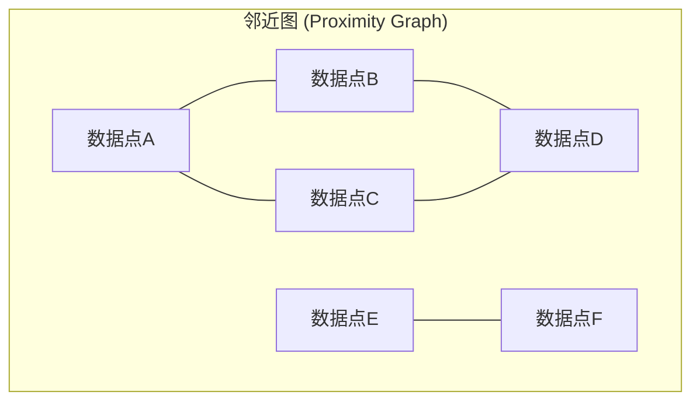
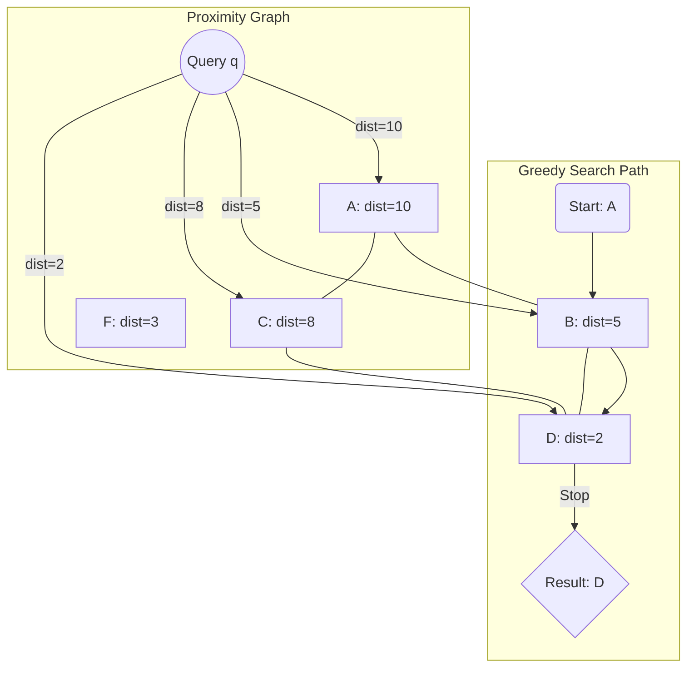
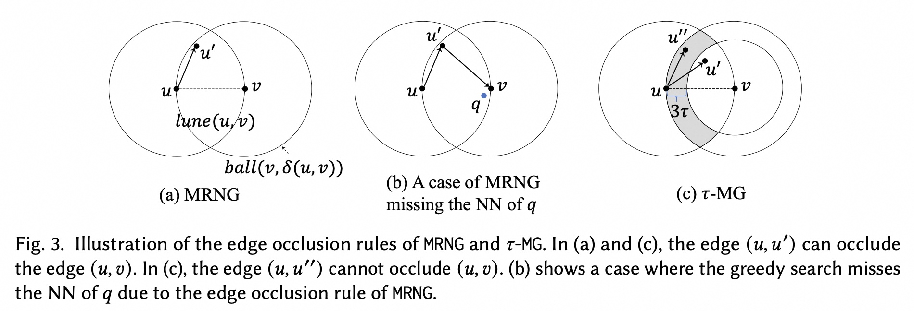
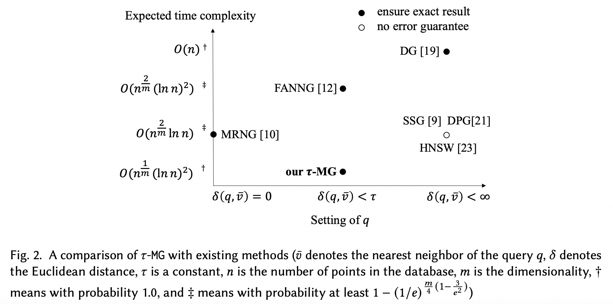
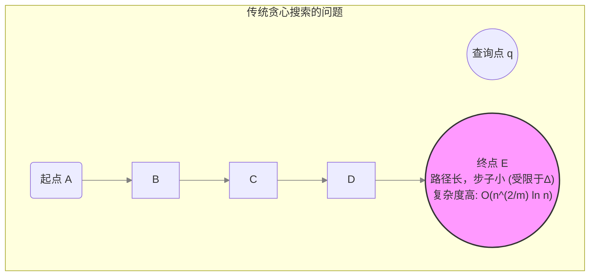
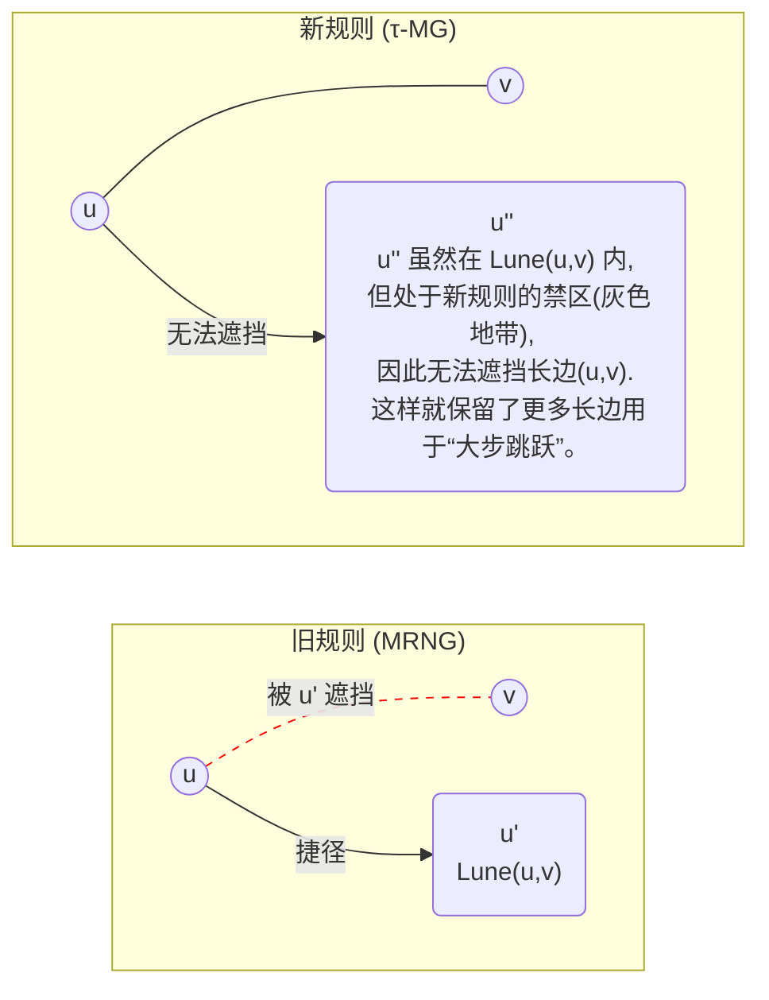

## AI论文解读 | Efficient Approximate Nearest Neighbor Search in Multi-dimensional Databases
        
### 作者        
digoal        
        
### 日期        
2025-07-03       
        
### 标签        
PostgreSQL , PolarDB , DuckDB , AI , 论文解读        
        
----        
        
## 背景  
      
https://dl.acm.org/doi/pdf/10.1145/3588908        
  
      
提示:        
```        
读懂《Efficient Approximate Nearest Neighbor Search in Multi-dimensional Databases》这篇论文需要提前掌握哪些基础知识, 请使用中文给我讲一下这些基础知识, 尽量通熟易懂, 可以使用markdown支持的图形增加解释性.        
        
使用中文通熟易懂的解读《Efficient Approximate Nearest Neighbor Search in Multi-dimensional Databases》这篇论文, 关键内容请深入讲解, 可以使用markdown支持的图形增加解释性.        
        
使用中文提取《Efficient Approximate Nearest Neighbor Search in Multi-dimensional Databases》论文中一些重要的术语并详细解释, 可以使用markdown支持的图形示增加解释性.        
```        
        
## 1 前置知识 
  
好的，为了能透彻理解这篇关于“多维数据库中高效近似最近邻搜索”的论文，你需要掌握一些基础概念。我会用尽量通俗易懂的方式，结合图示来为你讲解这些必备知识。

这些知识可以分为四大块：

1.  **核心问题**：我们在解决什么问题？
2.  **核心数据结构与方法**：我们用什么工具来解决？
3.  **关键算法与数学概念**：这些工具背后的原理是什么？
4.  **相关领域背景**：这个问题在学术界和工业界处于什么位置？

-----

### 1\. 核心问题：近似最近邻 (ANN) 搜索

#### 1.1 什么是“最近邻” (Nearest Neighbor, NN)？

想象一下你在地图上，想找离你最近的一家咖啡店。这个“寻找最近的”过程，就是“最近邻搜索”。

  * **低维度**：在二维地图上，这很简单，肉眼都能看个大概。
  *  **高维度**：现在想象一下，你要描述一个用户，不仅仅用二维的坐标 (x, y)，而是用上百个维度来描述他的兴趣，比如：(听歌偏好, 购物习惯, 浏览历史, 年龄, ... , 第128个特征)。一个数据点就变成了`[x1, x2, ..., x128]`。要在这样一个“高维空间”里，为新用户`q`找到兴趣最相似（也就是“距离”最近）的老用户`v`，就变得异常困难。这就是论文中提到的**多维数据库 (multi-dimensional databases)**   中的NN搜索问题。

#### 1.2 为什么需要“近似” (Approximate)？

在高维空间中，要保证100%找到**最**近的那个点，计算量会随着数据量的增加而爆炸式增长，速度极慢，对于实时应用（如推荐系统）是不可接受的。

 因此，我们退而求其次：不要求100%精确，只要能**极大概率**找到一个**足够近**的点就行。这个点可能不是理论上最近的，但可能排在前3或前5近。这种“牺牲一点点精度，换来巨大速度提升”的方法，就是**近似最近邻 (ANN) 搜索**  。

| 特性 | 精确最近邻 (NN) | 近似最近邻 (ANN) |
| :--- | :--- | :--- |
| **目标** | 找到绝对的第1名 | 找到一个“差不多”是第1名的 |
| **精度** | 100% | 通常 \> 90%，可调 |
| **速度** | 非常慢 | 非常快 |
| **应用** | 对精度要求苛刻的场景 |  推荐系统、以图搜图等实时场景   |

-----

### 2\. 核心数据结构与方法：邻近图 (Proximity Graph, PG)

 这篇论文的核心方法是基于**邻近图 (Proximity Graph, PG)** 的  。

#### 2.1 什么是邻近图？

想象一下，你把数据库里的每一个数据点（比如，每个用户）看作一个城市。如果两个城市（用户）之间“距离”比较近（兴趣相似），你就在它们之间连一条路。这样，所有的城市和道路就构成了一张巨大的交通网络图。这个图，就是邻近图。



  *  **节点 (Node)**：数据库中的每个数据点 (point)  。
  *  **边 (Edge)**：如果两个节点满足某种“邻近”关系，就连接一条边  。

#### 2.2 如何在图上搜索？—— 贪心搜索 (Greedy Search)

有了这张图，一个新的查询点`q`（新用户）来了，怎么找最近的点呢？
 最常用的方法是**贪心搜索 (Greedy Routing/Search)**  。

1.  **起点**：从图上随机选一个节点作为起点（比如上图的`A`）。
2.  **决策**：计算`q`到当前节点所有“邻居”（直接有边相连的节点）的距离。
3.  **前进**：选择那个离`q`最近的邻居，跳过去作为新的当前节点。
4.   **终止**：重复步骤2和3，直到当前节点的所有邻居都比它自己离`q`更远，说明“走投无路”了，搜索结束  。




 **问题**：贪心搜索可能会陷入“局部最优”，比如走到一个山谷里，虽然山谷的最低点不是整片区域的最低点，但它周围没有更低的路了。这就是现有PG方法的一个缺陷  。

-----

### 3\. 关键算法与数学概念

#### 3.1 算法复杂度 (Big O Notation)

 论文中频繁出现 `O(n log n)`, `O(n^(1/m))` 这样的符号 。这是**大O表示法**，用来衡量算法的效率。你只需要理解：

  * 它描述了当数据量`n`变得非常大时，算法的计算时间（或空间）增长的速度。
  * `O`里面的表达式越简单，增长越慢，算法就越高效。
  * **效率排序** (从高到低): `O(log n)` \> `O(n)` \> `O(n log n)` \> `O(n^2)`。
  *  这篇论文提出的 τ-MG 方法，其搜索时间复杂度为 $O(n^{\frac{1}{m}}(ln n)^2)$   ，优于其他方法的 $O(n^{\frac{2}{m}}ln n)$   等，意味着它的增长速度更慢，更高效。

#### 3.2 度量空间与距离 (Metric Space & Distance)

  *  **欧几里得距离 (Euclidean Distance)**：就是我们最熟悉的直线距离，计算公式为 $\delta(u,v) = \sqrt{\sum_{i=1}^{m}(u_i - v_i)^2}$  。论文中主要使用这种距离。
  * **度量空间 (Metric Space)**：一个集合（所有数据点）加上一个定义在集合上点与点之间“距离”的函数，这个体系就叫度量空间。

#### 3.3 基础几何概念

这篇论文的创新点在于定义了一种新的“边遮挡规则” (edge occlusion rule)，这需要理解两个几何图形：

  *  **球 (Ball)**：`ball(u, r)` 表示以点 `u` 为圆心，`r` 为半径的（超）球体  。在二维就是圆。
  *  **月牙形 (Lune)**：`lune(u, v)` 是 `ball(u, δ(u,v))` 和 `ball(v, δ(u,v))` 两个球的**交集**区域  。如下图(a)所示。

  

 论文的核心创新之一就是修改了这个 `lune` 区域（如上图(c)所示） ，使得建图的规则更严格，从而保证了搜索路径的质量。

#### 3.4 搜索算法

  * **贪心搜索 (Greedy Search)**：见上文。
  *  **束搜索 (Beam Search)**：贪心搜索的升级版。贪心在每一步只保留**最好**的1个选择。而束搜索在每一步会保留**最好**的 `b` 个选择（`b` 称为 beam size），然后从这 `b` 个选择出发，再分别找它们的邻居，再从所有新邻居中选出最好的 `b` 个  。这增加了找到全局最优解的概率，但计算量也更大了。

-----

### 4\. 相关领域背景

了解这些可以帮助你理解论文的出发点和贡献：

  * **其他ANN方法**：除了邻近图 (PG)，还有其他几类主流方法，如：

      * **基于树的方法 (Tree-based)**: 如 KD-Tree。善于处理低维数据，高维时性能下降。
      * **基于哈希的方法 (Hashing-based)**: 如 LSH (Locality-Sensitive Hashing)。将高维数据映射到低维，用哈希来查找。
      * **基于量化的方法 (Quantization-based)**: 如 PQ (Product Quantization)。将高维向量空间分割成很多小块来编码。
      *  论文提到，近期的研究表明PG方法在许多大规模应用中表现优于其他方法  ，这也是作者选择在PG上进行改进的原因。

  * **著名PG算法**：你需要知道这篇论文是在和谁作比较。

      *  **HNSW (Hierarchical Navigable Small World)** : 一种非常流行和高效的工业级ANN算法，采用分层的图结构。
      *  **NSG, SSG, FANNG**   : 也是基于邻近图的知名算法，论文在图2和实验部分都将它们作为了对比基线 (baseline)  。   

### 总结

要读懂这篇论文，你需要按以下顺序建立知识体系：

1.  **理解问题**：明白什么是高维空间中的“近似最近邻搜索”，以及为什么“近似”是必要的。
2.  **掌握核心思路**：了解“邻近图”是什么，以及如何在图上通过“贪心搜索”来找东西。
3.  **吃透技术细节**：
      * 能看懂`O(n log n)`这样的效率度量。
      * 脑中有`ball`（球）和`lune`（月牙）的几何图像，这是理解其核心创新的关键。
      * 知道“束搜索”是“贪心搜索”的加强版，用来提高准确率。
4.  **了解背景**：知道HNSW等是当前该领域的“高手”，这篇论文的目标就是“挑战”这些高手并取得更好的性能。

有了这些基础，你再去看论文的摘要、引言和图表，就会发现脉络清晰了很多，能够快速抓住作者要解决的核心矛盾、提出的创新方案以及最终的贡献。
  
## 2 解读论文 
  
好的，我们来一起深入解读这篇重要的学术论文 **《Efficient Approximate Nearest Neighbor Search in Multi-dimensional Databases》**。我会为你剖析其核心思想、技术创新和实践价值，并使用图示帮助你理解。

### 论文概览：解决了什么核心问题？

 在高维数据（例如，图像特征、用户画像）中快速找到与查询点最相似的几个点，即**近似最近邻（ANN）搜索**，是许多现代应用（如推荐系统、以图搜图）的核心技术   。目前， **邻近图（Proximity Graph, PG）** 被认为是最高效的解决方案之一  。

 然而，现有基于PG的方法存在一个两难困境：要么为了保证搜索质量而导致搜索时间过长，要么为了速度而无法保证能找到足够好的结果  。

**这篇论文的核心洞察在于：**

1.   **发现了现有PG方法效率低下的根本原因**：在图上进行搜索时，每一步“前进”的距离过小，导致路径过长  。
2.   **提出了一个理想化的新图结构 `τ-MG`**：它能从理论上保证搜索时“大步前进”，从而获得比所有现有方法更低的时间复杂度  。
3.   **设计了一个实用的近似版本 `τ-MNG`**：它将 `τ-MG` 的思想落地，构建速度快，并且在真实数据集上超越了所有顶尖的同类方法  。

下面，我们将一步步拆解这些创新点。

-----

### 1\. 深入剖析：为什么现有的图搜索这么慢？

 想象一下，数据库里的所有数据点是地面上的一个个落脚点，ANN搜索就像是要从一个随机起点，通过在这些点之间跳跃，最快地到达离查询目标 `q` 最近的那个点。邻近图（PG）就是预先在这些落脚点之间修建好的“路径”网络  。

 最常见的搜索方式是**贪心搜索（Greedy Search）**：从当前点出发，永远选择跳向离目标 `q` 最近的那个邻居  。

**瓶颈在哪里？**

 论文通过理论分析（Theorem 1）指出，贪心搜索的路径之所以很长，是因为每一步能拉近的距离 `δ` 受限于一个极小的值 `Δ`   。`Δ` 代表了数据集中任意两点之间的最小距离  。

**一个比喻：**
这就像下山，但你被规定每一步最多只能迈出1厘米（`Δ`）。即使山不高，你也要走无数步才能到达山脚。

 论文证明，在这种限制下，贪心搜索的预期时间复杂度至少是 $O(n^{\frac{2}{m}} \ln n)$（其中n是数据点数量，m是维度） 。这个效率在数据量大时是无法接受的。



-----

### 2\. 核心创新（一）：τ-单调图 (τ-MG) —— 保证大步前进的理想模型

为了解决上述问题，作者提出了一个全新的图结构：**τ-单调图（τ-Monotonic Graph, τ-MG）**。

 **核心目标**：构建一种图，使得在搜索时，每一步至少能向目标前进一个**常量距离 `τ`**，而不是不确定的微小距离 `Δ`  。

**关键机制：全新的“边遮挡”规则 (A New Edge Occlusion Rule)**

这是整篇论文最核心的技术创新。要理解它，我们先看旧规则，再看新规则。

  *  **旧规则（如MRNG   ）**：如果要在 `u` 和 `v` 之间连一条边，需要检查是否存在一个“第三者”点 `u'`，它位于 `u` 和 `v` 构成的“月牙区域”（Lune）内。如果存在，那么 `(u, u')` 这条更短的“捷径”就会“遮挡”掉 `(u, v)` 这条长边，`(u,v)` 就不会被添加到图中  。

  *  **新规则（τ-MG）**：新规则变得更加**苛刻**。同样是检查 `u'` 是否遮挡 `(u, v)`，`τ-MG` 要求 `u'` 必须位于一个**更小的区域**内   。如下图所示，`u'` 不能位于靠近 `u` 的灰色地带  。




**这个改动的影响是什么？**

新规则保护了很多在旧规则下会被“无情”删除的长边。正是这些被保留下来的长边，成为了搜索时能够“大步跳跃”的关键。

**τ-单调属性 (τ-Monotonic Property)**

 基于这个新规则，`τ-MG` 拥有一个完美的特性：只要查询点 `q` 离它的真·最近邻 `v` 的距离小于 `τ`，那么从图中任意一点出发，都存在一条路径能到达 `v`，并且路径上的每一步都让你离 `q` 的距离**至少缩短 `τ`**  。

**性能与保证**

  *  **结果保证**：如果 `δ(q, v) < τ`，在 `τ-MG` 上使用贪心搜索，**保证**能找到精确的最近邻  。
  *  **理论性能**：搜索的时间复杂度降低到了 $O(n^{\frac{1}{m}}(\ln n)^2)$   。这在理论上优于所有已知的基于PG的方法（参见论文图2）    。

 **缺点**：`τ-MG` 是一个理想模型。它的构建过程非常慢，复杂度高达 $O(n^2 \ln n)$ ，在现实的大规模数据集上并不可行  。

-----

### 3\. 核心创新（二）：τ-单调邻域图 (τ-MNG) —— 从理想到现实

既然全局最优的 `τ-MG` 太慢，作者提出了一个非常聪明的工程化方案：**τ-单调邻域图（τ-MNG）**。

 **核心思想**：“全局最优”太难，那就在“局部”实现最优。我们不再要求整张图都满足严苛的 `τ-MG` 规则，而只要求在**每个节点的“邻域”（Neighborhood）这个小范围内**满足该规则   。作者认为，大部分搜索路径都集中在离目标很近的区域，因此保证“最后一公里”的路径质量就足够了  。

**构建过程**

1.   **打好基础**：先用一个现有的、构建速度快的方法（如HNSW或NSG）生成一个初始的图 `G0`  。
2.   **划定邻域**：对于图中的每一个节点 `u`，通过在 `G0` 上搜索，找到离它最近的 `h` 个邻居，形成它的“邻域”`Hu`  。
3.   **局部优化**：只在 `Hu` 这个小范围内，应用 `τ-MG` 那套严格的边遮挡规则来添加或删除边  。

**效率与搜索**

  *  **构建效率**：由于只在局部操作，构建速度大大加快。论文提到，这部分的构建时间为 $O(nh^2 \ln h)$ （`h` 是邻域大小，是个小常数），非常实用  。
  *  **搜索方法**：因为 `τ-MNG` 只是一个近似，贪心搜索可能会失败。因此，它采用了一种更稳健的搜索算法——**束搜索（Beam Search）**，通过在每一步保留多个候选路径来提高最终的准确率  。

-----

### 4\. 锦上添花：搜索优化技术

为了进一步提升 `τ-MNG` 上束搜索的效率，论文还提出了三个实用的优化技巧：

  *  **QEO (查询感知边遮挡)**：当搜索路径离最终目标还很远时，可以更激进地剪掉那些看起来“没希望”的邻居  。
  *  **PDP (部分距离剪枝)**：在计算一个点到查询点的距离（需要累加每个维度的差的平方）时，如果累加到一半就发现已经比当前最好的结果要远了，就立刻停止计算，提前剪枝  。
  *  **PII (前缀内积索引)**：利用数学技巧（内积）来加速距离计算，能节省约一半的计算开销  。

### 实验与结论

论文在多个著名的真实数据集（如SIFT, GIST）上进行了大量实验，结果表明：

  *  **性能卓越**：在要求高准确率（如Recall@100 \> 0.95）的场景下，`τ-MNG` 的查询速度（QPS）比 HNSW、NSG 等所有当前顶尖的方法快1.1到4.1倍  。
  *  **优化有效**：QEO, PDP, PII 等优化技术能显著提升搜索性能  。
  *  **`τ` 的影响**：参数 `τ` 并非越大越好。适度的 `τ` 可以通过改善图的连通性来减少搜索步数，但过大的 `τ` 会导致每个节点的邻居过多，反而增加计算量  。

**总结**

这篇论文完成了一次从**理论瓶颈分析**到**理想模型构建**，再到**实用方案设计与优化**的完整创新。它不仅深刻揭示了现有邻近图方法效率低下的根源，还提出了一套兼具理论深度和实践价值的解决方案（`τ-MG` 和 `τ-MNG`），在近似最近邻搜索这个重要领域取得了业界领先的性能。
  
## 3 术语  
  
好的，我们来一起提取并详细解读这篇论文中的一些关键术语。我会使用通俗的语言和图示来帮助你理解。

-----

### 一、 基础概念术语

这些术语是理解全文工作的基础。

#### 1\. 近似最近邻搜索 (Approximate Nearest Neighbor Search, ANN Search)

  -  **解释**：这是一个核心搜索问题   。给定一个包含大量数据点（如图片、用户向量）的数据库`D`和一个查询点`q`，目标不是不计代价地找到那个**绝对最近**的点，而是在可接受的时间内，高效地找到一个**足够近**的点`p`   。这个“足够近”通常由一个误差参数`ε`来定义，即`p`到`q`的距离不会超过真·最近邻距离的`(1+ε)`倍  。
  -  **应用场景**：图像检索、推荐系统、实体解析、序列匹配等  。

#### 2\. 邻近图 (Proximity Graph, PG)

  -  **解释**：这是一种用于ANN搜索的最先进的索引结构  。你可以把它想象成一张网络地图：
      *  **节点 (Node)**：数据库中的每一个数据点  。
      *  **边 (Edge)**：如果两个数据点在某种程度上“彼此靠近”（满足某种邻近属性），就在它们之间连接一条边  。
  -  **作用**：一旦这张图建好，就可以通过在图上“寻路”的方式来为新的查询点快速找到最近邻  。

#### 3\. 贪心路由 (Greedy Routing)

  -  **解释**：这是在邻近图上进行搜索的一种基本且高效的策略  。其过程如下：
    1.   从图中的一个起始节点开始  。
    2.   计算当前节点的所有邻居到查询点`q`的距离  。
    3.   选择那个离`q`**最近**的邻居，并移动到该邻居上，作为新的当前节点  。
    4.   重复此过程，直到当前节点的所有邻居都比它自己离`q`更远为止，此时搜索停止  。
  - **图示**：
    ```mermaid
    graph TD
        subgraph Greedy Routing Path
            direction LR
            q((查询点 q))
            A(起点) -- 距离最近 --> B -- 距离最近 --> C((终点 <br> 邻居中没有比C更近的了, 停止搜索 endnote))
        end
    ```

#### 4\. 束搜索 (Beam Search)

  -  **解释**：这是贪心路由的一种泛化和改良版本，也是论文中实际使用的搜索算法（见Algorithm 1）  。贪心路由在每一步只保留1个最佳选择，而束搜索会维护一个大小为`b`的候选列表（称为"beam"），在每一步保留`b`个最佳选择  。
  -  **优缺点**：更大的`b`值能提高搜索的准确率（不易陷入局部最优），但也会增加计算成本，降低搜索速度  。

-----

### 二、 几何与规则术语

这些术语是理解论文核心创新（新的边构建规则）的关键。

#### 1\. 球 (Ball)

  -  **解释**：`ball(u, r)`指的是一个以点`u`为中心、以`r`为半径的开放（超）球体  。在二维空间里，它就是一个圆。

#### 2\. 月牙形 (Lune)

  -  **解释**：`lune(u, v)`是由两个半径相同（均为`u`和`v`之间的距离`δ(u,v)`）的球相交构成的区域   。这两个球的球心分别是`u`和`v`  。
  - **图示**：
    ```mermaid
    graph TD
        subgraph "lune(u,v)"
            A((u)) --- B(("v <br> lune是两个圆的重叠区域"))
            C("ball(u, δ(u,v))")
            D("ball(v, δ(u,v))")
        end
        style C fill-opacity:0.1,stroke:#00f,stroke-width:2px
        style D fill-opacity:0.1,stroke:#f00,stroke-width:2px
    ```

#### 3\. 边遮挡规则 (Edge Occlusion Rule)

  - **解释**：这是构建邻近图时决定一条边是否应该存在的关键规则。论文对比了两种规则：
      *  **MRNG的规则 (旧规则)**：如果存在一个“第三者”点`u'`位于`lune(u, v)`内部，那么`(u, u')`这条更短的边就会“遮挡”并取代`(u, v)`这条长边  。
      *  **τ-MG的规则 (新规则)**：这是一个更严格的规则。点`u'`要遮挡`(u, v)`，它必须位于一个**更小**的区域内，即`ball(u, δ(u,v))`与`ball(v, δ(u,v) - 3τ)`的交集区域  。这意味着，`u'`不能离`v`太远。这个规则保护了很多在旧规则下会被删除的长边，这些长边对于实现“大步跳跃”至关重要。

-----

### 三、 核心创新术语

这些是论文原创提出的、最具价值的术语。

#### 1\. τ-单调图 (τ-Monotonic Graph, τ-MG)

  -  **解释**：这是论文提出的一个全新的、理论上非常高效的邻近图模型   。它的新颖之处在于它所拥有的**τ-单调属性**，该属性由其独特的边遮挡规则保证  。
  -  **核心保证**：如果一个查询`q`与它的真·最近邻的距离小于一个常量`τ`，那么在`τ-MG`上进行搜索**保证能找到这个精确的最近邻**，并且其搜索时间复杂度低于所有现存的PG方法  。

#### 2\. τ-单调路径 (τ-Monotonic Path)

  -  **解释**：一条从起点到终点的路径，如果对于查询点`q`来说，路径上的每一步（除了最后一步）都让它与`q`的距离**至少缩短了`τ`**，那么这条路径就被称为`τ-`单调路径   。即 `δ(v_next, q) < δ(v_current, q) - τ`  。

#### 3\. τ-单调属性 (τ-Monotonic Property)

  -  **解释**：这是一个图的重要属性。如果一个图对于任何满足特定条件（离真·最近邻距离小于`τ`）的查询`q`，都能保证从图中任意节点出发，都存在一条`τ-`单调路径通往`q`的最近邻，那么这个图就具备`τ-`单调属性   。`τ-MG`被证明拥有此属性  。

#### 4\. τ-单调邻域图 (τ-Monotonic Neighborhood Graph, τ-MNG)

  -  **解释**：这是`τ-MG`的一个近似、实用的版本，旨在解决`τ-MG`构建过慢的问题  。
  -  **核心思想**：不再要求整个图都满足`τ-`单调属性，而只要求在每个节点的 **局部邻域（neighborhood）** 这个小范围内满足该属性   。这大大降低了构建图的复杂度   。因为只在局部满足严格规则，所以它是一个近似图，搜索时需要使用更鲁棒的束搜索（Beam Search） 。
  
## 参考        
         
https://dl.acm.org/doi/pdf/10.1145/3588908  
        
        
<b> 以上内容基于DeepSeek、Qwen、Gemini及诸多AI生成, 轻微人工调整, 感谢杭州深度求索人工智能、阿里云、Google等公司. </b>        
        
<b> AI 生成的内容请自行辨别正确性, 当然也多了些许踩坑的乐趣, 毕竟冒险是每个男人的天性.  </b>        
    
  
   
