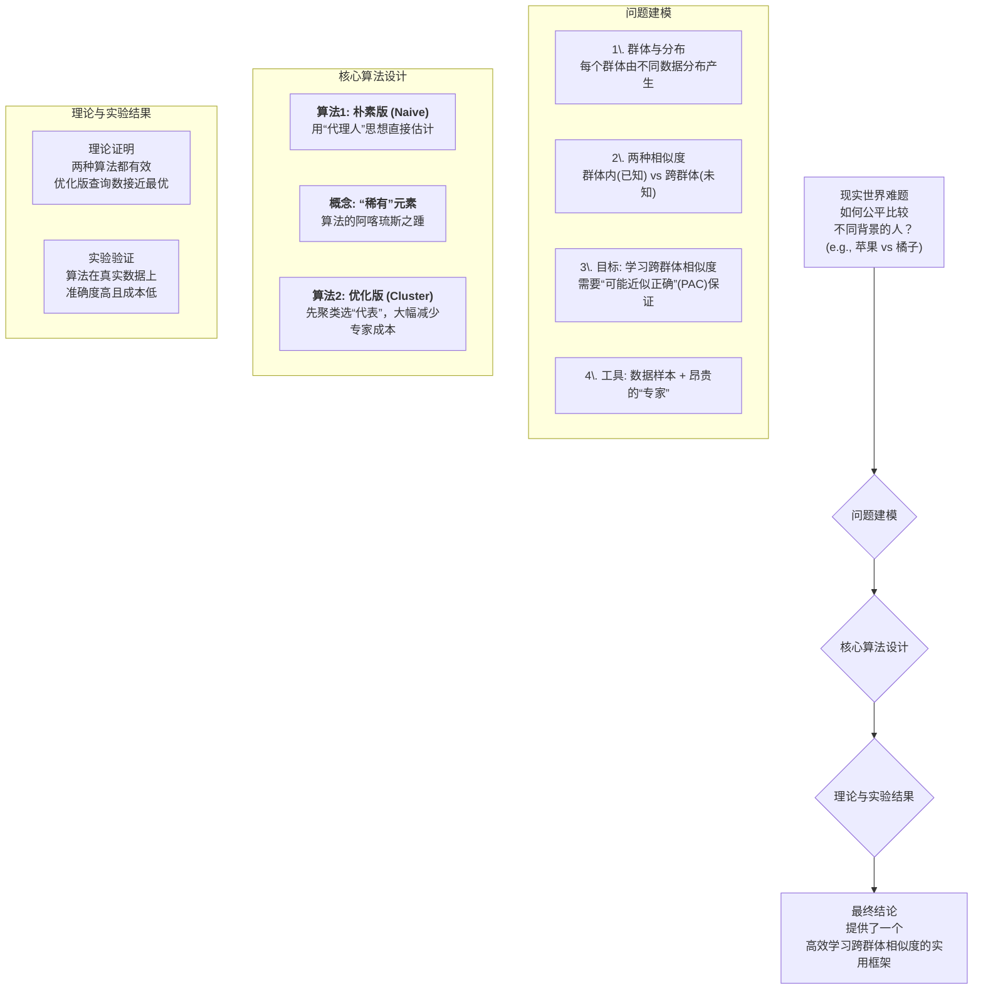
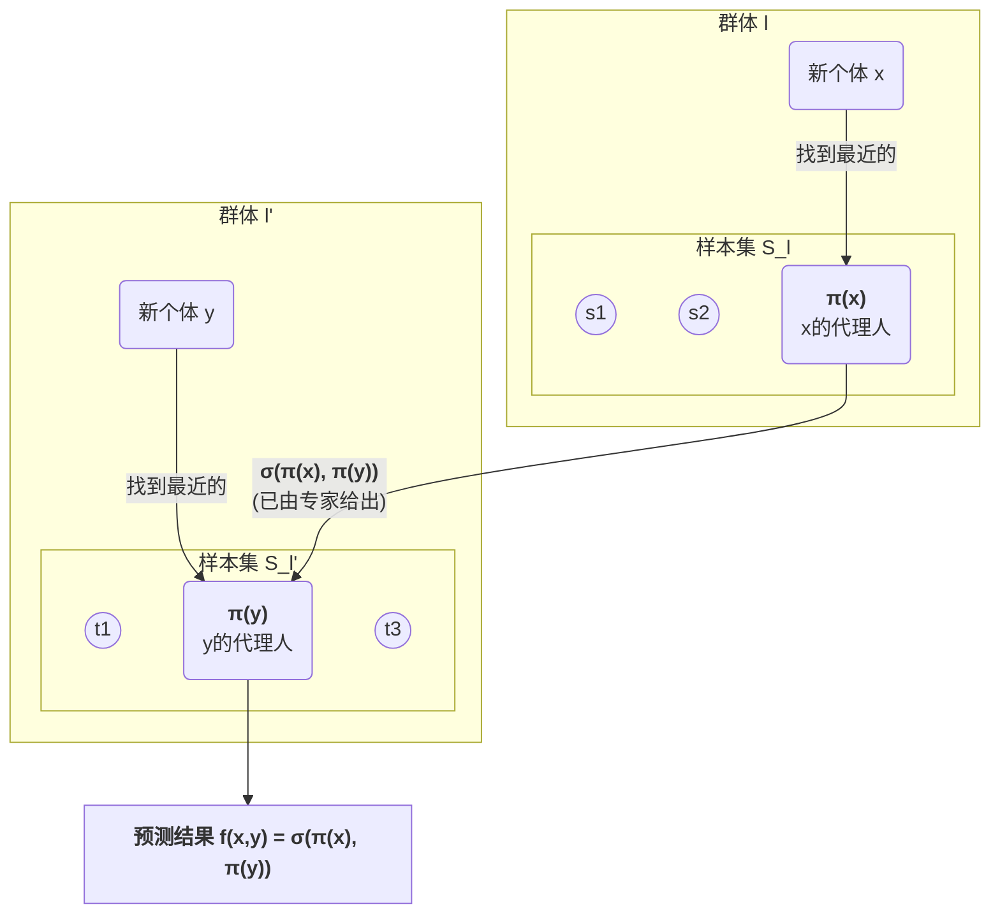

## AI论文解读 | Comparing Apples to Oranges: Learning Similarity Functions for Data Produced by Different Distributions
        
### 作者        
digoal        
        
### 日期        
2025-07-03       
        
### 标签        
PostgreSQL , PolarDB , DuckDB , AI , 论文解读        
        
----        
        
## 背景  
      
https://arxiv.org/pdf/2208.12731        
  
      
提示:        
```        
读懂《Comparing Apples to Oranges: Learning Similarity Functions for Data Produced by Different Distributions》这篇论文需要提前掌握哪些基础知识, 请使用中文给我讲一下这些基础知识, 尽量通熟易懂, 可以使用markdown支持的图形增加解释性.        
        
使用中文通熟易懂的解读《Comparing Apples to Oranges: Learning Similarity Functions for Data Produced by Different Distributions》这篇论文, 关键内容请深入讲解, 可以使用markdown支持的图形增加解释性.        
        
使用中文提取《Comparing Apples to Oranges: Learning Similarity Functions for Data Produced by Different Distributions》论文中一些重要的术语并详细解释, 可以使用markdown支持的图形示增加解释性.        
```        
        
## 1 前置知识 
  
好的，为了完全读懂《Comparing Apples to Oranges: Learning Similarity Functions for Data Produced by Different Distributions》这篇论文，你需要对一些机器学习和理论计算机科学的基础概念有所了解。我会用通俗易懂的中文为你解释这些知识，并配合一些图示来帮助理解。

### 理解论文所需的基础知识

这篇论文的核心是解决一个难题：当数据来自不同的“群体”（例如，不同教育背景的学生、不同国家的消费者）时，我们如何学习一个公平且准确的“相似度”衡量方法。

-----

#### 1\. 相似度函数 (Similarity Function) / 距离度量 (Distance Metric)

  * **是什么？**
     想象一下，你要比较两个人，比如两个学生。你会看他们的成绩、课外活动、推荐信等特征。一个**相似度函数**就像一个“打分系统”，它接收两个事物（例如两个学生的档案），然后输出一个数值，告诉你他们有多“像”。 

      *  这个数值**越小**，通常代表他们**越相似**（可以理解为“距离”越近）。 
      * 这个数值**越大**，代表他们**差异越大**（“距离”越远）。

  * **为什么重要？**
    在人工智能领域，相似度函数是许多应用的核心基础，比如：

      *  **个体公平性 (Individual Fairness)**：确保背景相似的人得到相似的对待。 
      *  **聚类 (Clustering)**：把相似的数据点（如客户）划分到同一个组里，用于市场分析等。 
      * **推荐系统**：给你推荐与你之前喜欢物品“相似”的东西。

    

    ```mermaid
    graph TD
        A["学生 A <br> {SAT: 1500, GPA: 3.9, 课外活动: 丰富}"]
        B["学生 B <br> {SAT: 1480, GPA: 3.85, 课外活动: 丰富}"]
        C["学生 C <br> {SAT: 1100, GPA: 3.2, 课外活动: 一般}"]

        subgraph "相似度函数 σ(x, y) 计算"
            direction LR
            A -- "σ(A, B) = 0.5 (很相似)" --> B
            A -- "σ(A, C) = 8.7 (差异大)" --> C
        end
    ```

    *在这个简化的例子中，相似度函数 `σ` 告诉我们，学生A和学生B比学生A和学生C更为相似。*

-----

#### 2\. 个体公平性 (Individual Fairness)

  * **是什么？**
     这是一个由计算机科学家Dwork等人在2012年提出的、非常有影响力的公平性原则。它的核心思想极其直观：“**相似的个体，应该被相似地对待**”。   这里的“对待”可以是算法给出的任何决策，比如贷款利率、招聘决策、大学录取机会等。 

  * **如何与相似度函数关联？**
     这个原则的实现，完全依赖于一个公平且准确的“相似度函数”。   理想情况下，两个人获得的待遇（如录取率）的差异，不应该超过他们本身相似度的度量值。 

  * **论文的切入点：**
     论文指出了一个关键难题：当两个个体来自完全不同的“群体”（例如，一个来自重点高中，一个来自普通高中），我们很难直接定义什么是“真正的相似”。   简单地比较SAT分数可能对后者不公，因为它没有考虑到教育资源的巨大差异。   这正是论文要解决的核心问题：“**如何学习跨群体（好比比较苹果和橘子）的相似度函数**”。 

-----

#### 3\. 聚类 (Clustering)

  * **是什么？**
     聚类就是计算机版本的“物以类聚，人以群分”。这是一个机器学习任务，目标是把一堆数据点根据它们的内在相似性，自动地分成不同的组（或称为“簇”）。 

  * **工作原理：**
     聚类算法的核心同样依赖于一个**距离度量**（即相似度函数）。  算法会把在“度量空间”中彼此靠近的点视为一家人，归入同一个簇。

    ```mermaid
    graph TD
        subgraph 原始数据点
            A((A)) --- B((B))
            A --- C((C))
            D((D)) --- E((E))
            F((F))
        end

        subgraph "聚类算法处理后"
            direction LR
            簇1(["簇 1 <br> {A, B, C}"])
            簇2(["簇 2 <br> {D, E}"])
            簇3(["簇 3 <br> {F}"])
        end

        A --> 簇1
        B --> 簇1
        C --> 簇1
        D --> 簇2
        E --> 簇2
        F --> 簇3
    ```

    *上图展示了聚类如何将空间中邻近的点（A,B,C 和 D,E）划分到不同的组里。*

  * **论文的切入点：**
     论文举了一个营销公司的例子：它的客户数据可能来自不同渠道（如私营公司和政府机构），每个渠道描述客户的特征（字段）都可能不一样。   这就导致，比较来自同一渠道的数据很简单，但要比较跨渠道的数据就变得非常复杂，需要一个更智能的相似度函数。 

-----

#### 4\. 度量空间 (Metric Space) 与 三角不等式 (Triangle Inequality)

  * **是什么？**
     在数学上，“度量”（Metric）是一种非常规范和严格的距离函数。它除了满足我们的基本直觉（如A到B的距离等于B到A的距离），还必须满足一个黄金定律——**三角不等式 (Triangle Inequality)**。 

  * **三角不等式：**
     这个定律的白话版就是“**两点之间，直线最短**”。从点A到点C的直接距离，永远不会比“先从A绕道到B，再从B到C”的距离之和更长。 
    `距离(A, C) ≤ 距离(A, B) + 距离(B, C)`

    ```mermaid
    graph TD
        A((A)) -- "距离(A,B) = 3" --> B((B))
        B -- "距离(B,C) = 4" --> C((C))
        A -- "距离(A,C) = 5 <br> 5 ≤ 3 + 4" --> C
    ```

  * **论文的创新点：**
     许多之前的研究都默认相似度函数必须是严格的“度量”。   但这篇论文挑战了这个观点，认为在处理复杂的跨群体比较时，这个要求太强了，甚至不切实际。   因此，论文设计的模型更加灵活，它学习的相似度函数**不要求**必须满足所有的度量属性，这使得模型适用性更广。 

-----

#### 5\. PAC 学习框架 (Probably Approximately Correct Learning)

  * **是什么？**
     PAC是一个著名的机器学习理论框架，它描述了算法“学习成功”的标准。它不要求算法达到100%的完美，而是追求一种“**八九不离十**”的正确性，即“**可能近似正确**”。 

  * **核心参数：**
    一个好的PAC算法，只要给它足够多的训练数据，就能满足两个参数：

      *  **ε (epsilon, 精度/误差)**：定义了“多接近才算对”。比如，我们希望预测的相似度 `f(x,y)` 和真实的相似度 `σ(x,y)` 之间的差距小于 `ε`。 
      *  **δ (delta, 置信度/失败率)**：定义了“我们多有把握”。我们希望算法预测出错的概率要小于 `δ`。 

  * **论文中的应用：**
     论文的目标就是提供一个有PAC保证的算法。这意味着，他们提出的算法能够在给定任意小的 `ε` 和 `δ` 后，通过有限的样本和专家帮助，以至少 `1-δ` 的概率，学到一个与真实相似度函数的误差不超过 `ε` 的近似函数。 

-----

#### 6\. 预言机/专家查询 (Oracle / Expert Queries)

  * **是什么？**
     当真实的相似度非常复杂，难以用简单公式计算时（比如前面提到的跨背景学生比较），我们可以求助于“领域专家”，比如经验丰富的招生官或教育学家。   在理论模型中，这种无所不知的专家被称为“**预言机**”（Oracle）。 

  * **工作模式：**
     你可以向这个“预言机”提问。比如，给他两个学生的档案，他就会告诉你一个“真实”的相似度分数。 

  * **代价：**
     专家的时间和精力是宝贵的，所以向预言机“查询”（Query）一次的**成本很高**。   因此，算法设计的一个关键目标是，在保证学习效果（满足PAC）的前提下，**尽可能少地麻烦专家**，即**最小化查询次数**。   这也是论文衡量其算法效率的关键指标之一。 

-----

**总结**

要轻松读懂这篇论文，你可以带着以下框架去思考：

1.  **目标**：为了实现**个体公平性**和进行有效的**聚类**，我们需要一个好的**相似度函数**。
2.  **挑战**：当数据来自不同群体时，定义这个函数非常困难，而且传统的**度量空间**假设可能不适用。
3.  **方法**：论文提出了一种新算法，它通过向**专家（预言机）** 进行**查询**来学习这个复杂的跨群体相似度函数。
4.  **评估**：算法的好坏用**PAC学习框架**来衡量，看它能否做到“可能近似正确”，同时还要评估它的效率，即**查询次数**是否足够少。

掌握了这些概念，你就能更好地理解论文的出发点、技术路线以及它的主要贡献了。
  
## 2 解读论文 
  
好的，这是对论文《Comparing Apples to Oranges: Learning Similarity Functions for Data Produced by Different Distributions》的通俗易懂的深度解读。

### 论文一句话解读

这篇论文研究的是一个非常现实且棘手的问题：当我们需要比较来自不同“群体”（比如不同社会背景的学生）的个体时，如何借助有限的专家意见，学习到一个公平且准确的“相似度”度量方法。

-----

### 论文核心思想全景图

为了帮你理解，我们先用一张图来梳理论文的整个逻辑：



接下来，我们将深入图中的每一个关键部分。

-----

### 1\. 问题建模：如何将“比较苹果和橘子”变成一个数学问题？

论文首先将这个模糊的现实问题，精确地定义成一个机器学习任务。

####  群体与相似度类型  

  *  **群体 (Demographic Groups)**：论文假设世界上存在多个不同的群体（比如 `γ` 个），每个群体的数据由一个独特的、未知的概率分布 `D_l` 生成   。例如，`D₁` 代表重点高中学生的数据分布，`D₂` 代表普通高中学生的分布  。
  * **两种相似度**：
    1.   **群体内相似度 `d_l` (Intra-group)**：衡量**同一个群体内部**成员之间的相似度   。这被认为是**简单且已知的**   。例如，比较两个都来自重点高中的学生是相对直接的  。
    2.   **跨群体相似度 `σ_l,l'` (Across-groups)**：衡量**不同群体**成员之间的相似度   。这被认为是**复杂、未知且难以获取的**，是论文**真正想要学习的目标**   。例如，如何公平地比较一个重点高中的学生和一个普通高中的学生，就需要这个函数  。

#### 目标：学习一个“八九不离十”的函数 (PAC Learning)

 算法的目标是计算出一个近似函数 `f_l,l'` 来模拟未知的 `σ_l,l'`   。这个学习过程需要有**PAC (Probably Approximately Correct，可能近似正确)** 的保证  。

 这意味着：对于用户指定的任意小的**误差 `ε`** 和**失败率 `δ`**，算法给出的预测值与真实值的差距大于 `ε` 的概率，不能超过 `δ`  。简单说，就是**我们有 `1-δ` 的把握，保证算法的预测足够准（误差在 `ε` 以内）**。

#### 工具：数据样本与“专家预言机” (Oracle)

为了完成学习任务，算法可以使用两种工具：

1.   **数据样本 `S_l`**：从每个群体的分布中随机抽取的一批数据  。
2.   **专家预言机 (Expert Oracle)**：你可以把它想象成一个无所不知的领域专家（比如经验丰富的招生官）  。你给他任意两个来自不同群体的个体，他就能告诉你他们之间“真实”的相似度 `σ_l,l'`   。但专家的精力是宝贵的，**每次“查询”（query）的成本都很高**，所以算法的核心目标之一就是**尽量少地麻烦专家**  。

#### 创新点：不强制要求“三角不等式”

 许多传统研究要求相似度函数必须是严格的“度量”（Metric），即满足“两点之间直线最短”的三角不等式   。但这篇论文认为，在复杂的跨群体比较中，这个要求过于苛刻和不切实际   。因此，论文的模型更加灵活，它学习的函数不要求满足严格的三角不等式，使其更具普适性  。

-----

### 2\. 核心算法设计：如何用有限的专家意见撬动全局？

论文提出了两种算法，从一个简单直观版，进化到一个高效节约版。

#### 算法1：朴素版 (Naive Algorithm)

 这是最基础的版本，核心是“**代理人**”思想  。

  * **训练阶段**：

    1.   从每个群体（比如群体 `l` 和 `l'`）中抽取一批样本，构成样本集 `S_l` 和 `S_l'`  。
    2.   **不计成本地**向专家查询 `S_l` 和 `S_l'` 中**所有**个体之间的跨群体相似度，并存入一个“数据库”  。

  * **预测阶段**：
    当需要比较两个全新的个体 `x` (来自群体 `l`) 和 `y` (来自群体 `l'`) 时：

    1.   在样本集 `S_l` 中找到离 `x` **最近的代理人** `π(x)`  。
    2.   在样本集 `S_l'` 中找到离 `y` **最近的代理人** `π(y)`  。
    3.   直接查询“数据库”中 `π(x)` 和 `π(y)` 的相似度，并将其作为对 `x` 和 `y` 相似度的预测结果  。




 这个算法虽然直观，但缺点是需要向专家进行海量查询，成本太高  。

#### “稀有元素”：算法的软肋

 论文发现，算法的性能很大程度上取决于数据集中是否存在 **`(ε, δ)`-稀有元素**  。
 一个元素如果非常“孤僻”，在它的 `ε`-邻域内找到另一个元素的概率小于 `δ`，那它就是“稀有”的   。如果一个新来的个体恰好是这种稀有元素，那么在有限的样本集中就很难找到一个足够近的代理人，导致预测不准。更重要的是，论文通过“**没有免费午餐定理 (No-Free Lunch Theorem)**”证明，**任何学习算法都无法摆脱对这种稀有元素的依赖**  。

#### 算法2：优化版 (Cluster Algorithm)

 为了解决朴素版成本过高的问题，优化版算法被提出，其核心是**减少专家查询次数**  。

  * **训练阶段**：

    1.   和朴素版一样，先从每个群体抽取样本集 `S_l`  。
    2.   **关键一步**：对每个样本集 `S_l` 内部进行一种聚类操作，找到一小撮 **“代表” (Representatives) `R_l`**   。这些“代表”的数量远小于样本总数，但足以“覆盖”整个样本集  。
    3.   **只向专家查询** 这些 **“代表”** 之间的跨群体相似度  。

  * **预测阶段**：
    当比较新个体 `x` 和 `y` 时，过程稍微复杂一点：

    1.   先像朴素版一样，在完整样本集中找到 `x` 和 `y` 的最近代理人 `π(x)` 和 `π(y)`  。
    2.   然后，再为这两个代理人 `π(x)` 和 `π(y)` 分别找到它们在“代表”集 `R_l` 和 `R_l'` 中的所属代表 `r_l(π(x))` 和 `r_l'(π(y))`  。
    3.   最终，使用这对“代表”的相似度作为预测结果  。

这个过程好比：你要了解两个陌生城市（新个体 `x`, `y`）之间的交通便利度，你不是亲自跑一趟，而是先找到离你最近的本地朋友（代理人 `π(x)`, `π(y)`），再问他们各自城市的主要交通枢纽（代表 `r_l(π(x))`, `r_l'(π(y))`）之间的交通情况。

-----

### 3\. 主要成果与贡献

  * **理论贡献**：

      *  论文为这两个算法提供了严格的**理论证明**，保证了它们的PAC学习性能，且其误差与数据中的“稀有”元素概率相关  。
      *  证明了优化版算法（Cluster）的**查询复杂度**在“稀有”元素很少的理想情况下是**渐进最优**的，意味着不可能有算法在查询效率上比它更好  。

  * **实验贡献**：

      *  在三个真实数据集（如 UCI 的“Adult”和“Credit Card Default”）上的实验表明，论文提出的两种算法（Naive 和 Cluster）在预测准确性上显著优于多个通用的回归模型（如多层感知机、随机森林） 。
      *  实验结果有力地证明了 **Cluster 算法的优越性**：与 Naive 算法相比，它在准确率损失极小的情况下，将**专家查询次数减少了超过 80%**，极大地提升了实用性  。

### 总结与启示

《Comparing Apples to Oranges》这篇论文并非只是提出了一个新算法，更重要的是，它为解决一个普遍存在的、关乎公平性的现实难题提供了一个**完整且自洽的理论与实践框架**。

它的核心启示在于：

1.   **承认问题的复杂性**：勇敢地放弃了传统研究中对“度量”的严格假设，使模型更贴近现实  。
2.   **聚焦于成本效益**：深刻理解在现实世界中“专家知识”的宝贵，将“最小化专家查询”作为核心优化目标，使算法从理论走向实用  。
3.   **理论与实践并重**：不仅给出了严谨的数学证明，还通过在真实数据上的实验验证了方法的有效性和高效性，完成了从理论到实践的闭环  。

因此，这篇论文为需要在异构数据（heterogeneous data）之间进行公平比较的领域（如金融信贷、司法、招聘等）提供了极具价值的思路和工具。
  
## 3 术语  
  
## 《Comparing Apples to Oranges: Learning Similarity Functions for Data Produced by Different Distributions》论文重要术语解释

本论文主要探讨了在数据来源于不同分布（即“人口统计学”群体）时，如何学习相似性函数的问题。以下是论文中的一些重要术语及其详细解释：

### 1. 相似性函数（Similarity Functions）
 相似性函数 $\sigma:\mathcal{I}^{2}\mapsto\mathbb{R}_{\ge0}$ 用于衡量任意一对元素 $x, x^{\prime}\in\mathcal{I}$ 的可比较程度。它也可以被解释为距离函数，其中 $\sigma(x,x^{\prime})$ 的值越小，表示 $x$ 和 $x^{\prime}$ 越相似  。

* **应用场景**：在人工智能和机器学习问题中，相似性函数扮演着关键角色，例如：
    *  **个体公平性（Individual Fairness）**：根据 Dwork 等人（2012）的开创性工作，公平性被定义为“相似的个体应得到相似的对待”   。这意味着，对于任何一对个体 $x$ 和 $y$，他们所获得的服务质量差异应受限于其相似性值 $\sigma(x,y)$。个体越相似，他们获得的服务质量差异应越小  。
    *  **聚类问题（Clustering Problems）**：在聚类设置中，例如标准的 K-means 任务，相似性函数被解释为距离函数，作为创建适当聚类所需的度量空间  。

### 2. 人口统计学群体（Demographic Groups）
 论文中，数据元素可以来源于多个不同的分布，这些分布被笼统地称为“人口统计学”群体。每个群体 $l\in[\gamma]$ 由一个未知的分布 $\mathcal{D}_{l}$ 管理   。这意味着，来自不同“人口统计学”群体的元素可能以不同的随机方式生成，这使得跨组之间的相似性计算更具挑战性  。

* **例子**：在大学招生场景中，可以有两个人口统计学群体：
    *  富裕家庭的学生（ $\mathcal{D}_{1}$ ）  
    *  低收入家庭的学生（ $\mathcal{D}_{2}$ ）  

### 3. 组内相似性函数（Intra-group Similarity Function）
 对于每个群体 $l\in[\gamma]$ ，存在一个组内相似性函数 $d_{l}:\mathcal{I}^{2}\mapsto\mathbb{R}\_{\ge0}$ 。对于群体 $l$ 中的所有元素 $x,y\in\mathcal{D}\_{l}$ ， $d_{l}(x,y)$ 代表 $x$ 和 $y$ 之间的真实相似性   。 $d_{l}(x,y)$ 的值越小，表示 $x$ 和 $y$ 越相似   。通常假设 $d_{l}$ 是已知的度量函数  。

* **特点**：
    *  仅用于比较同一群体内的成员  。
    *  例如，在大学招生示例中， $d_{1}$ 仅用于比较特权学生彼此之间的相似性  。 

### 4. 跨组相似性函数（Across-groups Similarity Function）
 对于任意两个群体 $l$ 和 $l^{\prime}$，存在一个未知的跨组相似性函数 $\sigma_{l,l^{\prime}}:\mathcal{I}^{2}\mapsto\mathbb{R}\_{\ge0}$ 。对于所有 $x\in\mathcal{D}\_{l}$ 和 $y\in\mathcal{D}\_{l^{\prime}}$ ， $\sigma_{l,l^{\prime}}(x,y)$ 代表 $x$ 和 $y$ 之间的真实相似性   。同样，该值越小，元素越相似   。本论文的目标是学习这些跨组相似性函数  。

* **特点**：
    *  用于比较不同群体之间的成员  。
    *  例如，在大学招生场景中， $\sigma_{1,2}$ 是准确比较特权学生和非特权学生的方法  。
    *  满足以下类度量性质（跨组三角不等式） :
        *  **性质 $\mathcal{M}_{1}$**: $\sigma_{l,l^{\prime}}(x,y)\le d_{l}(x,z)+\sigma_{l,l^{\prime}}(z,y)$，适用于每个 $x,z\in\mathcal{D}\_{l}$ 和 $y\in\mathcal{D}_{l^{\prime}}$  。
        *  **性质 $\mathcal{M}_{2}$**: $\sigma_{l,l^{\prime}}(x,y)\le\sigma_{l,l^{\prime}}(x,z)+d_{l^{\prime}}(z,y)$，适用于每个 $x\in\mathcal{D}\_{l}$ 和 $y,z\in\mathcal{D}_{l^{\prime}}$  。

### 5. 专家预言机（Expert Oracle）
 在学习相似性函数时，可以利用领域专家的建议。专家预言机是一种工具，给定任意一对元素 $x\in S_{l}$ 和 $y\in S_{l^{\prime}}$（ $S_{l}$ 是从 $\mathcal{D}_{l}$ 中抽取的样本集 ），它能够返回真实的相似性值 $\sigma\_{l,l^{\prime}}(x,y)$   。每次调用专家预言机都被称为一次查询   。由于收集专家反馈的成本很高，因此本论文的目标之一是最小化预言机查询的数量  。

### 6. PAC 保证 (Probably Approximately Correct Guarantee)
 PAC 保证是一种学习理论框架，它确保学习算法在给定精度参数 $\epsilon$ 和置信度参数 $\delta$ 的情况下，以高概率（至少 $1-\delta$）提供一个近似正确（误差在 $\epsilon$ 以内）的估计函数  。

* **公式表示**：
    $$Pr_{x\sim\mathcal{D}\_{l},y\sim\mathcal{D}\_{l^{\prime}}}[|f_{l,l^{\prime}}(x,y)-\sigma_{l,l^{\prime}}(x,y)|>\epsilon]\le\delta$$
     其中 $f_{l,l^{\prime}}(x,y)$ 是相似性估计函数， $\sigma_{l,l^{\prime}}(x,y)$ 是真实相似性值。这意味着对于任意给定的元素对，我们的估计值与真实相似性值之间的误差在 $\epsilon$ 以内的概率至少为 $1-\delta$  。

### 7. 稀有元素（Rare Element）
 对于每个群体 $l$，如果元素 $x\in\mathcal{D}\_{l}$ 满足 $Pr_{x^{\prime}\sim\mathcal{D}\_{l}}[d\_{l}(x,x^{\prime})\le\epsilon]<\delta$ ，则称其为 $(\epsilon, \delta)$-稀有元素   。 $p_{l}(\epsilon,\delta)$ 表示从 $\mathcal{D}_{l}$ 中采样到 $(\epsilon, \delta)$-稀有元素的概率   。直观地说，稀有元素可以被解释为群体的“孤立”成员，因为它遇到另一个与自身 $\epsilon$-相似的元素的可能性至多为 $\delta$  。

*  **例子**：一个特权学生如果只有一小部分其他特权学生的个人资料与他们相似，则被认为是孤立的  。
*  **影响**：论文中的算法错误概率取决于 $p_{l}(\epsilon,\delta)$。定理 2.3（无免费午餐定理）表明，这种依赖性是不可避免的，因为如果 $max\{p_{l}(\epsilon,\delta), p_{l^{\prime}}(\epsilon,\delta)\}$ 很大，则学习是不可能的  。

这些术语是理解论文核心贡献和方法论的关键。它们共同描述了作者提出的学习跨群体相似性函数的高效采样框架。
  
## 参考        
         
https://arxiv.org/pdf/2208.12731  
        
        
<b> 以上内容基于DeepSeek、Qwen、Gemini及诸多AI生成, 轻微人工调整, 感谢杭州深度求索人工智能、阿里云、Google等公司. </b>        
        
<b> AI 生成的内容请自行辨别正确性, 当然也多了些许踩坑的乐趣, 毕竟冒险是每个男人的天性.  </b>        
    
  
