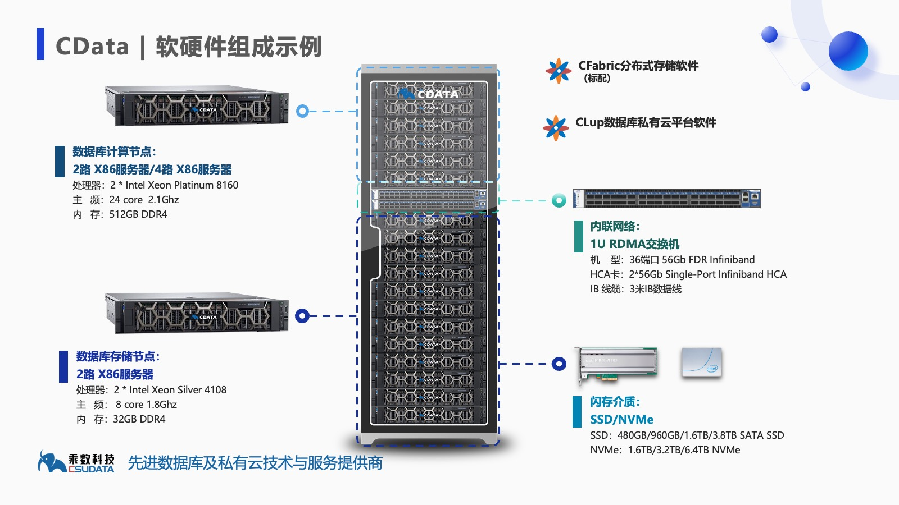
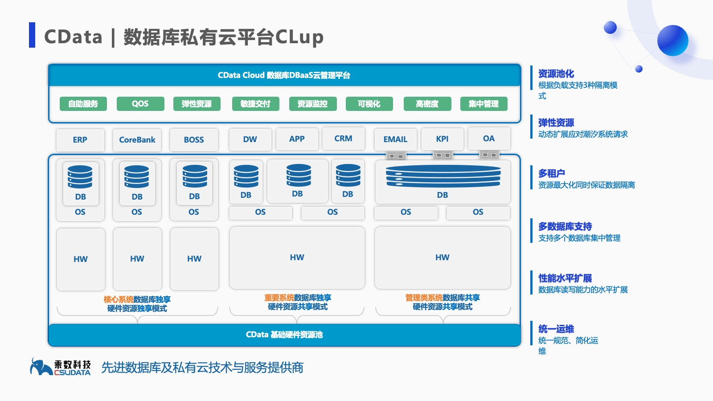
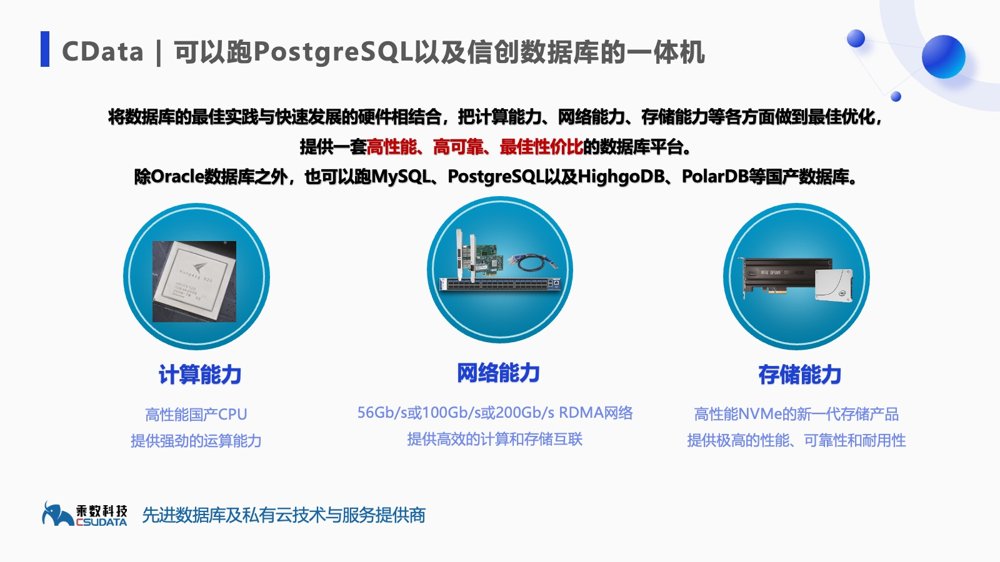
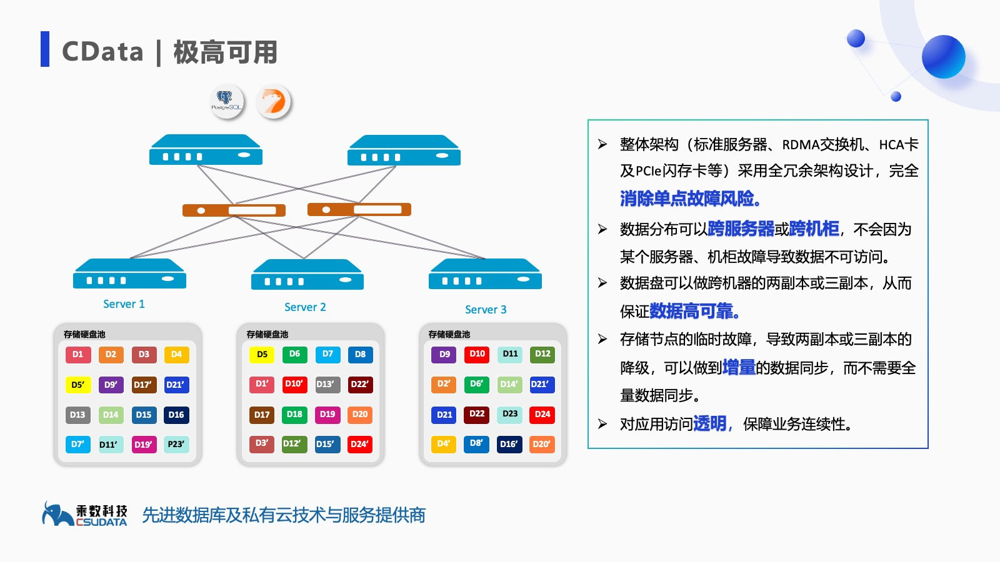
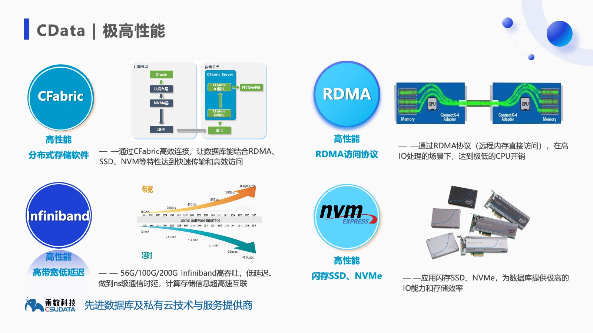
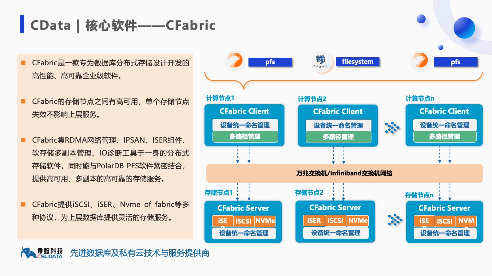
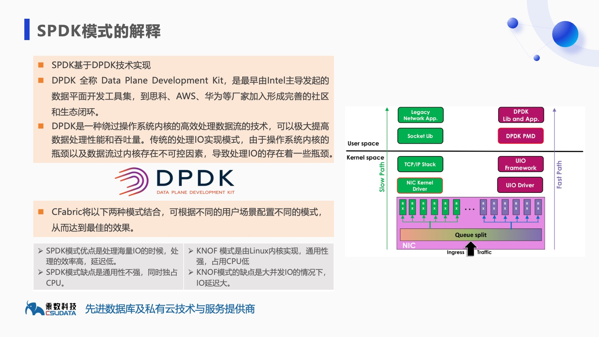

## 前阿里高管创业 | 瞄准国产信创数据库一体机  
            
### 作者            
digoal            
            
### 日期            
2025-07-03           
            
### 标签            
PostgreSQL , PolarDB , DuckDB , 阿里高管 , 创业 , 数据库一体机 , 国产数据库 , 信创 , 开源 , 维保 , 杠杆 , 十年磨一剑 , 产品 , 人     
            
----            
            
## 背景     
前阿里高管老唐创业10周年. 活下来了, 现金流很健康, 创业初期大家都不看好他做的Oracle+PG数据库维保小生意, 都以为他是青铜, 结果人家是黄金斗士.   
  
当初小看他的人都后悔了, 怎么也没想到他瞄准的是“国产信创数据库一体机”这块难啃的骨头.   
    
---  
  
## 一、老唐传奇  
  
唐成(网名 osdba), 中启乘数创始人, 一个热爱操作系统技术的DBA, 数据库圈的人应该不陌生.   
  
《PostgreSQL修炼之道, 从小工到专家》 作者, 这本书也是读者深入学习PostgreSQL的必备读物之一.   
  
前阿里巴巴、前网易、前顺丰数据库资深研发型DBA、为数不多既能干DBA又能干数据库内核开发的国宝级专家之一.   
  
2009年, 在阿里B2B开发了一套NAS管理系统FS3（简称富士山）.   
  
2012年, 在网易开发了类似亚马逊的块存储EBS的NBS, 成为网易云数据库块存储的标准件.   
  
2018年, 开发了分布式存储软件CFabric, 支持了用户4+10（即4个计算节点，10个存储节点）的Oracle数据库一体机.   
  
老唐在阿里、网易等大厂的经历给他在未来数据库行业创业打下了坚实的技术基础:    
- 分布式块存储研发. 是数据库高性能、高弹性、高可靠稳定运行的坚实底座.    
- 大规模数据库集群管理、优化、诊断等经验.   
- 去O经历. 熟练掌握Oracle习性和去O的经验, 可以为企业量身定做去O咨询方案.   
  
2015年, 在阿里成功去O若干年后? 由于看到了国产数据库的未来, 选择了国产数据库赛道进行创业(当时还没信创的说法).    
  
数据库是一个很卷的赛道, 要做好长期战斗的打算, 在没有健康现金流的情况下, 靠资本杠杆盲目扩张, 虽能风光一时, 但不管创始人有多牛x, 也非常容易死在资金链断裂上.    
  
我认识老唐将近20年, 老唐是一个非常踏实的人. 也非常有情怀(PS: 和我熟悉的人都非常有情怀, 可能人以类聚吧, 抓住一切机会给自己脸上贴金), 自老唐创业之后, 几乎每届PostgreSQL中文社区的年会, 他多少多都会赞助. 今年估计也不例外(不小心暴露了拉赞助的小心思, 戴高帽是我的惯用手法).    
  
老唐创业的经营策略非常符合我对他踏实性格的判断, 老唐首先通过Oracle、PostgreSQL维保服务给公司建立了良好的口碑和健康的财务基础.    
  
维保服务的利润虽没有数据库产品那么高, 但好在研发投入成本低、用户复购率高、现金流健康. 创业初期选择维保服务进行切入, 是非常明智的选择.    
  
有了健康的现金流, 才能摆脱资本的左右, 持续支持产品研发.    
  
十年磨一剑, 一边搞钱搞口碑, 另一边经过产品侧的不断深根, 乘数2018年开始陆续推出了如下产品:    
- 2018年推出数据库生命周期管理产品CLup(可以理解为私有化RDS)  
- 2020年推出了数据库备份产品CBackup  
- 同年推出加持黑科技于一身的数据库一体机CData  
- 2024年CData正式支持PolarDB数据库  
- 还有数据增量同步产品、虚拟机管理、连接池、数据库高性能块存储、数据库运维及咨询服务等.   
  
乘数推出的一体机, 不仅可以运行Oracle, 同时还可以运行MySQL, PostgreSQL生态的开源及国产数据库产品(包括阿里云PolarDB、HighgoDB等产品).  
  
由于现在各个行业都在替换Oracle, 而尤以PostgreSQL系国产信创的替换最为成功(丝滑、改动少、稳定性高)备受用户喜爱.   
  
使用CData数据库一体机, 去O之前可以跑Oracle, 去O的过程中可以同时跑Oracle和国产信创数据库(包括阿里云PolarDB、HighgoDB等产品)及开源PostgreSQL, 去O之后可以完全跑国产信创数据库(包括阿里云PolarDB、HighgoDB等产品)及开源PostgreSQL.   
  
一体机硬件资源一点都不会浪费. 同时在使用中给企业带来了极大便利. 不需要买多套管控产品. 节省了成本, 也提升了利用效率.   
  
<b> 不得不说, 老唐不仅技术牛x, 商业眼光也是毒辣!  </b>  
  
看到这里, 你一定会说, 一体机有啥难搞的? 不就是硬件加几个软件缝合么.   
  
还真没那么简单, 既要稳定性、又要性能、还要安全性、弹性. 简单缝合是做不到的, 还需要大量的黑科技.    
  
不然Oracle一体机为啥卖那么贵呢? 用户又不是傻子!   
  
我看完了CData的介绍之后, 发现了一些黑科技, 下面跟大家分享一下.    
  
---  
  
## 二、CData 黑科技  
  
CData一体机的计算层采用高性能国产或x86服务器; 内联网络层根据用户的性能要求, 可以采用万兆或Infiniband交换机, 提供内联高速传输; 存储层采用标准机架式服务器, 数据存储采用Nvme闪存技术提供高速IO输出. 同时使用CFabric高性能存储软件作为数据库的块设备, 为数据库提供高带宽、低延迟的IO访问.   
  
  
  
界面简洁, 但是功能专业的CLup, 用于日常的一体机服务器配置、存储配置、资源池化管理、数据库生命周期管理、日常运维等.   
  
  
  
### 极致灵活性  
  
首先, 我认为CData最大的创新是克服了不同数据库的管理偏差, 将Oracle、MySQL、PostgreSQL、PolarDB、HighgoDB整合到了一套一体机集群中, 大大降低了用户的采购成本, 同时在一套系统中进行管理也极大降低了用户的运维成本.    
  
  
  
### 极高可用性  
  
可用性简直无懈可击:   
  
整体架构（标准服务器、RDMA交换机、HCA卡及PCIe闪存卡等）采用全冗余架构设计，完全消除单点故障风险。  
  
数据分布可以跨服务器或跨机柜，不会因为某个服务器、机柜故障导致数据不可访问。  
  
数据盘可以做跨机器的两副本或三副本，从而保证数据高可靠。  
  
存储节点的临时故障，导致两副本或三副本的降级，可以做到增量的数据同步，而不需要全量数据同步。  
  
对应用访问透明，保障业务连续性。  
  
  
  
### 极高性能  
  
从底层SSD硬件到网络设备、网络协议再到分布式块设备, 提供了全链路解决方案, 最终使IO达到了极高性能.  
  
应用闪存SSD、NVMe，为数据库提供极高的IO能力和存储效率  
  
56G/100G/200G Infiniband高吞吐，低延迟。做到ns级通信时延，计算存储信息超高速互联  
  
通过RDMA协议（远程内存直接访问），在高IO处理的场景下，达到极低的CPU开销  
  
通过CFabric高效连接，让数据库能结合RDMA、SSD、NVM等特性达到快速传输和高效访问  
  
  
  
  
  
  
  
CFabric集RDMA网络管理、IPSAN、ISER组件、软存储多副本管理、IO诊断工具于一身的分布式存储软件，同时能与PolarDB PFS软件紧密结合，提供高可用、多副本的高可靠的存储服务。  
  
阿里云 PolarDB 是一款采用存算分离架构的兼容 PostgreSQL 的云原生数据库, 由于有多种黑科技的加持(参见阿里云数据库历年发布的顶会论文)在云上号称性能怪兽, 同时近几年 PolarDB 提供了开源版( https://github.com/ApsaraDB/PolarDB-for-PostgreSQL ) , 通过了国测的线下输出商业软件版( 传统授权License的方式使用 ). 但是用户自己安装部署 PolarDB 很难达到云服务版本的性能.   
  
如果说 PolarDB 是数据库领域的性能怪兽, 那么只有使用了CData, 才能彻底释放PolarDB的怪兽潜能.    
  
---  
  
## 三、总结  
<b> 用第一性原理来解释, 选择产品就是选择公司产品背后的核心掌舵人. 老唐这个人两个字: 踏实. 老唐的产品CData一个字: 稳. </b>    
  
  
国产信创数据库一体机, 不能错过CData.  
  
Oracle+国产信创数据库混合一体机, CData可能是目前市面上唯一的选择.  
  
老唐也代理了一些优秀靠谱的国产信创数据库产品: 例如阿里云PolarDB、HighgoDB.   
  
心动了? 想体验一下? 他们提供了开源的版本可供试用: https://www.csudata.com/csu_zq_opensource    
  
想和CData商务聊聊? 找对人, 老唐可以跟你聊上3天3夜!     
  
<b> 个人点评: 由于技术栈的差异, 国产数据库在未来还有大量DBA类型的人才空缺. 随着国产数据库的市场占有率逐渐反超传统商业数据库, 国产数据库维保这块巨大的市场大有可为, 但现在还没有出现从技术能力、服务能力到市场占有率都比较高的独角兽型的企业, 拭目以待吧! </b>  
  
  
#### [期望 PostgreSQL|开源PolarDB 增加什么功能?](https://github.com/digoal/blog/issues/76 "269ac3d1c492e938c0191101c7238216")
  
  
#### [PolarDB 开源数据库](https://openpolardb.com/home "57258f76c37864c6e6d23383d05714ea")
  
  
#### [PolarDB 学习图谱](https://www.aliyun.com/database/openpolardb/activity "8642f60e04ed0c814bf9cb9677976bd4")
  
  
#### [PostgreSQL 解决方案集合](../201706/20170601_02.md "40cff096e9ed7122c512b35d8561d9c8")
  
  
#### [德哥 / digoal's Github - 公益是一辈子的事.](https://github.com/digoal/blog/blob/master/README.md "22709685feb7cab07d30f30387f0a9ae")
  
  
#### [About 德哥](https://github.com/digoal/blog/blob/master/me/readme.md "a37735981e7704886ffd590565582dd0")
  
  

  
