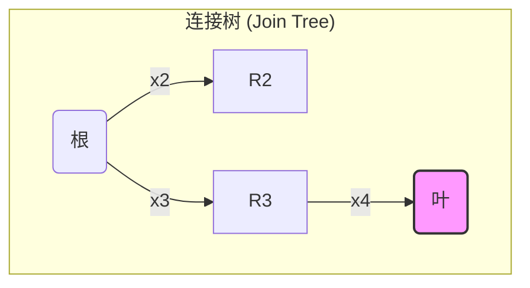

## AI论文解读 | Yannakakis+ : Practical Acyclic Query Evaluation with Theoretical Guarantees
        
### 作者        
digoal        
        
### 日期        
2025-07-04       
        
### 标签        
PostgreSQL , PolarDB , DuckDB , AI , 论文解读        
        
----        
        
## 背景  
      
https://arxiv.org/pdf/2504.03279        
  
      
提示:        
```        
读懂《Yannakakis+ : Practical Acyclic Query Evaluation with Theoretical Guarantees》这篇论文需要提前掌握哪些基础知识, 请使用中文给我讲一下这些基础知识, 尽量通熟易懂, 可以使用markdown支持的图形增加解释性.        
        
使用中文通熟易懂的解读《Yannakakis+ : Practical Acyclic Query Evaluation with Theoretical Guarantees》这篇论文, 关键内容请深入讲解, 可以使用markdown支持的图形增加解释性.        
        
使用中文提取《Yannakakis+ : Practical Acyclic Query Evaluation with Theoretical Guarantees》论文中一些重要的术语并详细解释, 可以使用markdown支持的图形示增加解释性.        
```        
        
## 1 前置知识 
  
好的，非常乐意为您梳理阅读这篇论文《Yannakakis+: Practical Acyclic Query Evaluation with Theoretical Guarantees》所需的背景知识。

这篇论文的核心是**改进一个经典的数据库理论算法（Yannakakis 算法），使其在真实世界的数据库系统（如 SQL 引擎）中变得实用且高效**。

为了完全理解这篇论文的精髓，您需要掌握以下几个方面的基础知识。我会尽量用通俗易懂的语言，并配合图示来解释。

-----

### 1\. 关系数据库与 SQL 基础 (Relational Databases & SQL)

这是最基础的知识。您需要知道：

  * **关系 (Relation)**：可以简单理解为一张**表 (Table)**。
  * **元组 (Tuple)**：表中的一**行 (Row)** 数据。
  * **属性 (Attribute)**：表中的一**列 (Column)**。
  * **SQL 操作**：对这些表进行操作的语言。尤其是 `SELECT`（选择列）、`FROM`（指定表）、`WHERE`（过滤行）、`JOIN`（连接表）和 `GROUP BY`（分组聚合）。

这篇论文讨论的所有查询最终都会被表达为 SQL 或类似的数据库操作。

### 2\. 核心概念：连接查询 (Conjunctive Queries, CQs)

这是论文研究的核心对象，非常重要。

  * **是什么？**
    可以通俗地理解为一种“纯连接”查询。它的结构主要是 `SELECT-FROM-WHERE`，并且 `WHERE` 子句中的所有条件都是通过 `AND` 连接的。它不包含 `OR`、`NOT` 或子查询的否定等复杂逻辑。

  * **示例**：
    比如，查询“购买了蓝色商品的所有订单和顾客国籍”：

    ```sql
    SELECT Customer.name, Order.date, Nation.name
    FROM Customer
    JOIN Order ON Customer.c_id = Order.c_id
    JOIN Nation ON Customer.c_nation = Nation.n_id
    WHERE Order.item_color = 'blue' AND Order.price > 100;
    ```

    这个查询就是将 `Customer`, `Order`, `Nation` 三张表通过 `AND` 型的连接条件组合起来。

  * **数学表示**：
    论文中用 $Q = \\pi\_{O}(R\_{1} \\bowtie R\_{2} \\bowtie \\dots \\bowtie R\_{n})$ 来表示。

      * $R\_i$ 代表一张张表。
      * $\\bowtie$ (bowtie) 符号代表**连接 (Join)** 操作。
      * $\\pi\_O$ (pi) 符号代表**投影 (Projection)** 操作，相当于 `SELECT` 出最终需要的列。

### 3\. 关键分类：无环查询与连接树 (Acyclic Queries & Join Trees)

这是论文标题中的关键词 `Acyclic` 的来源，也是理解 Yannakakis 算法的前提。

  * **直观理解**：
    一个连接查询是**无环的 (Acyclic)**，如果表之间的连接关系没有形成一个“环”。反之则为有环的 (Cyclic)。

  * **图示解释**：
    我们可以把表看作点，把连接关系看作边。

    ```mermaid
    graph TD
        subgraph "无环查询 (Acyclic Query)"
            A[用户 User] -- o_uid --- B(订单 Order)
            B -- o_pid --- C(商品 Product)
            C -- p_sid --- D(供应商 Supplier)
        end

        subgraph "有环查询 (Cyclic Query)"
            E[学生 Student] -- s_id --- F(课程 Course)
            F -- c_id --- G(教师 Teacher)
            G -- t_id --- E
        end
    ```

    左边的查询像一棵树或一条链，是无环的。右边的查询中，学生选了课，课由老师教，老师又教这个学生，形成了一个环。Yannakakis 算法及其改进版主要处理**无环查询**。

  * **连接树 (Join Tree)**：
    判断一个查询是否无环的正式方法是看它能否构建一个**连接树**。连接树需要满足两个条件：

    1.  树中的每个节点唯一对应查询中的一张表。
    2.  对于查询中的**任何一个属性**（比如 `user_id`），包含这个属性的所有节点在树上必须是**连通的**（不能断开）。

    第二个条件是关键。如果一个查询是有环的，你将无法构造出满足这个条件的树。

### 4\. 理论基石：Yannakakis 算法

这是论文要改进的原始算法。

  * **目标**：高效地计算无环连接查询。

  * **核心思想**：分两步走，避免产生巨大的中间结果。

    1.  **数据清理 (Reduce Phase)**：在进行真正的连接（Join）之前，先用一系列的**半连接 (Semi-Join)** 操作把所有“无用”的数据清理掉。
          * **什么是半连接 ($R\_1 \\ltimes R\_2$)？** 结果是 $R\_1$ 中那些能在 $R\_2$ 中找到连接伙伴的行。它像一个过滤器，用 $R\_2$ 来过滤 $R\_1$，但结果的列结构仍然是 $R\_1$ 的。
          * 这个算法会从连接树的叶子节点开始向上（Post-order traversal），再从根节点向下（Pre-order traversal），用半连接反复清理，直到所有表中剩下的每一行数据都保证能在其他表中找到最终的匹配，消除了所有**悬浮元组 (dangling tuples)**。
    2.  **构建结果 (Join Phase)**：在清理过的数据上进行连接，此时由于没有了无用数据，计算会快得多。

  * **问题**：虽然理论上很优美，但半连接的次数很多，其“隐藏常数”大，在实际数据库中跑起来可能比数据库自己优化的标准连接计划还要慢。**这正是 Yannakakis+ 论文要解决的痛点。**

### 5\. 性能衡量：算法复杂度分析

论文中充满了 $O()$ 符号，你需要理解它们的基本含义。

  * **关键变量**：

      * $N$：输入数据总量，即所有表大小的总和。
      * $M$：最终查询结果的大小（行数）。
      * $F$：完全连接（Full Join）后、最终投影前的中间结果大小。 $F$ 往往远大于 $N$ 和 $M$。

  * **重要的复杂度**：

      * $O(N+M)$：**线性时间复杂度**。这是最理想的情况。意味着算法的运行时间只和输入、输出数据量有关，与复杂的中间过程无关。Yannakakis 算法能为一类叫**自由连接 (free-connex)** 的特殊无环查询达到这个效果。
      * $O(min(NM, F))$：对于一般的无环查询，这是 Yannakakis 算法能达到的最优保证。这个复杂度也远优于朴素连接可能产生的 $O(N^k)$ 级别的灾难性结果。

    Yannakakis+ 算法的核心贡献之一是，它在**保持这些优秀理论时间复杂度的同时，大大降低了实际运行时间**。

### 6\. 实践落地：查询优化 (Query Optimization)

为了让算法在实际中可用，需要一个优化器。

  * **基于成本的优化 (Cost-Based Optimization, CBO)**：这是现代数据库的核心。优化器会：

    1.  **枚举计划 (Plan Enumeration)**：生成多种可能的执行方式（比如不同的连接树、不同的连接顺序）。
    2.  **基数估计 (Cardinality Estimation)**：猜测每一步操作会产生多少行数据。
    3.  **成本建模 (Cost Model)**：根据估算出的数据量，计算每个计划的总成本（时间、I/O等）。
    4.  最后选择成本最低的计划去执行。

    论文中提到，他们为 Yannakakis+ 设计了专门的优化器，因为它的执行计划空间和传统数据库不一样。

-----

### 总结

为了读懂这篇论文，您的知识体系应该像一个金字塔：

  * **塔基 (最基础)**：了解 SQL 和关系数据库的基本操作。
  * **塔身 (核心理论)**：深刻理解**连接查询 (CQ)**、**无环**的概念以及其**连接树**表示法。
  * **塔尖 (算法细节)**：掌握 **Yannakakis 算法**的核心思想（半连接清理）和其**复杂度** ( $O(N+M)$ )。
  * **外部支撑 (实践背景)**：了解数据库**查询优化**的基本流程（成本估算、计划选择）。

当您掌握了这些知识后，再去看论文中如何通过**减少半连接次数、提早进行聚合**等技巧来改进 Yannakakis 算法，并设计相应的优化器来选择最佳计划，就会豁然开朗了。
  
## 2 解读论文 
  
好的，我们来一起深入解读这篇非常重要的数据库论文——《Yannakakis+: Practical Acyclic Query Evaluation with Theoretical Guarantees》。

 这篇论文的核心目标可以概括为一句话：**让一个沉睡了40年、理论上非常优秀但实践中无人问津的经典算法（Yannakakis算法），真正变得实用、高效，并能轻松地“即插即用”到任何现代SQL数据库引擎中**  。

-----

### 一、背景：一个理论与实践的“巨大鸿沟”

首先，我们需要理解这篇论文要解决的问题。

 在数据库中，尤其是数据分析场景下，大量查询都是**无环连接查询 (Acyclic Conjunctive Queries)**  。例如，一个典型的订单分析查询可能会连接客户、订单、商品、供应商等多个表，这些表之间的连接关系就像一棵树，没有形成环路。

 对于这类查询，早在1981年，Mihalis Yannakakis就提出了一个同名算法  。

**Yannakakis 算法的优点 (理论上)：**

  *  **超强的最坏情况运行时间保证**：对于一类被称为“自由连接 (free-connex)”的查询，它能做到 $O(N+M)$ 的时间复杂度，其中 $N$ 是输入数据大小， $M$ 是输出结果大小   。这是理论上的最优解，因为它意味着执行时间只跟读入和写出的数据量有关。对于更一般的无环查询，它也能保证 $O(min(NM, F))$ 的优秀性能（ $F$ 是全连接的中间结果大小 ）  。
  *  **核心思想**：通过大量的**半连接 (Semi-Join)** 操作，在进行昂贵的完全连接 (Full-Join) 之前，就将所有无法产生最终结果的“悬浮元组 (dangling tuples)”全部剔除  。

**Yannakakis 算法的缺点 (实践中)：**

  *  **隐藏的巨大成本**：尽管理论复杂度低，但它需要执行非常多轮的半连接操作，这些操作本身会带来巨大的开销（比如多次数据扫描、创建临时视图等）  。
  *  **对“简单”查询水土不服**：在很多常见的场景下，比如表之间通过主外键（PK-FK）连接，数据本身就很“干净”，悬浮元组很少。这时，数据库引擎自带的简单连接计划反而更快，而Yannakakis算法的复杂操作就成了累赘，性能甚至会倒退  。

 这导致了一个长达40年的尴尬局面：理论家们高度评价Yannakakis算法，但实际的数据库系统（如PostgreSQL, SparkSQL等）中却无人采用它  。

### 二、核心贡献：Yannakakis+ 算法是如何填补鸿沟的

 Yannakakis+ 通过一系列精巧的改进，完美解决了原版算法的实践难题。它保留了所有理论优点，同时在实际性能上远超原版和数据库原生计划  。

其核心思想可以概括为：**“非必要，勿半连接；能聚合，就先聚合”**。它将计算过程分为两轮：

#### **第一轮：后序遍历与聚合下推 (Post-order Traversal)**

这一轮是Yannakakis+性能提升的关键。算法会沿着连接树进行一次后序遍历（即从叶子节点到根节点），在遍历过程中，它会做出智能的判断：



  *  **智能聚合与剪枝**：当处理一个节点（比如上图的`R4`）时，如果这个节点上的数据聚合后就可以并入父节点（`R3`），并且不会影响最终结果的正确性（比如`R4`中没有唯一的输出属性），Yannakakis+会**立即执行聚合-连接操作**，然后将该节点从树中移除   。这大大减少了后续需要处理的数据量，因为聚合操作通常能极大地压缩数据  。
  *  **减少半连接**：原版算法不管三七二十一，会对所有边都执行多轮半连接。而Yannakakis+只在万不得已时才使用半连接  。
  * **特殊查询类型的优化**：
      *  **关系主导 (Relation-dominated) 查询**：如果所有输出属性都来自一个表，Yannakakis+ 甚至**完全不需要半连接**，仅通过第一轮计算就能在 $O(N)$ 时间内得出结果  。
      *  **自由连接 (Free-connex) 查询**：经过第一轮计算后，查询会转化为一个只包含输出属性的“全连接”查询  。这为第二轮的高效计算铺平了道路。

 **小结**：第一轮计算通过“机会主义”地提前聚合和避免不必要的半连接，极大地降低了计算开销，这是其性能超越原版算法的核心原因之一  。

#### **第二轮：迭代规约 (Iterative Reduction)**

如果第一轮过后，连接树上还剩下多个节点，就需要进入第二轮。

  *  **处理自由连接查询**：由于第一轮后查询已变为“全连接”，第二轮的每次连接操作的中间结果大小都被证明可以被最终输出大小 $M$ 所限制   。因此，可以放心地按照连接树的结构，从根节点开始，逐一将子节点连接并规约，最终得到结果。整个过程的复杂度被控制在 $O(M)$  。

  * **处理一般无环查询**：对于更复杂的情况，查询中可能还存在非输出的连接属性。这时，可能无法直接进行连接规约。Yannakakis+的做法是：

    1.   首先找到一个 **“无悬浮” (dangling-free)** 的关系（根节点在第一轮后必然是无悬浮的）  。
    2.   检查它的邻居是否 **“可规约” (reducible)**  。
    3.   如果找不到可规约的邻居，**只在此时**，才针对性地执行一次半连接，让一个邻居也变成无悬浮状态，从而使其父节点变为可规约  。
    4.  然后执行连接规约，重复此过程。

**与原版的对比：**
 原版Yannakakis算法在TPC-H Q9（5副本数据集）上执行了**10次**半连接。而Yannakakis+经过优化后，**仅需3次**，并且还将3个聚合-连接操作提前到了半连接之前，最终运行时间从21.1秒缩短到了13.2秒，效果显著  。

### 三、锦上添花：为 Yannakakis+ 量身定制的查询优化器

 理论上，对于一个无环查询，可能存在多个合法的连接树，不同的树会导致Yannakakis+计划的实际性能差异巨大  。因此，选择一棵“最优”的连接树至关重要。

 为此，论文设计了一个专属的查询优化器  。

  * **基于规则的优化 (Rule-Based Optimization)**：利用一些启发式规则快速优化。

      *  **主外键优化**：如果连接是PK-FK连接，很多半连接和聚合操作都可以被安全地省略掉，因为数据完整性已经由主外键约束保证了  。
      *  **注解剪枝**：论文的聚合模型需要为每个关系附加一个“注解”列，但优化器能识别出哪些表的注解是多余的（比如恒为1），并将其移除，这在列存数据库中能节省大量成本  。
      *  **环消除**：利用PK-FK关系，可以将一些看似“有环”的查询转化为无环查询处理  。

  * **基于成本的优化 (Cost-Based Optimization)**：

    1.   **计划枚举**：使用GYO算法等技术，为给定的无环查询生成所有可能的连接树  。
    2.   **成本估算**：利用数据库的统计信息（如表的行数、不同值的数量等）来估算每个连接树生成的Yannakakis+计划的执行成本  。
    3.  **选择最优**：选择成本最低的计划。

     一个重要的优点是，Yannakakis+计划的性能对基数估算的错误**不敏感**   。传统计划中，一个估算错误可能导致性能从 $O(N)$ 恶化到 $O(N^2)$；而对于Yannakakis+，最坏也只是常数级别的性能差异  。

### 四、实验结果与结论

实验结果非常惊人，充分证明了Yannakakis+的成功：

  *  **全面超越原版**：在各种查询和数据集上，Yannakakis+稳定地比原版Yannakakis算法快**2到5倍**  。
  *  **碾压原生数据库**：在测试的162个查询中，Yannakakis+在160个上都比数据库原生优化器（如DuckDB, PostgreSQL）生成的计划要快  。
  *  **惊人的峰值性能**：平均加速比为2.41倍，最大加速比高达**47,059倍**   。这种巨大提升主要出现在包含复杂多对多连接的图查询和社交网络分析上  。
  *  **稳健性**：在简单的PK-FK查询上（如TPC-H），它也能通过优化避免性能衰退，解决了原版算法的“水土不服”问题  。
  *  **通用性**：该方法被实现为一个独立的“查询重写器”，可以将最优计划翻译成一系列SQL语句，从而轻松地应用在任何支持标准SQL的引擎上  。

**总而言之，Yannakakis+是一项里程碑式的工作。它不仅提出了一个更优的算法，更重要的是，它成功地搭建了一座桥梁，将一个尘封已久的、强大的理论算法，安全、高效、稳健地带入了现代数据处理的实践中，解决了数据库领域一个长达40年的理论与实践脱节的问题。**
  
## 3 术语  
  
好的，这是对论文《Yannakakis+: Practical Acyclic Query Evaluation with Theoretical Guarantees》中一些核心术语的提取和详细解释。

-----

### 1\. 连接查询 (Conjunctive Queries, CQs)

这是整篇论文研究的基础对象。

  *  **定义**：CQs 指的是一类由选择、投影和连接操作构成的查询   。在SQL中，它们通常表现为`SELECT-FROM-WHERE`结构，且`WHERE`子句中的条件仅由`AND`连接   。论文中也讨论了包含聚合（如 `SUM`, `COUNT`）的CQs，并通过一种被称为 **半环 (Semiring)** 的数学框架来统一处理这些聚合操作  。
  *  **数学表示**：论文中常使用 $Q=\\pi\_{O}(R\_{1}(\\mathcal{H}\*{1})\\bowtie R*{2}(\\mathcal{H}\*{2})\\bowtie\\cdot\\cdot\\cdot\\bowtie R*{n}(\\mathcal{H}\*{n}))$ 来表示   。其中， $\\pi*{O}$ 是投影（`SELECT`）， $\\bowtie$ 是自然连接（`JOIN`）， $R\_i$ 是关系（表）  。

### 2\. 无环查询 (Acyclic Queries) 与 连接树 (Join Tree)

这是Yannakakis算法及其改进版适用的一类关键查询。

  *  **定义**：一个CQ是**无环的**，前提是存在一棵满足特定条件的**连接树 (Join Tree)**  。

  *  **连接树 (Join Tree)**：它是一棵树状结构，需要满足两个核心属性  ：

     1.   树的节点与查询中的关系（表）一一对应  。
     2.   对于查询中的任意一个属性（例如 `product_id`），所有包含这个属性的树节点在树上必须形成一个 **连通的子树** 。这意味着它们不能被不包含该属性的节点隔开。

  * **图示解释**：

    ```mermaid
    graph TD
        subgraph "无环查询 (Acyclic) - 可构建连接树"
            A[Orders] -- o_customerkey --> B(Customer)
            A -- o_partkey --> C(Part)
            C -- p_suppkey --> D(Supplier)
        end

        subgraph "有环查询 (Cyclic) - 无法构建连接树"
            E["R1(x,y)"] -- y --> F("R2(y,z)")
            F -- z --> G("R3(z,x)")
            G -- x --> E
        end
    ```

    左侧的查询是无环的，因为表之间的关系没有形成回路，可以轻松构建连接树。右侧的查询中， $R\_1, R\_2, R\_3$ 形成了一个三角形的环，无法构建出满足条件的连接树。

### 3\. 自由连接查询 (Free-connex CQs)

这是无环查询的一个重要子类，拥有最优的理论性能。

  *  **定义**：一个无环查询是**自由连接**的，如果它的输出属性在连接树上表现出良好的“聚集”特性   。论文中给出了一个等价定义：查询存在一个连接树，该树包含一个以根为起点的连通子集（称为 connex subset），并且这个子集内的连接属性都属于输出属性  。
  *  **重要性**：对于自由连接查询，Yannakakis 和 Yannakakis+ 算法都能达到 $O(N+M)$ 的运行时间，这是理论上的最优解  。

### 4\. 关系主导查询 (Relation-dominated CQs)

这是自由连接查询的一个更简单、更特殊的子类。

  *  **定义**：一个无环查询是**关系主导**的，如果它的所有输出属性（`SELECT`子句中的列）都包含在**某一个**关系（表）中  。
  *  **重要性**：对于这类查询，Yannakakis+ 算法极其高效，仅通过第一轮计算（无需任何半连接）就可以在 $O(N)$ 时间内完成，大大简化了流程  。

### 5\. 悬浮元组 (Dangling Tuples)

这是传统查询计划中导致性能低下的一个主要原因。

  *  **定义**：指在连接过程中的一个中间元组（行），它无法与后续的任何表成功连接，因此对最终结果没有任何贡献  。
  *  **问题**：这些“无用”的元组会极大地膨胀中间结果集的大小，白白消耗计算和内存资源  。例如，一个订单表中的某条记录，其对应的商品ID在商品表中不存在，那么这条订单记录在与商品表连接时就是悬浮的。
  *  **解决方法**：Yannakakis算法的核心思想之一就是通过**半连接**来提前消除所有悬浮元组  。

### 6\. 半连接 (Semi-Join, 符号: $\\ltimes$)

这是Yannakakis和Yannakakis+算法中使用的关键操作符。

  *  **定义**： $R\_1 \\ltimes R\_2$ 操作返回 $R\_1$ 中那些能够在 $R\_2$ 中找到至少一个匹配的元组  。
  *  **作用**：它相当于用 $R\_2$ 作为过滤器来“清洗” $R\_1$，剔除 $R\_1$ 中的悬浮元组   。重要的是，其结果的列结构和注解（用于聚合计算的值）完全保留 $R\_1$ 的，不受 $R\_2$ 的影响  。

### 7\. 复杂度分析变量 (N, M, F)

论文通篇使用这三个变量来衡量算法的性能。

  *  **N (Input Size)**：输入数据大小，即查询涉及的所有表大小的总和  。
  *  **M (Output Size)**：最终查询结果的大小，即返回的元组（行）数量  。
  *  **F (Full Join Size)**：完全连接大小，指在不进行任何优化的情况下，所有表直接连接后、进行最终投影和聚合前的中间结果大小  。通常情况下， $F$ 会远大于 $N$ 和 $M$。

### 8\. 广义超树分解 (Generalized Hypertree Decomposition, GHD)

这是论文提到的用于处理更复杂的**有环查询**的技术。

  *  **定义**：GHD是一种将有环查询分解为无环结构的技术   。它将原始查询中的关系（表）分组到不同的“包 (bags)”中，这些包作为节点构成一棵树（广义连接树）  。
  *  **作用**：通过GHD，一个有环查询可以被转化为一个等价的无环查询。之后，就可以应用Yannakakis+算法来高效地评估这个转化后的查询  。
  
## 参考        
         
https://arxiv.org/pdf/2504.03279  
        
        
<b> 以上内容基于DeepSeek、Qwen、Gemini及诸多AI生成, 轻微人工调整, 感谢杭州深度求索人工智能、阿里云、Google等公司. </b>        
        
<b> AI 生成的内容请自行辨别正确性, 当然也多了些许踩坑的乐趣, 毕竟冒险是每个男人的天性.  </b>        
  
  
