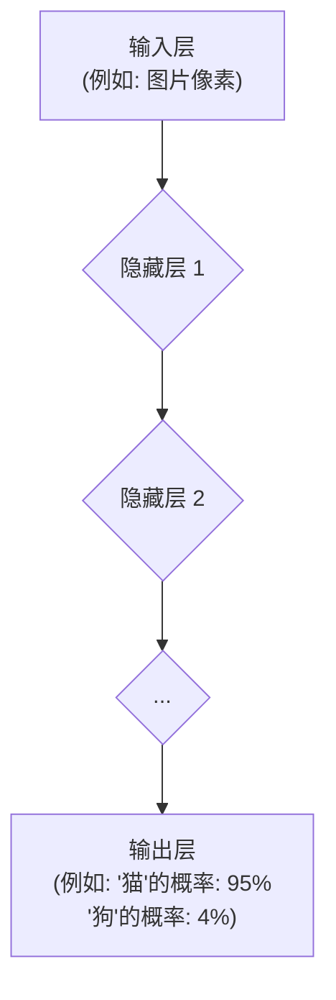
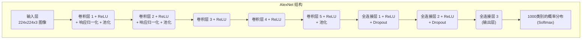

## AI论文解读 | ImageNet Classification with Deep Convolutional Neural Networks
        
### 作者        
digoal        
        
### 日期        
2025-07-04       
        
### 标签        
PostgreSQL , PolarDB , DuckDB , AI , 论文解读        
        
----        
        
## 背景  
      
https://dl.acm.org/doi/pdf/10.1145/3065386        
  
      
提示:        
```        
读懂《ImageNet Classification with Deep Convolutional Neural Networks》这篇论文需要提前掌握哪些基础知识, 请使用中文给我讲一下这些基础知识, 尽量通熟易懂, 可以使用markdown支持的图形增加解释性.        
        
使用中文通熟易懂的解读《ImageNet Classification with Deep Convolutional Neural Networks》这篇论文, 关键内容请深入讲解, 可以使用markdown支持的图形增加解释性.        
        
使用中文提取《ImageNet Classification with Deep Convolutional Neural Networks》论文中一些重要的术语并详细解释, 可以使用markdown支持的图形示增加解释性.        
```        
        
## 1 前置知识 
  
 好的，为了读懂这篇开创性的论文《ImageNet Classification with Deep Convolutional Neural Networks》（通常被称为 "AlexNet" 论文），你需要了解一些机器学习和神经网络的基础知识。这篇论文之所以重要，是因为它在2012年极大地推动了深度学习在计算机视觉领域的应用  。

下面我将用通俗易懂的中文，为你梳理这些必备的基础知识。

### 1\. 核心概念：人工智能、机器学习与深度学习

首先，我们需要理解这几个概念的关系。你可以把它们想象成一组套娃：

  * **人工智能 (AI)**: 最外层的娃娃，目标是让机器像人一样思考和学习。
  * **机器学习 (Machine Learning)**: 中间的娃娃，是实现AI的一种方法。它不是给机器设定好所有规则，而是让机器从“数据”中自动“学习”出规律。
  * **深度学习 (Deep Learning)**: 最里面的娃娃，是机器学习的一种技术。它使用一种叫做“神经网络”的复杂结构，尤其擅长处理海量和复杂的数据，比如图片、声音和文本。

这篇论文的核心就是使用**深度学习**技术来解决一个复杂的**机器学习**任务（图像分类），是**人工智能**领域的一个重大突破。

### 2\. 神经网络基础 (Neural Networks)

想象一下人脑是如何通过神经元的连接来识别事物的。神经网络就是受此启发而建立的数学模型。

一个最简单的神经网络包含：

  * **输入层 (Input Layer)**: 接收原始数据。例如，如果要识别一张图片，输入层就接收这张图片的像素值。
  * **隐藏层 (Hidden Layers)**: 对输入数据进行处理和转换。这些层是真正进行“学习”和特征提取的地方。“深度”学习中的“深”，就是指隐藏层非常多  。
  * **输出层 (Output Layer)**: 输出最终结果。例如，在图片分类任务中，输出层会给出图片属于各个类别的概率。




### 3\. 卷积神经网络 (Convolutional Neural Networks - CNN)

 CNN是专门为处理图像数据而设计的深度学习模型   。论文中使用的就是一个大型的CNN  。它之所以在图像处理上表现出色，是因为它有几个特殊的“组件”：

  *  **卷积层 (Convolutional Layer)**: 这是CNN的核心。它不像普通神经网络那样一次处理整张图片，而是用一个叫做“卷积核”（或“滤波器”）的小窗口去扫描整张图片。这个过程可以提取出图片中的局部特征，比如边缘、角点、纹理等  。随着网络层次的加深，后续的卷积层能将这些低级特征组合成更复杂的特征，比如眼睛、鼻子，最终到整个面部。

  *  **激活函数 (Activation Function)**: 在神经网络中，每一层计算出的结果都需要经过一个激活函数来增加网络的“非线性”能力，使其可以学习更复杂的模式。这篇论文的一大贡献是使用了 **ReLU (Rectified Linear Unit)** 这种激活函数   。相比于传统的激活函数（如tanh或sigmoid），ReLU的计算非常简单（$f(x)=max(0,x)$），它让网络的训练速度快了好几倍，使得训练论文中这样深度的网络成为可能  。

    ```mermaid
    graph TD
        subgraph "传统激活函数 (tanh)"
            direction LR
            A(( )) -- Slower Training --> B(( ))
        end
        subgraph ReLU激活函数
            direction LR
            C(( )) -- much faster training --> D(( ))
        end
    ```

     *图解：论文中的图表显示，使用ReLU（实线）的CNN比使用tanh（虚线）的收敛速度快得多*  。

  *  **池化层 (Pooling Layer)**: 通常跟在卷积层之后。它的作用是进行“下采样”，即缩小图片尺寸，从而减少计算量，并使得网络对物体在图片中的微小位移不那么敏感（即提升模型的稳健性）  。最常见的是“最大池化”（Max Pooling），即从一个小区域中取最大的值作为代表。

  *  **全连接层 (Fully Connected Layer)**: 在经过多轮卷积和池化之后，提取出的高级特征会被送入全连接层   。它的作用和普通神经网络的隐藏层类似，负责将最终学习到的特征进行整合，并映射到最终的输出，比如1000个分类的概率  。

### 4\. 核心挑战与解决方案：过拟合 (Overfitting)

 由于论文中的模型参数高达6000万个  ，一个巨大的风险就是“过拟合”。

**什么是过拟合？**
想象一个学生，他把模拟试卷上的所有题目和答案都背得滚瓜烂熟，所以在模拟考中能得满分。但一到正式考试，遇到没见过的题目就完全不会了。这就是过拟T合：模型在训练数据上表现完美，但在新的、未见过的数据上表现很差。

为了解决这个问题，论文主要用了两种强大的技术：

  *  **数据增强 (Data Augmentation)**: 这是最简单也最有效的方法之一。既然怕模型没见过新数据，那就创造更多“新”数据   。方法包括对原始图片进行随机裁剪、水平翻转   ，以及改变RGB颜色通道的强度  。这极大地扩充了训练数据集，让模型学习到更加稳健的特征。

  *  **Dropout**: 这个技术极具创新性   。在训练过程中，每一次迭代都会随机地“丢弃”（即暂时忽略）一部分神经元   。这强迫网络不能过度依赖某几个神经元的组合，而是要学习到更多样、更鲁棒的特征  。就像一个团队合作项目，如果每次开会都可能有人缺席，那么每个人都必须学会独立完成更多工作，而不是总依赖特定的搭档。

### 5\. 训练与数据集

  *  **ImageNet 数据集**: 深度学习的成功离不开“大数据”和“大算力”。ImageNet是一个拥有超过1500万张已标注高分辨率图像的超大型数据集   。正是这个数据集的出现，才使得训练像AlexNet这样复杂的模型成为可能，并证明了其强大的能力   。论文主要使用了ImageNet竞赛（ILSVRC）的一个子集，包含1000个类别和约120万张训练图片  。

  *  **GPU 加速**: 训练深度神经网络需要巨大的计算量。论文强调，若没有GPU（图形处理器）以及针对其优化的卷积运算实现，训练是不可能完成的   。一个模型的训练在当时的两块NVIDIA GTX 580 GPU上都需要5到6天的时间  。

  *  **反向传播 (Backpropagation) 和 随机梯度下降 (Stochastic Gradient Descent)**: 这是神经网络学习的“引擎”。模型会先根据输入图片给出一个预测，然后将这个预测与真实标签（比如“猫”）进行比较，得出一个“误差”。反向传播算法则负责根据这个误差，从后向前逐层计算每个参数对误差的“贡献”，并告诉它们应该如何调整自己以减小误差   。随机梯度下降（SGD）则是在这个指导下，实际去更新这些参数的过程  。

 掌握了以上这些基础知识后，你就能更好地理解论文的摘要   、架构图   以及它所阐述的各项技术的重要性和创新性了。
  
## 2 解读论文 
  
好的，我们来深入解读这篇在人工智能领域具有里程碑意义的论文——《ImageNet Classification with Deep Convolutional Neural Networks》。这篇论文介绍的模型后来被业界称为“AlexNet”，以第一作者 Alex Krizhevsky 的名字命名。

### 论文核心思想概览

这篇论文的成功可以归结为一个公式：**一个精心设计的“深”度卷积神经网络 + “大”数据 (ImageNet) + “强”算力 (GPU) + 几个关键的创新技巧 (如 ReLU 和 Dropout)**。

 它在2012年的ImageNet大规模视觉识别挑战赛（ILSVRC-2012）中，以碾压性的优势夺得冠军，其 top-5 错误率仅为15.3%，远低于第二名的26.2%   。这一成就标志着深度学习在计算机视觉领域的“王者归来”，并开启了至今仍在持续的人工智能浪潮  。

下面，我们将深入剖析论文的关键内容。

### 1\. 任务背景：ImageNet 挑战赛

要理解这篇论文的意义，首先要了解它所解决的问题的难度。

  *  **数据集**：ImageNet 是一个巨大的图像数据库，当时拥有超过1500万张由人工标注的高清图片，涵盖约22,000个类别  。
  *  **挑战赛 (ILSVRC)**：论文使用的是该竞赛的一个子集，任务是将约120万张训练图片，准确地分类到1000个不同的类别中  。这1000个类别包罗万象，从“键盘”到各种品种的“猫”、“狗”等。
  *  **评价指标**：比赛使用“top-1”和“top-5”错误率来评估模型性能  。
      * **Top-1 错误率**：指模型预测的最可能的类别不是正确答案的比例。
      *  **Top-5 错误率**：指模型预测的前五个最可能的类别里，都不包含正确答案的比例  。由于某些图像本身就存在模糊性（例如，一张图片里同时有豹猫和美洲豹），top-5错误率是一个更宽容也更常用的指标。

### 2\. 网络架构：深入解析 "AlexNet"

 AlexNet 是一个大型的深度卷积神经网络（CNN），它包含6000万个参数和65万个神经元  。其结构是成功的基石。

 网络共包含**8个需要学习的层**，分别是**5个卷积层**和**3个全连接层**  。



  *  **卷积层 (Convolutional Layers)**：前五层是卷积层，负责从图像中提取特征   。网络从初级特征（如边缘、颜色块）开始，逐层深入，到后面的层时就能识别更复杂的特征（如物体的部件乃至整个物体）  。
  *  **全连接层 (Fully Connected Layers)**：最后三层是全连接层   。它们接收由卷积层提取出的高级特征，并进行最终的分类决策  。
  *  **输出层 (Softmax)**：最后一层是一个1000维的softmax层，它会输出一个包含1000个概率值的列表，分别对应图片属于每个类别的可能性  。

### 3\. 五大关键创新与技术细节

AlexNet 的成功并不仅仅是堆叠网络层数，更重要的是引入了几个关键的创新，这些创新在今天看来已是标配，但在当时却是突破性的。

#### 3.1 激活函数：ReLU (Rectified Linear Units)

 **是什么**：ReLU 是一种神经元的激活函数，其数学表达式为 $f(x) = max(0, x)$  。
 **为什么重要**：在AlexNet之前，标准的激活函数是 `tanh` 或 `sigmoid`。这类函数在输入值过大或过小时，其导数会趋近于0（称为“饱和”），导致在网络深层进行梯度反向传播时，梯度信号变得极其微弱，使得网络训练非常缓慢。而ReLU是一种“非饱和”函数，计算简单且有效缓解了梯度消失问题  。
 **效果**：论文中的一张图明确显示，使用ReLU的CNN（实线）达到25%训练错误率的速度，比使用tanh的等效网络（虚线）**快了整整6倍**   。作者强调，如果没有ReLU，他们根本无法在如此大的网络上进行实验  。

#### 3.2 训练策略：使用多个 GPU

 **是什么**：由于当时的单个GPU（NVIDIA GTX 580）只有3GB显存，无法容纳整个网络模型   。因此，作者创造性地将网络拆分到两块GPU上进行并行训练  。
 **如何实现**：他们将一半的神经元（或卷积核）放在一块GPU上，另一半放在另一块上   。巧妙之处在于，GPU之间只在特定的层进行通信。例如，第3卷积层的卷积核会连接到第2层所有的特征图上，而第4卷积层的卷积核则只连接到位于同一块GPU上的第3层的特征图  。
 **效果**：这种双GPU并行方案不仅解决了内存限制，还降低了top-1和top-5错误率1.7%和1.2%  。

#### 3.3 防止过拟合I：数据增强 (Data Augmentation)

 **是什么**：过拟合是大型神经网络的“天敌”。为了减轻过拟合，最简单有效的方法就是人为地扩大训练数据集  。
 **如何实现**：论文中使用了两种数据增强方式，且这些操作是在CPU上实时生成的，因此几乎没有增加额外的计算成本  。

1.   **图像变换与翻转**：从原始的 256x256 图像中，随机提取 224x224 的图像块及其水平翻转版本进行训练   。这使训练集的大小增加了2048倍   。在测试时，则对左上、右上、左下、右下、中心五个图像块及其翻转版本（共10个）的预测结果进行平均，以提高准确性  。
2.   **RGB颜色通道变换**：在训练时，对整个ImageNet训练集的RGB像素值进行主成分分析（PCA）。然后，为每张训练图片叠加一个随机的、与主成分相关的颜色扰动   。这个技巧模拟了真实世界中光照颜色和强度的变化，使模型学到的特征对光照变化更具鲁棒性，将top-1错误率降低了超过1%  。

#### 3.4 防止过拟合II：Dropout

 **是什么**：Dropout 是一种高效的正则化技术   。在训练过程中，它会以0.5的概率将隐藏层中的某些神经元的输出设置为0  。
 **为什么重要**：这意味着每次向网络输入一个样本时，网络都在以一个不同的、“残缺”的架构进行训练   。这会迫使神经元不能依赖于其他特定神经元的存在，从而学习到更加独立和鲁棒的特征  。
 **效果**：Dropout 被用在了模型的前两个全连接层   。论文指出，若没有Dropout，网络会出现严重的过拟合   。其代价是使网络达到收敛所需的迭代次数大约增加了一倍  。

#### 3.5 其他技术细节

  *  **重叠池化 (Overlapping Pooling)**：传统的池化操作中，相邻的池化窗口不重叠。论文中使用了重叠的池化窗口（例如，一个 3x3 大小的窗口，每次移动2个像素）  。实验证明，这种方式能将top-1和top-5错误率分别降低0.4%和0.3%，并且让模型更不容易过拟合  。
  *  **局部响应归一化 (Local Response Normalization)**：这是一种受真实神经元“侧抑制”现象启发的归一化方法，它鼓励不同卷积核计算出的特征之间形成竞争，有助于提高泛化能力   。该技术将top-1和top-5错误率分别降低了1.4%和1.2%  。

### 4\. 结果与深远影响

  *  **压倒性胜利**：AlexNet 在 ILSVRC-2012 上的 top-5 错误率为15.3%，而当年的第二名错误率高达26.2%  。这一巨大的性能差距震惊了整个计算机视觉社区。
  *  **“深度”至关重要**：论文通过实验证明，网络的深度是其成功的关键。移除任何一个卷积层都会导致性能下降，例如，移除中间的某个卷积层会导致top-1错误率上升约2%  。
  *  **开启新时代**：这篇论文的成功引发了计算机视觉领域的范式转变   。研究者们迅速从传统的手工设计特征方法转向了深度学习。如今，CNN已经成为Google、Facebook、微软等各大科技公司图像识别技术的基石  。

### 结论

《ImageNet Classification with Deep Convolutional Neural Networks》不仅仅是介绍了一个成功的模型，它更像是一份“食谱”，向世人展示了如何利用深度神经网络、大规模数据和强大的计算能力来解决复杂的模式识别问题。它所使用的ReLU、Dropout、数据增强等技术，至今仍是构建深度学习模型的核心组件。这篇论文无可争议地开启了现代人工智能的黄金时代。
  
## 3 术语  
  
以下是《ImageNet Classification with Deep Convolutional Neural Networks》论文中的一些重要术语及其详细解释：

*  **卷积神经网络 (Convolutional Neural Networks, CNNs)**  ：
     一种深度学习模型，特别适用于处理图像数据。    它们通过卷积层、池化层和全连接层来学习图像的层次化特征。    相比于标准的前馈神经网络，CNNs 具有更少的连接和参数，因此更容易训练，同时理论上的最佳性能仅略微逊色。  

*  **ImageNet**  ：
     一个大型的图像数据集，包含超过1500万张高分辨率的标注图像，分为大约22,000个类别。    图像通过Amazon Mechanical Turk众包工具进行收集和标注。  

*  **ImageNet 大规模视觉识别挑战赛 (ImageNet Large-Scale Visual Recognition Challenge, ILSVRC)**  ：
     自2010年起每年举办的图像识别竞赛，使用ImageNet数据集的一个子集。    ILSVRC通常包含1000个类别的约120万张训练图像、5万张验证图像和15万张测试图像。  

*  **ReLU (Rectified Linear Unit)**  ：
     一种非饱和的激活函数，定义为 $f(x) = max(0, x)$。    相对于传统的饱和非线性函数（如 $tanh(x)$ 或 $f(x)=(1+e^{-x})^{-1}$），使用ReLU的深度CNN训练速度快数倍。  

    下图展示了使用ReLU（实线）和tanh（虚线）的四层卷积神经网络在CIFAR-10数据集上达到25%训练错误率所需迭代次数的对比，ReLU网络达到目标的速度快了六倍：
  
## 参考        
         
https://dl.acm.org/doi/pdf/10.1145/3065386  
        
        
<b> 以上内容基于DeepSeek、Qwen、Gemini及诸多AI生成, 轻微人工调整, 感谢杭州深度求索人工智能、阿里云、Google等公司. </b>        
        
<b> AI 生成的内容请自行辨别正确性, 当然也多了些许踩坑的乐趣, 毕竟冒险是每个男人的天性.  </b>        
  
