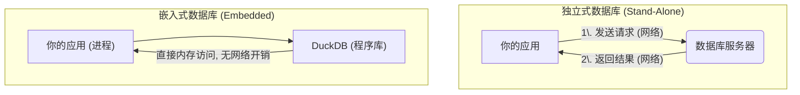
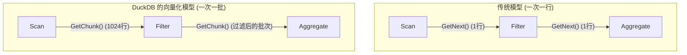

## AI论文解读 | DuckDB: an Embeddable Analytical Database
        
### 作者        
digoal        
        
### 日期        
2025-07-12       
        
### 标签        
PostgreSQL , PolarDB , DuckDB , AI , 论文解读        
        
----        
        
## 背景  
      
https://mytherin.github.io/papers/2019-duckdbdemo.pdf        
  
      
提示:        
```        
读懂《DuckDB: an Embeddable Analytical Database》这篇论文需要提前掌握哪些基础知识, 请使用中文给我讲一下这些基础知识, 尽量通熟易懂, 可以使用markdown支持的图形增加解释性.        
        
使用中文通熟易懂的解读《DuckDB: an Embeddable Analytical Database》这篇论文, 关键内容请深入讲解, 可以使用markdown支持的图形增加解释性.        
        
使用中文提取《DuckDB: an Embeddable Analytical Database》论文中一些重要的术语并详细解释, 可以使用markdown支持的图形示增加解释性.        
```        
        
## 1 前置知识
  
好的，为了完全理解《DuckDB: an Embeddable Analytical Database》这篇论文，你需要掌握一些数据库领域的基础知识。下面我将用通俗易懂的语言，并结合图表，为你解释这些核心概念。

-----

### 核心知识地图

要读懂这篇论文，我们可以从四个关键问题入手，理解了它们，你就能明白 DuckDB 的设计动机和技术优势。

1.  **数据库的分类：** DuckDB 属于哪种数据库？它解决了什么市场空白？
2.  **数据如何存储：** 为什么传统数据库做分析查询慢？DuckDB 在数据存储上有什么不同？
3.  **查询如何执行：** DuckDB 用了什么“黑科技”来加速查询？
4.  **如何处理并发：** 在进行复杂的分析时，如何保证数据可以被安全地修改？

下面我们来逐一分解这些问题。

-----

### 1\. 数据库的“四象限”：理解 DuckDB 的定位

 论文开篇就展示了一张图（Figure 1），这张图根据两个维度对数据库进行了分类  ：

  * **部署方式 (Deployment Model):**

      *  **独立式 (Stand-Alone):** 这是一个独立的服务器程序。你的应用程序作为“客户”(Client) 通过网络连接到这个“服务器”(Server) 来存取数据。比如常见的 MySQL, PostgreSQL, Teradata 都属于此类  。这就像你去餐厅吃饭，餐厅是一个独立的服务实体。
      *  **嵌入式 (Embedded):** 它不是一个独立的程序，而是一个“程序库”(Library)，被直接集成到你的应用程序中   。它和你的应用程序在同一个进程里运行，没有网络开销   。最著名的例子是 SQLite  。这就像你在自己家的厨房里做饭，厨师（数据库）就是你家的一部分。

  * **工作负载类型 (Workload Type):**

      *  **OLTP (联机事务处理):** 全称是 Online Transaction Processing。主要处理大量、短小的“事务性”操作，比如增加、删除、修改、查询单条记录。例如，电商网站的下单操作、银行的转账操作  。其特点是高并发、快速响应。
      *  **OLAP (联机分析处理):** 全称是 Online Analytical Processing。主要处理复杂的、针对大量数据的“分析性”查询，比如“计算过去一年所有商品的销售总额”、“分析各个区域的用户增长趋势”  。其特点是查询复杂，但数据读取量巨大。

我们可以用一个表格来清晰地展示这个“四象限”：

| | **OLTP (事务处理)** | **OLAP (分析处理)** |
| :--- | :--- | :--- |
| **独立式 (Stand-Alone)** |  PostgreSQL, IBM DB2   |  Teradata   |
| **嵌入式 (Embedded)** |  SQLite   | **? (市场空白)** |

 从上图可以看出，在 DuckDB 出现之前，**嵌入式分析数据库 (Embedded OLAP)** 这个领域是相对空白的   。SQLite 在嵌入式 OLTP 领域非常成功   ，但其行式存储和执行模型导致它处理 OLAP 查询时性能很差  。

 **结论：** DuckDB 的目标就是填补这个空白，成为“分析界的 SQLite”   。它专为在 R、Python 等数据分析工具或物联网（边缘计算）设备中进行高效的嵌入式数据分析而设计  。

-----

### 2\. 为何分析查询慢？核心概念：列式存储 (Columnar Storage)

要理解 OLAP 数据库的性能优势，首先要明白数据在磁盘上的两种主要存储方式：**行式存储**和**列式存储**。

假设我们有一张销售表：

| ID | 商品 | 地区 | 销售额 |
| :--- | :--- | :--- | :--- |
| 1 | A | 北京 | 100 |
| 2 | B | 上海 | 200 |
| 3 | A | 深圳 | 150 |

一个典型的分析（OLAP）查询是：`计算所有商品的销售额总和`。

  * **行式存储 (Row-based Storage)**

      *  SQLite 等 OLTP 数据库采用这种方式  。数据是按行连续存储的。
      * `[1, A, 北京, 100] [2, B, 上海, 200] [3, A, 深圳, 150]`
      * **缺点：** 为了计算“销售额”的总和，数据库必须把每一行的所有数据（ID, 商品, 地区, 销售额）都从磁盘读入内存，即使我们只关心“销售额”这一列。当表有几十上百列而数据有数十亿行时，这种方式会读取大量无关数据，非常浪费 I/O。

  * **列式存储 (Columnar Storage)**

      *  DuckDB 和其他 OLAP 数据库采用这种方式  。数据是按列连续存储的。
      * `[1, 2, 3] [A, B, A] [北京, 上海, 深圳] [100, 200, 150]`
      *  **优点：** 当我们计算“销售额”总和时，数据库**只需要读取“销售额”那一列的数据**   。这极大地减少了磁盘 I/O。此外，同一列的数据类型相同，内容相似，因此更容易被压缩，进一步节省存储空间和 I/O  。

**结论：** DuckDB 采用面向分析优化的列式存储格式，这是它能够高效处理 OLAP 查询的物理基础。

-----

### 3\. 如何加速查询？核心概念：向量化执行 (Vectorized Execution)

 仅仅存储得好还不够，查询的计算过程也必须高效。传统数据库通常使用一次处理一行数据（Tuple-at-a-time）的“火山模型”。而 DuckDB 采用了更先进的**向量化执行**模型  。

  * **一次一行 (Tuple-at-a-time / Volcano Model):**

      * 想象一个查询流水线，每个操作符（如“过滤”、“聚合”）处理完**一行**数据后，就把它交给上一个操作符。这个过程涉及大量的函数调用，CPU 的大部分时间都花在了“取数据”和“调用下一个操作符”的开销上，而不是真正的计算。

  * **向量化执行 (Vectorized Execution):**

      *  这个模型对“一次一行”进行了重大改进。操作符之间传递的不再是单行数据，而是**一批数据 (a batch of values)**，这批数据被称为“向量 (Vector)”或“块 (Chunk)”  。
      * 例如，一个操作符一次性从下游拿 1000 行数据，在 CPU 缓存里快速完成这 1000 行的计算（如过滤），然后把结果的 1000 行（或更少）作为一个整体，传递给上游。


```markdown
                      传统模型 (一次一行)
                 (大量的函数调用和CPU开销)
┌───────────┐  <-- GetNext() -->  ┌───────────┐  <-- GetNext() -->  ┌───────────┐
│ Aggregate │       (1 row)       │  Filter   │       (1 row)       │   Scan    │
└───────────┘  <-- GetNext() -->  └───────────┘  <-- GetNext() -->  └───────────┘


                      向量化执行 (一次一批)
                    (极大减少开销, 充分利用CPU缓存)
┌───────────┐  <-- GetChunk() --> ┌───────────┐  <-- GetChunk() --> ┌───────────┐
│ Aggregate │      (1000 rows)    │  Filter   │     (1000 rows)     │   Scan    │
└───────────┘  <-- GetChunk() --> └───────────┘  <-- GetChunk() --> └───────────┘
```

 **结论：** DuckDB 的向量化执行引擎，显著降低了查询处理过程中的解释开销，能更好地利用 CPU 缓存，使得计算速度比传统方式快得多  。

-----

### 4\. 如何安全地并发读写？核心概念：MVCC

分析查询（OLAP）通常耗时很长，如果此时有人想修改数据（OLTP），怎么办？

  * **传统方式 (Locking):** 锁住数据。要么分析查询要等待数据修改完成，要么数据修改要等待分析查询结束。这会严重影响并发性能。

  *  **MVCC (多版本并发控制):** 全称 Multi-Version Concurrency Control。这是 DuckDB 采用的方案  。

      *  核心思想是“读写不冲突”。当数据被修改时，系统不会直接覆盖旧数据，而是会创建一个**新版本**的数据  。
      * 正在进行的分析查询会继续读取它开始时看到的**旧版本**数据，确保了数据的一致性视图。
      * 新的事务则会读取到**新版本**的数据。
      *  这样，一个长时间运行的只读分析查询，不会阻塞任何需要修改数据的短事务  。

 **结论：** MVCC 机制使得 DuckDB 能够很好地支持混合负载场景，即在执行大型分析查询的同时，还能并发地进行数据修改  ，这对于需要实时更新数据的仪表盘等应用场景至关重要。

### 总结

掌握了以上四个方面的知识，你就可以轻松地理解 DuckDB 的论文了：

1.  **定位：** DuckDB 是一款**嵌入式**数据库，专门用于 **OLAP（分析）** 场景，填补了市场的空白。
2.  **存储：** 它使用**列式存储**，只读取必要的列，极大提升了分析查询的 I/O 效率。
3.  **执行：** 它采用**向量化执行**引擎，批处理数据，极大提升了 CPU 计算效率。
4.  **并发：** 它通过 **MVCC** 实现了高效率的并发读写，允许在分析的同时安全地修改数据。

这些设计决策共同造就了 DuckDB 这个小巧、快速、易于集成的分析型数据库。
  
## 2 解读论文 
  
好的，我们来深入解读一下这篇开创性的论文——《DuckDB: an Embeddable Analytical Database》。我将为你剖析其核心思想、关键技术和深远影响。

-----

### **论文摘要：一句话概括 DuckDB**

 这篇论文介绍并演示了一款全新的、开源的嵌入式关系型数据库管理系统——DuckDB   。它的核心目标是填补一个长期存在的市场空白：一个像 SQLite 一样易于集成，但又专门为**分析查询（OLAP）** 设计的高性能数据库  。

### **第一部分：为什么世界需要 DuckDB？（引言）**

论文首先描绘了当时数据库领域的格局，并指出了一个明显的“空缺”。

#### **1. 数据库的“四象限”困境**

 作者通过一个经典的四象限图，将数据库按照“部署方式”（独立式 vs. 嵌入式）和“工作负载”（事务处理 vs. 分析处理）进行划分  。

| | **OLTP (事务处理)** </br> *(高并发、小任务)* | **OLAP (分析处理)** </br> *(低并发、大任务)* |
| :--- | :--- | :--- |
| **独立式 (Stand-Alone)** </br> *(独立的服务器)* |  PostgreSQL, IBM DB2   |  Teradata   |
| **嵌入式 (Embedded)** </br> *(集成在应用内的程序库)* |  SQLite   | **?**   |

 这个图清晰地表明，虽然有像 SQLite 这样极其成功的嵌入式事务数据库，但**不存在一个专门为分析场景设计的嵌入式数据库**  。

#### **2. 需求从何而来？**

这个空白并非无足轻重，现实中存在着强烈的需求：

  *  **交互式数据分析 (Interactive Data Analysis):** 数据科学家们在 Python (Pandas) 或 R (dplyr) 等环境中工作，这些工具虽然强大，但其数据处理能力本质上是模拟关系代数操作，缺乏完整的查询优化和高效的存储管理  。如果能将一个高性能分析数据库直接嵌入这些工具，将极大提升分析效率。
  *  **边缘计算 (Edge Computing):** 物联网设备（如智能电表）在本地产生大量数据   。将所有数据传到云端进行分析，不仅消耗大量带宽，还可能引发隐私问题   。一个能在设备上直接进行高效分析的嵌入式数据库，是解决这个问题的理想方案  。

 作者之前的项目 MonetDBLite 已经验证了市场对嵌入式分析的强烈兴趣，但同时也暴露了改造一个现有系统来适应嵌入式场景的种种困难  。这促使他们从零开始，专门打造一个全新的系统——DuckDB。

-----

### **第二部分：DuckDB 的“心脏”——设计与实现**

这部分是论文的核心，详细阐述了 DuckDB 为了实现其目标所采用的关键技术。

#### **1. 整体架构：集各家之长**

 DuckDB 采用了经典的数据库组件架构：解析器 -\> 逻辑规划器 -\> 优化器 -\> 物理规划器 -\> 执行引擎   。作者坦言，DuckDB 的各个组件并非革命性的创造，而是巧妙地组合了业界最适合其应用场景的先进算法和方法  。

#### **2. 执行引擎：向量化执行 (Vectorized Execution)**

这是 DuckDB 高性能的**第一个秘诀**。

  *  **为什么不用 JIT？** 论文提到，当时流行的查询加速技术是即时编译（JIT），但 JIT 依赖于庞大的编译器库（如 LLVM），这会带来复杂的依赖问题，违背了 DuckDB 追求轻量、易于嵌入和高可移植性的初衷  。
  *  **向量化执行是什么？** 它是一种批处理思想。传统数据库一次处理“一行”数据，函数调用开销极大。而向量化执行引擎一次处理一个“向量”或“块”（Chunk），比如一次处理 1024 个值  。所有操作（过滤、计算、聚合）都在这个数据块上以循环的方式高效执行，极大减少了函数调用开销，并能充分利用 CPU 的缓存。


```markdown
                      传统模型 (一次一行)
                 (CPU时间浪费在函数调用上)
┌───────────┐  <-- 每次拿1行 -->   ┌───────────┐   <-- 每次拿1行 -->  ┌───────────┐
│ Aggregate │                     │  Filter   │                     │   Scan    │
└───────────┘                     └───────────┘                     └───────────┘


                   DuckDB 的向量化模型 (一次一批)
                    (CPU专注于高效的批量计算)
┌───────────┐  <-- 每次拿1024行 -->  ┌───────────┐  <-- 每次拿1024行 -->  ┌───────────┐
│ Aggregate │                       │  Filter   │                       │   Scan    │
└───────────┘                       └───────────┘                       └───────────┘
```

为了实现高效的向量化，DuckDB 还设计了：

  *  **Selection Vectors:** 当数据被过滤后，不是移动数据本身，而是创建一个指向有效数据行的“选择向量”（即索引列表），避免了昂贵的数据复制操作  。
  *  **优化的 NULL 处理:** `NULL` 值用一个独立的位图（bit vector）来表示，只有当数据中真的出现 `NULL` 时才创建，避免了不必要的存储和计算  。

#### **3. 存储格式：列式存储 (Columnar Storage)**

这是 DuckDB 高性能的**第二个秘诀**。

  *  **DataBlocks 存储格式:** DuckDB 使用了专为读取优化的 `DataBlocks` 存储布局  。
  *  **原理:** 逻辑表被水平分区成多个行组（chunks of columns），然后这些行组以列式的方式进行存储和压缩  。

我们再用这个例子来理解其优势：计算 `SUM(销售额)`

  * **行式存储 (SQLite):** 必须读取每一行的所有数据 `[1, A, 北京, 100], [2, B, 上海, 200]...`，即使只关心最后一列。
  * **列式存储 (DuckDB):** 只需读取“销售额”这一列的数据 `[100, 200, 150]`，I/O 开销天差地别。
  *  **数据剪枝 (Data Pruning):** 更妙的是，每个存储块（Block）都为每一列维护了元数据，比如最大/最小值索引  。如果一个查询 `WHERE 销售额 > 1000`，而某个块的“销售额”列最大值只有 500，那么 DuckDB 可以直接跳过整个数据块，无需读取和解压，极大地提升了查询速度。

#### **4. 并发控制：MVCC**

 为了支持混合读写场景（例如，一边进行长时间分析，一边更新数据），DuckDB 采用了**多版本并发控制（MVCC）**   。它具体实现了一种为混合 OLAP/OLTP 系统设计的、可串行化的 MVCC 变体   。该变体将更新直接在原数据上进行，同时将旧版本数据保存在一个单独的撤销缓冲区（undo buffer）中，供并发事务或需要回滚的事务使用  。这保证了读操作不会阻塞写操作，反之亦然。

#### **5. 查询优化**

 DuckDB 包含一个成熟的、基于成本的优化器。它使用了动态规划算法进行连接顺序优化   ，并能展开任意复杂的子查询   。它还通过一系列重写规则来简化查询逻辑，如公共子表达式消除和常量折叠  。

-----

### **第三部分：是骡子是马？拉出来遛遛（演示场景）**

 为了证明 DuckDB 的优越性，作者设计了一个极具说服力的现场演示  。

  *  **设置:** 四台相同的电脑分别运行 SQLite、MonetDBLite、HyPer 和 DuckDB   。屏幕上实时显示查询速率（QpS）和内存占用等指标  。
  *  **互动:** 观众可以转动一个物理旋钮来实时增加或减少查询处理的数据量  。
  * **预期结果:**
      *  **SQLite:** 随着数据量增加，其行式模型将很快不堪重负  。
      *  **MonetDBLite:** 其块处理模型会导致巨大的中间结果物化，最终因内存问题而失败  。
      *  **HyPer:** 虽然其核心引擎极快，但它作为独立服务器，需要通过网络套接字协议传输结果，这在返回大量结果集时会成为瓶颈  。
      * **DuckDB:** 作为嵌入式数据库，它没有网络开销，数据可以直接在进程内共享。结合其向量化执行和列式存储，它将在大数据量下保持稳健和高效，最终胜出。

-----

### **第四部分：未来展望**

 在论文发表时（2019年），DuckDB 已经能够运行所有 TPC-H 和绝大部分 TPC-DS 查询  。作者还规划了未来的发展方向：

  *  **近期目标:** 完善存储层、实现缓冲区管理器、并增加查询内的并行处理能力  。
  * **长期目标:**
      *  提供与 R、Python 等语言更深入的 API 集成  。
      *  **硬件自检 (Self-Checking):** 一个非常新颖的想法。考虑到边缘计算场景下的硬件可能不可靠，DuckDB 计划引入自检机制，例如对所有数据块和中间结果进行校验和计算，以在不显著影响性能的情况下确保计算的正确性  。

### **结论**

《DuckDB: an Embeddable Analytical Database》不仅是介绍了一款新的数据库，更重要的是，它精准地识别并解决了一个长期被忽视的核心问题。通过巧妙地融合**列式存储**、**向量化执行**和 **MVCC** 等先进技术，并将其封装在一个**易于部署的嵌入式**程序库中，DuckDB 为交互式数据分析和边缘计算领域提供了一个前所未有的强大工具。它的出现，真正让高性能分析处理变得无处不在。
  
## 3 术语  
  
好的，我们来从《DuckDB: an Embeddable Analytical Database》这篇论文中提取最核心的几个技术术语，并用通俗易懂的方式结合图形进行详细解释。

-----

### 1\. OLAP vs. OLTP (联机分析处理 vs. 联机事务处理)

这是理解 DuckDB 定位的最基本概念。数据库的工作负载（Workload）通常被分为这两大类。

  * **详细解释:**

      *  **OLTP (Online Transaction Processing):** 联机事务处理，主要应对大量、简短的事务性操作。比如银行转账、电商下单、更新用户信息等。它的特点是高并发读写，但每次操作只涉及少量数据   。SQLite 就是一个典型的 OLTP 系统  。
      *  **OLAP (Online Analytical Processing):** 联机分析处理，主要应对复杂的、针对海量数据的分析性查询。比如“计算公司上个季度的销售总额”、“分析不同地区用户的购买偏好”等。它的特点是查询复杂，一次需要读取大量数据，但主要是读取操作  。

  * **在论文中的重要性:**
     这篇论文的核心论点是，在 DuckDB 出现之前，市场缺少一个为 OLAP 工作负载设计的**嵌入式**数据库   。DuckDB 的诞生就是为了填补这一空白，成为“分析领域的 SQLite”  。

  * **图形化解释:**

| 特性 | **OLTP (事务处理)** | **OLAP (分析处理)** |
| :--- | :--- | :--- |
| **操作类型** | 大量简短的读、写、更新 | 少量复杂的、长时间的读取 |
| **数据量** | 每次操作几行到几十行 | 每次扫描数百万到数十亿行 |
| **用户数** | 高并发，大量用户 | 并发数较低，主要是分析师 |
| **典型应用** | 电商下单、在线票务、银行系统 | 商业智能(BI)、数据仓库、科学计算 |
| **优化目标** | 保证事务速度和数据一致性 | 保证海量数据下的查询速度 |

-----

### 2\. Embedded Database (嵌入式数据库)

这是 DuckDB 的部署模式，也是其关键特性之一。

  * **详细解释:**
     嵌入式数据库不是一个需要独立运行的服务器程序，而是一个程序库（library）   。你的应用程序可以直接调用这个库的功能，数据库引擎就在你的应用程序进程内部运行   。这与需要通过网络连接的独立式数据库（如 PostgreSQL、MySQL）形成鲜明对比  。

  * **在论文中的重要性:**
     嵌入式模型让 DuckDB 实现了“零拷贝”的数据交换   。当数据分析工具（如 Python/R）需要处理数据时，数据无需经过网络传输或序列化/反序列化，可以直接在内存中共享，极大地提升了效率，尤其适合交互式数据分析场景  。

  * **图形化解释:**




-----

### 3\. Vectorized Execution (向量化执行)

这是 DuckDB 实现高性能计算的**核心秘诀**。

  * **详细解释:**
     这是一种查询处理模型。传统数据库的执行引擎通常是“一次处理一行”（Tuple-at-a-time），即每个计算操作符处理完一行数据后，再把它交给下一个操作符。而向量化执行则是“一次处理一批”   。数据以“向量”（Vectors）或“块”（Chunks）为单位在操作符之间流动，每个向量包含上百或上千个值   。CPU 可以在一个紧凑的循环里完成对整个数据块的计算，极大减少了函数调用开销，并能更好地利用 CPU 缓存  。

  * **在论文中的重要性:**
     DuckDB 明确选择了向量化执行模型，而非当时同样流行的即时编译（JIT）模型，主要原因是为了保证更好的**可移植性**和避免对大型编译器库的依赖  。这是其能轻松部署在各种环境（包括边缘设备）的关键。

  * **图形化解释:**




-----

### 4\. Selection Vectors (选择向量)

这是向量化执行中的一个关键优化技术。

  * **详细解释:**
     当一个数据向量经过过滤操作后（例如 `WHERE a > 10`），不是将符合条件的行复制到一个新的向量中，而是创建一个名为“选择向量”的额外数组   。这个数组里存储的是原始向量中符合条件的行的**索引**  。后续的操作符直接根据这个选择向量来处理原始数据。

  * **在论文中的重要性:**
     这种方法可以“避免在向量内进行昂贵的数据移动”，从而提升过滤操作的性能  。

  * **图形化解释:**

    假设我们有一个数据向量和过滤条件 `Value > 5`

      * **原始数据向量:** `[ 2, 8, 4, 9, 5, 10 ]` (索引: 0, 1, 2, 3, 4, 5)
      * **常规做法:** 创建一个新向量 `[ 8, 9, 10 ]` (涉及内存分配和数据复制)
      * **使用选择向量:** 保持原始向量不变，创建一个选择向量 `[ 1, 3, 5 ]` (只创建了一个小小的索引数组)

-----

### 5\. MVCC (Multi-Version Concurrency Control)

这是 DuckDB 用来处理并发读写的技术。

  * **详细解释:**
     多版本并发控制（MVCC）是一种允许数据库在不加锁的情况下处理并发读写的机制。当数据被修改时，系统不会直接覆盖旧数据，而是创建一个新版本的数据  。每个事务都会看到一个在其开始时的数据“快照”。
  * **在论文中的重要性:**
     尽管 DuckDB 主要用于分析，但作者们发现“并行修改表”仍然是一个高频需求，尤其是在实时仪表盘这类应用中   。MVCC 的引入使得一个长时间运行的分析查询（读）可以和一个快速的数据更新（写）同时进行而互不干扰，保证了系统的响应性和 ACID 特性  。

-----

### 6\. DataBlocks / Columnar Storage (数据块/列式存储)

这是 DuckDB 实现高性能 I/O 的**物理基础**。

  * **详细解释:**
     `DataBlocks` 是 DuckDB 使用的一种面向读取优化的存储布局  。其核心思想是**列式存储**。与传统行式存储（将一整行的数据连续存放在一起）不同，列式存储将同一列的所有值连续存放在一起。

  * **在论文中的重要性:**
     对于只关心少数几列的分析查询（OLAP 查询的普遍特征），列式存储只需从磁盘读取相关列的数据，极大地减少了 I/O 操作。此外，`DataBlocks` 还为每一列都存储了 min/max 索引，这让查询引擎可以在不读取数据块内容的情况下，判断其是否包含所需数据，从而直接“跳过”整个数据块，实现数据剪枝（Data Pruning）  。

  * **图形化解释:**

    **数据表:**
    | ID | 商品 | 地区 | 销售额 |
    |:--|:----|:----|:--- |
    | 1 | A | 北京 | 100 |
    | 2 | B | 上海 | 200 |

      * **行式存储 (如 SQLite):**
        `[ 1, A, 北京, 100 ] [ 2, B, 上海, 200 ]`
        *查询 `SUM(销售额)` 时，所有数据都得读一遍。*

      * **列式存储 (如 DuckDB):**
        `[ 1, 2 ] [ A, B ] [ 北京, 上海 ] [ 100, 200 ]`
        *查询 `SUM(销售额)` 时，只需读取 `[100, 200]` 这一块数据。*
  
## 参考        
         
https://mytherin.github.io/papers/2019-duckdbdemo.pdf  
        
        
<b> 以上内容基于DeepSeek、Qwen、Gemini及诸多AI生成, 轻微人工调整, 感谢杭州深度求索人工智能、阿里云、Google等公司. </b>        
        
<b> AI 生成的内容请自行辨别正确性, 当然也多了些许踩坑的乐趣, 毕竟冒险是每个男人的天性.  </b>        
  
  
