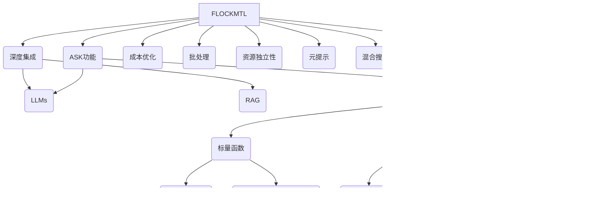

## AI论文解读 | Beyond Quacking: Deep Integration of Language Models and RAG into DuckDB
        
### 作者        
digoal        
        
### 日期        
2025-07-12       
        
### 标签        
PostgreSQL , PolarDB , DuckDB , AI , 论文解读        
        
----        
        
## 背景  
      
https://arxiv.org/pdf/2504.01157        
  
      
提示:        
```        
读懂《Beyond Quacking: Deep Integration of Language Models and RAG into DuckDB》这篇论文需要提前掌握哪些基础知识, 请使用中文给我讲一下这些基础知识, 尽量通熟易懂, 可以使用markdown支持的图形增加解释性.        
        
使用中文通熟易懂的解读《Beyond Quacking: Deep Integration of Language Models and RAG into DuckDB》这篇论文, 关键内容请深入讲解, 可以使用markdown支持的图形增加解释性.        
        
使用中文提取《Beyond Quacking: Deep Integration of Language Models and RAG into DuckDB》论文中一些重要的术语并详细解释, 可以使用markdown支持的图形示增加解释性.        
```        
        
## 1 前置知识
  
好的，为了完全理解《Beyond Quacking: Deep Integration of Language Models and RAG into DuckDB》这篇论文，您需要掌握以下几个核心领域的 foundational knowledge。我会用尽量通俗易懂的方式，结合图表来解释这些概念。

这篇论文的核心在于，它尝试将两种强大的技术——**数据库**和**大语言模型**——无缝地结合在一起，从而创造出一种更强大、更易于使用的数据分析方式。

以下是您需要了解的基础知识，可以看作是攀登这座技术高峰前的“登山装备”：

### 1\. 数据库管理系统 (DBMS) 与 SQL

想象一下，数据库管理系统 (DBMS) 就像一个纪律严明、效率极高的**数字图书馆管理员**。

  * **它的职责**：负责存储、管理和检索海量结构化数据（就像图书馆里按编号、分类、作者排好的书籍）。
  * **结构化数据**：可以理解为像Excel表格一样，有固定的行和列，每一格都有明确的含义。

**SQL (Structured Query Language)** 则是你与这位“管理员”沟通的语言。你想找书、添加新书或修改信息，都得用SQL告诉他。

例如，你想找所有关于“犯罪”主题的书籍，你可能会用类似这样的SQL语句：
`SELECT 书名, 作者 FROM 图书馆 WHERE 主题 = '犯罪';`

这篇论文的工作就是建立在一个数据库系统之上的。

-----

### 2\. DuckDB — “嵌入式分析型数据库”

DuckDB 是一个非常特别的数据库。论文标题中的 "Quacking" (鸭子叫) 就是在玩 DuckDB 的梗。

  * **分析型 (Analytical)**：与我们日常购物、订票时用的“交易型”数据库不同，分析型数据库专门用于**数据分析**。它不追求每秒处理成千上万笔小交易，而是擅长在海量数据中进行复杂的查询和计算，以发现趋势和洞见。比如，分析过去五年所有商品的销售额变化趋势。
  * **嵌入式 (In-process/Embedded)**：这是 DuckDB 的一个王牌特性。传统的数据库（如MySQL, PostgreSQL）是一个独立的服务器程序，你的应用程序需要通过网络连接去访问它。而 DuckDB 就像一个“工具包”或“代码库”，直接运行在你的应用程序**内部**。

下面这个图可以帮助理解：


**这样做的好处是什么？**
 速度极快！因为它避免了应用程序和数据库之间的数据来回传输，这在处理大规模数据分析时能节省大量时间   。这篇论文选择 DuckDB 正是因为它本身的高性能和易于扩展的特性  。

-----

### 3\. 大语言模型 (LLM - Large Language Model)

这可能是你最熟悉的部分，ChatGPT、Gemini 就是著名的大语言模型 (LLM)。

你可以把 LLM 想象成一个**见多识广、精通语言艺术的“实习生”**。

  *  **它的能力**：通过阅读海量的文本数据，它学会了理解和生成人类语言   。它可以帮你做总结、分类、信息提取、甚至根据你的要求创作文本  。
  * **它的局限**：
    1.  **知识截止**：它的知识停留在训练数据截止的那个时间点。
    2.  **可能“一本正经地胡说八道” (Hallucination)**：它有时会编造看似合理但实际上是错误的信息。

-----

### 4\. 检索增强生成 (RAG - Retrieval-Augmented Generation)

RAG 是一种解决 LLM 上述局限性的绝佳策略。你可以把它理解为**给 LLM 开卷考试**。

传统的问答方式是直接问 LLM (闭卷考试)，它只能凭记忆回答。而 RAG 不同，它的流程是：

1.  **检索 (Retrieval)**：当用户提出问题后，系统不直接去问 LLM。而是先根据问题，从你的私有知识库（比如公司的内部文档、产品手册或者数据库）中**找出最相关的几段信息**。这就像考试时，先在教科书上找到相关的章节。
2.  **增强 (Augmented)**：系统将用户的问题和第一步找到的相关信息**拼接**在一起，形成一个新的、更丰富的提示词 (Prompt)。
3.  **生成 (Generation)**：系统把这个增强后的提示词交给 LLM，并要求它：“请根据我提供的这些背景资料来回答这个问题”。这就像让学生根据指定的教科书内容来回答问题，而不是凭空想象。

下面是 RAG 的工作流程图：


RAG 使得 LLM 的回答更可靠、更贴近事实，因为它被“锚定”在了你提供的具体数据上。

### 总结：这篇论文要解决的核心问题

了解了以上基础知识后，你就能明白这篇论文的出发点了。

  *  **现状**：目前，要构建一个结合了数据库查询和 RAG 功能的应用非常复杂   。开发者需要像一个“交通警察”一样，手动协调不同的系统：从 DuckDB 里查数据，送到 Python 脚本里处理，调用外部的 LLM API，再把结果整合起来  。这个过程不仅繁琐、低效，而且难以优化。

  *  **论文的解决方案 (FLOCKMTL)**：这篇论文提出了一种名为 **FLOCKMTL** 的 DuckDB 扩展   。它的革命性在于，**把 LLM 的能力（如总结、分类）和 RAG 的核心思想，直接做成了 SQL 的一部分**  。

      *  开发者不再需要在数据库外部“折腾”，而是可以直接在 SQL 查询语句中使用像 `llm_complete()` 或 `llm_filter()` 这样的新函数  。
      *  数据库系统会自动处理与 LLM 的交互、数据批处理、缓存等复杂的优化工作  。

简单来说，这篇论文的目标就是把原来需要多个厨房、多个厨师才能完成的复杂菜肴（数据分析与语义理解），变成**在一个高度智能化的“中央厨房”（集成了 LLM 的 DuckDB）里，用一套统一的指令 (SQL) 就能高效完成**。
  
## 2 解读论文 
  
好的，我们来深入解读一下这篇名为《Beyond Quacking: Deep Integration of Language Models and RAG into DuckDB》的论文。这篇论文提出了一种名为 **FLOCKMTL** 的创新方案，旨在彻底改变开发者构建知识密集型数据应用的方式。

首先，我们来概括一下它的核心思想：

> 传统的做法是让数据“跑”向模型（从数据库中取出数据，在应用程序中处理，再发给语言模型），这既麻烦又低效。而 FLOCKMTL 的思想是让模型“入住”到数据中（将语言模型的功能直接内置于数据库），让开发者可以用最熟悉的 SQL 语言，在一个系统内完成所有操作。

接下来，我们将分步深入讲解论文的关键内容。

### 一、 痛点：为什么需要 FLOCKMTL？

 现代数据分析应用，尤其是知识密集型的应用，常常面临一个巨大的挑战：它们需要同时从**结构化数据**（如数据库中的表格）和**非结构化数据**（如文本文档）中检索信息并进行决策  。

 随着大语言模型（LLM）和检索增强生成（RAG）技术的兴起，虽然原型开发变得容易了   ，但高效地实现这些数据流程仍然困难重重   ，开发者仿佛回到了关系型数据库诞生前的“蛮荒时代”  。

具体痛点如下：

  *  **系统繁杂**：开发者需要在多个异构系统之间来回切换，比如数据库管理系统（DBMS）、搜索引擎、向量数据库等  。
  *  **数据“大搬家”**：数据在不同系统间的频繁移动（Data Shuffling）不仅浪费资源，也错失了联合优化的机会  。
  *  **实现细节繁琐**：开发者需要手动处理大量底层细节，如选择哪个模型、管理LLM的上下文、实现缓存、批处理等  。
  *  **维护困难**：一旦应用的需求（如成本、延迟、质量）发生变化，往往需要大规模地重构代码  。

 FLOCKMTL 的诞生，正是为了解决以上所有问题，它希望将开发者从这些低级别的实现负担中解放出来  。

### 二、 核心方案 FLOCKMTL：将大模型“请入”数据库

 FLOCKMTL 是一个针对 DuckDB 的开源扩展   。选择 DuckDB 是因为它是一个先进的、可嵌入的分析型数据库，并且其扩展机制非常灵活，允许对 SQL 解析、优化器和执行引擎进行深度修改  。

 FLOCKMTL 的核心是**将 LLM 的能力和 RAG 流程深度集成到数据库内部**  。它通过两大创新基石来实现这一点。


### 三、 两大基石：创新的SQL函数与资源管理

#### 1\. 资源管理：`MODEL` 和 `PROMPT` 成为一等公民

 为了实现“资源独立性” (resource independence)，FLOCKMTL 引入了两个全新的数据库定义语言（DDL）对象：`MODEL` 和 `PROMPT`   。它们和我们熟悉的 `TABLE` 一样，是数据库中的一等公民  。

  *  **`CREATE MODEL`**: 定义一个可以复用的模型。比如，定义一个名为 `model-relevance-check` 的模型，它指向 OpenAI 提供的 `gpt-40-mini`  。
  *  **`CREATE PROMPT`**: 定义一个可复用的提示词。比如，定义一个名为 `joins-prompt` 的提示词，用于判断论文是否和连接算法相关  。

**这样做的好处是什么？**
 极大地增强了灵活性和可维护性。数据工程师或管理员可以直接修改模型或提示词的定义，而**无需改动任何应用程序的 SQL 查询代码**  。例如，当 OpenAI 发布了更强的模型时，只需 `ALTER MODEL` 更新一下模型指向即可，所有使用该模型的查询将自动受益。

#### 2\. SQL 函数：将语义分析融入查询

 FLOCKMTL 的核心功能是通过一系列强大的**标量函数 (Scalar Functions)** 和**聚合函数 (Aggregate Functions)** 来体现的  。

 **标量函数 (Scalar Functions):** 对每一行输入进行操作，并返回一个值  。

  *  **`llm_filter(model, prompt, ...)`**: 根据 LLM 的判断返回 `True` 或 `False`，用于过滤数据行  。
  *  **`llm_complete(model, prompt, ...)`**: 对每一行数据生成一段文本描述，比如做总结  。
  *  **`llm_complete_json(model, prompt, ...)`**: 对每一行数据提取结构化的 JSON 信息，比如提取关键词和论文类型  。
  *  **`llm_embedding(model, ...)`**: 将文本转换为向量（嵌入），这是语义搜索的基础  。

 **聚合函数 (Aggregate Functions):** 对多行输入进行操作，并返回一个聚合后的值  。

  *  **`llm_rerank(model, prompt, ...)`**: 对一组输入行（比如搜索结果）进行重新排序，以提高相关性  。
  *  **`llm_first/llm_last(...)`**: 从一组输入行中，根据 LLM 的判断选出最相关或最不相关的那一行  。

 通过将这些函数与 SQL 的公用表表达式（CTE，即 `WITH` 子句）结合，用户可以构建出强大的、可**链式调用的 LLM 预测流水线**  。

### 四、 “看不见的英雄”：自动化优化机制

 如果仅仅是封装 API，FLOCKMTL 的价值将大打折扣。它的真正强大之处在于**系统会自动处理那些繁琐但至关重要的底层优化**，用户无需关心  。

论文重点介绍了两个优化：

1.  **元提示词 (Meta-Prompting)**:

      *  用户只需提供针对单条数据的简单指令  。
      *  FLOCKMTL 会自动将用户的指令嵌入一个结构化的“元提示词”模板中   。这个模板包含了对 LLM 的格式化要求、输出规范以及如何处理输入的表格数据等信息   。这确保了 LLM 能够稳定、可靠地返回我们期望的结果（见论文图1  ）。

2.  **批处理 (Batching)**:

      *  逐行调用 LLM API 的效率极低  。
      *  FLOCKMTL 会自动进行批处理优化   。它会根据 LLM 的上下文窗口大小，动态地决定一次打包多少行数据发送给 LLM  。
      *  系统甚至设计了智能的回退机制：如果因为输出内容过长导致请求失败，它会自动将批次大小减少10%并重试  。
      *  这个优化效果显著，带来了高达 **7倍**（对于聊天补全）到 **48倍**（对于嵌入生成）的性能提升  。

 此外，系统还会无缝地处理**缓存 (Caching)**（重复的请求直接使用缓存结果）和**对去重后的值进行预测**等优化  。

### 五、 实践出真知：一个完整的混合搜索案例

 论文中的查询3 (Query 3) 完美展示了 FLOCKMTL 的强大能力，它首次在 SQL 内部实现了一个完整的混合搜索（Hybrid Search）流程  。

 **目标**：从海量论文段落中，找到与“数据库中的连接算法”相关的文章，并从中进一步找出优先提及“循环连接查询”的段落  。

这个复杂的任务被分解为清晰的 SQL 步骤：

1.   **生成查询向量**: 使用 `llm_embedding` 将用户的查询意图 "join algorithms in databases" 转换为一个向量  。
2.   **向量搜索**: 再次使用 `llm_embedding` 计算所有论文段落的向量，并通过向量相似度计算，找出最相关的100个段落  。
3.   **关键词搜索**: 使用 DuckDB 自带的全文搜索扩展，通过 BM25 算法找出另外100个相关的段落  。
4.   **结果融合 (Fusion)**: 将向量搜索和关键词搜索的两组结果通过 `FULL OUTER JOIN` 合并，并使用 `fusion` 函数对它们的得分进行归一化和融合  。
5.   **LLM 重新排序 (Rerank)**: **这是点睛之笔**。将融合后的前10个候选段落，交给聚合函数 `llm_rerank`，并给出一个新的、更具体的提示词 "mentions cyclic joins"，让 LLM 对这10个结果进行智能的、更精准的重新排序  。

这个案例雄辩地证明，过去需要多个系统、复杂编排才能完成的任务，现在可以用一个声明式的 SQL 查询一气呵成。

### 总结

《Beyond Quacking》提出的 FLOCKMTL 方案，通过以下几个关键创新，极大地简化了知识密集型应用的开发：

  * **深度集成**: 将 LLM 功能以内置函数的形式深度集成到数据库内核中，实现了“模型入住数据”。
  * **声明式接口**: 用户可以使用熟悉的 SQL 语言，以声明式的方式构建复杂的 AI 数据流水线。
  * **资源抽象**: `MODEL` 和 `PROMPT` 作为一等公民，实现了应用逻辑与 AI 资源的解耦，易于维护。
  * **自动化优化**: 系统在后台自动处理批处理、缓存、元提示词等复杂优化，开发者无需关心底层细节。

FLOCKMTL 让数据库不仅仅是一个存储和检索数据的仓库，更将其提升为一个能够进行深度语义理解和推理的**智能分析引擎**。
  
## 3 术语  
  
以下是论文《Beyond Quacking: Deep Integration of Language Models and RAG into DuckDB》中的一些重要术语及其详细解释：

  *  **FLOCKMTL**: FLOCKMTL 是一个针对数据库管理系统 (DBMS) 的扩展，旨在深度集成大型语言模型 (LLM) 功能和检索增强生成 (RAG)   。它引入了模型驱动的标量函数和聚合函数，允许通过元组级别的映射和归约进行链式预测   。FLOCKMTL 还通过新颖的 SQL DDL 抽象（PROMPT 和 MODEL）实现了资源独立性，并将它们作为与 TABLE 并列的第一类模式对象  。

  *  **大型语言模型 (LLMs)**: LLM 是一种先进的人工智能模型，它们能够理解和生成人类语言   。在 FLOCKMTL 的背景下，LLM 被用来实现各种语义操作，如分类、摘要和重新排序  。

  *  **检索增强生成 (RAG)**: RAG 是一种结合了检索和生成功能的 AI 方法。它允许 LLM 从外部知识源（例如结构化表格数据和非结构化文本文档）检索相关上下文，然后使用该上下文生成更准确和信息更丰富的响应  。

  *  **DuckDB**: DuckDB 是一个嵌入式分析型数据库，FLOCKMTL 正是针对其开发的开源扩展   。DuckDB 的扩展模块允许对 SQL 解析器、优化器和执行引擎进行更改，并添加新的数据类型，这使得 FLOCKMTL 能够深度集成其功能  。

  *  **标量函数 (Scalar Functions)**: 在 FLOCKMTL 中，标量函数将单个输入元组映射到单个输出值。它们可以使用聊天完成 API 或嵌入 API 来实现   。例如，`LLM_COMPLETE` 和 `LLM_FILTER` 是 FLOCKMTL 支持的标量函数  。

  *  **聚合函数 (Aggregate Functions)**: 聚合函数将多个输入元组归约为单个输出值。它们通常使用聊天完成 API 来实现   。`LLM_RERANK` 和 `LLM_FIRST/LAST` 是 FLOCKMTL 支持的聚合函数  。

  *  **MODEL (模型)**: 在 FLOCKMTL 中，MODEL 是一种新的 DDL 资源类型，被视为第一类模式对象，类似于 TABLE   。它允许用户定义可重用的模型资源，这些资源可以被 SQL 查询引用，从而实现模型更新而无需更改应用程序逻辑  。

  *  **PROMPT (提示)**: PROMPT 是另一种新的 DDL 资源类型，也被视为第一类模式对象   。它允许用户定义可重用的提示，这些提示可以与 LLM 结合使用，以指导模型的行为  。

  *  **元提示 (Meta-prompt)**: FLOCKMTL 使用元提示来构建完整的提示。用户提供的提示（针对单个或多个元组）会被系统使用结构化的元提示模板进行组合，其中包含格式化说明、输出预期以及表格输入元组的序列化  。

  *  **批处理 (Batching)**: 为了提高效率，FLOCKMTL 会自动对标量函数应用的输入元组进行批处理。系统会根据输入属性值和 LLM 的上下文窗口大小动态确定批处理大小，将尽可能多的元组填充到单个请求中，直到达到上下文限制  。

  *  **成本优化 (Cost-based Optimizations)**: FLOCKMTL 借鉴了关系模型的思想，结合了基于成本的优化，可以无缝应用批处理和缓存等技术，从而减轻了实现低级执行细节的负担  。

  *  **资源独立性 (Resource Independence)**: FLOCKMTL 通过引入 PROMPT 和 MODEL 作为第一类模式对象实现了资源独立性。这意味着 SQL 查询可以保持不变，而模型和提示的更新可以在不修改应用程序逻辑的情况下进行管理  。

  *  **混合搜索 (Hybrid Search)**: FLOCKMTL 支持完整的混合搜索管道，这在 SQL 中是首次实现。它结合了向量相似度搜索（例如使用 `LLM_EMBEDDING`）和全文搜索（例如 BM25），然后融合结果并重新排序 [cite: 146, 147, 152, 155, 156, 157]。

  *  **ASK 功能 (ASK functionality)**: FLOCKMTL 提供了一个 ASK 功能，可以将自然语言查询转换为增强了 FLOCKMTL 函数的 SQL 查询   。这使得非专家用户可以更容易地构建数据应用程序  。

以下是这些术语之间关系的图形表示：



**解释图示**:

  * **FLOCKMTL** 是核心，它深度集成了 **LLMs** 和 **RAG**。
  * FLOCKMTL 是 **DuckDB** 的扩展，为其提供了新的 **SQL 功能**。
  * 这些新的 SQL 功能包括 **标量函数** (如 `LLM_FILTER`, `LLM_COMPLETE_JSON`) 和 **聚合函数** (如 `LLM_RERANK`, `LLM_FIRST/LAST`)。
  * FLOCKMTL 还引入了 **MODEL** 和 **PROMPT** 作为 SQL 中的第一类模式对象，实现了 **资源独立性**。
  * 为了提高效率和可用性，FLOCKMTL 包含 **成本优化**、**批处理** 和 **元提示** 等功能。
  * FLOCKMTL 支持 **混合搜索** 功能。
  * **ASK 功能** 允许用户通过自然语言与 FLOCKMTL 交互，并自动生成带有 FLOCKMTL 函数的 SQL 查询。
  
## 参考        
         
https://arxiv.org/pdf/2504.01157  
        
        
<b> 以上内容基于DeepSeek、Qwen、Gemini及诸多AI生成, 轻微人工调整, 感谢杭州深度求索人工智能、阿里云、Google等公司. </b>        
        
<b> AI 生成的内容请自行辨别正确性, 当然也多了些许踩坑的乐趣, 毕竟冒险是每个男人的天性.  </b>        
  
  
  
  
  
#### [期望 PostgreSQL|开源PolarDB 增加什么功能?](https://github.com/digoal/blog/issues/76 "269ac3d1c492e938c0191101c7238216")
  
  
#### [PolarDB 开源数据库](https://openpolardb.com/home "57258f76c37864c6e6d23383d05714ea")
  
  
#### [PolarDB 学习图谱](https://www.aliyun.com/database/openpolardb/activity "8642f60e04ed0c814bf9cb9677976bd4")
  
  
#### [PostgreSQL 解决方案集合](../201706/20170601_02.md "40cff096e9ed7122c512b35d8561d9c8")
  
  
#### [德哥 / digoal's Github - 公益是一辈子的事.](https://github.com/digoal/blog/blob/master/README.md "22709685feb7cab07d30f30387f0a9ae")
  
  
#### [About 德哥](https://github.com/digoal/blog/blob/master/me/readme.md "a37735981e7704886ffd590565582dd0")
  
  

  
