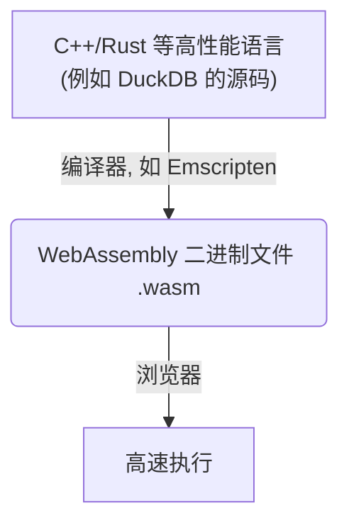
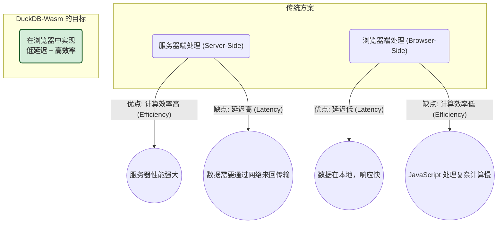
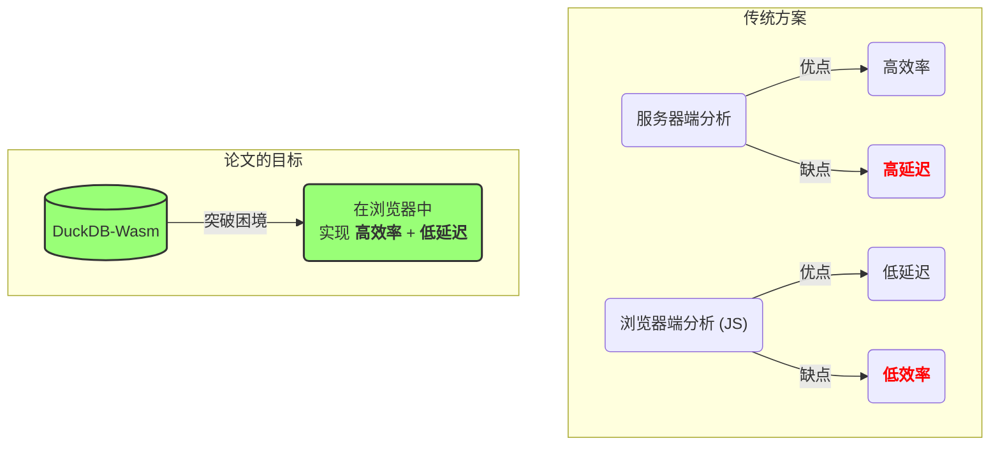
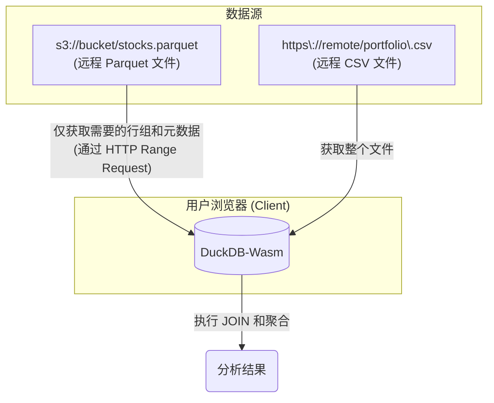
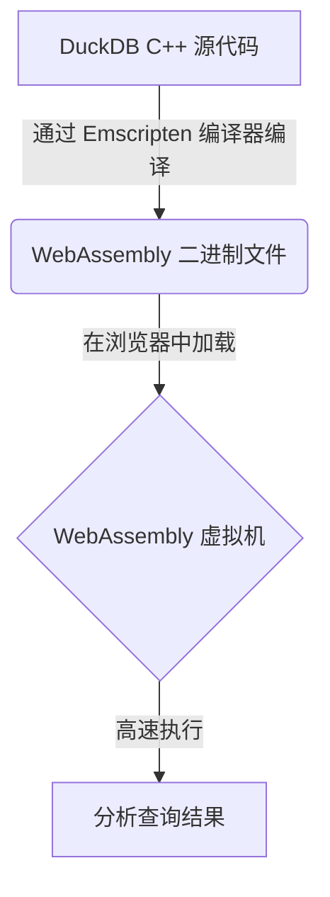
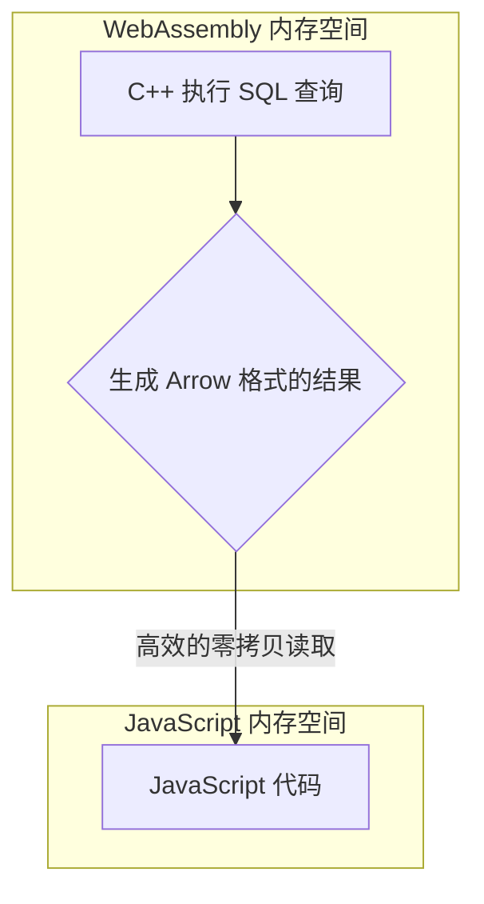
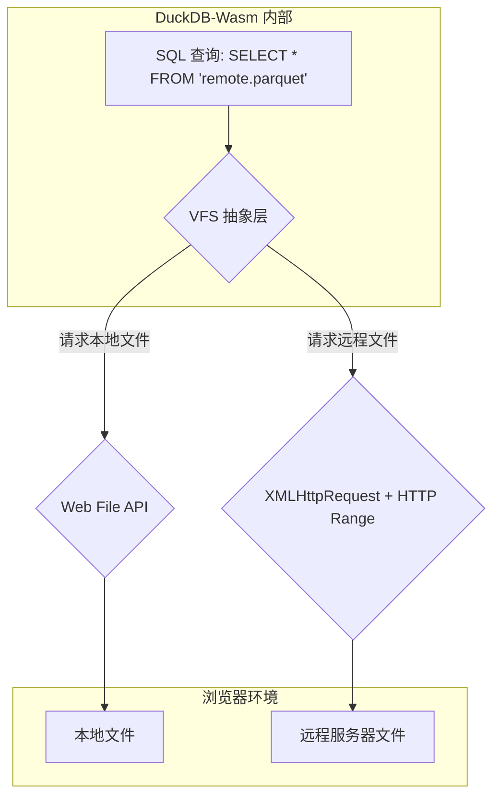

## AI论文解读 | DuckDB-Wasm: Fast Analytical Processing for the Web
        
### 作者        
digoal        
        
### 日期        
2025-07-13       
        
### 标签        
PostgreSQL , PolarDB , DuckDB , AI , 论文解读        
        
----        
        
## 背景  
      
https://www.vldb.org/pvldb/vol15/p3574-kohn.pdf        
  
      
提示:        
```        
读懂《DuckDB-Wasm: Fast Analytical Processing for the Web》这篇论文需要提前掌握哪些基础知识, 请使用中文给我讲一下这些基础知识, 尽量通熟易懂, 可以使用markdown支持的图形增加解释性.        
        
使用中文通熟易懂的解读《DuckDB-Wasm: Fast Analytical Processing for the Web》这篇论文, 关键内容请深入讲解, 可以使用markdown支持的图形增加解释性.        
        
使用中文提取《DuckDB-Wasm: Fast Analytical Processing for the Web》论文中一些重要的术语并详细解释, 可以使用markdown支持的图形示增加解释性.        
```        
        
## 1 前置知识
  
好的，为了完全理解《DuckDB-Wasm: Fast Analytical Processing for the Web》这篇论文，你需要了解一些关于数据库、Web技术和计算机体系结构的基础知识。

下面我将用通俗易懂的语言，并辅以图表，为你逐一讲解这些必备知识点。

-----

### 摘要总结

如果你想快速了解，可以先看这个表格：

| 知识点 | 领域 | 核心概念 | 通俗解释 |
| :--- | :--- | :--- | :--- |
| **WebAssembly (Wasm)** | Web 技术 | 一种为浏览器设计的低级二进制代码格式。 | 浏览器的“涡轮增压引擎”，能让C++等高性能语言编写的程序在网页上飞速运行。 |
| **DuckDB** | 数据库 | 一种嵌入式、面向分析的数据库。 | 一个小巧但功能强大的“数据分析工具箱”，可以直接塞进你的应用程序里使用。 |
| **客户端 vs 服务器端** | Web 架构 | 数据处理在用户本地浏览器进行还是在远程服务器进行。 | 在你家厨房做饭（客户端），还是点外卖等餐厅做好送过来（服务器端）。 |
| **列式存储** | 数据库 | 数据按列（字段）而不是按行（记录）存储。 | 查班里所有人的数学成绩时，不用翻每个人的完整档案，直接看“数学成绩”那一列。 |
| **向量化执行引擎** | 数据库 | 一次处理一批（一“向量”）数据，而不是一条一条处理。 | 工厂流水线作业，比手工作坊一个一个做效率高得多。 |
| **Web Workers** | Web 技术 | 在浏览器后台运行脚本，不影响主页面交互。 | 你在前台和朋友聊天（页面交互），你的助理在后台房间帮你算复杂的数学题（数据分析）。 |
| **Apache Arrow** | 数据格式 | 一种高效的、跨语言的内存中列式数据格式。 | 不同国家的人（C++ 和 JavaScript）交流时用的“通用语言”和“标准集装箱”，避免了翻译和重新打包的成本。 |
| **TPC-H 基准测试** | 数据库 | 一套行业标准的，用于评测分析型数据库性能的测试集。 | 数据库界的“高考”，用来衡量一个系统处理复杂分析问题的能力。 |

-----

### 详细讲解

#### 1\. 核心概念：DuckDB + WebAssembly

这篇论文的标题就包含了两个最重要的主角：**DuckDB** 和 **WebAssembly**。

##### a. WebAssembly (Wasm) 是什么？

 想象一下，你的浏览器是一个平台，上面可以跑各种应用。通常，这些应用都是用 **JavaScript (JS)** 语言写的   。JS 灵活方便，但对于复杂的计算任务（比如分析几百万条数据），它就像一辆普通家用轿车——速度有限  。

 **WebAssembly (Wasm)** 就是为了解决这个问题而生的   。它不是一种高级编程语言，而是一种低级的二进制指令格式   。你可以把它理解成浏览器的“**涡轮增压引擎**”。像 C++、Rust 这种以性能著称的语言，可以被编译成 Wasm 格式，然后在浏览器里以接近本地应用的速度运行  。



这篇论文就是把用 C++ 写的 DuckDB 数据库，通过这种方式搬到了浏览器里。

##### b. DuckDB 是什么？

数据库分很多种。你可能听过 MySQL、PostgreSQL，这些是独立的**服务器型数据库**，你需要先启动一个服务，然后让你的应用去连接它。

 而 **DuckDB** 是一种**嵌入式分析型数据库**  。

  *  **嵌入式 (Embeddable)**：它不是一个独立的程序，而是一个“程序库”  。你可以把它直接集成到你的应用中，就像给你的代码增加了一个强大的新功能，不需要额外安装和管理一个数据库服务。
  *  **分析型 (Analytical)**：相比于处理“在线交易”（比如记录一笔订单）的数据库（OLTP），分析型数据库（OLAP）更擅长处理复杂的、针对大量数据的查询  。比如“计算过去一年里，每个商品类别在不同区域的总销售额”，这种任务正是 DuckDB 的强项。

 所以，**DuckDB-Wasm** 的本质就是：**把一个为高性能数据分析而生的“嵌入式工具箱”，通过 Wasm 技术，装进了浏览器里**  。

#### 2\. 核心问题：Web 端数据分析的“两难困境”

 在 DuckDB-Wasm 出现之前，如果你想在网页上做一个交互式的数据分析应用，通常会面临一个艰难的选择（如下图所示，该图是论文图1的简化解释）  。



  *  **方案一：服务器端处理**  

      * **优点**：服务器性能强大，计算效率高。
      *  **缺点**：每次操作（筛选、排序等）都需要把请求发送到服务器，服务器计算完再把结果传回浏览器。这个网络来回的过程会产生明显的**延迟（Latency）**，影响交互体验  。

  *  **方案二：浏览器端处理**  

      * **优点**：没有网络延迟，交互非常流畅。
      * **缺点**：受限于 JavaScript 的性能，处理大规模数据时效率低下，可能导致页面卡顿甚至崩溃。

 **DuckDB-Wasm 的使命就是打破这个困境**  。它利用 Wasm 的高性能，让浏览器本身就具备了强大的数据分析能力，从而实现了“低延迟”和“高效率”的统一。

#### 3\. 关键技术与实现细节

为了实现上述目标，论文中提到了几个关键技术。

##### a. 列式存储 (Columnar Storage)

这是分析型数据库性能优越的核心秘诀之一。

  * **行式存储**（传统数据库常用）：数据一行一行地存。就像一个 Excel 表格，一行包含一个人的所有信息（姓名、年龄、地址）。
  * **列式存储**（分析型数据库常用）：数据一列一列地存。所有人的“姓名”存在一起，所有人的“年龄”存在一起。

**为什么分析查询用列式存储更快？**
因为分析查询通常只关心少数几列。比如计算“所有用户的平均年龄”，列式存储只需要读取“年龄”这一列的数据即可，而行式存储则必须把每一行（包括姓名、地址等无关信息）都读出来，造成了大量无效的 I/O 操作。

 论文中提到的 **Parquet** 文件格式    和 **Apache Arrow**   都是采用了列式存储思想的典型代表。

##### b. 向量化执行引擎 (Vectorized Execution)

 这是另一个性能优化的关键。传统的数据库可能一条一条地处理数据（比如用一个 for 循环）。而**向量化执行**则是一次性处理一批数据（一个“向量”或“块”） 。

这就好比：

  * **逐条处理**：一个工人，每次从仓库拿一个零件，加工，再放回，重复1000次。
  * **向量化处理**：一个工人，一次性从仓库拿100个零件，用流水线的方式批量加工完，再统一放回，重复10次。

显然，后者的效率要高得多，因为它摊薄了函数调用等固定开销。DuckDB 的内核就是基于向量化执行构建的。

##### c. Web Workers

 浏览器的主线程既要负责页面渲染和用户交互（比如响应点击），也要负责执行 JS 代码。如果一个复杂的分析任务在主线程上运行，就会阻塞交互，导致页面“假死” 。

 **Web Workers** 允许你在后台线程中运行代码  。这样，重量级的数据分析任务就可以在 Worker 中由 DuckDB-Wasm 执行，而主线程则保持流畅，随时响应用户操作。

##### d. Apache Arrow

 在 Wasm 中运行的 C++ 代码和浏览器中的 JavaScript 代码，它们的内存是相互隔离的  。如何高效地在这两者之间传递数据就成了一个问题。如果进行传统的数据复制和格式转换，会非常耗时。

 **Apache Arrow**    解决了这个问题。它定义了一种标准的、语言无关的列式内存格式。DuckDB-Wasm 在 C++ 端把查询结果生成为 Arrow 格式，JavaScript 端可以直接从 Wasm 的内存中读取，几乎没有转换开销，实现了所谓的“**零拷贝（zero-copy）**”读取  。

#### 4\. 评测基准：TPC-H

 当你声称自己的系统很快时，必须有客观的证据。**TPC-H** 就是数据库领域公认的一套用于衡量**决策支持（分析）**能力的基准测试  。它包含了一系列模拟真实商业场景的复杂查询（如订单优先级、区域利润等）和标准数据集。

 论文使用 TPC-H 来对比 DuckDB-Wasm 和其他 Web 数据处理方案（如 SQL.js、Arquero）的性能，通过翔实的数据（见论文中的表1   ）证明了 DuckDB-Wasm 的巨大优势  。

-----

当你理解了以上这些基础知识后，再回头去看这篇论文，就会发现它的脉络非常清晰：它阐述了**为什么**需要在浏览器里做高性能分析（两难困境），**用什么**技术来实现（DuckDB + Wasm），**如何**解决实现中的关键问题（列式存储、向量化、Web Workers、Arrow），最后**怎样**证明自己是有效的（TPC-H 测试）。
  
## 2 解读论文 
  
好的，我们来一起深入解读《DuckDB-Wasm: Fast Analytical Processing for the Web》这篇论文。本文将用通俗的语言，结合图表，为您剖析其核心思想、关键技术和深远意义。

### 论文摘要

 这篇论文介绍了一款名为 **DuckDB-Wasm** 的工具   。它本质上是将一个为数据分析设计的、非常快的数据库 DuckDB，通过 WebAssembly (Wasm) 技术移植到了网页浏览器中   。这样做的好处是，可以直接在用户的浏览器里快速地执行复杂的 SQL 查询和数据分析，而不需要把数据传来传去到服务器   。论文通过标准的 TPC-H 基准测试证明，DuckDB-Wasm 的性能远超当时其他的网页数据处理库   ，并展示了一个完全在浏览器中运行的交互式 SQL 查询工具来证明其强大的能力  。

### 1\. 核心问题：Web 数据分析的“两难困境”

 在理解 DuckDB-Wasm 的创新之前，我们必须先了解它要解决的问题。传统上，在网页上进行数据分析面临一个“效率”与“延迟”的艰难抉择  。

  * **服务器端分析**：将数据上传到远程服务器，利用服务器强大的计算能力进行分析。
      *  **优点**：计算效率高，能处理海量数据  。
      *  **缺点**：每一次交互（如筛选、排序）都需要通过网络与服务器通信，这带来了无法避免的**网络延迟 (Latency)**，严重影响了数据探索的流畅性和交互性  。
  * **浏览器端分析**：直接使用浏览器内置的 JavaScript 语言在用户本地进行计算。
      *  **优点**：没有网络延迟，响应速度快，交互体验好  。
      *  **缺点**：JavaScript 最初并非为密集型计算设计，其**处理效率 (Efficiency)** 相对较低，在面对复杂或大规模数据分析时，性能远远落后于原生程序，甚至可能导致浏览器卡顿  。

这个困境可以用下图清晰地表示：



 DuckDB-Wasm 的诞生，正是为了打破这一僵局，它借助 WebAssembly 技术，将原生应用的高效率带入浏览器，从而在低延迟的本地环境中实现高性能分析  。

### 2\. 关键设计与实现（深入讲解）

 DuckDB-Wasm 的成功并非简单的代码编译，而是包含了四大精心设计的关键部分  。

#### a. 嵌入 WebAssembly 与高效数据交换

  *  **编译**：DuckDB 的核心代码由 C++ 编写，论文使用 Emscripten 工具链将其编译成 WebAssembly (Wasm) 格式，使其能在浏览器中运行  。
  *  **数据交换的挑战**：Wasm 的运行环境拥有自己独立的内存空间，与 JavaScript 的内存（JS Heap）是隔离的  。如果在两者之间频繁地来回复制和转换数据，性能开销会非常大，从而抵消 Wasm 带来的速度优势。
  *  **解决方案：Apache Arrow**：为了解决这个问题，DuckDB-Wasm 采用 **Apache Arrow** 格式作为两者数据交换的桥梁  。
      *  Arrow 是一种为内存分析而设计的**列式数据格式**，支持多种编程语言  。
      *  当 SQL 查询在 Wasm 中执行完毕后，结果被序列化成 Arrow IPC (Inter-Process Communication) 流  。
      *  JavaScript 可以直接从 Wasm 的内存中读取这种标准格式的数据，几乎没有反序列化和复制的开销，实现了所谓的“**零拷贝读取 (zero-copy reads)**”，极大地提升了数据交换效率  。

#### b. 浏览器无关的 Web 文件系统

  *  **虚拟文件系统 (VFS)**：DuckDB 自身设计了一套虚拟文件系统，将上层的文件格式读取（如 Parquet, CSV）与底层的操作系统 API 解耦  。
  *  **浏览器适配**：DuckDB-Wasm 利用这层抽象，为浏览器环境量身定做了一套文件系统实现  。
      *  对于**本地文件**，它通过 `web File API` 进行读取   。文件不会被一次性全部加载到内存，而是按需分块读取  。
      *  对于**远程文件**（如存放在 AWS S3 或其他服务器上的文件），它使用 `XMLHttpRequest` 和 **HTTP Range Headers**   。这意味着它可以只请求一个大文件的特定部分（例如，一个 Parquet 文件的元数据或某几列的数据），而无需下载整个文件，极大地节省了网络带宽和等待时间  。

下图展示了 DuckDB-Wasm 如何灵活处理数据源。用户可以在一个 SQL 查询中，直接引用远程的 Parquet 文件和 CSV 文件，DuckDB-Wasm 会智能地获取所需数据。



 这种能力使得 DuckDB-Wasm 可以实现完全在客户端本地执行的分析（论文图2中的③），也可以与服务器协同，实现混合模式的分析（论文图2中的②）  。

#### c. 使用 Web Workers 实现异步执行

  *  **避免 UI 阻塞**：复杂的分析查询可能耗时较长。如果直接在浏览器的主线程中运行，会导致页面无法响应用户操作（如点击、滚动），造成“假死”现象。DuckDB-Wasm 通过将自身运行在 **Web Worker** 中来解决这个问题   。Web Worker 相当于浏览器的后台线程，它在后台执行耗时的 SQL 查询，计算完成后再将结果传回主线程，全程不影响用户界面的流畅性  。
  *  **动态功能选择**：WebAssembly 标准在不断发展，出现了诸如 SIMD（单指令多数据流，用于并行计算）和异常处理等新特性   。不同浏览器对这些新特性的支持程度不一   。DuckDB-Wasm 会编译出多个包含不同功能集的版本，并在运行时动态检测当前浏览器支持的最佳特性，然后加载最快的那个 Worker 版本，以实现最大化的性能  。

#### d. 高效的 JavaScript 用户自定义函数 (UDFs)

 DuckDB-Wasm 允许用户使用 JavaScript 编写自定义函数，并在 SQL 中直接调用它们   。其高效性得益于 DuckDB 的**向量化执行模型**   。数据不是一条一条地从 Wasm 传递给 JS 函数，而是一批一批（一个 chunk/vector）地传递   。这种批处理方式极大地摊薄了 Wasm 和 JS 之间函数调用的固定开销，使得 JS UDF 的执行效率非常高  。

### 3\. 性能评测：TPC-H 基准测试

 为了证明其性能优势，论文使用了业界公认的分析型数据库基准测试 TPC-H   。实验在不同数据规模（Scale Factor, SF）下，将 DuckDB-Wasm 与当时主流的 Web 数据处理方案（如 SQL.js, Arquero, Lovefield）进行了对比  。

**结论非常震撼**：

  *  在所有测试规模下，DuckDB-Wasm 的性能都比竞争对手快 **10 到 100 倍**  。
  *  实验明确证实，WebAssembly 技术确实能为浏览器带来高效的数据处理能力  。
  *  对于在 Web 场景下可以被认为是“大数据”的规模（如 500MB），DuckDB-Wasm 依然能提供亚秒级的复杂查询响应时间  。

### 4\. 总结与未来展望

  *  **总结**：论文成功地展示了 DuckDB-Wasm 作为一个高性能的 Web 分析处理库   。它通过精心设计，解决了 Web 端数据分析的效率与延迟的矛盾，其性能在 TPC-H 测试中得到了验证  。
  * **未来机遇**：
    1.   **协同查询处理**：DuckDB (服务器端) 和 DuckDB-Wasm (客户端) 的组合，为构建跨越服务器、CDN 和客户端的“通用数据平面”提供了可能，能够根据数据位置、网络状况等因素智能优化分布式查询  。
    2.   **功能与性能增强**：随着浏览器 API 和 WebAssembly 功能的演进，DuckDB-Wasm 的潜力远未耗尽   。例如，更完善的文件系统 API 可以让它处理远超浏览器内存限制的数据（核外计算）   。未来对多线程的支持，更可能让 DuckDB-Wasm 的性能得到进一步的飞跃  。

总而言之，这篇论文不仅是关于一个新工具的发布，更是一次对 Web 数据分析范式的探索与推动。它证明了将重量级的分析能力“前置”到客户端是完全可行的，为开发更具交互性、可扩展性且成本更低的 Web 数据应用开辟了全新的道路。
  
## 3 术语  
  
好的，以下是从《DuckDB-Wasm: Fast Analytical Processing for the Web》论文中提取的关键术语及其详细中文解释。

### 《DuckDB-Wasm》论文关键术语详解

-----

#### 1\. WebAssembly (Wasm)

 WebAssembly 是一种为现代网络浏览器设计的、可移植的低级二进制指令格式  。您可以将其理解为一种让浏览器能够执行非 JavaScript 代码（如 C++）的方式。

  *  **核心作用**：它被设计为 C++ 等语言的高效编译目标   ，旨在让程序能以接近本机的速度在浏览器中运行   。这从根本上提升了浏览器处理复杂计算任务的能力  。
  *  **运行机制**：Wasm 在一个安全的、基于堆栈的虚拟机中运行   ，与 JavaScript 的内存空间相互隔离  。




-----

#### 2\. DuckDB

 DuckDB 是一个专门为交互式分析查询而构建的**嵌入式数据库系统**  。

  *  **嵌入式 (Embeddable)**：它不是一个需要独立运行的服务器程序。相反，它像一个程序库一样被链接到应用程序中，并直接在应用程序的进程内运行   。这种设计使得它能够与各种运行环境（比如浏览器）进行紧密集成  。
  *  **分析型 (Analytical)**：它专门为复杂的分析查询（OLAP）优化，例如对大规模数据进行聚合、筛选和连接，而不是为简单的在线交易（OLTP）设计  。

-----

#### 3\. Apache Arrow

 Arrow 是一种高效的**列式内存数据格式**，用于在不同系统和语言间进行数据交换  。

  *  **核心作用**：在 DuckDB-Wasm 中，Arrow 是连接 WebAssembly (C++) 和 JavaScript 这两个世界的关键桥梁  。
  * **工作原理**：
      *  当 SQL 查询在 Wasm 中执行后，其结果被序列化为 Arrow IPC 流  。
      *  由于 Arrow 格式是标准化的，JavaScript 可以直接从 WebAssembly 的内存堆中读取这些数据，无需进行昂贵的数据转换或复制   。这被称为“零拷贝读取 (zero-copy reads)”，开销极小  。
      *  这种高效的数据传递方式也用于在 Web Worker 之间传输数据  。




-----

#### 4\. Web Workers

 Web Workers 是现代浏览器提供的一种技术，允许脚本在独立于主线程的后台线程中运行  。

  *  **解决 UI 阻塞**：数据分析通常是计算密集型任务。如果直接在浏览器主线程中运行，会阻塞用户界面 (UI) 的更新，导致页面卡顿或“假死”   。将 DuckDB-Wasm 放在 Web Worker 中运行，可以确保即便是复杂的查询也不会影响页面的交互流畅性  。
  *  **动态功能选择**：浏览器对 WebAssembly 新功能（如 SIMD、异常处理）的支持程度不同   。DuckDB-Wasm 可以根据当前浏览器的能力，动态地选择加载最合适的、性能最高的 Worker 版本，以实现最佳执行速度  。

-----

#### 5\. 向量化执行 (Vectorized Execution)

 向量化执行是 DuckDB 采用的一种高效的查询处理模型  。

  *  **工作原理**：它不是一次处理一条数据（row-by-row），而是一次处理一批数据（chunk-wise 或 vector-wise）  。这就像工厂的流水线作业，通过批量处理来摊薄单次操作的固定开销（如函数调用），并能更好地利用现代 CPU 的超标量能力  。
  *  **应用**：这种模型不仅提升了核心查询性能，还被用来高效地实现用户自定义函数 (UDFs)。数据块被直接从 Wasm 内存传递给 JavaScript UDF，从而实现了高效的集成  。

-----

#### 6\. 虚拟文件系统 (Virtual Filesystem - VFS)

 虚拟文件系统是 DuckDB 内部的一个抽象层，它将上层的文件读取逻辑（如解析 Parquet 文件）与底层的、操作系统特定的文件 API 分离开来  。

  *  **在 Web 中的应用**：DuckDB-Wasm 利用 VFS 为浏览器环境定制了文件系统实现  。
      *  **本地文件**：通过 `File API` 按需分块读取  。
      *  **远程文件**：通过 `XMLHttpRequest` 和 `HTTP Range Header`（HTTP 范围请求）来只获取文件的特定部分，例如只读取 Parquet 文件的元数据或查询所需的特定列，从而避免下载整个大文件  。




-----

#### 7\. TPC-H 基准测试 (TPC-H Benchmark)

 TPC-H 是一套行业公认的、用于评测**分析型数据库**性能的基准测试集  。它包含了一系列模拟真实商业决策支持场景的复杂查询和标准化的数据集。

  *  **在论文中的作用**：作者使用 TPC-H 在不同数据规模下   ，将 DuckDB-Wasm 与 SQL.js、Arquero 和 Lovefield 等其他 Web 数据处理方案进行性能对比  。
  *  **结论**：测试结果显示，DuckDB-Wasm 的性能全面、大幅度领先于其他系统   ，有力地证明了其作为 Web 端高性能分析引擎的有效性  。
  
## 参考        
         
https://www.vldb.org/pvldb/vol15/p3574-kohn.pdf  
        
        
<b> 以上内容基于DeepSeek、Qwen、Gemini及诸多AI生成, 轻微人工调整, 感谢杭州深度求索人工智能、阿里云、Google等公司. </b>        
        
<b> AI 生成的内容请自行辨别正确性, 当然也多了些许踩坑的乐趣, 毕竟冒险是每个男人的天性.  </b>        
  
  
  
