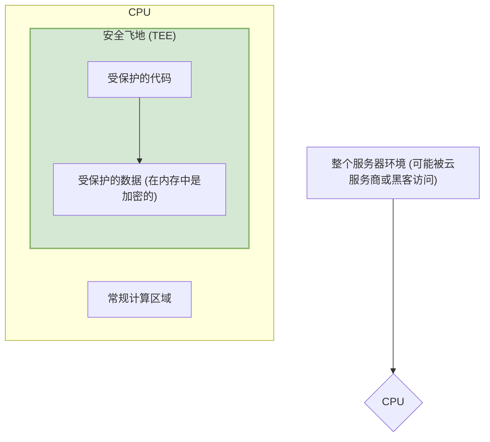
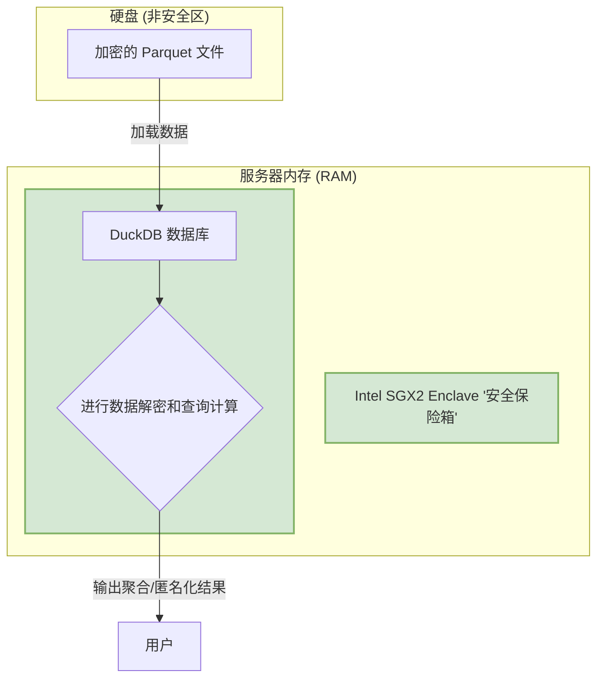
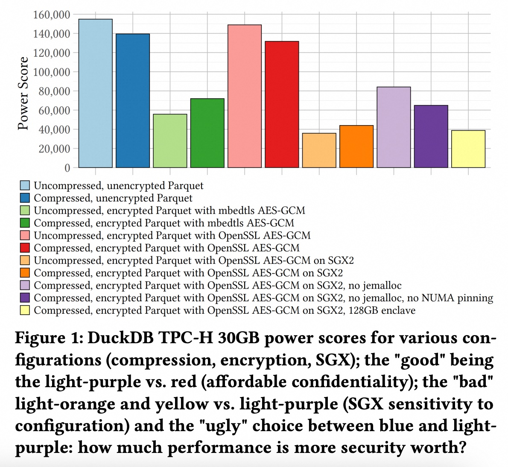

## AI论文解读 | DuckDB-SGX2: The Good, The Bad and The Ugly within Confidential Analytical Query Processing
        
### 作者        
digoal        
        
### 日期        
2025-07-13       
        
### 标签        
PostgreSQL , PolarDB , DuckDB , AI , 论文解读        
        
----        
        
## 背景  
      
https://arxiv.org/pdf/2405.11988        
  
      
提示:        
```        
读懂《DuckDB-SGX2: The Good, The Bad and The Ugly within Confidential Analytical Query Processing》这篇论文需要提前掌握哪些基础知识, 请使用中文给我讲一下这些基础知识, 尽量通熟易懂, 可以使用markdown支持的图形增加解释性.        
        
使用中文通熟易懂的解读《DuckDB-SGX2: The Good, The Bad and The Ugly within Confidential Analytical Query Processing》这篇论文, 关键内容请深入讲解, 可以使用markdown支持的图形增加解释性.        
        
使用中文提取《DuckDB-SGX2: The Good, The Bad and The Ugly within Confidential Analytical Query Processing》论文中一些重要的术语并详细解释, 可以使用markdown支持的图形示增加解释性.        
```        
        
## 1 前置知识
  
好的，为了完全理解《DuckDB-SGX2》这篇论文，您需要掌握一些关于数据库、计算机硬件安全和数据格式的基础知识。下面我将用通俗易懂的中文，并配合图表来解释这些概念。

这篇论文的核心在于，将一个高效的分析型数据库（DuckDB）放入一个硬件级别的安全“保险箱”（Intel SGX）中，去处理加密过的数据（Parquet格式），并评测这样做的性能开销有多大，以及如何进行优化。

### 核心基础知识概览

要读懂这篇论文，您需要了解以下几个关键领域：

1.  **机密计算 (Confidential Computing) 与可信执行环境 (TEE)**：这是保障“使用中”数据安全的大背景。
2.  **Intel SGX 技术**：论文中使用的具体“硬件保险箱”技术。
3.  **分析型数据库 (OLAP) 与 DuckDB**：论文中被保护和评测的主角。
4.  **列式存储与 Parquet 文件格式**：论文中处理的数据的存储方式。
5.  **性能评测基准 (TPC-H)**：衡量数据库性能的“标准考试”。

-----

### 1\. 机密计算 (Confidential Computing) 与 可信执行环境 (TEE)

想象一下，您的数据有三种状态：

  * **静态 (at rest)**：存储在硬盘上。此时可以通过磁盘加密来保护。
  * **传输中 (in flight)**：在网络中发送。此时可以通过HTTPS等加密协议来保护。
  * **使用中 (in use)**：在内存中，正被CPU计算。这是传统加密最薄弱的环节。如果服务器被黑客入侵，黑客可以直接从内存中读取正在处理的、未加密的敏感数据。

 **机密计算**   的目标就是保护“使用中”的数据。它通过一种叫做 **可信执行环境 (Trusted Execution Environment, TEE)** 的技术来实现。

 您可以将 TEE 理解为 CPU 内部开辟的一个被硬件加密和隔离的“安全区”，通常被称为 **Enclave (飞地)**  。



  *  **隔离性**：操作系统、虚拟机甚至物理硬件的其他部分，都无法窥探或篡改 Enclave 内部的数据和代码  。
  *  **机密性与完整性**：Enclave 里的数据在离开 CPU 进入主内存 (RAM) 时，会被硬件自动加密。只有当数据再次回到 CPU 的 Enclave 内部进行计算时，才会被解密  。这确保了即便攻击者能访问物理内存，也只能看到一堆无意义的加密数据。

### 2\. Intel SGX (Software Guard Extensions)

 **Intel SGX** 是 Intel 公司实现 TEE 技术的一种具体产品  。它就是论文里使用的那个“硬件保险箱”。

  *  **Enclave (飞地)**：SGX 允许应用程序在内存中创建一个被称为 Enclave 的受保护区域  。
  *  **EPC (Enclave Page Cache)**：这是主内存 (RAM) 中一块专门为所有 Enclave 预留的、受硬件加密保护的区域  。Enclave 的代码和数据就存放在这里。
  * **SGX1 vs. SGX2**：
      *  **SGX1**：早期的 SGX 版本，其 EPC 大小非常有限（例如，最大只有约 256MB）  。这对于需要大量内存的数据库应用来说，性能非常差，因为内存一旦用完，就需要进行极其缓慢的页面交换（swapping） 。
      *  **SGX2**：论文中使用的**新版本**   。它极大地扩展了 EPC 的大小（例如，可达 512GB）  ，这使得像 DuckDB 这样的大型应用可以整个在 Enclave 中运行，从而开启了在 TEE 中进行高性能分析查询的可能性  。
  *  **性能开销**：进入 (ECALL) 和退出 (OCALL) Enclave 都需要进行 CPU 上下文切换和清空缓存等操作，这会带来显著的性能开销   。因此，应尽量减少与外部非安全区域的通信。此外，Enclave 内部的内存访问模式（如缓存未命中）也会比在外部运行时开销更大  。

### 3\. 分析型数据库 (OLAP) 与 DuckDB

数据库大致分为两类：

  * **OLTP (在线事务处理)**：处理大量、短小的交易。例如，银行转账、电商下单。关注高并发和快速响应。
  * **OLAP (在线分析处理)**：处理少量、但极其复杂的查询，通常涉及海量数据。例如，分析过去一年全国所有门店的销售趋势。关注吞吐量和复杂计算的效率。

 **DuckDB** 是一个 **嵌入式 (embedded) 的 OLAP 数据库**  。

  *  **嵌入式**：它不是一个独立的服务器程序（像 MySQL 那样），而是一个可以被直接集成到应用程序中的代码库   。这使得将它“搬进” SGX Enclave 变得非常方便  。
  *  **分析型**：它为 OLAP 场景做了专门优化，例如采用**向量化执行 (vectorized execution)** 和**列式存储**技术，能非常快地处理大量数据  。
  * **向量化执行**：传统的数据库处理数据是一次一条 (row-by-row)，而向量化执行是一次一批（a vector of values at a time）。这极大地减少了指令分派的开销，提升了 CPU 缓存的利用率，就像批处理一样，效率远高于零售。

### 4\. 列式存储与 Parquet 文件格式

传统数据库按“行”存储数据，而现代分析型数据库更倾向于按“列”存储。

  * **行式存储 (Row-based)**：
    `ID | 姓名 | 年龄`
    `1, 张三, 25; 2, 李四, 30; 3, 王五, 22`
    适合一次性读取整条记录（如查询张三的所有信息）。

  * **列式存储 (Columnar)**：
    `ID: 1, 2, 3;`
    `姓名: 张三, 李四, 王五;`
    `年龄: 25, 30, 22`
    非常适合分析查询。例如，计算所有人的平均年龄，只需读取“年龄”这一列，而无需加载“ID”和“姓名”，大大减少了 I/O 数据量。同时，同一列的数据类型相同，非常容易被**压缩**。

 **Parquet** 就是一种非常流行的开源**列式存储文件格式**  。

  *  **压缩与加密**：论文提到，对数据先压缩再加密，可以减少需要加密的数据量，从而提升性能  。
  *  **模块化加密 (Modular Encryption)**：Parquet 支持对文件的不同部分（如表头、不同的列）进行独立加密  。这为数据安全提供了更细粒度的控制。

### 5\. 性能评测基准 (TPC-H)

 要科学地评价一个数据库的性能，不能凭感觉，需要一套标准的“考卷”。**TPC-H** 就是一套国际公认的、专门用于评测 OLAP 数据库性能的基准  。

  *  **SF (Scale Factor)**：TPC-H 使用“规模因子”来定义数据集的大小。例如，SF1 约等于 1GB，SF30 则约等于 30GB  。论文中使用了 SF30。
  *  **Power Score (性能得分)**：TPC-H 通过运行一系列复杂的查询（Q1, Q2, ... , Q22）并测量总时间，最终计算出一个综合得分   。分数越高，代表性能越强。论文中的柱状图（Figure 1）展示的就是不同配置下的 Power Score  。 

-----

### 总结：如何串联这些知识来理解论文

将以上知识点串联起来，你就可以理解论文的核心故事线了：

1.   **目标**：研究者们想在一个绝对安全的环境（Intel SGX2 Enclave）里运行一个高性能分析数据库（DuckDB），来查询硬盘上已经加密的敏感数据（加密的 Parquet 文件），并搞清楚这样做性能会损失多少  。

2.   **挑战**：把 DuckDB 直接放进 SGX Enclave 会遇到很多问题。比如，SGX 环境对内存分配、缓存未命中等非常敏感，默认的内存分配器（jemalloc）在 SGX 里会导致灾难性的性能下降（因为会触发昂贵的 EPC 分页） 。

3.   **“The Good” (好的方面)**：通过一系列精细的优化，比如切换内存分配器（换成 glibc malloc）、利用 CPU 的 AES 指令集加速加解密等，最终可以实现一个安全的查询方案，其性能开销相比完全不加密、不在 Enclave 中运行的“裸奔”状态，只慢了不到一倍（\<2x overhead）  。对于高安全需求的场景来说，这是完全可以接受的“安全税”  。

4.   **“The Bad and The Ugly” (糟糕与丑陋的方面)**：论文也展示了“反面教材”。如果配置不当，例如使用了不兼容的内存分配器，或者内存使用超出了 EPC 的限制，性能会急剧恶化，甚至比基线慢上好几倍  。这凸显了在 TEE 环境下进行性能调优的重要性。

掌握了这些基础知识后，您再去阅读论文中的图表和具体分析，就会清晰很多。
  
## 2 解读论文 
  
好的，我们来深入解读一下《DuckDB-SGX2》这篇论文。这篇论文探讨了在一个高度安全的环境中运行分析型数据库的性能表现，并总结了其中的成功经验（The Good）、遇到的陷阱（The Bad）以及需要做出的艰难权衡（The Ugly）。

### **核心目标：安全与性能能否兼得？**

 这篇论文的核心研究问题是：当我们将一个高性能的分析型数据库（DuckDB）放入一个由硬件保护的“安全保险箱”（Intel SGX2 Enclave）中，去处理加密过的海量数据时，性能会下降多少？以及我们应该如何配置系统来最小化这种性能损失？ 

 研究者们搭建了一个端到端的安全分析管道：数据在硬盘上以加密的 Parquet 文件形式存储（保护静态数据），然后在 SGX 安全飞地内被解密和处理（保护使用中的数据） 。



-----

### **The Good (好的方面): 可接受的安全性能开销**

 论文传达的最积极的结论是：通过精心配置，在享受硬件级安全保护的同时，性能损失是完全可以接受的  。

1.   **最终性能开销可控**：研究者成功地将 TPC-H SF30（一个30GB数据集的行业标准分析性能测试）的运行开销控制在了 **2倍以内**   。这意味着，为了获得端到端的数据机密性，只需要付出一倍左右的性能代价，这在许多高安全要求的场景下是非常有吸引力的  。

2.   **CPU硬件加速是关键**：DuckDB 默认使用一个纯 C++ 实现的 `mbedtls` 库来处理加密，这不使用 CPU 的专用指令，性能较差   。研究者修改了 DuckDB，使其能够调用 `OpenSSL` 库，从而利用现代 CPU 上的 **AES 专用指令集**   。这一改动效果显著，使得加解密操作的性能大幅提升，将加密带来的开销从原来的数倍降低到仅有10%左右  。

3.   **压缩与加密是“黄金搭档”**：论文验证了一个直观的优化：**先压缩，后加密**   。对于列式存储的 Parquet 文件，数据压缩率很高。先对数据进行压缩，可以显著减少需要加密和解密的数据量，从而直接降低了处理时间  。

-----

### **The Bad (糟糕的方面): SGX环境中的性能陷阱**

在达到理想性能之前，研究者们踩了很多“坑”。这些“糟糕”的经验对于后来者至关重要，因为错误的配置会导致性能灾难。

1.   **SGX不兼容的内存分配器 (jemalloc)**：这是论文发现的**最致命的性能陷阱**。DuckDB 在 Linux 上默认使用 `jemalloc` 这个高性能内存分配器   。然而，`jemalloc` 的内存管理方式（尤其是它频繁使用 `mmap` 系统调用来向操作系统申请和归还内存）在 SGX 环境下会引发灾难  。

      *  **问题根源**：SGX 有一个特殊的内存区域叫 EPC (Enclave Page Cache)，所有在安全飞地内使用的数据都必须存放在这里。当 `jemalloc` 释放内存时，其机制在 SGX 中会触发昂贵的 **EPC 分页 (Paging)** 操作   。这个操作远比普通操作系统的内存交换要慢，因为它需要对换出 EPC 的页面进行加密和完整性保护，开销极大  。
      *  **解决方案**：研究者们通过**禁用 `jemalloc`**，切换回系统默认的 `glibc malloc` 内存分配器，成功解决了这个问题   。`glibc malloc` 的行为似乎能更好地适应 SGX 环境，避免了毁灭性的 EPC 分页  。

2.   **高昂的缓存未命中 (Cache Miss) 成本**：SGX 飞地内的内存访问模式与外部不同。论文指出，飞地内的缓存未命中成本可能比外部高出 **5倍**   。这对于分析型查询中的哈希（hashing）操作影响巨大，因为哈希连接（hash join）和哈希聚合（hash aggregation）这类操作会产生大量的随机内存访问，从而导致频繁的缓存未命中   。这是导致优化后仍存在性能差距的主要原因之一  。

3.   **NUMA 局部性问题**：在多处理器的服务器上（通常有多个 NUMA 区域），如果 CPU 核心和它要访问的内存不属于同一个 NUMA 区域，访问延迟会增加。论文的实验显示，如果不在同一个 NUMA 区域内运行 DuckDB 和分配 EPC，同样会导致性能下降  。

下图展示了不同配置下的性能对比（分数越高越好），清晰地揭示了这些“陷阱”：

 *图注：改编自论文图1  *    

  *  **红色 (Red) vs. 浅橙色 (Light-orange)**：这是最关键的对比。两者都使用了高效的 OpenSSL，唯一的区别是浅橙色柱图在 SGX 中使用了默认的 `jemalloc`，导致了因 EPC 分页引发的性能崩溃  。
  *  **浅紫色 (Light-purple)**：这是**最佳安全配置**，即在 SGX 中使用 OpenSSL 且禁用了 `jemalloc`   。它的性能只比非安全环境下的红色柱图低了约 33%（即50%的开销），证明了方案的可行性  。

-----

### **The Ugly (丑陋的方面): 性能与安全的艰难权衡**

“丑陋”之处在于，为了追求极致安全，你必须小心翼翼地在各种配置之间权衡，而且性能的牺牲是客观存在的。

1.   **配置敏感性**：性能表现对系统配置极其敏感。从上图可以看出，一个错误的配置（如浅橙色或黄色柱图，后者表示内存超限导致EPC分页）和最佳配置（浅紫色）之间，性能差距可以达到数倍甚至十几倍  。这说明在 SGX 环境中部署数据库系统，不能“开箱即用”，必须进行深度调优。

2.   **安全与性能的最终抉择**：对比图中的**浅蓝色柱图**（完全不加密、不在 SGX 中运行的基准性能）和**浅紫色柱图**（最佳安全配置），就体现了最终的“丑陋”权衡   。浅紫色柱图的性能大约是浅蓝色的一半多一点，这个差距就是为了获得端到端机密性而必须支付的“安全税”   。决策者必须回答：**为了保护数据安全，我们愿意牺牲多少性能？**  。这篇论文给出的答案是，这个代价在很多场景下是值得的。

### **结论与未来展望**

总的来说，这篇论文给出了一个谨慎乐观的结论：

  *  **可行性**：在第二代 Intel SGX (SGX2) 硬件上，通过精心的系统调优，运行机密分析查询是完全可行的，其性能开销（1.5倍至2倍）在可接受范围内  。
  *  **关键优化**：成功的关键在于 **(1) 切换到 SGX 友好的内存分配器以避免 EPC 分页**    和 **(2) 利用 CPU 硬件指令加速解密**  。
  *  **未来工作**：研究者们也指出还有很多可以改进的地方，例如研究更适合 SGX 的内存分配器（如 `mimalloc`）  ，以及设计新的系统调用来减少数据在进出安全飞地时不必要的重复加解密开销  。
  
## 3 术语  
  
以下是论文《DuckDB-SGX2: The Good, The Bad and The Ugly within Confidential Analytical Query Processing》中的一些重要术语及其详细解释：

### 1. 机密计算 (Confidential Computing)
 机密计算旨在通过在基于硬件的、经证明的**可信执行环境 (TEE)** 中执行计算来保护使用中的数据   。这在将敏感数据外包给不受信任的外部云提供商的场景中特别有用  。

### 2. 可信执行环境 (Trusted Execution Environment, TEE)
 TEE 是一种硬件隔离环境，它确保即使操作系统或管理程序受到损害，数据和代码的机密性和完整性也得到保护   。Intel SGX 是最早为主流硬件引入的通用 TEE 技术  。

### 3. Intel SGX (Software Guard Extensions)
 Intel SGX 是一种将 RAM 的专用部分分离到安全“飞地”中的技术，旨在保护数据免受恶意行为者的访问，即使他们可以访问 RAM   。飞地始终保持数据加密，并且只在 CPU 封装内（即在寄存器和 CPU 缓存中）透明地解密数据，使其对不受信任的进程不可访问  。

**Intel SGX 的工作原理**:
*  **ECALLs (enclave calls) 和 OCALLs (out calls)**：受信任软件和不受信任软件通过这些特殊调用进行通信   。ECALLs 是应用程序对飞地的调用，OCALLs 是飞地对应用程序的调用   。这些交互涉及 CPU 上下文切换和额外步骤（如刷新 CPU 缓存和 TLB），以维护飞地数据的机密性，因此通信成本较高，应尽可能避免  。
*  **处理器保留内存 (Processor Reserved Memory, PRM)**：SGX 分配一个专用的内存区域 PRM，它受到非飞地访问的保护  。
*  **飞地页面缓存 (Enclave Page Cache, EPC)**：PRM 包含 EPC，EPC 以 4KB 的加密内存页存储代码和数据  。
*  **EPC 分页 (EPC paging)**：当 PRM 的分配内存超出时，SGX 允许页面进/出未受保护的内存。然而，由于额外的检查以保证被驱逐的 EPC 页面的机密性和完整性，此操作比常规页面交换昂贵得多  。

### 4. Intel SGX2
 SGX 的新版本 (SGX2) 利用 **Total Memory Encryption - Multi-Key (TME-MK)** 来提供高达每插槽 512GB 的 EPC 大小，取代了旧版本 SGX 中使用的更昂贵的 Memory Encryption Engine (MEE)   。TME-MK 依赖 AES-XTS 进行加密，并支持创建私有内存区域以确保机密性  。

### 5. DuckDB
 DuckDB 是一种嵌入式 DBMS，用于数据科学和数据转换管道等分析工作负载   。它具有紧凑的占用空间、可移植的代码和缺乏依赖性，使其能够无缝地在移动应用、浏览器环境（利用 WASM）以及笔记本电脑和云计算设置中运行   。DuckDB 实现了压缩向量化执行，允许直接查询 Parquet 文件，并最近增加了对其加密的支持  。

### 6. Parquet 模块化加密 (Parquet Modular Encryption)
 Parquet 是一种外部文件格式，DuckDB 可以直接对其进行查询   。Parquet 模块化加密分别加密文件的不同模块：页面、页眉、列和偏移索引以及页脚，使用 AES-GCM 或 AES-CTR 进行加密（尽管后者只能用于加密数据页面）  。

### 7. Gramine
 Gramine (以前称为 Graphene) 是最广泛使用的工具之一，用于将应用程序直接移植到 Intel SGX 飞地中运行   。它力求与 Linux 内核兼容，提供对 POSIX 标准的兼容性，同时保持最小化，仅实现运行可移植、硬件独立应用程序的 Linux 功能的基本子集   。它能够运行未修改的 Linux 应用程序，拦截应用程序请求，并将 OS 功能拉入飞地  。

### 8. jemalloc 与 glibc malloc
*  **jemalloc**：DuckDB 在 Linux 上默认使用的内存分配器   。研究发现，在 SGX 环境中，jemalloc 导致的内存碎片化会引起严重的性能问题，主要是由于 EPC 分页   。jemalloc 使用 `mmap` 调用，每个调用都需要清零相应的内存区域，而 SGX 无法利用现代操作系统中加速此操作的优化（如插入全零页面），这导致使用 `memset(0)`，从而增加了开销  。
*  **glibc malloc**：切换到 glibc malloc 可以带来更好的 SGX 性能，因为它能够将未使用的内存返还给操作系统，避免了已释放页面的加密，从而避免了 EPC 分页  。

### 9. NUMA (Non-Uniform Memory Access)
 NUMA 是一种计算机内存架构，其中多处理器系统中的内存访问时间取决于内存相对于处理器在哪个“节点”   。在 SGX 环境中，未能保持 NUMA 局部性会导致性能下降   。为了获得最佳性能，EPC 应该满足 NUMA 局部性  。

### 10. TPC-H 基准测试 (TPC-H Benchmark)
 TPC-H 是一个决策支持基准，它包含一组业务导向的即席查询和并发数据修改。论文使用 TPC-H SF30（30GB 规模因子）来评估 DuckDB 在机密计算环境中的分析查询处理性能  。

### 11. 性能指标
* **Power Score (总功率分)**：论文中用于衡量整体性能的指标，综合考虑了查询执行时间和吞吐量。
*  **Relative Score (相对分数)**：用于比较不同配置下单个查询的性能，以基线（通常是“压缩、加密 Parquet 使用 OpenSSL AES-GCM”）为参照  。

### 12. 缓存未命中 (Cache Misses)
 缓存未命中是指 CPU 试图从缓存中读取数据但未找到数据的情况，此时必须从较慢的内存层级（如主内存）中检索数据   。在 SGX 中，缓存未命中的成本可能高出 5 倍   。对于分析工作负载中常见的涉及大量聚合或连接的查询（如 TPC-H 中的 Q05、Q08、Q11、Q12、Q19），哈希操作是缓存未命中的主要来源，从而导致显著的性能开销  。

### 13. 内存加密引擎 (Memory Encryption Engine, MEE) 与 总内存加密 - 多密钥 (Total Memory Encryption - Multi-Key, TME-MK)
*  **MEE**：用于旧版 SGX 的内存加密技术  。
*  **TME-MK**：SGX2 中使用的新技术，取代了 MEE，它允许更大的 EPC 规模（高达 512GB），并且效率更高，因为它依赖于 AES-XTS 进行加密，并支持创建私有内存区域  。

### 14. OpenSSL 与 mbedtls
*  **mbedtls**：DuckDB 核心系统用于处理加密数据的纯 C++ 库   。由于其可移植性，DuckDB 没有使用汇编或特定于平台的指令进行 AES 加密/解密  。
*  **OpenSSL**：论文修改了 DuckDB 的 Parquet 功能，使其在运行时切换到 OpenSSL 实现的加密，从而利用了专用的 AES CPU 指令，这显著提高了加密和解密性能  。
  
## 参考        
         
https://arxiv.org/pdf/2405.11988  
        
        
<b> 以上内容基于DeepSeek、Qwen、Gemini及诸多AI生成, 轻微人工调整, 感谢杭州深度求索人工智能、阿里云、Google等公司. </b>        
        
<b> AI 生成的内容请自行辨别正确性, 当然也多了些许踩坑的乐趣, 毕竟冒险是每个男人的天性.  </b>        
  
  
  
#### [期望 PostgreSQL|开源PolarDB 增加什么功能?](https://github.com/digoal/blog/issues/76 "269ac3d1c492e938c0191101c7238216")
  
  
#### [PolarDB 开源数据库](https://openpolardb.com/home "57258f76c37864c6e6d23383d05714ea")
  
  
#### [PolarDB 学习图谱](https://www.aliyun.com/database/openpolardb/activity "8642f60e04ed0c814bf9cb9677976bd4")
  
  
#### [PostgreSQL 解决方案集合](../201706/20170601_02.md "40cff096e9ed7122c512b35d8561d9c8")
  
  
#### [德哥 / digoal's Github - 公益是一辈子的事.](https://github.com/digoal/blog/blob/master/README.md "22709685feb7cab07d30f30387f0a9ae")
  
  
#### [About 德哥](https://github.com/digoal/blog/blob/master/me/readme.md "a37735981e7704886ffd590565582dd0")
  
  

  
