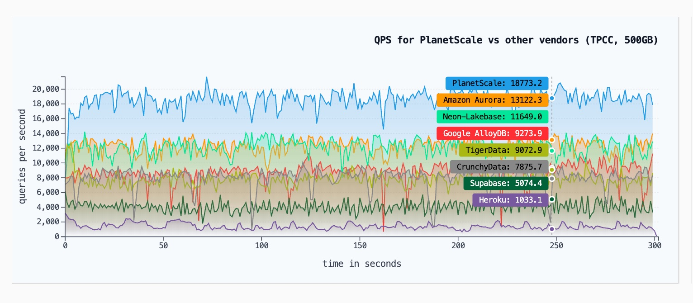

## PlanetScale发布Postgres云服务, 吊打主流云厂商“胜之不武”  
            
### 作者            
digoal            
            
### 日期            
2025-07-13           
            
### 标签            
PostgreSQL , PolarDB , DuckDB , 云盘 , 本地盘 , tpcc , 性能差异分析   
            
----            
            
## 背景   
https://planetscale.com/blog/benchmarking-postgres  
  
2025年7月1日，PlanetScale发布了PlanetScale for Postgres。 在过去的几个月里，PlanetScale一直专注于打造全球最佳的 Postgres 体验，包括性能。  
  
为了确保PlanetScale达到数据库性能的高标准，需要一种标准化、可重复且公平的方法来衡量和比较其他选项。 PlanetScale构建了一个内部工具“Telescope”，作为创建、运行和评估基准测试的首选工具。  
  
PlanetScale将其用作内部工具，以便在产品构建和调整过程中，快速向工程师提供产品性能演变的反馈。 PlanetScale决定与全世界分享，并为其他人提供复现这些发现的工具。  
  
看对比, 似乎PlanetScale吊打了几乎所有主流云厂商的PG服务!  
  
这怎么可能? 但事实就是这样, 例如PlanetScale 与 Amazon Aurora 基准测试  
- https://planetscale.com/benchmarks/aurora  
  
以及更多:   
- PlanetScale 与 Google AlloyDB 对比  
- PlanetScale 与 Neon/Lakebase 对比  
- PlanetScale 与 Supabase 对比  
- PlanetScale 与 CrunchyData 的比较  
- PlanetScale 与 TigerData 对比  
- PlanetScale 与 Heroku Postgres  
  
  
  
  
## PlanetScale 是谁?  
PlanetScale 是一个基于 **Vitess** 开源项目的 **无服务器（Serverless）MySQL 数据库即服务（DBaaS）平台**，由 Vitess 的共同创造者和维护者于 2018 年创立，总部位于美国加利福尼亚州山景城。它专注于为开发者提供高性能、可扩展且兼容 MySQL 的云数据库解决方案，并引入了类似 Git 的分支管理功能，使数据库开发和管理更加灵活。  
  
### **PlanetScale 的核心特点**  
1. **MySQL 兼容性**    
   - 完全兼容 MySQL 协议，现有的 MySQL 应用可以无缝迁移到 PlanetScale 上。  
   - 底层基于 **Vitess**（由 YouTube 开发的开源分布式 MySQL 集群管理工具），支持水平扩展。  
  
2. **无服务器架构（Serverless）**    
   - 自动扩缩容，开发者无需管理服务器或数据库实例。  
   - 按使用量计费，免费套餐提供 **5GB 存储、10 亿行读取/月、1000 万行写入/月**。  
  
3. **数据库分支（Branching）**    
   - 类似 Git 的分支功能，允许开发者创建独立的数据库分支（如 `main` 和 `develop`），进行测试或开发，然后通过 **Deploy Request** 合并回主分支。  
   - 支持 Schema Diff（结构差异比对），确保变更可控。  
  
4. **全球部署 & 多云支持**    
   - 支持 AWS、GCP 和 Azure 等多个云平台，可在不同地区（如美国、欧洲、亚太）部署数据库。  
   - 提供 **SSL 加密连接**，确保数据安全。  
  
5. **开发者友好工具**    
   - **Web 控制台** 和 **CLI 工具（`pscale`）**，方便管理数据库。  
   - 可与 **Vercel** 等 Serverless 平台搭配，构建全栈应用。  
  
### **适用场景**  
- **个人开发者 & 小型项目**：免费套餐适合个人博客、测试项目。  
- **企业级应用**：支持高并发、分布式部署，适合 SaaS、Web 应用等。  
- **CI/CD 集成**：分支功能便于数据库版本控制和自动化部署。  
  
### **限制**  
- **中国地区访问受限**：部分用户反馈在中国大陆可能无法直接使用，需调整网络设置。  
- **免费版限制**：超出免费额度后，按存储和读写操作收费。  
  
### **总结**  
PlanetScale 是一个现代化的 MySQL 云数据库服务，结合了 **Vitess 的分布式能力** 和 **Git 式分支管理**，适合需要弹性扩展、高可用性和 DevOps 友好工作流的开发者。  
  
  
## 吊打主流云厂商的秘密  
秘密就是本地存储.   
  
被对比的PG 云服务产品都采用了云盘. 而PlanetScale 是本地存储.   
  
云盘的特点(相比本地盘的优势):  
- 多副本, 可靠性更好  
- 数据在云盘, 当计算节点出现故障时, 故障转移更快. (在正常的服务器中再启动一个容器/ECS, 挂载数据云盘即可, 数据可以做到0丢失.)  
- 存储空间几乎无上限. 扩展云盘块设备以及文件系统即可.  
  
云盘的特点(相比本地盘的劣势):  
- 延迟更高, 即使采用RDMA可能也比本地nvme略高, 如果是普通网络则延迟更高(可能在1个数量级以上)  
- IOPS更低, 那些宣称IOPS很高的的云盘其实是需要并发才能达到的. 参考 [《对云盘100万IOPS有什么误解吗? 可能要先从队列深度谈起》](../202412/20241223_02.md)    
- 吞吐(带宽)更低, 与IOPS指标一样, 宣称吞吐(带宽)很高的云盘, 也是并发IO才能达到的.  
  
### 为什么PG本地存储和云存储会差这么大呢?  
首先, 我们假设所有服务都使用了WAL同步提交模式, 抑或开启了WAL分组批量提交.    
  
PS 番外篇:   
- [《PG PK MySQL/Oracle/国产.又干输了? 教你几招性能PK的“作弊技巧”! 让你的数据库也能遥遥领先》](../202406/20240618_01.md)    
  
PlanetScale给出的测试case:  
- tpcc 500G数据量  
  
实例规格  
- 32G内存  
- cpu相当  
- 足够放下tpcc数据的存储  
    - 对比厂商采用云盘  
    - PlanetScale 采用本地连接的具有无限 IOPS 的 NVMe 驱动器  
  
测试场景性能差异分析  
- select 1  
    - 这个实际上取决于客户端和数据库端的网络带宽和延迟, 理论上和IO无关, 性能应该差别不大  
- tpcc 只读  
    - 因为数据量已经远超内存, 查询时肯定会发生物理IO, 所以云盘就非常吃亏(带宽和延迟都比本地盘高)  
- tpcc 读写  
    - 提交时需要等WAL先落盘, 除非提高并发(触发分组提交), 否则性能一定比本地盘差.   
    - 即使触发分组提交, 云盘的IO延迟高一样比本地盘差, 只是差的没那么明显.  
  
抖动分析  
- 如果开启了FPW, 在进行检查点时, 可能写大量full page, 导致抖动.   
    - 同样也是云盘的IO延迟高, 抖动就更加明显  
  
稳定性  
- 在进行大量写、更新操作后, PG的表会膨胀到一定的比例, 由于目前vacuum不能单表并发垃圾回收, 所以云盘的IO延迟高的弱势又显现了. 在长时间测试后, 性能会比本地盘低, 因为膨胀更明显.    
  
<b> 那是不是就建议PG使用本地盘呢? </b>   
  
当然不是, 原因是   
- 本地盘如果坏了, 只能切换到只读实例, 如果不是同步流复制, 可能有数据丢失.   
- 即使开启同步流复制, 也有缺陷, 因为只读实例的抖动也可能导致主实例抖动.   
- 所以要开启同步流复制, 通常需要3节点或者2节点+WAL复制节点. 这样切换逻辑就比较复杂了, 切换时间可能更长. 成本也上去了.    
- 切换主从时, 老版本可能导致逻辑复制丢失. 除非你升级到支持逻辑复制slot failover的版本.   
  
说白了, 云原生PG, 基本上都是用云盘, 而不是本地盘.   
- 更高级的PG则使用类似Oracle RAC的架构, 也是用的共享云盘或者共享存储. 例如 Neon、PolarDB、Aurora     
  
同时, PG 18开始引入了AIO, 将大幅度降低IO延迟的影响.   
- [《PostgreSQL 18 preview - 异步IO(AIO)应用到缓冲区管理器层面》](../202503/20250331_01.md)    
- [《PostgreSQL 18 preview - 异步IO支持io_uring, IO性能大幅提升》](../202503/20250327_03.md)    
- [《PostgreSQL 18 preview - 打开文件数限制max_files_per_process更新, 为异步IO io_uring做准备》](../202503/20250325_01.md)    
- [《PostgreSQL 18 preview - 重磅, 刚刚支持异步IO框架》](../202503/20250319_02.md)    
- [《PostgreSQL 18 preview - read_stream 启发式预读量优化, 异步IO准备》](../202503/20250317_05.md)    
    
## 总结  
  
PlanetScale 的测试case没有问题, 但是用本地盘来对比云盘, 虽然性能胜了, 但是胜之不武啊.   
  
否则云厂商干嘛不出本地盘的形态呢? 又不是技术上办不到.    
  
且本地盘无法支撑高级PG架构, 例如存算分离的高级PG PolarDB、neon、Aurora等.    
  
    
  
#### [期望 PostgreSQL|开源PolarDB 增加什么功能?](https://github.com/digoal/blog/issues/76 "269ac3d1c492e938c0191101c7238216")
  
  
#### [PolarDB 开源数据库](https://openpolardb.com/home "57258f76c37864c6e6d23383d05714ea")
  
  
#### [PolarDB 学习图谱](https://www.aliyun.com/database/openpolardb/activity "8642f60e04ed0c814bf9cb9677976bd4")
  
  
#### [PostgreSQL 解决方案集合](../201706/20170601_02.md "40cff096e9ed7122c512b35d8561d9c8")
  
  
#### [德哥 / digoal's Github - 公益是一辈子的事.](https://github.com/digoal/blog/blob/master/README.md "22709685feb7cab07d30f30387f0a9ae")
  
  
#### [About 德哥](https://github.com/digoal/blog/blob/master/me/readme.md "a37735981e7704886ffd590565582dd0")
  
  

  
