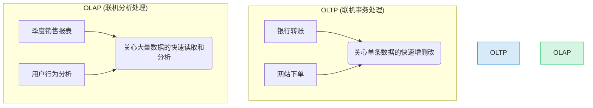
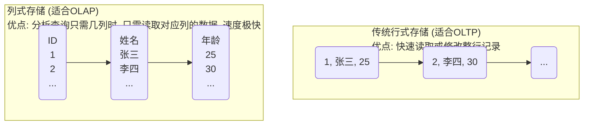
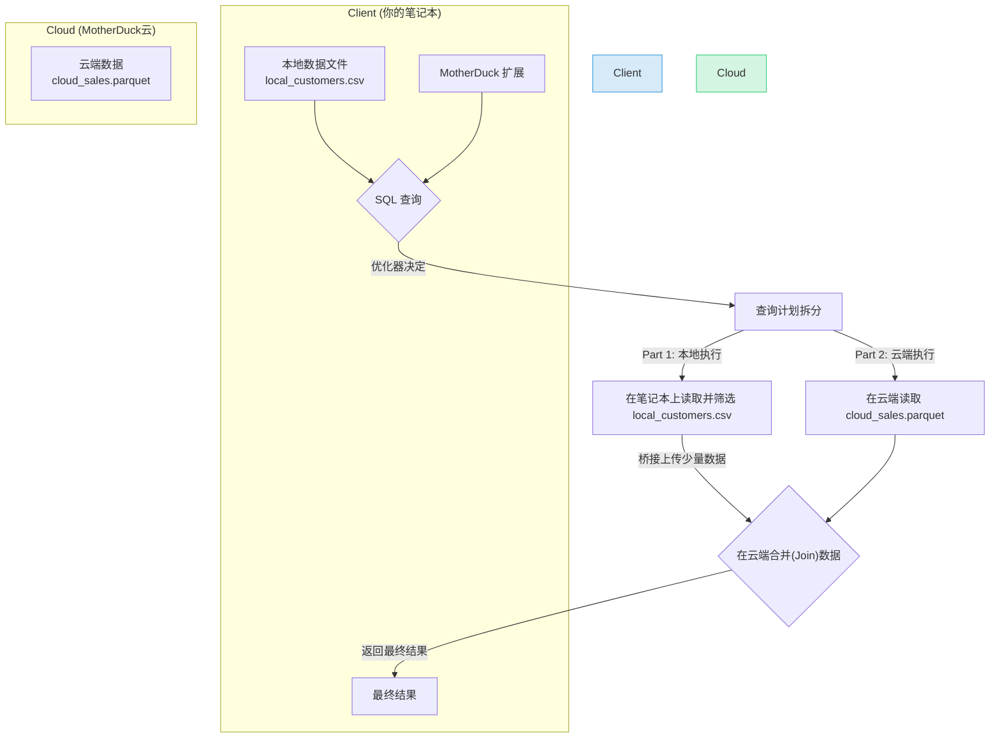
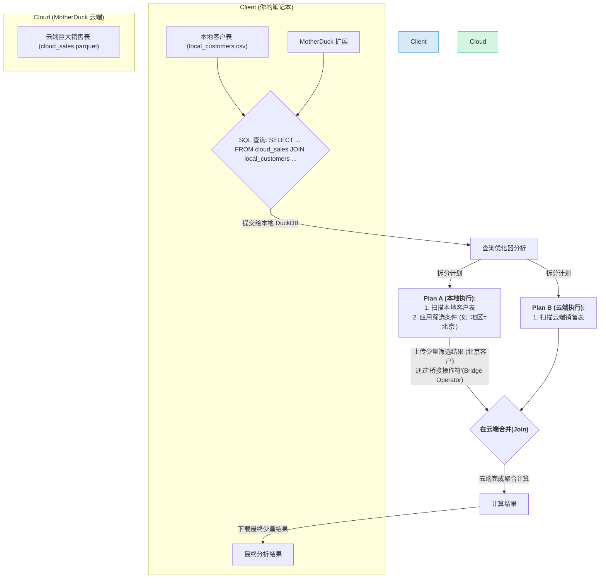
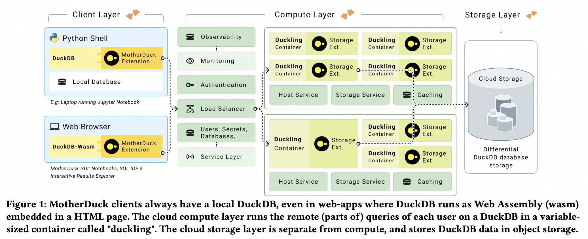
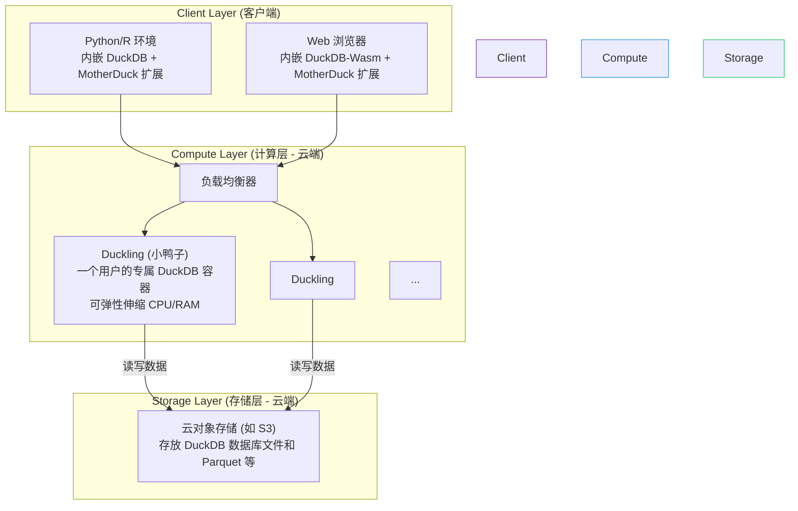
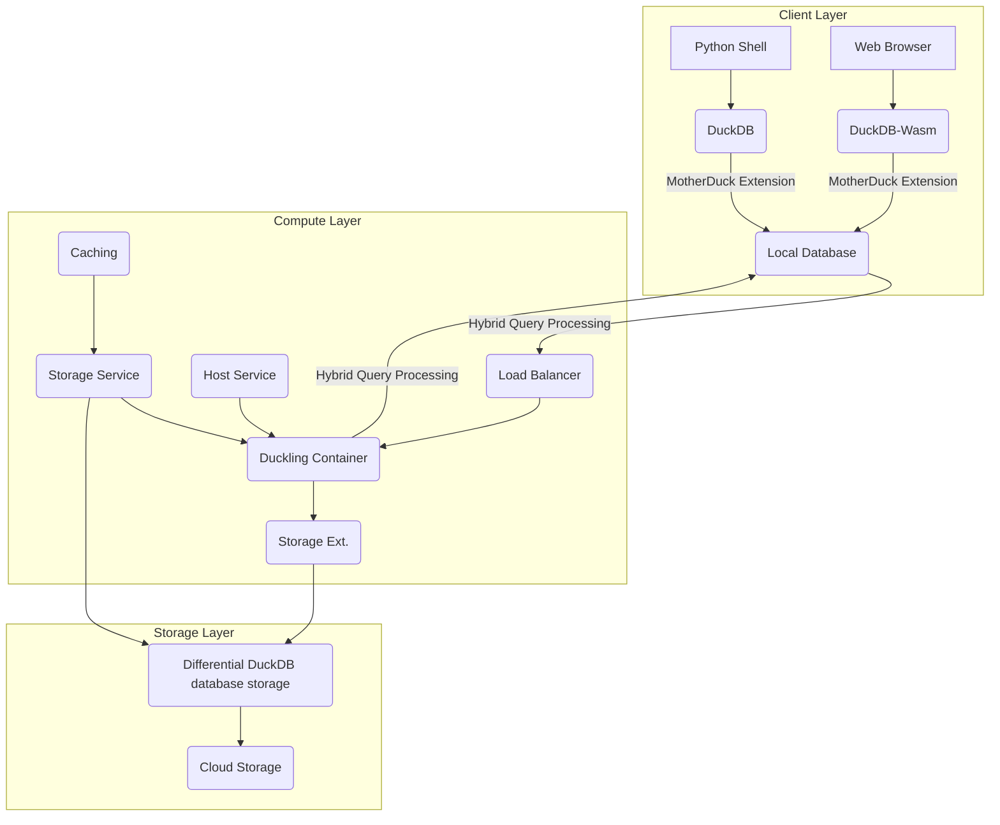

## AI论文解读 | MotherDuck: DuckDB in the cloud and in the client
        
### 作者        
digoal        
        
### 日期        
2025-07-14       
        
### 标签        
PostgreSQL , PolarDB , DuckDB , AI , 论文解读        
        
----        
        
## 背景  
      
https://www.cidrdb.org/cidr2024/papers/p46-atwal.pdf        
  
      
提示:        
```        
读懂《MotherDuck: DuckDB in the cloud and in the client》这篇论文需要提前掌握哪些基础知识, 请使用中文给我讲一下这些基础知识, 尽量通熟易懂, 可以使用markdown支持的图形增加解释性.        
        
使用中文通熟易懂的解读《MotherDuck: DuckDB in the cloud and in the client》这篇论文, 关键内容请深入讲解, 可以使用markdown支持的图形增加解释性.        
        
使用中文提取《MotherDuck: DuckDB in the cloud and in the client》论文中一些重要的术语并详细解释, 可以使用markdown支持的图形示增加解释性.        
```        
        
## 1 前置知识 
  
好的，为了完全理解《MotherDuck: DuckDB in the cloud and in the client》这篇论文，你需要对数据库、数据科学工具和云计算的一些核心概念有一定的了解。下面我将为你梳理这些基础知识，并尽量用通俗易懂的方式进行讲解。

### 核心知识地图

要读懂这篇论文，你需要掌握的知识可以分为以下几个板块：

1.  **数据库基础**：理解数据库是什么，以及不同类型的数据库有什么区别。
2.  **DuckDB 核心技术**：了解 DuckDB 这个“主角”的看家本领。
3.  **云计算与架构**：明白“云”到底是什么，以及 MotherDuck 是如何利用云的。
4.  **MotherDuck 的核心创新**：将前面几点结合，理解论文的亮点——“混合查询处理”。
5.  **相关应用领域**：了解这些技术主要为谁服务。

-----

### 1\. 数据库基础知识

#### 什么是数据库？

你可以把数据库想象成一个**超级加强版的 Excel**。它专门用来有组织地存储、管理和查询数据。当你需要处理比 Excel 表格大得多，或者需要更复杂、更快速查询的数据时，就需要数据库。人们通常使用一种叫做 **SQL (Structured Query Query Language)** 的语言来和数据库“对话”。

#### OLAP vs. OLTP：两种不同的“工作模式”

 数据库有两种主流的工作模式，理解它们的区别至关重要，因为 DuckDB 是一个典型的 **OLAP** 系统  。

  * **OLTP (On-Line Transactional Processing, 联机事务处理)**

      * **任务**: 处理大量的、短小的“事务”。比如网上购物下单、银行转账、更新用户信息。
      * **特点**: 关心的是快速地**读、写、更新**单条或少数几条记录，并保证数据准确性。
      * **好比**: 银行柜台的职员，一次处理一个客户的存取款业务，要求快、准、稳。

  * **OLAP (On-Line Analytical Processing, 联机分析处理)**

      * **任务**: 对海量历史数据进行复杂的分析查询。比如“分析过去一年所有商品的销售趋势”、“计算每个区域用户的平均年龄”。
      * **特点**: 关心的是对大量数据进行**批量读取和聚合**（如求和、平均值），查询通常很复杂，但对实时写入要求不高。
      * **好比**: 银行总部的分析师，需要查看过去一整年的交易数据来撰写商业报告，要求吞吐量大，能快速扫描海量数据。




**小结**: DuckDB 和 MotherDuck 主要解决的是 OLAP 场景，即数据分析任务。

-----

### 2\. DuckDB 核心技术

论文中多次提到 DuckDB 的技术特性，这些是它高性能的基石。

#### a. 嵌入式数据库 (Embedded Database)

 论文开篇就提到 DuckDB 是一个“嵌入式”分析数据库系统  。

  *  **什么意思？**: 它不像 MySQL 或 PostgreSQL 那样需要一个独立的服务器程序一直在后台运行。相反，它像一个“程序库”一样，直接被你的应用程序（比如一个 Python 脚本）包含并运行  。
  *  **好处**: 使用起来非常方便，没有复杂的安装和配置，非常适合在个人笔记本电脑上进行数据分析  。

#### b. 列式存储 (Columnar Storage)

 这是现代分析型数据库的标配，DuckDB 也采用了这种技术  。

  * **传统行式存储**: 像 Excel 一样，数据一行一行地存。`[张三, 25岁, 北京] | [李四, 30岁, 上海]`
  * **列式存储**: 数据一列一列地存。`[张三, 李四] | [25岁, 30岁] | [北京, 上海]`




  * **为什么对 OLAP 好？**: 分析查询通常只关心少数几列（例如，只计算“年龄”的平均值），列式存储只需读取“年龄”这一列的数据，而无需加载所有数据，大大提升了效率。

#### c. 向量化执行 (Vectorized Execution)

 这也是一个关键的性能优化技术，论文中也提到了  。

  * **传统方式 (一次一元组)**: CPU 像一个勤劳的工人，一次处理一行数据，处理完再拿下一行。这个过程有很多重复的指令开销。
  * **向量化执行**: CPU 变得更聪明，一次性加载一批（一“向量”）数据（比如一整列的1000个值），然后用一条指令完成对这批数据的操作。这极大地减少了指令开销，充分利用了现代 CPU 的能力。

-----

### 3\. 云计算与架构

 MotherDuck 的名字就暗示了它与云的关系  ，所以理解一些云概念是必要的。

  *  **Serverless (无服务器)**: 这并不意味着没有服务器，而是指**用户无需管理服务器**   。你只需提交你的代码或查询，云平台会自动分配资源来运行它，用完就释放。MotherDuck 正是采用这种模式来运行云端的查询任务  。
  *  **容器 (Container)**: 你可以把它理解为一个标准化的、轻量级的“软件打包盒”。它把应用程序和其所有依赖都打包在一起，无论在哪台机器上运行，环境都完全一致。MotherDuck 在云端为每个用户运行的 DuckDB 实例（论文中称为 "duckling"，小鸭子）就是放在容器里的  。
  *  **对象存储 (Object Storage)**: 这是一种在云上存储大量非结构化数据的服务，比如 AWS S3。它非常便宜和耐用，适合存放海量数据文件（如 Parquet 文件）   。MotherDuck 就利用它来存储云端的数据  。

-----

### 4\. MotherDuck 的核心创新：混合查询处理 (Hybrid Query Processing)

 这是整篇论文最核心、最新的概念  。

  *  **定义**: 指的是一个查询可以**一部分在用户的本地设备（如笔记本电脑）上执行，另一部分在云端服务器上执行**  。
  *  **工作原理**: MotherDuck 的智能优化器会判断数据的存放位置  。
      *  如果查询只涉及你笔记本上的本地文件，那么整个查询就在你的笔记本上运行  。
      *  如果查询只涉及云端的数据，那么整个查询就会被发送到云端的 "duckling" 上执行  。
      *  **最关键的情况**：如果查询需要**同时使用本地数据和云端数据**（比如用你本地的客户维度表去关联云端存储的巨大销售事实表），优化器会把查询拆分   。它可能会选择在本地读取并筛选少量数据，然后通过“桥接操作符”(bridge operators)   将这些中间结果上传到云端，与云端的大数据进行合并计算，最后将最终结果返回给你。




  *  **好处**: 兼顾了性能和成本。处理小数据时利用本地资源，快速响应；处理大数据时利用云端强大的计算能力   。同时，通过只传输必要的中间数据，而不是整个大数据文件，极大地节省了网络带宽和成本  。

### 5\. 相关应用领域

  *  **数据科学 (Data Science)**: 论文明确指出其目标用户是数据科学家   。他们经常在笔记本上使用 **Python (Pandas, an Arrow)** 或 **R** 等工具处理数据   。DuckDB 与这些工具无缝集成   ，而 MotherDuck 让他们能以同样的方式，处理超出笔记本能力范围的大数据  。
  *  **Parquet 文件**: 这是一种非常流行的列式存储文件格式，在数据科学和大数据领域被广泛使用。DuckDB 对其有很好的读写支持  。
  *  **WebAssembly (Wasm)**: 这是一项可以将 C++ 等高性能语言代码运行在网页浏览器的技术   。论文提到，MotherDuck 利用它可以在浏览器里直接运行一个功能完整的 DuckDB   ，从而实现极低延迟的网页交互式分析应用  。

### 总结

掌握了以上知识后，你再读这篇论文就会非常顺畅。你会明白：

  * MotherDuck 建立在高性能的 **OLAP 嵌入式数据库 DuckDB** 之上。
  * 它利用了 DuckDB 的**列式存储**和**向量化执行**等优点。
  * 它通过**无服务器、容器化**的云架构，为用户提供弹性的计算资源。
  * 它的核心突破在于**混合查询处理**，智能地将一个查询任务分配到**本地客户端**和**云端**，以达到最佳的性能和成本效益。
  *  它旨在赋能**数据科学家**和构建**新一代低延迟的数据应用**，挑战了传统“所有数据上云，所有计算上云”的“大数据”模式  。
  
## 2 解读论文 
  
好的，我们来一起深入解读《MotherDuck: DuckDB in the cloud and in the client》这篇论文。这篇论文介绍了一种新颖的云数据服务，它旨在改变数据科学家和分析应用与云端数据交互的方式。

我将为您分步解析，力求通俗易懂。

### 摘要：一句话理解 MotherDuck

 MotherDuck 是一个将广受欢迎的本地分析数据库 DuckDB 与云端连接起来的新服务   。其核心魔法在于它实现了 **“混合查询处理” (Hybrid Query Processing)** ，即同一条 SQL 查询可以一部分在你的笔记本电脑（客户端）上执行，另一部分在云端执行，从而实现性能与成本的最佳平衡  。

-----

### 1\. 核心背景：为什么需要 MotherDuck？

要理解 MotherDuck，首先要了解它的基础——**DuckDB**。

 DuckDB 是一个开源、高性能的**嵌入式分析数据库**  。

  *  **嵌入式**意味着它不需要安装独立的服务器软件，而是像一个程序库一样直接在你的应用程序（如 Python 脚本）中运行  。
  * **分析**意味着它专为数据分析（OLAP）场景优化，而非在线交易（OLTP）。
  *  它的高性能和与 Python、R 等数据科学工具的紧密集成，使其在数据科学家群体中备受欢迎  。

**面临的挑战：**
当数据科学家在笔记本电脑上使用 DuckDB 时，他们会遇到瓶颈：

1.  **数据规模限制**：笔记本的内存和 CPU 资源有限，无法处理超出其能力范围的大型数据集。
2.   **协作困难**：在团队中共享和同步数据库文件非常麻烦  。

 传统的解决方案是迁移到像 Snowflake 或 Redshift 这样的大型云数据仓库。但这些系统通常是为“超大规模”数据设计的，架构复杂（称为“横向扩展”或 scale-out）   。论文指出，超过95%的数据库其实小于1TB，超过95%的查询处理的数据小于10GB   。对于这些“日常”规模的分析任务，使用重型武器不仅成本高昂，而且由于多节点通信和调度的开销，延迟反而可能更高  。

 **MotherDuck 的切入点**：它旨在为这95%的用户提供一个更简单、更高效的方案。它让用户可以继续使用他们熟悉的 DuckDB，同时又能无缝地利用云的弹性和规模，而无需改变他们的工作流程或查询语句  。

-----

### 2\. 核心创新：深入讲解“混合查询处理”

 这是整篇论文的灵魂所在。混合查询处理意味着查询的执行地点是动态的，由一个智能的优化器根据数据的位置来决定  。

我们通过一个典型的场景来理解这个过程：

**场景**：一位数据科学家在她的笔记本电脑上有一个包含客户信息的本地文件 `local_customers.csv`。她需要用这个文件去关联存储在云端 S3 上的一个巨大（上百GB）的销售记录表 `cloud_sales.parquet`，以分析特定区域客户的购买行为。

#### 如果没有 MotherDuck (纯本地处理):

 用户需要将巨大的 `cloud_sales.parquet` 文件从云端完整下载到本地。这会消耗大量的时间和网络带宽（云服务商通常对数据传出收费，即 Egress Cost） 。

#### 使用 MotherDuck 的混合查询处理:



**深入讲解**:

1.   **查询解析与优化**: 当用户执行 SQL 查询时，安装在本地 DuckDB 中的 MotherDuck 扩展会介入   。它的查询优化器会分析查询涉及的所有数据源的位置  。
2.   **计划拆分**: 优化器发现 `local_customers` 在本地，而 `cloud_sales` 在云端   。它不会愚蠢地移动大表，而是生成一个成本最低的混合执行计划   。这个计划决定将对小表 `local_customers` 的扫描和过滤操作放在**本地**执行  。
3.   **桥接操作符 (Bridge Operators)**: 本地操作完成后，会得到一个非常小的中间结果（比如，只有几百个北京地区的客户ID）。MotherDuck 引入了专门的“桥接操作符”，负责高效地将这个小结果集上传到云端  。
4.   **云端计算**: 在云端，一个被称为 "duckling" 的 DuckDB 实例会接收到这个上传的数据，并与巨大的 `cloud_sales` 表进行连接（Join）和后续的聚合运算  。因为最繁重的计算发生在数据量最大的地方，所以避免了大规模数据移动。
5.  **返回结果**: 最终的计算结果（通常也很小）再从云端返回到用户的笔记本上显示。

 **优势**：这种模式的效率极高。论文中的基准测试显示，对于100GB的数据，混合查询处理比纯本地处理快了将近**10倍**   。这主要是因为避免了下载90GB数据的巨大开销，并且利用了云端更强的计算核心  。

-----

### 3\. 系统架构：MotherDuck 是如何构建的？

 论文中的图1展示了其三层架构  ：    



  *  **客户端层 (Client Layer)**: 这是用户直接交互的地方。它可以是运行在笔记本上的 Python/R 环境，也可以是一个 Web 浏览器   。关键在于，**客户端永远有一个本地运行的 DuckDB 实例**   。在浏览器中，这是通过 WebAssembly (Wasm) 技术实现的，它使得高性能的 DuckDB 核心可以直接在网页中运行  。
  *  **计算层 (Compute Layer)**: 这是云端的大脑。当需要云端计算时，MotherDuck 会为每个用户按需启动一个或多个被称为“duckling”的容器   。每个 duckling 内部都运行着一个标准的 DuckDB 实例   。这些容器的资源（CPU核心、内存）可以根据查询的需要动态调整（“纵向扩展”或 scale-up/down），用完即焚，非常节省成本  。
  *  **存储层 (Storage Layer)**: 这是云端的数据仓库，建立在如 AWS S3 这样的高性价比、高持久性的对象存储之上   。MotherDuck 对 DuckDB 的存储格式进行了扩展，使其能适应云对象存储“文件不可修改”的特性，通过写入新文件来记录数据变更，这同时也实现了数据快照、分支和时间旅行等高级功能  。

-----

### 4\. 关键特性与应用场景

  *  **数据协作与共享**: 用户可以轻松地将云端的数据库以只读或读写模式共享给同事   。只需分享一个链接，对方就能通过 `ATTACH` 命令立即访问到最新的数据快照，极大地简化了协作流程  。
  *  **超低延迟的交互式 Web 应用**: 在 MotherDuck 的 Web UI 中，当一个查询完成后，结果集会被缓存到浏览器本地的 DuckDB-Wasm 实例中   。之后用户对结果进行的排序、过滤、聚合等所有操作，都是在本地 Wasm 上执行的 SQL 查询，响应时间可以控制在100毫秒以内，感觉就像瞬时完成，提供了无与伦比的交互体验  。
  *  **AI 助手**: MotherDuck 内置了 AI 功能，允许用户使用自然语言提问，系统会自动将其转换成 SQL 查询并执行  。这降低了数据分析的门槛。

### 总结与展望

MotherDuck 并非要创造一个全新的数据库，而是巧妙地将一个成熟优秀的本地数据库（DuckDB）与云的强大能力结合起来。它提出的“混合查询处理”范式，是对当前“要么纯本地，要么纯云端”数据处理模式的有力挑战。

它的核心理念可以概括为：

  * **以用户为中心**: 保持用户熟悉的工作流，无需学习复杂的云平台。
  * **效率优先**: 让计算发生在离数据最近的地方，最小化数据移动。
  *  **精简架构**: 提倡“纵向扩展”（scale-up）而非庞大的“横向扩展”（scale-out）集群，认为这对于绝大多数分析任务而言更简单、更经济、更环保  。

 正如论文所言，它相信这种模式能够为那95%被现有“大数据”架构过度服务的用户，提供一个更敏捷、更具成本效益的未来  。
  
## 3 术语  
  
以下是《MotherDuck: DuckDB in the cloud and in the client》论文中的一些重要术语及其详细解释：

### 1\. **DuckDB**

  *  **解释**: DuckDB是一个嵌入式分析型数据库系统，最初由CWI开发   。它的“嵌入式”特性意味着它运行在客户端进程使用的驱动/API库内部，负责发出SQL查询   。因此，所有使用DuckDB的客户端都拥有一个本地数据库引擎  。
  * **特点**:
      *  高性能  。
      *  易于使用，与Python和R数据科学库紧密集成  。
      *  支持列式存储、主键和外键、嵌套数据类型的高效存储、为批量处理优化的数据库事务、向量化查询执行引擎、丰富的关系运算符等  。
      *  可以通过扩展模块增加新功能，例如数据类型、运算符、优化器规则，甚至解析器  。

### 2\. **MotherDuck**

  *  **解释**: MotherDuck是一项新服务，旨在将DuckDB连接到云端   。它在云端提供DuckDB数据存储和无服务器查询处理  。
  *  **目的**: 允许现有的DuckDB用户（如数据科学家）无需更改查询即可开始使用云计算，从而提供更好的性能和处理更大数据集的可扩展性   。它还通过云实现DuckDB数据库共享，便于协作  。
  *  **架构**: MotherDuck的架构包括客户端层、计算层和存储层  。

### 3\. **混合查询处理 (Hybrid Query Processing)**

  *  **解释**: MotherDuck提供的概念，指在客户端部分执行查询，在云端部分执行查询的能力   。这意味着用户可以同时拥有本地DuckDB数据库和本地文件，并在一个查询中查询所有这些数据源  。
  *  **工作原理**: MotherDuck优化器会规划查询运算符，使其在数据所在地附近执行   。如果所有数据源都在本地，查询将完全在本地处理；如果所有数据源都在远程，查询将在云中执行   。如果部分数据在本地，部分在远程，则查询的一部分将在本地执行，一部分将在远程执行，通过“桥接”运算符在本地和云之间上传和下载元组流  。
  *  **优势**: 能够利用本地设备的计算能力，减少对云硬件的需求，从而可能降低碳排放   。还支持新的数据密集型应用，如低延迟分析型Web应用  。

### 4\. **Duckling**

  *  **解释**: MotherDuck计算平台上的一个短期、按需分配的容器，每个容器运行一个DuckDB实例，用于为单个用户的请求提供服务  。
  *  **作用**: 提供用户之间的隔离边界，同时享受共享一切多租户平台的大部分优势   。在生命周期中，可以更改分配给容器的RAM和CPU资源量   。当不使用时，MotherDuck会完全关闭容器  。
  *  **与DuckDB集成**: DuckDB已实现可随时间调整其缓冲区管理器的大小，其morsel驱动的调度( 论文: https://dl.acm.org/doi/pdf/10.1145/2588555.2610507 )允许动态更改用于查询处理的内核数量，这使得Duckling能够灵活地调整资源  。

### 5\. **桥接运算符 (Bridge Operators)**

  *  **解释**: MotherDuck客户端扩展引入的新型流水线式运算符，用于在客户端和Duckling之间下载和上传元组流  。
  *  **作用**: 在混合查询计划中，某个片段可能生成数据，这些数据由在另一台机器（即客户端和云，反之亦然）上运行的另一个查询片段消耗   。桥接运算符旨在在上传和下载带宽不对称的情况下良好工作，并处理客户端可能存在的不同字节序   。它们还维护DuckDB并行流水线的特殊能力，即以与原始流水线源中存储顺序相同的顺序在接收器中具体化元组  。

### 6\. **远程-本地优化器 (Remote-local Optimizer)**

  *  **解释**: MotherDuck客户端扩展为DuckDB优化器添加的新规则，用于规划混合查询处理  。
  *  **工作原理**: 在DuckDB优化计划后，此规则将计划拆分为片段，并指定每个片段在本地或远程运行，并在两者之间插入桥接运算符   。优化器首先收集约束，每个叶节点都被分配其访问数据的位置   。它将生成数据（如 `range()` 或 `repeat()`）的数据源标记为可以在任何一方同样良好地运行   。在遵守这些约束的情况下，优化器规则会寻找数据传输成本估算最小的计划  。

### 7\. **虚拟目录 (Virtual Catalog)**

  *  **解释**: 由于查询规划在本地进行，因此必须确保本地DuckDB能够访问有关云端数据库的元数据信息   。MotherDuck使用DuckDB的可扩展目录来创建和维护所有相关云数据库的MotherDuck代理目录  。
  *  **作用**: 这个轻量级虚拟目录为规划目的提供与DuckDB目录相同的功能，但无需支持实际的数据操作，因为这些操作在云中运行  。

### 8\. **声明式缓存 (Declarative Caching)**

  *  **解释**: MotherDuck GUI中结果缓存的实现方式，纯粹依赖于SQL抽象和混合查询处理模型  。
  *  **工作原理**: 执行查询时，MotherDuck GUI会将结果累积到本地结果缓存中   。这个内存表由用户浏览器中运行的DuckDB-wasm管理   。随后所有对透视表的交互操作都是通过对其生成SQL查询来执行的   。这保证了仅依赖本地（临时）表的查询将在本地执行  。

### 9\. **DuckDB-wasm**

  *  **解释**: DuckDB编译为WebAssembly (wasm) 的版本  。
  *  **应用**: 可以在HTML中嵌入DuckDB-wasm来构建Web应用程序，并将其连接到云中的MotherDuck   。它在浏览器中运行，管理SQL笔记本的结果集在内存中的DuckDB数据库中  。
  *  **优势**: 为交互式数据探索提供非常低的延迟操作   。能够比基于JavaScript的替代方案更紧凑地存储数据，从而高效地缓存和处理相对大量的数据  。

### 10\. **AI助手 (AI Assistant)**

  *  **解释**: MotherDuck GUI内置的功能，允许用户通过自然语言而不是SQL来 формулировать笔记本查询  。
  *  **工作原理**: 在后台，MotherDuck AI会自动生成SQL语句，如果需要（根据错误消息）迭代修复它，并针对当前数据库执行   。用户还可以利用部分功能从自然语言问题生成SQL片段或修复损坏的查询  。

以下是MotherDuck架构的简化图示，以增强理解：



**图示解释:**

  *  **客户端层 (Client Layer)**: 用户与MotherDuck交互的地方，包括Python Shell和Web浏览器   。无论是通过Python Shell中的DuckDB还是Web浏览器中的DuckDB-Wasm，都包含MotherDuck扩展和本地数据库  。
  *  **计算层 (Compute Layer)**: MotherDuck在云端运行的核心，处理远程查询   。它包含负载均衡器   、负责监控和认证的服务   ，以及运行DuckDB实例的“Duckling容器”   。每个Duckling容器都有存储扩展   、主机服务   、存储服务    和缓存  。
  *  **存储层 (Storage Layer)**: 负责持久化存储数据，包括云存储    和差异化DuckDB数据库存储  。
  *  **混合查询处理 (Hybrid Query Processing)**: 图中连接客户端层和计算层以及计算层和存储层的虚线箭头代表了混合查询处理的过程，数据可以在本地和云之间流动，实现灵活的查询执行  。
  
## 参考        
         
https://www.cidrdb.org/cidr2024/papers/p46-atwal.pdf  
        
        
<b> 以上内容基于DeepSeek、Qwen、Gemini及诸多AI生成, 轻微人工调整, 感谢杭州深度求索人工智能、阿里云、Google等公司. </b>        
        
<b> AI 生成的内容请自行辨别正确性, 当然也多了些许踩坑的乐趣, 毕竟冒险是每个男人的天性.  </b>        
  
  
  
  
#### [期望 PostgreSQL|开源PolarDB 增加什么功能?](https://github.com/digoal/blog/issues/76 "269ac3d1c492e938c0191101c7238216")
  
  
#### [PolarDB 开源数据库](https://openpolardb.com/home "57258f76c37864c6e6d23383d05714ea")
  
  
#### [PolarDB 学习图谱](https://www.aliyun.com/database/openpolardb/activity "8642f60e04ed0c814bf9cb9677976bd4")
  
  
#### [PostgreSQL 解决方案集合](../201706/20170601_02.md "40cff096e9ed7122c512b35d8561d9c8")
  
  
#### [德哥 / digoal's Github - 公益是一辈子的事.](https://github.com/digoal/blog/blob/master/README.md "22709685feb7cab07d30f30387f0a9ae")
  
  
#### [About 德哥](https://github.com/digoal/blog/blob/master/me/readme.md "a37735981e7704886ffd590565582dd0")
  
  

  
