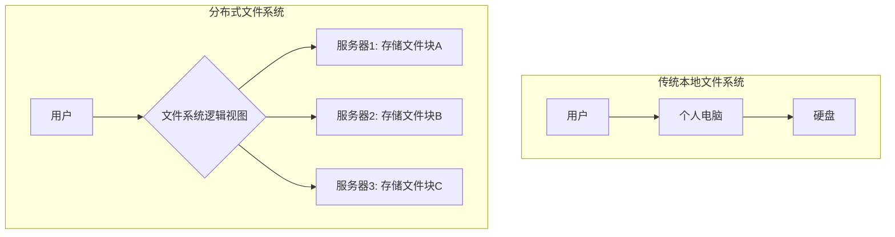
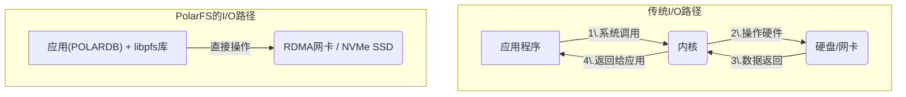
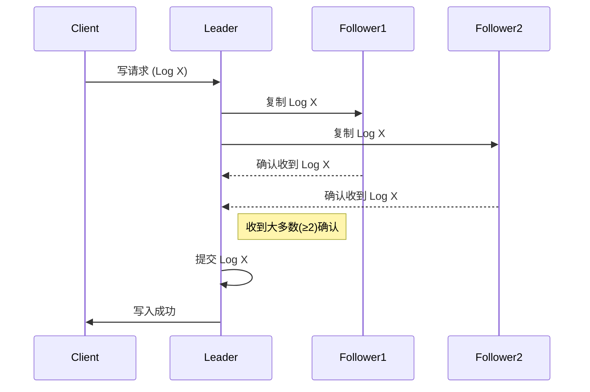
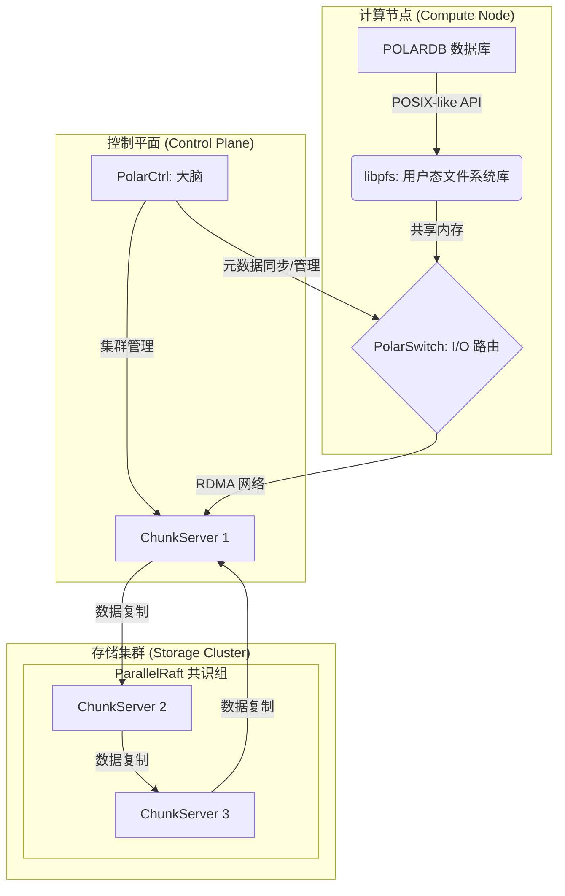
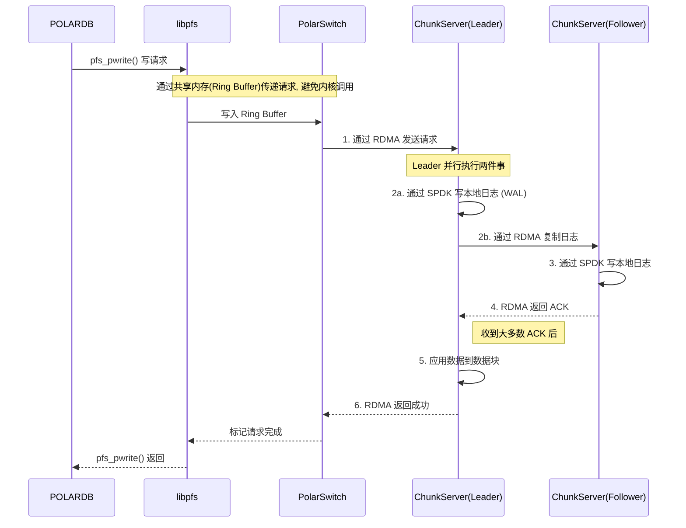
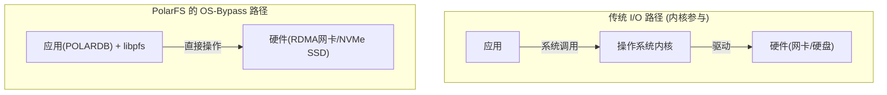
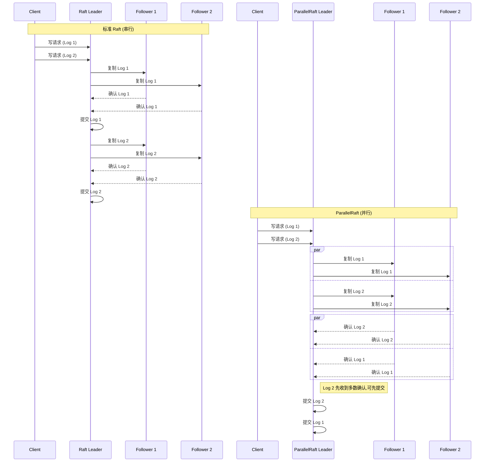

## AI论文解读 | PolarFS: An Ultra-low Latency and Failure Resilient Distributed File System for Shared Storage Cloud Database
        
### 作者        
digoal        
        
### 日期        
2025-07-15       
        
### 标签        
PostgreSQL , PolarDB , DuckDB , AI , 论文解读        
        
----        
        
## 背景  
      
https://www.vldb.org/pvldb/vol11/p1849-cao.pdf        
  
      
提示:        
```        
读懂《PolarFS: An Ultra-low Latency and Failure Resilient Distributed File System for Shared Storage Cloud Database》这篇论文需要提前掌握哪些基础知识, 请使用中文给我讲一下这些基础知识, 尽量通熟易懂, 可以使用markdown支持的图形增加解释性.        
        
使用中文通熟易懂的解读《PolarFS: An Ultra-low Latency and Failure Resilient Distributed File System for Shared Storage Cloud Database》这篇论文, 关键内容请深入讲解, 可以使用markdown支持的图形增加解释性.        
        
使用中文提取《PolarFS: An Ultra-low Latency and Failure Resilient Distributed File System for Shared Storage Cloud Database》论文中一些重要的术语并详细解释, 可以使用markdown支持的图形示增加解释性.        
```        
        
## 1 前置知识 
  
好的，为了完全理解《PolarFS》这篇论文，你需要掌握一些关于分布式系统、现代硬件、操作系统和数据库架构的基础知识。我会用通俗易懂的语言，结合图表来为你解释这些概念。

-----

### 核心知识地图

要读懂 PolarFS，可以从以下四个方面构建你的知识体系：

1.  **分布式系统基础**：这是整个系统存在的根基。
2.  **关键硬件与软件技术**：这是实现“超低延迟”的秘密武器。
3.  **操作系统与数据库架构**：这是 PolarFS 的应用场景和设计哲学。
4.  **共识协议 (Consensus Protocol)**：这是保证“故障恢复能力”的核心算法。

下面我们来逐一讲解。

-----

### 1\. 分布式系统基础 (Distributed System Fundamentals)

#### 什么是分布式文件系统？

想象一下，你有一部非常大的电影，一个硬盘放不下。你可能会把它切成几段，分别存放在不同的硬盘上。分布式文件系统做的就是类似的事情，但规模要大得多。它将文件数据和管理信息分散存储在多台独立的计算机（称为“节点”）上，但对用户来说，它看起来就像是一个单一、巨大的文件系统。

  * **与本地文件系统的区别**：
      * **本地文件系统**：管理你电脑上单个硬盘（如 C盘、D盘）上的文件。
      * **分布式文件系统**：通过网络管理一个计算机集群中所有硬盘上的文件。




**为什么需要它？**

  * **高容量**：可以存储海量数据，远超单机硬盘。
  * **高可靠性**：通过数据冗余（即“副本”），一台服务器坏了，数据也不会丢失。
  * **高扩展性**：存储空间或处理能力不够时，加机器就行了。

>  **关联论文**: PolarFS 本身就是一个专为云数据库设计的分布式文件系统   。它把数据库的文件（如数据文件、日志文件）切分成“块(Chunk)”，分散到多个存储服务器(ChunkServer)上  。

-----

### 2\. 关键硬件与软件技术 (Key Hardware & Software Tech)

这部分是理解 PolarFS 如何做到“超低延迟”的关键。

#### a. RDMA (Remote Direct Memory Access) - 远程直接内存访问

传统的网络通信，比如你用微信发消息，数据需要经过操作系统内核的层层处理，CPU 需要多次拷贝数据，非常耗时。

**RDMA** 是一种革命性的网络技术。它允许一台计算机的网卡直接读写另一台计算机的内存，几乎不需要对方 CPU 的干预，也无需操作系统内核的介入。


 **核心优势**：极低的延迟（论文中提到4KB数据传输约7微秒  ）和极低的CPU占用率。

>  **关联论文**: PolarFS 使用 RDMA 在存储节点之间高速复制数据（日志）   ，以及在计算节点和存储节点间传输 I/O 请求，这是其延迟远低于 CephFS 等传统分布式文件系统的关键原因之一  。

#### b. NVMe (Non-Volatile Memory Express) & SPDK (Storage Performance Development Kit)

  *  **NVMe**：是专门为 SSD（固态硬盘）设计的高速接口协议。过去的SATA协议是为慢速的机械硬盘设计的，已经无法发挥现代SSD的全部潜力。NVMe 就像是为法拉利赛车专门修建的赛道，可以实现极高的并发和低延迟  。

  *  **SPDK**：是一个软件工具包，它允许应用程序**直接从用户空间**访问 NVMe SSD，完全绕过操作系统内核  。这避免了传统I/O路径中昂贵的内核态切换和中断处理。

>  **关联论文**: PolarFS 的 I/O 栈完全构建在用户空间，利用 SPDK 直接与 NVMe SSD 交互，这是其读写延迟能接近本地SSD的另一个核心秘密  。

-----

### 3\. 操作系统与数据库架构 (OS & Database Architecture)

#### a. 用户空间 (User Space) vs. 内核空间 (Kernel Space)

操作系统为了保护系统的稳定性，将内存划分为两个区域：

  * **内核空间**：操作系统自己运行的地方，拥有最高权限。
  * **用户空间**：普通应用程序（如浏览器、游戏）运行的地方，权限受限。

当应用程序需要进行文件读写或网络通信时，必须请求操作系统内核来完成，这个过程称为“系统调用”，它涉及到从用户空间到内核空间的“上下文切换”，非常耗时。



>  **关联论文**: PolarFS 的设计哲学就是“OS-Bypass” (绕过操作系统)。它提供一个叫 `libpfs` 的库，直接链接到数据库进程中   。数据库的所有文件操作都由 `libpfs` 在用户空间完成，通过 SPDK 和 RDMA 直接访问硬件，避免了内核的性能开销  。

#### b. 存算分离 (Decoupling Storage from Compute)

这是现代云数据库的流行架构。

  * **传统架构**：计算（数据库软件运行）和存储（数据存放的硬盘）都在同一台服务器上。
  * **存算分离架构**：计算在一组服务器（计算节点）上，存储在另一组独立的服务器（存储节点）上，通过高速网络连接。

*(图片概念类似于论文中的 Figure 1)*

**好处**：

1.   **弹性伸缩**：计算不够就加计算节点，存储不够就加存储节点，互不影响  。
2.   **资源利用率高**：存储可以形成一个共享池，避免单个节点硬盘空间浪费或不均  。
3.   **快速故障恢复/迁移**：计算节点是无状态的，坏了可以秒级切换到新的节点，因为数据都在远端的共享存储上  。

>  **关联论文**: PolarFS 就是为了支撑 POLARDB 这种存算分离架构而设计的共享存储系统   。它允许多个数据库实例（一个主节点，多个只读节点）同时访问同一份数据  。

-----

### 4\. 共识协议 (Consensus Protocol) - Raft

#### 什么是共识协议？

在分布式系统中，为了保证数据的高可靠性，一份数据通常会存多个副本（比如3份）。当需要修改数据时，如何保证所有副本都以一致的顺序被正确修改，尤其是在网络延迟、节点宕机的情况下？这就是共识协议要解决的问题。

#### Raft 协议

Raft 是目前最流行的共识协议之一，以其易于理解而闻名。它的核心思想是：

1.  **领导者选举 (Leader Election)**：在一组副本中，大家投票选出一个“领导者(Leader)”。
2.  **日志复制 (Log Replication)**：所有写操作都必须先发给 Leader。Leader 把它作为一条日志，复制给其他“跟随者(Followers)”。
3.  **提交 (Commit)**：当 Leader 收到**大多数** Follower 的成功确认后，它就认为这条日志已经“提交”(committed)，然后通知客户端写入成功，并应用到自己的状态机（即写真正的数据）。




 **Raft 的一个关键特点**：**严格串行化**。日志必须一条接着一条按顺序提交和应用，不允许出现“空洞”  。

>  **关联论文**: PolarFS 最初尝试使用 Raft，但发现它的严格串行化在高并发 I/O 场景下会严重影响性能，导致吞吐量下降   。为此，作者们提出了 **ParallelRaft**   。ParallelRaft 允许日志乱序确认和提交（只要它们不操作同一块数据），并设计了巧妙的机制来处理日志“空洞”，从而极大地提升了并发性能  。理解 Raft 的基本原理和其串行化的“痛点”，是理解 ParallelRaft 创新的前提。

### 总结

在你阅读论文之前，确保你对以下概念有一个清晰的认识：

  * **分布式文件系统**是如何组织数据的。
  * **RDMA** 和 **SPDK/NVMe** 是如何实现硬件加速和低延迟的。
  * **用户空间/内核空间**的区别，以及“绕过内核”的意义。
  * **存算分离**架构的优势。
  * **Raft 协议**的基本工作流程及其“严格串行”的特点。

掌握了这些基础知识后，你再去看 PolarFS 的论文，就会发现它的架构设计、技术选型和创新点都是为了解决特定问题而精心设计的，理解起来会顺畅很多。
  
## 2 解读论文 
  
好的，这篇论文《PolarFS: An Ultra-low Latency and Failure Resilient Distributed File System for Shared Storage Cloud Database》是分布式存储领域的一篇经典之作。它详细阐述了阿里巴巴为其云数据库 POLARDB 设计的一款高性能分布式文件系统。

我将为你深入解读这篇论文，力求通俗易懂，并使用图表辅助解释。

-----

### **核心摘要：一句话看懂 PolarFS**

 PolarFS 是一个**软件与硬件深度结合**的产物，它通过**绕过传统操作系统**，并**改造共识协议**，为“存算分离”架构下的云数据库打造了一个拥有**接近本地 SSD 性能**和**高可靠性**的共享存储系统  。

-----

### **1. 问题背景：为什么需要 PolarFS？**

在 PolarFS 出现之前，云数据库主要面临一个两难的困境：

  * **困境一：使用传统的分布式文件系统（如 CephFS, HDFS）**

      *  **优点**：数据可靠性高、容量易扩展  。
      *  **致命缺点**：性能太差。这些系统诞生于机械硬盘时代，它们的软件栈（I/O 路径）非常冗长。当底层硬盘换成性能猛增的 NVMe SSD 后，软件带来的延迟成了主要瓶颈，性能可能比本地 SSD 差几个数量级  。

  * **困境二：使用本地高性能 SSD（即“实例存储”）**

      *  **优点**：性能极高，延迟低  。
      * **明显缺点**：
        1.   **可靠性差**：硬盘一坏，数据就可能丢失，数据库需要自己实现复杂的复制逻辑  。
        2.   **容量有限**：单机容量终有上限，不适合大型数据库  。
        3.   **不支持共享**：数据绑定在单个计算节点上，无法实现多个数据库实例（如一主多从）高效共享同一份数据  。

**PolarFS 的目标**：打破这个困境，创造一个**既有分布式系统高可靠、高扩展的优点，又有本地 SSD 低延迟性能**的全新存储系统。

-----

### **2. 宏观架构：PolarFS 是如何组织的？**

 PolarFS 采用“存算分离”架构，其核心组件如下  ：



  *  **`libpfs`**：这是一个用户态的库，直接编译链接到 POLARDB 数据库进程中   。它实现了 POSIX-like 文件接口（如 `pfs_read`, `pfs_write`），让数据库几乎无需修改就能运行在 PolarFS 上  。
  *  **`PolarSwitch`**：一个运行在计算节点上的守护进程   。它像一个智能的 I/O 路由器，根据从 `PolarCtrl` 同步来的元数据，将 `libpfs` 发来的请求准确地转发到存储着目标数据的 `ChunkServer`  。
  *  **`ChunkServer`**：部署在存储节点上，是真正干活的组件   。每个 `ChunkServer` 通常独占一块 NVMe SSD   。它负责存储数据的基本单位——**Chunk**（论文中为 10GB 的大块   ），并通过 ParallelRaft 协议与其他副本节点保持数据一致  。
  *  **`PolarCtrl`**：是整个集群的“大脑”或控制中心，负责资源分配、节点管理、元数据维护、故障恢复决策等管理任务   。重要的是，**它不在关键的 I/O 路径上**  ，它的短暂故障不会影响正在进行的读写操作。

-----

### **3. 核心技术与创新 (深入讲解)**

#### **创新一：极致的 OS-Bypass I/O 路径，实现超低延迟**

这是 PolarFS 实现“超低延迟”的核心秘诀。整个写 I/O 流程完全绕过了耗时的操作系统内核。

**一个写请求的旅程：**



**关键技术点剖析：**

1.   **全程用户态**：从 `libpfs` 到 `PolarSwitch`，再到 `ChunkServer`，整个处理流程都在用户空间进行  。
2.   **零拷贝 (Zero-Copy)**：数据在内存和网卡/SSD 之间通过 DMA (直接内存访问) 传输，CPU 无需参与数据拷贝  。
3.   **绕过内核网络栈**：使用 **RDMA** 技术，网络延迟极低，且几乎不消耗对端的 CPU 资源  。
4.   **绕过内核文件系统**：在 `ChunkServer` 端，使用 **SPDK** 直接操作 NVMe 硬盘，避免了传统文件系统和块设备的层层开销  。
5.   **轮询替代中断**：系统不依赖低效的“中断”机制来检查 I/O 是否完成，而是采用“轮询”模式，持续检查硬件队列，消除了上下文切换的开销  。

 **结果**：这一系列优化使得 PolarFS 的端到端延迟被压缩到极致。论文数据显示，4KB 随机写的延迟约为 **48µs**，虽然高于本地 Ext4 的 **10µs**，但远胜于 CephFS 的 **760µs**  。考虑到它还完成了三次网络复制，这个成绩非常惊人。

#### **创新二：ParallelRaft，为高并发 I/O 优化的共识协议**

这是 PolarFS 实现“高吞吐”和“故障恢复”的核心。

  *  **标准 Raft 协议的痛点**：Raft 为了简单易懂，设计得非常“串行化”   。日志必须按严格的顺序被确认、提交和应用   。在一个拥有超低延迟硬件的系统里，这种串行等待会迅速成为瓶颈，导致并发 I/O 越高，系统吞吐量反而下降  。

  *  **ParallelRaft 的洞察**：数据库本身就能处理乱序的 I/O 完成   。只要对**同一个数据页**的写操作是串行的，对**不同数据页**的写操作完全可以并行且乱序完成  。

  * **ParallelRaft 的改造**：

    1.   **乱序确认和提交 (Out-of-Order Acknowledge & Commit)**：它打破了 Raft 的核心约束。一个 Follower 收到日志并落盘后，可以立即回复 Leader，无需等待前面的日志   。Leader 只要收到了大多数节点的确认，就可以提交该日志，也无需等待它前面的日志被提交  。
    2.  **带“洞”的日志与 Look-behind Buffer**：乱序提交意味着日志序列中可能出现“空洞”（hole）。此时如何安全地应用（apply）一条已提交的日志呢？
          * **问题**：如果直接应用日志 N，但它前面有一条冲突的日志 N-k（操作了相同的数据块）尚未到达，就会造成数据错乱。
          *  **解决方案**：ParallelRaft 在每条日志中增加了一个叫 **“Look-behind Buffer”** 的数据结构   。这个 Buffer 记录了它前面 N 条日志所修改的数据块地址（LBA）的摘要信息  。
          *  当要应用一条日志时，节点会检查它的操作范围是否与 Look-behind Buffer 中记录的地址范围有重叠。如果没有，说明与任何可能“缺失”的日志都没有冲突，可以安全应用   。如果有冲突，则必须等待前面的空洞被填上后才能应用  。
    3.   **带合并阶段的领导者选举**：由于日志有洞，新选举出的 Leader 可能缺少一些已被提交的日志   。因此，ParallelRaft 增加了一个“合并阶段” (Merge Stage)。在这个阶段，新 Leader 会向其他节点请求自己缺失的日志，将所有已提交的日志补全，然后才能正式对外提供服务  。

 **结果**：ParallelRaft 极大地提升了系统的并发处理能力。论文图7显示，在高并发（32个I/O队列深度）下，ParallelRaft 的吞吐量是标准 Raft 的 **2倍多**，而延迟仅为 Raft 的 **一半不到**  。

#### **创新三：为数据库定制的共享文件系统层**

PolarFS 不仅是一个块存储，它还提供了一个文件系统层，以支持 POLARDB 的一主多读共享架构。

  *  **元数据同步**：当主节点执行 DDL 操作（如创建表，会创建新文件）时，文件系统的元数据（目录结构、文件大小等）会发生变化  。
  *  **协调机制**：PolarFS 使用一种基于 **Disk Paxos** 算法的日志文件（Journal File）来协调和同步这些元数据变更  。
      *  主节点在修改元数据前，需要先通过 Disk Paxos 获得“锁”  。
      *  然后将元数据的变更操作记录到 Journal File 中  。
      *  只读节点会定期轮询这个 Journal File，发现有新记录后，就在内存中重放这些操作，从而与主节点的文件系统视图保持一致  。

 这个机制确保了所有数据库节点看到的都是一个完全一致的、可共享的文件系统  。

-----

### **4. 性能表现**

  *  **与本地文件系统和 CephFS 对比**：PolarFS 的性能远超 CephFS，延迟非常接近本地 NVMe SSD 上的 Ext4 文件系统，同时还提供了3副本的高可靠性  。
  *  **对 POLARDB 的提升**：搭载 PolarFS 的 POLARDB，其性能也基本与运行在本地 Ext4 上的 POLARDB 持平   。这意味着用户在享受到云数据库的弹性、可靠等所有好处的同时，几乎没有性能损失。与上一代云数据库 RDS 相比，性能有数倍提升  。

-----

### **结论**

《PolarFS》这篇论文的卓越之处在于它提供了一个**系统性**的解决方案。它没有在现有软件上做小修小补，而是从硬件特性出发，自底向上地构建了一个全新的软硬件一体化 I/O 栈。通过 **OS-Bypass** 实现了极致的低延迟，通过创新的 **ParallelRaft** 协议解决了高并发下的性能瓶颈，最终成功地为云数据库打造了一块既快又稳的“数字基石”，是学术界与工业界紧密结合的典范。
  
## 3 术语  
  
好的，以下是从《PolarFS》这篇论文中提取的关键术语及其详细解释，旨在帮助你更好地理解其核心概念和技术创新。

-----

### **核心架构术语**

#### 1\. 存算分离 (Decoupling storage from compute)

  *  **解释**：这是一种系统设计范式，指将负责数据处理的计算节点（服务器）与负责数据存储的存储节点（服务器）物理上分开，并通过网络连接   。这是现代云服务（包括云数据库）的趋势   。PolarFS 就是为这种架构下的云数据库 POLARDB 提供共享存储服务的  。
  * **优势**：
      *  计算和存储资源可以根据需求独立扩展，更加灵活  。
      *  存储资源可以形成一个共享池，减少空间浪费和数据碎片  。
      *  计算节点是无状态的，便于数据库的快速迁移和故障恢复  。

#### 2\. libpfs

  *  **解释**：一个运行在**用户空间**的轻量级文件系统实现库   。它被直接链接到 POLARDB 数据库进程中，提供了一套与 POSIX 标准类似的API（应用程序编程接口），如 `pfs_creat`, `pfs_read`, `pfs_write` 等  。
  *  **作用**：让上层数据库应用（如 POLARDB）几乎无需修改代码，就能运行在 PolarFS 之上   。它是实现“OS-Bypass”（绕过操作系统）的第一步，所有文件操作都由它在用户态进行处理，避免了进入内核的性能开销  。

#### 3\. PolarSwitch

  *  **解释**：一个部署在计算节点上的守护进程   。它接收来自 `libpfs` 的 I/O 请求，并根据本地缓存的元数据，将请求路由到正确的 `ChunkServer`  。
  *  **作用**：作为 I/O 的智能路由器和中转站。它通过缓存集群元数据（如 Chunk 的位置信息），避免了在每次 I/O 时都去查询中央控制节点，保证了数据路径的高效性  。

#### 4\. ChunkServer

  *  **解释**：部署在存储节点上的工作进程，是实际存储数据的地方   。每个 `ChunkServer` 进程通常会独占一个 NVMe SSD 硬盘和一个专用的 CPU核心，以避免资源争抢  。
  * **作用**：
      *  管理和存储数据的基本单位——**Chunk**  。
      *  处理来自 `PolarSwitch` 的读写请求  。
      *  通过 **ParallelRaft** 协议与其它副本所在的 `ChunkServer` 进行数据复制和协商，保证数据的一致性和高可用性  。

#### 5\. Chunk

  *  **解释**：数据在 PolarFS 中分布和复制的最小单位   。论文中，一个 Chunk 的大小被设置为 **10 GB**，这比 GFS 等传统系统（64 MB）要大得多  。
  * **设计考量**：
      *  **优点**：大块设计极大地减少了系统需要管理的元数据总量。例如，一个 100 TB 的卷只需要 10,000 个 Chunk 的元数据记录，这可以轻松地缓存在 `PolarSwitch` 的内存中，避免了关键 I/O 路径上的元数据访问开销  。
      *  **缺点**：单个 Chunk 上的热点问题无法被进一步拆分   。但 PolarFS 通过在大量服务器间进行 Chunk 迁移和负载均衡来缓解这个问题  。

-----

### **低延迟 I/O 路径术语**

#### 6\. OS-Bypass

  *  **解释**：“绕过操作系统内核”。这是 PolarFS 实现超低延迟的核心设计哲学   。传统 I/O 操作需要通过“系统调用”陷入内核，由内核的文件系统、网络栈等模块处理，这个过程会产生昂贵的上下文切换和数据拷贝开销   。PolarFS 的整个 I/O 路径都构建在用户空间，从而避免了这些开销  。




#### 7\. RDMA (Remote Direct Memory Access)

  *  **解释**：一种高性能网络技术，允许一台服务器的网卡直接读写另一台服务器的内存，无需对端 CPU 的干预，也绕过了内核网络协议栈  。
  *  **在 PolarFS 中的应用**：被用于 `PolarSwitch` 和 `ChunkServer` 之间，以及 `ChunkServer` 副本之间的高速通信   。这是实现低延迟网络传输的关键  。

#### 8\. SPDK (Storage Performance Development Kit)

  *  **解释**：一个由 Intel 发布的软件库，允许应用程序在用户空间直接与 NVMe SSD 设备通信，避免了内核的中断处理和上下文切换开销  。
  *  **在 PolarFS 中的应用**：`ChunkServer` 使用 SPDK 来读写 NVMe SSD 上的数据和日志，是实现低延迟存储访问的关键  。

-----

### **一致性与可靠性术语**

#### 9\. Raft

  *  **解释**：一种为了易于理解而被设计出来的共识协议，是 Paxos 协议的一种变体   。它通过领导者选举和严格串行的日志复制，来保证分布式系统中多个副本的数据一致性  。
  *  **在 PolarFS 中的问题**：Raft 协议的“严格串行化”特性，即日志必须按顺序确认和提交，在高并发和超低延迟硬件环境下会严重阻碍 I/O 的可扩展性，成为性能瓶颈  。

#### 10\. ParallelRaft

  *  **解释**：由 PolarFS 团队基于 Raft 协议改进而来的一种新共识协议，专为高性能存储场景设计   。它继承了 Raft 的易理解性，但通过打破其严格的串行化限制来提升并发性能  。
  * **核心改进**：
      *  **乱序确认和提交 (Out-of-Order Acknowledge & Commit)**：允许日志不按顺序被确认和提交，只要它们不操作冲突的数据区域   。这极大地提升了并发写的效率  。
      *  **Look-behind Buffer**：为了安全地处理乱序提交导致的日志“空洞”，每条日志都携带一个“回看缓冲区”，记录了其前面若干条日志修改的数据块地址   。在应用一条日志前，节点可以通过检查该缓冲区来判断是否存在冲突，从而保证即使乱序应用，数据也是正确的  。




#### 11\. Disk Paxos

  *  **解释**：一种在共享磁盘（或文件）上运行的 Paxos 算法变体  。
  *  **在 PolarFS 中的应用**：它与 ParallelRaft 的用途不同。ParallelRaft 用于保证 **Chunk 数据**在多个 `ChunkServer` 副本间的一致性   ；而 Disk Paxos 则被用于协调多个数据库节点（`libpfs`）对**文件系统元数据**（如文件创建、删除、截断等）的并发修改   。它确保了在任何时刻只有一个数据库节点能成功修改元数据，防止元数据被破坏  。
  
## 参考        
         
https://www.vldb.org/pvldb/vol11/p1849-cao.pdf  
        
        
<b> 以上内容基于DeepSeek、Qwen、Gemini及诸多AI生成, 轻微人工调整, 感谢杭州深度求索人工智能、阿里云、Google等公司. </b>        
        
<b> AI 生成的内容请自行辨别正确性, 当然也多了些许踩坑的乐趣, 毕竟冒险是每个男人的天性.  </b>        
    
