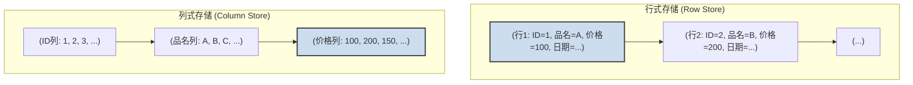
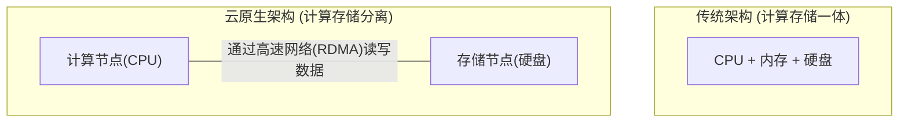
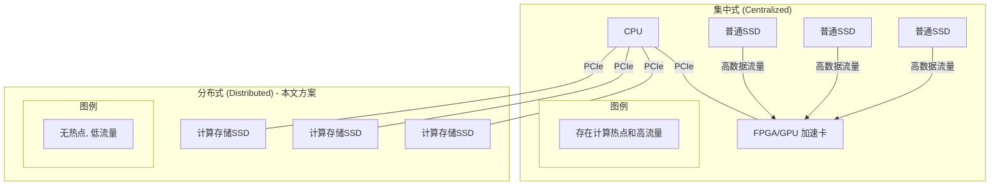
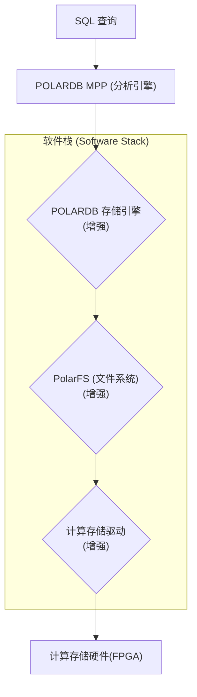
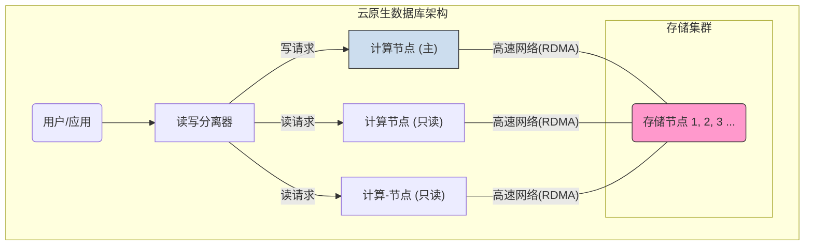
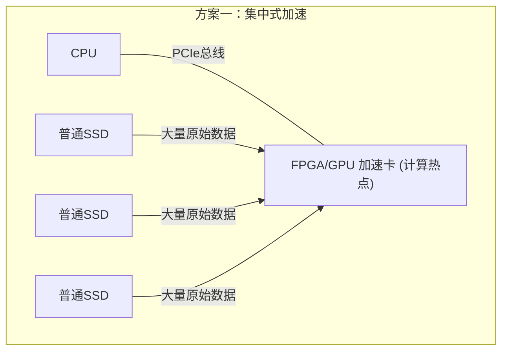
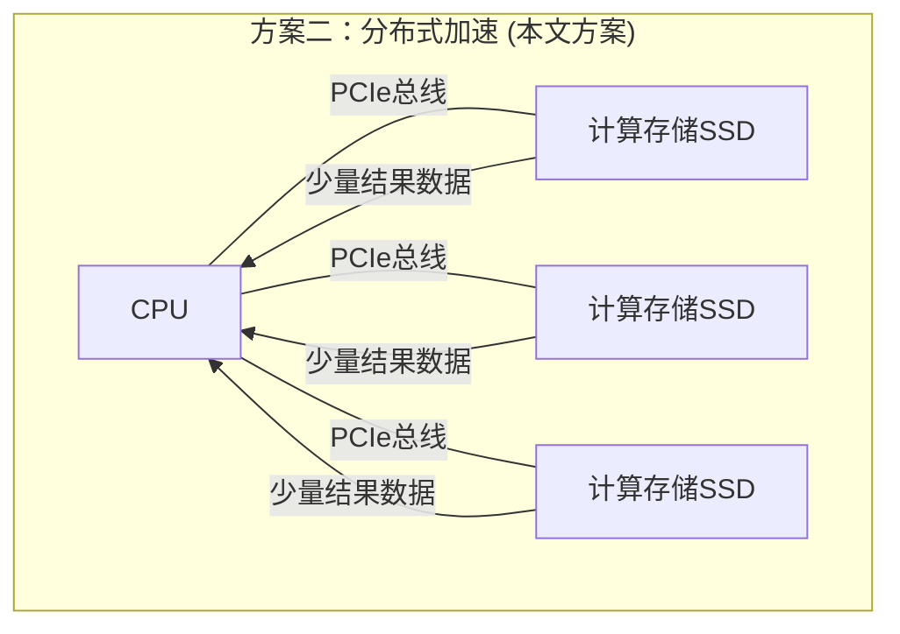
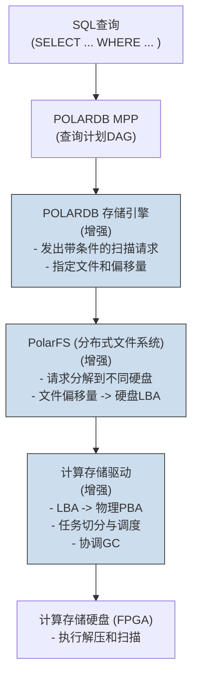
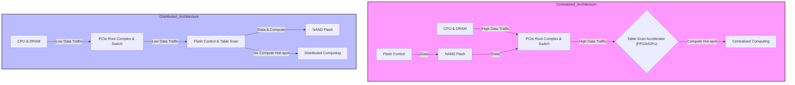
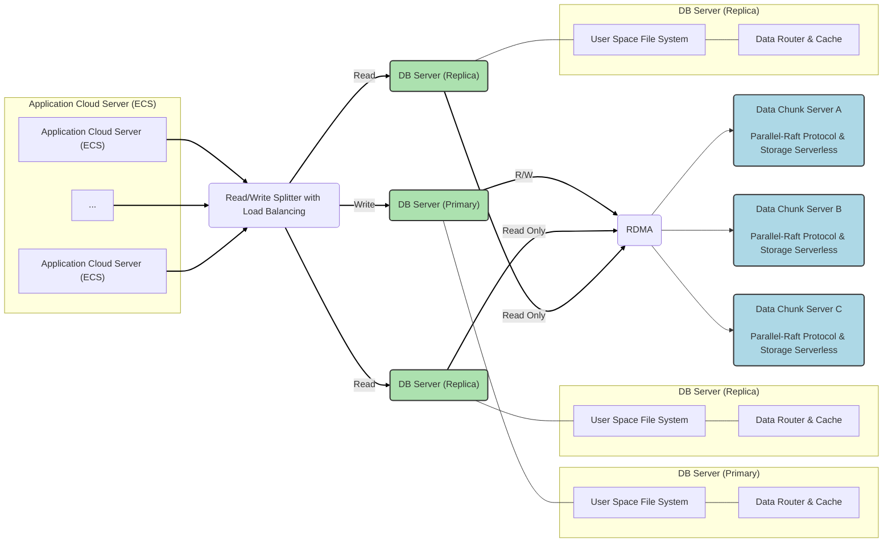

## AI论文解读 | POLARDB Meets Computational Storage: Efficiently Support Analytical Workloads in Cloud-Native Relational Database
        
### 作者        
digoal        
        
### 日期        
2025-07-15       
        
### 标签        
PostgreSQL , PolarDB , DuckDB , AI , 论文解读        
        
----        
        
## 背景  
      
https://www.usenix.org/system/files/fast20-cao_wei.pdf        
  
      
提示:        
```        
读懂《POLARDB Meets Computational Storage: Efficiently Support Analytical Workloads in Cloud-Native Relational Database》这篇论文需要提前掌握哪些基础知识, 请使用中文给我讲一下这些基础知识, 尽量通熟易懂, 可以使用markdown支持的图形增加解释性.        
        
使用中文通熟易懂的解读《POLARDB Meets Computational Storage: Efficiently Support Analytical Workloads in Cloud-Native Relational Database》这篇论文, 关键内容请深入讲解, 可以使用markdown支持的图形增加解释性.        
        
使用中文提取《POLARDB Meets Computational Storage: Efficiently Support Analytical Workloads in Cloud-Native Relational Database》论文中一些重要的术语并详细解释, 可以使用markdown支持的图形示增加解释性.        
```        
        
## 1 前置知识 
  
好的，为了完全理解《POLARDB Meets Computational Storage》这篇论文，你需要掌握一些关于数据库、计算机体系结构和存储技术的基础知识。我会将这些知识点分门别CSI，并用通俗易懂的方式和图表来解释。

-----

### 核心思想一览

在深入了解基础知识之前，我们先用一句话概括这篇论文的核心思想：

> 为了让云数据库（POLARDB）在处理大数据分析（跑报表）时更快、更省钱，阿里巴巴的工程师们没有让计算节点（CPU）去拉取全部数据再筛选，而是改造了存储节点（SSD硬盘），让硬盘自己就具备计算和筛选能力（“计算下推”），从而大幅减少了计算节点和存储节点之间的网络数据传输量，解决了性能瓶颈。

为了理解这个思想的背景、动机和具体实现，你需要了解以下几个领域。

### 1\. 数据库基础知识

这是理解论文“要做什么”和“为什么这么做”的基础。

#### a) 联机事务处理 (OLTP) vs. 联机分析处理 (OLAP)

数据库有两种主要的典型工作场景，它们的特点截然不同：

  * **OLTP (Online Transaction Processing):** 联机事务处理。可以把它想象成**银行柜台的日常业务**。

      * **特点:** 大量、简短、高并发的“增、删、改、查”操作。例如，用户下单、账户转账。
      * **要求:** 响应速度极快，每次只操作少量数据。

  *  **OLAP (Online Analytical Processing):** 联机分析处理。可以把它想象成**公司决策层的季度报表分析**。  

      * **特点:** 少量、复杂、耗时长的查询。例如，统计过去一年所有商品的销售总额、分析不同地区用户的购买习惯。
      * **要求:** 需要扫描和聚合海量数据，对吞吐量要求高。

 这篇论文要解决的核心问题就是：像 POLARDB 这样为 OLTP 场景优化的数据库，如何能**高效地处理 OLAP（分析）类任务**。  

#### b) 行式存储 (Row Store) vs. 列式存储 (Column Store)

 为了服务好 OLTP，传统数据库大多采用**行式存储**。   想象一张 Excel 表：

  * **行式存储:** 数据是按**一行一行**的方式存放在磁盘上的。
      * **优点:** 做 OLTP 操作（如查询某个订单的所有信息）时非常快，因为一条记录的所有字段都连续存放，可以一次性读出。
      *  **缺点:** 做 OLAP 操作（如统计所有订单的“总金额”）时效率低下。即使你只需要“总金额”这一列，数据库也必须把每一行的所有数据（订单号、用户ID、日期、地址…）都读到内存里，造成了巨大的 I/O 浪费。  




>  **论文关联点:** POLARDB 采用行式存储模型以更好地服务 OLTP 负载，这使得它在处理分析类任务时，网络带宽成为了一个巨大的瓶颈。   这也正是论文要“计算下推”的根本原因之一。

-----

### 2\. 云原生数据库架构

这是理解论文中“在哪里”发生问题的背景。

#### a) 计算存储分离 (Compute-Storage Decoupled Architecture)

 现代云数据库（如 Amazon Aurora, Alibaba POLARDB）为了实现高可用、高扩展和成本效益，普遍采用**计算存储分离**的架构。  

  * **计算节点 (DB Server):** 负责处理 SQL 查询、执行计算、管理事务等“脑力活”。可以轻松地增加或减少（弹性伸缩）。
  * **存储节点 (Storage Server):** 负责数据的持久化存储，即“仓库”。
  *  **网络 (RDMA):** 计算节点和存储节点通过高速网络（如 RDMA）连接。  

这种架构好比一个**大型图书馆**：

  * **读者（用户）** 向 **图书管理员（计算节点）** 提出需求：“帮我找到所有关于‘历史’的书，并统计总页数”。
  * 管理员去**书库（存储节点）**，把所有沾点边的书都用小推车运回来，然后在自己的桌子上一本本翻阅统计。




>  **论文关联点:** 分离架构的**最大瓶颈在于连接“计算”和“存储”之间的网络**。    当处理 OLAP 任务时，计算节点需要从存储节点读取海量数据，这会占满网络带宽，导致查询非常慢。  

-----

### 3\. 核心解决方案：硬件与计算模型

这是理解论文“如何解决”问题的关键。

#### a) 异构计算 (Heterogeneous Computing)

异构计算是指在一个系统中使用多种不同类型的计算单元（如 CPU、GPU、FPGA）来协同工作，以达到最优的效率。

  * **CPU (中央处理器):** 通用型选手，像一个**全能厨师**，什么菜都能做，但做某些特定菜（如大规模并行计算）时不是最高效的。
  * **GPU (图形处理器):** 并行计算高手，像一个**面点师**，可以同时做成千上万个饺子，特别适合图形渲染和机器学习。
  *  **FPGA (现场可编程门阵列):** **高度定制化的专用工具**。它是一块“白板”硬件，工程师可以根据特定任务（如本论文中的“表格扫描”）来设计最优的电路逻辑，实现极高的能效比。  

>  **论文关联点:** 论文提出的方案就是一种异构计算。它没有把所有计算任务都交给存储节点的 CPU，而是将“表格扫描”这个高度重复性的任务，卸载到了专门定制的 FPGA 硬件上。  

#### b) 计算存储 (Computational Storage)

 计算存储，顾名思义，就是**会计算的硬盘**。它将计算能力直接集成到存储设备（如 SSD）内部。  

这改变了传统的数据处理模式：

  * **传统模式:** 数据从硬盘 -\> 内存 -\> CPU -\> 计算 -\> 结果。
  * **计算存储模式:** 命令从 CPU -\> 硬盘 -\> 数据在硬盘内部计算 -\> 结果返回给 CPU。

论文对比了两种实现异构计算的架构：

1.   **集中式异构计算 (Centralized):** 在服务器上插一块专用的 FPGA/GPU 加速卡。所有数据都需要从各个 SSD 读出，通过 PCIe 总线传给这块卡进行计算。这会导致加速卡本身成为新的**性能瓶G颈**和**数据流量热点**。  
2.   **分布式异构计算 (Distributed):** 这就是计算存储的思路。把计算能力分散到每一个 SSD 内部。每个 SSD 只处理自己的数据，没有集中的瓶颈。  




>  **论文关联点:** 本文明确选择了**分布式异构计算架构**，即开发和部署了计算存储硬盘（Computational Storage Drives, CSDs），以避免集中式架构的瓶颈。  

#### c) FPGA 与 SSD 基础

  * **SSD (固态硬盘):** 使用闪存颗粒（NAND Flash）存储数据，比传统机械硬盘快得多。
  * **NVMe (Non-Volatile Memory Express):** 一种专为 SSD 设计的高速接口标准，通过 PCIe 总线直接与 CPU 连接，延迟极低。
  *  **FPGA (Field-Programmable Gate Array):** 论文中的计算存储驱动器使用了一颗 FPGA 芯片，它同时承担了**两个角色**：1) 传统的闪存控制器（管理数据读写、磨损均衡等）；2) 新增的表格扫描加速器。    这种软硬件一体化的设计是实现低成本和高性能的关键。  

-----

### 4\. 软件实现与评估

理解了硬件，还需要知道软件层面是如何配合的。

#### a) 计算下推 (Pushdown)

“下推”是一个形象的说法，指将原本在高层级（计算节点）执行的操作，**下放**到更低的层级（存储节点甚至硬盘内部）去执行。

论文中，一个 SQL 查询的“表格扫描 (Table Scan)”操作被层层下推：

1.   **POLARDB 存储引擎:** 识别出可以下推的扫描条件。  
2.   **PolarFS (文件系统):** 将文件层面的请求转换成硬盘能理解的逻辑块地址（LBA）。  
3.   **计算存储驱动:** 进一步将请求转换成物理地址（PBA），并进行任务切分和调度，最后发给 FPGA 执行。  




>  **论文关联点:** 实现这个下推路径需要对整个软件栈进行**协同改造**，这是将想法落地的核心挑战之一。  

#### b) TPC-H 基准测试

这是一个行业标准的**数据库“高考”**，专门用来评测数据库系统在处理复杂分析查询（OLAP）时的性能。它包含了一系列模拟商业决策场景的查询（Q1, Q2, ..., Q22）。

>  **论文关联点:** 论文使用 TPC-H 来评估其解决方案在真实分析负载下的效果，通过对比“不下推”、“CPU下推”、“CSD下推”三种模式下的查询延迟，来证明其方案的优越性。  

### 总结

掌握了以上知识后，你就可以轻松地理解这篇论文的脉络了：

1.   **问题:** 云原生数据库（POLARDB）采用**计算存储分离架构**和**行式存储**，非常适合 OLTP，但在处理 **OLAP** 任务时，巨大的数据扫描量导致**网络成为瓶颈**。  
2.   **思路:** 采用**异构计算**思想，将“表格扫描”任务从计算节点 **“下推”** 到存储节点。  
3.   **方案:** 不使用集中式的加速卡，而是开发了基于 **FPGA** 的**计算存储硬盘 (CSD)**，构建了一个**分布式异构计算**平台。  
4.   **实现:** 对 **POLARDB 存储引擎、PolarFS、驱动程序**等整个软件栈进行协同改造，打通了计算下推的路径。  
5.   **验证:** 通过 **TPC-H** 基准测试，证明该方案能显著降低查询延迟和数据传输量。  
  
## 2 解读论文 
  
 好的，这篇发表在存储顶会 FAST '20 上的论文，是阿里巴巴和 ScaleFlux 公司合作的成果，报告了业界首个在生产级的云原生数据库中大规模部署计算存储的案例  。下面我将为你进行深入且通俗的解读。

### 论文核心思想一览

这篇论文的核心在于解决一个问题：像阿里巴巴的 **POLARDB** 这样的现代云数据库，在处理日常交易（OLTP）时性能优越，但在进行大数据分析（OLAP，如生成复杂报表）时，会遇到严重的性能瓶颈。

论文提出的解决方案是：**与其把海量数据从“仓库”（存储节点）搬到“加工厂”（计算节点）再进行筛选，不如给“仓库”装上智能“分拣机器人”（计算存储硬盘），让数据在出库前就完成筛选，只把有用的结果送出去。**

这种“计算下推”到存储层的思想，极大地减少了网络传输的数据量，从而解决了性能瓶颈。

-----

### 1\. 问题背景：云原生数据库的“甜蜜的烦恼”

 现代云数据库（如 Alibaba POLARDB, Amazon Aurora）为了实现高可用、高扩展性和成本效益，普遍采用**计算存储分离**架构  。

  * **计算节点 (Compute Nodes):** 负责运行数据库实例、处理 SQL、执行计算等“脑力活”。
  * **存储节点 (Storage Nodes):** 负责数据的持久化存储，是“数据仓库”。
  * **高速网络 (RDMA):** 连接计算和存储节点，负责数据传输。




这种架构的**优势**在于计算和存储可以独立扩展，非常灵活。但**劣势**也随之而来：
 当执行分析类查询（如 TPC-H 基准测试）时，需要扫描巨大的表（Table Scan），导致海量数据通过网络从存储节点传输到计算节点   。这使得**网络带宽成为系统的严重瓶颈**  。

### 2\. 传统解决方案及其弊端

面对这个瓶颈，业界通常有两种思路：

1.   **增强存储节点的CPU：** 给存储节点配上更强的 CPU。但这被证明是**不经济**的，因为表格扫描这类任务并不能有效利用现代 CPU 的复杂结构（如缓存、SIMD），性价比极低  。
2.   **集中式异构计算：** 在存储服务器里插一块专用的 FPGA 或 GPU 加速卡，负责数据处理。这种方法虽然可行，但带来了新的问题  ：
      *  **高数据流量：** 所有数据都需要从各个硬盘（NVMe SSD）通过 PCIe 总线传到这块唯一的加速卡上，内部总线压力巨大  。
      *  **计算热点：** 所有计算任务都压在这块卡上，它很容易成为新的性能瓶颈，无法匹配多个高速 SSD 并发读取的巨大数据量  。




### 3\. 论文的创新方案：分布式异构计算

 论文提出了一种更优越的**分布式异构计算**架构  。其核心思想是：**不要集中的“加工厂”，而是给每个“仓库”都配上自己的“分拣机器人”**。

 具体来说，就是将普通的 SSD 替换为**计算存储硬盘 (Computational Storage Drive, CSD)**。每个 CSD 都有自己的计算能力，可以在数据读出闪存后、发送给主机前，就地完成表格扫描任务  。



**这种架构的优势是：**

  *  **低数据流量：** 原始数据不出硬盘，只有过滤后的结果数据才通过 PCIe 总线传给 CPU，流量大幅降低  。
  *  **无计算热点：** 计算任务被分散到所有硬盘上，并行处理，扩展性极强  。

 为了控制成本和开发周期，他们选择使用一颗中端 **FPGA 芯片**来打造 CSD，这颗芯片**一专多能**：既要完成传统 SSD 控制器的任务（闪存管理），也要执行表格扫描的计算任务  。

### 4\. 技术实现：贯穿软硬件的协同设计

将这个看似简单的想法落地，需要解决两大挑战。

#### 挑战一：打通整个软件栈，实现计算下推

 一个用户 SQL 查询要想到达底层硬件执行，需要穿越整个软件栈。为此，作者对从上到下的每一层都进行了增强  。



  *  **POLARDB 存储引擎：** 原始的存储引擎只会请求原始数据块，增强后，它可以将表格的结构（Schema）、过滤条件（Predicate）和数据位置（Offsets）一同打包，向下层发出一个“带计算的读请求”  。
  *  **PolarFS 文件系统：** 接收到请求后，它负责将文件层面的读请求，转换为硬盘能理解的逻辑块地址（LBA），并判断数据分布在哪些 CSD 上，将一个大请求分解成多个子请求发给不同的硬盘  。
  *  **计算存储驱动：** 这是与硬件直接交互的“指挥官”。它会将 LBA 翻译成闪存的物理地址（PBA）   ，并将大的扫描任务切分成小块，与普通的 I/O 请求和垃圾回收（GC）等后台任务**协同调度**，避免长时间计算任务饿死普通读写请求  。

#### 挑战二：用低成本 FPGA 实现高性能计算

FPGA 虽然灵活，但资源和频率远不如 CPU。为了在有限的资源下实现高吞吐率，作者采用了软硬件协同优化的策略。

1.  **硬件友好的数据块格式：**

      *  **统一数据类型：** 将所有需要比较的数据都存成“内存可比格式” (memory-comparable)，这样 FPGA 内部只需要实现一种通用的`memcmp()`比较器，而无需为不同的数据类型（整数、字符串、日期等）设计复杂的电路，极大地节省了硬件资源  。
      *  **增加块头 (Header)：** 在原始数据块的头部增加了额外的元数据，如压缩类型、键值对数量等   。这让硬件在处理数据流时，无需等待软件指令就能自行解析数据块，非常适合 FPGA 的流水线工作模式  。

    

    ```mermaid
    graph TD
        subgraph "原始数据块格式"
            A["压缩数据块"] --> B["类型(1B) + CRC(4B)"]
        end
        subgraph "硬件友好的新格式 (本文方案)"
            C["类型(1B) + Key数量(4B) + ..."] --> D["压缩数据块"] --> E["类型(1B) + CRC(4B)"]
        end
    ```

2.  **高效的 FPGA 内部设计：**

      *  采用了**并行流水线**架构，内部集成了多个数据解压引擎和扫描引擎  。
      *  扫描引擎设计巧妙，使用**递归评估**逻辑，可以处理任意复杂的“与/或”组合条件，并能“短路求值”，一旦最终结果确定就立即停止当前行的计算，提高了资源利用率  。

### 5\. 实验结果：效果显著

论文通过组件级和系统级两部分实验，证明了该方案的有效性。

  * **组件级（单个存储节点）：**

      *  **延迟和CPU占用：** 与传统的CPU扫描相比，CSD 扫描（CSD-based Scan）可以**同时大幅降低延迟和CPU使用率**。例如，在某项测试中，延迟从 55 秒降至 39 秒，CPU 占用从 514% 降至 140%  。
      *  **数据流量：** CSD 扫描能显著减少从硬盘到内存的数据流量，数据过滤效果越好（选择率越低），流量减少越明显  。

  * **系统级（真实 POLARDB 集群）：**

      *  **查询性能：** 在一个包含7个数据库节点和3个存储节点的真实 POLARDB 集群上运行 TPC-H 测试   。结果显示，随着并发请求数的增加，CSD 下推方案的优势越发明显。在128个并发请求下，11个TPC-H查询获得了超过30%的延迟降低，最高达50%  。
      *  **网络流量削减：** 计算下推到存储节点后，数据库节点和存储节点间的**网络流量**获得了巨大减少，12个TPC-H查询的网络流量减少超过70%  。这直接证明了该方案解决了最初的设计痛点。

### 总结与意义

这篇论文的重大意义不在于提出了“计算存储”这个概念，而在于：

1.   **首次展示了在真实生产级的云数据库中，进行端到端、全栈式的计算存储部署和优化**  。
2.   **提供了一套完整的、软硬件协同设计的 holistic 解决方案**  ，证明了计算存储不只是一个学术概念，而是在商业上切实可行且效果显著的技术。
3.   **证明了组件级的优化可以成功转化为系统级的显著收益**   ，为未来云基础设施如何利用新兴的计算存储硬件指明了方向  。
  
## 3 术语  
  
POLARDB Meets Computational Storage: Efficiently Support Analytical Workloads in Cloud-Native Relational Database (《POLARDB 遇见计算存储：在云原生关系型数据库中高效支持分析工作负载》) 这篇论文中涉及的几个重要术语及其详细解释如下：

### 1\. POLARDB

 **解释:** POLARDB 是阿里云设计的一种新型云原生 OLTP (在线事务处理) 数据库   。它的设计目标是满足云客户的实际需求，包括：大容量单实例存储（数十 TB）、高 TPS（每秒事务数）、高可扩展的 QoS（服务质量）和高可用性   。POLARDB 提供企业级云数据库服务，并兼容 MySQL 和 PostgreSQL   。为了实现足够的扩展性和容错性，POLARDB 遵循计算与存储分离的设计原则  。

### 2\. 计算存储 (Computational Storage)

 **解释:** 广义上讲，任何除了核心存储功能之外还能执行数据处理任务的数据存储设备都可以称为计算存储驱动器   。计算存储与 CPU 协同工作，形成异构计算系统   。这种新兴的计算存储为解决存储节点成本效益挑战提供了新机会：通过用计算存储驱动器替换普通 SSD，存储节点可以利用存储内的计算能力更有效地执行表扫描  。

### 3\. 表扫描下推 (Table Scan Pushdown)

 **解释:** 将表扫描任务从数据库节点下推到存储节点，对于云原生关系型数据库有效处理分析工作负载至关重要   。这个概念用存储节点上更重的数据处理负载，换取数据库节点和存储节点之间显著减少的网络流量   。在 POLARDB 中，计算存储驱动器能够直接在 I/O 路径上执行表扫描  。

### 4\. 云原生关系型数据库 (Cloud-Native Relational Database)

 **解释:** 云原生关系型数据库是为云环境设计的数据库系统，通常遵循计算与存储分离的设计原则，以实现更好的可伸缩性和容错性   。例如，Amazon Aurora 和阿里巴巴的 POLARDB 都是云原生关系型数据库系统   。它们通常旨在与主流开源关系型数据库（如 MySQL 和 PostgreSQL）兼容，并以比本地部署更低的成本实现 OLTP 工作负载的高性能  。

### 5\. 异构计算架构 (Heterogeneous Computing Architecture)

 **解释:** 异构计算架构通过结合不同类型的处理器（如 CPU 和专用硬件，例如 FPGA 或 GPU）来处理任务  。论文中提到了两种异构计算架构：

  *  **集中式异构计算架构 (Centralized Heterogeneous Computing Architecture):** 在这种架构中，专用硬件（如 FPGA/GPU PCIe 卡）是独立的集中式组件。这种方式存在高数据流量和数据处理热点的问题，因为所有原始数据都必须传输到 PCIe 卡进行处理  。
  *  **分布式异构计算架构 (Distributed Heterogeneous Computing Architecture):** 论文提出并采用了这种架构，通过将表扫描直接分布到每个存储驱动器中，可以消除 PCIe/DRAM 通道上的高数据流量，并避免系统中的数据处理热点  。

下图展示了集中式和分布式异构计算架构的对比：



  * **集中式架构 (a):** 数据流量大，存在计算热点。
  * **分布式架构 (b):** 数据流量低，无计算热点。

### 6\. FPGA (Field-Programmable Gate Array)

 **解释:** FPGA 是一种可编程逻辑器件，可以在硬件层面进行配置以执行特定的计算任务   。在论文中，计算存储驱动器采用基于 FPGA 的主机管理架构，一个中低成本的 Xilinx FPGA 芯片同时处理闪存控制和表扫描，从而降低了开发成本和实现成本  。

### 7\. PolarFS

 **解释:** PolarFS 是 POLARDB 部署所依赖的分布式文件系统，它管理着所有存储节点上的数据存储   。PolarFS 负责将来自 POLARDB 存储引擎的表扫描请求转换为适用于计算存储驱动器的 LBA（逻辑块地址）形式  。

### 8\. 计算存储驱动程序 (Computational Storage Driver)

 **解释:** 计算存储驱动程序是位于内核空间的主机端驱动程序，它管理着计算存储驱动器，并将其作为块设备暴露   。该驱动程序负责解析和重新安排扫描条件，将数据位置信息从 LBA 域转换为 PBA（物理块地址）域，并将大型扫描任务划分为更小的子任务，以及协同调度垃圾回收（GC）和表扫描以最小化干扰  。

### 9\. 内存可比较格式 (Memory-Comparable Format)

 **解释:** 为了方便 FPGA 实现表扫描，POLARDB 存储引擎的数据块格式被修改为内存可比较格式，即所有表数据都以可以使用 `memcmp()` 函数进行比较的格式存储   。这使得计算存储驱动器只需要实现一种类型的比较器，从而大大减少了 FPGA 资源的使用  。

### 10\. POLARDB 架构图 (POLARDB Architecture Diagram)

 POLARDB 采用计算与存储分离的架构。数据库计算节点和存储节点通过高速 RDMA 网络连接   。在每个 POLARDB 实例中，有一个读/写数据库节点处理读写请求，其他数据库节点只处理读请求   。所有节点都可以访问存储节点上的相同数据副本  。



  * **应用云服务器 (Application Cloud Server - ECS):** 用户应用通过 ECS 访问数据库。
  * **读/写分离器 (Read/Write Splitter with Load Balancing):** 负责将读写请求分发到不同的数据库服务器。
  * **数据库服务器 (DB Server):** 包括主服务器 (Primary) 和副本服务器 (Replica)，处理数据库操作。主服务器处理读写请求，副本服务器处理读请求。
  * **RDMA:** 高速网络连接，用于数据库计算节点和存储节点之间的通信。
  * **数据块服务器 (Data Chunk Server):** 存储实际数据的后端存储节点。

### 11\. 逻辑块地址 (LBA) 与 物理块地址 (PBA)

**解释:**

  *  **LBA (Logical Block Address):** 逻辑块地址，是文件系统中用于访问数据的抽象地址，与数据在文件中的偏移量相关  。
  *  **PBA (Physical Block Address):** 物理块地址，是数据在 NAND 闪存中实际的固定位置   。计算存储驱动程序负责将 LBA 转换为 PBA  。

希望这些解释能帮助您更好地理解这篇论文的核心概念。
  
## 参考        
         
https://www.usenix.org/system/files/fast20-cao_wei.pdf  
        
        
<b> 以上内容基于DeepSeek、Qwen、Gemini及诸多AI生成, 轻微人工调整, 感谢杭州深度求索人工智能、阿里云、Google等公司. </b>        
        
<b> AI 生成的内容请自行辨别正确性, 当然也多了些许踩坑的乐趣, 毕竟冒险是每个男人的天性.  </b>        
    
  
  
#### [期望 PostgreSQL|开源PolarDB 增加什么功能?](https://github.com/digoal/blog/issues/76 "269ac3d1c492e938c0191101c7238216")
  
  
#### [PolarDB 开源数据库](https://openpolardb.com/home "57258f76c37864c6e6d23383d05714ea")
  
  
#### [PolarDB 学习图谱](https://www.aliyun.com/database/openpolardb/activity "8642f60e04ed0c814bf9cb9677976bd4")
  
  
#### [PostgreSQL 解决方案集合](../201706/20170601_02.md "40cff096e9ed7122c512b35d8561d9c8")
  
  
#### [德哥 / digoal's Github - 公益是一辈子的事.](https://github.com/digoal/blog/blob/master/README.md "22709685feb7cab07d30f30387f0a9ae")
  
  
#### [About 德哥](https://github.com/digoal/blog/blob/master/me/readme.md "a37735981e7704886ffd590565582dd0")
  
  

  
